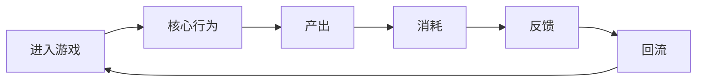
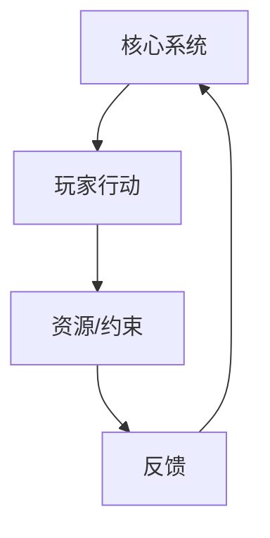

# <game_name> 游戏拆解稿

## 元信息

- 状态：
- 拆解范围：
- 材料来源：
- 目标问题：
- 最后更新：

## 拆解结论摘要

- 
- 
- 

## 证据地图

| 证据 | 类型 | 说明 | 支撑模块 |
| --- | --- | --- | --- |

## 模块1：游戏核心定位、基础信息、商业大盘复盘

### 结论

### 对本项目的启示

## 模块2：全局玩家体验与底层设计目标

### 结论

### 对本项目的启示

## 模块3：核心玩法循环

### 结论

### 核心循环图

### 对本项目的启示

## 模块4：全链路游戏架构拆解

### 结论

### 系统关系图

### 对本项目的启示

## 模块5：内容与关卡体系

### 结论

### 对本项目的启示

## 模块6：数值体系与经济资源闭环

### 结论

### 对本项目的启示

## 模块7：叙事体系、角色 IP 与视听包装

### 结论

### 对本项目的启示

## 模块8：优劣复盘与可落地优化方案

### 可复用亮点

### 真实短板

### 优化方案

## 对本项目的转化

### 可借鉴结构

### 可转化设计假设

### 当前状态

Research / Prototype Lab

## 未确认信息

- 
