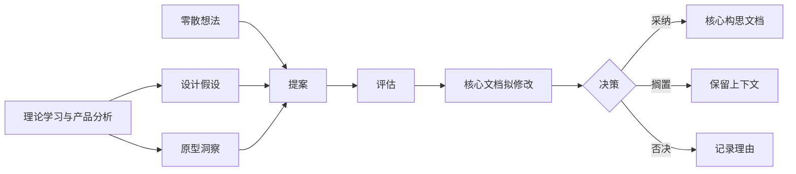

# 游戏构思系统

一个面向早期游戏创意、理论学习、同类产品分析和核心玩法沉淀的 Markdown 工作流。

本仓库当前服务于一款 2D 回合制卡牌对战游戏构思：玩家围绕“唯一核心卡”进行构筑，通过通用辅助卡、费用管理和组合规则形成差异化战术。仓库不直接实现游戏代码，而是提供一套可追踪、可复盘、可扩展的游戏构思系统。

## 适合谁使用

- 正在从零整理游戏创意的个人开发者。
- 想把零散灵感推进为可验证玩法假设的新手策划。
- 希望学习卡牌游戏、回合制对战、系统设计和同类产品分析的人。
- 需要把调研、提案、评估和正式设计结论分开的团队。

## 当前项目一句话

一款围绕唯一核心卡构筑组合的 2D 回合制卡牌对战游戏。玩家以机制固定、不可资源化的核心卡作为身份与构筑中心，通过通用辅助卡、费用管理和组合激活形成差异化战术。

## 仓库结构

```text
.
├── game-design-workflow/     # 游戏构思主流程：想法、提案、评估、拟修改、正式核心文档
├── research/                 # 理论学习与同类产品分析：资料、摘要、案例、假设、复盘
├── docs/                     # 面向读者和协作者的说明文档
└── archive/                  # 历史快照，保留旧版本上下文
```

## 快速开始

1. 先读 [新手架构说明](docs/architecture-for-beginners.md)，理解两个主系统如何配合。
2. 再读 [核心构思文档](game-design-workflow/core-concept.md)，了解当前已经确认的游戏方向。
3. 如果你有一个新想法，复制 [想法模板](game-design-workflow/templates/idea-template.md)，写入 `game-design-workflow/idea-inbox/`。
4. 如果你做了资料学习或同类产品分析，从 [研究工作流](research/README.md) 开始，把结论沉淀为可验证假设。
5. 只有经过提案、评估和拟修改确认的内容，才进入 `game-design-workflow/core-concept.md`。

## 核心工作流



## 关键原则

- 核心文档只写已经确认值得保留的内容。
- 调研结论不能直接改核心构思，必须先变成设计假设或提案。
- 评估阶段只判断核心玩法是否值得继续，不提前展开完整数值系统。
- 每次正式修改核心构思，都要同步更新决策记录。
- 过程文档和被否决的想法也有价值，因为它们记录了判断路径。

## 主要入口

- [游戏构思工作流](game-design-workflow/README.md)
- [核心构思文档](game-design-workflow/core-concept.md)
- [决策记录](game-design-workflow/decision-log.md)
- [研究工作流](research/README.md)
- [资料来源索引](research/source-index.md)
- [当前问题清单](research/00-index-and-roadmap/current-questions.md)

## 发布状态

当前仓库处于“构思系统整理完成，可继续补充发布信息”的阶段。若要作为正式 GitHub 项目发布，建议后续再补充：

- `LICENSE`
- 示例 issue 模板
- 更完整的原型验证记录
