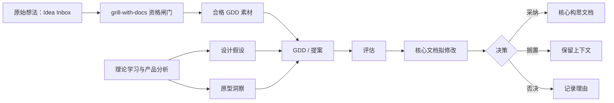

# 游戏构思系统

一个面向早期游戏创意、理论学习、同类产品分析和核心玩法沉淀的 Markdown 工作流。

本仓库当前服务于一款围绕“唯一核心卡”展开构筑、探索、资源竞争、交易与回合制卡牌对战的 2D 系统型游戏构思。仓库不直接实现游戏代码，而是提供一套可追踪、可复盘、可扩展的游戏构思系统。

## 适合谁使用

- 正在从零整理游戏创意的个人开发者。
- 想把零散灵感推进为可验证玩法假设的新手策划。
- 希望学习卡牌游戏、回合制对战、系统设计和同类产品分析的人。
- 需要把调研、提案、评估和正式设计结论分开的团队。

## 当前项目一句话

一款围绕唯一核心卡展开构筑、探索、资源竞争、交易与回合制卡牌对战的 2D 系统型游戏。玩家以机制固定、不可资源化的核心卡作为身份与长期资产，通过通用辅助卡、费用管理、共享世界和组合激活形成差异化路线。

## 仓库结构

```text
.
├── game-design-workflow/     # 游戏构思主流程：想法、提案、评估、拟修改、正式核心文档
├── research/                 # 理论学习与同类产品分析：资料、摘要、案例、假设、复盘
├── docs/                     # 协作说明、导航、总控与代码开发进度索引
└── archive/                  # 历史快照，保留旧版本上下文
```

## 快速开始

1. 先读 [新手架构说明](docs/architecture-for-beginners.md)，理解两个主系统如何配合。
2. 再读 [核心构思文档](game-design-workflow/core-concept.md)，了解当前已经确认的游戏方向。
3. 如果你有一个新想法，先用 [原始想法模板](game-design-workflow/templates/idea-template.md) 放入 `idea-inbox/`；它此时只是隔离保存，不能进入正式设计链。
4. agent 使用 `grill-with-docs` 把想法澄清为符合 GDD 要求的素材，通过后写入 `idea-materials/`。
5. 如果你要写 GDD，使用 [GDD 写作要求与模板](game-design-workflow/templates/gdd-writing-requirements-and-template.md)，并让 agent 主动检索正式素材和相关 inbox 候选。
6. 如果你要查看代码实现、里程碑或与 GDD 的偏差，进入 [代码开发进度索引](docs/code-development-index.md)；详细技术说明留在对应代码仓库。
7. 如果你做了资料学习或同类产品分析，从 [研究工作流](research/README.md) 开始，把结论沉淀为可验证假设。
8. 只有经过提案、评估和拟修改确认的内容，才进入 `game-design-workflow/core-concept.md`。

## 核心工作流


```mermaid
flowchart LR
    A["原始想法：Idea Inbox"] --> Q["grill-with-docs 资格闸门"]
    Q --> M["合格 GDD 素材"]
    M --> B["GDD / 提案"]
    B --> C[评估]
    C --> D[核心文档拟修改]
    D --> E{决策}
    E -->|采纳| F[核心构思文档]
    E -->|搁置| G[保留上下文]
    E -->|否决| H[记录理由]

    I[理论学习与产品分析] --> J[设计假设]
    J --> B
    I --> K[原型洞察]
    K --> B
```

## 关键原则

- 核心文档只写已经确认值得保留的内容。
- `idea-inbox/` 只隔离保存原始想法；模糊内容不能作为 GDD、提案或核心构思的有效材料。
- 只有通过 `grill-with-docs` 资格闸门并进入 `idea-materials/` 的内容，才能被正式设计文档引用。
- 写 GDD 时必须使用统一模板，并主动审查正式素材与相关 inbox 候选。
- GDD 只记录核心玩法设计与设计决策；代码架构和开发完成度只进入代码开发进度索引或实现仓库。
- 调研结论不能直接改核心构思，必须先变成设计假设或提案。
- 评估阶段只判断核心玩法是否值得继续，不提前展开完整数值系统。
- 每次正式修改核心构思，都要同步更新决策记录。
- 过程文档和被否决的想法也有价值，因为它们记录了判断路径。

## 主要入口

- [Agent 操作手册](AGENTS.md)
- [领域词汇](CONTEXT.md)
- [GitHub 协作规范](docs/github-collaboration.md)
- [项目总控中心](docs/control-center.md)
- [工作区地图](docs/workspace-map.md)
- [代码开发进度索引](docs/code-development-index.md)
- [游戏构思工作流](game-design-workflow/README.md)
- [正式想法素材库](game-design-workflow/idea-materials/README.md)
- [GDD 文档区](game-design-workflow/gdd/README.md)
- [GDD 写作要求与模板](game-design-workflow/templates/gdd-writing-requirements-and-template.md)
- [核心构思文档](game-design-workflow/core-concept.md)
- [决策记录](game-design-workflow/decision-log.md)
- [研究工作流](research/README.md)
- [资料来源索引](research/source-index.md)
- [当前问题清单](research/00-index-and-roadmap/current-questions.md)

## 当前总控重点

- 正式主线仍是“唯一核心卡 + 通用辅助卡 + 激活费用 + 组合规则表 + 共享世界资源循环 + 回合制对战”。
- 当前阶段优先推进整体系统构思，不再只围绕卡牌战斗展开。
- 新输入先分流到 `Raw Idea / Qualified GDD Material / GDD / Proposal / Research / Evaluation`；未通过资格闸门的内容只能留在 inbox。
- `media-analysis-lab/` 是独立实验区，用于验证游戏拆解工作流，不等同于正式设计主线。

## 发布状态

当前仓库处于“构思系统整理完成，可继续补充发布信息”的阶段。若要作为正式 GitHub 项目发布，建议后续再补充：

- `LICENSE`
- 示例 issue 模板
- 更完整的原型验证记录
