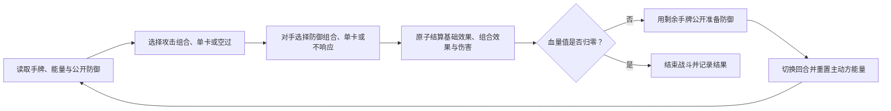
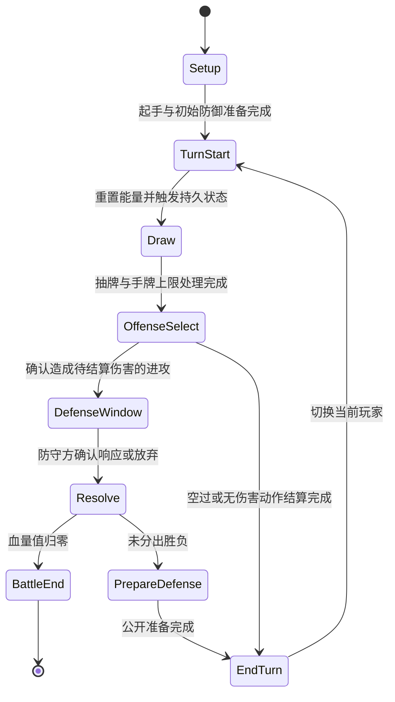

# 《唯一核心卡成语组合战斗系统》GDD

> 归档状态：`Archived / Superseded`
>
> 2026-08-22 用户决定重新设计战斗系统。本文件只保留旧方案及其证据，不再作为当前实现或新战斗 GDD 的默认基线。

## 0. 文档控制 `[必填]`

| 字段 | 内容 |
| --- | --- |
| 文档 ID | `GDD-BATTLE-001` |
| 当前版本 | `0.1.1-archived` |
| 文档成熟度 | `GDD-1` |
| 设计状态 | `Parked` |
| 负责人 | `战斗设计` |
| 评审人 | `用户 / 程序 / QA（待指定）` |
| 创建日期 | `2026-08-21` |
| 最近更新 | `2026-08-22` |
| 目标里程碑 | `Archived`；不再推进 `combat-lab v2` |
| 关联提案 | [卡牌战斗系统细化 v2](../../../../game-design-workflow/idea-proposals/P-2026-05-13-card-battle-v2.md) |
| 关联正式素材 | [成语组合核心卡](../../../../game-design-workflow/idea-materials/M-2026-08-21-idiom-combo-core-cards.md)、[攻防共享周期战斗能量](../../../../game-design-workflow/idea-materials/M-2026-08-21-shared-cycle-combat-energy.md) |
| 待确认 inbox 候选 | 已检索；相关成语组合与费用 inbox 均已晋级，旧综合构思不作为本章直接来源 |
| 关联评估 | [唯一核心卡战斗与共享地图评估](../../../../game-design-workflow/evaluations/E-2026-05-13-unique-core-card-battle-map.md) |
| 关联决策 | [决策记录](../../../../game-design-workflow/decision-log.md) |
| 关联原型/测试 | [`combat-lab`](../../combat-lab/README.md)、[v0 无费用基线](../../combat-lab/reports/2026-08-21-v0-winrate-baseline.md)、[v1 费用基线](../../combat-lab/reports/2026-08-21-v1-energy-baseline.md) |

### 0.1 本版目标

把截至 2026-08-21 已确认的战斗构思、首批羊/舟卡组、费用规则、结算边界、自动化测试和条件胜率模型组织成可实现、可复测的战斗系统章节。本文用于指导下一版原型，不声称当前数值已经平衡或已经通过真人可玩性验证。

### 0.2 本版范围

**包含：**

- 两名玩家、一张参战核心卡、通用辅助卡和公开成语组合。
- 抽牌、进攻、公开防御准备、防御响应、结算和回合切换。
- 攻防共享周期战斗能量、组合整体定价和辅助卡单独行动。
- 攻击/防御性质与瞬时/持久时效。
- 首批羊、舟核心卡及 8 个公开组合。
- 确定性规则原型、组合枚举、启发式 AI、胜率模拟和验收指标。

**明确不包含：**

- 共享地图、资源掉落、交易、成长和战后收益。
- 真实 AI 生成核心卡管线、自动化动态平衡后台和完整效果池。
- 最终 UI、音画、联网、存档、平台与无障碍制作规格。
- 最终卡组规模、单局时长、回合上限、投降和牌库耗尽规则。
- 把首测数值或模拟条件胜率直接认定为正式平衡结论。

### 0.3 证据状态摘要

| 结论/模块 | 状态 | 依据或下一步 |
| --- | --- | --- |
| 唯一核心卡 + 通用辅助卡 + 组合规则表 | `Confirmed` | 已进入核心构思，并由 `combat-lab` 实现首批样例 |
| 每张首测核心卡公开 4 个成语组合且无常驻被动 | `Confirmed` | 成语组合正式素材；数据目录校验通过 |
| 字段多重集合、基础效果先于组合效果 | `Confirmed` | 用户确认；自动化测试与原型实现 |
| 固定 4 点攻防共享能量与组合整体定价 | `Confirmed` | 费用正式素材；费用与原子回滚测试通过 |
| 20 卡、30 血、4 张起手、7 张手牌上限、12 轮上限 | `Hypothesis` | 仅为 `combat-lab v1` 首测基准，需真人原型复审 |
| 首批羊/舟卡组已经平衡 | `Confirmed: False` | 多策略模拟发生 18.25%–69.05% 的羊得分率跨度 |
| 组合机制可构筑、好玩且差异健康 | `Hypothesis` | 需要低字段密度多构筑对照与真人测试 |
| 目标平台、输入方式和正式单局时长 | `Unknown` | 战斗可玩原型进入 UI 制作前决定 |

### 0.4 本次变更摘要

| 版本 | 日期 | 修改人 | 变更内容 | 原因/依据 | 影响范围 |
| --- | --- | --- | --- | --- | --- |
| 0.1.0 | 2026-08-21 | Codex | 首次建立战斗系统 GDD-1，纳入组合、费用、测试与模拟证据 | 用户明确要求确定为 GDD 战斗章节 | 战斗规则、卡牌数据、原型与验收 |
| 0.1.1-archived | 2026-08-22 | Codex | 归档并停止作为当前战斗实现基线 | 用户明确要求重新设计新战斗系统 | 全文状态、后续里程碑与引用 |

### 0.5 素材审查 `[必填]`

**正式素材候选：**

| 素材 | 与本 GDD 的关系 | 建议章节 | 用户决定 | 处理说明 |
| --- | --- | --- | --- | --- |
| [成语组合核心卡](../../../../game-design-workflow/idea-materials/M-2026-08-21-idiom-combo-core-cards.md) | 核心组合规则与首批内容 | 3–7、14–16 | `Include` | 规则语义纳入；数值标记为首测基准 |
| [攻防共享周期战斗能量](../../../../game-design-workflow/idea-materials/M-2026-08-21-shared-cycle-combat-energy.md) | 行动经济、费用与原子扣费 | 3–6、14–16 | `Include` | 费用框架纳入；当前价格保持待调 |
| [核心卡身份与所有权](../../../../game-design-workflow/idea-materials/M-2026-08-18-core-card-identity-and-ownership.md) | 战斗中一张核心卡的上游约束 | 3、7.3 | `Park` | 仅采用“每场战斗一张参战核心卡”；账户所有权、替换与交易不在本章决定 |
| [共享地图探索循环](../../../../game-design-workflow/idea-materials/M-2026-08-18-shared-map-exploration-loop.md) | 战斗的外部触发与结果消费者 | 0.2 | `Omit` | 不进入战斗内部规则 |

**未确认 inbox 候选：**

| 原始想法 | 相关性 | 缺失的资格字段 | 处理结果 |
| --- | --- | --- | --- |
| [成语组合原始想法](../../../../game-design-workflow/idea-inbox/2026-08-21-idiom-combo-core-cards.md) | 直接相关 | 无；资格字段已全部清楚 | 已晋级为正式素材并纳入 |
| [费用原始想法](../../../../game-design-workflow/idea-inbox/2026-08-21-shared-cycle-combat-energy.md) | 直接相关 | 无；已经过原型验证 | 已晋级为正式素材并纳入 |
| [早期综合构思](../../../../game-design-workflow/idea-inbox/2026-05-13-unique-core-card-battle-map.md) | 部分战斗内容相关 | 新流程复审仍混合地图、交易等未确认内容 | 不直接引用；只引用其后续 Accepted 提案、决策与已晋级子素材 |

## 1. 产品与体验合同 `[必填]`

### 1.1 一句话概念

> 玩家以一张唯一核心卡作为战斗身份，在两人轮流回合中组合带有中文字段的通用辅助卡，为击破对手在当前进攻与下一次防御之间分配手牌和 4 点共享能量，并通过可记忆、可计算的公开成语组合形成不同构筑路线。

### 1.2 目标玩家与情境

| 项目 | 内容 |
| --- | --- |
| 核心目标玩家 | `Hypothesis`：喜欢卡组构筑、公开信息博弈和中文语义组合的玩家 |
| 次级玩家 | `Unknown`：轻度卡牌玩家是否能通过成语快速入门 |
| 单局/单次时长 | `Unknown`；首测只以最多 12 个完整回合作为模拟边界 |
| 平台与输入 | `Unknown`；当前原型为 Python CLI，无正式玩家输入界面 |
| 玩家已有知识 | 理解抽牌、手牌、血量、护盾、费用和轮流回合；字段匹配需要教学 |
| 非目标玩家/体验 | 不优先服务依赖隐藏随机爆发、长反应链、复杂场面单位运营或纯数值碾压的体验 |

### 1.3 玩家体验承诺

玩家应能说明：“我看得懂自己的核心卡想组成哪些成语，也知道这回合进攻会牺牲哪些下回合防御；换一批辅助卡后，同一核心卡的打法会发生变化。”

### 1.4 设计支柱

| 设计支柱 | 玩家可观察表现 | 支持它的规则 | 反面信号 |
| --- | --- | --- | --- |
| 可计算、可预估 | 玩家能由公开手牌区、准备区、能量和组合表缩小对手行动范围 | 有限效果池、公开费用、确定结算顺序、原子动作 | 关键结果依赖未公开随机数或临时解释 |
| 可通过外部参数平衡 | 调整费用、字段供给或组合数值时不改写核心卡身份 | 组合规则表、整体定价、字段/效果分层 | 只能直接改写核心卡机制才能修复胜率 |
| 可构筑 | 玩家会比较同字段辅助卡的基础效果并调整字段密度 | 属性绑定基础效果、字段绑定组合条件、等价材料 | 最优卡组由自动堆满核心字段唯一决定 |
| 决策重心变化 | 玩家在进攻、留牌、防御准备、单卡保底和持久收益之间切换 | 攻防共享能量、跨回合留牌、瞬时/持久组合 | 每回合机械打出同一最高收益组合 |
| 核心卡与卡牌组合多样 | 羊、舟使用不同材料负担与攻防结构 | 每张核心卡 4 个公开组合，允许不同象限偏向 | 不同核心卡只换名称，行动结构与构筑完全相同 |

### 1.5 反支柱

| 本游戏不追求什么 | 为什么 | 因此不采用什么方案 |
| --- | --- | --- |
| 不可读的生成式复杂度 | AI 将生成大量核心卡，无法计算就无法筛选和平衡 | 首版不开放任意脚本、递归触发和无限效果组合 |
| 长反应链 | 会削弱回合节奏与可预估性 | 每次进攻至多一个防御响应，不允许响应中继续插入动作 |
| 辅助卡场面经营 | 会把焦点从手牌组合和核心卡身份移走 | 辅助卡结算后进入弃牌区；只有持久组合保留结构化状态 |
| 费用与材料双重计费 | 多材料组合已承担手牌与构筑成本 | 组合采用整体费用，材料单卡费用不重复累加 |

### 1.6 核心假设

> 如果玩家能用中文成语快速理解公开组合，并反复在辅助卡基础效果、字段匹配、当前进攻和下一次防御之间做可解释取舍，那么唯一核心卡可以同时形成身份感、构筑空间和临场差异。

- 状态：`Hypothesis`
- 当前依据：规则已实现且多策略 AI 会产生不同选择结构；尚无真人行为证据。
- 最大反证风险：最优构筑退化为堆字段，或单卡/某一组合长期统治行动，玩家不需要比较方案。

### 1.7 下一验证问题 `[必填]`

- 当前最大风险：羊、舟的结构与字段供给差异远大于费用的可调节范围。
- 下一步只验证什么问题：字段密度对组合率、无动作率、策略差和胜率差的影响。
- 最小验证方式：保持 8 个组合身份和 4 点能量不变，为羊、舟各建立多套字段密度对齐的 20 卡候选，进行组合枚举、三策略、多种子和镜像模拟。
- 成功信号：存在不唯一的有效构筑；多策略下双方胜率差明显收敛；每个公开组合都有使用与放弃场景。
- 失败/停止信号：降密度后长期无动作，或任何合理构筑仍需极端费用才能缩小胜率差。

## 2. 核心循环与玩家旅程 `[必填]`

### 2.1 核心循环

最小循环是一次攻防交换；一个攻防周期从玩家己方回合开始，到其下一次己方回合重置能量前结束。

### 2.2 多时间尺度循环

| 时间尺度 | 起点 | 玩家动作 | 反馈/奖励 | 结束条件 | 再次进入动机 |
| --- | --- | --- | --- | --- | --- |
| 单次交换 | 选择一个进攻动作 | 组合/单卡、响应或空过 | 伤害、护盾、手牌、状态与能量变化 | 原子结算完成 | 根据新状态准备防御或下一回合 |
| 攻防周期 | 己方能量重置 | 进攻并保留能量，随后响应对手 | 当前收益与未来防御范围 | 下次己方回合开始 | 重新分配完整 4 点能量 |
| 单局战斗 | 双方完成起手与初始准备 | 轮流进行攻防周期 | 血量差、组合表现和胜负 | 血量归零；模拟器另有回合上限 | 复盘牌序、组合和能量选择 |
| 战后构筑 | 查看对局统计 | 调整辅助卡字段与基础效果分布 | 组合率、单卡率、胜率与体验反馈 | 提交下一套卡组 | 优化同一核心卡或比较不同核心卡 |

### 2.3 玩家旅程 `[必填：GDD-1]`

| 阶段 | 玩家目标 | 可见信息 | 可选动作 | 关键决策/代价 | 系统反馈 | 失败与恢复 |
| --- | --- | --- | --- | --- | --- | --- |
| 战斗准备 | 理解双方核心卡路线 | 两张核心卡、各 4 个公开组合、卡组 | 确认参战 | 当前原型不允许临局换牌 | 展示组合表 | 数据非法则不能开局 |
| 起手 | 识别近期攻防可能 | 4 张起手、字段、基础效果 | 初始防御准备 | 准备牌暂时离开手牌 | 准备区公开显示 | 无合法准备可空置 |
| 己方回合开始 | 更新可用资源 | 4 点能量、状态触发、抽牌结果 | 查看、排序、比较 | 持久效果先触发；手牌上限约束 | 分步日志与数值变化 | 超限按规则弃牌；玩家规则待定 |
| 进攻选择 | 获得当前收益 | 合法组合、单卡、对方准备和剩余能量 | 选一项或空过 | 材料、行动位、费用与未来防御 | 预览成本和效果顺序 | 取消确认前不改变状态 |
| 防御响应 | 降低或反转来袭收益 | 来袭伤害、准备区、剩余能量 | 选一项或不响应 | 使用唯一响应位并消耗准备材料 | 显示抵挡、护盾、回复或反击 | 无伤害或费用不足时不可响应 |
| 回合结束 | 为对手回合留出方案 | 剩余手牌、字段与能量 | 公开准备一个防御方案 | 准备牌会减少下回合可用手牌 | 显示对手可见准备 | 未使用准备在窗口结束后回手 |
| 战斗结束 | 理解胜负原因 | 血量、回合日志、组合/单卡统计 | 复盘 | 当前无正式战后奖励 | 输出胜负和关键指标 | 模拟上限结束时按血量比较 |

### 2.4 胜利、失败、撤退与退出

- 胜利条件：使对手血量值降至 0；双方同时归零时为平局。
- 失败条件：自身血量值降至 0。
- 主动撤退/投降：`Unknown`，不在 `combat-lab v1` 中。
- 中断与恢复规则：`Unknown`，依赖正式客户端与联网模型。
- 牌库耗尽：当前抽不到牌但不直接失败；是否采用疲劳规则为 `Unknown`。
- 模拟边界：每名玩家最多行动 12 回合；未击倒时比较血量值，血量相同则平局，护盾不参与。该规则仅为测试基准。
- 玩家如何理解结果：正式客户端必须提供最终血量、伤害来源、组合使用和关键行动日志；当前 CLI 输出结构化报告。

## 3. 规则总览 `[必填：GDD-1]`

### 3.1 核心名词

| 术语 | 唯一定义 | 不等同于 | 首次教学位置 |
| --- | --- | --- | --- |
| 核心卡 | 每场战斗唯一指定组合规则与身份的卡，不作为组合材料消耗 | 辅助卡、账户库存 | 战斗准备 |
| 辅助卡 | 具有一个属性、一个低数值基础效果和若干字段的通用构筑材料 | 核心卡、持久状态 | 构筑/起手 |
| 字段 | 只用于满足组合多重集合条件的离散标签 | 属性、基础效果 | 组合教学 |
| 属性 | 决定辅助卡基础效果类型的分类 | 字段、组合性质 | 卡牌详情 |
| 组合 | 当前核心卡规则表与若干辅助卡实例共同形成的一次动作 | 多张辅助卡费用相加 | 组合教学 |
| 战斗能量 | 己方回合重置、跨当前攻防周期共享的 4 点行动预算 | 世界资源、长期经济 | 首回合 |
| 防御准备区 | 回合结束时从剩余手牌中公开放置的下一次防御候选材料区 | 手牌、场面 | 首次回合结束 |
| 持久状态 | 持久组合消耗材料后留下、按规定次数触发的结构化效果 | 留在场面的辅助卡 | 首次持久组合 |

### 3.2 全局规则与不变量

| ID | 不变量/全局规则 | 适用范围 | 破坏时的处理 |
| --- | --- | --- | --- |
| INV-001 | 每名参战玩家恰好指定一张核心卡 | 单局 | 阻止开局 |
| INV-002 | 首测核心卡恰好公开 4 个组合，至少含一个攻击和一个防御组合 | 内容目录 | 数据校验失败 |
| INV-003 | 同一辅助卡实例在一次动作中只能填一个字段槽位，结算后进入弃牌区 | 组合动作 | 动作非法并原子回滚 |
| INV-004 | 组合材料数量必须恰好等于字段槽位数，顺序不影响匹配 | 组合枚举 | 不进入合法行动列表 |
| INV-005 | 一个进攻行动位只能选择组合、单卡或空过之一；防御响应位同理 | 攻防阶段 | 拒绝第二个动作 |
| INV-006 | 组合只支付登记的整体费用，不累加材料单卡费用 | 费用结算 | 目录/结算测试失败 |
| INV-007 | 任何动作先完整校验，再统一提交；失败不得留下部分状态变化 | 所有动作 | 使用状态副本回滚 |
| INV-008 | 核心卡组合身份由字段条件和效果语义定义；数值、费用和字段供给是可调外部参数 | 平衡更新 | 重大身份变化需另走设计变更 |

### 3.3 时间与结算单位

- 时间模型：轮流完整回合 + 进攻阶段内一个防御响应窗口。
- 最小结算单位：一次不可插入的进攻动作及其至多一个防御响应。
- 暂停规则：玩家确认动作前可取消；进入结算后不可取消。
- 同时事件：当前无真正并发；按攻击材料基础效果、攻击组合、防御材料基础效果、防御组合、最终伤害顺序串行处理。
- 默认优先级：抵挡先减少待结算伤害，护盾再吸收，最后扣除血量值。
- 随机种子/重放要求：规则原型必须接受固定种子并复现相同洗牌、选择和结果。

### 3.4 系统清单与依赖

| 系统 ID | 系统名称 | 玩家目的 | 上游输入 | 下游影响 | 负责人 | 当前状态 |
| --- | --- | --- | --- | --- | --- | --- |
| SYS-001 | 回合、区域与行动位 | 形成可读的攻防节奏 | 卡组、先手、回合状态 | 抽牌、准备、动作窗口 | 战斗设计 | `Prototype Tested` |
| SYS-002 | 辅助卡与成语组合 | 围绕核心卡选择材料和时机 | 核心卡规则表、手牌字段 | 效果、弃牌、持久状态 | 卡牌设计 | `Prototype Tested` |
| SYS-003 | 攻防共享战斗能量 | 在当前进攻与下一次防御间取舍 | 费用表、当前能量 | 合法动作和保留防御范围 | 数值设计 | `Prototype Tested / Revision Needed` |
| SYS-004 | 效果、伤害与持久状态 | 产生确定、可解释的战斗结果 | 已确认动作 | 血量、护盾、手牌和状态 | 战斗设计 | `Prototype Tested` |
| SYS-005 | 测试与胜率模拟 | 评估规则、卡组和参数 | 数据目录、策略、种子 | 指标、报告和下一轮修改 | 原型/研究 | `Prototype Tested` |

## 4. 系统规格 `[必填：GDD-1]`

### 4.0 MDA 总表

| 系统 | Mechanics：规则提供什么 | Dynamics：可能诱发什么行为 | Aesthetics：希望产生什么体验 | 反面行为/体验 |
| --- | --- | --- | --- | --- |
| SYS-001 回合与行动位 | 每回合一个进攻动作、每次来袭一个防御响应、回合末公开准备 | 玩家必须选择当前出牌或为下一窗口留牌 | 节奏清楚、取舍可复盘 | 每回合机械打满或长期空过 |
| SYS-002 卡牌与组合 | 属性/字段分层、无序多重集合、基础效果先于组合 | 玩家比较同字段卡牌的基础效果并保留多条组合路线 | 构筑发现、中文联想、临场组合 | 只按字段数量自动选牌 |
| SYS-003 共享能量 | 4 点预算跨己方进攻和随后防御共享 | 玩家根据对手准备区决定花费或保留 | 预判、克制、风险承担 | 能量余额没有边际行动价值或唯一最优分配 |
| SYS-004 效果与状态 | 有限效果池、固定结算顺序、原子回滚、受限持久状态 | 玩家能预演结果并比较即时与延迟收益 | 掌控感、爆发与蓄势 | 递归连锁、结果不可解释 |
| SYS-005 测试与模拟 | 枚举、镜像、交替先手、多画像和参数扫描 | 设计者先定位结构问题，再做局部调参 | 可计算、可复现、可审计 | 用单一 AI 胜率替代平衡或有趣性判断 |

### 4.1 SYS-001：回合、区域与行动位

| 项目 | 规格 |
| --- | --- |
| 设计目的 | 让玩家在完整己方回合内做一次明确进攻，并用剩余手牌与能量承担下一次防御 |
| 玩家输入 | 进攻动作或空过；防御响应或不响应；回合末防御准备 |
| 前置状态 | 双方核心卡和卡组合法；手牌、准备区、牌库、弃牌区互斥可追踪 |
| 状态变量 | 当前玩家、回合数、手牌、准备区、牌库、弃牌区、进攻/响应行动位 |
| 正常输出 | 一次攻防交换完成，未使用准备牌回手，主动玩家建立下一次防御准备 |
| 持久化变化 | 单局内的血量、护盾、能量、牌区和状态；局外无变化 |

| 规则 ID | 前置状态 | 输入/事件 | 处理顺序 | 状态变化与反馈 |
| --- | --- | --- | --- | --- |
| R-TURN-001 | 己方回合开始 | 系统事件 | 重置能量 → 触发己方持久状态 → 抽 1 张 → 处理手牌上限 | 分步显示变化 |
| R-TURN-002 | 进攻行动位未使用 | 玩家确认 | 组合、单卡或空过三选一 | 锁定本回合进攻行动位 |
| R-TURN-003 | 进攻产生至少 1 点待结算伤害 | 防守方确认 | 防御组合、准备区单卡或不响应三选一 | 锁定唯一防御响应位 |
| R-TURN-004 | 攻防结算完成 | 系统事件 | 未使用准备牌回手 → 检查胜负 → 主动方准备下一次防御 | 更新公开牌区与回合状态 |
| R-TURN-005 | 未分出胜负 | 结束回合 | 切换当前玩家 | 进入对方回合开始 |

**限制、异常与反馈：**

- 起手 4 张、每回合抽 1 张、手牌上限 7 和首回合前准备属于首测基准。
- 准备区当前只容纳一个可发动防御动作的材料，最多 3 张；不能同时准备多个候选组合。
- 无合法进攻、AI 估值不值得行动或玩家主动放弃时允许空过。
- 正式 UI 必须同时展示手牌、准备区、弃牌数量、当前能量和行动位状态；具体视觉/音频为 GDD-2 范围。

### 4.2 SYS-002：辅助卡与成语组合

| 项目 | 规格 |
| --- | --- |
| 设计目的 | 用低复杂度通用卡构成高辨识度核心卡组合，让构筑和临场选择都围绕字段发生 |
| 玩家输入 | 选择一个合法组合及具体材料实例，或选择一张辅助卡单独行动 |
| 系统输入 | 核心卡组合表、辅助卡属性/字段/基础效果、阶段、能量和牌区 |
| 状态变量 | 合法动作集合、所选卡牌实例、字段槽位分配、组合性质与时效 |
| 正常输出 | 材料进入弃牌区，依次结算基础效果和组合效果；持久组合建立状态 |

| 规则 ID | 前置状态 | 输入/事件 | 处理顺序 | 状态变化与反馈 |
| --- | --- | --- | --- | --- |
| R-COMBO-001 | 当前核心卡包含对应组合 | 选择材料 | 对材料实例做无序多重集合匹配 | 显示满足/缺失字段 |
| R-COMBO-002 | 多个组合或材料集合同时合法 | 玩家选择一个 | 不自动触发其他匹配；一个行动位只提交一个动作 | 预览所选组合与未选择方案 |
| R-COMBO-003 | 组合合法且费用足够 | 玩家确认 | 材料按动作记录的稳定顺序结算基础效果，再按数据表顺序结算组合效果；当前枚举器按卡牌 ID 排序 | 逐项日志后统一提交 |
| R-COMBO-004 | 单卡位于正确牌区且有 1 点能量 | 玩家确认单卡 | 只结算该牌基础效果并弃置 | 不触发任何组合效果 |
| R-COMBO-005 | 组合性质与当前阶段不匹配 | 尝试发动 | 判定非法 | 不消耗牌、能量或行动位 |

**成本、取舍与反例：**

- 同字段的辅助卡可因基础效果不同而产生不同材料价值；组合效果可以与材料基础效果无关。
- 攻击、防御、调度、干扰基础效果跨阶段照常生效。
- 重复卡牌实例可以共同满足 `羊 x3`，但同一个实例不能重复使用。
- 材料顺序不影响组合成立。当前原型以卡牌 ID 排序保证基础效果顺序与重放一致；未来是否允许玩家调序是 16.2 的未知项。
- 辅助卡不形成场面单位；持久组合只保留状态，不保留材料卡。

### 4.3 SYS-003：攻防共享战斗能量

| 项目 | 规格 |
| --- | --- |
| 设计目的 | 把当前进攻和随后防御放入同一预算，使公开剩余能量成为可预估信息 |
| 触发条件 | 己方回合开始重置；动作确认时支付 |
| 状态变量 | 当前能量、最大能量、动作费用、进攻后保留能量 |
| 正常输出 | 合法动作原子扣费，未用能量保留到对手回合，下次己方回合覆盖重置 |
| 不负责解决 | 世界资源、局外经济、材料卡构筑成本和最终卡组平衡 |

| 规则 ID | 前置状态 | 输入/事件 | 处理顺序 | 状态变化与反馈 |
| --- | --- | --- | --- | --- |
| R-ENERGY-001 | 己方回合开始 | 系统事件 | 当前能量设为最大能量 4 | 显示重置，不累积旧余额 |
| R-ENERGY-002 | 发动组合 | 确认动作 | 校验组合总费用，不累加材料费用 | 扣除 1–4 点并公开余额 |
| R-ENERGY-003 | 发动单卡 | 确认动作 | 固定支付 1 点 | 只结算基础效果 |
| R-ENERGY-004 | 放入防御准备区 | 回合末准备 | 不扣费、不锁定能量 | 公开材料与可能费用 |
| R-ENERGY-005 | 实际发动防御 | 防御确认 | 与其他合法性一起校验并原子扣费 | 失败则完整回滚 |
| R-ENERGY-006 | 持久状态后续触发 | 己方回合开始 | 不再收费；建立或刷新时已经支付 | 更新剩余触发次数 |

首批价格只使用 1、2、3 费；0 费禁止，4 费保留为合法全力档。定价采用“效果基础档 + 最多一级可用性校正”，最终首测价格见 7.2。当前模拟证明 4 点会改变行动结构，但没有证明价格平衡。

### 4.4 SYS-004：效果、伤害与持久状态

| 项目 | 规格 |
| --- | --- |
| 设计目的 | 用有限效果池与固定优先级保证大量生成核心卡仍可计算、可重放 |
| 系统输入 | 攻防动作、材料基础效果、组合效果、当前血量/护盾/状态 |
| 状态变量 | 待结算伤害、抵挡、护盾、血量值、手牌、持久状态槽与次数 |
| 正常输出 | 确定的血量、护盾、手牌、弃牌和状态变化；检查胜负 |

| 规则 ID | 前置状态 | 输入/事件 | 处理顺序 | 状态变化与反馈 |
| --- | --- | --- | --- | --- |
| R-EFFECT-001 | 攻击阶段 | `damage` | 累加到本次待结算伤害 | 显示伤害来源 |
| R-EFFECT-002 | 防御阶段 | `block` | 先减少本次待结算伤害，最低为 0 | 显示抵挡量 |
| R-EFFECT-003 | 最终伤害结算 | 待结算伤害 > 0 | 护盾吸收 → 剩余扣血量值 | 分别显示护盾和生命损失 |
| R-EFFECT-004 | 任意合法动作 | `gain_shield / heal / draw / discard` | 按效果出现顺序执行；回复不超过最大血量 | 更新对应状态与日志 |
| R-EFFECT-005 | 使用 `pay_health` | 支付后仍至少 1 血量值 | 无视护盾直接扣除；否则动作非法 | 非法时原子回滚 |
| R-EFFECT-006 | 建立持久状态 | 状态槽未满或同名已存在 | 新状态占槽；同名刷新剩余次数，不叠加 | 显示状态与次数 |
| R-EFFECT-007 | 己方回合开始 | 状态待触发 | 按登记顺序执行效果，次数减 1，归零移除 | 免费触发并更新 UI |

首测每名玩家最多 3 个持久状态；状态在己方回合开始触发 2 次；只允许回复或获得护盾，禁止递归生成状态或额外行动。这些限制属于可计算性护栏。

### 4.5 SYS-005：测试、AI 与胜率模拟

| 项目 | 规格 |
| --- | --- |
| 设计目的 | 在真人测试前淘汰规则错误、不可行动卡组和明显失衡参数，并保留可复现证据 |
| 输入 | 结构化核心卡、辅助卡、卡组、费用、游戏配置、随机种子和 AI 画像 |
| 处理 | 目录校验 → 精确组合枚举 → 单局模拟 → 交替先手批量对局 → 镜像/参数扫描 |
| 输出 | 胜/负/平、得分率与 CI、先后手、局长、击倒、无动作、组合/单卡使用和能量指标 |
| 边界 | 只估计指定规则、卡组和策略下的条件胜率；不替代真人胜率与有趣性验证 |

**策略模型：**

- 枚举全部能量合法的组合、单卡和空过。
- 使用公开状态做两层确定性预演：进攻方预演防守方最佳公开响应，防守方比较不响应与全部合法响应。
- 准备防御时考虑防御价值、占用牌数、损失的攻击组合数量和当前可支付费用。
- 剩余能量只按实际解锁的最佳防御动作估值，不按余额线性加分。
- 提供 `balanced / aggressive / defensive` 三种权重画像；跨画像方向不一致时不得宣称稳健平衡结论。

**最低评估协议：**

1. 运行全部自动化测试和目录校验。
2. 精确枚举 4 张起手与 5 张可见牌的组合可达率。
3. 主对局必须交替先手，并分别报告双方先手/后手得分率。
4. 对每张卡组运行镜像对局，95% CI 应覆盖 50%；否则检查实现或顺序偏差。
5. 至少比较三种策略画像；关键结论追加多个随机种子。
6. 修改费用时做相邻一档扫描；修改字段时保持其他规则不变。
7. 将规则正确、数值平衡、构筑空间和真人体验分开下结论。

## 5. 状态机与事件时序 `[条件必填]`

### 5.1 状态机

### 5.2 事件时序

| 顺序 | 阶段/窗口 | 可执行主体 | 允许事件 | 优先级 | 超时/跳过 | 结算后状态 |
| ---: | --- | --- | --- | --- | --- | --- |
| 1 | 回合开始 | 系统 | 能量重置、持久状态触发 | 状态登记顺序 | 不可跳过 | 状态次数更新 |
| 2 | 抽牌 | 当前玩家/系统 | 抽 1、处理上限 | 抽牌先于弃牌 | 牌库空则不抽 | 手牌合法 |
| 3 | 进攻选择 | 当前玩家 | 攻击组合、单卡、空过 | 玩家确认唯一动作 | 可空过 | 进入预结算 |
| 4 | 进攻预结算 | 系统 | 校验、扣费、材料基础效果、组合效果 | 基础先于组合 | 非法则回滚 | 得到待结算伤害 |
| 5 | 防御窗口 | 防守玩家 | 防御组合、单卡、不响应 | 至多一个响应 | 无伤害则不开窗 | 防御预结算完成 |
| 6 | 最终伤害 | 系统 | 抵挡、护盾、血量 | 固定顺序 | 不可跳过 | 检查胜负 |
| 7 | 准备防御 | 当前玩家 | 从剩余手牌准备一个方案 | 玩家确认 | 可不准备 | 准备区公开 |
| 8 | 回合结束 | 系统 | 切换玩家 | 胜负检查优先 | 不可跳过 | 下一回合开始 |

### 5.3 冲突处理

- 同时触发：当前首测不并发，按数据登记顺序串行。
- 相同优先级：按动作记录中的稳定材料顺序；必须写入重放日志。
- 多个组合同时匹配：玩家只选择一个，不自动连锁。
- 重复效果：即时效果逐项结算；同名持久状态只刷新、不叠加。
- 循环触发：首测效果池禁止持久状态创建状态或额外行动。
- 结算中状态失效：动作在副本上完成；任一非法条件导致整个攻防交换不提交。
- 客户端与权威状态不一致：`Unknown / GDD-2`；正式联网架构决定。

## 6. 数据与内容规格 `[条件必填：需要批量生产核心卡]`

### 6.1 关键数据结构

| 对象/字段 | 类型 | 单位/枚举 | 首测默认 | 合法范围 | 空值规则 | 说明 |
| --- | --- | --- | --- | --- | --- | --- |
| `AuxiliaryCard.id` | string | 唯一 ID | 无 | 不重复 | 不允许 | 卡牌稳定引用 |
| `attribute` | enum | attack/defense/dispatch/disrupt | 无 | 四选一 | 不允许 | 绑定基础效果类型 |
| `fields` | string[] | 中文字段 | 无 | 非空、卡内不重复 | 不允许 | 只用于组合匹配 |
| `base_effect` | Effect | kind + value | 对应属性、值 1 | 首测值固定 1 | 不允许 | 低数值直接效果 |
| `energy_cost` | int | 点 | 单卡 1 | 首测固定 1 | 不允许 | 单独行动价格 |
| `ComboRule.nature` | enum | attack/defense | 无 | 二选一 | 不允许 | 发动阶段 |
| `duration` | enum | instant/persistent | 无 | 二选一 | 不允许 | 生效时间 |
| `requirements` | multiset | field → count | 无 | 1–3 张材料 | 不允许 | 不区分牌序 |
| `energy_cost` | int | 点 | 1/2/3 | 1–4 | 不允许 | 组合整体价格 |
| `effects` | Effect[] | 有限效果池 | 无 | 正值 | 可为空 | 即时组合效果 |
| `persistent` | spec | trigger/count/effects | owner_turn_start/2 | 首测受限 | 瞬时必须为空 | 结构化状态 |
| `PlayerState.energy` | int | 点 | 4 | 0–最大值 | 不允许 | 攻防周期共享 |
| `PlayerState.statuses` | list | ActiveStatus | 空 | 最多 3 | 允许空 | 不保存材料卡 |

### 6.2 内容生产规则

| 内容类型 | 玩家作用 | 必需字段 | 组合规则 | 禁止组合 | 首测数量 | 验收负责人 |
| --- | --- | --- | --- | --- | ---: | --- |
| 核心卡 | 战斗身份与组合规则表 | ID、名称、4 个公开组合 | 至少一攻一防，允许象限偏向 | 首版常驻被动、独立主动 | 2 | 卡牌设计 |
| 辅助卡模板 | 通用构筑材料 | ID、名称、属性、字段、1 点基础效果、1 费 | 可有多字段 | 场面单位、复合直接效果 | 20 | 卡牌设计/QA |
| 测试卡组 | 组合供给与构筑样本 | 核心卡、20 张辅助卡实例 | 每个组合至少理论可达 | 未登记卡牌 | 2 | 数值设计 |
| 组合效果 | 核心卡特殊能力 | 性质、时效、条件、费用、效果 | 有限效果池 | 递归、任意脚本、0 费 | 8 | 战斗设计/QA |

### 6.3 数值基准与平衡旋钮

| 参数 | 当前基准 | 单位/条件 | 可调范围 | 影响的玩家行为 | 观察指标 | 修改风险 |
| --- | ---: | --- | --- | --- | --- | --- |
| 最大血量 | 30 | 每名玩家 | `Unknown` | 爆发价值与局长 | 击倒率、平均轮数 | 过高导致拖局 |
| 能量容量 | 4 | 每攻防周期 | 3–5 已扫描 | 进攻与防御配对 | 胜率、支出、保留 | 额外容量明显利舟 |
| 起手 | 4 | 张 | `Unknown` | 起手组合稳定性 | 4 张可达率 | 过高削弱构筑稀缺性 |
| 手牌上限 | 7 | 张 | `Unknown` | 囤牌与组合等待 | 弃牌率、无动作率 | 过高增加搜索空间 |
| 组合费用 | 见 7.2 | 点/动作 | 1–4 | 组合选择与保留防御 | 使用率、胜率响应 | 响应非线性、存在盲区 |
| 字段密度 | v0 有意偏高 | 每 20 卡卡组 | 下一轮变量 | 组合稳定性与构筑空间 | 可达率、无动作、胜率 | 当前几乎总有组合 |
| 持久触发次数 | 2 | 次/状态 | `Unknown` | 延迟收益与刷新 | 建立/刷新/完整触发 | 免费触发可能机械最优 |

### 6.4 随机与重放

- 随机目的：当前只用于洗牌和牌序差异，不用于效果结果。
- 概率表达：组合可达率使用完整组合枚举；胜率使用交替先手 Monte Carlo 和 95% CI。
- 种子/重放：每局由批次种子派生确定种子；相同版本、数据和种子必须得到相同结果。
- 玩家可预判：知道卡组构成但不知道洗牌顺序；所有已抽牌、准备区、能量和组合表按规则公开。
- 验收样本量：主基线每画像 1000 局；费用探索扫描 500 局。正式调价需要多种子复核。

## 7. 卡牌、组合与唯一内容 `[条件必填]`

### 7.1 卡牌字段

| 字段 | 核心卡 | 辅助卡 |
| --- | --- | --- |
| ID / 显示名 | 稳定 ID + 中文主题名 | 稳定 ID + 显示名 |
| 身份/标签 | 指定公开组合规则表 | 一个属性 + 一个或多个字段 |
| 使用条件 | 每场战斗指定一张，不作为材料弃置 | 手牌用于进攻，准备区用于防御 |
| 成本 | 核心卡本身无独立行动 | 单卡 1 费；作为组合材料不另计费 |
| 效果 | 首版无常驻被动或独立主动 | 一个值为 1 的基础效果 |
| 持续时间 | 随战斗存在 | 结算后弃置 |
| AI 规则 | 决定可枚举组合 | 参与全部合法材料集合或单卡动作 |
| 平衡旋钮 | 组合费用、数值、字段兼容与可用性 | 字段分布、属性分布、卡组数量 |

### 7.2 首批组合规则

| 组合 ID / 名称 | 成员/顺序 | 识别时点 | 触发条件 | 消耗 | 首测组合效果 | 反馈 |
| --- | --- | --- | --- | --- | --- | --- |
| `three_sheep_blessing` 三羊开泰 | 羊 x3 / 无序 | 防御准备与响应 | 防御窗口，1 费 | 3 张材料 | 抵挡 2；后续两己方回合各护盾 +1 | 显示三羊字段与状态次数 |
| `mend_after_loss` 亡羊补牢 | 羊 x2 + 牢 x1 / 无序 | 防御准备与响应 | 防御窗口，2 费，支付后血量≥1 | 3 张材料、血量 -2 | 护盾 +6 | 显示生命支付与护盾 |
| `sheep_enters_tiger_mouth` 羊入虎口 | 羊 x1 + 虎 x1 / 无序 | 进攻选择 | 己方进攻，2 费 | 2 张材料 | 伤害 +4 | 显示羊/虎槽与伤害 |
| `lead_away_sheep` 顺手牵羊 | 羊 x1 + 手 x1 / 无序 | 进攻选择 | 己方进攻，2 费 | 2 张材料 | 伤害 +2，回复 +2 | 分别显示伤害与回复 |
| `break_pot_sink_boat` 破釜沉舟 | 釜 x1 + 舟 x1 / 无序 | 进攻选择 | 己方进攻，3 费，支付后血量≥1 | 2 张材料、血量 -3 | 伤害 +7 | 显示生命支付与爆发 |
| `push_boat_with_current` 顺水推舟 | 水 x1 + 舟 x1 / 无序 | 防御准备与响应 | 防御窗口，2 费 | 2 张材料 | 抵挡 2，回复 +2 | 显示抵挡与回复 |
| `same_boat_aid` 同舟共济 | 舟 x1 | 防御准备与响应 | 防御窗口，2 费 | 1 张材料 | 后续两己方回合各护盾 +1 | 显示状态次数 |
| `row_against_current` 逆水行舟 | 水 x1 + 舟 x1 / 无序 | 进攻选择 | 己方进攻，2 费 | 2 张材料 | 伤害 +2，回复 +2 | 显示伤害与回复 |

表中效果不含材料牌基础效果；实际结算必须先加上材料效果。

### 7.3 唯一性不变量

- 本章只规定：每名玩家每场战斗恰好指定一张参战核心卡。
- 核心卡实例在账户、世界或赛季范围是否全局唯一，以及替换、交易和恢复规则，由核心卡所有权 GDD 另行决定。
- 本章不得通过组合费用或材料消耗销毁、复制或替换参战核心卡。
- 核心卡规则版本必须写入对局与模拟记录，保证跨版本结果可追溯。

### 7.4 组合图的最小反例

| 反例 | 预期处理 |
| --- | --- |
| 一张同时有“羊、牢”的牌试图填两个槽位 | 非法；一个实例只能填一个槽位 |
| 三张同 ID、不同实例且都有“羊” | 合法形成三羊开泰 |
| 材料输入顺序改变 | 匹配结果不变；当前原型规范化为卡牌 ID 顺序后结算基础效果 |
| 同一手牌同时满足羊入虎口和顺手牵羊 | 两项都进入合法列表，玩家只选择一项 |
| 费用、生命支付或字段在确认时不合法 | 整个攻防交换回滚 |
| 持久状态重复建立 | 不叠加，刷新为 2 次；重新支付组合费用 |
| 防御效果被攻击基础效果改变生命状态 | 按固定顺序结算；生命支付仍需在动作合法性校验时满足 |
| 规则表版本迁移 | 已开始对局继续使用锁定版本；正式客户端策略为 `Unknown` |

## 14. 原型与测试计划 `[必填：GDD-1]`

### 14.1 最小可验证原型

| 项目 | 内容 |
| --- | --- |
| 核心问题 | 字段构筑、组合身份和攻防共享能量能否形成可计算且可平衡的决策空间 |
| 原型形式 | Python 确定性规则引擎 + CLI 组合枚举和批量模拟 |
| 已实现 | 2 张核心卡、20 种辅助卡模板、2 套 20 卡测试卡组、8 个组合、费用、AI、指标和 24 项测试 |
| 明确不实现 | 真人 UI、联网、世界系统、真实生成管线、最终效果池 |
| 可使用的替代物 | 人工模板代替 AI 核心卡；启发式画像代替真人策略 |
| 当前版本 | `combat-lab v1` |
| 下一版本 | `v2`：低字段密度多构筑、持久状态指标、单卡规则变体、真人灰盒 |

### 14.2 已有测试证据

| 测试 | 样本/方法 | 结果 | 可得结论 | 不可得结论 |
| --- | --- | --- | --- | --- |
| 自动化规则测试 | 24 项 pytest | 全部通过 | 当前实现满足已编码规则和回滚边界 | 规则本身一定好玩 |
| 组合可达率 | 穷举 20 卡组的 4/5 张可见牌 | 四张任意组合均 99.7% | v0 适合覆盖规则 | v0 有真实构筑稀缺性 |
| v0 无费用基线 | 三画像各 1000 局 | 羊得分 20.05%–31.70% | 舟结构明显占优 | 费用框架效果 |
| v1 费用基线 | 三画像各 1000 局 | 羊得分 18.25%–69.05% | 费用放大策略差，当前未平衡 | 真人胜率或最终费用 |
| 镜像校验 | 羊/羊、舟/舟各 1000 局 | 95% CI 均含 50% | 无固定 A/B 槽位偏差 | 无先手影响；先手仍约 55%–57% |
| 容量扫描 | 3/4/5 点，各 1000 局 | 羊得分 36.9%/27.7%/20.5% | 容量对舟更有利，4 点并不中性 | 4 点已经最优 |
| 费用单项扫描 | 每变体 500 局 | 三羊开泰 1→2 胜率不变 | 当前存在费用分辨率盲区 | 小幅差异具有统计稳健性 |

### 14.3 下一轮测试设计

| 假设 ID | 测试任务 | 目标样本 | 观察项 | 成功信号 | 失败信号 | 停止条件 |
| --- | --- | --- | --- | --- | --- | --- |
| H-001 | 建立字段密度对齐的多套羊/舟卡组 | 每卡组穷举 + 三画像、多种子批量模拟 | 可达率、无动作、组合/单卡率、胜率 | 多套卡组有不同有效路线 | 只有堆核心字段有效 | 找不到兼顾行动率与组合稀缺性的区间 |
| H-002 | 比较单卡允许/受限/禁用 | 与基准使用同卡组、种子和策略 | 单卡率、无动作、组合率、局长 | 单卡补坏手但不主导正常回合 | 单卡长期取代组合或禁用后崩溃 | 三变体都无法形成连续但组合主导的行动 |
| H-003 | 记录持久状态完整生命周期 | 批量模拟 + 单元场景 | 建立、刷新、完整触发、失效 | 建立与放弃均有合理场景 | 必选或从不选 | 调费与触发次数均不能产生取舍 |
| H-004 | 真人灰盒完成战斗与复述 | `Unknown`，由研究负责人确定 | 决策理由、规则误解、等待时间、构筑改动 | 玩家能解释留牌/留能量和成语效果 | 只按高亮自动出牌或无法预测结果 | 规则理解问题掩盖玩法判断 |
| H-005 | 成语无提示识别 | `Unknown`，中文目标玩家 | 名称到字段/效果方向的预测 | 名称帮助理解和记忆 | 必须死记组合表 | 大多数名称产生错误预期 |

### 14.4 记录原则

- 固定记录版本、数据哈希、策略画像、种子、先手分配和样本数。
- 先判断规则正确，再判断数值结果；先记录真人行为，再询问解释，最后形成设计判断。
- 胜率必须同时报告平局处理、95% CI、先后手和策略敏感性。
- 单种子 500 局费用扫描只发现方向与盲区，不作为最终调价证据。
- 自动模拟不能证明有趣性；真人测试不能替代精确规则回归。

## 15. 验收总表 `[必填：GDD-1]`

| AC ID | 类型 | 对象 | Given | When | Then / 可观察信号 | 负责人 | 证据 |
| --- | --- | --- | --- | --- | --- | --- | --- |
| AC-R-001 | 规则 | 字段匹配 | 多字段与重复实例手牌 | 枚举组合 | 只返回不同实例满足的无序多重集合 | QA/程序 | `test_actions.py` |
| AC-R-002 | 规则 | 原子费用 | 任一方费用不足 | 确认攻防动作 | 双方牌区、能量、生命、护盾和状态均不变 | QA/程序 | `test_resolution.py` |
| AC-R-003 | 规则 | 效果顺序 | 合法组合与防御 | 结算 | 基础效果 → 组合 → 防御 → 抵挡 → 护盾 → 血量 | QA/程序 | 结算测试与日志 |
| AC-R-004 | 规则 | 持久状态 | 建立或刷新状态 | 后续己方回合开始 | 触发免费、次数递减、同名不叠加 | QA/程序 | 持久状态测试 |
| AC-R-005 | 规则 | 模拟复现 | 同版本、数据和种子 | 重复模拟 | 结果完全相同且偶数局交替先手 | QA/程序 | `test_simulation.py` |
| AC-E-001 | 体验 | 攻防取舍 | 玩家有可进攻且可留防的手牌 | 完成回合并复盘 | 能说明为何花费或保留能量 | 设计/研究 | 待真人测试 |
| AC-E-002 | 体验 | 构筑 | 玩家完成数局后可换辅助卡 | 调整卡组 | 能指出字段和基础效果的具体取舍 | 设计/研究 | 待真人测试 |
| AC-E-003 | 体验 | 成语识别 | 不展示完整规则说明 | 查看组合名称 | 能预测主要字段和效果方向 | 设计/研究 | 待识别测试 |
| AC-D-001 | 交付 | 原型 | 提交规则或数据修改 | CI/本地验证 | 自动测试、validate、analyze 和 JSON 模拟均成功 | 程序 | 当前已满足 |

### 15.1 回归范围

- 本次规则直接影响：行动枚举、AI 选择、攻防结算、费用、持久状态、指标与胜率。
- 可能间接影响：构筑字段密度、先手优势、局长和世界系统的战斗结果价值。
- 必须重测：原子回滚、镜像 50% 区间、交替先手、费用合法范围和固定种子复现。
- 不在本轮回归：世界资源、交易、联网、UI、音频和真实 AI 生成。

## 16. 风险、未知项与决策 `[必填]`

### 16.1 风险清单

| 风险 | 类型 | 概率 | 影响 | 最早预警信号 | 缓解措施 | 回退方案 | 负责人 |
| --- | --- | --- | --- | --- | --- | --- | --- |
| 字段密度让组合近乎自动成立 | 玩法 | 高 | 高 | 四张任意组合率 99.7% | 对齐并降低字段供给 | 保留 v0 仅作规则覆盖夹具 | 数值设计 |
| 费用无法修复核心结构差 | 玩法/数值 | 高 | 高 | 跨画像优势反转 50.8 pp | 先对齐材料负担与字段复用 | 调整组合结构而非只调费 | 战斗设计 |
| 单卡取代组合主导体验 | 玩法 | 中 | 高 | 进攻单卡率 27%–45% | 测试时机/属性限制变体 | 禁用单卡并补偿坏手 | 战斗设计 |
| 先手优势过高 | 玩法 | 中 | 中 | 镜像先手约 55%–57% | 调整首回合抽牌/能量/准备 | 对战匹配采用轮换先手 | 数值设计 |
| 启发式 AI 偏差被误判为平衡 | 研究 | 高 | 高 | 画像间结果方向不一致 | 多策略、多种子、真人对照 | 只报告条件胜率 | 研究/原型 |
| 成语语义限制长期内容空间 | 内容 | 中 | 中 | 名称难映射有限效果池 | 建立语义登记和冲突审查 | 允许搁置不合适成语 | 内容设计 |

### 16.2 未知项

| 问题 | 影响的决定 | 当前状态 | 验证方式 | 负责人 | 最晚决策时点 |
| --- | --- | --- | --- | --- | --- |
| 正式回合阶段、起手、上限与终局规则 | UI、局长、牌库经济 | `Unknown` | 真人灰盒 + 参数扫描 | 战斗设计 | 玩家客户端原型前 |
| 玩家是否能准备多个防御候选 | 信息量与防御深度 | `Unknown` | 单准备与多准备 A/B 原型 | 战斗设计 | combat-lab v3 前 |
| 单卡是否允许所有属性跨阶段使用 | 单卡率与规则直觉 | `Unknown` | 三变体模拟和真人复述 | 战斗设计 | v2 规则冻结前 |
| 玩家是否能决定同一组合内材料基础效果的结算顺序 | 重放、UI 和未来效果池 | `Unknown` | 当前模拟器采用稳定卡牌 ID 顺序；加入顺序敏感效果后做对照测试 | 战斗设计/程序 | 扩展效果池前 |
| 如何生成并验证大量核心卡 | 内容规模与安全 | `Out of Scope` | 先建立效果池、模板和静态校验 | 系统设计 | 生成管线提案前 |
| 真人目标样本和招募画像 | 有趣性证据强度 | `Unknown` | 由研究负责人制定测试计划 | 研究 | 首次真人测试前 |
| 正式平台、联网与断线恢复 | 技术规格 | `Out of Scope` | GDD-2 与技术方案 | 技术 | 制作交接前 |

### 16.3 决策记录 `[必填：GDD-1]`

| 决策 ID | 日期 | 决定 | 备选方案 | 选择理由 | 依据 | 复审条件 |
| --- | --- | --- | --- | --- | --- | --- |
| DEC-B-001 | 2026-05-13 | 采用唯一核心卡 + 通用辅助卡 + 组合层动态平衡 | 直接修改核心卡、先做完整世界系统 | 保护身份稳定并控制原型范围 | Accepted 战斗 v2 决策 | 整体系统职责变化 |
| DEC-B-002 | 2026-08-21 | 首版核心卡只登记 4 个公开成语组合，无常驻被动 | 更多组合、核心卡独立技能 | 控制 AI 生成和计算复杂度 | 用户确认、正式素材 | 4 个组合无法形成路线差异 |
| DEC-B-003 | 2026-08-21 | 字段无序匹配，材料基础效果先于组合效果 | 按牌序、忽略材料基础效果 | 保留等价组合和构筑差异 | 用户确认、原型测试 | 结算顺序造成过高认知负担 |
| DEC-B-004 | 2026-08-21 | 固定 4 点攻防共享能量、组合整体定价 | 分离攻防能量、材料逐张计费 | 建立跨回合公开取舍并避免双重惩罚 | 费用素材、v1 原型 | 多构筑下仍无费用分辨率 |
| DEC-B-005 | 2026-08-21 | 当前规则、测试与模拟纳入 GDD-1，设计状态为 Evaluation | GDD-0 或 GDD-2 | 已可实现测试但未完成人体验与制作规格 | 用户本次确认 | 完成真人验证后复审状态 |

## 17. 附录 `[可选]`

- 规则实现与运行命令：[`combat-lab/README.md`](../../combat-lab/README.md)
- 无费用胜率基线：[v0 报告](../../combat-lab/reports/2026-08-21-v0-winrate-baseline.md)
- 共享能量胜率基线：[v1 报告](../../combat-lab/reports/2026-08-21-v1-energy-baseline.md)
- 成语组合来源：[历史正式素材](../../../../game-design-workflow/idea-materials/M-2026-08-21-idiom-combo-core-cards.md)
- 费用规则来源：[历史正式素材](../../../../game-design-workflow/idea-materials/M-2026-08-21-shared-cycle-combat-energy.md)
- 术语：[CONTEXT.md](../../../../CONTEXT.md)

## 18. 提交前自检 `[必填]`

- [x] 文档完成度和设计状态没有混淆。
- [x] 一句话概念包含身份、动作、目标、取舍和差异点。
- [x] 设计支柱映射到具体规则，反支柱排除错误方向。
- [x] 核心循环写清进入、行动、反馈、失败和再次构筑。
- [x] 当前范围系统形成输入—状态—规则—输出—反馈闭环。
- [x] MDA 假设使用可观察行为表达。
- [x] 时序、叠加、冲突、取消、异常和原子回滚有明确规则。
- [x] 关键原型数据带单位、条件和证据状态。
- [x] 每个核心假设有验证方式及成功/失败信号。
- [x] 规则、体验与交付验收分开记录。
- [x] `Unknown` 有影响、负责人和决策时点；`Out of Scope` 有边界。
- [x] 重大结论可追溯到素材、提案、测试或决策。
- [x] 已检索正式素材库和 inbox；引用想法均来自正式素材或 Accepted 文档。
- [x] 未确认 inbox 内容未进入正文。
- [x] 首测参数、条件胜率和真人体验没有被伪装成正式平衡结论。
