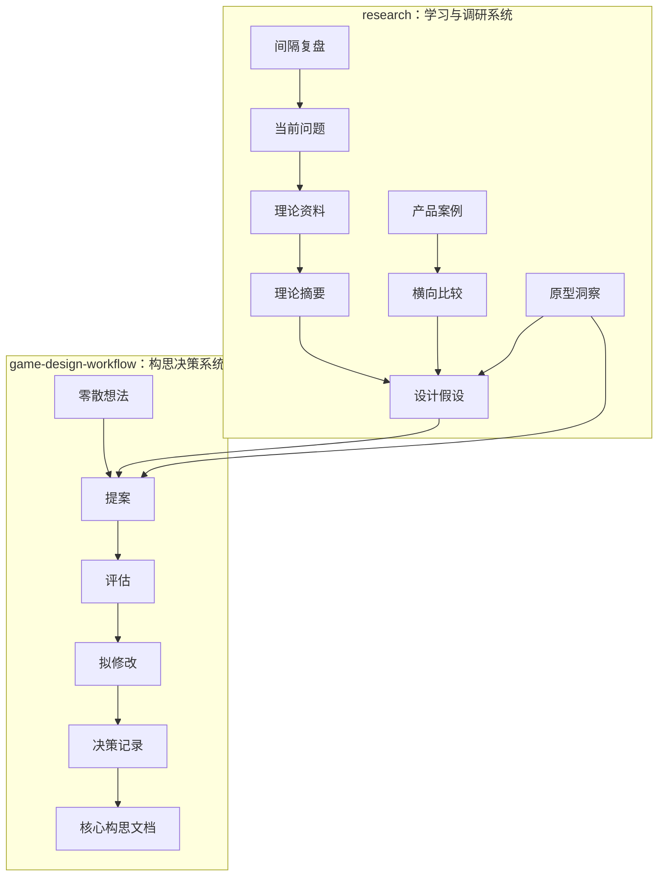

# 新手架构说明：游戏构思系统如何运转

这份文档面向第一次进入本仓库的读者。你不需要先懂游戏策划术语，也不需要会写代码。可以把这个仓库理解成一套“把游戏灵感一步步变成可靠设计结论”的系统。

## 一句话理解

这个系统分成两条线：

- `research/`：负责学习、调研、观察和提出假设。
- `game-design-workflow/`：负责把想法推进为提案、评估、拟修改，并最终写入正式核心构思。

`core-concept.md` 是最终沉淀区，不是草稿本。新想法必须先经过流程，才能进入这里。

## 总体架构



## 三类文档

### 1. 输入文档

输入文档负责收集素材，不要求成熟。

- `game-design-workflow/idea-inbox/`：零散想法。
- `research/01-theory-library/`：理论材料入口。
- `research/03-product-case-studies/`：单个产品案例。
- `research/raw-sources/`：原始资料归档。

你可以把输入文档当作“材料箱”。它们允许不完整，但要保留来源。

### 2. 加工文档

加工文档负责把材料变成可讨论、可判断的内容。

- `game-design-workflow/idea-proposals/`：把想法整理成玩法假设。
- `game-design-workflow/evaluations/`：判断提案是否值得推进。
- `game-design-workflow/draft-changes/`：准备写入核心文档的具体文本。
- `research/02-theory-digests/`：把理论转成自己的设计语言。
- `research/04-cross-game-comparisons/`：比较多个游戏的结构差异。
- `research/05-design-hypotheses/`：把学习结果变成可验证假设。
- `research/06-prototype-insights/`：记录原型或纸面推演后的观察。

加工文档的目标不是“写得漂亮”，而是帮助做判断。

### 3. 输出文档

输出文档记录当前可信的结论。

- `game-design-workflow/core-concept.md`：正式核心构思。
- `game-design-workflow/decision-log.md`：为什么采纳、搁置或否决。
- `research/00-index-and-roadmap/current-questions.md`：当前最重要的问题。
- `research/source-index.md`：外部资料来源索引。

如果你只想了解“现在这个游戏到底是什么”，优先读 `core-concept.md` 和 `decision-log.md`。

## 新手应该从哪里开始

### 只想了解项目

推荐阅读顺序：

1. `README.md`
2. `game-design-workflow/core-concept.md`
3. `game-design-workflow/decision-log.md`
4. `research/00-index-and-roadmap/current-questions.md`

读完后，你应该能回答三个问题：

- 这个游戏当前的核心玩法是什么？
- 哪些内容已经确认，哪些还没确认？
- 下一步最值得验证的问题是什么？

### 想贡献一个新点子

推荐路径：

1. 复制 `game-design-workflow/templates/idea-template.md`。
2. 在 `game-design-workflow/idea-inbox/` 新建文件。
3. 用自然语言写清楚原始想法、来源和可能带来的玩家体验。
4. 如果想法足够清楚，再复制 `proposal-template.md`，整理成提案。

文件命名建议：

```text
YYYY-MM-DD-short-name.md
P-YYYY-MM-DD-short-name.md
```

### 想做调研

推荐路径：

1. 先看 `research/00-index-and-roadmap/current-questions.md`。
2. 选择一个问题，不要泛泛收集资料。
3. 把资料登记进 `research/01-theory-library/` 或产品案例目录。
4. 写摘要或案例分析。
5. 最后沉淀为 `research/05-design-hypotheses/` 里的设计假设。

一个好调研结论应该能回答：“这会如何改变本项目的设计判断？”

## 状态流转

游戏构思主流程有五个状态：

| 状态 | 位置 | 作用 |
| --- | --- | --- |
| Idea | `idea-inbox/` | 保存零散灵感 |
| Proposal | `idea-proposals/` | 整理为可讨论的玩法假设 |
| Evaluation | `evaluations/` | 判断是否值得推进 |
| Draft Change | `draft-changes/` | 写出准备进入核心文档的文本 |
| Accepted / Parked / Rejected | `decision-log.md` | 记录采纳、搁置或否决及理由 |

只有 `Accepted` 的内容才应该进入 `core-concept.md`。

## 当前游戏系统拆解

当前核心构思可以拆成五个模块：

| 模块 | 初学者解释 |
| --- | --- |
| 唯一核心卡 | 每个玩家围绕一张独特核心卡建立身份和战术方向 |
| 通用辅助卡 | 所有人共享的构筑材料，用来攻击、防御、调度或干扰 |
| 激活费用 | 限制爆发节奏，让玩家必须做取舍 |
| 组合规则表 | 决定核心卡和辅助卡能否形成更强组合 |
| 动态平衡层 | 尽量不改核心卡本体，而是在组合关系、费用和条件上调节环境 |

这套设计的关键不是“卡很多”，而是验证玩家是否愿意围绕一张核心卡持续探索组合。

## 什么内容不要直接写进核心文档

以下内容应先进入草稿、提案或研究目录：

- 刚想到但没验证的新机制。
- 同类产品里看起来不错、但还没转化成本项目假设的玩法。
- 详细数值、完整系统树、商业化设计。
- 对 AI 生成、交易市场、资源地图等暂缓系统的展开。
- 只有灵感没有玩家行为和验证方式的设定。

## 判断一个提案是否成熟

一个成熟提案至少能说明：

- 玩家反复做什么。
- 玩家为什么会觉得有趣。
- 它增强了哪一种核心体验。
- 最小原型如何验证。
- 成功和失败信号分别是什么。
- 它与同类产品相比有什么差异。

如果这些还说不清，先留在 `idea-inbox/` 或 `research/05-design-hypotheses/`。

## 维护规则

- 修改 `core-concept.md` 时，同步更新 `decision-log.md`。
- 不删除被否决或搁置的思路，除非它是重复文件或明显错误。
- 原始资料放在 `raw-sources/`，加工后的理解放在摘要、案例或假设中。
- 新增模板时，要让新手能照着填，而不是只给抽象概念。
- `archive/` 用于历史快照，不作为日常编辑入口。

