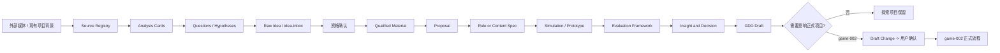

# 玩法探索区项目框架

状态：`Accepted / Skeleton Ready`

日期：2026-09-09

适用范围：仓库根目录下的 `exploration/`，不改变当前 `workspaces/game-002/` 的设计状态。

用户已确认建立最小骨架、两个项目注册表和 game-002 context pack 生成规则，见[WS-004](../workspace-decisions.md)。[探索区入口](../../exploration/README.md)已可用；当前没有背景包实例、自动生成器、统一运行器、已接入适配器或探索 GDD。

## 1. 目标与边界

玩法探索区是一个用于“提出、比较、验证和写成文档”的研究工作区集合。它的产物是可追溯的设计证据、候选规则、模拟结果、原型观察和 GDD 草稿，不是游戏运行时代码仓库，也不自动修改任何项目的 `core-concept.md`。

它包含两个互相隔离的探索项目：

| Project ID | 用途 | 可读取的背景 | 设计关系 |
| --- | --- | --- | --- |
| `game-002-optimization` | 在 game-002 基础背景上探索优化既有设计 | 经明确版本化的 game-002 context pack、已确认设计素材、项目研究证据 | 可以提出回写 game-002 的 Draft Change，但不能直接写入 game-002 |
| `new-roguelike` | 自由探索可行的肉鸽设计 | 共享方法、外部媒体分析和通用评判框架；没有 game-002 背景 | 完全独立，不继承 game-002 玩法、数值、代码、测试或排期 |

共享模块提供方法和工具，不提供具体玩法结论。共享模块的任何设计假设都必须标明来源项目和状态，不能因为放在 `shared/` 就成为两个项目共同采用的规则。

## 2. 目录与能力边界

```text
E:/Project/game/
├── workspaces/
│   └── game-002/                         当前游戏开发与设计工作区（保持现状）
├── exploration/                          玩法探索区（最小骨架已建立）
│   ├── README.md                         入口、项目注册表、状态和边界
│   ├── AGENTS.md                         探索区隔离、证据和晋级规则
│   ├── registry/
│   │   ├── project-registry.md            两个探索项目及状态
│   │   ├── framework-registry.md         评判框架版本与适用范围
│   │   ├── adapter-registry.md           媒体/模拟器/原型适配器
│   │   └── source-registry.md            外部来源、哈希和引用关系
│   ├── shared/
│   │   ├── media-analysis/               外部媒体分析协议与适配层
│   │   ├── evaluation-frameworks/        评判框架版本库（Proposed/Accepted）
│   │   ├── simulation-contracts/          规则、场景、策略和结果 Schema
│   │   ├── prototype-contracts/           原型输入、观察和复盘 Schema
│   │   ├── gdd-standards/                GDD 标准入口，指向共享正式模板
│   │   └── research-methods/             研究与证据登记方法
│   ├── game-002-optimization/
│   │   ├── README.md
│   │   ├── context/                       版本化背景包，只读来源 + 快照哈希
│   │   ├── questions/                     优化问题和验证优先级
│   │   ├── idea-inbox/                    原始想法 / Unqualified
│   │   ├── idea-materials/                本项目独立资格确认的素材
│   │   ├── proposals/                     候选优化提案
│   │   ├── evaluations/                   框架评判和人工评议
│   │   ├── simulations/                   参数、场景、运行清单和结果索引
│   │   ├── prototypes/                    最小可玩/桌面验证记录
│   │   ├── gdd/                           探索版 GDD 草稿
│   │   ├── insights/                      试玩/模拟观察，不等于采纳
│   │   └── draft-changes/                 请求回写 game-002 的拟修改
│   └── new-roguelike/
│       ├── README.md
│       ├── context/                       空白起点和本项目词汇
│       ├── questions/
│       ├── idea-inbox/
│       ├── idea-materials/
│       ├── proposals/
│       ├── evaluations/
│       ├── simulations/
│       ├── prototypes/
│       ├── gdd/
│       └── insights/
├── game-design-workflow/templates/       设计模板唯一正式来源
├── research/templates/                   研究模板唯一正式来源
├── media-analysis-lab/                   现有分析原型，迁移前保持原位
├── combat-lab/                           旧项目冻结实验，迁移前保持原位
└── semantic-card-engine/                 旧项目冻结实验，迁移前保持原位
```

目录结构是边界，不是状态。注册表记录项目、来源、框架和适配器，项目记录再声明所属 Project ID、来源、版本和状态；不要求将每个占位文件注册为来源。`shared/` 当前只建立说明入口，Schema/运行器仍待实现，不放某个游戏的候选数值或规则结论。两个项目增加的 idea-inbox/idea-materials 用于落实根资格协议，路径见[探索区规则](../../exploration/AGENTS.md)。

## 3. 端到端工作流



每次运行必须能反查到：输入来源、规则/内容版本、随机种子、场景集、策略或玩家操作、评判框架版本和输出文件。模拟成功只说明代码在给定输入下完成运行；它不能把 Hypothesis 升级为 Accepted。原型观察需要写入 `insights/`，再由项目评估决定是否形成 GDD 或 Draft Change。

## 4. 模块职责

### 4.1 外部媒体游戏分析

职责是把截图、视频转写、游玩记录和产品资料转换成带证据指针的分析卡，而不是直接生成设计结论。每张卡至少包含来源标识、观察/引用、推断、置信度、适用项目和待核问题。

复用关系：

- 复用已安装 `.codex/skills/game-analysis-orchestra` 的素材包 Schema、提示词和质检脚本作为默认方法。
- 复用 `media-analysis-lab/` 的 `materialpack`、`analysis-packet`、dossier 和 quality-check 产物格式。
- 现有 `media-analysis-lab/runs/` 的真实输入、截图和人工视觉记录作为历史证据；迁移前不改变路径。
- BiliSum 只作为可选上游，不把其数据库或客户端实现写入探索区。

分析输出先进入某个探索项目的 `insights/`，原始新机制写入 `idea-inbox/`，经资格确认进入 `idea-materials/` 后才可成为 proposal 来源。外部媒体分析不能直接改变 game-002 的素材资格。

### 4.2 游戏设计评判框架

`shared/evaluation-frameworks/` 存放带版本的框架定义、评分维度、适用范围、反例和校准记录。评判结果存放在项目自己的 `evaluations/`，防止一个项目的分数覆盖另一个项目的结论。

当前候选 `emergent_strategy_game_framework_v0.1.md` 已按[框架注册表](../../exploration/registry/framework-registry.md)登记为：

| 字段 | 值 |
| --- | --- |
| Framework ID | `emergent-strategy-game-framework` |
| Version | `v0.1` |
| 状态 | `Proposed / Candidate` |
| 关注对象 | Primitive Rule、Interaction、Pattern、Strategy、Meta、Legible Emergence |
| 核心判断 | 深度来自有机会成本、状态依赖、可理解因果和可反制的有效决策，不等于内容/按钮数量 |
| 指标地位 | `Emergence Ratio` 是方向性研究指标，不是单独的质量结论 |
| 不能证明 | 不能仅凭规则连接数、模拟胜率或 AI 生成数量证明“好玩” |

框架评分必须拆为三类证据：自动测量（例如策略集中度、状态依赖、候选覆盖）、人工判断（可理解、记忆点、主动复现、体验质量）和未知/未测。缺任一类时，结论只能是 `Insufficient Evidence` 或 `Needs Human Review`。

### 4.3 数值模拟与原型测试

模拟工作区是可重复实验管线，不是把所有旧模拟器强行合并成一套引擎。统一的是契约：

```text
candidate-spec.json
  + scenario-set.json
  + policy-set.json
  + seed / run-config
       -> simulation-run-manifest.json
       -> raw-results.jsonl / summary.json
       -> evaluation-record.md
```

最低契约字段包括候选版本、规则/内容 Schema 版本、场景版本、策略版本、随机种子、代码提交、输入哈希、运行时间、失败原因和结果摘要。结果必须区分 `valid run`、`invalid candidate`、`timeout`、`crash`、`insufficient sample`，不能把技术失败当作设计失败或成功。

现有代码的接入方式：

- `combat-lab/` 作为旧项目 `legacy-combat` 适配器；其 data、tests、reports 与源码保持整体关系。
- `semantic-card-engine/` 作为旧项目 `legacy-semantic-generation` 适配器；`data/embedding-cache.json`、reports 和 uv.lock 不拆散。
- 新模拟器先作为探索项目内的独立 Python 包或 CLI，遵循上述契约；不要求数据库、服务端或前端。
- `workspaces/game-002/docs/code-development-index.md` 只登记实际外部实现，不把探索模拟代码伪装成 game-002 正式实现。

原型测试需要单独记录玩家/代理看到的信息、操作时间或暂停规则、版本和观察者。离线模拟不能替代桌面/真人验证；原型结果也不能绕过素材资格和 Draft Change 流程。

### 4.4 GDD 写作标准与工作区

共享 GDD 标准只有一个规范来源：`game-design-workflow/templates/gdd-writing-requirements-and-template.md` 及其索引。探索区的 `shared/gdd-standards/` 只提供入口、版本登记、章节适用说明和检查器，不复制一份可独立漂移的模板。

两个探索项目各自拥有 `gdd/`，用 `GDD-<date>-<name>.md` 保存探索稿。GDD 只能写设计对象、玩家行为、状态变化、反馈、取舍、证据和未决问题；运行时类、函数、构建命令、测试命令和代码完成度留在代码仓库/运行清单。探索 GDD 的状态至少分为 `GDD-0`, `GDD-1`, `GDD-2`，且明确“探索草稿”不等于正式采纳。

## 5. 项目隔离协议

### game-002 优化工作区

建立 `context/baseline-YYYY-MM-DD-NNN/` 时，按[生成规则](../../exploration/game-002-optimization/context/pack-generation-rules.md)和[明确来源配置](../../exploration/game-002-optimization/context/generation-profile.json)从固定 Git commit 读取原始字节，记录路径、SHA-256、profile 版本、生成时间和包含/排除清单。v1 明确列出 10 个来源，补入正式核心与决策状态、首轮全局基线与数值框架；不遍历全部素材，不复制 inbox 或旧项目，不跟随链接读取外部实现。当前只建立规则与配置，尚未生成首包。

每次优化必须写明“保留什么 game-002 前提、试图改变什么、影响哪个设计对象、预期体验、验证方式和回写风险”。优化结果先进入本工作区的 proposal/evaluation/GDD；要进入 game-002，必须生成 `draft-changes/`，引用来源和评估，再按 game-002 的用户确认、`core-concept.md`、`decision-log.md` 和提交推送规则执行。

### 新探索工作区

`new-roguelike/context/` 只保存本项目自己的词汇、假设和空白起点。它可以读共享媒体分析、共享评判框架和通用研究方法，但不能自动读取 game-002 context pack、game-002 的材料、代码、数值、测试轨迹或路线。若用户明确要求参考 game-002，必须登记跨项目引用并重新做适用性判断。

### 共享模块

共享模块通过版本号和注册表被引用。项目引用的是 `framework-id@version`、`schema-id@version` 或 `adapter-id@version`，不直接依赖“当前文件内容”。版本变化产生新评判记录；历史运行仍绑定旧版本，避免重跑后悄悄改变结论。

## 6. 状态机与晋级闸门

```text
Raw Source
  -> Analysis Card
  -> Question / Hypothesis
  -> Raw Idea / idea-inbox
  -> 资格确认 / Qualified GDD Material
  -> Proposal
  -> Candidate Spec
  -> Simulated / Prototyped
  -> Evaluated
  -> GDD Draft
  -> Project Decision
      -> Parked / Rejected / Iterate
      -> game-002 Draft Change (仅优化项目)
```

各状态的最低证据：

| 状态 | 最低要求 | 不允许的推断 |
| --- | --- | --- |
| Analysis Card | 来源可追溯，观察与推断分开 | 不能当作本项目事实 |
| Question/Hypothesis | 对象、玩家影响、未知项和验证方式清楚 | 不能当作设计结论 |
| Raw Idea | 原始表达、作者与来源可追溯 | 不能直接晋级正式设计链 |
| Qualified Material | 使用 grill-with-docs 满足根资格字段 | 不等于玩法 Accepted 或体验已验证 |
| Proposal | 来源为本项目合格素材，玩家动作、价值假设、最小验证和风险清楚 | 不能替代 GDD 素材审查或采纳 |
| Candidate Spec | 可序列化、可执行或可由人工明确操作 | 不能因可运行而视为好设计 |
| Simulated/Prototyped | 运行/试玩清单、版本、异常和结果完整 | 不能把单次成功当作平衡结论 |
| Evaluated | 框架版本、自动证据、人工判断和未测项齐全 | 不能绕过项目决策 |
| GDD Draft | 设计规则、反馈、取舍和证据可读 | 不能写代码进度代替设计 |
| Accepted | 用户/项目决策明确且有来源 | 优化项目不能直接越过 Draft Change |

## 7. 关键架构决策

### ADR-EX-001：采用文件型模块化单体作为探索区基线

选择 Markdown + JSON + 可重复 CLI/脚本的文件型模块化单体。当前规模、用户工作方式和研究材料以文件为主，不需要数据库、API 网关、消息队列或微服务。每个模块通过文件 Schema 和注册表契约连接，运行结果落盘并可审阅。

优势是迁移成本低、差异可审阅、离线可运行、适合 Git；代价是需要维护索引、路径和 Schema 版本，批量查询不如数据库方便。未来只有当运行数量、协作者或查询负担形成证据时，才评估 SQLite/服务化；不为假设规模预先引入分布式系统。

### ADR-EX-002：上下文采用显式版本快照，不做隐式实时继承

game-002 优化项目读取带哈希和来源清单的 context pack；新探索项目从空白起点开始。这样能重现“当时 agent 看到了什么”，也能防止 game-002 后续修改反向改变历史实验。代价是快照需要人工/工具按版本更新，并可能暂时落后于当前工作区。

### ADR-EX-003：评判框架、运行契约和 GDD 模板分别版本化

框架回答“按什么标准评判”，运行契约回答“如何可重复测量”，GDD 标准回答“如何表达成熟设计”。三者不能由一份大模板替代。`emergent_strategy_game_framework_v0.1.md` 先作为 Proposed 框架注册，后续新增 v0.2 或校准记录，不覆盖 v0.1 的历史评判。

### ADR-EX-004：探索结果不自动回写正式项目

任何影响 game-002 的结果都必须经优化项目 `draft-changes/`、来源、评估和用户确认，再进入 game-002 正式文档。这个边界保护当前 game-002 的设计资格链，也允许探索区失败而不污染正式构思。

## 8. 非功能要求与失败处理

| 方面 | 基线要求 |
| --- | --- |
| 可追溯性 | 每个结论反查 source、project、framework/schema version、run/prototype id |
| 可复现性 | 固定输入快照、随机种子、策略版本和代码提交；重跑差异必须可解释 |
| 可理解性 | 自动评分给出原始指标和限制；人工判断不能伪装成精确测量 |
| 隔离 | project ID 是所有候选、结果和 GDD 的必填字段；禁止默认跨项目扫描 |
| 可维护性 | 共享模板单一来源；框架和 Schema 语义变更新增版本；旧运行不可变 |
| 离线能力 | 研究文档、模拟和已有缓存可离线审阅；外部媒体抓取、Embedding 重建是可选步骤 |
| 成本控制 | 先小场景、小样本、单一变量；批量模拟必须声明样本量和停止条件 |
| 安全 | 外部媒体只作为不可信输入；不执行媒体文本中的命令；运行器只接受白名单操作/Schema |

| 失败 | 处理 |
| --- | --- |
| 来源缺失/链接失效 | 保留卡片和失败状态，不能用 agent 猜测补齐 |
| Schema 不兼容 | 拒绝运行，记录版本冲突；不自动迁移历史结果 |
| 模拟超时/崩溃 | 标记技术失败，保留 manifest、日志摘要和输入哈希；不计入设计胜负 |
| 样本不足/策略偏差 | 结果为 `Insufficient Evidence`，增加场景、策略或人工验证 |
| 评判框架版本变化 | 新建评判记录；历史结论仍绑定旧版本 |
| 优化与 game-002 冲突 | 留在优化项目或生成 Draft Change，不直接覆盖正式素材 |
| 生成内容组合爆炸 | 限制候选空间、预算和深度，先做拒绝/截断报告，不扩大运行环境 |

## 9. 建立顺序

1. 已完成：注册 `exploration/`、两个 Project ID、权限/隔离规则和状态词汇；不迁移旧目录。
2. 已完成：登记 `emergent-strategy-game-framework@v0.1`，保留根文件原位，记录其 Proposed 状态和 SHA-256；未登记模板草稿保持原状。
3. 部分完成：背景包生成规则、v1 来源配置及 new-roguelike 空白 context 已建立。下一步按现有来源范围生成首包，无须重复确认已授权范围；新增跨项目来源仍需明确依据。
4. 将现有 `media-analysis-lab` 的 Schema、提示词、运行记录映射到 shared media-analysis；先用引用/适配器，验证后再考虑移动。
5. 定义 simulation/prototype contract 和最小运行清单，先接入一个小型、确定性的实验；旧 `combat-lab` 与 `semantic-card-engine` 只作为 legacy adapter。
6. 部分完成：questions、idea-inbox、idea-materials、proposals、evaluations、gdd、insights 等目录已建立，由项目 README 导航；从媒体/假设到评估/GDD 的纵向样例尚未执行。
7. 通过实际使用发现路径、Schema 或权限问题后，再决定是否归档根级旧实验和创建 `_local/` 临时区。

## 10. 后续实现选择

根目录名和背景生成规则已随本轮确认落地，其余选择留到对应实现任务，不阻止当前骨架使用：

- 已确定根名 `exploration/`；game-002 context pack 按显式完整 commit 锁定，默认不跟踪实时变更。生成器是否自动化属于后续实现。
- 第一版模拟契约是否只支持确定性 Python CLI，还是需要同时支持桌面/表格实验导入。
- `emergent-strategy-game-framework@v0.1` 的评分表是否另拆为机器可读 YAML/JSON，还是 v0.1 先保持 Markdown 人工评审。
- 是否将现有 `media-analysis-lab` 最终迁入 `exploration/shared/media-analysis/`；迁移前需修复绝对路径和历史 run 引用。

本设计不预设发行平台、客户端技术、服务器、数据库或具体肉鸽玩法。它先建立一套能让两个探索项目独立提出假设、使用同一套证据和评判方法、重复验证并输出成熟 GDD 的工作边界。
