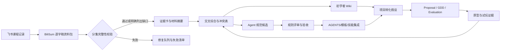

# 游戏设计知识与构思辅助系统升级 Spec

状态：`Proposed / Implementation Spec`

版本：`0.1.0`

日期：`2026-09-04`

负责人：项目维护者与总控 agent

## 0. 摘要

本 Spec 定义一条把飞书“游戏设计系统课程”转化为可复用知识和可执行协作规则的工作流：

```text
飞书课程记录
  -> BiliSum 逐字稿资料包
  -> 分集完整性校验
  -> 可追溯证据卡
  -> 逐材料分析与交叉综合
  -> 人类可读 Wiki
  -> agent 可执行规范
  -> 试运行、评审与版本化集成
```

最终要交付两类互相引用但职责不同的产物：

1. **游戏开发 Wiki**：帮助初学者理解从概念、原型、制作、测试到发布的流程，知道每个阶段要回答什么问题、产出什么、常见错误是什么。
2. **游戏设计 agent 规范**：把阶段门、证据等级、GDD 写法、设计原则、提案/评估/测试和仓库路由写成可判定的规则，使 agent 能检查、追踪和拒绝越界内容。

本 Spec 只定义目标架构、标准、阶段和实施顺序，不直接修改 `core-concept.md`，也不把任何课程观点自动升级为本项目的正式设计结论。

## 1. 背景与问题定义

### 1.1 当前输入

飞书课程已经整理为本地逐字稿资料包：

- 入口：[飞书游戏设计系统课程逐字稿资料包](../research/01-theory-library/feishu-game-design-system-transcripts-2026-08-30/README.md)
- 飞书记录：237 条；去重后视频：235 个。
- B 站分集总数：753 P；成功逐字稿：749 P。
- 完整视频：233/235；多分集视频 15 个，共 533 P，成功 529 P。
- 仍有 4 个失败分集：`SJ-004 P005`、`SJ-009 P007/P033/P040`；失败项必须继续保留在失败清单中。
- 当前状态是 `Research Input / Transcript Archive`，不是理论结论库，也不是 GDD 素材库。

### 1.2 必须解决的问题

1. **流程没有统一基线**：不同材料可能把“概念、原型、垂直切片、制作、测试、发布”称为不同阶段，Wiki 和 agent 规则若使用不同分法，就无法共享验收标准。
2. **资料、知识、规范容易混淆**：逐字稿是来源，摘要是加工结果，Wiki 是教学内容，agent 规则是约束，GDD 是项目设计合同；它们不能互相替代。
3. **转写完整性可能被误判**：合并文件存在，不能证明所有分集都已转写；必须比较预期 P 数、成功 P 数和失败 P 数。
4. **课程观点可能被过度泛化**：讲师的案例经验、个人偏好、行业事实、可迁移启发和本项目政策需要分级，否则容易把个案误当定律。
5. **现有 GDD 和构思流程需要被增强而非绕过**：新知识应先进入研究摘要、设计假设、素材或规则草案，再按既有 `Proposal -> Evaluation -> Draft Change -> Accepted` 流程影响正式主线。

## 2. 目标与非目标

### 2.1 目标

| 编号 | 目标 | 可交付结果 |
| --- | --- | --- |
| G1 | 建立统一的游戏开发阶段和决策门 | 阶段模型、每阶段输入/活动/产出/退出条件、证据要求 |
| G2 | 建立初学者可读的 Wiki 信息架构 | Wiki 目录、页面模板、学习路径、术语表、检查清单 |
| G3 | 建立逐字稿到知识的标准加工流水线 | 完整性校验、证据卡、摘要规范、交叉综合和引用规则 |
| G4 | 建立 agent 可执行的规范层 | 规则 ID、触发条件、允许/禁止行为、验收和升级路径 |
| G5 | 固化标准 GDD 和设计原则表达方式 | GDD-0/1/2 映射、设计原则模板、规则与体验验收格式 |
| G6 | 与当前仓库无缝衔接 | 明确 `research/`、`game-design-workflow/`、`docs/` 和代码开发索引的边界 |
| G7 | 保持可追溯和可复盘 | 每项结论都能回到来源、版本、测试或决策；冲突和失败路径不被删除 |

### 2.2 非目标

- 本轮不重写 `game-design-workflow/core-concept.md`，不采纳新的卡牌、地图、交易或 AI 生成机制。
- 不把课程转写全文改写成百科全书，也不要求一次处理 235 个视频。
- 不声称存在一个所有团队都使用的唯一 GDD 格式；本 Spec 定义的是本仓库的工作标准。
- 不用课程材料替代外部权威资料、玩家测试、原型证据或平台发布要求。
- 不把代码架构、类、函数、API、构建和开发进度写入 GDD；这些内容仍由 `docs/code-development-index.md` 和对应代码仓库管理。
- 不在没有证据的情况下补写商业数据、留存数字、市场规模或发布事实。

### 2.3 成功指标

这些指标用于验收系统本身，不是当前游戏的商业 KPI；首轮试点完成后再根据实际工作量校准阈值。

| 指标 | 首轮目标 | 计算方式 |
| --- | --- | --- |
| 分集覆盖准确率 | `100%` 的已标 `Complete` 视频满足逐 P 对齐 | `Complete` 视频中 `successful_parts == expected_parts` 的比例 |
| 证据可追溯率 | `>= 95%` | Wiki/规则中的重要结论可回指 Evidence ID 的比例 |
| 摘要覆盖率 | `100%` 的试点材料有摘要或明确 `Partial/Failed` | 已处理材料状态与队列比对 |
| 事实/推断误标率 | `0` 个高风险误标；总体 `< 5%` | 抽样复核 `Source Claim`、`Inference`、`Hypothesis` 的状态 |
| Wiki 新手可执行性 | 试读者能完成至少 3 个阶段任务，完成率 `>= 80%` | 任务测试和复述检查 |
| Agent 规则遵循率 | 四类真实请求中 `>= 90%` 通过路由/边界检查 | 端到端试运行记录 |
| GDD 自检通过率 | 试点 GDD 的必填项 `100%` 有值或显式 `Unknown/N/A` | 现有 GDD 自检清单 |
| 核心文档越权修改次数 | `0` | 检查 `core-concept.md`、`decision-log.md` 的非流程变更 |

## 3. 术语与内容边界

| 层级 | 定义 | 主要读者 | 能否直接改变正式设计 |
| --- | --- | --- | --- |
| 原始转写稿 | BiliSum 产生的逐字稿及分集元数据，保留原貌 | 研究 agent | 否 |
| 证据卡 | 从来源中抽取、带引用和可信度的单条事实/观点/案例 | 研究 agent、审阅者 | 否 |
| 材料摘要 | 围绕一个主题整理多条证据，并标注推断与未知 | 设计者、Wiki 作者 | 否，需进入既有设计流程 |
| Wiki 知识 | 面向学习者的解释、步骤、例子和检查清单 | 初学者、设计者 | 否，除非转成项目决策 |
| Agent 规范 | 可执行、可判定、可追踪的行为约束 | agent、维护者 | 只改变协作方式，不直接改变玩法 |
| GDD | 记录玩家体验、规则、设计决策、验证和范围的设计合同 | 设计、制作、测试 | 只有按项目决策流程采纳后影响核心构思 |
| Proposal / Evaluation | 讨论和判断某个玩法假设的中间产物 | 设计者、评审者 | 通过 Draft Change 后才可 |
| Prototype Insight | 原型或试玩中实际观察到的行为和反馈 | 全团队 | 作为证据，不自动等于结论 |
| Development Progress | 代码仓库、实现状态、技术阻塞和验证证据 | 开发者、总控 agent | 不改变 GDD 规则，需交回设计流程 |

### 3.1 结论状态

研究层使用更细的证据类型，项目层继续使用仓库现有状态：

| 研究状态 | 含义 | 推荐写法 |
| --- | --- | --- |
| `Observed Fact` | 从画面、逐字稿或测试记录直接观察到 | 写明来源和范围，不扩大适用性 |
| `Source Claim` | 讲师、开发者或作者明确提出的观点 | 标为“来源观点”，不当作共识 |
| `Inference` | 基于多条证据的合理推断 | 写出推理链和替代解释 |
| `Hypothesis` | 可被原型或测试证伪的设计判断 | 必须写验证方式、成功/失败信号 |
| `Decision` | 本项目已明确采纳的决策 | 链接决策记录或 Draft Change |
| `Unknown` | 当前没有足够答案 | 写影响、负责人和下一步 |
| `Out of Scope` | 当前阶段明确不处理 | 写边界和复议条件 |

项目文档的 `Confirmed / Hypothesis / Unknown / Out of Scope` 仍是最终写作状态；`Observed Fact` 或 `Source Claim` 不得直接映射为 `Confirmed`。

### 3.2 多条正交状态轴

同一份材料可以处在“已读但未发布”，同一条项目想法也可以处在“GDD-1 / Hypothesis”。以下状态不能互相替代：

**材料加工状态：**

```text
Captured -> Normalized -> Read -> Extracted -> Digested -> Reviewed -> Published -> Archived
```

`Partial`、`Failed` 和 `Blocked` 可以附加在任一阶段；它们描述覆盖或执行问题，不代表内容价值。

**研究结论状态：** `Observed Fact / Source Claim / Inference / Hypothesis / Decision / Unknown / Out of Scope`。

**项目设计工作流状态：** `Raw Idea / Qualified GDD Material / GDD / Proposal / Evaluation / Draft Change / Accepted / Parked / Rejected`。

**GDD 成熟度：** `GDD-0 / GDD-1 / GDD-2`，描述文档完成到什么深度，不代表项目已经进入哪个生产阶段。

**生产阶段状态：** `S0` 至 `S7`，描述项目当前在统一开发生命周期中的位置。

**代码实现状态：** `Planned / In Progress / Implemented / Verified / Blocked / Parked`，只描述实现证据，不改变设计结论。

agent 必须在报告中分别写出这些状态轴。例如：`Material=Reviewed; Evidence=Source Claim; Design=Hypothesis; Production Stage=S2; Code=In Progress`。不能用“已整理”或“已完成”一个词覆盖所有轴。

## 4. 统一知识系统架构

### 4.1 数据流



### 4.2 两条输出线的分工

| 输出线 | 优先回答 | 允许内容 | 禁止内容 |
| --- | --- | --- | --- |
| Wiki | “新手如何理解和执行？” | 定义、背景、步骤、例子、反例、检查清单、学习顺序 | 把个案经验写成绝对真理；混入未标注的项目结论 |
| Agent 规范 | “agent 何时必须做什么、如何判定完成？” | 触发条件、硬约束、流程、状态、验收、升级和冲突处理 | 依赖“感觉”“通常”“更好玩”等不可判定措辞 |

两条线共享来源、术语、阶段 ID、证据 ID 和版本号，但不共享正文。Wiki 可以解释一条规则为什么存在；规范必须能在没有长篇解释时执行它。

### 4.3 唯一事实源与引用关系

同一事实只能有一个权威维护位置，其他文档通过链接或稳定 ID 引用。发生冲突时，先修正事实源或记录冲突，不在复制稿中静默覆盖：

| 事实类型 | 唯一事实源 | 允许的下游引用 |
| --- | --- | --- |
| 飞书记录、BV、分集、任务和转写文件 | `research/01-theory-library/feishu-game-design-system-transcripts-2026-08-30/manifest.json` 及其逐字稿 | 证据卡、摘要、Wiki 来源索引 |
| 课程观点和外部研究结论 | `research/01-theory-library/` 与 `research/source-index.md` | 材料摘要、主题 Wiki、规范候选 |
| 证据卡与材料摘要 | `research/02-theory-digests/` 对应批次目录 | Wiki、设计假设、规则草案 |
| 生产阶段与本系统决策 | 本 Spec；长期接受后拆为 `docs/adr/` | Wiki 阶段页、Agent 阶段门 |
| 项目设计规则与决策状态 | `game-design-workflow/`（含 GDD 模板、Proposal、Evaluation、Decision Log） | Wiki 的项目转化、原型计划 |
| 代码实现状态与技术细节 | `docs/code-development-index.md` 及对应代码仓库 | GDD 的验证链接、阶段报告 |
| Agent 操作触发和禁止事项 | `AGENTS.md`；专题规则经评审后进入其唯一承载文件 | Agent 运行报告、规则索引 |

本 Spec 是升级方案的设计合同，不是新的 GDD、代码进度表或逐字稿副本。任何规则集成都必须留下版本、来源、影响范围和回滚位置。

## 5. 统一游戏开发阶段模型

### 5.1 基线说明

行业没有唯一、固定名称的游戏开发流程。本项目采用各类成熟工作流的共同骨架，暂定以以下来源做交叉校验：

| 来源 | 可迁移部分 | 使用边界 |
| --- | --- | --- |
| Tracy Fullerton，《Game Design Workshop》 | 以玩家体验为中心、原型和反复试玩 | 不把书中课程顺序当成项目强制排期 |
| MDA：Mechanics-Dynamics-Aesthetics | 从规则推演玩家行为和体验 | 是分析工具，不是完整生产流程 |
| Jesse Schell，《The Art of Game Design》 | 通过问题/视角检查设计盲点 | 是启发式，不是验收标准 |
| 敏捷/迭代开发实践 | 小批量交付、反馈、调整范围 | 不把软件迭代仪式直接等同于游戏设计质量 |
| 本仓库课程材料 | 独立开发、GDD、原型、测试、发布案例 | 先标为来源观点，再与外部资料和本项目证据交叉验证 |

阶段名称可因项目规模调整，但阶段职责和决策门不能被省略。下面的八阶段是 Wiki 和 agent 规范共同使用的唯一基线：

“公认流程”在本 Spec 中指多个成熟方法的共同骨架，不指某一本书或某家公司发布的唯一标准。Phase 0 必须至少对照一套游戏设计方法、一套迭代/项目生产实践和一套质量/发布要求，记录它们的相同点、分歧和本项目采用理由；在该对照完成前，阶段定义只能标为 `Proposed`。

| 阶段 ID | 阶段 | 核心问题 | 主要产出 | 决策门 |
| --- | --- | --- | --- | --- |
| S0 | 研究与问题定义 | 哪个玩家/体验问题值得解决，证据和未知是什么？ | 问题陈述、目标玩家线索、来源/竞品/用户证据、风险和研究问题 | 是否值得进入概念立项 |
| S1 | 概念与预制作 | 为谁解决什么体验问题，核心循环和边界能否被团队共同理解？ | 一句话概念、设计支柱/反支柱、范围、GDD-0、术语表、核心循环、假设清单 | 是否进入可玩原型 |
| S2 | 原型与趣味验证 | 玩家是否真的会做目标动作并得到目标反馈？ | 最小原型、测试任务、观察记录、成功/失败信号 | 继续、改向、搁置或停止 |
| S3 | 垂直切片 | 一条代表性体验链能否达到目标质量，并证明生产方式？ | 可完成的一小段游戏、代表性内容、制作流程试验、GDD-1 | 是否值得扩大内容规模 |
| S4 | 制作与内容生产 | 在明确范围内能否稳定生产完整内容？ | GDD-2、内容清单、依赖表、版本计划、持续测试 | 是否达到功能完整 |
| S5 | Alpha / 功能完整 | 所有关键系统是否已接通，主要设计风险是否暴露？ | 功能完整构建、系统回归、平衡/可读性问题清单 | 是否进入质量收敛 |
| S6 | Beta / 发布候选 | 内容、稳定性、可访问性和发布要求是否达标？ | 内容冻结、发布候选、QA/兼容性/无障碍检查、已知问题分级 | 是否批准发布 |
| S7 | 发布、运营与复盘 | 如何安全发布、观察真实反馈并把结果带回设计？ | 发布清单、监测与支持计划、复盘、下一版本决策 | 继续运营、修复、迭代或结束 |

### 5.1.1 阶段门判定表

每个阶段门必须给出 `Go / Iterate / Park / Stop` 四选一结果，并记录负责人、证据、可逆性和下一次复审时间。旧记录中的 `Revise` 等同于 `Iterate`，`Hold` 等同于 `Park`；新记录只使用规范名称。项目可以增加条件，不能删除核心问题。

| 阶段 | 进入条件 | 退出证据 | 主要责任 | 可逆性 | 判定 |
| --- | --- | --- | --- | --- | --- |
| S0 | 有可描述的问题、目标玩家线索或体验机会 | 问题陈述、来源/证据地图、未知与研究问题 | 研究/制作/设计 | 很高，可回到问题选择 | Go：值得形成概念；Iterate：补证据或缩小问题；Park：等待关键资料；Stop：没有值得验证的体验问题 |
| S1 | S0 通过，愿景和范围可被复述 | 一句话概念、支柱、GDD-0、核心循环、术语、假设和素材审查 | 设计/总控 | 高，可改设计而不产生大量沉没成本 | Go：可做原型；Iterate：补齐循环/边界；Park：依赖未解决；Stop：核心体验无法说明 |
| S2 | 有一个明确的主要未知项和最小测试方案 | 可玩的核心行为、测试记录、成功/失败/停止信号 | 设计/原型/研究 | 高，允许抛弃原型 | Go：目标体验有证据；Iterate：重做假设或原型；Park：样本/工具不足；Stop：核心动作无吸引力或不可验证 |
| S3 | S2 证明至少一条核心体验链值得扩大 | 代表性完整链路、质量目标、内容样例和生产试验 | 设计/制作/技术/美术 | 中，回退会影响生产方式 | Go：扩大内容；Iterate：缩小切片或改流程；Park：生产风险未解；Stop：质量成本与体验价值不匹配 |
| S4 | S3 通过且范围冻结到可生产规模 | GDD-2、内容/依赖清单、版本计划、持续测试 | 制作/各职能负责人 | 中低，改变范围需记录影响 | Go：功能完整；Iterate：删减范围；Park：关键依赖阻塞；Stop：无法在资源约束内完成 |
| S5 | 已有生产构建和主要系统接通 | 功能完整、系统回归、严重风险暴露并分级 | 制作/QA/设计 | 中低，主要做收敛 | Go：进入质量收敛；Iterate：补系统/回退范围；Park：构建不稳定；Stop：核心体验或技术条件不可救 |
| S6 | S5 的功能与内容完整，问题已分级 | 发布候选、内容冻结、QA/兼容性/无障碍/回退检查 | QA/制作/发布负责人 | 低，发布后变更成本高 | Go：批准发布；Iterate：修复阻断项；Park：外部审批/平台条件未齐；Stop：存在不可接受的发布风险 |
| S7 | 有发布授权、支持责任和观测方式 | 发布/复盘记录、真实反馈证据、下一轮决策 | 制作/运营/设计 | 取决于版本；复盘结果可回到 S0-S2 | Go：继续迭代；Iterate：发布后修复；Park：等待数据；Stop：结束项目或停止运营 |

### 5.1.2 当前项目映射示例

下面只说明现有文档可以作为哪个阶段的示例，不宣称当前项目已经通过对应阶段门：

| 阶段 | 当前项目可引用的示例 | 不能据此推断 |
| --- | --- | --- |
| S0 | `research/00-index-and-roadmap/current-questions.md` 的系统级问题 | 问题已经有答案 |
| S1 | `game-design-workflow/core-concept.md`、`decision-log.md` 和现有 GDD-0/GDD-1 文档 | 设计已全部 Accepted |
| S2 | `game-design-workflow/gdd/` 中的战斗原型文档、`combat-lab/reports/` 和 `research/06-prototype-insights/` | 单次原型已经证明长期体验 |
| S3 | `docs/plans/2026-08-21-three-week-vertical-slice-development-plan.md` 与代码开发索引中的灰盒实现 | 全项目已经具备垂直切片质量 |
| S4-S7 | 当前暂无可作为完成证据的统一项目产物 | 不能因为已有代码或计划就标为生产、Alpha、Beta 或已发布 |

### 5.2 阶段通用字段

每个阶段的 Wiki 页面和 agent 检查器都必须使用同一组字段：

1. **目标**：本阶段要减少哪一种不确定性？
2. **输入**：依赖哪些已确认内容、材料、资源和前置决策？
3. **活动**：玩家研究、设计、原型、制作、测试或发布中具体做什么？
4. **产出**：文件、构建、数据、决策或复盘记录是什么？
5. **决策门**：什么条件满足才允许进入下一阶段？
6. **失败处理**：失败时缩小范围、回退、改向、搁置还是停止？
7. **证据**：如何证明结论，而不是只说明“已经完成”？

### 5.3 阶段门硬规则

- 没有明确的主要未知项和验证信号，不能把工作标为“原型完成”。
- 没有玩家可执行的完整体验链，不能把灰盒片段标为“垂直切片”。
- 没有内容清单、依赖和回归范围，不能把功能堆积标为“进入制作”。
- 没有功能完整与已知问题分级，不能把构建标为“Alpha”。
- 没有内容冻结、发布检查和回退方案，不能标为“Beta/发布候选”。
- 代码已实现不等于设计已确认；实现状态必须通过开发进度索引链接，设计状态仍由 GDD/测试/决策决定。

## 6. 资料完整性、证据和追踪规范

### 6.1 多分集完整性闸门

每个视频的状态必须由分集级数据计算，不能根据合并文本文件是否存在来判断：

```text
expected_parts = B 站公开页面返回的 data.pages 数量
successful_parts = 已成功保存逐字稿的 P 数量
failed_parts = 已尝试但失败的 P 数量
coverage_status =
  Complete        if expected_parts > 0 and successful_parts == expected_parts
  Partial         if 0 < successful_parts < expected_parts
  Failed          if expected_parts > 0 and successful_parts == 0
  Unknown         if expected_parts is unavailable
```

单集视频仍可标为 `Complete`；是否为单集由独立的 `is_multipart = (expected_parts > 1)` 字段表达，不能用 `NotApplicable` 覆盖转写失败。

`expected_parts`、`successful_parts` 和 `failed_parts` 必须使用整数；当元数据暂时不可用时，`Unknown` 不能被填作零。计数不一致、重复 P 或无法定位的文件路径一律进入 `Blocked`，等待人工或脚本复核。

硬规则：

1. 发现 `expected_parts > 1` 时，必须按 `?p=N` 提交每个分集；复用已有 P1 不能跳过其余分集。
2. 合并稿必须保存 `expected_parts`、`successful_parts`、`failed_parts`、任务 ID 和各 P 的文件路径。
3. `Partial` 不得出现在“已完成课程”统计中；摘要和 Wiki 引用必须标明缺失 P。
4. 修复重试必须可断点续跑，成功 P 不重复提交；失败 P 进入失败清单并保留错误原因。
5. 汇总报告同时展示“视频数”和“分集数”，避免 1 个合并文件掩盖多个缺失分集。

### 6.2 证据等级

证据等级表达“这条内容目前能支持多强的结论”，不是对讲者或视频质量打分：

| 等级 | 来源 | 可支持的结论 | 默认项目状态 |
| --- | --- | --- | --- |
| `E0` | 原始逐字稿、分集元数据、截图原件 | 这份材料确实说过/显示过什么 | `Observed Fact` 或 `Source Claim` |
| `E1` | 清晰的讲者主张、项目案例或作者复盘 | 某人/某项目采用了什么做法及其结果 | `Source Claim`，不可直接泛化 |
| `E2` | 两个或更多独立来源交叉支持 | 某条经验具有较宽的可迁移性 | `Inference` 或 `Hypothesis` |
| `E3` | 本项目原型、纸面推演或试玩证据 | 本项目在给定条件下出现了什么行为/反馈 | `Hypothesis` 或 `Confirmed`（需记录条件） |
| `E4` | 本项目明确决策、评估和决策记录 | 已采纳的项目政策或正式设计结论 | `Decision` / `Accepted` |

低于 `E3` 的内容不能单独把项目假设写成 `Confirmed`；低于 `E4` 的内容不能写成 `Accepted` 核心设定。

### 6.3 证据卡最小字段

```text
Evidence ID: E-SJ002-P03-001
Source ID: SJ-002
Video/BV: BV1hMNu64E55
Part: P03
Locator: 时间戳、转写段落或文件行号
Evidence type: direct transcript / visual observation / test record / external source
Claim: 用自己的话写出的单条可核对陈述
Context: 适用场景、前提和范围
Confidence: high / medium / low
Speaker position: example / heuristic / claim / fact report
Potential Wiki section:
Potential Agent rule:
Project transfer:
Unknowns / conflicts:
```

逐字稿中无法稳定定位时间戳时，至少引用 `Source ID + BV + P + 文件路径`；不得把整部合并稿作为无定位引用。

### 6.4 引用和改写规则

- 原始转写稿永不覆盖；修正专名或断句应在摘要层注明“编辑性修正”。
- 以自己的话总结为主，短引文只用于保留关键定义或区分术语；不要用大段逐字复制代替分析。
- 每条重要结论至少有一个证据 ID；只有推断时必须显式标为 `Inference`。
- 课程中的商业数字、成功故事和个人经验默认是 `Source Claim`，除非有独立权威来源或本项目数据支持，不得写成普遍规律。
- 不同来源冲突时保留两条证据，记录冲突类型、可能原因和下一步核验，不用 agent 自行投票消除差异。

### 6.5 稳定 ID 与追踪键

所有可被下游引用的对象都必须有稳定 ID；文件改名或页面移动不能改变其 ID：

| 对象 | ID 形式 | 最小关联键 |
| --- | --- | --- |
| 来源视频/课程 | `S-<课程或来源编号>` | `Source ID + BV` |
| 分集证据 | `E-<Source>-P<NNN>-<NNN>` | `Source ID + BV + P + locator` |
| 材料摘要 | `M-YYYY-MM-DD-<slug>` | 来源 ID 列表、覆盖状态 |
| Wiki 页面 | `W-<AREA>-<NNN>` | 页面版本、来源证据、复审日期 |
| Agent 规则 | `ADRULE-<CATEGORY>-<NNN>` | 规则版本、强度、来源证据 |
| 设计原则 | `DP-<NNN>` | 原型/测试/决策链接 |
| 原型或试玩 | `TEST-<YYYY-MM-DD>-<slug>` | 构建版本、样本、问题和信号 |
| 验收条目 | `AC-<AREA>-<NNN>` | Given/When/Then 或体验测试信号 |

引用至少包含对象 ID 和版本；分集材料另外保留 `BV + P`，项目设计引用继续使用仓库现有文件 ID。

## 7. Wiki 产品规格

### 7.1 受众和学习结果

Wiki 面向没有系统学过游戏设计、但希望做出小型可玩项目的人。读者完成基础路径后，应能：

- 说清一个游戏的目标玩家、核心动作、核心循环和设计支柱。
- 选择当前阶段要验证的问题，而不是一开始堆完整功能。
- 写出可被他人理解的概念 GDD 和原型计划。
- 观察玩家行为、区分规则没被理解与规则没有产生目标体验。
- 知道何时继续制作、缩小范围、改向、搁置或停止。

### 7.2 推荐信息架构

未来 Wiki 目录建议放在 `research/02-theory-digests/game-design-development-wiki/`，以页面而不是一篇无限增长的长文维护：

```text
game-design-development-wiki/
├── README.md                         # 入口、状态、阅读路径、证据边界
├── 00-glossary-and-how-to-use.md     # 术语、状态、证据和导航
├── 01-process/
│   ├── overview.md                   # 八阶段总览
│   ├── s0-concept.md
│   ├── s1-preproduction.md
│   ├── s2-prototype.md
│   ├── s3-vertical-slice.md
│   ├── s4-production.md
│   ├── s5-alpha.md
│   ├── s6-beta-release.md
│   └── s7-live-postmortem.md
├── 02-player-and-design/
│   ├── player-experience.md
│   ├── core-loop.md
│   ├── mda-and-design-pillars.md
│   ├── motivation-feedback-and-fun.md
│   └── meaningful-choices-and-failure.md
├── 03-systems-and-rules/
│   ├── system-thinking.md
│   ├── rules-state-and-timing.md
│   ├── cards-combos-and-decks.md
│   ├── economy-and-balance.md
│   └── level-content-and-pacing.md
├── 04-production-and-quality/
│   ├── scope-and-risk.md
│   ├── collaboration-and-documentation.md
│   ├── playtesting-and-evidence.md
│   ├── qa-accessibility-and-readability.md
│   └── release-and-postmortem.md
├── 05-case-studies/                  # 逐个产品案例，不能代替理论页
├── 06-project-transfer/              # 当前项目的假设和启示，单独标状态
├── templates-and-checklists/
└── source-index.md
```

目录是规划目标，不要求本轮一次创建全部空文件；新建目录时必须同时提供 `README.md` 和边界说明。

### 7.3 Wiki 页面模板

每个知识页至少包含：

1. 一句话结论和适用阶段。
2. 新手解释：首次阅读不依赖未定义术语。
3. 为什么重要：它降低哪一种设计/制作风险。
4. 操作步骤：按输入、行动、产出和复盘顺序写。
5. 正例与反例：优先使用课程材料或本仓库已登记案例，并标来源状态。
6. 常见误区：说明误区出现的条件，不只列口号。
7. 检查清单：读者能自行判断“是否完成”。
8. 对当前项目的转化：只写假设或已确认决策的链接，不把通用知识伪装成核心设定。
9. 未确认信息：列出证据不足、冲突和下一步。
10. 来源索引：证据 ID、视频/分集、外部资料和更新时间。

### 7.4 Wiki 可读性要求

- 先讲玩家和问题，再讲术语和方法；每页开头给出可执行的最短路径。
- 用动词描述行动，用例子说明边界，用表格表达阶段和检查项。
- 把“有趣、丰富、专业、平衡”等形容词改写成可观察行为、反馈或决策条件。
- 明确区分“来源说法”“本项目采用”“待验证假设”。
- 允许保留不同理论的分歧，不为追求整齐而删除上下文。

### 7.5 Wiki 条目治理

每个已发布 Wiki 页面必须在页首或控制表中记录：`Page ID`、版本、owner、最近更新、review date、来源范围、证据状态和变更摘要。重大改写使用新版本并保留旧版本链接；不再适用的页面标记 `Superseded` 或 `Archived`，说明替代页和原因，不删除原始证据。

## 8. 逐字稿处理与逐材料分析规格

### 8.1 材料选择与优先级

不按文件名顺序盲目处理，先按对两个目标的贡献排序：

1. **基础框架**：游戏设计是什么、开发流程、GDD、规则写作、原型和测试（例如 `SJ-001/002/003/004/006/008/009/011/013/015/030/207`）。
2. **系统专项**：核心循环、玩家动机、反馈、数值经济、卡牌/组合、关卡和叙事。
3. **生产与交付**：范围、工具、协作、QA、发布和复盘。
4. **产品案例**：进入 `game-analysis-orchestra` 或 `research/03-product-case-studies/`，不把案例经验直接当规范。

每批处理前更新一个队列，记录材料 ID、预期用途、分集覆盖、负责人和阻塞项。

### 8.2 单个材料的处理步骤

1. **确认元数据**：课程编号、BV、标题、来源、预期 P 数、成功/失败 P、转写来源和覆盖状态。
2. **通读并分段**：按问题、论点或主题分段，保留 P 边界；不只阅读第 1 P。
3. **建立证据卡**：一张卡只承载一个可核对主张；注明上下文、可信度和原文定位。
4. **分类观点**：`example / descriptive / heuristic / normative / project-specific / uncertain`。
5. **抽取 Wiki 内容**：写“是什么、为什么、怎么做、怎么检查、常见失败”。
6. **抽取规范候选**：将可迁移内容改写成触发条件、动作、禁止项、输出和验收；暂标 `Proposed`。
7. **写项目转化**：只提出与“唯一核心卡 + 构筑 + 共享世界 + 回合制对战”有关的假设，不能直接改核心文档。
8. **记录缺口和冲突**：包括缺失分集、转写错误、未展开的定义、相互矛盾的建议和不确定的适用范围。
9. **审阅与入库**：通过结构检查后，摘要进入理论摘要区；规范候选进入规则草案区，等待评审。

### 8.3 单材料摘要卡模板

```text
# [材料 ID] [标题]

状态：Extracted / Reviewed / Partial
来源：课程、BV、分集覆盖和逐字稿链接
本材料要回答的问题：

## 一句话结论
## 关键观点（3—8 条）
| Claim ID | 观点 | 类型 | 证据 | 可信度 | 适用边界 |
## 流程/方法抽取
## 设计原则候选
## Agent 规范候选
## 反例、失败路径与争议
## 对当前项目的转化（Hypothesis/Decision）
## 它如何改变本项目的设计判断？
## 最小验证问题与成功/失败信号
## 未确认信息与下一步
## 相关 Wiki 页面与规则 ID
```

### 8.4 批次综合规则

- 先逐材料保留差异，再做主题综合；不得在第一步就把所有视频压成一份“共识”。
- 同一建议至少由两个独立来源支持，或明确标为单一来源启发，才可进入“可迁移原则候选”。
- 只有经过来源核对、适用边界说明和规则评审的内容，才能进入 agent 的 `Hard Rule`。
- 课程之间出现不同阶段划分、GDD 结构或测试方法时，生成对比表和选择理由，而不是静默合并。
- 逐材料摘要可以是 `Partial`，但批次结论必须列出受缺失分集影响的主题。

## 9. Agent 规范产品规格

### 9.1 规范分类

| 类别 | 作用 | 示例 |
| --- | --- | --- |
| `Routing` | 判断输入属于哪个仓库流程 | 原始想法进 inbox，理论进 research |
| `Stage Gate` | 阻止跳过阶段或伪造完成 | 未完成核心循环验证不能进入制作 |
| `Evidence` | 要求来源、可信度和未知项 | 重要结论必须有证据 ID |
| `GDD` | 约束 GDD 结构、状态和边界 | 使用 GDD-0/1/2，不写代码实现 |
| `Design Reasoning` | 约束玩家、机制、动态、体验推理 | 每个核心机制写 MDA 链 |
| `System Rules` | 要求状态、时序、异常和验收完整 | 输入—规则—输出—反馈闭环 |
| `Prototype` | 让原型一次回答一个主要问题 | 成功/失败/停止信号先于制作 |
| `Playtest` | 记录行为、解释和判断的区别 | 观察行为优先于照抄建议 |
| `Collaboration` | 维护分支、提交、链接和变更追踪 | 核心文档按 GitHub 协作规范提交推送 |
| `Safety/Boundary` | 防止虚构、越权和资料污染 | 不把转写观点直接写入核心构思 |

### 9.2 单条规范格式

每条规范必须可独立阅读，并包含：

```text
Rule ID: ADRULE-<CATEGORY>-<NNN>
Strength: HARD / SHOULD / EXPERIMENT
Trigger: 何时触发
Preconditions: 前置状态和适用范围
MUST: agent 必须做什么
MUST NOT: agent 不得做什么
Procedure: 顺序化操作
Output: 应生成或更新什么
Pass criteria: 如何判定通过
Fail/escalation: 不通过时留在哪个状态、如何报告
Evidence/source: 来源和证据状态
Owner/version/review date: 负责人、版本和复审日期
Review trigger: 何时复审或废止
```

规范候选只有在来源、适用阶段和反例齐全时才是 `Rule Ready`；只有经过人工审阅、至少一次反例演练，并能指向实际仓库产物和状态变化时才是 `Rule Done`。`EXPERIMENT` 规则可以用于试验，但不能阻塞不相关的设计工作。

### 9.3 规范强度与冲突优先级

- `HARD`：违反即不能继续，必须报告缺口或回退状态。
- `SHOULD`：默认遵守；有明确理由时可偏离，但要记录理由。
- `EXPERIMENT`：尚未成为政策的假设，只能用于试验，不能阻塞无关工作。

规则冲突按以下顺序处理：用户当前明确要求 > 仓库 `AGENTS.md` 与安全约束 > 已接受的项目流程决策 > 本 Spec 的 `HARD` 规则 > `SHOULD` 建议 > `EXPERIMENT` 候选。冲突不能靠 agent 自行隐藏，需记录并请求决策。

### 9.4 各阶段 agent 行为矩阵

| 阶段 | agent 允许主动做 | 必须拒绝或升级 |
| --- | --- | --- |
| S0 | 检查问题、目标玩家线索、来源和风险，生成研究/概念草案 | 把模糊愿望写成已确认规则 |
| S1 | 组织 GDD-0、术语、循环、假设和素材审查 | 把未确认 inbox 内容直接放入 GDD |
| S2 | 设计最小原型问题、测试任务、记录模板 | 以漂亮 demo 或单次意见代替验证 |
| S3 | 检查代表性链路、质量目标和生产可行性 | 用不可玩的片段宣称已完成垂直切片 |
| S4 | 按 GDD-2 组织系统/内容/依赖，维护变更 | 以代码现状反向修改设计结论 |
| S5-S6 | 组织回归、问题分级、可读性、无障碍和发布检查 | 隐瞒已知严重问题或把未测项标成通过 |
| S7 | 汇总真实反馈、复盘、下一轮假设 | 把单次市场结果当成普遍设计规律 |

## 10. 标准 GDD 规格

### 10.1 现状基线

仓库已有 [GDD 写作要求与模板](../game-design-workflow/templates/gdd-writing-requirements-and-template.md)，本 Spec 将其作为 v1 基线，后续只做有来源、有测试和有迁移说明的增量修改。新知识系统不创建第二套互相竞争的 GDD 模板。

### 10.2 GDD 成熟度与阶段映射

| 成熟度 | 适用阶段 | 必须解决 | 不应承担 |
| --- | --- | --- | --- |
| `GDD-0` 概念对齐版 | S0-S1 | 玩家、体验承诺、支柱、核心循环、范围、最大风险 | 完整数值、内容量、技术实现 |
| `GDD-1` 原型验证版 | S2-S3 | 玩家旅程、原型范围、规则状态、反馈、测试和验收 | 未验证的完整生产承诺 |
| `GDD-2` 制作交接版 | S4-S6 | 系统依赖、内容规格、UI/无障碍、异常、回归、风险和决策 | 类、函数、API、构建、代码进度 |

### 10.3 GDD 最小结构

每份 GDD 依成熟度选择章节，但不能删掉当前范围内的必答问题：

1. 文档控制、范围、状态、版本、关联素材和变更摘要。
2. 产品与体验合同：一句话概念、目标玩家、设计支柱/反支柱、核心假设。
3. 核心循环与玩家旅程：玩家输入、行动、成本、系统输出、反馈、退出和再次进入。
4. 规则总览：术语、不变量、时间模型、系统依赖和状态。
5. 系统规格：目的、输入、前置状态、规则、输出、成本、异常、交互、反馈、正反例和验收。
6. 条件模块：卡牌/组合、经济/成长、地图/关卡、引导、UI/无障碍、音画和内容生产。
7. 原型与测试：一次一个主要问题，明确成功、失败和停止信号。
8. 验收总表：规则验收与体验验收分开，优先采用 Given/When/Then。
9. 风险、未知项、决策记录和回归范围。

### 10.4 GDD 硬约束

- 先写玩家处境和可观察行为，再写后台规则；不能只列功能名。
- 每个系统形成“输入 -> 状态 -> 规则 -> 输出 -> 反馈”的闭环。
- 每个重要机制说明 `Mechanics -> Dynamics -> Aesthetics`，写不出动态或体验时标记为未知。
- `Confirmed` 必须链接决策、原型或测试；`Hypothesis` 必须有验证方式；`Unknown` 必须有影响和负责人。
- 设计文档和代码开发记录分离；实现存在不代表设计结论已经确认。
- GDD 引用的想法必须来自 `idea-materials/`；`idea-inbox/` 只能出现在素材审查表中。

## 11. 游戏设计原则规范

### 11.1 原则不是口号

“玩家优先”“快速迭代”“保持简单”只能作为主题，不能直接作为 agent 规则。每条原则必须写成可观察、可约束、可复审的条目。

### 11.2 原则模板

```text
Principle ID: DP-<NNN>
Name: 简短名称
Intent: 想保护的玩家体验或生产目标
Player-observable behavior: 玩家会做什么、看到什么、改变什么决定
Design constraints: 它约束哪些规则、内容、反馈或范围选择
Positive signals: 什么观察说明原则正在生效
Negative signals: 什么观察说明偏离
Trade-offs/exceptions: 代价、适用边界和例外
Evidence: 来源、原型、测试或决策
Status: Candidate / Proposed / Accepted / Superseded
Owner/version/review date: 负责人、版本和复审日期
Review trigger: 何时重新检视
```

### 11.3 初始原则候选

以下只作为本 Spec 的 `Proposed` 候选，不能直接当作已接受项目设定：

1. **从玩家反复动作开始**：每个系统先说明玩家在什么处境做什么选择，再说明实现需要什么规则。
2. **核心循环先于内容规模**：没有可玩且可解释的核心循环，不扩张内容和美术投入。
3. **原型回答问题**：每个原型只承担一个主要未知项，并预先定义成功、失败和停止信号。
4. **选择必须有代价和反馈**：没有可理解代价、结果或反馈的按钮不是有意义的决策。
5. **证据胜过断言**：课程观点、团队直觉和 agent 推断都必须标来源与可信度。
6. **范围是设计变量**：缩小范围不是失败；应优先保护核心体验和可交付质量。
7. **失败要可理解且有价值**：玩家能知道为何失败、留下什么信息，以及下一次如何尝试不同路径。
8. **可读性优先于信息堆积**：规则、费用、状态、风险和反馈应在决策时可获得，除非隐藏本身是明确设计目的。
9. **规则和例外显式化**：时序、叠加、随机、取消、并发和边界情况不能留给实现者猜测。
10. **设计与实现分离**：代码现状、技术方案或工具限制不能静默覆盖尚未确认的玩法判断。
11. **在语境中迁移理论**：理论是分析工具，不脱离目标玩家、类型和项目约束直接复制。
12. **保留否决与未知**：搁置、失败和未解决问题都是决策上下文，不能为了文档整洁而删除。

只有完成跨材料对比、冲突审查和本项目小规模验证后，原则候选才能升级为 `Accepted` 或 `HARD` 规范。

## 12. 与现有仓库的衔接

| 内容 | 首选位置 | 本 Spec 的处理 |
| --- | --- | --- |
| 飞书原始逐字稿和分集状态 | `research/01-theory-library/feishu-game-design-system-transcripts-2026-08-30/` | 只校验完整性和引用，不覆盖原文 |
| 课程单材料摘要 | `research/02-theory-digests/` 下的 Wiki/摘要目录 | 逐材料、带证据、带状态 |
| 理论来源和外部核验 | `research/01-theory-library/`、`research/source-index.md` | 标记来源层级和适用边界 |
| 游戏产品案例 | `research/03-product-case-studies/` 或 `game-analysis-orchestra` | 按案例流程分析，不直接变规范 |
| 可验证项目假设 | `research/05-design-hypotheses/` | 由材料转化而来，不能直接改核心文档 |
| 原型/试玩观察 | `research/06-prototype-insights/` | 写事实、玩家解释和设计判断的区别 |
| GDD 与提案 | `game-design-workflow/gdd/`、`idea-proposals/` | 只引用合格素材和已确认证据 |
| agent 操作规范 | `AGENTS.md`、相关模板、技能 `SKILL.md` 或其 references | 通过规则评审后再集成，不在本阶段静默改写 |
| 代码状态和技术细节 | `docs/code-development-index.md` 与代码仓库 | 不复制进 GDD |
| 流程设计 Spec 和 ADR | `docs/plans/`、`docs/adr/` | 记录本系统本身的决策和变更 |

### 12.1 与既有 GDD Wiki 的关系

`research/02-theory-digests/gdd-writing-knowledge-wiki-2026-08-18.md` 是已有的 GDD 写作专题 Wiki，本项目不覆盖、不静默重写它。新 Wiki 以完整生命周期和初学者学习路径为主，复用旧 Wiki 的 GDD 章节、证据边界和验收解释，并在来源索引中建立关系：

- 内容重复时，保留旧页作为历史版本或专题页，由新 Wiki 链接到它。
- 新材料补充了旧页时，新增段落或新页面，不删除旧来源；在变更记录中标明 `supersedes / extends / related`。
- 同一 BV 在旧 B 站资料包和飞书资料包中重复出现时，以 `BV + P` 去重证据，但保留两条课程记录和各自的上下文。
- 旧页中的来源观点仍按本 Spec 的证据等级重新标注；不能因为它已经写成 Wiki 就自动升为 `Accepted`。

### 12.2 与 `game-analysis-orchestra` 的路由

- 理论课、GDD 课、流程课：走本 Spec 的“逐材料摘要 -> Wiki/规范”流程。
- 单个游戏拆解、截图、视频案例：走 `game-analysis-orchestra` 的素材包、证据地图、八模块大纲和拆解稿流程。
- 案例中的设计启示只有在抽取成可验证假设并说明适用边界后，才能进入本系统的原则候选。

## 13. 分阶段实施计划

### Phase 0：框架基线与完整性核验

产出：阶段交叉对比表、术语表、资料包覆盖报告、四个失败 P 的修复/豁免记录。

退出条件：八阶段定义、阶段门、证据状态和多分集状态均有明确字段；没有把 Partial 统计为 Complete。

### Phase 1：知识加工基础设施

产出：证据卡模板、单材料摘要模板、批次索引、冲突表、来源/状态 ID 约定、Wiki 页面模板、规范模板。

退出条件：用 3 个基础视频和 1 个部分失败视频试跑，任何结论都能定位到 P 或明确标未知。

### Phase 2：Wiki 骨架与基础课程

产出：Wiki README、学习路径、八阶段页面、GDD/原型/测试基础页面、术语表和检查清单。

退出条件：没有游戏设计背景的读者可以依次完成“概念 -> 原型 -> 测试”阅读，并知道每阶段的下一步和退出条件。

### Phase 3：逐材料阅读与 Wiki 形成

产出：按优先级完成材料摘要，交叉综合主题页，维护来源索引和未确认信息。

退出条件：每个已发布主题页有证据覆盖、适用边界、正反例和项目转化；缺失分集不会被隐藏。

### Phase 4：Agent 规范候选与评审

产出：Routing、Stage Gate、Evidence、GDD、Design Reasoning、Prototype、Playtest、Collaboration 等规则草案。

退出条件：每条规则都有触发条件、动作、禁止项、输出、通过/失败判定和来源；至少完成一次人工反例审查。

### Phase 5：小范围集成与回归

产出：更新后的 `AGENTS.md`/模板/技能引用、规则变更记录、试运行报告。

退出条件：使用一个新想法、一个新 GDD 请求、一个产品案例和一个代码进度询问进行端到端演练，不发生目录越界或状态伪造。

### Phase 6：维护与复审

产出：版本日志、过期规则列表、材料增量队列、季度或里程碑复审记录。

退出条件：新增课程、冲突原则和项目流程变化都有更新入口；旧规则不会因文档移动而失去追踪。

### 13.1 实施任务与依赖

每个任务必须绑定负责人、输入和可核验产出；下表是首轮最小交付，不要求一次创建所有规划目录：

| 任务 ID | 任务 | 依赖 | 产出 | 完成门槛 |
| --- | --- | --- | --- | --- |
| `KDS-T01` | 建立来源和分集覆盖基线 | 现有 `manifest.json`、`multipart-inventory.json` | 覆盖报告、失败清单链接 | 753 P 的预期/成功/失败数量可复算 |
| `KDS-T02` | 完成阶段来源对照 | `KDS-T01`、外部/课程来源 | 阶段对比表、采用理由、冲突项 | 至少三类来源，所有争议有记录 |
| `KDS-T03` | 建立证据卡和摘要模板 | `KDS-T01`、ID 规范 | 模板、示例、校验清单 | 用完整和 Partial 材料各一份试填 |
| `KDS-T04` | 试跑基础课程批次 | `KDS-T02`、`KDS-T03` | 逐材料摘要、证据卡、冲突表 | `SJ-002`、`SJ-003`、`SJ-004` 和一条短材料均有定位或 Unknown |
| `KDS-T05` | 创建 Wiki 骨架和入口页 | `KDS-T04` | Wiki README、学习路径、首批主题页 | 新手可执行“概念 -> 原型 -> 测试”最短路径 |
| `KDS-T06` | 起草 Agent 规则候选 | `KDS-T04`、`KDS-T05` | 规则文件、规则索引、原则候选 | 每条规则满足 9.2 字段，未审规则不标 HARD |
| `KDS-T07` | 四类请求反例回归 | `KDS-T06` | 试运行记录、失败样例、修订清单 | 路由、状态和目录边界无越权；失败均有升级路径 |
| `KDS-T08` | 分批集成与发布 | `KDS-T07` | `AGENTS.md`/模板增量、变更日志、版本标签 | 通过 14.4；可回滚到上一版本 |

任务只能在依赖的完成门槛满足后进入 `In Progress`。被阻塞的任务保留 `Blocked` 状态和阻塞证据，不得用“已整理”替代。

### 13.2 版本、发布与回滚

- 本 Spec、Wiki 页面、Agent 规则和模板分别使用语义版本或日期版本；版本号变化必须写变更摘要和影响范围。
- 规则集成采用小批量发布：先更新唯一承载文件，再运行四类请求回归，最后更新规则索引；不在多个位置复制同一条规则。
- 每次集成前保存上一版文件路径或 Git 提交；回滚只恢复本系统文件，不回滚用户未授权的核心设计变更。
- 发现高风险误标、目录越权、状态轴混淆或分集统计错误时，立即把受影响条目标为 `Blocked`/`Superseded`，恢复上一版并在变更日志记录原因。
- 版本发布不等于设计采纳；影响 `core-concept.md` 的内容仍必须走 Draft Change、Decision Log、提交和推送协议。

## 14. 验收标准

### 14.1 资料层

- [ ] 每个视频有唯一 `Source ID`、BV、标题和覆盖状态。
- [ ] 多分集视频有预期 P、成功 P、失败 P 和逐 P 路径；合并稿不能单独证明完整。
- [ ] `Partial`、`Failed` 和转写错误被列为未确认或失败，不进入完成统计。
- [ ] 重要结论可以回指证据卡；没有证据的内容标为 `Inference`、`Hypothesis` 或 `Unknown`。

### 14.2 Wiki 层

- [ ] Wiki 有明确入口、学习路径、术语和八阶段总览。
- [ ] 每个阶段说明目标、输入、活动、产出、决策门、失败处理和证据。
- [ ] 关键页面同时包含新手解释、步骤、正反例、检查清单、来源和未确认信息。
- [ ] 通用知识、案例经验和当前项目转化分层呈现。
- [ ] 读者不需要阅读逐字稿全文，就能执行页面上的最小实践。

### 14.3 Agent 规范层

- [ ] 每条 `HARD` 规则有明确触发条件、禁止项和可判定的通过标准。
- [ ] 规则覆盖输入路由、阶段门、证据、GDD、原型、测试、协作和边界。
- [ ] 规则不会把 `Hypothesis` 自动升级为 `Confirmed`，也不会让 inbox 绕过资格闸门。
- [ ] 规则冲突有优先级和升级路径。
- [ ] 至少用四类真实请求做反例测试：零散想法、GDD 请求、产品案例、开发进度/代码问题。

### 14.4 项目集成层

- [ ] 与现有 GDD 模板、双层想法库、核心构思保护和代码开发索引没有冲突。
- [ ] 任何核心文档修改仍遵守分支、Draft Change、决策记录、提交和推送规则。
- [ ] 规则、模板和 Wiki 变更有版本、来源、影响范围和回退方式。
- [ ] 不存在“同一术语多套定义”或“同一状态多种含义”的未记录冲突。

### 14.5 Definition of Ready / Done

**材料或批次 Ready：**

- [ ] 已绑定一个当前问题或 Wiki/规范主题。
- [ ] 元数据、预期分集数和覆盖状态已核对；多分集缺口已列出。
- [ ] 已确定负责人、输出位置、证据等级和复核方式。
- [ ] 已知的重复 BV、旧 Wiki 页面和相关项目文档已登记。

**材料或批次 Done：**

- [ ] 逐材料摘要、证据卡、Wiki 候选和规范候选均有稳定 ID。
- [ ] 每条重要结论可定位到 `BV + P + 时间戳/行号`，或明确标为未知/推断。
- [ ] 讲者主张、案例、外部事实、本项目观察和 agent 建议已分层。
- [ ] 项目转化写成 `Hypothesis` 或链接到已有 `Decision`，没有越权改核心文档。
- [ ] 冲突、缺失分集、失败路径和下一步已写入记录，并完成至少一次复核。
- [ ] 结果被标为 `Done / Reject / Park` 之一，不能以“已整理”代替结论。

## 15. 风险与待决策项

| 风险/问题 | 影响 | 当前处理 | 决策时点 |
| --- | --- | --- | --- |
| 不同课程对阶段/GDD 的说法不一致 | Wiki 与 agent 规则可能互相矛盾 | Phase 0 做来源对比；采用共同骨架并记录差异 | Phase 0 结束 |
| 课程内容质量和转写错误不均 | 误把错误识别为设计结论 | 分集引用、证据等级、人工抽查和未确认清单 | 每批入库前 |
| 材料数量过大，导致总结变成堆砌 | Wiki 难以阅读，规范难以维护 | 优先队列、主题聚合、单材料摘要与批次总结分离 | 每个 Phase |
| 规范过多使 agent 变得僵化 | 正常设计探索被阻塞 | 区分 HARD/SHOULD/EXPERIMENT，保留升级路径 | Phase 4-5 |
| 通用原则与当前项目冲突 | 误导唯一核心卡项目 | 所有项目转化先写 Hypothesis，按既有提案流程处理 | 进入 GDD 前 |
| 版权与引用边界 | 公开仓库不宜复制完整课程 | 保存必要来源元数据，摘要以改写为主，不提交第三方原始媒体 | 持续 |
| 既有 `AGENTS.md` 和模板已有规则 | 产生重复或优先级冲突 | 先建立规则索引，再按变更记录增量集成 | Phase 5 |
| `SJ-004`、`SJ-009` 仍有失败 P | 基础 GDD/体系主题可能缺证据 | 继续修复；在相关页标明缺失 P 和受影响结论 | Phase 0-3 |

## 16. 初始决策记录

| 决策 ID | 状态 | 决定 | 理由 |
| --- | --- | --- | --- |
| KDS-001 | Proposed | 采用八阶段共同基线，Wiki 与 agent 规范共用阶段 ID | 两个目标必须使用同一套阶段门，否则无法互相校验 |
| KDS-002 | Proposed | 原始逐字稿、证据卡、Wiki、agent 规则、GDD 分层保存 | 防止来源观点、教学解释、执行约束和项目结论混为一谈 |
| KDS-003 | Proposed | 多分集完整性按 P 级字段计算，禁止由合并文件推断完成 | 解决“只转写第一个分集”的根因 |
| KDS-004 | Proposed | 以现有 GDD 模板为 v1 基线，优先增量改进 | 避免创建第二套相互竞争的 GDD 体系 |
| KDS-005 | Proposed | 先完成 Wiki，再把已审阅内容转成 agent 规范 | 面向人的解释有助于发现规则中的含糊和过度泛化 |
| KDS-006 | Proposed | 项目转化默认生成 Hypothesis，不直接写入核心构思 | 保持研究、设计和正式决策的边界 |

这些是本 Spec 的方案决策，不是当前游戏的正式玩法决策。用户确认后，若需要长期维护，再将关键决定拆成 `docs/adr/` 中的正式 ADR。

## 17. 预期目录与命名约定

本 Spec 之后的实现建议使用以下结构；目录应在实际开始写入时按需创建：

```text
docs/
├── game-design-knowledge-system-spec.md
└── adr/0001-game-design-knowledge-system.md

research/02-theory-digests/
└── game-design-development-wiki/
    ├── README.md
    ├── 00-glossary-and-how-to-use.md
    ├── 01-process/
    ├── 02-player-and-design/
    ├── 03-systems-and-rules/
    ├── 04-production-and-quality/
    ├── 05-case-studies/
    ├── 06-project-transfer/
    ├── templates-and-checklists/
    └── source-index.md

docs/game-design-agent-rules/
├── README.md
├── routing.md
├── stage-gates.md
├── evidence-and-citations.md
├── gdd-rules.md
├── design-principles.md
├── prototype-and-playtest.md
└── rule-index.md
```

规则文件最终是否放入 `docs/game-design-agent-rules/`、`AGENTS.md`、某个 skill 的 `references/`，由 Phase 5 根据实际调用方式决定；在此之前不复制同一规则到多个位置。

## 18. 下一步执行顺序

1. 用户确认本 Spec 的阶段模型、输出位置和验收门槛。
2. 完成 Phase 0：复核外部/课程来源，更新多分集覆盖报告，处理 `SJ-004` 和 `SJ-009` 的失败 P。
3. 用 `SJ-002`（流程）、`SJ-004`（GDD，带缺失 P）、`SJ-003`（测试）和一条短材料做试跑，产出证据卡与单材料摘要。
4. 根据试跑结果调整 Wiki 页面模板和规范模板，再开始按优先级批量处理材料。
5. Wiki 基础页稳定后，再起草 agent 规范并进行四类请求的反例测试。
6. 通过集成验收后，才更新 `AGENTS.md`、GDD 模板或相关技能；任何影响正式主线的内容继续走既有决策流程。
