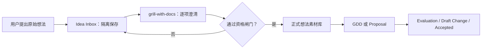

# GDD 素材资格闸门设计

## 背景

旧流程把 `idea-inbox/` 同时当作灵感收集区和正式 Idea 来源，因此允许信息不足的内容直接进入构思链。随着 GDD 写作模板建立，这种宽松入口会让模糊描述在 Proposal、GDD 和核心构思中被误当成可用设计材料。

## 已采纳设计

采用双层想法库：

1. `idea-inbox/` 是原始想法隔离区。它允许模糊内容落盘，只代表已捕获，不具备正式引用资格。
2. `idea-materials/` 是正式想法素材库。只有经过 `grill-with-docs` 澄清并通过资格闸门的内容才能进入。

资格闸门要求素材至少能说明：可追溯来源、明确设计对象、玩家处境或设计功能、玩家行为与可见反馈、预期体验、与当前核心构思/GDD 的关系、待验证问题与下一步。它不要求完整数值或制作规格，因此不会把素材确认误做成完整 GDD 评审。

## 数据流

## GDD 联动

用户提出写 GDD 时，agent 必须使用统一 GDD 模板并先检索：

- 正式素材库中的相关内容：作为可纳入候选，逐项向用户提出。
- inbox 中的相关内容：作为未确认候选单独提示，不得直接写入 GDD；如用户希望采用，先完成资格确认和晋级。

这种设计保留灵感捕获能力，同时保证正式设计链只消费清晰、可追踪的材料。

## 历史内容处理

现有 `idea-inbox/` 文件不自动迁移。只有在后续 GDD、Proposal 或专题整理真正需要时，才逐份复审和晋级，避免批量制造未经确认的“合格素材”。
