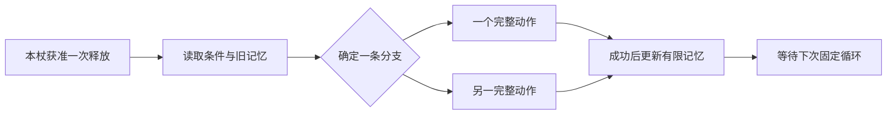

# 法术构筑三方向：机制完善与综合分析

- 日期：2026-09-20
- Project ID：`game-002-optimization`；目标游戏：`game-002`
- 研究状态：`Research / Provisional / Needs Human Review`
- 设计状态：三个候选均为`Agent Proposal / Raw Idea / Unqualified`
- 证据：用户原话、指定RC1及局部规则、基于明确候选的设计推理。玩法模拟、可玩原型、真人观察均`NotRun`。
- 方法：共享[设计评判框架v1.0](../../shared/evaluation-frameworks/README.md)，用“规则→交互→模式→策略→环境适应”检验，评分体系未校准，不计算总分。
- [来源与版本](2026-09-20-spell-construction-sources.md) · [当前问题](../questions/Q-20260920-spell-construction.md)

本文完成机制推荐稿和初步综合分析，不是正式Evaluation或GDD。新规则权威落点是下列原始记录；表中的“高／中／低”表示在这些假设成立时的设计潜力或负担，不是实测结果。用户原话、RC1事实和Agent补完不可互换。

## 1. 先给判断

**若优先寻找可辨认的独特玩法，建议先用纸面验证几何构型；若优先保持进入门槛与局内成长节奏，先验证词条锻造；语义引擎适合在确认玩家愿意享受排错后继续。**

三者分别把创造力放在流程、机制变体、空间关系。没有一个天然“更深”；必须看到玩家为了不同战场条件主动选不同方案，才能判断新增自由是否有效。

暂不建议将完整句法、逻辑布线、词条锻造和几何匹配同时叠在一个构筑流程里。它们争夺同一个“如何定义法术”的职责，同时学习会使失败原因更难辨认。先把三者作为替代法术表达层的平行方案，保留时间轴作共同对照；这是Agent的比较建议，尚待用户确认。

| 方向 | 玩家可复述的一句话 | 最有价值的新选择 | 优先担心的问题 |
| --- | --- | --- | --- |
| A 语义引擎 | 我让法术按条件走不同流程，并记住上一次做到哪一步 | 简短固定链与昂贵自适应链之间的取舍 | 复杂度花在接线和排错，实际仍只有唯一正确答案 |
| B 词条锻造 | 我选一张完整法术，再把一个核心机制改成适合当前构筑的版本 | 保留原机制、重排时序或花成长机会重锻 | 强化变成必选，体系变成预制套餐 |
| C 几何构型 | 我同时改核心轮廓与效果图形，让有限空间容纳不同法术 | 同面积下的效果集合、模板适配与施法周期取舍 | 最大核心／最小图形支配，空间题与战斗脱节 |

## 2. RC1已经提供了什么

用户概括的“词卡＋时间轴”成立，但当前独特性还来自两者之间的约束：实体词独占、完整法术绑定法杖、范围、共享开始槽、取消不顺延和有限成长。

| 核实的基线事实 | 对本轮构思的影响 |
| --- | --- |
| CG01已有有限的且／或／非与数量条件；新语义须有实体词支持 | A不能仅靠新增逻辑门声称增加表达能力；必须比较分支动作、记忆和空间成本 |
| 修饰词能改变原词，镶嵌能影响整句或范围；已有条件替换和有限响应 | B需要明确锻造比修饰词／镶嵌多出的成长选择，同时避免三套改写职责重复 |
| 法杖已有锚点及固定战场范围形状 | C的核心几何应单独定义为效果组合，不能把构筑图形和攻击范围混用 |
| 最多4出战杖，一杖一完整法术；词实体不能跨句复用 | 三方向都需要真实组件归属，不能免费复用同一个动作或效果 |
| 首次冷却起点0–10；C与L决定循环；后置杖赢同刻开始槽 | 构筑越丰富，必须仍能看懂何时开始、为何被覆盖、下一次何时尝试 |
| 实际生命伤害取消当时冷却中的机会；取消后仍按名义结束续排 | 长构筑或多阶段方案存在中途损失，不能为了展示新机制偷偷免除 |
| 原完整事件后判胜负，再至多一层响应；首次来源固定 | A的图传播与B／C的多效果不能被当作无限连锁许可 |
| 规则Accepted，平衡及真实体验仍Hypothesis／NotRun | RC1本身也不是已证明好玩的控制组；本报告不能声称扩展解决了已实测问题 |

RC1主要面向喜欢构筑、读规则、从自动战斗记录修正方案的玩家，不要求编程知识；目标完整局15–25分钟。A明显增加逻辑排错需求，C增加空间搜索，B增加变体识别，都会占用有限会话时间。

活动背景包仍为2026-09-09旧包。它的手牌、补牌、旧数值及未确立核心等状态不适用于用户指定RC1；本轮没有把旧包与新GDD混成一套规则。

## 3. 三份机制完善稿

### 3.1 A：有限语义引擎

完整规则与原话见[SC-A-v01](../idea-inbox/2026-09-20-semantic-engine.md)。

每次只执行一个末端；不是两条分支都获得施法。有限空间、实体组件和固定整板周期限制自适应能力。一个记忆位可实现“先种印，下一次兑现”，避免只有静态条件筛选；出现目标失效时，玩家可以花额外组件建立恢复分支。

**可玩性潜力**：发现流程漏洞并亲手修复，能产生强烈因果反馈。但在敌人计划完全公开的情境中，固定排程可能已经够用；若图只是更麻烦地重现已知顺序，则不值得增加。

**策略深度**：来自是否为异常情境付观察成本、有限板面如何分配、何时宁可保持短周期。只有某些遭遇偏好短链、另一些偏好自适应链，才有非支配选择。

**涌现**：跨循环状态与不同法杖的资源读写可形成模式。v01无环、单输出的限制降低表达上限，却使原因可追踪。它目前更接近有限控制装置，不是包含运输、加工和吞吐的完整工厂经营。

**关键反例**：只添加且／或／非，没有改变可执行动作或跨次状态时，新图可能只是现有条件的另一种UI。不能把布线数量算成新策略数量。

### 3.2 B：体系卡＋词条实例重锻

完整规则见[SC-B-v01](../idea-inbox/2026-09-20-keyword-forging.md)。

玩家直接拿到能施法的体系卡，然后在本局有限机会中改写一张卡上的词条实例。v01优先做互斥机制分支，避免把多个改写全加上去；同名词条的其他卡保留原义。

印爆例展示三个真实选择：原版立刻消耗打伤害，留种保住一层供其他法术利用，蓄爆等待更多印记换取更强兑现。留种还能被“先守印、后引爆”的时间重排部分替代，必须让玩家比较付锻造机会还是付相位机会。

**可玩性潜力**：起步动作较明确，获得和改造的反馈直接，比较适合一局中逐步展开复杂度。其乐趣依赖“改后有什么新的用法”，仅伤害上涨不能承担独特性。

**策略深度**：体现在跨战成长承诺与本场配置之间。一次锻造可能适合当前敌人，却降低对下一种压力的应对；前提是成长机会有限、变体确有短处。

**涌现**：来自不同卡共享可操控的状态、同一关键词参与不同角色，而非集齐三张自动发套装奖励。预制卡并不排除涌现，但过窄的体系专属互动会把探索变成找预设答案。

**关键反例**：一种变体在所有场景都更强，或其全部作用都能由免费战前重排取得，那么它分别是单向升级或冗余机制，不应算新增策略深度。

### 3.3 C：几何匹配＋核心与模板双向成长

完整规则、可手算轮廓和匹配边界见[SC-C-v01](../idea-inbox/2026-09-20-geometric-spell-core.md)。

玩家用有限拼片组成核心，并为实际持有的基础图形卡选定包含位置。一个形状只贡献一次效果；允许有限重叠，让一处结构承担多种作用，但共享格、总模板面积、实体卡和冷却共同约束收益。

玩家既能改核心去适应现有图形，也能重锻图形去适应核心。两者必须有不同成本，否则最优行为可能只是把所有效果缩成一格。

**可玩性潜力**：可视空间能让创造过程直观出现，移一格就能预览失去和获得哪些效果。需要警惕空间操作成功带来的满足感掩盖战斗选择贫乏。

**策略深度**：同面积轮廓可以分别支持防护与留痕、或留痕与消耗；一次整合节省出战杖，却可能拉长循环并失去独立相位。形状、效果与时间的三方取舍比单纯提高装填率更有价值。

**涌现**：来自共享几何约束使多个效果相互牵制，再与战场资源发生互动。“一格移动让两个效果换位”有发现潜力；单纯找出更多平移／旋转副本不算涌现。

**关键反例**：解出一个通用大方块后每场照用，或自动优化器总能无代价给出最大收益摆法，那么核心更像一次性装填工具。自动提示可指出合法匹配，若直接替玩家完成全部有意义的空间选择，则需重新审视核心动作。

## 4. 综合维度比较

以下为基于推荐稿的条件性判断，不是市场结论、玩家评分或已测平衡。

| 维度 | A 语义引擎 | B 词条锻造 | C 几何构型 |
| --- | --- | --- | --- |
| 核心动作清晰度 | 中低：观察、连线、分支、排错需一起理解 | 较高：选牌→看改写→排时序，仍需明确词条作用域 | 中高：看图形匹配直观，重叠及复合触发需教学 |
| 可玩性潜力 | 偏向喜欢自动装置和调试的玩家；重复配置可能疲劳 | 起步直接、成长反馈稳定；内容重复时容易套路化 | 空间发现直观；可能被拼图时长拖慢 |
| 策略深度上限 | 高但有条件：适应性必须换来真实成本和反制 | 中高：变体与资源、相位、成长机会交叉 | 中高至高：轮廓／模板／效果／相位互相限制时成立 |
| 可理解涌现 | 潜力高、解释负担也高；有限状态有利复现 | 中：共同状态可复用，专属套餐会压低上限 | 中高：共享形状与战场互动叠合，不能只看排列数 |
| 与现有时间轴协同 | 中：固定整板周期可读，动态控制可能削弱手动规划价值 | 高：变体改变C、资源留存和兑现机会，比较自然 | 中高：整合与拆杖影响周期及相位，但也易藏住子效果顺序 |
| 认知／配置成本 | 高：真假、流程、记忆和故障路径并存 | 中：数量有限时易读，变体过多会变成背表 | 中高：轮廓、旋转、重叠和时序要分层呈现 |
| 内容与规则审查成本 | 高：模块少仍可能有许多行为路径 | 中高：每个变体须检查触发、来源、费用、同组及获取 | 中高：模板族、轮廓支配关系、效果组合均要审查 |
| 差异化潜力 | 中高：有自动控制辨识度，但仅布线不能证明独创 | 中：成长结构熟悉，需要机制改写而非词条数量支撑 | 较高：双向塑形具有可展示特点；不宣称市场首创 |
| 适配RC1核心玩家 | 有明显分化，偏好调试的玩家更合适 | 相对较近，降低构句负担而保留规划 | 可能吸引空间构筑玩家，也可能排斥不喜欢拼图者 |
| 最便宜的证伪路径 | 手工走三次机会，看玩家能否解释并修复空转 | 原版重排对比两个变体，看锻造是否有新增价值 | 固定面积纸片，看不同战斗需求能否驱动不同轮廓 |

“高上限”不能抵消“当前不好读”。选择首先取决于希望玩家反复享受哪个动作，而非把各列加成一个总分。

## 5. 用五层因果链检查涌现

| 层级 | A | B | C |
| --- | --- | --- | --- |
| 基础规则 | 一次许可、条件分流、一个有限记忆位 | 状态生产／消耗、单实例变体、有限锻造 | 包含匹配、一次计数、共享格及面积预算 |
| 交互 | 上次成功改记忆，下次条件决定动作 | 留种改变后续守印资格；长冷却改变兑现刻 | 同一格支持多个图形，某轮廓排除某效果 |
| 可记忆模式 | 种印→兑现；失效→恢复 | 保种防守；积累爆发；原版抢先 | 紧凑防守；纵向兑现；分杖分时 |
| 策略 | 根据目标稳定性和压力决定是否购买恢复分支 | 根据击杀窗口与未来成长决定是否改词条 | 根据遭遇需求选择轮廓、模板或独立相位 |
| 环境适应 | 敌方公开压力、目标失效使万能流程有成本 | 不同期限与资源供给使变体互有优势 | 可得图形和敌方压力使最优轮廓随局面变化 |

以上是**候选因果链**。只有真人能预测、解释、主动复现，并且能指出代价与反例，才可开始称其为有效涌现策略。当前有效策略数量Unknown，不计算ER，也不把理论排列数当深度证据。

## 6. 最容易退化的路径与修正

| 候选 | 退化路径 | 优先修正 | 仍不能证明的事 |
| --- | --- | --- | --- |
| A | 更多门总更好，形成万能程序 | 自适应分支占空间及周期；限定动作吞吐；比较短链 | 有成本不代表玩家享受成本 |
| A | 只有固定脚本，画图没有新决策 | 比较有无跨循环状态与异常恢复的实际价值 | 记忆存在不等于复杂流水线成立 |
| B | 所有升级只涨数字或叠收益 | 每个机制分支写清失去什么，允许保留原版 | 分支多不代表价值会随局面变化 |
| B | 每个流派只有一套作者指定组合 | 共享状态、允许跨体系角色复用，拒绝隐藏套装奖励 | 通用规则也可能形成唯一最优解 |
| C | 无限重叠、重复位置计次、面积扩张无代价 | 一卡一次、显式位置、共享预算、固定面积先比较 | 限制足够多不代表空间题有趣 |
| C | 所有最终图形都缩成一格 | 效果、时间和变形机会共同定价；保留形状适配差异 | 不能凭一张示例证明全模板族平衡 |
| 共同 | 新系统直接提供更多免费输出 | 记录实体、场上资源、开始机会、成长机会四类成本 | 不同表达系统的同卡数并不等于同预算 |
| 共同 | 玩家只知道“没生效”，无法修 | 显示决定性原因及下一个名义机会；区别非法、取消、条件失败 | 更详尽日志也可能增加阅读负担 |

复杂度应先花在能改变选择的部分。A的无界环路与运输、B的任意词条组合、C的任意轮廓与递归几何，都不适合直接作为第一轮完整内容要求。

## 7. 与现有构筑层如何收束

| 现有职责 | A推荐处理 | B推荐处理 | C推荐处理 |
| --- | --- | --- | --- |
| 外层句法 | 改为控制图；动作末端仍用明确词义 | 由完整体系卡承担 | 由已激活图形的效果摘要承担 |
| 词卡实体与权限 | 保留到节点和动作分支，不免费复用 | 重新定义为体系卡权限；原卡池不能机械一一照搬 | 重新定义为图形卡权限；核心中包含形状不自动赠卡 |
| 修饰词 | 初期作为动作内部能力，避免再用门重复表达同一控制 | 与词条重锻合并职责优先，别保留第二套同作用升级 | 初期由图形变体承担，避免同时学习词修饰 |
| 法杖与镶嵌 | 保留时间／范围身份；先审查会重启图的特效 | 保留时间／范围；与词条改写重复者需逐项取舍 | 保留战场范围，与核心几何明确分层 |
| 时间轴 | 整板固定周期与一次开始槽 | 完整卡周期，变体前后清楚对比 | 完整核心周期，对比合并和分杖 |
| 局内成长 | 获得模块与词义；渠道和价格另议 | 获取体系卡与有限锻造机会 | 获取拼片／图形，选择改轮廓或改模板 |

此表是比较架构，不是迁移决定。若用户要求保留全部原句法，应重做复杂度判断，而不是直接给三套新玩法各加一个入口。

不建议立即将A／B／C合体。若后续某一个成立，再从另一个方向借一项能力：例如C成立后才研究图形词条的机制变体；这属于下一轮候选，不计入当前三份方案的收益。

## 8. 验证顺序与可证伪标准

### 第一阶段：先验证规则能否说清

各方案只用原始记录里的小夹具，不迁移完整卡池。检查以下反例，记录预期结果及实际结果；本轮仅列计划，没有执行结果。

| 共同边界 | 必须回答 |
| --- | --- |
| 同刻冲突／生命伤害取消 | 是否整条法术丢失，下一机会是否仍按名义周期 |
| 目标失效／资源不足 | 是否跳过、不补位、不先部分付固定费 |
| 一份资源两次消耗 | 是否按更新后剩余量处理，不能复制资源 |
| 原动作与响应 | 是否仍有明确完整事件及一层触发边界 |
| 配置成本 | 装配后的多功能收益是否真实承担实体、空间、时间或成长代价 |

A另外检查失败不写闩、无分支不排队、复诵不重走图；B检查同名其他实体不变、变体替换非叠加、原版仍可选；C检查旋转非镜像、真实格包含、一次计数、重叠上限及整合后的成功次数。

### 第二阶段：验证新选择是否优于更简单的解释

- A对照“固定短链＋既有时间排程”，看条件控制和记忆是否减少真实损失，而非只新增操作。
- B对照“保留原版＋战前重排”，看重锻是否打开新的资源分配和成长选择。
- C对照“相同效果分到独立法杖”，看轮廓整合是否确有收益与损失两面。

三方案使用不同实体与权限，不能按“同样三张卡”直接比较胜率。先分别核对各自预算中的基础效果、时间吞吐、可用开始机会与成长成本，明确哪部分无法等价；再用相同公开战场压力作探索比较。无法公平归一时记录限制，不制造精确排名。

### 第三阶段：选一个方向与RC1做小样本体验筛查

建议先选C；若用户更重视快速上手，则改选B。可招募6位符合目标画像的新玩家，使用基线与单一候选两种表达，在短击杀和持续防御两个情境中各完成一次任务，共24次情境任务。3人先基线、3人先候选，明确记录教学、配置、观看、查阅和修复时间。

| 观察项 | 候选成功信号 | 失败／复审信号 |
| --- | --- | --- |
| 理解 | 教学后能预测主要效果并说出一次失败原因 | 只能记按钮，无法说明触发、费用或下次机会 |
| 选择 | 两种情境中出现理由成立的不同配置 | 同一方案总被选，其他方案仅更弱或更烦 |
| 复现 | 解释一次发现后能在新局面主动重建 | 偶然成功，重复操作也不知道原因 |
| 时间负担 | 配置与排错占比可被玩家接受，与目标局长相容 | 多数时间消耗在整理界面或重复修复 |
| 持续意愿 | 玩家能主动说出还想尝试的另一方案 | 完成一个解以后只想跳过系统 |

这是定性筛查，样本不足以证明留存、市场规模或平衡；不以一场爽快演出宣称可玩性通过。确立测量口径后再制定数值阈值，避免事后挑指标。

## 9. 逐方向建议

| 候选 | 当前研究建议 | 推荐完善重点 | 继续条件 |
| --- | --- | --- | --- |
| A | 修改后再作正式评估 | 将“复杂逻辑”收束为有限控制与可解释恢复；确认目标玩家愿意调试 | 玩家能享受修流程，并发现固定排程无法轻易替代的选择 |
| B | 推荐推进小规模验证 | 机制分支、单实例作用域、真实成长机会成本 | 变体改变策略且原版仍有情境价值 |
| C | 优先验证独特性 | 双向塑形、有限重叠、与时间轴的整合／拆分取舍 | 同面积产生不同有效选择，空间题能转化为战斗决策 |

本轮没有将任何方向标记为Accepted、Parked或Rejected，也没有新建正式Evaluation。当前共同缺口是“替代还是叠加构句层”；这个决定会改变全部方案的复杂度判断。详见[单一澄清问题](../questions/Q-20260920-spell-construction.md)。

## 10. 本轮自检与证据边界

- [x] 保留三个用户原始构思，并分别给出清晰机制推荐稿。
- [x] 写明玩家动作、规则、成本、反馈、失效、时间轴衔接和最小验证。
- [x] 对照RC1已有能力，未把且／或／非、修饰词或范围形状冒称为新系统。
- [x] 区分构筑板空间与战场空间、词条定义与词条实例、图执行与完整事件触发。
- [x] 分析可玩性、策略深度、涌现、复杂度、差异化、内容成本与退化风险。
- [x] 推荐有条件，提供更简单对照及失败信号；未伪造分数、测试或市场独创证据。
- [x] 仅在本探索项目写入；没有展开其他方向正文，没有回写game-002。
- [ ] 用户确认替换／叠加边界及每个方向的关键规则。
- [ ] 正式素材资格、Proposal／Evaluation、模拟与真人体验验证。
