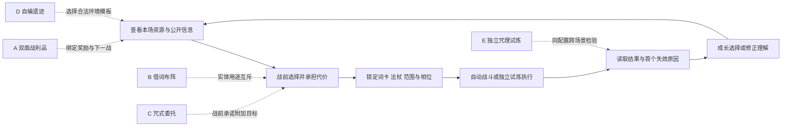
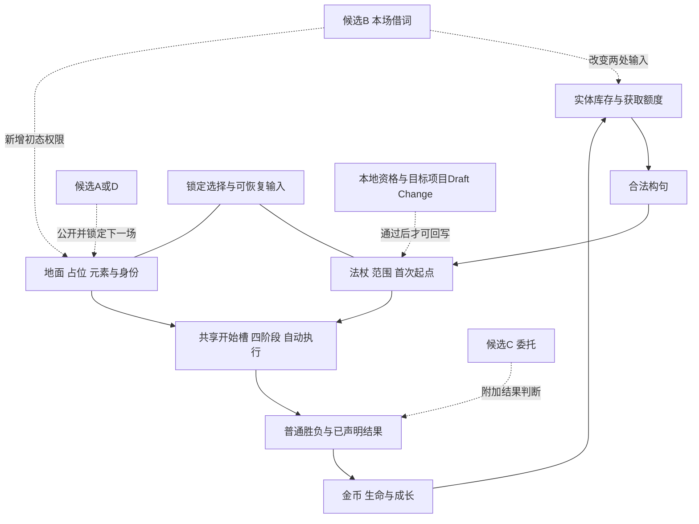

# GIC 24款创新机制与《言咒》迁移研究

日期：2026-09-20。Project ID：game-002-optimization。状态：Research / Provisional。

本报告把GIC中的机制结构与用户指定的《言咒》RC1比较，形成五个新方向。主结论：先研究“借词布阵”或“双面战利品”，不要同时加入所有候选。完整规则草案、取舍与反例见[方向报告](../directions.md)，逐款处理见[24款索引](../case-index.md)。

## 证据地图

| 证据 | 范围 | 能支撑什么 | 不能支撑什么 |
| --- | --- | --- | --- |
| B0 | 全游戏GDD RC1；构句/元素相关正文 | 既有规则、产品合同与新增差异 | 成品已完成、平衡或体验通过 |
| T01–T05 | 双侠小队、守誓者、王之凝视、冠军挑战者、时序迷局 | 编排、激活权限与约束反馈的结构 | 新系统必然适合单人自动战斗 |
| T06–T10 | 霓虹白客、永恒牌、火爆狂飙、蒂尔特之辉、阿亚尔 | 互斥用途、延迟成本、选择收敛 | 代价的正确数值与本游戏收益 |
| T11–T14 | 孤勇英豪、夺心魔虫、Moon Colony Bloodbath、盒中猫 | 成长与后果、公开承诺 | 原作完整边界、单人心理博弈效果 |
| T15–T18 | 文字游戏、堆叠大陆、蓝途王子、万境奇旅 | 媒介统一、空间选择与内容成本 | 无限语义/物理规则的可生产性 |
| T19–T22 | 苏丹的游戏、拯救世界操作指南、海盐折纸、漫威终极逆转 | 目标、承担风险与结算关系 | 复制多人加注到单人后仍然好玩 |
| T23–T24 | TUNIC、预视武宗 | 知识成长、练习与掌握 | 主线无限预演的合理性 |

所有T来源均为同一个GIC网站的二手创新描述。24款合并40份详细文字档案，不把重复提名当作独立证据；剩余184份只有目录级筛选。原文哈希和档案链接见[source-manifest](../source-manifest.json)，自写转述见[source-notes](../source-notes.md)。

## 模块1：定位、基础信息与商业证据

这不是24款游戏的完整产品复刻或市场报告。目录覆盖桌游和电子游戏，选择标准是机制差异与材料完整度，不按TOP1/TOP5直接决定适配优先级。日期、标题与原图地址保留站点记录，不推断当前销量、留存、评分、版本或发行状态。商业材料不足，因此不讨论本游戏的市场成功概率。

对《言咒》的定位仍沿B0：单人离线、实体词卡、战前编排、自动执行与可解释结果。跨品类参考是为了发现新的选择结构，不是默认更换受众、平台或游戏品类。

## 模块2：玩家体验与设计目标

最值得迁移的是“一个选择同时放弃另一种价值”。T06把火力和移动放在同一张卡上，T11把成长与未来敌人关联，T17把奖励与空间后果绑定。它们共同提示：如果新增功能总可以免费使用，就很难产生新的策略判断。

B0的实体副本恰好能承担这样的成本。把“火焰”借给场地后，句子里就少一张火焰；其好处和损失都可见。与此同时，T04提醒自动执行不能让玩家丧失对结果的解释，故新增规则数量不是目标。目标是玩家能说出自己选了什么、放弃了什么、结果为何不同。这仍是待验证的体验假设。

## 模块3：核心玩法循环

来源循环已逐款记录输入、选择、代价、反馈和回流。本轮五个方向分别改变一处主要选择，保留准备—执行—反馈骨架；E为独立模式，不能伪装成主线必需环节。

### 核心循环图

以B为例，输入是12张真实起始卡与公开十格战场，动作是借或不借一张火/冰名词，输出是一个初始元素与减少的可构句库存，成本是失去本场该副本的循环用途，反馈是元素是否被有效操控/补层/抵消，回流是战后返卡与下一场重新选择。单场结果不能直接证明整局经济或复玩价值。

## 模块4：系统关系与规则约束

新增方向必须进入已有系统的输入或目标层，不能偷换基础语义。T14的临时身份很鲜明，但本游戏以稳定词义、固有属性和首次来源为依据，因此没有迁移“任意宣布属性”。T03的凝视也没有被改成战中手控范围。

### 系统关系图

A新增词卡获取渠道，B新增实体用途及初态来源，C新增可选目标与奖励，D新增环境选择，E新增独立流程。它们都不是RC1默认许可；单张词卡不能同时占两处，次数/同名额度不能绕过，退出不能换输入，派生事件不能无限递归。B首测建议用既有中立预置元素性质，仍须明确新的放置权限与初始层数。

## 模块5：内容与关卡体系

T05说明约束变化可以检验同一套判断；T18说明丰富互动有时来自大量作者预写，而非通用系统自然涌现。这两点共同限制了本轮范围。

A只做一个节点两份契约；B只开放火焰/冰霜两种已有名词；C先做两种基于现有状态的委托；D先有两份完整合法地形模板；E先有三份公开输入和一份迁移题。精确内容仍需合法性与可解性审查，不用列出了名字就假装任务可完成。后续若必须扩张卡池、物性或新敌人能力才能成立，应退回范围判断，而非继续堆内容。

## 模块6：数值、资源与经济闭环

T09提供互补收益的设计结构，但来源中的“合计7”不能照搬成本游戏公式。T07提供资源耗尽风险，却不能据此把词卡改为生命。数值关系必须由本项目实际资源与合法取得时间决定。

重点账本是：A的新增奖励会不会让金币采购失去意义；B的初始层数是否压过少一张名词的代价；C的目标收益是否强迫所有玩家接单；D是否让玩家总能删除最麻烦的环境；E是否偷偷把知识记录转为永久战力。所有验证采用同资源对照，后段组件不能免费放进起始库存。当前没有给出或验证平衡参数，不报告胜率或可行流派数量。

## 模块7：叙事、媒介与视听呈现

T15和T16的共同价值在于操作媒介与世界结果紧密关联。对于B，词卡从库存移到“借用”区、场上出现对应元素、剩余副本立即减少，这三者应被同时看懂；不必把全场都改成汉字，也不要求玩家记住新合成配方。

T23提示知识本身可以成为奖励，迁移到E时记录解法原则与反例，基础规则仍公开。C可以用“委托”解释为什么要留下特定痕迹，但不引入整套人物关系叙事。本轮没有音画原型、试听或系统图像审计，不能断言这些呈现已经直观。

## 模块8：得失复盘与下一实验

研究处理并非全盘吸收：时间编程与极简自动执行用于校验已有设计；实时凝视、量子词义、多人诈唬、强制递减法杖和无限预演均未进入最终方向。它们要么与产品合同冲突，要么重复已有决策，要么需要新的系统才能成立。

首选B，因为它能直接检验词卡实体的额外机会成本；次选A，因为它将局内成长与挑战相连。C适合少量附加目标实验，E适合独立玩法/教学模式，D要先证明环境选择存在双向利弊。排序是作者判断，不能据此宣布规则Accepted或体验Pass。

## 对本项目的转化

五方向的原始状态、资格缺口、成功/失败信号已单独记录。建议下一次只选B，先明确是否接受“少一张可构句名词换初始元素”，再补层数、合法落点与保存输入，最后做同资源对照。若希望调整整局成长则选A，不应为同时采用两项而绕过各自成本检验。

所有新机制只写入本探索项目的inbox与insights。本次未新增正式素材、Proposal、Evaluation、GDD、Draft Change或Accepted规则，未修改game-002正文。正式推进按本地资格闸门与目标项目回写流程进行。

## 未确认信息

- GIC二手描述与原作完整官方规则可能存在简化或差异；正文充分度不等于独立事实验证。
- 24款共40份详细文字档案；其余184份未完整分析。10款短摘要游戏的12份记录曾尝试补原图但未取得可靠证据，保留为待补。
- 五方向都没有玩法模拟、可玩原型、真实玩家或商业结果。验证计划均为Planned / NotRun。
- 用户尚未选择新机制及其成本；当前只能是Agent Proposal / Raw Idea / Unqualified。
- 基线文件哈希固定于本轮来源；以后GDD或来源站变化必须另做版本对照，不能静默改写这次研究。
