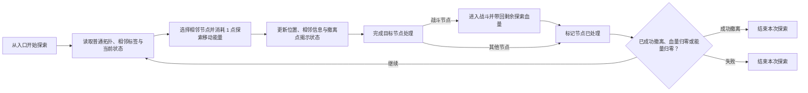
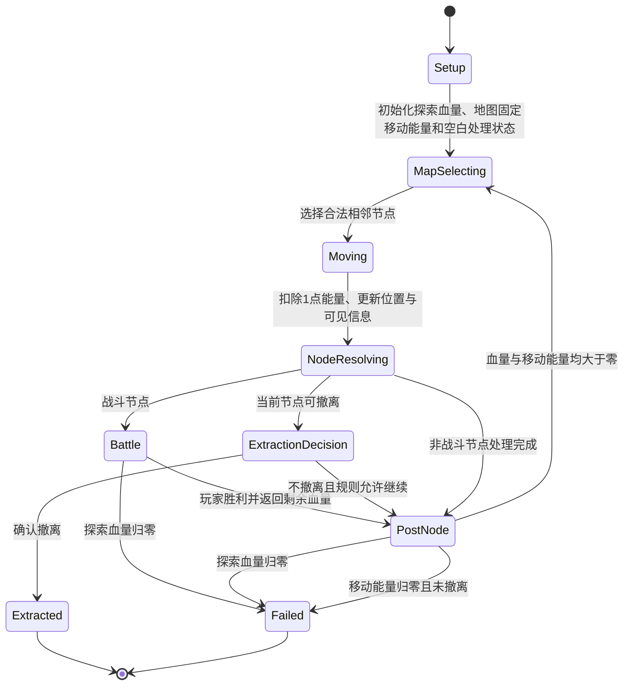
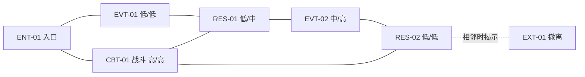

# 《共享地图—战斗—撤离闭环》GDD

## 0. 文档控制 `[必填]`

| 字段 | 内容 |
| --- | --- |
| 文档 ID | `GDD-WORLD-001` |
| 当前版本 | `0.2.0` |
| 文档成熟度 | `GDD-1` |
| 设计状态 | `Evaluation` |
| 负责人 | `系统设计 / 地图原型` |
| 评审人 | `用户 / 战斗设计 / QA（待指定）` |
| 创建日期 | `2026-08-22` |
| 最近更新 | `2026-08-22` |
| 目标里程碑 | `地图灰盒 v0：完成确定性地图—固定 PvE—撤离闭环并取得首轮行为证据` |
| 关联提案 | [整体系统优先](../idea-proposals/P-2026-07-01-overall-system-priority.md)、[早期共享地图提案](../idea-proposals/P-2026-05-13-unique-core-card-battle-map.md) |
| 关联正式素材 | 见 0.5 素材审查 |
| 待确认 inbox 候选 | 经营、资源经济及早期综合构思中的未拆分部分；见 0.5 |
| 关联评估 | [整体系统优先评估](../evaluations/E-2026-07-01-overall-system-priority.md)、[早期共享地图评估](../evaluations/E-2026-05-13-unique-core-card-battle-map.md) |
| 关联决策 | [决策记录](../decision-log.md) |
| 关联原型/测试 | [战斗系统 GDD-1](GDD-2026-08-21-card-battle-system.md)、[`combat-lab v1`](../../combat-lab/README.md)；地图灰盒待按本版夹具建立 |

### 0.1 本版目标

把已确认的 GDD-0 概念合同转化为可实现、可复测的地图灰盒规格。本文冻结首轮灰盒的地图夹具、系统接口、交互反馈、参数扫描、验收标准和停止条件，用于判断地图—战斗—撤离闭环是否值得继续；不把测试参数写成正式数值或 Accepted 核心设定。

### 0.2 本版范围

**包含：**

- 一张有限、人工配置、至少包含一处分支的节点图。
- 一个开局隐藏、相邻时与连接边同时揭示的撤离点。
- 普通节点拓扑公开，相邻普通节点显示类型及低/中/高风险、收益标签。
- 相邻移动、探索移动能量、探索血量和当前探索内的节点处理状态。
- 资源、事件、战斗、起始入口和撤离点五种节点功能的流程位置，不展开节点内容与收益。
- 固定 AI/PvE 战斗节点与 [战斗系统 GDD-1](GDD-2026-08-21-card-battle-system.md) 的最小接口；当前原型不接入玩家 PvP。
- 成功撤离、探索血量归零和探索移动能量耗尽的闭环结束条件。
- 一张 6 个普通节点加 1 个隐藏撤离点的确定性灰盒夹具、一条高风险捷径和一条低风险长路。
- `4 / 5 / 6` 点三组初始探索移动能量候选；每次测试只启用其中一个固定值。
- 一个版本锁定的 PvE 节点夹具、测试专用收益分、最小地图 HUD、事件日志与复现字段。
- 规则验收、内部试跑和首次接触玩家测试。

**明确不包含：**

- 经营系统、占领、开发、关卡发布、夺权和异步挑战。
- 真人玩家 PvP、匹配、联网和主动玩家冲突。
- 撤离收益、失败损失、资源数量、资源储存、交易和完整经济。
- 治疗来源、回访额外效果和具体资源/事件节点处理逻辑。
- 正式初始探索移动能量、正式节点数量/连接密度、正式标签阈值和制作级 UI；本版数值和界面均为灰盒夹具。
- 正式版程序生成算法；正式版先做有限程序生成、以后另做无尽模式的方向只作为未来范围记录。
- 联网、存档、断线恢复、正式音画和平台规格。

### 0.3 证据状态摘要

| 结论/模块 | 状态 | 依据或下一步 |
| --- | --- | --- |
| 有限人工节点图、至少一处分支、单撤离点；起始入口不可撤离 | `Hypothesis` | 用户已确认范围与出口边界；需要地图灰盒验证路线选择 |
| 普通拓扑公开、相邻节点显示三档风险/收益 | `Hypothesis` | 正式素材已确认；需要验证标签是否真的改变路线 |
| 撤离点及连接开局隐藏、相邻时揭示 | `Hypothesis` | 正式素材已确认；需要验证神秘感与公平性 |
| 探索血量跨节点和战斗保留 | `Hypothesis` | 接口边界已确认；尚未完成地图—战斗串联测试 |
| 探索移动能量按图固定、每步消耗 1、探索中不补充 | `Hypothesis` | 重要规则已确认；具体初始点数待灰盒确定 |
| 节点处理完成后返回地图，已处理节点可返程且不重触发 | `Hypothesis` | 时序已确认；尚未验证可读性和节奏 |
| 战斗节点使用预先配置、可复现的固定 AI/PvE 对手 | `Hypothesis` | 对手来源和边界已确认；本版夹具见 6.2，需先完成内部校准和地图—战斗串联验证 |
| 单图双路线夹具与 `4 / 5 / 6` 点能量扫描 | `Hypothesis` | GDD-1 测试设计；先做可达性枚举，再以内部试跑选出玩家测试候选 |
| 测试专用收益分可以让风险/收益标签产生最低限度的选择动机 | `Hypothesis` | 只用于灰盒和结算记录，不进入经济、成长或正式奖励设计 |
| 撤离收益、失败损失、经营与完整经济 | `Unknown / Parked` | 保留在 inbox；基础闭环验证前不展开 |
| 正式版有限程序生成与后续无尽模式 | `Out of Scope` | 仅记录阶段方向；当前原型使用人工图 |

### 0.4 本次变更摘要

| 版本 | 日期 | 修改人 | 变更内容 | 原因/依据 | 影响范围 |
| --- | --- | --- | --- | --- | --- |
| 0.1.0 | 2026-08-22 | Codex | 首次建立共享地图—战斗—撤离 GDD-0 | 用户确认进入下一阶段；相关素材资格确认已完成 | 地图循环、战斗接口、结束条件与灰盒验证 |
| 0.1.1 | 2026-08-22 | Codex | 明确起始入口不能撤离，唯一隐藏撤离点是唯一成功出口 | 用户确认推荐边界 | 撤离条件、术语、地图可达性与未知项 |
| 0.1.2 | 2026-08-22 | Codex | 首个地图原型固定使用 AI/PvE 战斗节点，不接入玩家 PvP | 用户确认推荐边界；正式素材资格通过 | 战斗节点、地图—战斗接口、遭遇范围与未知项 |
| 0.2.0 | 2026-08-22 | Codex | 从 GDD-0 晋级 GDD-1，补齐确定性地图夹具、四个系统合同、测试与验收 | 用户确认进入下一阶段，并授权具体测试细节不逐项评审 | 地图、节点、PvE 接口、终局、数据、测试与验收 |

### 0.5 素材审查 `[必填]`

**正式素材候选：**

| 素材 | 与本 GDD 的关系 | 建议章节 | 用户决定 | 处理说明 |
| --- | --- | --- | --- | --- |
| [共享地图探索循环](../idea-materials/M-2026-08-18-shared-map-exploration-loop.md) | 闭环主干 | 1、2、3 | `Include` | 纳入路线—节点—战斗—继续/撤离循环 |
| [有限人工节点图原型](../idea-materials/M-2026-08-21-finite-handcrafted-node-map-prototype.md) | 当前验证载体 | 0、2、9、16 | `Include` | 纳入人工、有限、分支与几何可达约束 |
| [单撤离点原型范围](../idea-materials/M-2026-08-21-single-extraction-prototype.md) | 当前出口范围 | 0、2、9、16 | `Include` | 原型只配置一个撤离点 |
| [仅在撤离点完成主动撤离](../idea-materials/M-2026-08-21-extraction-node-only.md) | 空间退出约束 | 1、2、4、5 | `Include` | 起始入口及其他非撤离节点不能直接退出 |
| [普通节点拓扑公开与相邻信息显示](../idea-materials/M-2026-08-21-map-information-layer.md) | 地图信息层 | 1、2、4、9 | `Include` | 公开普通拓扑，局部显示节点信息 |
| [相邻节点三档风险与收益标签](../idea-materials/M-2026-08-21-adjacent-node-risk-reward-tiers.md) | 路线判断信号 | 1、2、4、9 | `Include` | 标签不等于具体结果或数值承诺 |
| [撤离点相邻揭示](../idea-materials/M-2026-08-21-adjacent-extraction-reveal.md) | 出口发现时机 | 1、2、4、5 | `Include` | 在下一次路线选择前揭示并永久标记 |
| [隐藏撤离点连接呈现](../idea-materials/M-2026-08-21-hidden-extraction-connection.md) | 出口连接可见性 | 2、4、5、9 | `Include` | 节点与关联边同时揭示 |
| [探索中跨节点保留血量](../idea-materials/M-2026-08-21-persistent-exploration-health.md) | 地图—战斗状态接口 | 1、2、4、5、8 | `Include` | 战斗读入并返回同一探索血量 |
| [节点结算完成后返回地图](../idea-materials/M-2026-08-21-node-resolution-return.md) | 节点与战斗时序 | 2、4、5 | `Include` | 处理中不能切换路线 |
| [探索内处理状态](../idea-materials/M-2026-08-21-processed-state-persistence.md) | 当前探索状态 | 2、4、5、9 | `Include` | 探索结束后清除 |
| [已处理节点返程](../idea-materials/M-2026-08-21-processed-node-backtracking.md) | 返程与移动代价 | 2、4、5、8、9 | `Include` | 可经过、不重触发、仍消耗 1 点能量 |
| [正式版分阶段地图模式](../idea-materials/M-2026-08-21-phased-generated-map-modes.md) | 未来范围与验证顺序 | 0、1、9、16 | `Include` | 只纳入范围边界，不纳入当前原型规则 |
| [攻防共享周期战斗能量](../idea-materials/M-2026-08-21-shared-cycle-combat-energy.md) | 与探索移动能量的边界 | 3、4、8 | `Include` | 仅作为战斗接口依赖，不复制战斗内部规格 |
| [固定 AI/PvE 地图战斗节点](../idea-materials/M-2026-08-22-fixed-pve-map-battles.md) | 首个原型的战斗对手来源与接口范围 | 0、2–5、9、16 | `Include` | 每个节点引用预先配置、可复现的系统对手；排除玩家 PvP |
| [核心卡身份与所有权](../idea-materials/M-2026-08-18-core-card-identity-and-ownership.md) | 玩家身份上游约束 | 0、3 | `Park` | 本 GDD 不处理持有、替换、交易或世界卡池 |

**未确认 inbox 候选：**

| 原始想法 | 相关性 | 缺失的资格字段 | 处理结果 |
| --- | --- | --- | --- |
| [早期综合构思](../idea-inbox/2026-05-13-unique-core-card-battle-map.md) | 包含地图、资源、交易与战斗的混合来源 | 占领/开发、经济、交易和动态平衡仍未拆分确认 | 只使用其已晋级子素材；其余内容 `Park` |
| [关卡经营玩法](../idea-inbox/2026-05-29-level-operation.md) | 可能成为后续外层系统 | 行为、发布、收益、夺权、所有权、依赖和验证均为 `Unknown` | `Park`；不进入正文 |
| [撤离点位置保持未知](../idea-inbox/2026-08-21-hidden-extraction-location.md) | 直接相关的原始表达 | 无；资格字段已完成 | 已晋级为“撤离点相邻揭示”并纳入 |
| [正式版地图方向](../idea-inbox/2026-08-21-formal-generated-or-endless-map.md) | 未来地图模式 | 无；资格字段已完成 | 已晋级为“正式版分阶段地图模式”；当前范围仅记录方向 |
| [固定 AI/PvE 地图战斗节点](../idea-inbox/2026-08-22-fixed-pve-map-battles.md) | 直接相关的战斗节点范围 | 无；资格字段已完成 | 已晋级为正式素材并纳入 0.1.2 |
| 其余地图拆分 inbox | 各正式素材的原始来源 | 无；均已完成资格确认 | 只通过对应正式素材引用，不把 inbox 直接写入正文 |

## 1. 产品与体验合同 `[必填]`

### 1.1 一句话概念

> 玩家携带当前核心卡与构筑进入一张有限节点图，反复读取普通拓扑与相邻风险/收益信息、支付探索移动能量并处理节点，为在探索血量和移动能量耗尽前找到并抵达隐藏撤离点而承担继续深入或返程的取舍；战斗损伤会持续改变后续路线。

### 1.2 目标玩家与情境

| 项目 | 内容 |
| --- | --- |
| 核心目标玩家 | `Hypothesis`：喜欢节点探索、风险收益权衡、可解释路线规划和卡牌战斗后果的玩家 |
| 次级玩家 | `Unknown`：偏轻量卡牌或探索玩家是否能接受持续血量与隐藏出口压力 |
| 单局/单次时长 | 灰盒观测目标 `10–20 分钟/次`；正式时长仍为 `Unknown` |
| 平台与输入 | 灰盒使用桌面端鼠标；规则回归允许命令/测试输入；正式平台仍为 `Unknown` |
| 玩家已有知识 | 能理解节点连接、当前血量、剩余能量、低/中/高标签和撤离概念；战斗规则由战斗 GDD 教学 |
| 非目标玩家/体验 | 不优先服务完全开放世界自由移动、无代价试路、随时菜单撤离或纯经营优化体验 |

### 1.3 玩家体验承诺

玩家完成一次探索后，应能说明：“我知道自己为什么走这条路、哪场战斗迫使我改变计划、什么时候发现出口，以及为什么最后选择继续、返程或因判断失误而失败。”

### 1.4 设计支柱

| 设计支柱 | 玩家可观察表现 | 支持它的规则 | 反面信号 |
| --- | --- | --- | --- |
| 有依据的局部规划 | 玩家会同时引用拓扑、相邻标签和已知出口解释路线 | 普通拓扑公开；相邻普通节点显示类型与三档标签 | 玩家只随机点击，或只按固定节点类型行动 |
| 战斗改变地图判断 | 战后剩余血量会让玩家换路、避战或返程 | 探索血量传入战斗并带回，不因普通节点切换回满 | 战斗结束后路线选择完全不变 |
| 移动形成不可回收的承诺 | 玩家会计算剩余步数并为返程保留空间 | 每次相邻移动消耗 1 点探索移动能量，探索中不补充 | 能量不影响决策，或玩家无法理解为何耗尽 |
| 撤离是空间目标 | 玩家先寻找出口，揭示后围绕已知位置重新规划 | 单撤离点开局隐藏；相邻揭示；起始入口不可撤离，只有撤离点允许主动结束 | 任意节点都能一键撤离，或起始入口成为第二个已知出口 |
| 路线历史可读 | 玩家能识别已处理节点并将其用于返程 | 已处理状态本次探索内保留；返程不重触发原始处理 | 玩家反复误判节点会再次结算 |

### 1.5 反支柱

| 本游戏不追求什么 | 为什么 | 因此不采用什么方案 |
| --- | --- | --- |
| 无信息的纯盲探索 | 失败无法归因于玩家判断 | 不隐藏普通节点拓扑，不把类型与粗风险/收益全部隐藏 |
| 免费撤退与免费返程 | 会消除路线承诺和及时止损 | 不允许非撤离节点菜单撤离；已处理节点返程仍消耗能量 |
| 首个原型验证所有外围系统 | 会混淆地图闭环是否成立 | 不加入经营、完整经济、交易、占领和开发 |
| 用内容量掩盖路线问题 | 大量节点会增加成本但不保证选择成立 | 首先使用最小有限人工图和占位节点结果 |
| 基础闭环未成立就做无尽模式 | 无尽压力会改写当前撤离与返程逻辑 | 无尽前进只在有限基础模式验证后独立立项 |

### 1.6 核心假设

> 如果玩家能够依据公开普通拓扑、相邻节点标签、持续探索血量和有限探索移动能量反复调整路线，并在发现隐藏撤离点后重新比较继续与返程，那么地图选择、卡牌战斗和撤离可以形成一个可解释、值得重复验证的最小闭环。

- 状态：`Hypothesis`
- 当前依据：相关规则边界已经由用户逐项确认，并已形成合格 GDD 素材；地图灰盒尚未建立。
- 最大反证风险：隐藏撤离点与不可补充的固定移动能量组合后，成败主要取决于先碰到哪个分支，而不是可见信息和玩家判断。

### 1.7 下一验证问题 `[必填]`

- 当前最大风险：玩家在发现撤离点前无法估算真正的返程需求，固定移动能量可能把神秘感变成不可预判的失败。
- 下一步只验证什么问题：在一张有限人工分支图上，玩家能否用可见信息、探索血量和探索移动能量作出并解释路线变化，且把失败归因于自己的风险选择而非隐藏出口运气。
- 最小验证方式：使用第 6、9、14 节定义的单图夹具；先枚举 `4 / 5 / 6` 点能量下的可达路径，再接入版本锁定的 PvE 节点和测试专用收益分进行内部试跑，最后让首次接触玩家各完成一次未知出口测试，记录路线、出口发现时点、战后改路和失败归因。
- 成功信号：玩家能说明主要路线理由；在血量下降、能量减少或出口揭示后至少一次改变计划；成功与失败原因可被准确复述。
- 失败/停止信号：玩家主要随机试路；经常在没有可理解预警时因能量归零失败；出口揭示后已没有实际选择；增加节点只增加时长而不增加决策。

## 2. 核心循环与玩家旅程 `[必填]`

### 2.1 核心循环

一轮最小循环是“一次相邻移动 + 一次节点处理 + 一次继续/结束判断”。一次探索从入口初始化状态开始，以成功撤离或探索失败结束。

### 2.2 多时间尺度循环

| 时间尺度 | 起点 | 玩家动作 | 反馈/奖励 | 结束条件 | 再次进入动机 |
| --- | --- | --- | --- | --- | --- |
| 单步 | 地图选择状态 | 比较相邻节点并移动 | 能量扣减、位置与局部信息更新 | 进入目标节点 | 处理节点并获取新状态 |
| 单节点 | 到达节点 | 完成资源/事件占位处理或战斗 | 节点结果、血量变化、已处理标记 | 节点处理完成或探索失败 | 根据新状态选择下一步 |
| 单次探索 | 从入口初始化 | 寻找出口、处理节点、继续或返程 | 路线历史、发现反馈与结束结果 | 成功撤离或失败 | `Unknown`；收益与重开动机不在本版定义 |
| 长期 | `Out of Scope` | 经营、交易、成长等未定义 | `Unknown` | `Unknown` | 基础闭环验证后再讨论 |

### 2.3 玩家旅程 `[必填：GDD-1]`

| 阶段 | 玩家目标 | 可见信息 | 可选动作 | 关键决策/代价 | 系统反馈 | 失败与恢复 |
| --- | --- | --- | --- | --- | --- | --- |
| 探索初始化 | 理解当前状态与空间边界 | 普通节点拓扑、入口、当前血量/能量；撤离点隐藏 | 查看节点与连接；选择首个相邻节点 | 首步即消耗 1 点不可补充能量 | 可达节点高亮、相邻标签和状态 HUD | 配置非法则不开始本次探索 |
| 路线选择 | 选择下一段路线 | 相邻类型、风险/收益档、已处理状态、已揭示出口 | 选择一个合法相邻节点 | 移动不可撤销且必须完成目标节点处理 | 选中态、预计固定费用和确认反馈 | 能量不足时目标禁用并显示原因 |
| 节点处理 | 承担路线结果 | 节点类型与本节点粗标签 | 完成占位结果；战斗节点进入 PvE 战斗 | 处理中不能换路；战斗可能损失持续血量 | 结果摘要、血量/收益分变化、已处理标记 | 血量归零立即进入失败终局 |
| 战斗返回 | 依据剩余血量重估路线 | 胜负、剩余血量、当前能量、地图状态 | 选择捷径、长路、返程或已揭示出口 | 继续探索会叠加移动和后续节点风险 | 战斗前后血量差与可达节点重新高亮 | 战斗失败不返回可操作地图 |
| 出口揭示 | 把未知目标转为已知路线 | 撤离节点和连接、到达所需步数、剩余状态 | 前往出口，或继续获取测试收益分 | 继续可能失去可撤离余量 | 出口与连接同时显现并永久标记 | 无法再移动时按能量终局规则失败 |
| 撤离决策 | 结束本次探索 | 本局路线、血量、能量和测试收益分 | 确认撤离；能量允许时暂不撤离 | 退出是成功；继续承担失败风险 | 成功确认与结算摘要 | 未确认撤离且能量归零则失败 |

**关键决策点：**

| 时点 | 玩家知道什么 | 核心选择 | 当前代价 | 结果如何改变下一步 |
| --- | --- | --- | --- | --- |
| 选择相邻节点前 | 普通拓扑、相邻类型与三档标签、当前血量与移动能量、已揭示出口 | 进入哪个相邻节点 | 固定消耗 1 点移动能量，并承诺完成节点处理 | 新信息、节点结果和剩余状态改变后续路线 |
| 战斗前 | 当前探索血量、PvE 性质、对手名称/核心卡和粗风险档；不展示手牌、牌序或 AI 权重 | 进入并完成战斗 | 战斗可能消耗探索血量 | 剩余血量返回地图，可能迫使玩家改走捷径或放弃绕行 |
| 出口揭示后 | 撤离点节点和连接永久可见 | 立即前往撤离或继续探索 | 继续会消耗更多移动能量并承担节点风险 | 改变可用返程路线与失败风险 |
| 到达唯一撤离点 | 当前状态和撤离动作可用 | 确认撤离或在规则允许时继续 | 撤离结果的经济含义 `Unknown` | 确认后结束本次探索 |

### 2.4 成功、失败、撤离与退出

- 本次闭环成功：玩家抵达唯一撤离点并确认主动撤离。起始入口只负责开始探索，不具备撤离功能。
- 探索失败一：探索血量归零；若由战斗造成，则战斗失败后不返回可继续操作的地图状态。
- 探索失败二：一次移动使探索移动能量归零时，先完成目标节点处理；若目标为撤离点，允许完成撤离；否则处理完成后结束探索并按失败处理。
- 零能量边界：归零后不能继续移动，也不自动传送到入口或撤离点。
- 主动撤离空间限制：起始入口、资源、事件、战斗及其他非撤离节点不能直接执行撤离。
- 失败后保留/失去什么：`Unknown / Parked`；不在本 GDD 中推定。
- 撤离后获得什么：`Unknown / Parked`；不在本 GDD 中推定。
- 中断、退出与恢复：`Unknown / Out of Scope`，由正式客户端与存档方案决定。

## 3. 规则总览 `[必填：GDD-1]`

### 3.1 核心名词

| 术语 | 唯一定义 | 不等同于 |
| --- | --- | --- |
| 探索血量（暂定） | 同一次探索内跨节点保留，并作为玩家战斗初始血量传入/返回的当前血量 | 独立生存预算、世界资源 |
| 探索移动能量（暂定） | 当前探索中支付相邻移动的不可补充局内资源 | 战斗能量、探索血量、世界资源 |
| 战斗能量（暂定） | 单局战斗内部按攻防周期刷新的卡牌行动预算 | 探索移动能量、长期经济 |
| 已处理节点 | 当前探索内已经完成一次原始处理的普通节点 | 永久清空节点、跨探索进度 |
| 起始入口节点 | 玩家开始探索的初始位置；当前原型中不允许撤离 | 撤离点、第二个已知出口 |
| 撤离点 | 当前原型中唯一允许玩家确认主动结束探索的空间节点 | 起始入口、任意节点上的退出按钮 |
| 固定 AI/PvE 战斗节点 | 进入后与节点预先配置、可复现的系统对手战斗的地图节点 | 真人玩家 PvP、进入时匹配玩家 |
| 相邻揭示 | 玩家抵达撤离点相邻普通节点后，在下一步选点前显示撤离节点和连接 | 开局公开、踩中后才显示 |
| 灰盒夹具 | 为复现测试而锁定版本的地图、参数、对手和占位结果集合 | 正式关卡、正式数值、Accepted 内容 |
| 测试专用收益分 | 灰盒中让收益标签可被感知的只读累计分；只显示和记录，不消费、不跨局、不决定成败 | 正式资源、货币、撤离奖励或成长 |

### 3.2 全局规则与不变量

| ID | 不变量/全局规则 | 适用范围 | 破坏时的处理 |
| --- | --- | --- | --- |
| INV-W-001 | 玩家只能沿已知连接移动到相邻节点 | 地图移动 | 不提供非法目标 |
| INV-W-002 | 每次成功提交相邻移动固定消耗 1 点探索移动能量 | 当前探索 | 能量不足 1 点时不能提交移动 |
| INV-W-003 | 探索移动能量在一次探索中不由节点、事件或其他地图内容补充 | 当前原型 | 补充效果不得进入内容配置 |
| INV-W-004 | 进入节点后必须完成一次处理，处理前不能切换路线 | 节点流程 | 锁定地图选择状态 |
| INV-W-005 | 已处理普通节点可返程经过，不自动重触发原始处理 | 当前探索 | 只更新位置并支付移动能量 |
| INV-W-006 | 撤离点及其连接在相邻揭示前隐藏，揭示后本次探索内永久可见 | 地图信息 | 可见性状态必须随探索保存 |
| INV-W-007 | 战斗读入当前探索血量，并将胜利后的剩余血量返回地图 | 地图—战斗接口 | 接口失败时不得生成不一致的两份血量 |
| INV-W-008 | 探索血量归零，或移动能量归零且未成功撤离时，本次探索失败 | 结束条件 | 进入失败结束状态，不恢复地图选择 |
| INV-W-009 | 起始入口不能完成主动撤离；当前原型只有唯一撤离点可以成功结束探索 | 当前原型 | 起始入口不显示撤离动作，地图可达性只以撤离点为成功出口 |
| INV-W-010 | 首个地图原型的战斗节点只载入预先配置的 AI/PvE 对手，不进行玩家 PvP 匹配 | 当前原型 | PvP 入口、匹配等待和玩家对手配置不得进入灰盒 |

### 3.3 时间与结算单位

- 时间模型：地图为离散步骤；节点处理为阻塞阶段；战斗内部沿用战斗 GDD 的攻防周期。
- 最小地图结算单位：一次原子相邻移动；成功提交后固定扣除 `1 点探索移动能量`。
- 暂停规则：地图选择阶段无倒计时；节点处理和战斗期间不能提交地图移动。
- 同时事件判定：移动完成后依次执行位置更新、信息揭示、节点处理、状态写入、终局检查。
- 默认优先级：成功撤离判定先于同一步产生的移动能量归零失败；探索血量归零始终阻止返回地图。
- 随机种子/重放要求：地图拓扑、节点结果和 PvE 配置均带版本；存在随机牌序时记录战斗种子。相同版本、输入与种子必须复现相同系统结果。

### 3.4 系统清单与依赖

| 系统 ID | 系统名称 | 玩家目的 | 上游输入 | 下游影响 | 当前状态 |
| --- | --- | --- | --- | --- | --- |
| SYS-W-001 | 地图移动与信息层 | 选择可解释的路线 | 人工节点图、当前位置、可见性 | 能量、节点进入、出口发现 | `Hypothesis` |
| SYS-W-002 | 节点处理与状态 | 承担当前路线结果 | 节点类型、处理状态 | 结果、已处理标记、下一选择 | `Hypothesis` |
| SYS-W-003 | 地图—战斗接口 | 让固定 PvE 战斗后果持续影响探索 | 战斗节点、预配置 AI/PvE 对手、探索血量、当前构筑 | 剩余血量、胜负、节点完成 | `Hypothesis` |
| SYS-W-004 | 撤离与探索终局 | 将路线判断转化为成功或失败 | 位置、出口状态、血量、移动能量 | 探索结束 | `Hypothesis` |
| SYS-BATTLE-001 | 卡牌战斗 | 解决战斗节点冲突 | 战斗 GDD、当前探索血量 | 战斗胜负与剩余血量 | `External / GDD-1` |
| SYS-ECON-001 | 收益、损失与经营 | `Unknown` | `Unknown` | `Unknown` | `Parked` |

## 4. 系统规格 `[必填：GDD-1]`

### 4.0 跨系统合同摘要

| 系统 | 输入 | 确定输出 | 当前边界 |
| --- | --- | --- | --- |
| SYS-W-001 地图移动与信息 | 当前节点、能量、可见图、相邻选择 | 新位置、剩余能量、更新后的信息可见性 | 不负责节点内容与收益 |
| SYS-W-002 节点处理与状态 | 到达节点、节点类型、处理状态 | 节点结果、已处理标记、终局检查事件 | 正式资源/事件内容 `Unknown` |
| SYS-W-003 地图—战斗接口 | 当前构筑/血量、固定 PvE 配置、战斗版本与种子 | 胜负、剩余探索血量、战斗节点结果 | 不改写战斗内部规则 |
| SYS-W-004 撤离与探索终局 | 当前位置、撤离选择、血量、能量 | `Extracted / Failed` 与原因 | 收益和失败损失 `Parked` |

### 4.1 SYS-W-001：地图移动与信息层

**设计目的与玩家承诺**

- 设计目的：让玩家用公开拓扑、局部标签和有限步数作出可解释路线选择。
- 玩家承诺：每次移动的合法性、固定代价和已知信息在确认前可见；系统不会暗中改变连接或移动费用。
- 对应支柱：有依据的局部规划、移动形成不可回收的承诺、撤离是空间目标。
- 不负责解决：正式地图生成、长期迷雾、路径自动规划和经济价值。

| Mechanics | Dynamics | Aesthetics | 反面信号 |
| --- | --- | --- | --- |
| 普通拓扑公开；只允许相邻移动；每步 1 点；相邻节点显示类型与三档标签；出口相邻揭示 | 玩家比较捷径、长路、剩余步数和出口线索，再承诺一步 | 可规划但不完全透明的路线压力 | 随机点击、误以为能跨节点、把隐藏出口视为纯猜测 |

| 项目 | 说明 |
| --- | --- |
| 触发/玩家输入 | 处于 `MapSelecting`，玩家选择并确认一个可见相邻节点 |
| 系统输入 | 版本化节点图、当前位置、能量、可见性、处理状态 |
| 状态变量 | `current_node_id`、`movement_energy`、`revealed_node_ids`、`revealed_edge_ids` |
| 正常输出 | 扣除 1 点，更新位置，刷新相邻信息；满足条件时揭示撤离点与连接 |
| 持久化变化 | 仅当前探索内保留位置、能量与可见性；探索结束后清除 |
| 下游事件 | `NodeEntered(node_id)` |

| 规则 ID | 前置状态 | 输入/事件 | 处理顺序 | 状态变化 | 玩家反馈 |
| --- | --- | --- | --- | --- | --- |
| R-MAP-001 | 探索配置合法 | 初始化 | 载入入口、固定能量候选值、普通图与隐藏出口 | 进入 `MapSelecting` | 显示当前位置、血量、能量和普通拓扑 |
| R-MAP-002 | 地图选择中 | 指向节点 | 检查节点/边已知、相邻且能量至少 1 | 不改变状态 | 合法节点高亮；非法节点不提供确认 |
| R-MAP-003 | 合法目标已确认 | 提交移动 | 原子扣除 1 点后更新位置 | 产生唯一一次移动记录 | 显示移动、`-1` 与剩余能量 |
| R-MAP-004 | 位置已更新 | 刷新信息 | 显示新的相邻普通节点类型与风险/收益档 | 更新局部可见信息 | 新信息在节点处理前可读 |
| R-MAP-005 | 当前节点与隐藏出口相邻 | 刷新信息 | 同时揭示撤离节点和唯一连接边 | 本次探索内永久可见 | 明确的出口发现反馈 |

| 情况 | 预期结果 | 玩家提示 | 恢复/记录 |
| --- | --- | --- | --- |
| 选择非相邻、未知边或隐藏节点 | 不提交、不扣能量 | 目标不可达/尚未发现 | 可继续选择；记录非法尝试类型 |
| 能量为 0 | 不提供移动操作 | “移动能量已耗尽” | 转 SYS-W-004 终局 |
| 确认前取消 | 无状态变化 | 取消选中态 | 可恢复；无需业务事件 |
| 确认后取消或重复点击 | 忽略；一次提交只结算一次 | 保持处理中状态 | 记录重复输入，防止双扣 |

**正例：** Given 玩家在 `ENT-01` 且有 5 点能量，When 确认相邻 `CBT-01`，Then 能量变为 4、位置变为 `CBT-01`，随后进入节点处理。

**边界例：** Given 玩家在 `RES-02` 且只剩 1 点能量，When 首次刷新相邻信息并发现 `EXT-01`，Then 出口节点和边同时出现，玩家仍可用最后 1 点进入出口。

**验收：**

- 规则：所有非法目标均不改变位置、能量或可见性；合法移动恰好扣 1 点；出口揭示后不再隐藏。
- 体验：首次接触玩家在选择前能指出可达节点、移动代价和至少一个用于比较的标签；若不能，判定信息层失败。
- 交付：最小 HUD 必须显示血量、能量、当前位置、可达节点、处理状态、相邻标签和出口揭示；记录移动前后状态。
- 未知项：正式标签阈值和制作级表达仍为 `Unknown`，由灰盒观察后在 UI/地图 GDD-2 前决定。

### 4.2 SYS-W-002：节点处理与探索内状态

**设计目的与玩家承诺**

- 设计目的：让每次移动产生一次明确、不可跳过且可追溯的节点后果。
- 玩家承诺：首次处理结果只发生一次；返程不会重复领取结果或重复触发战斗。
- 对应支柱：路线历史可读、战斗改变地图判断。
- 不负责解决：正式事件脚本、资源经济、治疗和跨探索进度。

| Mechanics | Dynamics | Aesthetics | 反面信号 |
| --- | --- | --- | --- |
| 到达后锁定选择；按类型处理；完成后写入已处理；返程只移动 | 玩家把节点后果视为路线承诺，并利用已处理节点返程 | 路线留下可读历史 | 重复刷节点、处理中换路、无法分辨新旧节点 |

| 项目 | 说明 |
| --- | --- |
| 触发/输入 | 收到 `NodeEntered`；资源/事件节点确认占位结果，战斗节点由 SYS-W-003 返回结果 |
| 状态变量 | `resolution_state`、`processed_node_ids`、`probe_score`、本次节点结果 |
| 正常输出 | 结果摘要、首次处理标记、更新后的血量/测试分、`NodeResolved` |
| 持久化变化 | 处理状态和测试分只在本次探索保留；测试记录另行持久化 |

| 规则 ID | 前置状态 | 输入/事件 | 处理顺序 | 状态变化 | 玩家反馈 |
| --- | --- | --- | --- | --- | --- |
| R-NODE-001 | 到达未处理普通节点 | 开始处理 | 锁定地图输入，载入版本化占位结果或战斗夹具 | `NodeResolving` | 显示节点类型和处理中状态 |
| R-NODE-002 | 资源/事件占位结果有效 | 确认结果 | 首次且仅首次增加配置的测试收益分 | 更新 `probe_score` | 显示本次与累计分；标注“测试占位” |
| R-NODE-003 | 战斗胜利 | 战斗返回 | 写入返回血量，再增加战斗节点测试分 | 更新血量与分数 | 显示战前/战后血量差和结果 |
| R-NODE-004 | 节点结果完成 | 写入状态 | 将节点加入 `processed_node_ids`，再触发终局检查 | 节点变为已处理 | 明确已处理标记 |
| R-NODE-005 | 到达已处理普通节点 | 返程经过 | 跳过原始结果和测试分，只更新位置 | 处理状态不变 | 显示“已处理，不重复触发” |

| 情况 | 预期结果 | 玩家提示 | 恢复/记录 |
| --- | --- | --- | --- |
| 处理中尝试选路 | 忽略地图输入 | “先完成当前节点” | 完成后恢复地图选择 |
| 节点结果配置缺失 | 不猜测结果，不写已处理 | “节点配置错误” | 本次测试作废；记录 node/config 版本 |
| 同一处理完成事件重复到达 | 只接受首次提交 | 不重复显示收益 | 记录幂等冲突 |
| 战斗失败/血量归零 | 不写可继续地图状态 | 显示战斗失败原因 | 转 SYS-W-004 `Failed` |

**正例：** Given `EVT-01` 未处理，When 玩家完成其占位结果，Then 测试分只增加一次、节点标记已处理并恢复地图选择。

**边界例：** Given `EVT-01` 已处理，When 玩家返程再次进入，Then 仍支付移动能量，但不增加测试分、不重新显示原始事件。

**验收：**

- 规则：每个普通节点每次探索最多完成一次原始处理；处理完成前不能移动；返程不重触发。
- 体验：玩家能从地图与结果摘要区分“新节点待处理”和“已处理可经过”。
- 交付：节点状态、结果弹层、测试分占位标识、处理日志和配置错误降级齐备。
- 未知项：正式资源、事件选择、回访效果均保持 `Unknown / Parked`，不得由测试收益分反推。

### 4.3 SYS-W-003：固定 PvE 地图—战斗接口

**设计目的与玩家承诺**

- 设计目的：用可复现的真实战斗规则改变探索血量，同时隔离 PvP、匹配和联网变量。
- 玩家承诺：进入前可知这是 PvE、敌方身份和粗风险；胜利后返回的就是战斗剩余血量，不会暗中回满或二次扣血。
- 对应支柱：战斗改变地图判断。
- 不负责解决：战斗内部卡牌规则、最终 PvE 平衡、战斗奖励和真人对局代表性。

| Mechanics | Dynamics | Aesthetics | 反面信号 |
| --- | --- | --- | --- |
| 节点绑定版本化敌方配置；玩家当前血量传入并返回；独立战斗能量；失败终止探索 | 玩家把当前血量和预期敌方压力纳入进战与后续路线判断 | 战斗后果持续、可复盘 | 战斗像无关小游戏，或 AI 偏差完全支配地图选择 |

| 项目 | 说明 |
| --- | --- |
| 触发/玩家输入 | 首次进入 `CBT-01`；玩家在战斗系统内执行合法卡牌动作 |
| 系统输入 | `player_core/deck`、当前/最大血量、`pve_fixture_id`、战斗规则版本、策略与种子 |
| 状态变量 | 战斗状态由战斗 GDD 管理；地图只持有锁定接口快照与结果状态 |
| 正常输出 | `Victory/Defeat/TimeoutInvalid`、玩家剩余血量、战斗日志摘要、版本与种子 |
| 下游事件 | 胜利进入 `NodeResolved`；失败进入 `Failed`；无效超时使测试作废而不生成设计结论 |

| 规则 ID | 前置状态 | 输入/事件 | 处理顺序 | 状态变化 | 玩家反馈 |
| --- | --- | --- | --- | --- | --- |
| R-PVE-001 | `CBT-01` 未处理且玩家血量 > 0 | 进入战斗 | 锁定本局地图状态和 `PVE-MAP-01-v0` 配置，不发起匹配 | `Battle` | 显示 PvE、敌方核心卡、粗风险和进入血量 |
| R-PVE-002 | 战斗初始化 | 载入双方 | 玩家当前血量/30 最大血量；敌方按夹具血量；战斗能量独立初始化 | 建立一份权威战斗状态 | 显示双方血量与战斗能量 |
| R-PVE-003 | 战斗结束且玩家胜利 | 返回结果 | 校验版本/种子/血量后，以返回血量覆盖地图探索血量 | 节点可以完成 | 显示战前后血量差、胜利与返回地图 |
| R-PVE-004 | 玩家血量归零 | 返回失败 | 不恢复地图选择，不回满，不授予节点测试分 | 探索失败 | 显示战斗导致的失败 |
| R-PVE-005 | 达到测试回合上限但无人归零 | 返回无效 | 标记 `TimeoutInvalid`；不按血量比较宣告正式胜负 | 本次灰盒数据不纳入体验结论 | 显示“测试夹具需校准”并记录完整数据 |

| 情况 | 预期结果 | 玩家提示 | 恢复/记录 |
| --- | --- | --- | --- |
| 对手/规则版本缺失 | 不开始战斗 | 配置错误 | 本次测试作废；记录缺失 ID |
| 返回血量越界或缺少结果 | 不写地图状态 | 结果校验失败 | 保留快照并停止测试 |
| 玩家尝试退出战斗 | 当前灰盒不提供主动撤退 | 无撤退入口 | 中断恢复 `Out of Scope`，该次记录作废 |
| 重复返回结果 | 只接受与锁定 battle instance 匹配的首次结果 | 无二次结算 | 记录幂等冲突 |

**正例：** Given 玩家以 24/30 血进入 `CBT-01`，When 击败固定 PvE 并剩余 17 血，Then 地图探索血量变为 17，节点完成，战斗能量不带回地图。

**边界例：** Given 玩家在战斗中归零，When 战斗返回 `Defeat`，Then 地图直接进入失败终局，不短暂恢复选点，也不授予占位收益。

**验收：**

- 规则：当前/最大血量、规则版本、对手配置和种子往返一致；无 PvP/匹配路径；失败不返回地图；战斗能量不泄漏。
- 体验：战后仍存活的玩家能够指出剩余血量如何改变下一步路线；若多数人完全不改变计划，接口体验假设失败。
- 交付：战前摘要、战斗入口/返回、结果校验、超时无效状态和重放字段齐备。
- 未知项：最终敌方卡组、AI 权重、正式难度与战前信息深度仍为 `Unknown`；本版只冻结第 6.2 节夹具。

### 4.4 SYS-W-004：撤离与探索终局

**设计目的与玩家承诺**

- 设计目的：把寻找出口、步数分配和持续血量转化为明确的成功/失败结果。
- 玩家承诺：唯一成功出口始终是已揭示后的撤离点；最后 1 点能量可以完成进入出口和撤离决定。
- 对应支柱：撤离是空间目标、移动形成不可回收的承诺。
- 不负责解决：正式收益、失败损失、存档恢复和局外成长。

| Mechanics | Dynamics | Aesthetics | 反面信号 |
| --- | --- | --- | --- |
| 只有 `EXT-01` 可撤离；抵达先决策再检查能量；血量或非撤离零能量失败 | 玩家为出口保留步数，并在出口处比较立即结束与继续 | 及时止损、空间抵达、明确归因 | 任意处退出、最后一步被吞、失败原因不可理解 |

| 项目 | 说明 |
| --- | --- |
| 触发/玩家输入 | 抵达撤离点后确认/拒绝撤离；任一节点处理后执行终局检查 |
| 系统输入 | 当前位置、撤离选择、血量、能量、节点处理完成状态 |
| 状态变量 | `run_status`、`end_reason`、结算摘要 |
| 正常输出 | `Extracted` 或 `Failed(HealthDepleted/EnergyDepleted)` |
| 持久化变化 | 游戏状态终止；只保存测试记录，正式局外资产无变化 |

| 规则 ID | 前置状态 | 输入/事件 | 处理顺序 | 状态变化 | 玩家反馈 |
| --- | --- | --- | --- | --- | --- |
| R-END-001 | 位于 `EXT-01` | 确认撤离 | 先写成功，再冻结本局状态 | `Extracted` | 明确成功与路线摘要 |
| R-END-002 | 位于 `EXT-01` 且未确认撤离 | 节点处理完成 | 若血量归零则失败；否则若能量归零则失败；均大于零才继续 | 失败或 `MapSelecting` | 拒绝前显示剩余能量与后果 |
| R-END-003 | 非撤离节点处理完成 | 终局检查 | 先检查血量，再检查能量 | 归零则 `Failed` | 显示唯一失败原因；同时归零记血量优先并保留双状态日志 |
| R-END-004 | 已进入终局 | 任意地图输入 | 拒绝状态变化 | 保持终局 | 只允许查看摘要/重开 |

| 情况 | 预期结果 | 玩家提示 | 恢复/记录 |
| --- | --- | --- | --- |
| 起始入口或普通节点请求撤离 | 不提供动作 | “只能在撤离点撤离” | 可继续探索；记录误解 |
| 以最后 1 点进入撤离点 | 先提供撤离确认 | “撤离后成功；继续将因能量耗尽失败” | 确认可成功，拒绝则失败 |
| 血量与能量同时归零 | 探索失败 | 主提示血量归零，摘要同时记录能量归零 | 不恢复 |
| 终局后重复输入 | 忽略 | 保持结算页 | 记录异常输入但不改状态 |

**正例：** Given 玩家以 1 点能量从 `RES-02` 进入 `EXT-01`，When 确认撤离，Then 能量归零但本次探索仍成功。

**边界例：** Given 玩家以 1 点能量进入已处理普通节点，When 节点跳过原始处理，Then 终局检查后因能量归零失败，不能从该节点撤离。

**验收：**

- 规则：只有撤离点能成功；最后一步时序符合 R-END-001—003；终局状态不可再修改。
- 体验：玩家能复述出口、血量或能量中的直接结束原因；把失败主要归因为未提示的规则即判失败。
- 交付：撤离确认、继续风险提示、三种终局摘要和测试日志齐备；正式收益字段不得出现伪造值。
- 未知项：撤离收益、失败损失、重开动机和中断恢复保持 `Unknown / Parked`。

### 4.5 资源边界

- 探索血量可以进入战斗并返回地图，但不转换为战斗能量或世界资源。
- 探索移动能量只支付地图相邻移动，不支付卡牌、节点结果或撤离收益。
- 战斗能量只在单局战斗内部刷新和消费，离开战斗后不保留到地图。
- 测试专用收益分只用于让标签有可见占位结果；不消费、不影响成败、不跨局，不能作为正式经济结论。
- 资源节点、事件结果、撤离收益和失败损失没有资格通过本 GDD 被推定为任何具体资源。

## 5. 状态机与事件时序 `[条件必填：存在节点、战斗与终局时序]`

### 5.1 状态机

### 5.2 事件时序

| 顺序 | 阶段/窗口 | 可执行主体 | 允许事件 | 结算后状态 |
| ---: | --- | --- | --- | --- |
| 1 | 探索初始化 | 系统 | 载入人工图固定初始移动能量、探索血量和空白已处理状态 | 地图选择 |
| 2 | 路线选择 | 玩家 | 查看公开普通拓扑、相邻标签和已知出口；选择一个合法相邻节点 | 移动提交 |
| 3 | 移动 | 系统 | 固定扣除 1 点探索移动能量并更新当前位置 | 已到达目标节点 |
| 4 | 信息更新 | 系统 | 更新相邻普通节点信息；若与撤离点相邻，同时揭示撤离点节点和连接并永久标记 | 节点处理 |
| 5 | 节点处理 | 玩家/系统 | 完成资源/事件占位处理；战斗节点载入预先配置的 AI/PvE 对手并切入完整战斗；撤离节点提供撤离机会 | 得到节点结果 |
| 6 | 战斗返回 | 战斗系统 | 返回胜负与剩余探索血量 | 胜利继续；血量归零失败 |
| 7 | 状态写入 | 系统 | 节点处理完成后写入当前探索的已处理状态 | 终局检查 |
| 8 | 终局检查 | 系统/玩家 | 先允许目标撤离点完成撤离；否则检查血量和移动能量 | 成功、失败或地图选择 |
| 9 | 继续探索 | 玩家 | 仅在血量和移动能量均大于零时再次选点 | 下一轮循环 |

### 5.3 关键边界

- 最后 1 点探索移动能量可以完成一次完整移动，不能在移动中途失败。
- 移动后能量归零不取消目标节点处理，也不回滚已经发生的战斗或节点结果。
- 目标为撤离点时，能量归零仍允许先完成撤离；若玩家未成功撤离，则节点处理后失败。
- 已处理节点返程不重触发原始处理，但仍经过移动、信息更新和终局检查。
- 撤离点揭示发生在玩家下一次路线选择之前；具体动画先后属于原型呈现细节。
- 若探索血量与移动能量在同一节点处理后均归零，探索失败；收益和失败损失仍为 `Unknown`。

## 6. 数据与灰盒夹具 `[条件必填：GDD-1 需要可复测配置]`

### 6.1 最小数据合同

| 字段 | 类型/单位 | 空值规则 | 说明 |
| --- | --- | --- | --- |
| `fixture_version` | string | 不允许 | 地图、结果和对手的稳定版本；测试记录必须携带 |
| `node_id` | string | 不允许 | 当前地图内唯一，显示名变化不改 ID |
| `node_type` | enum | 不允许 | `entrance / resource / event / combat / extraction` |
| `risk_tier` | enum | 入口/出口可空 | 普通节点为 `low / medium / high`；不等于确定伤害 |
| `reward_tier` | enum | 入口/出口可空 | 普通节点为 `low / medium / high`；本版只映射测试收益分 |
| `probe_score` | integer / 分 | 非首次处理为 0 | 只读测试占位分，不消费、不跨局、不决定成败 |
| `edge_id` | string | 不允许 | 连接两个节点；首轮为无向边 |
| `initially_visible` | boolean | 不允许 | 普通节点/边为 true；撤离点及其边为 false |
| `pve_fixture_id` | string | 非战斗节点为空 | 指向版本锁定的系统对手配置 |
| `movement_energy` | integer / 点 | 不允许 | 单次测试从 `4 / 5 / 6` 候选中取一个并在整次探索固定 |
| `battle_seed` | integer | 非战斗节点为空 | 固定牌序/AI 随机源；与版本共同支持复现 |

### 6.2 首轮夹具清单

| 夹具 ID | 锁定内容 | 用途 | 证据状态 |
| --- | --- | --- | --- |
| `MAP-GRAYBOX-01-v0` | 第 9 节的 6 个普通节点、1 个隐藏出口与 8 条无向边 | 比较高风险捷径、低风险长路和出口揭示 | `Hypothesis` |
| `PLAYER-MAP-01-v0` | `sheep_core` + `sheep_starter_v0`；初始/最大探索血量 30 | 隔离核心卡与构筑变量；不代表正式开局卡 | `Prototype Fixture` |
| `PVE-MAP-01-v0` | `sheep_core` + `sheep_starter_v0`；`balanced` 启发式 AI；初始/最大血量 12；种子 `2026082201`；12 个完整回合测试上限 | 产生可复现但非正式平衡的战斗血量压力 | `Prototype Fixture / Needs Calibration` |
| `PROBE-RESULTS-01-v0` | 低/中/高收益分别增加 `1 / 2 / 3` 测试分；战斗节点只在胜利后增加 | 让收益标签在无经济系统时仍有可见差异 | `Test Substitute` |
| `MOVE-E4 / E5 / E6` | 初始探索移动能量分别为 4、5、6 点；每次测试只启用一组 | 扫描刚性、可达性和绕行空间 | `Candidate Parameters` |

夹具选择理由：首轮只使用一个战斗节点和镜像羊构筑，减少核心卡结构差异对地图结论的干扰；敌方 12 血是缩短战斗的测试参数。若内部校准出现高频超时、几乎无损或稳定致死，只调整敌方血量/种子/策略并递增 `pve_fixture_id` 版本，不修改地图规则。

### 6.3 参数、观察指标与冻结规则

| 参数 | 首轮候选/基准 | 单位/条件 | 主要观察指标 | 允许的低风险调整 | 不能由本轮决定什么 |
| --- | --- | --- | --- | --- | --- |
| 初始探索移动能量 | `4 / 5 / 6` | 点/同图同值 | 到达出口、剩余步数、绕行/返程、能量失败归因 | 在三值中淘汰或选一值继续测试 | 正式地图统一能量 |
| 玩家探索血量 | `30 / 30` | 当前/最大血量 | 战后损失、路线改变、血量失败 | 不在首轮外部测试中改动 | 正式最大血量 |
| PvE 初始血量 | `12 / 12` | 当前/最大血量 | 战斗时长、玩家剩余血量、超时/致死率 | 内部校准可按 2 点步长调整并升版 | 正式敌人难度 |
| 测试收益分 | `1 / 2 / 3` | 低/中/高；只读 | 玩家是否引用收益档解释路线 | 只调整显示，不改经济 | 正式资源价值和奖励 |
| 出口揭示时机 | 抵达 `RES-02` 后、节点处理前 | 固定事件顺序 | 发现时剩余能量、改路和公平归因 | 不作为低风险数值调整 | 若需改揭示规则，必须回到素材资格/重要逻辑评审 |

### 6.4 随机与重放

- 地图拓扑、节点类型、标签、占位结果和出口位置全部确定，不使用地图随机。
- 战斗牌序/AI 随机源使用 `battle_seed`；同一规则、数据、种子和玩家行动序列必须复现同一结果。
- 每次测试至少记录：GDD 版本、地图/对手/结果夹具版本、能量配置、战斗种子、玩家路线、节点前后血量/能量、出口发现时点、终局原因与测试者解释。
- 内部校准可以更换 PvE 夹具版本；首次接触玩家测试开始后不得在同一批次中静默换版。

## 8. 经济、资源与成长 `[条件保留：只定义已启用资源边界]`

| 资源/状态 | 来源 | 消耗或变化 | 跨局保留 | 主要决策 | 当前证据状态 |
| --- | --- | --- | --- | --- | --- |
| 探索血量 | 探索开始状态；具体初始/最大值沿用战斗配置但未在本 GDD 定值 | 战斗伤害与效果；普通节点间不自动回满 | 否；重开初始状态 `Unknown` | 是否继续承受战斗风险或返程 | `Hypothesis` |
| 探索移动能量 | 当前人工地图固定配置，同图同值 | 每次相邻移动固定消耗 1 点；探索中不补充 | 否 | 为探索与返程分配有限步数 | `Hypothesis` |
| 战斗能量 | 战斗 GDD 定义的己方回合刷新 | 卡牌与组合行动 | 否；不离开战斗 | 当前进攻与后续防御分配 | `External / Prototype Tested` |
| 测试专用收益分 | 灰盒节点首次处理；低/中/高为 1/2/3 分 | 不消费，只在结算显示 | 否 | 给收益标签最低限度的可见结果 | `Test Substitute / Not Game Economy` |
| 节点结果/世界资源 | `Unknown` | `Unknown` | `Unknown` | 当前只用占位结果支撑路线测试 | `Unknown / Parked` |
| 撤离收益/失败损失 | `Unknown` | `Unknown` | `Unknown` | 不在当前闭环中比较经济价值 | `Unknown / Parked` |

## 9. 地图、关卡与遭遇 `[条件必填：存在空间探索]`

### 9.1 `MAP-GRAYBOX-01-v0` 节点

| 节点 ID | 类型 | 风险/收益档 | 首次结果夹具 | 玩家目的/关键选择 | 退出条件 |
| --- | --- | --- | --- | --- | --- |
| `ENT-01` | 起始入口 | N/A | 初始化，不提供撤离 | 在高风险捷径与低风险长路之间选择首步 | 提交合法移动 |
| `EVT-01` | 事件 | 低/低 | +1 测试分 | 用 1 步换取低风险占位收益 | 结果确认并标记已处理 |
| `CBT-01` | 战斗 | 高/高 | `PVE-MAP-01-v0`；胜利 +3 测试分 | 承担血量风险以缩短到出口邻接点的路径，或从中转向长路 | 胜利返回；失败结束探索 |
| `RES-01` | 资源 | 低/中 | +2 测试分 | 继续低风险长路，或改走战斗节点 | 结果确认并标记已处理 |
| `EVT-02` | 事件 | 中/高 | +3 测试分 | 多走一步换取更高占位收益 | 结果确认并标记已处理 |
| `RES-02` | 资源/出口邻接点 | 低/低 | +1 测试分；到达后先揭示出口 | 发现出口后立即前往，或在能量允许时继续探索 | 结果确认并标记已处理 |
| `EXT-01` | 撤离点 | N/A | 无正式收益 | 确认撤离或承担继续风险 | 确认则成功；拒绝后按状态继续/失败 |

### 9.2 拓扑与路线长度

- 无向普通边：`ENT-EVT1`、`ENT-CBT`、`EVT1-RES1`、`CBT-RES1`、`CBT-RES2`、`RES1-EVT2`、`EVT2-RES2`。
- 隐藏无向边：`RES2-EXT`；节点和边在玩家抵达 `RES-02` 后、其节点处理前同时揭示。
- 高风险捷径：`ENT → CBT → RES2 → EXT`，共 3 次移动、1 场战斗。
- 低风险长路：`ENT → EVT1 → RES1 → EVT2 → RES2 → EXT`，共 5 次移动、无战斗。
- 战后绕行：玩家在 `CBT-01` 胜利后可直达 `RES-02`，也可经 `RES-01 → EVT-02 → RES-02` 多走 2 步获取测试分；用于观察剩余血量/能量是否改变路线。

### 9.3 编排约束

**地图编排约束：**

- 当前地图使用上述固定夹具；拓扑或出口位置变化必须递增夹具版本，不能混入同一测试批次。
- 当前原型只配置一个撤离点；普通节点拓扑开局公开，撤离点节点和关联边开局隐藏。
- 系统在几何上保证所有普通节点连通且唯一撤离点可达；返回起始入口不算成功撤离。能量候选是否给玩家足够的可理解余量由第 14 节验证，不被几何可达自动保证。
- 节点功能为资源、事件、战斗、起始入口和撤离点；Boss 专属、玩家专属、占领和开发节点不进入当前原型。
- 已处理状态只在本次探索内保留；主动撤离或失败后清除。
- 正式版方向是先验证有限程序生成基础模式，再独立评估无尽前进；两者都不改变当前人工图原型范围。

## 14. 原型与测试计划 `[必填：GDD-1]`

### 14.1 最小可验证原型

| 项目 | 内容 |
| --- | --- |
| 核心问题 | 首次接触玩家能否用可见信息、持续血量和固定移动能量形成可解释路线，并把成功/失败归因于自己的选择而非隐藏出口运气？ |
| 原型形式 | 桌面端可点击灰盒；规则层可用自动测试/命令输入；战斗接入现有规则的单机 PvE 入口 |
| 必须实现 | 第 6、9 节夹具；相邻移动；局部标签；出口揭示；节点首次/已处理；测试收益分；固定 PvE；血量往返；撤离/血量/能量终局；事件日志 |
| 明确不实现 | PvP/匹配/联网、程序生成、正式经济与事件、治疗、经营、交易、存档、正式音画和完整引导 |
| 可使用的替代物 | 人工图代替程序生成；测试收益分代替正式收益；固定羊构筑/启发式 AI 代替最终 PvE 内容；灰盒图形代替正式资产 |
| 预计成本/周期 | 对齐现有三周计划的 D1–D5 灰盒闭环；若 D5 仍不能完成一次入口—战斗—撤离流程，回退为线性入口—战斗—出口接口测试 |
| 版本与构建 | GDD `0.2.0`；地图 `MAP-GRAYBOX-01-v0`；每次测试必须另记可执行构建 ID/提交哈希 |

### 14.2 测试顺序

1. **规则回归：** 自动枚举 `MOVE-E4 / E5 / E6` 的简单路径，执行移动、揭示、返程、重复处理、最后 1 点、PvE 胜负返回和终局用例；未通过不得做玩家测试。
2. **PvE 内部校准：** 每个候选 `PVE-MAP-01` 版本至少跑 10 次固定策略烟雾对局，淘汰超时率高于 20%、玩家几乎总是无损或稳定死亡的配置；这里只校准测试夹具，不下平衡结论。
3. **地图内部试跑：** 设计/开发按每个能量候选至少 3 次完整流程检查可达性、软锁、日志和路线余量；据此冻结一个外部测试候选值。
4. **首次接触测试：** 目标 5–8 名未参与设计的玩家，每人只在不知道出口位置时完成一次；避免同图重复造成出口记忆污染。
5. **结论评审：** 按规则、体验、交付三类证据分别判断 `Go / Iterate / Stop`；不得用“功能能跑”替代体验成立。

### 14.3 假设与信号

| 假设 ID | 测试任务 | 目标样本 | 观察项 | 成功信号 | 失败信号 | 停止条件 |
| --- | --- | --- | --- | --- | --- | --- |
| H-W-001 | 首次进入后独立选择路线并边玩边说明依据 | 5–8 名首次接触玩家 | 首步理由、标签查看、路线变化 | 至少 80% 能引用拓扑、标签、能量或血量中的两项解释主要路线 | 多数玩家随机点击或只按节点图标固定行动 | 一次简化信息层后仍低于 60%，停止增加内容，回到地图信息设计 |
| H-W-002 | 完成 `CBT-01` 后继续选择路线 | 至少 4 次有效战斗后路线观察 | 战前/战后血量、直达出口邻接点或绕行 | 至少 3/4 明确把剩余血量纳入选择，并出现一次可观察的改路/止损 | 多数玩家不看血量，或无论损失都走同一路线 | 两个合格 PvE 压力版本都不能影响判断，回到持续血量素材复审 |
| H-W-003 | 对 `4 / 5 / 6` 点进行路径枚举和内部试跑 | 全路径 + 每值至少 3 次内部流程 | 可达、剩余步数、软锁、可行动余量 | 选出的值允许捷径和长路成功，并在至少一条路线留出一次有意义的继续/止损选择 | 只有唯一必选路线，或频繁在出口揭示后无任何合法行动 | 三个值均失败则停止调参，重新评审拓扑/出口信息重要逻辑 |
| H-W-004 | 首次发现隐藏出口并完成终局 | 同 H-W-001 | 揭示时点、惊讶/理解、失败归因 | 至少 80% 能复述揭示规则和直接终局原因；不超过 20% 把结果仅归因于出口运气 | 玩家不知道何时/为何揭示，或普遍认为失败不可预警 | 调整一次提示后仍失败，暂停隐藏出口方案并回到正式素材评审 |
| H-W-005 | 经已处理节点返程 | 至少 3 次出现返程的有效观察 | 是否预期重触发、是否理解仍扣能量 | 所有观察中都没有因错误预期造成重复处理；玩家能解释返程仍有移动代价 | 重复点击等待奖励，或认为返程免费 | 状态标记与结果提示均加强后仍频繁误解，简化返程规则 |

### 14.4 记录原则

- 先记录可观察行为，再询问玩家解释，最后记录设计者判断；不在行动前诱导“正确答案”。
- 区分规则未被理解、规则被理解但没有产生目标行为、以及夹具数值不合适三类问题。
- 每条记录携带 GDD/构建/地图/PvE/结果夹具版本、能量候选、战斗种子与测试日期。
- 路线日志至少包括每步前后节点、血量、能量、测试分、可见出口、节点处理状态和终局原因。
- 战斗 `TimeoutInvalid`、配置错误或技术阻断的流程不纳入体验比例，但必须计入交付缺陷。
- 单次小样本只产生原型证据；不能证明正式平衡、长期重玩性或市场接受度。

## 15. 验收总表 `[必填：GDD-1]`

| AC ID | 类型 | 对象 | Given | When | Then / 可观察信号 | 负责人 | 证据 |
| --- | --- | --- | --- | --- | --- | --- | --- |
| AC-R-W001 | 规则 | 相邻移动 | 地图选择中且能量 ≥1 | 提交合法相邻节点 | 恰好扣 1 点并只移动一次 | 地图程序/QA | `Pending` 自动测试 |
| AC-R-W002 | 规则 | 非法移动 | 目标不相邻、边未知或能量为 0 | 尝试提交 | 位置、能量、可见性和处理状态均不改变 | 地图程序/QA | `Pending` 负面测试 |
| AC-R-W003 | 规则 | 出口揭示 | 首次抵达 `RES-02` | 信息刷新 | `EXT-01` 与 `RES2-EXT` 同时出现且不再隐藏 | 地图程序/QA | `Pending` 状态测试 |
| AC-R-W004 | 规则 | 节点幂等 | 普通节点已经处理 | 再次进入 | 不重触发、不重复加分，仍支付移动能量 | 地图程序/QA | `Pending` 回访测试 |
| AC-R-W005 | 规则 | 处理锁 | 节点正在处理 | 尝试选择其他节点 | 输入被拒绝且当前处理继续 | 地图程序/QA | `Pending` 并发输入测试 |
| AC-R-W006 | 规则 | 战斗初始化 | 以当前血量进入 `CBT-01` | 载入 `PVE-MAP-01-v0` | 玩家当前/最大血量、对手版本、规则版本和种子符合夹具 | 战斗程序/QA | `Pending` 接口测试 |
| AC-R-W007 | 规则 | 战斗胜利返回 | 玩家剩余血量 >0 | 返回地图 | 地图血量等于战斗返回值，战斗能量不保留，节点只完成一次 | 战斗/地图程序 | `Pending` 集成测试 |
| AC-R-W008 | 规则 | 战斗失败 | 玩家血量归零 | 战斗返回 | 直接进入失败，不恢复地图选择，不增加战斗节点测试分 | 战斗/地图程序 | `Pending` 集成测试 |
| AC-R-W009 | 规则 | 最后一步撤离 | 以 1 点能量从 `RES-02` 移入 `EXT-01` | 确认撤离 | 能量归零但终局为 `Extracted` | 地图程序/QA | `Pending` 边界测试 |
| AC-R-W010 | 规则 | 非出口零能量 | 以 1 点能量移入普通节点 | 节点处理完成 | 结果保留、随后因能量归零失败 | 地图程序/QA | `Pending` 边界测试 |
| AC-R-W011 | 规则 | 测试收益分 | 节点收益档为低/中/高且首次处理 | 结果完成 | 分别只增加 1/2/3 分；不改变成败、血量或能量 | 地图程序/QA | `Pending` 数据测试 |
| AC-R-W012 | 规则 | 复现 | 版本、配置、种子和玩家行动相同 | 重跑完整流程 | 系统状态和随机结果完全一致 | QA/研究 | `Pending` 重放测试 |
| AC-E-W001 | 体验 | 路线依据 | 首次接触玩家完成一局 | 复盘主要选择 | 至少 80% 引用两项有效信息解释路线 | 设计/研究 | `Pending` 观察与访谈 |
| AC-E-W002 | 体验 | 战斗后果 | 玩家胜利并返回地图 | 做下一次选择 | 至少 3/4 有效观察明确引用剩余血量 | 设计/研究 | `Pending` 行为日志与访谈 |
| AC-E-W003 | 体验 | 出口公平性 | 玩家首次发现出口并结束 | 复盘揭示和终局 | 至少 80% 解释正确，纯运气归因不超过 20% | 设计/研究 | `Pending` 首次接触测试 |
| AC-E-W004 | 体验 | 路线历史 | 玩家经过已处理节点 | 再次选择 | 能识别不重触发且仍消耗移动能量 | 设计/研究 | `Pending` 观察与访谈 |
| AC-D-W001 | 交付 | 灰盒闭环 | 使用冻结夹具启动构建 | 从入口完整游玩 | 至少一条含 PvE 的流程可到达撤离/失败结算 | 制作/全局流程 | `Pending` 构建录像/日志 |
| AC-D-W002 | 交付 | 信息界面 | 处于地图任一状态 | 查看当前界面 | 不看控制台即可读出血量、能量、当前位置、可达节点、标签和处理状态 | UI/地图 | `Pending` 可读性检查 |
| AC-D-W003 | 交付 | 错误与终局 | 触发非法输入、配置错误、三类终局 | 查看反馈 | 有明确原因且不会污染状态；正式收益不显示伪造值 | 程序/UI/QA | `Pending` 负面流程 |
| AC-D-W004 | 交付 | 测试记录 | 完成或中止一次测试 | 导出记录 | 包含第 6.4/14.4 节要求的版本、状态与原因字段 | QA/研究 | `Pending` 日志样例 |

### 15.1 回归范围

- 本次规格直接影响：地图移动、信息可见性、节点幂等、地图—战斗血量接口、固定 PvE 配置、撤离与失败时序、测试日志。
- 可能间接影响：战斗初始化/结算、最小 HUD、构建流程和试玩记录格式。
- 必须重测的不变量：`INV-W-001`—`INV-W-010`、最后 1 点撤离、失败不返回地图、战斗能量不跨系统、相同版本/种子复现。
- 不在本轮回归：PvP、正式经济/奖励、经营、交易、程序生成、无尽模式、正式音画、存档和平台适配。

## 16. 风险、未知项与决策 `[必填]`

### 16.1 风险清单

| 风险 | 类型 | 概率 | 影响 | 最早预警信号 | 缓解措施 | 回退方案 | 负责人 |
| --- | --- | --- | --- | --- | --- | --- | --- |
| 隐藏出口与固定移动能量组合成不可预判失败 | 玩法 | 高 | 高 | 玩家在发现出口前频繁归零，并把失败归因于运气 | 用最小图扫描初始能量和出口发现距离 | 保留神秘感但提前更多出口方向信息，另立素材复审 | 地图设计 |
| 三档标签不能支撑真实路线选择 | 信息/玩法 | 中 | 高 | 玩家忽略标签或认为标签等于确定结果 | 对比标签组合并记录路线理由 | 减少标签维度或调整信息时机 | 系统设计/研究 |
| 持续血量只造成滚雪球惩罚 | 玩法 | 中 | 高 | 受伤后只有必然失败，没有可理解的返程选择 | 比较战后回满与持续血量灰盒 | 暂时缩短连续战斗链；治疗另立素材 | 战斗/地图设计 |
| 测试收益分不能代表正式探索动机 | 研究 | 高 | 中 | 玩家只追逐分数，或完全不在意占位分 | 只用它验证标签/路线可读性，不下经济与长期动机结论 | 去掉分数后只做空间—血量接口测试；经济动机留到独立素材 | 系统设计 |
| 固定 PvE 战斗时长或 AI 偏差压过地图决策 | 节奏/研究 | 中 | 中 | 大部分测试时间在战斗，或路线结论主要来自单一 AI 弱点 | 锁定对手版本并记录战斗耗时、血量变化和路线影响 | 先缩短/简化 PvE 配置验证接口，再恢复完整战斗 | 原型/研究 |

### 16.2 未知项

| 问题 | 影响的决定 | 当前状态 | 验证方式 | 负责人 | 最晚决策时点 |
| --- | --- | --- | --- | --- | --- |
| 正式/下一版地图的初始探索移动能量 | 路线可达、出口发现和返程压力 | `Unknown`；首轮候选为 4/5/6 | 按 H-W-003 扫描并只为当前夹具冻结一个值 | 地图原型 | 首次接触测试构建冻结前 |
| 正式 PvE 配置与完整战前信息范围 | 难度、风险标签可信度和战斗准备 | `Unknown`；首轮使用 `PVE-MAP-01-v0` | 先校准夹具，再依据玩家准备行为另立 PvE 内容规格 | 战斗/系统设计 | 地图 PvE 内容扩展前 |
| 资源与事件节点的正式最小处理结果 | 非战斗路线是否值得选择 | `Unknown`；首轮只使用测试收益分 | 完成基础闭环后恢复相关 inbox 资格确认 | 系统设计 | 后续经济/事件 GDD 前 |
| 治疗或其他探索血量恢复来源 | 持续风险是否会滚雪球 | `Unknown` | 基础持续血量灰盒后另立素材复审 | 系统设计 | 连续战斗内容扩展前 |
| 撤离收益、失败损失、经营和完整经济 | 撤离价值、重开动机与长期循环 | `Unknown / Parked` | 保留在 inbox；基础地图闭环成立后恢复资格确认 | 经济/系统设计 | 后续经济 GDD 前 |
| 正式单次时长、平台、中断与恢复 | UI、存档和制作范围 | `Unknown / Out of Scope`；灰盒观测目标 10–20 分钟/桌面鼠标 | 记录灰盒时长；GDD-2 再定义正式约束 | 制作/技术 | 制作交接前 |

### 16.3 决策记录 `[必填：GDD-1]`

| 决策 ID | 日期 | 决定 | 备选方案 | 选择理由 | 依据 | 复审条件 |
| --- | --- | --- | --- | --- | --- | --- |
| DEC-W-001 | 2026-08-21 | 首个原型使用有限人工节点图和单撤离点 | 立即程序生成、多个出口 | 隔离路线、血量、能量与出口发现变量 | 合格素材与用户确认 | 单图无法产生有效路线判断 |
| DEC-W-002 | 2026-08-21 | 普通拓扑公开，撤离节点与边相邻揭示 | 全公开、全迷雾、踩中揭示 | 同时保留规划依据和寻找出口的神秘感 | 合格素材与用户确认 | 玩家仍把发现前阶段视为盲猜 |
| DEC-W-003 | 2026-08-21 | 探索血量跨节点及战斗保留 | 战后回满、独立生存预算 | 让战斗结果直接改变地图判断 | 合格素材与用户确认 | 只产生不可恢复的滚雪球 |
| DEC-W-004 | 2026-08-22 | 探索移动能量为同图固定值，每步 1 点且探索中不补充 | 路线公式、动态补充、不同节点不同费用 | 先建立可重复、可解释的移动代价 | 合格素材与用户确认 | 能量不产生选择或导致大量不可预警失败 |
| DEC-W-005 | 2026-08-22 | 能量归零先完成目标节点处理/撤离，再判定失败 | 移动前失败、归零立刻中断、自动传送 | 保证最后 1 点代表一次完整移动 | 合格素材与用户确认 | 节点处理后失败造成强烈规则误解 |
| DEC-W-006 | 2026-08-22 | 起始入口不能撤离；唯一隐藏撤离点是唯一成功出口 | 起始入口也可撤离、多个出口 | 避免第二个已知出口并保持寻找目标一致 | 用户确认 | 单出口导致不可接受的无解率或盲猜挫败 |
| DEC-W-007 | 2026-08-22 | 首个地图原型只使用固定 AI/PvE 战斗节点 | 玩家 PvP、仅固定结果 | 排除匹配/真人差异并保留真实血量接口 | 正式素材与用户确认 | 固定 AI 无法提供可用压力或偏差主导结论 |
| DEC-W-008 | 2026-08-22 | GDD-1 先用一个确定性双路线夹具和 4/5/6 点参数扫描 | 多地图并行、直接做完整垂直切片 | 一次只改变能量/对手夹具，降低拓扑与经济混杂 | 用户确认进入 GDD-1；具体细节授权按测试确定 | 单图无法暴露核心风险，或三个能量值均无有效路线选择 |
| DEC-W-009 | 2026-08-22 | 使用测试收益分但不把它视为正式资源 | 无节点结果、直接设计经济 | 让标签有最低可见结果，同时守住经营/经济 Parked 边界 | GDD-1 测试替代物 | 玩家行为主要被虚假分数驱动，导致无法回答核心问题 |

## 17. 附录 `[可选]`

- 统一写作规范：[GDD 写作要求与模板](../templates/gdd-writing-requirements-and-template.md)
- 战斗内部规则：[战斗系统 GDD-1](GDD-2026-08-21-card-battle-system.md)
- 领域术语：[CONTEXT.md](../../CONTEXT.md)
- 当前研究问题：[current-questions.md](../../research/00-index-and-roadmap/current-questions.md)

## 18. 提交前自检 `[必填]`

- [x] 文档成熟度为 `GDD-1`，设计状态为 `Evaluation`，未伪装成 Accepted 核心设定。
- [x] 一句话概念包含玩家身份、核心动作、目标、取舍和差异点。
- [x] 设计支柱映射到具体规则，反支柱排除了当前不做的方向。
- [x] 核心循环写清进入、移动、节点处理、战斗、反馈、撤离与失败。
- [x] 探索血量、探索移动能量和战斗能量边界明确。
- [x] 节点处理、撤离揭示和能量归零时序没有依赖口头补充。
- [x] 四个当前范围系统均覆盖输入、状态、规则、反馈、异常、正反例和验收。
- [x] 地图、PvE、结果和能量候选均有版本化灰盒夹具，不冒充正式内容。
- [x] 最大核心假设有最小验证方式和成功/失败信号。
- [x] 规则、体验与交付验收分开记录，测试样本、记录字段和停止条件明确。
- [x] `Unknown` 与 `Out of Scope` 没有被 agent 自行补全。
- [x] 已检索正式素材库和 inbox，并记录 `Include / Park` 处理结果。
- [x] 正文引用的想法均可追溯到正式素材、已有 GDD 或 Accepted 核心方向。
- [x] 经营、撤离收益、失败损失和完整经济仍留在 inbox/未知项，没有进入正式规则。
- [x] 具体测试参数只作为可调夹具；正式数值、正式 UI/音画与制作规格仍保持 Unknown/Out of Scope。
