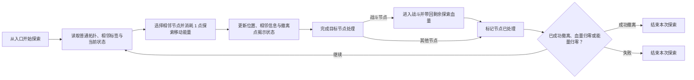
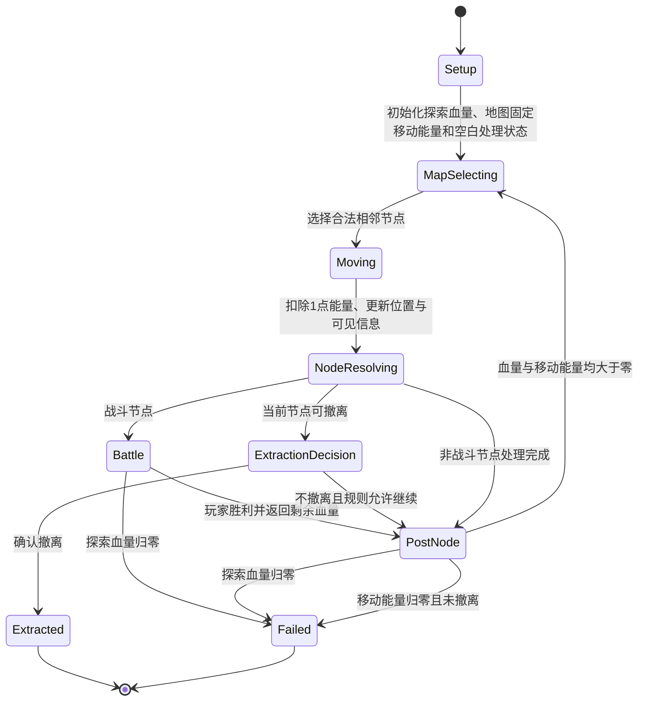

# 《共享地图—战斗—撤离闭环》GDD

## 0. 文档控制 `[必填]`

| 字段 | 内容 |
| --- | --- |
| 文档 ID | `GDD-WORLD-001` |
| 当前版本 | `0.1.0` |
| 文档成熟度 | `GDD-0` |
| 设计状态 | `Evaluation` |
| 负责人 | `系统设计 / 地图原型` |
| 评审人 | `用户 / 战斗设计 / QA（待指定）` |
| 创建日期 | `2026-08-22` |
| 最近更新 | `2026-08-22` |
| 目标里程碑 | `有限人工节点图灰盒：验证地图—战斗—撤离最小闭环` |
| 关联提案 | [整体系统优先](../idea-proposals/P-2026-07-01-overall-system-priority.md)、[早期共享地图提案](../idea-proposals/P-2026-05-13-unique-core-card-battle-map.md) |
| 关联正式素材 | 见 0.5 素材审查 |
| 待确认 inbox 候选 | 经营、资源经济及早期综合构思中的未拆分部分；见 0.5 |
| 关联评估 | [整体系统优先评估](../evaluations/E-2026-07-01-overall-system-priority.md)、[早期共享地图评估](../evaluations/E-2026-05-13-unique-core-card-battle-map.md) |
| 关联决策 | [决策记录](../decision-log.md) |
| 关联原型/测试 | [战斗系统 GDD-1](GDD-2026-08-21-card-battle-system.md)；地图灰盒尚未建立 |

### 0.1 本版目标

把已经通过资格闸门的地图素材组织成一份概念合同，明确玩家如何在有限节点图上读取信息、支付移动代价、处理节点、进入战斗并寻找撤离点。本文用于决定是否进入地图灰盒 GDD-1，不定义经营、经济、正式内容量或制作规格。

### 0.2 本版范围

**包含：**

- 一张有限、人工配置、至少包含一处分支的节点图。
- 一个开局隐藏、相邻时与连接边同时揭示的撤离点。
- 普通节点拓扑公开，相邻普通节点显示类型及低/中/高风险、收益标签。
- 相邻移动、探索移动能量、探索血量和当前探索内的节点处理状态。
- 资源、事件、战斗、入口/撤离四类节点的流程位置，不展开节点内容与收益。
- 战斗节点与 [战斗系统 GDD-1](GDD-2026-08-21-card-battle-system.md) 的最小接口。
- 成功撤离、探索血量归零和探索移动能量耗尽的闭环结束条件。

**明确不包含：**

- 经营系统、占领、开发、关卡发布、夺权和异步挑战。
- 撤离收益、失败损失、资源数量、资源储存、交易和完整经济。
- 治疗来源、回访额外效果和具体资源/事件节点处理逻辑。
- 具体初始探索移动能量、节点数量、连接密度、标签阈值和 UI 表现。
- 正式版程序生成算法；正式版先做有限程序生成、以后另做无尽模式的方向只作为未来范围记录。
- 联网、存档、断线恢复、正式音画和平台规格。

### 0.3 证据状态摘要

| 结论/模块 | 状态 | 依据或下一步 |
| --- | --- | --- |
| 有限人工节点图、至少一处分支、单撤离点 | `Hypothesis` | 用户已确认范围；需要地图灰盒验证路线选择 |
| 普通拓扑公开、相邻节点显示三档风险/收益 | `Hypothesis` | 正式素材已确认；需要验证标签是否真的改变路线 |
| 撤离点及连接开局隐藏、相邻时揭示 | `Hypothesis` | 正式素材已确认；需要验证神秘感与公平性 |
| 探索血量跨节点和战斗保留 | `Hypothesis` | 接口边界已确认；尚未完成地图—战斗串联测试 |
| 探索移动能量按图固定、每步消耗 1、探索中不补充 | `Hypothesis` | 重要规则已确认；具体初始点数待灰盒确定 |
| 节点处理完成后返回地图，已处理节点可返程且不重触发 | `Hypothesis` | 时序已确认；尚未验证可读性和节奏 |
| 撤离收益、失败损失、经营与完整经济 | `Unknown / Parked` | 保留在 inbox；基础闭环验证前不展开 |
| 正式版有限程序生成与后续无尽模式 | `Out of Scope` | 仅记录阶段方向；当前原型使用人工图 |

### 0.4 本次变更摘要

| 版本 | 日期 | 修改人 | 变更内容 | 原因/依据 | 影响范围 |
| --- | --- | --- | --- | --- | --- |
| 0.1.0 | 2026-08-22 | Codex | 首次建立共享地图—战斗—撤离 GDD-0 | 用户确认进入下一阶段；相关素材资格确认已完成 | 地图循环、战斗接口、结束条件与灰盒验证 |

### 0.5 素材审查 `[必填]`

**正式素材候选：**

| 素材 | 与本 GDD 的关系 | 建议章节 | 用户决定 | 处理说明 |
| --- | --- | --- | --- | --- |
| [共享地图探索循环](../idea-materials/M-2026-08-18-shared-map-exploration-loop.md) | 闭环主干 | 1、2、3 | `Include` | 纳入路线—节点—战斗—继续/撤离循环 |
| [有限人工节点图原型](../idea-materials/M-2026-08-21-finite-handcrafted-node-map-prototype.md) | 当前验证载体 | 0、2、9、16 | `Include` | 纳入人工、有限、分支与几何可达约束 |
| [单撤离点原型范围](../idea-materials/M-2026-08-21-single-extraction-prototype.md) | 当前出口范围 | 0、2、9、16 | `Include` | 原型只配置一个撤离点 |
| [仅在入口/撤离节点完成主动撤离](../idea-materials/M-2026-08-21-extraction-node-only.md) | 空间退出约束 | 1、2、4、5 | `Include` | 非撤离节点不能直接退出 |
| [普通节点拓扑公开与相邻信息显示](../idea-materials/M-2026-08-21-map-information-layer.md) | 地图信息层 | 1、2、4、9 | `Include` | 公开普通拓扑，局部显示节点信息 |
| [相邻节点三档风险与收益标签](../idea-materials/M-2026-08-21-adjacent-node-risk-reward-tiers.md) | 路线判断信号 | 1、2、4、9 | `Include` | 标签不等于具体结果或数值承诺 |
| [撤离点相邻揭示](../idea-materials/M-2026-08-21-adjacent-extraction-reveal.md) | 出口发现时机 | 1、2、4、5 | `Include` | 在下一次路线选择前揭示并永久标记 |
| [隐藏撤离点连接呈现](../idea-materials/M-2026-08-21-hidden-extraction-connection.md) | 出口连接可见性 | 2、4、5、9 | `Include` | 节点与关联边同时揭示 |
| [探索中跨节点保留血量](../idea-materials/M-2026-08-21-persistent-exploration-health.md) | 地图—战斗状态接口 | 1、2、4、5、8 | `Include` | 战斗读入并返回同一探索血量 |
| [节点结算完成后返回地图](../idea-materials/M-2026-08-21-node-resolution-return.md) | 节点与战斗时序 | 2、4、5 | `Include` | 处理中不能切换路线 |
| [探索内处理状态](../idea-materials/M-2026-08-21-processed-state-persistence.md) | 当前探索状态 | 2、4、5、9 | `Include` | 探索结束后清除 |
| [已处理节点返程](../idea-materials/M-2026-08-21-processed-node-backtracking.md) | 返程与移动代价 | 2、4、5、8、9 | `Include` | 可经过、不重触发、仍消耗 1 点能量 |
| [正式版分阶段地图模式](../idea-materials/M-2026-08-21-phased-generated-map-modes.md) | 未来范围与验证顺序 | 0、1、9、16 | `Include` | 只纳入范围边界，不纳入当前原型规则 |
| [攻防共享周期战斗能量](../idea-materials/M-2026-08-21-shared-cycle-combat-energy.md) | 与探索移动能量的边界 | 3、4、8 | `Include` | 仅作为战斗接口依赖，不复制战斗内部规格 |
| [核心卡身份与所有权](../idea-materials/M-2026-08-18-core-card-identity-and-ownership.md) | 玩家身份上游约束 | 0、3 | `Park` | 本 GDD 不处理持有、替换、交易或世界卡池 |

**未确认 inbox 候选：**

| 原始想法 | 相关性 | 缺失的资格字段 | 处理结果 |
| --- | --- | --- | --- |
| [早期综合构思](../idea-inbox/2026-05-13-unique-core-card-battle-map.md) | 包含地图、资源、交易与战斗的混合来源 | 占领/开发、经济、交易和动态平衡仍未拆分确认 | 只使用其已晋级子素材；其余内容 `Park` |
| [关卡经营玩法](../idea-inbox/2026-05-29-level-operation.md) | 可能成为后续外层系统 | 行为、发布、收益、夺权、所有权、依赖和验证均为 `Unknown` | `Park`；不进入正文 |
| [撤离点位置保持未知](../idea-inbox/2026-08-21-hidden-extraction-location.md) | 直接相关的原始表达 | 无；资格字段已完成 | 已晋级为“撤离点相邻揭示”并纳入 |
| [正式版地图方向](../idea-inbox/2026-08-21-formal-generated-or-endless-map.md) | 未来地图模式 | 无；资格字段已完成 | 已晋级为“正式版分阶段地图模式”；当前范围仅记录方向 |
| 其余地图拆分 inbox | 各正式素材的原始来源 | 无；均已完成资格确认 | 只通过对应正式素材引用，不把 inbox 直接写入正文 |

## 1. 产品与体验合同 `[必填]`

### 1.1 一句话概念

> 玩家携带当前核心卡与构筑进入一张有限节点图，反复读取普通拓扑与相邻风险/收益信息、支付探索移动能量并处理节点，为在探索血量和移动能量耗尽前找到并抵达隐藏撤离点而承担继续深入或返程的取舍；战斗损伤会持续改变后续路线。

### 1.2 目标玩家与情境

| 项目 | 内容 |
| --- | --- |
| 核心目标玩家 | `Hypothesis`：喜欢节点探索、风险收益权衡、可解释路线规划和卡牌战斗后果的玩家 |
| 次级玩家 | `Unknown`：偏轻量卡牌或探索玩家是否能接受持续血量与隐藏出口压力 |
| 单局/单次时长 | `Unknown`；不得由当前节点数估算反推正式时长 |
| 平台与输入 | `Unknown`；GDD-0 不绑定平台，灰盒可使用鼠标或命令输入 |
| 玩家已有知识 | 能理解节点连接、当前血量、剩余能量、低/中/高标签和撤离概念；战斗规则由战斗 GDD 教学 |
| 非目标玩家/体验 | 不优先服务完全开放世界自由移动、无代价试路、随时菜单撤离或纯经营优化体验 |

### 1.3 玩家体验承诺

玩家完成一次探索后，应能说明：“我知道自己为什么走这条路、哪场战斗迫使我改变计划、什么时候发现出口，以及为什么最后选择继续、返程或因判断失误而失败。”

### 1.4 设计支柱

| 设计支柱 | 玩家可观察表现 | 支持它的规则 | 反面信号 |
| --- | --- | --- | --- |
| 有依据的局部规划 | 玩家会同时引用拓扑、相邻标签和已知出口解释路线 | 普通拓扑公开；相邻普通节点显示类型与三档标签 | 玩家只随机点击，或只按固定节点类型行动 |
| 战斗改变地图判断 | 战后剩余血量会让玩家换路、避战或返程 | 探索血量传入战斗并带回，不因普通节点切换回满 | 战斗结束后路线选择完全不变 |
| 移动形成不可回收的承诺 | 玩家会计算剩余步数并为返程保留空间 | 每次相邻移动消耗 1 点探索移动能量，探索中不补充 | 能量不影响决策，或玩家无法理解为何耗尽 |
| 撤离是空间目标 | 玩家先寻找出口，揭示后围绕已知位置重新规划 | 单撤离点开局隐藏；相邻揭示；只能在可用入口/撤离节点主动结束 | 任意节点都能一键撤离，或出口只能靠盲踩 |
| 路线历史可读 | 玩家能识别已处理节点并将其用于返程 | 已处理状态本次探索内保留；返程不重触发原始处理 | 玩家反复误判节点会再次结算 |

### 1.5 反支柱

| 本游戏不追求什么 | 为什么 | 因此不采用什么方案 |
| --- | --- | --- |
| 无信息的纯盲探索 | 失败无法归因于玩家判断 | 不隐藏普通节点拓扑，不把类型与粗风险/收益全部隐藏 |
| 免费撤退与免费返程 | 会消除路线承诺和及时止损 | 不允许非撤离节点菜单撤离；已处理节点返程仍消耗能量 |
| 首个原型验证所有外围系统 | 会混淆地图闭环是否成立 | 不加入经营、完整经济、交易、占领和开发 |
| 用内容量掩盖路线问题 | 大量节点会增加成本但不保证选择成立 | 首先使用最小有限人工图和占位节点结果 |
| 基础闭环未成立就做无尽模式 | 无尽压力会改写当前撤离与返程逻辑 | 无尽前进只在有限基础模式验证后独立立项 |

### 1.6 核心假设

> 如果玩家能够依据公开普通拓扑、相邻节点标签、持续探索血量和有限探索移动能量反复调整路线，并在发现隐藏撤离点后重新比较继续与返程，那么地图选择、卡牌战斗和撤离可以形成一个可解释、值得重复验证的最小闭环。

- 状态：`Hypothesis`
- 当前依据：相关规则边界已经由用户逐项确认，并已形成合格 GDD 素材；地图灰盒尚未建立。
- 最大反证风险：隐藏撤离点与不可补充的固定移动能量组合后，成败主要取决于先碰到哪个分支，而不是可见信息和玩家判断。

### 1.7 下一验证问题 `[必填]`

- 当前最大风险：玩家在发现撤离点前无法估算真正的返程需求，固定移动能量可能把神秘感变成不可预判的失败。
- 下一步只验证什么问题：在一张有限人工分支图上，玩家能否用可见信息、探索血量和探索移动能量作出并解释路线变化，且把失败归因于自己的风险选择而非隐藏出口运气。
- 最小验证方式：制作一张单隐藏撤离点灰盒图；资源/事件使用占位结果，战斗可先使用固定结果或现有战斗规则；对同一地图测试少量不同初始能量配置，记录路线、出口发现时点、战后改路和失败归因。
- 成功信号：玩家能说明主要路线理由；在血量下降、能量减少或出口揭示后至少一次改变计划；成功与失败原因可被准确复述。
- 失败/停止信号：玩家主要随机试路；经常在没有可理解预警时因能量归零失败；出口揭示后已没有实际选择；增加节点只增加时长而不增加决策。

## 2. 核心循环与玩家旅程 `[必填]`

### 2.1 核心循环

一轮最小循环是“一次相邻移动 + 一次节点处理 + 一次继续/结束判断”。一次探索从入口初始化状态开始，以成功撤离或探索失败结束。

### 2.2 多时间尺度循环

| 时间尺度 | 起点 | 玩家动作 | 反馈/奖励 | 结束条件 | 再次进入动机 |
| --- | --- | --- | --- | --- | --- |
| 单步 | 地图选择状态 | 比较相邻节点并移动 | 能量扣减、位置与局部信息更新 | 进入目标节点 | 处理节点并获取新状态 |
| 单节点 | 到达节点 | 完成资源/事件占位处理或战斗 | 节点结果、血量变化、已处理标记 | 节点处理完成或探索失败 | 根据新状态选择下一步 |
| 单次探索 | 从入口初始化 | 寻找出口、处理节点、继续或返程 | 路线历史、发现反馈与结束结果 | 成功撤离或失败 | `Unknown`；收益与重开动机不在本版定义 |
| 长期 | `Out of Scope` | 经营、交易、成长等未定义 | `Unknown` | `Unknown` | 基础闭环验证后再讨论 |

### 2.3 关键决策点（GDD-0 摘要）

| 时点 | 玩家知道什么 | 核心选择 | 当前代价 | 结果如何改变下一步 |
| --- | --- | --- | --- | --- |
| 选择相邻节点前 | 普通拓扑、相邻类型与三档标签、当前血量与移动能量、已揭示出口 | 进入哪个相邻节点 | 固定消耗 1 点移动能量，并承诺完成节点处理 | 新信息、节点结果和剩余状态改变后续路线 |
| 战斗前 | 当前探索血量、战斗入口与对手/遭遇信息（具体范围 `Unknown`） | 进入并完成战斗 | 战斗可能消耗探索血量 | 剩余血量返回地图，可能迫使玩家返程 |
| 出口揭示后 | 撤离点节点和连接永久可见 | 立即前往撤离或继续探索 | 继续会消耗更多移动能量并承担节点风险 | 改变可用返程路线与失败风险 |
| 到达可用撤离节点 | 当前状态和撤离动作可用 | 确认撤离或在规则允许时继续 | 撤离结果的经济含义 `Unknown` | 确认后结束本次探索 |

### 2.4 成功、失败、撤离与退出

- 本次闭环成功：玩家抵达可用入口/撤离节点并确认主动撤离。当前原型配置一个开局隐藏的撤离点。
- 探索失败一：探索血量归零；若由战斗造成，则战斗失败后不返回可继续操作的地图状态。
- 探索失败二：一次移动使探索移动能量归零时，先完成目标节点处理；若目标为撤离点，允许完成撤离；否则处理完成后结束探索并按失败处理。
- 零能量边界：归零后不能继续移动，也不自动传送到入口或撤离点。
- 主动撤离空间限制：资源、事件、战斗及其他非撤离节点不能直接执行撤离。
- 失败后保留/失去什么：`Unknown / Parked`；不在本 GDD 中推定。
- 撤离后获得什么：`Unknown / Parked`；不在本 GDD 中推定。
- 中断、退出与恢复：`Unknown / Out of Scope`，由正式客户端与存档方案决定。

## 3. 规则总览 `[条件保留：用于固定 GDD-0 的系统边界]`

### 3.1 核心名词

| 术语 | 唯一定义 | 不等同于 |
| --- | --- | --- |
| 探索血量（暂定） | 同一次探索内跨节点保留，并作为玩家战斗初始血量传入/返回的当前血量 | 独立生存预算、世界资源 |
| 探索移动能量（暂定） | 当前探索中支付相邻移动的不可补充局内资源 | 战斗能量、探索血量、世界资源 |
| 战斗能量（暂定） | 单局战斗内部按攻防周期刷新的卡牌行动预算 | 探索移动能量、长期经济 |
| 已处理节点 | 当前探索内已经完成一次原始处理的普通节点 | 永久清空节点、跨探索进度 |
| 可用入口/撤离节点 | 当前规则允许玩家确认主动结束探索的空间节点 | 任意节点上的退出按钮 |
| 相邻揭示 | 玩家抵达撤离点相邻普通节点后，在下一步选点前显示撤离节点和连接 | 开局公开、踩中后才显示 |

### 3.2 全局规则与不变量

| ID | 不变量/全局规则 | 适用范围 | 破坏时的处理 |
| --- | --- | --- | --- |
| INV-W-001 | 玩家只能沿已知连接移动到相邻节点 | 地图移动 | 不提供非法目标 |
| INV-W-002 | 每次成功提交相邻移动固定消耗 1 点探索移动能量 | 当前探索 | 能量不足 1 点时不能提交移动 |
| INV-W-003 | 探索移动能量在一次探索中不由节点、事件或其他地图内容补充 | 当前原型 | 补充效果不得进入内容配置 |
| INV-W-004 | 进入节点后必须完成一次处理，处理前不能切换路线 | 节点流程 | 锁定地图选择状态 |
| INV-W-005 | 已处理普通节点可返程经过，不自动重触发原始处理 | 当前探索 | 只更新位置并支付移动能量 |
| INV-W-006 | 撤离点及其连接在相邻揭示前隐藏，揭示后本次探索内永久可见 | 地图信息 | 可见性状态必须随探索保存 |
| INV-W-007 | 战斗读入当前探索血量，并将胜利后的剩余血量返回地图 | 地图—战斗接口 | 接口失败时不得生成不一致的两份血量 |
| INV-W-008 | 探索血量归零，或移动能量归零且未成功撤离时，本次探索失败 | 结束条件 | 进入失败结束状态，不恢复地图选择 |

### 3.3 系统清单与依赖

| 系统 ID | 系统名称 | 玩家目的 | 上游输入 | 下游影响 | 当前状态 |
| --- | --- | --- | --- | --- | --- |
| SYS-W-001 | 地图移动与信息层 | 选择可解释的路线 | 人工节点图、当前位置、可见性 | 能量、节点进入、出口发现 | `Hypothesis` |
| SYS-W-002 | 节点处理与状态 | 承担当前路线结果 | 节点类型、处理状态 | 结果、已处理标记、下一选择 | `Hypothesis` |
| SYS-W-003 | 地图—战斗接口 | 让战斗后果持续影响探索 | 战斗节点、探索血量、当前构筑 | 剩余血量、胜负、节点完成 | `Hypothesis` |
| SYS-W-004 | 撤离与探索终局 | 将路线判断转化为成功或失败 | 位置、出口状态、血量、移动能量 | 探索结束 | `Hypothesis` |
| SYS-BATTLE-001 | 卡牌战斗 | 解决战斗节点冲突 | 战斗 GDD、当前探索血量 | 战斗胜负与剩余血量 | `External / GDD-1` |
| SYS-ECON-001 | 收益、损失与经营 | `Unknown` | `Unknown` | `Unknown` | `Parked` |

## 4. 概念级系统合同 `[条件保留：GDD-0 跨系统接口]`

| 系统 | 玩家输入与前置状态 | 核心规则 | 输出与反馈 | 未知项/边界 |
| --- | --- | --- | --- | --- |
| 地图移动与信息 | 地图选择状态；能量至少 1 点；选择已知连接上的相邻节点 | 原子扣除 1 点并更新位置；更新相邻普通节点信息；满足条件时揭示撤离节点和边 | 剩余能量、当前位置、相邻标签、出口揭示状态 | 具体 HUD、动画、初始点数不在 GDD-0 |
| 节点处理 | 已到达尚未处理的普通节点 | 锁定路线；完成一次资源/事件占位处理或战斗；完成后写入已处理状态 | 节点结果摘要、已处理标记、更新后的探索状态 | 资源/事件内容与收益为 `Unknown` |
| 已处理节点返程 | 目标节点在当前探索内已处理 | 仍支付 1 点移动能量；不重启原始处理 | 更新位置并保留已处理标记 | 回访额外效果不进入当前原型 |
| 地图—战斗接口 | 当前节点为战斗节点；玩家探索血量大于 0 | 将当前探索血量作为玩家战斗初始血量；战斗内部使用独立战斗能量；胜利后返回剩余血量 | 战斗结果、剩余探索血量、战斗节点完成状态 | 对手来源、匹配和战斗外奖励 `Unknown` |
| 撤离与终局 | 位于可用入口/撤离节点，或结束条件被触发 | 先处理目标节点/撤离机会，再按血量和能量判定是否可继续；确认撤离则成功结束 | 明确显示成功撤离或失败原因 | 起始入口是否同时启用撤离功能 `Unknown`；收益/损失 `Parked` |

### 4.1 资源边界

- 探索血量可以进入战斗并返回地图，但不转换为战斗能量或世界资源。
- 探索移动能量只支付地图相邻移动，不支付卡牌、节点结果或撤离收益。
- 战斗能量只在单局战斗内部刷新和消费，离开战斗后不保留到地图。
- 资源节点、事件结果、撤离收益和失败损失没有资格通过本 GDD 被推定为任何具体资源。

## 5. 状态机与事件时序 `[条件必填：存在节点、战斗与终局时序]`

### 5.1 状态机

### 5.2 事件时序

| 顺序 | 阶段/窗口 | 可执行主体 | 允许事件 | 结算后状态 |
| ---: | --- | --- | --- | --- |
| 1 | 探索初始化 | 系统 | 载入人工图固定初始移动能量、探索血量和空白已处理状态 | 地图选择 |
| 2 | 路线选择 | 玩家 | 查看公开普通拓扑、相邻标签和已知出口；选择一个合法相邻节点 | 移动提交 |
| 3 | 移动 | 系统 | 固定扣除 1 点探索移动能量并更新当前位置 | 已到达目标节点 |
| 4 | 信息更新 | 系统 | 更新相邻普通节点信息；若与撤离点相邻，同时揭示撤离点节点和连接并永久标记 | 节点处理 |
| 5 | 节点处理 | 玩家/系统 | 完成资源/事件占位处理；战斗节点切入完整战斗；撤离节点提供撤离机会 | 得到节点结果 |
| 6 | 战斗返回 | 战斗系统 | 返回胜负与剩余探索血量 | 胜利继续；血量归零失败 |
| 7 | 状态写入 | 系统 | 节点处理完成后写入当前探索的已处理状态 | 终局检查 |
| 8 | 终局检查 | 系统/玩家 | 先允许目标撤离点完成撤离；否则检查血量和移动能量 | 成功、失败或地图选择 |
| 9 | 继续探索 | 玩家 | 仅在血量和移动能量均大于零时再次选点 | 下一轮循环 |

### 5.3 关键边界

- 最后 1 点探索移动能量可以完成一次完整移动，不能在移动中途失败。
- 移动后能量归零不取消目标节点处理，也不回滚已经发生的战斗或节点结果。
- 目标为撤离点时，能量归零仍允许先完成撤离；若玩家未成功撤离，则节点处理后失败。
- 已处理节点返程不重触发原始处理，但仍经过移动、信息更新和终局检查。
- 撤离点揭示发生在玩家下一次路线选择之前；具体动画先后属于原型呈现细节。
- 若探索血量与移动能量在同一节点处理后均归零，探索失败；收益和失败损失仍为 `Unknown`。

## 8. 经济、资源与成长 `[条件保留：只定义已启用资源边界]`

| 资源/状态 | 来源 | 消耗或变化 | 跨局保留 | 主要决策 | 当前证据状态 |
| --- | --- | --- | --- | --- | --- |
| 探索血量 | 探索开始状态；具体初始/最大值沿用战斗配置但未在本 GDD 定值 | 战斗伤害与效果；普通节点间不自动回满 | 否；重开初始状态 `Unknown` | 是否继续承受战斗风险或返程 | `Hypothesis` |
| 探索移动能量 | 当前人工地图固定配置，同图同值 | 每次相邻移动固定消耗 1 点；探索中不补充 | 否 | 为探索与返程分配有限步数 | `Hypothesis` |
| 战斗能量 | 战斗 GDD 定义的己方回合刷新 | 卡牌与组合行动 | 否；不离开战斗 | 当前进攻与后续防御分配 | `External / Prototype Tested` |
| 节点结果/世界资源 | `Unknown` | `Unknown` | `Unknown` | 当前只用占位结果支撑路线测试 | `Unknown / Parked` |
| 撤离收益/失败损失 | `Unknown` | `Unknown` | `Unknown` | 不在当前闭环中比较经济价值 | `Unknown / Parked` |

## 9. 地图、关卡与遭遇 `[条件必填：存在空间探索]`

| 阶段/节点 | 玩家目标 | 进入条件 | 可见信息 | 关键选择 | 退出条件 |
| --- | --- | --- | --- | --- | --- |
| 入口 | 开始本次探索 | 初始化完成 | 普通节点拓扑、相邻普通节点标签、当前状态 | 选择首个相邻节点 | 提交合法移动 |
| 资源节点 | 获取占位节点结果 | 相邻且能量至少 1 点 | 类型与三档风险/收益；具体内容未知 | 是否承担该路线风险 | 占位处理完成 |
| 事件节点 | 接受一次事件处理 | 相邻且能量至少 1 点 | 类型与三档风险/收益；具体事件未知 | 是否进入该分支 | 占位处理完成 |
| 战斗节点 | 通过战斗解决当前遭遇 | 相邻且能量至少 1 点 | 类型与三档风险/收益；对手信息范围 `Unknown` | 是否以当前血量进入战斗 | 战斗结束；血量归零则探索失败 |
| 已处理普通节点 | 沿已知路径返程或换路 | 相邻且能量至少 1 点 | 拓扑、已处理标记 | 是否花费 1 点经过 | 更新位置，不重触发原始处理 |
| 撤离点 | 成功结束本次探索 | 开局隐藏；相邻揭示后可沿连接进入 | 揭示后节点与连接永久可见 | 确认撤离或在规则允许时继续 | 确认撤离 |

**地图编排约束：**

- 当前地图由设计者人工配置，节点和连接有限，至少包含一处可比较的分支。
- 当前原型只配置一个撤离点；普通节点拓扑开局公开，撤离点节点和关联边开局隐藏。
- 系统在几何上保证存活且可继续操作的节点状态存在通往入口或撤离点的相邻路径；当前能量是否足以完成该路径是待灰盒验证的设计变量，不被“几何可达”自动保证。
- 普通节点类型为资源、事件、战斗、入口/撤离；Boss 专属、玩家专属、占领和开发节点不进入当前原型。
- 已处理状态只在本次探索内保留；主动撤离或失败后清除。
- 正式版方向是先验证有限程序生成基础模式，再独立评估无尽前进；两者都不改变当前人工图原型范围。

## 16. 风险、未知项与决策 `[必填]`

### 16.1 风险清单

| 风险 | 类型 | 概率 | 影响 | 最早预警信号 | 缓解措施 | 回退方案 | 负责人 |
| --- | --- | --- | --- | --- | --- | --- | --- |
| 隐藏出口与固定移动能量组合成不可预判失败 | 玩法 | 高 | 高 | 玩家在发现出口前频繁归零，并把失败归因于运气 | 用最小图扫描初始能量和出口发现距离 | 保留神秘感但提前更多出口方向信息，另立素材复审 | 地图设计 |
| 三档标签不能支撑真实路线选择 | 信息/玩法 | 中 | 高 | 玩家忽略标签或认为标签等于确定结果 | 对比标签组合并记录路线理由 | 减少标签维度或调整信息时机 | 系统设计/研究 |
| 持续血量只造成滚雪球惩罚 | 玩法 | 中 | 高 | 受伤后只有必然失败，没有可理解的返程选择 | 比较战后回满与持续血量灰盒 | 暂时缩短连续战斗链；治疗另立素材 | 战斗/地图设计 |
| 资源和事件使用占位结果使继续探索缺少真实动机 | 研究 | 高 | 中 | 玩家只寻找出口，不关心非战斗节点 | 用不同强度的非经济占位反馈测试路线 | GDD-0 只验证信息与状态；经济动机留到独立素材 | 系统设计 |
| 战斗时长压过地图决策 | 节奏 | 中 | 中 | 大部分测试时间在战斗，玩家忘记进图理由 | 首轮可用固定战斗结果与完整战斗两组对照 | 先验证接口，再接入完整战斗 | 原型/研究 |

### 16.2 未知项

| 问题 | 影响的决定 | 当前状态 | 验证方式 | 负责人 | 最晚决策时点 |
| --- | --- | --- | --- | --- | --- |
| 当前人工地图的初始探索移动能量 | 路线可达、出口发现和返程压力 | `Unknown` | 同图同值扫描少量候选点数 | 地图原型 | 首轮灰盒冻结前 |
| 起始入口是否同时启用主动撤离 | 是否存在第二个可用出口及立即返程路线 | `Unknown` | 作为重要规则在 GDD-1 前单独确认 | 系统设计/用户 | 地图状态机实现前 |
| 战斗节点的对手来源与进入信息 | PvE/PvP职责、风险标签和战斗准备 | `Unknown` | 当前灰盒使用固定/占位对手；整体遭遇素材另行确认 | 系统设计 | 接入完整战斗前 |
| 资源与事件节点的最小处理结果 | 非战斗路线是否值得选择 | `Unknown` | 当前只用可区分占位结果，不推定正式资源 | 系统设计 | 地图 GDD-1 测试计划前 |
| 治疗或其他探索血量恢复来源 | 持续风险是否会滚雪球 | `Unknown` | 基础持续血量灰盒后另立素材复审 | 系统设计 | 连续战斗内容扩展前 |
| 撤离收益、失败损失、经营和完整经济 | 撤离价值、重开动机与长期循环 | `Unknown / Parked` | 保留在 inbox；基础地图闭环成立后恢复资格确认 | 经济/系统设计 | 后续经济 GDD 前 |
| 目标单次时长、平台、中断与恢复 | UI、存档和制作范围 | `Unknown / Out of Scope` | GDD-1/GDD-2 再定义 | 制作/技术 | 玩家客户端原型前 |

### 16.3 已采用边界的追溯

| 日期 | 边界 | 备选方向 | 当前理由 | 复审条件 |
| --- | --- | --- | --- | --- |
| 2026-08-21 | 首个原型使用有限人工节点图和单撤离点 | 立即程序生成、多个出口 | 隔离路线、血量、能量与出口发现变量 | 单图无法产生有效路线判断 |
| 2026-08-21 | 普通拓扑公开，撤离节点与边相邻揭示 | 全公开、全迷雾、踩中揭示 | 同时保留规划依据和寻找出口的神秘感 | 玩家仍把发现前阶段视为盲猜 |
| 2026-08-21 | 探索血量跨节点及战斗保留 | 战后回满、独立生存预算 | 让战斗结果直接改变地图判断 | 只产生不可恢复的滚雪球 |
| 2026-08-22 | 探索移动能量为同图固定值，每步 1 点且探索中不补充 | 路线公式、动态补充、不同节点不同费用 | 先建立可重复、可解释的移动代价 | 能量不产生选择或导致大量不可预警失败 |
| 2026-08-22 | 能量归零先完成目标节点处理/撤离，再判定失败 | 移动前失败、归零立刻中断、自动传送 | 保证最后 1 点代表一次完整移动 | 节点处理后失败造成强烈规则误解 |

## 17. 附录 `[可选]`

- 统一写作规范：[GDD 写作要求与模板](../templates/gdd-writing-requirements-and-template.md)
- 战斗内部规则：[战斗系统 GDD-1](GDD-2026-08-21-card-battle-system.md)
- 领域术语：[CONTEXT.md](../../CONTEXT.md)
- 当前研究问题：[current-questions.md](../../research/00-index-and-roadmap/current-questions.md)

## 18. 提交前自检 `[必填]`

- [x] 文档成熟度为 `GDD-0`，设计状态为 `Evaluation`，未伪装成 Accepted 核心设定。
- [x] 一句话概念包含玩家身份、核心动作、目标、取舍和差异点。
- [x] 设计支柱映射到具体规则，反支柱排除了当前不做的方向。
- [x] 核心循环写清进入、移动、节点处理、战斗、反馈、撤离与失败。
- [x] 探索血量、探索移动能量和战斗能量边界明确。
- [x] 节点处理、撤离揭示和能量归零时序没有依赖口头补充。
- [x] 最大核心假设有最小验证方式和成功/失败信号。
- [x] `Unknown` 与 `Out of Scope` 没有被 agent 自行补全。
- [x] 已检索正式素材库和 inbox，并记录 `Include / Park` 处理结果。
- [x] 正文引用的想法均可追溯到正式素材、已有 GDD 或 Accepted 核心方向。
- [x] 经营、撤离收益、失败损失和完整经济仍留在 inbox/未知项，没有进入正式规则。
- [x] 具体数值、UI、动画与低风险实现细节没有逐项扩写。
