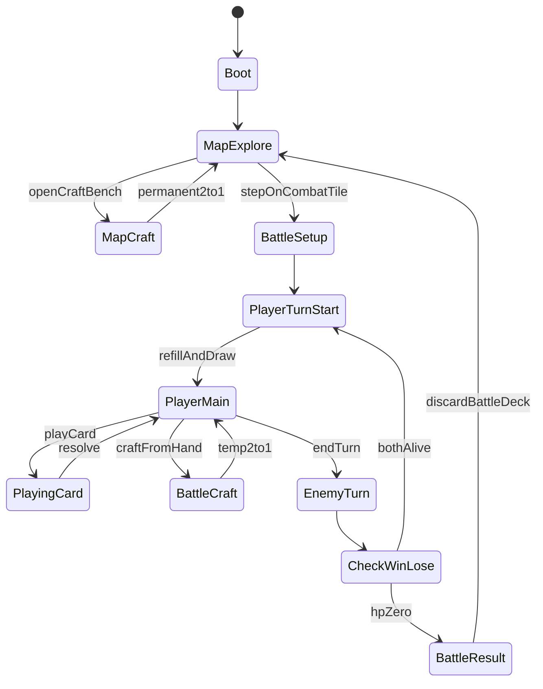

# 《Godot 灰盒客户端》代码设计 GDD

## 0. 文档控制 `[必填]`

| 字段 | 内容 |
| --- | --- |
| 文档 ID | `GDD-CLIENT-001` |
| 当前版本 | `0.1.0` |
| 文档成熟度 | `GDD-1` |
| 设计状态 | `Evaluation` |
| 负责人 | `客户端实现` |
| 创建日期 | `2026-08-24` |
| 最近更新 | `2026-08-24` |
| 目标里程碑 | `godot-demo 灰盒闭环可试玩并上传 GitHub` |
| 关联正式素材 | [M-2026-08-24-godot-greybox-client](../idea-materials/M-2026-08-24-godot-greybox-client.md) |
| 关联战斗规则 | [GDD-BATTLE-002](GDD-2026-08-22-glyph-synthesis-combat-system.md) |
| 实现路径 | 工作区并列工程 `godot-demo/`；GitHub：https://github.com/Winterwhite11/fantacy-breakdown-godot-demo （**不**写入本构思库代码树） |
| 关联决策 | [决策记录](../decision-log.md) |

### 0.1 本版目标

把已落地的 Godot 4 灰盒客户端写成可交接的**代码设计合同**：模块职责、状态机、数据契约、合成双轨、验收与使用说明索引。

### 0.2 本版范围

**包含：**

- 工程边界、场景流、Autoload、战斗状态机、牌堆规则、合成双轨、卡牌 JSON 契约。
- 与 GDD-BATTLE-002 的映射（已实现 / 延期）。
- 试玩操作与仓库使用说明的文档要求。

**不包含：**

- 写入 `core-concept.md`（需单独 Draft Change）。
- 多人、存档、美术定稿、完整 232 字词、本源字解释器。
- 将可执行工程并入 `dsaj4/game_design` 仓库（构思库保持 Markdown 工作流）。

### 0.3 证据状态

| 结论 | 状态 | 依据 |
| --- | --- | --- |
| 灰盒闭环可运行 | `Confirmed` | 本地 `godot-demo` 工程 |
| 抽牌非 STS 洗牌时点 | `Confirmed` | `PileController` |
| 合成双轨 | `Confirmed` | 地图永久 / 战斗瞬时 |
| 数值平衡 | `Hypothesis` | 首测灰盒数值 |
| 与共享 4 点能量完全兼容 | `Unknown` | 本版费用上限 3，待对齐 |

### 0.4 变更摘要

| 版本 | 日期 | 变更 |
| --- | ---: | --- |
| 0.1.0 | 2026-08-24 | 首版：按已实现 godot-demo 回写代码设计 GDD |

## 1. 产品与体验合同 `[必填]`

### 1.1 一句话概念

> 玩家在小网格地图上单格探索，遭遇后进入仿杀戮尖塔布局的字素卡牌战斗；可在地图永久炼字，或在战斗中用手牌做仅本局有效的瞬时合成。

### 1.2 设计支柱（客户端）

| 支柱 | 规则支撑 | 反面信号 |
| --- | --- | --- |
| 规则可见 | HUD 显示抽/弃/费/意图与合成预览 | 只能靠控制台理解 |
| 双轨可感 | 地图合成改全局牌库；战斗合成标〔局〕 | 两种合成结果混淆 |
| 可扩展 | JSON 卡表 + 状态机入口不绑死合成细节 | 每加一张卡改状态机 |

### 1.3 核心循环（客户端）

```text
启动 → 地图探索（单格移动）
  → [可选] 地图合成台永久 2→1
  → 踩战斗格 → 战斗（抽打弃 / 局内合成）
  → 胜：清格回地图 | 负：Game Over 重开
```

## 3. 规则总览（实现层）`[GDD-1]`

### 3.1 工程边界

| 项 | 规格 |
| --- | --- |
| 引擎 | Godot **4.x**，GDScript |
| 路径 | `Fantacy Breakdown/godot-demo/`（与 `game_design` 并列） |
| 主场景 | `res://scenes/main.tscn` → 重置后进地图 |
| 分辨率 | 1280×720，canvas stretch |

### 3.2 全局不变量（客户端）

| ID | 规则 |
| --- | --- |
| INV-C01 | 全局永久牌库只存在于 `GameState.run_deck_ids` |
| INV-C02 | 战斗牌堆是进战时的拷贝；局内合成**不得**写回 `run_deck_ids` |
| INV-C03 | `PileController.draw()` 禁止自动洗弃牌堆 |
| INV-C04 | 仅 `ensure_draw_pile_for_turn()` 可在回合开始把弃牌堆洗入抽牌堆 |
| INV-C05 | 地图合成：材料索引从 `run_deck_ids` 删除，结果 id append（永久 2→1） |
| INV-C06 | 战斗合成：仅手牌两张；结果 `is_battle_temp=true`；战后牌堆丢弃即失效 |

### 3.3 场景与 Autoload

```text
Autoload 顺序：
  CardLibrary  → 加载 data/cards.json
  GameState    → HP、格子、run_deck_ids、进战/结算
  SceneRouter  → change_scene_to_file

场景：
  main.tscn    → reset_run → map
  map_scene    → 移动 / 永久合成 / 遭遇
  battle_scene → BattleController + Battle HUD
```



## 4. 系统规格 `[GDD-1]`

### 4.1 SYS-C01：地图探索

| 项目 | 规格 |
| --- | --- |
| 输入 | WASD / 方向键，每次一格 |
| 网格 | 7×5；墙 / 地板 / 起点 / 战斗格 |
| 遭遇 | 踩未清除战斗格 → `GameState.start_battle` |
| 胜利 | 战斗格记入 `cleared_combat_cells` |
| 失败 | `game_over`，可重开 |

### 4.2 SYS-C02：战斗状态机

实现：`scripts/battle/battle_controller.gd`

| 状态 | 行为 |
| --- | --- |
| SETUP | 用 `build_battle_deck()` 洗入抽牌堆 |
| PLAYER_TURN_START | 清甲、毒跳、回满费、`ensure_draw_pile_for_turn`、抽 5 |
| PLAYER_MAIN | 打出 / 局内合成 / 结束回合 |
| PLAYING_CARD | 扣费、结算、卡进弃牌堆 |
| ENEMY_TURN | 简单 AI 攻防轮换 |
| RESULT | 展示胜负；返回地图时丢弃本局牌堆 |

默认：玩家 30 HP（继承探索血量）、能量 3、敌 40 HP、每回合抽 5。

### 4.3 SYS-C03：牌堆（非 STS 洗牌）

实现：`scripts/battle/pile_controller.gd`

1. 打出/弃置 → 弃牌堆  
2. 抽牌堆空时 **不** 即时洗回  
3. 下回合开始前若不足以抽满，才洗弃牌堆入抽牌堆再抽  

### 4.4 SYS-C04：合成双轨

实现：`synthesis_service.gd` + `GameState.craft_permanent_at_indices` + `BattleController.confirm_battle_craft`

| 模式 | 入口 | 材料 | 结果寿命 |
| --- | --- | --- | --- |
| `MAP_PERMANENT` | 地图「合成台（永久）」 | 全局牌库两张 | 永久写入 `run_deck_ids` |
| `BATTLE_TEMP` | 战斗「合成台」 | 当前手牌两张 | `is_battle_temp`；战后失效 |

配方查找：材料 id 排序后匹配 `cards.json` → `recipes`（仅 2 料）。

### 4.5 SYS-C05：战斗 HUD 分区

| 区域 | 用途 |
| --- | --- |
| 左下 | 抽牌堆张数 |
| 右下 | 弃牌堆张数 |
| 底中 | 手牌 |
| 底右 | 费用、结束回合、合成台 |
| 右侧 | 道具区占位（禁用） |
| 上方 | 敌 HP / 意图 |
| 左侧 | 战斗日志 |

### 4.6 SYS-C06：卡牌数据契约

文件：`godot-demo/data/cards.json`

**卡字段：** `id`, `display`, `cost`, `effect_type`, `amount`, `tags`  
**效果类型（已实现）：** `damage` | `block` | `poison` | `acid` | `energy` | `energy_next`  
**配方字段：** `id`, `result`, `materials`（长度 2）

首测配方：蒸汽、酸、水刃、土墙、高压蒸汽（蒸汽+压缩）。

## 6. 与 GDD-BATTLE-002 映射

| GDD-002 项 | 客户端状态 |
| --- | --- |
| 基础字打出 | 已实现 |
| 字词打出 | 首测子集已实现 |
| 手牌合成 | 战斗局内已实现 |
| 地图/局外永久合成 | 已实现（灰盒） |
| 本源字解释器 | `Out of Scope` 本版 |
| 铭文耐性上限校验 | `Hypothesis` 未强制 |
| 共享 4 点能量 | `Unknown`（本版 3 费） |
| 处理协同 201–208 | `Out of Scope` 本版 |

## 14. 原型与验收 `[GDD-1]`

| 验收项 | 标准 |
| --- | --- |
| 启动 | Godot 4 打开工程 F5 进地图 |
| 移动 | 单格移动，墙不可入 |
| 进战 | 红格进入战斗页，可见抽/弃/手/费/道具占位 |
| 抽牌规则 | 抽尽当回合不补；下回合才可能洗回 |
| 地图合成 | 2 张从全局消失，1 张出现且下次进战仍在 |
| 战斗合成 | 仅手牌；〔局〕标记；返回地图后全局牌库无该字词（除非曾地图合成） |
| 文档 | README + docs 含安装、操作、架构、配方 |

## 16. 未决问题

- 战斗费用是否对齐 GDD 共享 4 点？负责人：战斗设计；决策时点：下一里程碑。  
- 3 料一次合成 UI 是否需要？当前用两步（蒸汽+压缩）。  
- `godot-demo` GitHub 仓库与 `game_design` 的正式链接方式（本 GDD 用路径引用）。

## 17. 素材审查

| 素材 | 决定 |
| --- | --- |
| M-2026-08-24-godot-greybox-client | `Include` |
| M-2026-08-22-glyph-synthesis-combat | `Include`（规则来源） |
| GDD-BATTLE-001 | `Park`（实现线） |

## 18. 使用说明索引

完整玩家/开发者说明写在实现仓库（避免构思库与可执行工程脱节）：

- GitHub：https://github.com/Winterwhite11/fantacy-breakdown-godot-demo
- `godot-demo/README.md` — 快速开始  
- `godot-demo/docs/USAGE.md` — 详细操作与验收  
- `godot-demo/docs/ARCHITECTURE.md` — 模块与数据流  

上传 GitHub 后，在 PR / Release 说明中粘贴上述路径与试玩步骤。
