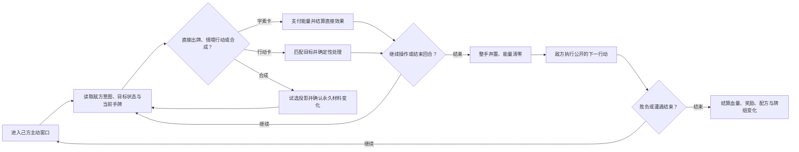
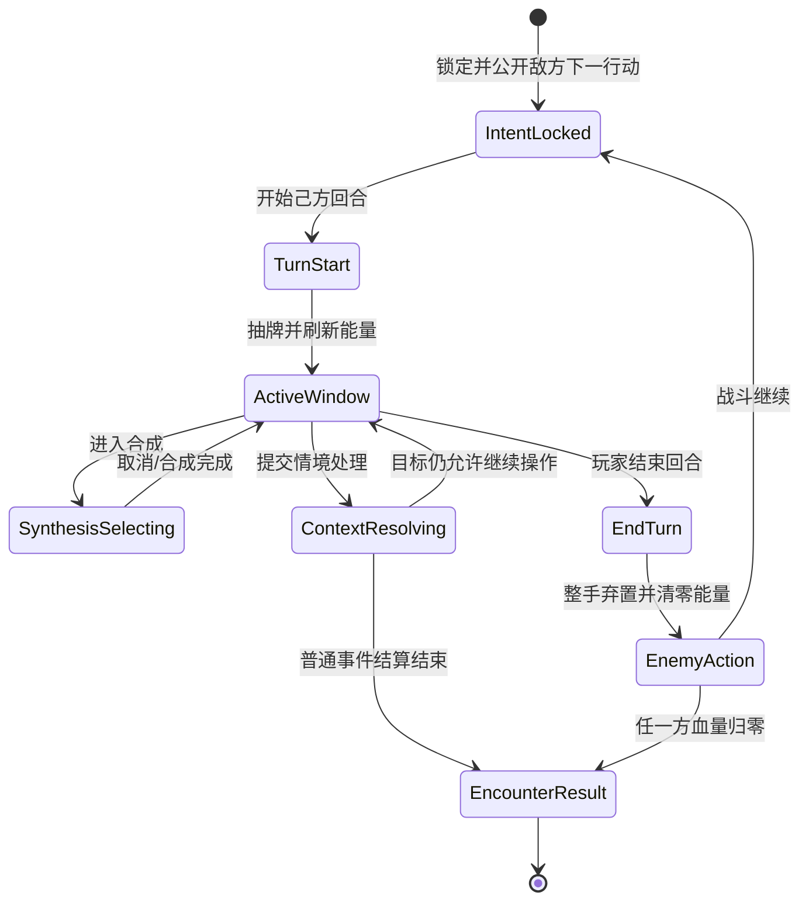
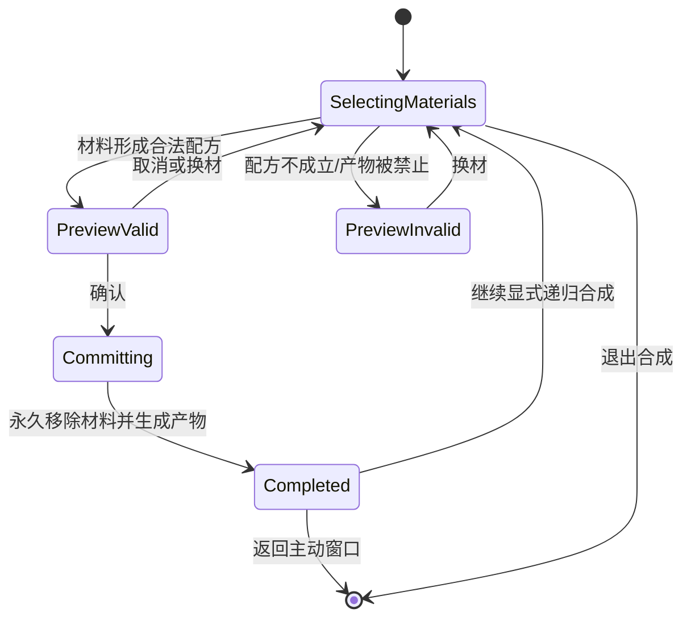

# 《战斗系统 003：字素卡、行动卡与统一情境战斗》GDD

## 0. 文档控制 `[必填]`

| 字段 | 内容 |
| --- | --- |
| 文档 ID | `GDD-BATTLE-003` |
| 当前版本 | `0.1.0` |
| 文档成熟度 | `GDD-1` |
| 设计状态 | `Evaluation` |
| 负责人 | `战斗设计` |
| 评审人 | `系统设计 / 原型测试` |
| 创建日期 | `2026-08-29` |
| 最近更新 | `2026-08-29` |
| 目标里程碑 | `统一情境战斗最小可验证原型` |
| 关联提案 | [战斗系统 003 提案](../idea-proposals/P-2026-08-25-battle-system-003-unified-glyph-action-events.md) |
| 关联正式素材 | [战斗系统 003 素材](../idea-materials/M-2026-08-25-battle-system-003-card-taxonomy-and-unified-event-combat.md)、[字素合成素材](../idea-materials/M-2026-08-22-glyph-synthesis-combat.md)、[核心卡身份素材](../idea-materials/M-2026-08-18-core-card-identity-and-ownership.md)、[探索血量素材](../idea-materials/M-2026-08-21-persistent-exploration-health.md) |
| 待确认 inbox 候选 | [早期字素扩展稿](../idea-inbox/2026-08-14-glyph-craft-combat-expansion.md)（不进入正文） |
| 关联评估 | [战斗系统 003 完成评估](../evaluations/E-2026-08-25-battle-system-003-unified-glyph-action-events.md) |
| 前置 GDD | [GDD-BATTLE-002：字素合成战斗系统](GDD-2026-08-22-glyph-synthesis-combat-system.md) |
| 关联决策 | [决策记录](../decision-log.md) |
| 关联原型/测试 | `无；本 GDD 定义首轮验证计划` |
| 关联开发进度 | [代码开发进度索引](../../docs/code-development-index.md)（当前无 `GDD-BATTLE-003` 对应条目） |

> 本文档中的 `Confirmed` 表示规则已经过用户决策确认，不表示可玩性、平衡性或制作可行性已经通过真人原型验证。本文档尚未进入 `Draft Change` 或 `Accepted`，不得据此直接覆盖 `core-concept.md`。

### 0.1 本版目标

把战斗系统 003 的 Proposal Evaluation 转化为可搭建最小原型、可执行规则验收和体验测试的 GDD-1。阅读者应能在不依赖对话记录的情况下回答：玩家看见什么、何时能操作、两类卡如何使用、合成如何改变当前场面和永久牌组、事件如何结算、核心卡如何改变配方，以及哪些问题仍需原型决定。

### 0.2 本版范围

**包含：**

- 固定 AI/PvE 的完整回合制战斗，以及血量归零的基础胜负条件。
- 字素卡、行动卡、统一手牌、共享能量和回合末整手弃置。
- 战斗、普通事件、环境对象和特殊状态敌人的统一卡牌输入语言。
- 己方主动窗口内的直接出牌、情境行动、合成、主动护盾、治疗和控制。
- 永久合成、递归资格、合成投影、逐条配方记录、分解事件和基础字素补充。
- 核心卡作为牌组外独有合成表，以及一般配方与特有配方的知识归属。
- 敌方下一行动意图、默认确定性情境结算、信息反馈与原型验收。

**明确不包含：**

- PvP、实时对抗、对手回合防御/响应卡、防御准备区和反应式合成。
- 最终能量、手牌、血量、同名卡上限、卡牌效果和敌人数值。
- 完整事件库、完整敌人库、完整配方树、核心卡批量生产规格和最终内容量。
- 核心卡交易前的信息披露、交易估值、交易算法及其他经济规则。
- 地图生成、撤离、经营、占领、开发和探索失败收益结算。
- 引擎、模块、类、函数、脚本、API、数据格式、构建、Bug 和代码完成度。
- 对 `core-concept.md` 的正式修改；若原型后决定采纳，另走 Draft Change。

### 0.3 证据状态摘要

| 结论/模块 | 状态 | 依据或下一步 |
| --- | --- | --- |
| 字素卡/行动卡分类与成本边界 | `Confirmed` | 评估 Q14—Q20 |
| 合成是无能量、无行动机会成本的永久动作 | `Confirmed` | 评估 Q4—Q7、Q18—Q19 |
| 事件、战斗和环境共享卡牌输入语言 | `Confirmed` | 评估 Q1—Q13、Q33、Q52 |
| 核心卡是牌组外独有合成表 | `Confirmed` | 评估 Q39—Q49；交易前披露除外 |
| 主动防御与敌方下一行动意图 | `Confirmed` | 评估 Q25—Q28、Q37—Q38、Q51 |
| 系统能否产生“观察—合成—解决”的目标体验 | `Hypothesis` | 需统一页面最小原型和真人测试 |
| 无成本合成投影是否导致穷举停顿 | `Hypothesis` | 记录投影次数、决策时间和取消率 |
| 永久字素消耗是否导致过度保守或牌组枯竭 | `Hypothesis` | 追踪合成率、补充路径使用和软锁 |
| 每回合能量、抽牌数、同名卡上限 | `Unknown` | 首测使用临时基准并做相邻参数对照 |
| 延迟洗牌是否改善可预判性 | `Hypothesis` | 从 GDD-BATTLE-002 继承为待测假设 |
| 完整未来敌方行动序列 | `Out of Scope` | 当前只公开下一行动 |
| 核心卡交易前配方披露 | `Out of Scope` | 评估 Q50 已 Parked |

### 0.4 本次变更摘要

| 版本 | 日期 | 修改人 | 变更内容 | 原因/依据 | 影响范围 |
| --- | --- | --- | --- | --- | --- |
| 0.1.0 | 2026-08-29 | 战斗设计 / agent | 建立 GDD-BATTLE-003 GDD-1 | 战斗系统 003 评估完成并推荐推进 | 战斗、事件、环境、合成、永久牌组、核心卡 |

### 0.5 素材审查 `[必填]`

**正式素材候选：**

| 素材 | 与本 GDD 的关系 | 建议章节 | 用户决定 | 处理说明 |
| --- | --- | --- | --- | --- |
| [战斗系统 003](../idea-materials/M-2026-08-25-battle-system-003-card-taxonomy-and-unified-event-combat.md) | 本 GDD 的直接机制来源 | 全文 | `Include` | 经完成评估后的规则取代素材中的旧 Unknown |
| [字素合成战斗](../idea-materials/M-2026-08-22-glyph-synthesis-combat.md) | 提供字素、配方和字词内容语义 | 3、7、14 | `Include` | 只继承语义和内容候选；双轨合成、耐性、旧费用和临时产物不自动继承 |
| [唯一核心卡身份](../idea-materials/M-2026-08-18-core-card-identity-and-ownership.md) | 提供一人一张和牌组外身份边界 | 3、7 | `Include` | 本 GDD 只使用战斗中的单一身份位和独有合成表；交易细节不展开 |
| [探索中跨节点保留血量](../idea-materials/M-2026-08-21-persistent-exploration-health.md) | 约束治疗后血量和战斗返回接口 | 2、4、8 | `Include` | 只作为跨系统边界，地图和失败结算不在本 GDD |
| [攻防共享周期战斗能量](../idea-materials/M-2026-08-21-shared-cycle-combat-energy.md) | 旧能量与响应模型 | 3、4 | `Omit` | 跨对手回合保留能量、防御响应位和准备区已被评估 Q26—Q28 取代 |
| [成语组合核心卡](../idea-materials/M-2026-08-21-idiom-combo-core-cards.md) | GDD-BATTLE-001 历史战斗模型 | 无 | `Omit` | 成语字段、单行动位和防御响应属于归档方案 |

**未确认 inbox 候选：**

| 原始想法 | 相关性 | 缺失的资格字段 | 处理结果 |
| --- | --- | --- | --- |
| [早期字素组合扩展稿](../idea-inbox/2026-08-14-glyph-craft-combat-expansion.md) | 含大量字素、配方、耐性和费用草案 | 未按 003 的永久合成、行动卡分类、能量和核心卡语法复审；多项规则与本评估冲突 | `不采用`；内容候选需逐项晋级后才能进入 GDD |
| [唯一核心卡与共享地图原始想法](../idea-inbox/2026-05-13-unique-core-card-battle-map.md) | 含核心卡身份和旧战斗规则 | 原文件仍混有可复数持有、响应防御等历史内容 | `不直接采用`；只使用已晋级的核心卡身份素材 |
| [战斗系统 003 原始想法](../idea-inbox/2026-08-25-battle-system-003-card-taxonomy-and-unified-event-combat.md) | 直接来源 | 已完成资格确认 | `已晋级`；正文只引用对应正式素材 |

## 1. 产品与体验合同 `[必填]`

### 1.1 一句话概念

> 玩家以唯一核心卡为合成身份，在 AI/PvE 战斗、事件和环境中读取目标状态与敌方下一行动，反复打出字素卡和行动卡、试选并永久合成新卡，为解决当前处境承担能量、手牌和长期材料取舍，并获得“用同一套卡牌语言创造解法”的掌控感。

### 1.2 目标玩家与情境

| 项目 | 内容 |
| --- | --- |
| 核心目标玩家 | `Hypothesis`：喜欢卡组构筑、确定性规划、组合发现和系统互动，愿意为长期牌组变化承担不可逆选择的玩家 |
| 次级玩家 | `Hypothesis`：喜欢探索事件和环境解题，但不希望每类事件学习独立菜单的玩家 |
| 单局/单次时长 | `Unknown`：首轮先测单场遭遇，不在本版承诺完整 Run 时长 |
| 平台与输入 | `Unknown`：不影响当前规则合同；进入制作交接前确认 |
| 玩家已有知识 | 理解抽牌、弃牌、能量、血量；不默认理解永久合成、行动卡情境价值和核心卡特有配方 |
| 非目标玩家/体验 | 不优先服务纯随机事件、即时反应防御、零长期代价的无限试错和只追求固定最优卡序的体验 |

### 1.3 玩家体验承诺

一轮有效体验后，玩家应能说出：“我先看懂敌人或环境在要求什么，再决定直接花能量、用动作处理，还是牺牲长期材料合成新解法；我的核心卡让我能走出别人没有的合成路线。”

### 1.4 设计支柱

| 设计支柱 | 玩家可观察表现 | 支持它的规则 | 反面信号 |
| --- | --- | --- | --- |
| 同一套卡牌语言 | 玩家在战斗、事件和环境中都从当前手牌选择卡牌，而不是寻找额外选项菜单 | 统一页面、统一牌组、相关性门槛、确定性结算 | 玩家问“事件选项在哪里”，或把事件当作另一套系统 |
| 永久创造与承诺 | 玩家在当前解法和长期牌组形状之间比较，能解释材料永久消耗 | 合成无行动/能量成本，但永久移除字素并永久加入产物 | 合成成为无脑升级，或玩家因恐惧完全不合成 |
| 可读的主动规划 | 玩家根据下一敌方意图、收益层级和完整投影提前防御或改变路线 | 下一行动公开、分层提示、投影卡面同等信息 | 玩家主要靠猜，或始终选择最亮卡而不考虑代价 |
| 核心卡定义路线 | 玩家能指出自己的核心卡开放了哪条专属配方或递归路线 | 牌组外独有合成表、共享基础语法、特有材料提示 | 核心卡只是数值皮肤，或换卡后必须重学全部基础语义 |

### 1.5 反支柱

| 本游戏不追求什么 | 为什么 | 因此不采用什么方案 |
| --- | --- | --- |
| 独立事件选项菜单 | 会割裂战斗与探索的输入语言 | 事件必须通过当前手牌和合成解决 |
| 默认概率式情境结果 | 会让收益提示无法支持学习和复盘 | 相同卡牌、目标和状态默认得到固定结果 |
| 免费动作对应无限收益 | 会使行动卡压倒资源与合成 | 目标需相关且有限，处理后改变状态或结束 |
| 对手行动发生时临时完美防御 | 会恢复响应位和准备区的旧模型 | 防御在己方主动窗口完成，并公开下一敌方意图 |
| 完全任意的核心卡规则 | 会破坏知识迁移和内容可控性 | 特有合成表必须建立在共享语法上 |

### 1.6 核心假设

> 如果玩家反复读取目标与敌方意图，在直接打出、情境行动和永久合成之间选择，并持续获得确定、可解释的状态与牌组反馈，那么“同一套卡牌语言解决战斗与探索问题”的体验可能成立。

- 状态：`Hypothesis`
- 当前依据：规则经过 52 项 Proposal Evaluation 决策闭合，但尚无战斗系统 003 真人原型证据。
- 最大反证风险：玩家把无成本投影当作必须穷举的搜索流程，或因永久材料消耗而拒绝合成，最终只按提示强度机械出牌。

### 1.7 下一验证问题 `[必填]`

- 当前最大风险：无成本投影、统一页面信息和永久消耗组合后，可能造成穷举停顿而不是创造性解题。
- 下一步只验证什么问题：玩家能否在有限时间内理解情境、主动选择合成或直接处理，并解释这次选择的当前收益与长期代价。
- 最小验证方式：使用 3 张行动卡、5 张基础字素、少量一般/特有配方、1 名敌人、2 个事件和 3 个环境对象完成纸面或低保真可玩测试。
- 成功信号：多数玩家无需额外事件菜单即可完成流程；主动合成且能解释永久消耗；不会在每次决策前穷举全部组合。
- 失败/停止信号：多数玩家把行动卡当废牌、逐一试完所有投影、无法理解材料永久移除，或在统一页面中找不到当前目标和下一行动信息。

## 2. 核心循环与玩家旅程 `[必填]`

### 2.1 核心循环

一轮核心决策以一个己方主动窗口为单位；永久合成可在窗口中循环多次，但每次真实提交都会改变长期牌组。普通事件使用同一选择语言，但在一次有效提交后立即结算结束。

### 2.2 多时间尺度循环

| 时间尺度 | 起点 | 玩家动作 | 反馈/奖励 | 结束条件 | 再次进入动机 |
| --- | --- | --- | --- | --- | --- |
| 瞬时/单次判断 | 聚焦目标或材料 | 选择卡牌、查看投影、确认或取消 | 适配层级、完整产物、材料消耗、状态变化 | 一次卡牌或合成结算 | 新手牌/新目标状态产生下一选择 |
| 己方回合 | 公开敌方下一行动、抽牌与能量刷新 | 连续打字素卡、复用行动卡、合成、主动防御 | 伤害、护盾、治疗、控制、牌组变化 | 玩家结束主动窗口 | 应对敌方行动并准备下一手牌 |
| 遭遇 | 进入 AI 战斗或情境对象 | 解决敌人、事件或有限环境对象 | 血量变化、奖励字素、配方记录 | 血量归零、事件一次结算或对象耗尽 | 把新卡和知识带入后续情境 |
| 一次探索 | 带着探索血量进入多个节点 | 选择遭遇并承受持续血量与牌组变化 | 永久牌组和配方知识累积 | 探索结束条件由地图 GDD 定义 | 验证构筑路线和核心卡身份 |
| 长期 | 持有唯一核心卡 | 发现一般配方和核心卡特有配方 | 玩家知识、核心卡资产状态、构筑差异 | `Out of Scope` | 探索其他核心卡与组合路线 |

### 2.3 玩家旅程 `[必填：GDD-1]`

| 阶段 | 玩家目标 | 可见信息 | 可选动作 | 关键决策/代价 | 系统反馈 | 失败与恢复 |
| --- | --- | --- | --- | --- | --- | --- |
| 回合开始 | 理解当前威胁和资源 | 下一敌方意图、血量、护盾、抽到的手牌、能量 | 聚焦目标/核心卡/手牌 | 先处理威胁还是先寻找合成路线 | 意图、可用卡和特有材料提示 | 无；信息必须在输入前稳定 |
| 主动规划 | 比较直接收益、情境收益和永久合成 | 卡面费用、目标状态、适配层级、当前可见材料 | 打字素、打行动、试选合成 | 能量、当前手牌与永久材料取舍 | 费用变化、目标反馈、投影 | 非法动作在提交前阻断 |
| 合成提交 | 创造当前和长期新解法 | 完整产物卡面、永久消耗、上限状态 | 确认、取消或换材料 | 不可逆永久材料消耗 | 产物入手、牌组变化、配方记录 | 分解事件可逐层回退；普通取消仅限提交前 |
| 回合结束 | 承担主动规划结果 | 当前血量、护盾、敌方意图 | 结束回合 | 放弃剩余能量和整手牌 | 手牌弃置、能量清零 | 无临时防御响应 |
| 敌方行动 | 观察已公开行动的兑现或变化 | 最新意图与状态 | 无普通主动输入 | 前一回合护盾/控制是否足够 | 伤害、状态和意图兑现 | 血量归零失败；下一回合重新规划 |
| 情境结算 | 用一张相关卡解决事件/对象 | 可提交卡牌和高额/一般/保底提示 | 提交一次有效处理；提交前可合成 | 消耗字素换稳定收益，或用行动卡争取高价值 | 确定结果、对象状态变化、奖励永久加入 | 普通事件提交后不可撤回；补充路径防止字素软锁 |

### 2.4 胜利、失败、撤退与退出

- 胜利条件：`Confirmed`，固定 AI/PvE 战斗中使敌方血量值归零。
- 失败条件：`Confirmed`，玩家血量值归零；探索中沿用探索血量时会结束本次探索，具体失败收益由外部 GDD 定义。
- 普通事件结束：一次有效处理动作结算后立即结束；特殊多阶段事件必须显式声明。
- 环境对象结束：每个对象一次成功处理后进入耗尽/已处理状态；同场景其他对象可继续处理。
- 主动撤退/提前结算条件：`Out of Scope`，由地图与撤离 GDD 定义。
- 中断与恢复规则：`Unknown`，不影响首轮纸面规则；制作交接前必须决定不可逆合成提交后的恢复边界。
- 失败后保留/失去什么：`Out of Scope`；本文只保证已完成合成和配方记录属于永久变化，是否因探索失败回滚需外层规则确认。
- 玩家如何理解结果：战斗明确显示血量归零；事件显示本次卡牌、确定结果与目标终态；环境对象显示耗尽状态。

## 3. 规则总览 `[必填：GDD-1]`

### 3.1 核心名词

| 术语 | 唯一定义 | 不等同于 | 首次教学位置 |
| --- | --- | --- | --- |
| 核心卡/本源字 | 牌组外、不可消耗的单一身份位，以独有合成表改变玩家可走的合成路线 | 第三类手牌、可消耗材料 | 首次展示核心卡材料提示时 |
| 字素卡 | 有直接收益、打出需支付能量、可作为永久合成材料的牌组卡 | 只存在一次的消耗品 | 第一次抽牌 |
| 行动卡 | 代表个人动作、无脱离目标的直接收益、同回合可复用的牌组卡 | 固定动作菜单、免费万能收益 | 第一个可处理目标 |
| 己方主动窗口 | 玩家可出牌、使用行动卡、合成和主动防御的本回合操作阶段 | 对手回合响应窗口 | 第一回合 |
| 战斗能量 | 己方主动窗口支付字素卡费用的共享预算 | 合成材料、世界资源 | 第一张有费用卡 |
| 合成投影 | 选中材料后出现、可取消且不产生持久变化的产物预览 | 已发现配方记录 | 第一次进入合成 |
| 已发现配方记录 | 真实完成一条配方后永久保存的材料—产物关系 | 看过但未提交的投影 | 第一次成功合成后 |
| 确定性情境结算 | 相同卡牌、目标和当前状态产生固定结果的默认规则 | 隐藏成功率 | 第一个普通事件 |
| 敌方下一行动意图 | 玩家回合前锁定并公开的下一次敌方动作信息 | 完整未来行动序列 | 第一场战斗开始 |
| 分解事件 | 消耗一张合成卡并完整返还其直接配方材料的特殊一次性事件 | 随时撤销按钮 | 首次遇到分解事件 |

### 3.2 全局规则与不变量

| ID | 不变量/全局规则 | 适用范围 | 破坏时的处理 |
| --- | --- | --- | --- |
| INV-001 | 每名玩家当前恰好有一张牌组外核心卡；核心卡不进入手牌、不被消耗 | 全局/战斗 | 阻止开始并提示身份状态异常 |
| INV-002 | 普通牌组卡只分为字素卡与行动卡；合成产物默认是字素卡 | 牌组/奖励/合成 | 未显式声明的行动卡产物按非法配方处理 |
| INV-003 | 行动卡必须匹配明确目标状态或情境，不能对普通无状态目标产生收益 | 战斗/事件/环境 | 提交前禁用且不消耗机会 |
| INV-004 | 字素卡单独打出进入弃牌循环；只有作为合成材料时永久移除 | 所有情境 | 结算路径必须二选一，不得双重移除 |
| INV-005 | 行动卡打出后留在当前手牌，同回合可复用，回合末随整手弃置 | 己方主动窗口 | 已离开手牌的行动卡不能被重复调用 |
| INV-006 | 合成只在己方主动窗口或明确的事件主动窗口发起，不占行动机会、不支付能量 | 战斗/事件/环境 | 对手回合普通合成请求无效 |
| INV-007 | 每次真实合成至少永久消耗一张当前可见字素卡；纯行动卡不能生成永久卡 | 合成 | 投影可显示不成立，确认不可用 |
| INV-008 | 合成产物立即进入当前手牌且作为同一张卡登记进永久牌组 | 合成 | 禁止同时生成临时副本和永久副本 |
| INV-009 | 合成材料只能来自当前手牌或当前场景明确提供的可见资源区 | 合成 | 牌组、抽牌堆和弃牌区不能直接调用 |
| INV-010 | 普通事件只接受一次有效处理动作；提交前可不限次数合成 | 普通事件 | 有效提交后立即结束输入 |
| INV-011 | 情境互动默认确定性结算；概率必须由具体内容提前声明 | 事件/环境/特殊状态敌人 | 无概率声明时按固定结果执行 |
| INV-012 | 环境对象或特殊状态目标成功处理后改变状态，不能重复提供同一收益 | 环境/敌人 | 后续同动作失效或不可提交 |
| INV-013 | 能量在己方回合开始刷新、结束清零，不跨到对手回合 | 战斗/同回合事件 | 场景切换不得刷新或保留到敌方回合 |
| INV-014 | 当前没有防御/响应卡和防御准备区；敌方行动发生时不开临时操作窗口 | 战斗 | 普通响应输入无效 |
| INV-015 | 普通护盾最多持续到当前战斗/遭遇结束；治疗不超过最大生命且不产生溢出护盾 | 战斗/探索接口 | 遭遇结束清盾，治疗溢出丢弃 |
| INV-016 | 核心卡特有表建立在共享基础语法上，只能做受控差异 | 核心卡/合成 | 完全脱离共享语法的配方不得进入内容池 |
| INV-017 | 只有真实成功合成才写入单条配方记录；未提交投影不记录，也不揭示其他配方 | 合成/知识 | 取消时记录保持不变 |
| INV-018 | 一般配方记录归玩家；特有配方记录归具体核心卡实例 | 长期记录 | 核心卡离开后原持有者不能继续调用其特有记录 |
| INV-019 | 奖励卡默认立即永久加入；每次一张，重复受牌组/同名上限约束 | 奖励 | 超限按明确替代收益处理，不静默丢弃 |
| INV-020 | 每个可持续游玩阶段至少有一条无需基础字素、可识别且主动可达的补充路径 | 探索接口 | 缺失时该阶段不满足可持续性验收 |

### 3.3 时间与结算单位

- 时间模型：完整回合制；事件与环境嵌入外层己方主动窗口。
- 最小结算单位：一次已确认的字素卡、行动卡、合成或敌方行动。
- 原子性：一个已提交动作结算完成前不接受下一个普通输入；非法动作在产生消耗前阻断。
- 默认回合顺序：锁定并公开敌方下一行动 → 己方回合开始抽牌与能量刷新 → 己方主动窗口 → 整手弃置与能量清零 → 敌方执行行动 → 胜负检查。
- 场景连续性：进入事件、环境对象或从其返回时，不刷新手牌、能量或永久牌组；只有明确回合开始触发刷新。
- 同时事件判定方式：`Unknown`；首测将单个动作内的直接效果视为整体结算，再处理状态变化，复杂同优先级触发不纳入首测内容。
- 循环触发：只有配方显式允许的递归合成可以连续发生；自动效果不得自行开启新的合成窗口。
- 随机边界：情境结果默认无随机；抽牌/洗牌随机与明确概率卡牌属于独立规则。延迟洗牌暂为 `Inherited Hypothesis`。

### 3.4 系统清单与依赖

| 系统 ID | 系统名称 | 玩家目的 | 上游输入 | 下游影响 | 负责人 | 当前状态 |
| --- | --- | --- | --- | --- | --- | --- |
| SYS-B003-01 | 回合、手牌与主动防御 | 规划本回合并应对公开威胁 | 牌组、敌方状态、探索血量 | 出牌窗口、敌方行动、胜负 | 战斗设计 | `Confirmed / Hypothesis values` |
| SYS-B003-02 | 字素卡与行动卡 | 在稳定收益和情境动作间选择 | 当前手牌、目标状态、能量 | 目标状态、弃牌、合成材料 | 卡牌设计 | `Confirmed` |
| SYS-B003-03 | 永久合成与投影 | 创造当前解法并塑造长期牌组 | 可见材料、配方、核心卡 | 当前手牌、永久牌组、配方记录 | 战斗设计 | `Confirmed / Experience Hypothesis` |
| SYS-B003-04 | 核心卡独有合成表 | 形成身份专属路线 | 核心卡、共享语法、当前材料 | 特有投影、特有配方记录 | 核心系统设计 | `Confirmed / Scale Unknown` |
| SYS-B003-05 | 统一情境结算 | 用同一套卡牌处理事件、环境和敌人状态 | 卡牌、目标、当前状态 | 确定结果、目标终态、奖励 | 遭遇设计 | `Confirmed / Readability Hypothesis` |
| SYS-B003-06 | 分解、奖励与补充 | 回退合成并维持资源可恢复性 | 合成卡、特殊事件、奖励来源 | 永久牌组、基础字素供给 | 系统设计 | `Confirmed / Frequency Unknown` |

## 4. 系统规格 `[必填：GDD-1]`

### 4.1 SYS-B003-01：回合、手牌与主动防御

#### 4.1.1 设计目的与玩家承诺

- 设计目的：用一个可读的己方主动窗口承载进攻、合成和提前防御，让共享能量成为字素卡的主要节奏约束。
- 玩家承诺：玩家在提交动作前知道敌方下一次威胁，可以通过护盾、治疗、控制或输出主动应对，而不是在受击时猜测或临时补救。
- 对应设计支柱：可读的主动规划、同一套卡牌语言。
- 不负责解决：PvP 响应博弈、完整敌方行动脚本、最终数值平衡。

#### 4.1.2 MDA 推理

| Mechanics | Dynamics | Aesthetics | 反面行为/体验 |
| --- | --- | --- | --- |
| 公开下一意图、固定抽牌、回合能量、连续出牌、主动防御、整手弃置 | 玩家按威胁分配输出、防御和长期合成资源，不能跨回合囤手牌或能量 | 预判、承诺、节奏和掌控 | 无视意图全力输出；因信息不足只能猜；行动卡长期占手等待 |

#### 4.1.3 输入、状态与输出

| 项目 | 说明 |
| --- | --- |
| 触发条件 | 玩家己方回合即将开始 |
| 玩家输入 | 打字素卡、打行动卡、合成、使用主动防御、结束回合 |
| 系统输入 | 敌方下一行动、当前牌组/弃牌、能量基准、目标状态 |
| 前置状态 | 双方血量大于 0；玩家有唯一核心卡 |
| 状态变量 | 当前手牌、抽牌堆、弃牌堆、能量、血量、护盾、状态、敌方意图 |
| 正常输出 | 卡牌效果、牌区变化、能量变化、目标状态、敌方行动或胜负 |
| 持久化变化 | 仅通过合成、奖励、分解产生；普通出牌不改变永久牌组 |
| 下游事件 | 敌方行动、下一回合、遭遇结算 |

#### 4.1.4 核心规则

| 规则 ID | 前置状态 | 输入/事件 | 处理顺序 | 状态变化 | 玩家反馈 |
| --- | --- | --- | --- | --- | --- |
| R-TURN-001 | 玩家回合即将开始 | 敌方确定下一行动 | 锁定并公开目标、伤害/段数、主要状态 | 建立下一行动意图 | 意图在所有玩家输入前可见 |
| R-TURN-002 | 回合开始 | 开始己方回合 | 按基准刷新能量；抽固定数量 | 新手牌和能量可用 | 明确显示新增手牌与能量 |
| R-TURN-003 | 己方主动窗口 | 玩家连续操作 | 每个动作完整结算后重新开放输入 | 能量、手牌、目标可连续变化 | 可用动作随状态即时更新 |
| R-TURN-004 | 玩家结束回合 | 结束主动窗口 | 整手进入弃牌区；剩余能量清零 | 关闭玩家普通输入 | 弃牌和清零可见 |
| R-TURN-005 | 敌方回合 | 执行已公开意图 | 使用当前最新意图；不开放普通响应 | 护盾先按效果承伤，再影响血量 | 结算与预告差异必须说明来源 |
| R-TURN-006 | 玩家造成控制/打断/转阶段 | 意图被修改或取消 | 重新确定当前下一行动 | 意图即时更新 | 明确指出哪项效果改变了意图 |
| R-TURN-007 | 回合/场景边界 | 进入事件或环境 | 不刷新手牌、能量和永久牌组 | 继承外层回合状态 | 无“进入场景即补满”反馈 |

#### 4.1.5 成本、限制与取舍

| 选择 | 获得什么 | 支付/放弃什么 | 风险 | 可逆性 | 防止的最优解 |
| --- | --- | --- | --- | --- | --- |
| 本回合输出 | 降低敌方血量 | 能量与防御机会 | 下一敌方行动造成高损失 | 不可回退 | 永远保留全部资源 |
| 主动护盾 | 覆盖下一敌方行动 | 当前能量和出牌机会 | 遭遇结束清除未用护盾 | 当回合提交后不可撤销 | 受击时临时完美防御 |
| 主动治疗 | 恢复探索血量 | 当前能量；溢出丢弃 | 满血时价值低 | 不可回退 | 将治疗无限转成跨遭遇护盾 |
| 结束回合 | 推进战斗 | 放弃剩余手牌和能量 | 未处理威胁兑现 | 不可回退 | 跨回合囤积最优手牌 |

#### 4.1.6 失败、取消与玩法异常

- 能量不足：对应字素卡不可确认；不影响行动卡、投影或有材料的合成。
- 玩家提前结束回合：剩余手牌全部弃置、能量全部清零，不二次确认旧手牌。
- 敌方意图因控制失效：取消或替换意图并立即反馈；不得继续显示旧伤害。
- 治疗溢出：恢复到最大血量，额外部分消失。
- 普通护盾跨遭遇：禁止；遭遇结束时清除，除非效果明确标记为稀有持久护盾。
- 抽牌不足：暂沿用延迟洗牌假设；具体空抽和补足顺序列入原型。

#### 4.1.7 交互、信息与反馈

| 时点 | 玩家需要知道什么 | 玩家能做什么 | 反馈要求 | 可读性要求 |
| --- | --- | --- | --- | --- |
| 回合开始 | 下一意图、当前血量/护盾、能量、手牌 | 聚焦并比较 | 意图和资源刷新明确分开 | 不用只靠颜色区分伤害与状态 |
| 行动前 | 费用、目标、预计直接效果 | 出牌/合成/结束 | 非法原因在确认前可见 | 长文本不遮挡目标与意图 |
| 行动中 | 当前动作正在改变什么 | 等待结算 | 一次只强调一个原子动作 | 不允许反馈导致布局跳动 |
| 结果后 | 新状态、剩余能量、意图是否变化 | 继续选择 | 变化来源可追溯 | 意图更新不能被普通伤害反馈淹没 |

#### 4.1.8 正例与反例

**正例：**Given 敌方下一行动为三段攻击并附加眩晕，When 玩家在己方窗口打出护盾并施加打断，Then 护盾立即建立，敌方意图被取消或更新，玩家可继续使用剩余能量。

**反例：**Given 玩家未提前建立护盾，When 敌方开始攻击，Then 不开放行动卡、合成、治疗或补盾窗口；伤害按当前状态结算。

#### 4.1.9 验收入口

- 规则验收：`AC-R-001`—`AC-R-006`。
- 体验验收：`AC-E-001`、`AC-E-004`。

#### 4.1.10 未知项与依赖

| 问题 | 状态 | 影响 | 负责人 | 验证方式 | 最晚时点 |
| --- | --- | --- | --- | --- | --- |
| 每回合能量基准 | `Unknown` | 出牌密度和防御取舍 | 战斗设计 | 首测以 4 点为临时基准，对照相邻档 | 原型 V0.2 |
| 固定抽牌数和手牌上限 | `Unknown` | 信息密度和合成空间 | 战斗设计 | 首测暂用 5 张抽牌并记录决策时间 | 原型 V0.2 |
| 延迟洗牌体验 | `Hypothesis` | 牌库可预判性和空抽挫败 | 战斗设计 | 与即时洗牌做对照 | 原型 V0.2 |
| 多个同优先级状态如何排序 | `Unknown` | 意图修改和复杂结算 | 战斗设计 | 首测限制内容，后续建立优先级表 | 扩充首测卡池前 |

### 4.2 SYS-B003-02：字素卡与行动卡

#### 4.2.1 设计目的与玩家承诺

- 设计目的：用“资源”与“动作”两类牌形成清楚的成本和情境分工。
- 玩家承诺：玩家看到卡牌类型后，能预判它是否支付能量、是否提供直接收益、能否在本回合复用以及能否作为合成材料。
- 不负责解决：最终卡牌数值、行动卡完整列表和全部目标匹配内容。

#### 4.2.2 MDA 推理

| Mechanics | Dynamics | Aesthetics | 反面行为/体验 |
| --- | --- | --- | --- |
| 字素卡付费直接生效；行动卡免费但依赖情境；两者都需抽到 | 玩家比较稳定推进、情境上限、当前手牌空间与长期材料 | 资源取舍、工具感、发现感 | 行动卡是固定按钮；字素卡只作材料；无目标也能刷行动收益 |

#### 4.2.3 核心规则

| 规则 ID | 规则 |
| --- | --- |
| R-CARD-001 | 字素卡打出时支付卡面能量，结算直接效果后进入弃牌区，不从永久牌组删除。 |
| R-CARD-002 | 字素卡作为合成材料时不结算单打效果，并从当前手牌/可见资源和永久牌组中永久移除。 |
| R-CARD-003 | 行动卡必须从统一牌组抽入手牌；不存在脱离抽牌的固定行动菜单。 |
| R-CARD-004 | 行动卡不支付能量、不因使用而离开手牌，同一己方窗口可复用。 |
| R-CARD-005 | 行动卡不提供脱离目标的直接收益；只有满足明确情境/状态的目标才可提交。 |
| R-CARD-006 | 回合结束时行动卡与其他手牌一起全部弃置，不跨回合自动保留。 |
| R-CARD-007 | 合成产物默认是字素卡；特殊配方生成行动卡时必须显式声明并单独接受数量、目标和递归限制。 |

#### 4.2.4 输入、输出、成本与异常

| 卡牌类型 | 输入条件 | 正常输出 | 成本/限制 | 非法或异常处理 |
| --- | --- | --- | --- | --- |
| 字素卡 | 在当前手牌、有合法目标、有足够能量 | 卡面直接效果 | 扣能量；进入弃牌 | 提交前显示费用/目标原因，不部分扣费 |
| 行动卡 | 在当前手牌、目标具备相关状态/语境 | 目标定义的确定结果 | 不扣能量；留在手牌 | 不相关目标不可提交；已处理目标通常失效 |
| 特殊行动卡产物 | 配方明确允许 | 成为统一牌组中的行动卡 | 受显式上限与递归规则 | 普通配方不得隐式生成 |

#### 4.2.5 信息与反馈

- 卡面必须明确类型、费用（行动卡为无费用）、直接效果或“由目标赋予结果”的规则、合法目标线索和合成资格。
- 行动卡在目标相关时才显示候选反馈；高亮强度表达高额、一般和保底，不表达概率。
- 字素卡用于合成时，必须从“本次直接打出”视觉路径切换为“永久材料”路径，避免玩家误以为只会进入弃牌区。

#### 4.2.6 正例与反例

**正例：**Given 玩家抽到“土元素”和“采集”，When 面对煤矿事件，Then 两张牌都可成为相关候选；土元素需要能量并会在结算后弃置，采集不扣能量并由事件给出确定收益。

**反例：**Given 普通敌人没有可采集状态，When 玩家选择“采集”，Then 卡牌不可提交，不产生保底收益，也不消耗事件机会。

#### 4.2.7 验收入口与未知项

- 规则验收：`AC-R-007`—`AC-R-010`。
- 体验验收：`AC-E-002`。
- Unknown：行动卡首测数量、行动卡在牌组中的合理占比、特殊行动卡产物是否需要进入首测。

### 4.3 SYS-B003-03：永久合成与投影

#### 4.3.1 设计目的与玩家承诺

- 设计目的：让合成成为随情境发生的核心创造动作，同时用永久材料消耗维持真实承诺。
- 玩家承诺：玩家可以自由试选、看到完整产物后再确认；一旦确认，当前场面和长期牌组同步改变。
- 不负责解决：所有配方内容、最终合成树规模和生产工具。

#### 4.3.2 MDA 推理

| Mechanics | Dynamics | Aesthetics | 反面行为/体验 |
| --- | --- | --- | --- |
| 无能量/行动机会成本的投影与合成；至少永久消耗一张字素；产物立即可用；显式递归 | 玩家寻找场面解法并比较永久牌组代价，可能连续创造递归路线 | 炼金、创造、承诺、突破 | 无成本生成、盲目永久消耗、每回合穷举所有组合 |

#### 4.3.3 输入、状态与输出

| 项目 | 说明 |
| --- | --- |
| 触发条件 | 己方主动窗口或普通事件有效提交前 |
| 玩家输入 | 选择当前可见材料、查看投影、取消/换材、确认合成 |
| 前置状态 | 至少一张可消耗字素；材料来自当前手牌或可见资源区 |
| 状态变量 | 候选材料、配方有效性、产物卡面、递归资格、上限、配方记录 |
| 正常输出 | 材料永久移除；产物立即入手并登记永久牌组；配方记录更新 |
| 取消输出 | 不消耗、不记录、不占行动机会、不支付能量 |

#### 4.3.4 核心规则

| 规则 ID | 前置状态 | 输入/事件 | 处理顺序 | 状态变化 | 玩家反馈 |
| --- | --- | --- | --- | --- | --- |
| R-SYN-001 | 合成窗口开放 | 选择材料 | 检查来源与至少一张字素 → 匹配配方 | 建立临时投影 | 有效显示完整卡面，无效显示不成立 |
| R-SYN-002 | 投影存在 | 取消或换材 | 清除当前投影 | 无持久变化 | 立即返回可继续试选状态 |
| R-SYN-003 | 合法投影存在 | 确认 | 检查材料、产物上限和替代分支 → 永久移除字素 → 生成产物 | 当前手牌和永久牌组同步变化 | 明确列出移除材料与新卡 |
| R-SYN-004 | 产物显式可递归 | 再次选材 | 重新执行完整投影与确认 | 可形成下一层永久合成 | 每层单独显示消耗和结果 |
| R-SYN-005 | 真实合成成功 | 保存记录 | 只记录本次实际材料、产物和效果 | 新增一条已发现配方 | 未提交投影和其他配方不揭示 |
| R-SYN-006 | 产物达到上限/违反牌组规则 | 尝试确认 | 默认禁止；若配方有显式替代分支则投影替代结果 | 无消耗或按替代结果执行 | 禁止原因或替代结果在确认前可见 |
| R-SYN-007 | 已发现配方且材料再次满足 | 重复合成 | 重新检查并消耗实际材料 | 再生成一张产物 | 已发现记录便于调用但不免除成本 |

#### 4.3.5 成本、限制与取舍

| 选择 | 获得什么 | 支付/放弃什么 | 风险 | 可逆性 | 防止的最优解 |
| --- | --- | --- | --- | --- | --- |
| 查看投影 | 完整产物信息 | 决策时间 | 穷举停顿 | 完全可逆 | 盲目永久消耗 |
| 确认合成 | 当前可用新卡与长期构筑变化 | 至少一张字素永久移除 | 牌组缩小、失去基础路线 | 仅通过分解事件逐层回退 | 无成本永久升级 |
| 递归合成 | 更高层路线 | 每层实际字素材料和中间卡 | 枯竭、过度集中 | 逐层分解 | 所有卡天然无限递归 |
| 保留材料 | 未来直接收益与其他路线 | 放弃当前突破 | 错过情境窗口 | 可逆 | 合成永远机械最优 |

#### 4.3.6 失败、取消与玩法异常

- 只选行动卡：显示不成立，不能生成永久卡。
- 材料来自抽牌堆/弃牌区/永久牌组菜单：不可选择。
- 材料在确认前失效：取消确认，任何材料和记录保持不变。
- 产物超限：显示禁止投影，不消耗材料；无通用自动资源转换。
- 替代产物同样超限：该替代分支也不可确认。
- 递归循环：只有显式配方节点可递归；内容生产必须排除无材料净消耗的无限循环。

#### 4.3.7 交互、信息与反馈

- 一般合成在选材前不显示完整材料集合；玩家选中候选后才出现产物与效果投影。
- 投影信息与一张已在手牌中的卡相同：身份、类型、直接效果、费用和卡面定义的递归资格。
- 本次永久移除的材料在投影外单独列出；不得用普通弃牌反馈代替。
- 下游配方、未发现分支和整张合成树继续隐藏。
- 玩家可在同一窗口无成本、无限次试选；原型必须测量由此造成的穷举行为。

#### 4.3.8 正例与反例

**正例：**Given 玩家手中有“水”和“压缩”，When 选中二者，Then 显示“水刃”的完整卡面和永久移除“水”的提示；取消无变化，确认后水刃立即入手并进入永久牌组，水永久移除，压缩仍在手牌。

**反例：**Given 玩家已达到“水刃”同名上限且配方无替代分支，When 选中同一材料，Then 显示禁止投影，确认不可用，材料和配方记录保持不变。

#### 4.3.9 验收入口

- 规则验收：`AC-R-011`—`AC-R-017`。
- 体验验收：`AC-E-003`。

#### 4.3.10 未知项与依赖

| 问题 | 状态 | 影响 | 负责人 | 验证方式 | 最晚时点 |
| --- | --- | --- | --- | --- | --- |
| 无限制投影是否造成穷举 | `Hypothesis` | 决策时间和发现感 | 研究/战斗设计 | 记录每次真实合成前的投影次数和停顿 | 原型 V0.1 |
| 同名卡上限 | `Unknown` | 奖励、重复合成和牌组稀释 | 卡牌设计 | 人工制造上限场景并扫描相邻值 | 原型 V0.2 |
| 配方是否考虑材料顺序 | `Unknown` | 搜索空间和语义理解 | 合成设计 | 首测默认无顺序；对照少量有序配方 | 扩充配方前 |
| 探索失败是否回滚本次合成 | `Unknown` | 永久承诺和失败代价 | 整体系统设计 | 在探索结算 GDD 中确认 | 串联地图原型前 |

### 4.4 SYS-B003-04：核心卡独有合成表

#### 4.4.1 设计目的与玩家承诺

- 设计目的：让唯一核心卡通过玩家实际使用的合成路线塑造身份，而不只是提供数值被动。
- 玩家承诺：共享材料保持可理解的共同语义，但当前核心卡会开放受控的专属结果、分支或递归路线。
- 不负责解决：核心卡生成方式、交易估值和交易前配方披露。

#### 4.4.2 MDA 推理

| Mechanics | Dynamics | Aesthetics | 反面行为/体验 |
| --- | --- | --- | --- |
| 一张核心卡、共享基础语法、受控特有分支、材料提示、随卡保存的发现记录 | 玩家围绕当前身份探索特有路线，换卡意味着路线和已发现资产变化 | 身份感、专精、发现、长期归属 | 核心卡只是加成；每张卡规则完全任意；一次合成公开整表 |

#### 4.4.3 核心规则

| 规则 ID | 规则 |
| --- | --- |
| R-CORE-001 | 核心卡位于牌组外，不被抽取、打出、弃置、合成或分解。 |
| R-CORE-002 | 核心卡的固定身份内容是一张独有合成表；同材料可因核心卡不同产生不同结果或递归路线。 |
| R-CORE-003 | 所有核心卡共享基础材料语义、消耗、投影、递归标记和价值预算；特有表只做受控替换、分支、修正或路线。 |
| R-CORE-004 | 聚焦核心卡时，只对当前可见材料提供“可能参与特有合成”的提示，不公开完整组合、分组或产物。 |
| R-CORE-005 | 选中候选材料后，特有合成与一般合成一样展示完整产物投影并允许取消。 |
| R-CORE-006 | 特有配方只有真实完成后才逐条记录；未完成配方继续只保留材料提示。 |
| R-CORE-007 | 一般配方记录归玩家；特有配方记录绑定具体核心卡实例并随其转移或回到世界卡池。 |

#### 4.4.4 固定身份与可调外部层

| 固定身份层 | 可调外部层 |
| --- | --- |
| 特有合成语义、特有分支身份、递归路线身份 | 产物数值、字素卡费用、掉落权重、环境参数、同名上限 |

任何调整若改变“这张核心卡允许哪种专属合成语义”，都不能伪装成普通数值平衡；它需要独立设计复审。

#### 4.4.5 正例与反例

**正例：**Given “豪杰”和“王权”共享“水”“压缩”的基础语义，When 两名玩家选择相同材料，Then 可以得到各自特有结果，但两条结果仍遵守相同的字素消耗、费用和递归约束。

**反例：**Given 某核心卡没有任何共享语法依据，When 它用两张行动卡无成本生成永久字素，Then 该配方违反 INV-007 与 INV-016，不得进入内容池。

#### 4.4.6 验收入口与未知项

- 规则验收：`AC-R-018`—`AC-R-020`。
- 体验验收：`AC-E-005`。
- Unknown：每张核心卡的特有分支数量、价值预算、交易前已发现记录展示方式（Parked）、规模化内容生产上限。

### 4.5 SYS-B003-05：统一情境结算

#### 4.5.1 设计目的与玩家承诺

- 设计目的：让战斗、事件、环境和特殊状态敌人接受同一套手牌与合成输入，同时通过目标规则产生不同结果。
- 玩家承诺：只有相关卡牌可以提交，提交前能感知结果价值层级，提交后得到确定且可复盘的结果。
- 不负责解决：完整事件叙事、最终掉落表和概率型特殊内容。

#### 4.5.2 MDA 推理

| Mechanics | Dynamics | Aesthetics | 反面行为/体验 |
| --- | --- | --- | --- |
| 相关性门槛、一次有效提交、分层提示、确定性结果、目标状态变化 | 玩家先读目标，再在当前相关卡中比较动作、能量和材料价值 | 推理、掌控、发现、连续性 | 逐张无损试错；只点最亮卡；同一目标无限刷收益 |

#### 4.5.3 目标类型与默认生命周期

| 目标类型 | 行动卡可用条件 | 默认处理次数 | 结算后状态 | 是否允许继续合成 |
| --- | --- | --- | --- | --- |
| 普通战斗敌人 | 必须具备明确可处理状态/语境 | 每个具体状态生命周期一次 | 状态移除、改变或标记已处理 | 己方主动窗口内允许 |
| 普通事件 | 卡牌与事件目标相关 | 整个事件一次有效提交 | 事件结算并结束 | 提交前不限次数；提交后不允许 |
| 环境对象 | 卡牌与对象相关且对象未耗尽 | 每个具体对象一次成功处理 | 对象耗尽/已处理 | 同场其他对象仍可处理和合成 |
| 特殊多阶段事件 | 内容明确声明阶段 | 每阶段按声明 | 进入下一阶段或结束 | 由阶段规则明确 |

#### 4.5.4 核心规则

| 规则 ID | 前置状态 | 输入/事件 | 处理顺序 | 状态变化 | 玩家反馈 |
| --- | --- | --- | --- | --- | --- |
| R-CTX-001 | 目标可交互 | 检查当前手牌 | 只把相关卡牌列为候选 | 无 | 高额/一般/保底强弱提示 |
| R-CTX-002 | 相关行动卡提交 | 处理目标 | 读取卡牌、目标、当前状态的固定结果 | 目标状态改变或事件结束 | 结果与状态变化同时反馈 |
| R-CTX-003 | 相关字素卡提交 | 检查能量 → 扣费 → 固定结算 | 字素进入弃牌循环 | 目标状态、奖励变化 | 明确当前收益与能量支出 |
| R-CTX-004 | 不相关卡牌 | 尝试聚焦/提交 | 提交前禁用 | 不消耗、不结束事件 | 不显示候选层级；可说明不相关 |
| R-CTX-005 | 普通事件已有效提交 | 任意后续输入 | 关闭当前事件输入 | 进入结算终态 | 不允许撤回或改选 |
| R-CTX-006 | 内容明确声明概率例外 | 提交前查看 | 显示概率性质或风险提示 → 按内容结算 | 结果按明确规则变化 | 不得复用默认高额/一般/保底暗示隐藏概率 |

#### 4.5.5 成本、限制与取舍

- 行动卡可能得到高额情境收益，但必须抽到、占据当前手牌，且目标生命周期有限。
- 字素卡提供稳定直接/情境收益，但支付能量；若用于合成则承担更重的永久代价。
- 收益层级提示给出价值方向，不直接显示精确数值和隐藏叙事细节；玩家仍需比较卡牌未来价值。
- 普通事件一次提交即结束，防止按顺序尝试所有相关卡牌。

#### 4.5.6 正例与反例

**正例：**Given “煤矿突显”允许“采集”“压缩”和“土元素”，When 玩家聚焦三张牌，Then 它们分别显示高额、一般或保底强度；玩家提交其中一张后得到固定结果，事件立即结束。

**反例：**Given 山地资源对象已被“采集”成功处理，When 玩家再次对同一对象使用“采集”，Then 不再产生奖励；玩家可以转向同场另一个未处理对象。

#### 4.5.7 交互、信息与反馈

- 提示至少使用强度不同的高亮、震动或等价通道区分高额、一般和保底。
- 不得只用单一颜色传达收益层级；必须有形状、强度、动效或文本替代。
- 不显示精确收益不是隐藏概率的许可；同一输入状态仍须确定。
- 目标结算后必须显著改变外观/状态，使玩家知道不能重复获得相同收益。

#### 4.5.8 验收入口与未知项

- 规则验收：`AC-R-021`—`AC-R-025`。
- 体验验收：`AC-E-001`、`AC-E-002`。
- Unknown：收益层级与实际价值区间、统一页面的信息密度、特殊多阶段事件是否需要进入首测。

### 4.6 SYS-B003-06：分解、奖励与补充

#### 4.6.1 设计目的与玩家承诺

- 设计目的：让永久合成具有纠错路径，并保证基础字素枯竭后仍能主动恢复，同时控制永久奖励造成的牌组膨胀。
- 玩家承诺：合成不是随时撤销，但遇到明确分解机会时可以无额外损耗地逐层回退；奖励会真实进入长期牌组。
- 不负责解决：分解事件在地图上的最终频率、完整奖励经济和探索失败回滚。

#### 4.6.2 核心规则

| 规则 ID | 规则 |
| --- | --- |
| R-REC-001 | 分解只能在明确的特殊分解事件中进行，不是普通主动窗口动作。 |
| R-REC-002 | 分解消耗并永久移除目标合成卡，只返还该卡直接配方中实际被消耗的材料。 |
| R-REC-003 | 递归卡默认只回退一层；行动卡从未被消耗，因此不返还、不复制。 |
| R-REC-004 | 直接材料完整返还，不额外收取材料、能量或损耗；事件机会和逐层回退构成摩擦。 |
| R-REC-005 | 环境、事件和战斗奖励默认每次给予一张卡，立即进入当前手牌并永久加入牌组。 |
| R-REC-006 | 同名奖励受统一上限；超限时使用该奖励来源明确声明的替代收益。 |
| R-REC-007 | 不存在“临时奖励卡”默认分支；未来临时卡必须独立提案。 |
| R-REC-008 | 每个可持续阶段必须提供无需基础字素即可触发、可识别且主动可达的补充路径。 |

#### 4.6.3 正例与反例

**正例：**Given 玩家由 A+B 合成 C，再由 C+行动卡合成 D，When 在分解事件中分解 D，Then D 永久移除并返还 C；行动卡不被复制，A+B 只有再次分解 C 才返还。

**反例：**Given 玩家没有任何基础字素，When 当前阶段所有补充路径都要求先支付基础字素或完全依赖不可识别随机掉落，Then 该阶段违反 INV-020，不能作为可持续流程验收通过。

#### 4.6.4 验收入口与未知项

- 规则验收：`AC-R-026`—`AC-R-029`。
- 体验验收：`AC-E-003`。
- Unknown：分解事件出现频率、奖励同名上限、超限替代收益范围、基础补充路径在地图中的具体位置。

## 5. 状态机与事件时序 `[条件必填]`

### 5.1 战斗状态机

### 5.2 合成子状态

### 5.3 事件时序

| 顺序 | 阶段/窗口 | 可执行主体 | 允许事件 | 优先级 | 跳过/取消 | 结算后状态 |
| --- | --- | --- | --- | --- | --- | --- |
| 1 | 目标进入 | 系统 | 展示目标状态和相关候选 | 先于玩家输入 | 不适用 | 选择窗口 |
| 2 | 提交前 | 玩家 | 聚焦卡牌、无限次合成投影与真实合成 | 合成逐次原子结算 | 投影可取消；真实合成不可普通撤销 | 选择窗口 |
| 3 | 有效提交 | 玩家 | 一张相关字素卡或行动卡 | 先校验，再结算 | 提交后不可取消 | 结算窗口 |
| 4 | 结果 | 系统 | 确定结果、目标状态、奖励 | 单次完整结算 | 不可跳过结果 | 普通事件结束/对象耗尽 |

### 5.4 冲突处理

- 同时触发：首测不允许多个需要玩家选择的响应同时打开；当前动作完整结算后再检查后续状态。
- 相同优先级：`Unknown`；首测内容必须避免产生无法排序的同级触发。
- 重复效果：同一环境对象或目标状态处理后失效；普通伤害、护盾等按各卡面规则处理。
- 循环触发：自动效果不能无材料生成永久卡；递归合成必须由玩家逐次确认并由配方显式允许。
- 结算中状态失效：若动作提交前目标失效则不消耗；提交后按原子结算完成，除非该卡明确声明取消条件。
- 玩家可见状态与规则结果冲突：以最新已确认状态为准，并必须显示变化来源；不得静默使用旧意图或旧投影。

## 7. 卡牌、组合与唯一内容 `[条件必填]`

### 7.1 卡牌字段

| 字段 | 字素卡 | 行动卡 |
| --- | --- | --- |
| 显示名/身份 | 必填 | 必填 |
| 类型 | `字素卡` | `行动卡` |
| 获取与失去 | 抽牌、永久奖励、合成；合成材料时永久失去 | 抽牌、明确奖励/特殊配方；普通使用不永久失去 |
| 使用条件 | 合法目标、足够能量 | 合法且相关的目标状态/情境 |
| 成本 | 卡面战斗能量 | 0 能量 |
| 直接效果 | 必填 | 无脱离目标的直接收益 |
| 目标结果 | 可由卡面或情境定义 | 必须由情境定义 |
| 合成资格 | 可作为永久材料；递归资格需显式 | 可作为不消耗的语义材料；不能单独生成永久卡 |
| 持续时间 | 卡面明确 | 目标处理通常即时并改变状态 |
| 上限 | 受牌组/同名上限 | 受牌组/同名上限；特殊生成另有限制 |
| 反馈 | 费用、直接效果、弃牌或永久材料状态 | 相关性、收益层级、目标状态变化 |
| 平衡旋钮 | 费用、效果、目标、上限、掉落 | 目标覆盖、收益层级、牌组占比、获取方式 |

### 7.2 配方规则

| 配方内容 | 要求 |
| --- | --- |
| 材料集合 | 至少一张字素卡；可包含行动卡；来源必须当前可见 |
| 材料顺序 | 首测默认无顺序；若有序必须显式声明并重新验收 |
| 产物 | 默认一张字素卡；特殊行动卡产物需显式声明 |
| 字素消耗 | 真实合成时永久移除 |
| 行动卡消耗 | 不消耗，继续留在当前手牌 |
| 合成费用/行动机会 | 均为 0；真正成本是永久材料 |
| 递归资格 | 必须由产物/配方明确允许 |
| 替代分支 | 必须声明触发条件、投影结果和独立记录，不存在通用自动转换 |
| 发现记录 | 真实成功后逐条记录；未提交投影不记录 |

### 7.3 唯一性不变量

- “唯一”的作用域：当前设计要求每个玩家同时只有一张核心卡；具体全局实例唯一性来自正式素材，但尚未写入核心构思。
- 创建时机与所有权：`Out of Scope`；本 GDD 从“玩家已持有一张合法核心卡”开始。
- 战斗内重复检测：核心卡不进入牌组，因此不能抽到第二张。
- 替换、销毁、丢失与恢复：由核心卡身份素材和后续整体 GDD 定义。
- 交易/转移限制：特有配方记录随具体核心卡实例转移；交易前展示已 Parked。
- 跨版本兼容：`Unknown`，进入 GDD-2 前确认。

### 7.4 配方图的最小反例

必须覆盖：

- 只含行动卡的永久配方被禁止。
- 合成产物达到上限且没有替代分支。
- 正常产物禁止但显式替代分支可用。
- 替代分支本身也达到上限。
- 产物没有递归标记却被再次选为材料。
- 多层递归后只分解一层。
- 同材料在一般表与核心卡特有表同时匹配时的选择方式：`Unknown`，首测必须明确呈现两个候选而不能静默替换。
- 核心卡转移后，一般记录保留、特有记录离开原玩家。

## 8. 资源与长期牌组 `[条件必填]`

### 8.1 资源流

| 资源/状态 | 来源 | 消耗口 | 上限 | 跨场景/跨局 | 主要决策 | 风险 |
| --- | --- | --- | --- | --- | --- | --- |
| 战斗能量 | 己方回合开始刷新 | 打出字素卡 | `Unknown`；首测临时 4 | 不跨对手回合 | 当前收益、主动防御或保留无价值 | 曲线过松/过紧 |
| 当前手牌 | 每回合固定抽牌、合成产物、奖励 | 字素出牌、永久合成、回合末整手弃置 | `Unknown` | 场景切换保留，回合结束不保留 | 直接使用、行动处理或合成 | 信息密度、坏手 |
| 永久牌组 | 初始牌组、奖励、合成产物、分解返还 | 字素作为合成材料、分解目标卡 | 同名/总量 `Unknown` | 长期保留范围待外层失败规则确认 | 扩张、压缩、路线承诺 | 枯竭、膨胀、稀释 |
| 基础字素 | 初始牌组、可达补充路径 | 合成或普通出牌循环 | 同名 `Unknown` | 作为永久牌组卡 | 保留稳定收益或升级 | 软锁、过度保守 |
| 行动卡 | 初始牌组或明确奖励 | 普通使用不消耗；回合末弃置当前实例 | 同名 `Unknown` | 作为永久牌组卡 | 当前情境上限与手牌占位 | 废牌感、万能动作 |
| 血量 | 战斗开始从探索血量继承、治疗 | 敌方伤害和明确代价 | 最大血量 `Unknown` | 同一次探索跨节点保留 | 继续冒险或保守治疗 | 滚雪球、治疗过强 |
| 护盾 | 己方主动窗口效果 | 当前遭遇承伤 | 卡面定义 | 默认不跨遭遇 | 提前防御公开威胁 | 堆叠、信息负担 |
| 配方记录 | 真实成功合成 | 不消耗 | 内容量决定 | 一般归玩家；特有归核心卡 | 知识积累与路线选择 | 信息量、资产争议 |

### 8.2 当前边界

- 不定义金币、世界资源、交易价格、商店和局外成长。
- 不定义探索失败后永久牌组是否回滚；该决定会直接改变合成风险，必须在地图—战斗串联前补齐。
- 不保护不可移除的基础字素底盘；可恢复性由可达补充路径承担。

## 9. 地图、关卡与遭遇接口 `[条件必填]`

| 阶段/目标 | 玩家目标 | 进入条件 | 资源与风险 | 关键选择 | 退出条件 | 本 GDD 教学目的 |
| --- | --- | --- | --- | --- | --- | --- |
| AI 战斗 | 使敌方血量归零并保留探索血量 | 进入战斗遭遇 | 血量、能量、永久材料 | 输出、主动防御、合成 | 一方血量归零 | 下一意图、回合、两类卡、主动防御 |
| 普通事件 | 用一次相关卡牌取得确定收益 | 事件目标出现 | 当前手牌、当前能量、一次提交机会 | 高额/一般/保底与资源成本 | 一次有效提交后 | 统一输入和确定性提示 |
| 环境对象 | 从有限对象获取资源或改变环境 | 对象未耗尽 | 行动卡抽取、对象数量 | 处理哪个对象、是否当场合成 | 对象处理后；同场可继续 | 目标生命周期和资源补充 |
| 特殊状态敌人 | 利用状态获得额外处理结果 | 敌人处于明确状态 | 放弃普通输出时机或改变目标 | 是否用行动卡处理 | 状态被处理后 | 战斗与事件语言统一 |
| 分解事件 | 回退一层永久合成 | 持有可分解合成卡 | 消耗事件机会和目标卡 | 拆哪一张、是否保留当前构筑 | 一次分解后事件结束 | 永久承诺的有限纠错 |

- 地图生成/编排规则：`Out of Scope`。
- 可达性要求：每个可持续阶段至少一条无需基础字素的可识别补充路径。
- 节奏曲线：`Unknown`；首测只串联少量情境，观察永久牌组变化是否可理解。
- 卡死保护：不通过不可移除底盘保护；通过补充路径、禁止无收益合成和分解事件降低软锁。

## 14. 原型与测试计划 `[必填：GDD-1]`

### 14.1 最小可验证原型

| 项目 | 内容 |
| --- | --- |
| 核心问题 | 玩家能否在统一页面中理解情境、选择直接处理或永久合成，并避免把无限投影变成必做穷举？ |
| 原型形式 | 纸面规则或低保真可玩原型；不要求最终美术和完整内容 |
| 必须实现 | 3 张行动卡、5 张基础字素、至少 4 条一般配方、2 张具有差异配方的核心卡、1 名有公开意图的敌人、2 个普通事件、3 个环境对象、1 个特殊状态敌人、1 个分解事件 |
| 关键状态 | 当前手牌、弃牌/抽牌、临时 4 点能量、血量/护盾、敌方意图、永久牌组、一般/特有配方记录 |
| 必须覆盖 | 直接出牌、同回合行动卡复用、一次性事件、对象耗尽、永久合成、递归、禁止投影、分解一层、奖励永久加入 |
| 明确不实现 | PvP、响应卡、交易、完整地图、最终数值、完整配方表、AI 生成核心卡、经营系统 |
| 可使用的替代物 | 文本目标、编号卡牌、人工维护的牌区和配方记录 |
| 预计成本/周期 | `Unknown`；由对应开发/原型记录维护，不在 GDD 写工程排期 |
| 关联开发记录 | [代码开发进度索引](../../docs/code-development-index.md)；建立实现任务时新增 `GDD-BATTLE-003` 条目 |

### 14.2 测试设计

| 假设 ID | 测试任务 | 目标样本 | 观察项 | 成功信号 | 失败信号 | 停止条件 |
| --- | --- | --- | --- | --- | --- | --- |
| H-001 | 不提供事件选项菜单，让玩家完成战斗、煤矿事件和山地对象 | 首轮 5 名目标玩家 | 是否找到目标、是否理解相关性提示、是否要求额外菜单 | 至少 4 人能只用手牌完成并复述三类目标共用规则 | 多数人认为事件是独立菜单或不知道能出牌 | 3 人连续无法进入有效处理 |
| H-002 | 在提交前开放无限投影，记录每次真实合成前的预览序列 | 同一批样本 | 投影次数、停顿时间、是否逐一穷举 | 多数真实合成基于明确目标，熟悉后不再穷举全部组合 | 多数回合先遍历所有材料组合，或决策时间持续上升 | 统一流程被投影搜索完全占据 |
| H-003 | 让玩家至少完成一次合成、一次分解和一次基础字素补充 | 同一批样本 | 是否理解永久移除、产物归属、逐层回退 | 至少 4 人能准确复述“单打弃牌、合成永久移除、分解一层” | 多数人误以为合成只是本场变化或分解复制行动卡 | 规则解释后仍持续误判 |
| H-004 | 公开下一敌方意图，让玩家在输出、护盾、治疗和控制间选择 | 同一批样本 | 是否引用意图做决定、是否等待响应窗口 | 多数玩家主动使用意图解释一次防御或进攻取舍 | 多数玩家忽略意图，或受击时仍寻找临时响应 | 主动防御未进入任何决策 |
| H-005 | 使用两张共享语法但特有分支不同的核心卡进行对照 | 至少每卡 3 局 | 是否理解共同材料语义和身份差异 | 玩家能指出一条专属路线且无需重学基本合成操作 | 玩家只感知数值差，或认为两张卡属于两套无关规则 | 身份差异无法被复述 |

### 14.3 记录原则

- 先记录行为、投影次数、停顿和实际卡牌路径，再记录玩家解释，最后记录设计者判断。
- 区分“没有理解规则”“理解但不愿使用”“使用后没有目标体验”。
- 每次测试保留原型版本、临时数值、起始牌组、核心卡、目标顺序和原始观察。
- 若临时数值改变，只能据此讨论该参数，不能把规则状态自动升级为 `Accepted`。

## 15. 验收总表 `[必填：GDD-1]`

| AC ID | 类型 | 对象 | Given | When | Then / 可观察信号 | 负责人 | 证据 |
| --- | --- | --- | --- | --- | --- | --- | --- |
| AC-R-001 | 规则 | 回合开始 | 敌人将执行下一行动 | 玩家回合开始前 | 目标、伤害/段数和主要状态公开 | 设计/QA | 待原型 |
| AC-R-002 | 规则 | 意图修改 | 当前意图已公开 | 玩家施加打断/控制 | 意图立即更新或取消并说明来源 | 设计/QA | 待原型 |
| AC-R-003 | 规则 | 能量 | 己方主动窗口结束 | 玩家结束回合 | 剩余能量清零且不进入敌方回合 | 设计/QA | 待原型 |
| AC-R-004 | 规则 | 手牌 | 回合末仍有任意手牌 | 玩家结束回合 | 整手进入弃牌区 | 设计/QA | 待原型 |
| AC-R-005 | 规则 | 主动防御 | 玩家未提前护盾 | 敌方攻击开始 | 不开放普通治疗、护盾、行动卡或合成窗口 | 设计/QA | 待原型 |
| AC-R-006 | 规则 | 护盾/治疗 | 遭遇结束或治疗溢出 | 结算 | 普通护盾清除；治疗不超过最大血量 | 设计/QA | 待原型 |
| AC-R-007 | 规则 | 字素单打 | 有足够能量和合法目标 | 打出字素卡 | 扣费、结算、进入弃牌但不离开永久牌组 | 设计/QA | 待原型 |
| AC-R-008 | 规则 | 行动卡复用 | 行动卡在手且目标相关 | 同回合成功使用 | 卡仍在手，可处理其他合法目标 | 设计/QA | 待原型 |
| AC-R-009 | 规则 | 行动卡相关性 | 目标无相关状态 | 选择行动卡 | 不可提交且不产生收益 | 设计/QA | 待原型 |
| AC-R-010 | 规则 | 连续字素出牌 | 玩家有多张字素和足够能量 | 连续打出 | 不受单行动位限制，逐张扣费结算 | 设计/QA | 待原型 |
| AC-R-011 | 规则 | 投影取消 | 合法投影已显示 | 玩家取消 | 材料、能量、记录和行动机会均不变化 | 设计/QA | 待原型 |
| AC-R-012 | 规则 | 永久合成 | 材料合法且至少一张字素 | 玩家确认 | 字素永久移除，行动卡保留，产物立即入手并入永久牌组 | 设计/QA | 待原型 |
| AC-R-013 | 规则 | 纯行动卡合成 | 只有行动卡被选中 | 尝试确认 | 不生成永久卡且无消耗 | 设计/QA | 待原型 |
| AC-R-014 | 规则 | 递归 | 产物无递归资格 | 试图继续合成 | 该产物不可作为下一层材料 | 设计/QA | 待原型 |
| AC-R-015 | 规则 | 记录 | 只查看投影未提交 | 退出合成 | 不新增已发现配方 | 设计/QA | 待原型 |
| AC-R-016 | 规则 | 上限 | 正常产物达到上限且无替代 | 选中材料 | 显示禁止投影、不可确认、材料不消耗 | 设计/QA | 待原型 |
| AC-R-017 | 规则 | 替代分支 | 正常产物禁止且配方有替代 | 查看并确认 | 先显示替代结果，完成后独立记录该分支 | 设计/QA | 待原型 |
| AC-R-018 | 规则 | 核心卡 | 玩家聚焦当前核心卡 | 当前有特有配方相关材料 | 只提示可用材料，不公开组合和产物 | 设计/QA | 待原型 |
| AC-R-019 | 规则 | 特有投影 | 玩家选中特有配方材料 | 查看投影 | 信息与手牌卡面一致，其他配方仍隐藏 | 设计/QA | 待原型 |
| AC-R-020 | 规则 | 记录归属 | 核心卡离开玩家 | 查询记录 | 特有记录随卡离开，一般记录仍归玩家 | 设计/QA | 待原型 |
| AC-R-021 | 规则 | 普通事件 | 事件尚未处理 | 提交一张相关卡 | 固定结果结算且事件立即结束 | 设计/QA | 待原型 |
| AC-R-022 | 规则 | 收益提示 | 多张相关卡价值不同 | 玩家聚焦 | 强弱反馈区分高额、一般、保底且不伪装为概率 | 设计/QA | 待原型 |
| AC-R-023 | 规则 | 环境对象 | 对象已成功处理 | 再次使用同一行动 | 不重复获得收益 | 设计/QA | 待原型 |
| AC-R-024 | 规则 | 特殊敌人状态 | 敌人状态满足处理条件 | 使用行动卡 | 固定结果结算并改变/移除该状态 | 设计/QA | 待原型 |
| AC-R-025 | 规则 | 场景切换 | 当前有手牌和剩余能量 | 进入事件/环境 | 状态不刷新，只在回合边界改变 | 设计/QA | 待原型 |
| AC-R-026 | 规则 | 分解 | 合成卡有直接配方 | 在分解事件提交 | 目标卡移除，完整返还直接材料，不返还行动卡 | 设计/QA | 待原型 |
| AC-R-027 | 规则 | 递归分解 | 高层卡包含中间合成卡 | 分解一次 | 只回退一层，不展开祖先材料 | 设计/QA | 待原型 |
| AC-R-028 | 规则 | 永久奖励 | 获得一张字素奖励 | 结算 | 立即入当前手牌并永久加入牌组 | 设计/QA | 待原型 |
| AC-R-029 | 规则 | 资源恢复 | 玩家无基础字素 | 进入可持续阶段 | 至少一条无需字素的可识别补充路径可达 | 设计/QA | 待串联原型 |
| AC-E-001 | 体验 | 统一语言 | 玩家依次面对战斗、事件、环境 | 无额外菜单完成任务 | 能复述三类目标共享手牌与合成规则 | 研究 | 待测试 |
| AC-E-002 | 体验 | 卡牌分工 | 玩家使用两类卡 | 复盘选择 | 能说明字素的直接收益/成本和行动卡的情境价值 | 研究 | 待测试 |
| AC-E-003 | 体验 | 永久合成 | 玩家完成合成与分解 | 复盘牌组变化 | 能准确说明材料、产物、永久归属和一层回退 | 研究 | 待测试 |
| AC-E-004 | 体验 | 主动防御 | 玩家看到下一意图 | 选择输出/防御/控制 | 决策理由引用意图而非盲猜 | 研究 | 待测试 |
| AC-E-005 | 体验 | 核心卡身份 | 玩家体验两张核心卡 | 比较路线 | 能指出共享语法和至少一项特有合成差异 | 研究 | 待测试 |

### 15.1 回归范围

- 本次变更直接影响：GDD-BATTLE-002 的双轨合成、基础字/字词主分类、单行动位、对手回合能量与响应防御。
- 可能间接影响：探索奖励、持续血量、核心卡资产、牌组增长和事件内容生产。
- 必须重测的不变量：一人一张核心卡、字素单打与合成消耗差异、事件一次结算、材料永久变化、记录归属。
- 不在本轮回归范围：成语组合历史原型、PvP、交易前展示、地图生成和经营系统。

## 16. 风险、未知项与决策 `[必填]`

### 16.1 风险清单

| 风险 | 类型 | 概率 | 影响 | 最早预警信号 | 缓解措施 | 回退方案 | 负责人 |
| --- | --- | --- | --- | --- | --- | --- | --- |
| 无成本投影退化为穷举 | 玩法 | 高 | 高 | 每次确认前遍历绝大多数组合，回合时间持续增长 | 缩小当前可见材料、改善目标导向、优化已知配方调用 | 若原型失败，重新评估投影信息或试选约束 | 战斗设计 |
| 永久消耗导致不敢合成 | 玩法 | 中 | 高 | 玩家只打基础字素，长期保留全部材料 | 提供明确产物、分解事件和可达补充 | 调整补充频率或永久成本，不恢复静默临时合成 | 系统设计 |
| 牌组枯竭或膨胀 | 玩法 | 中 | 高 | 无基础字素软锁，或行动卡抽取率快速下降 | 补充路径、同名/总量上限、奖励替代 | 调整奖励和配方净卡差 | 系统设计 |
| 统一页面信息密度过高 | 表达 | 高 | 高 | 玩家找不到目标、意图、候选或材料变化 | 明确信息层级、一次只强调当前决策、非单色提示 | 拆分视觉状态但保留相同输入规则 | 交互设计 |
| 行动卡变废牌或万能牌 | 玩法 | 中 | 高 | 长期无法匹配，或同一动作覆盖多数目标 | 控制目标语义、牌组占比和有限生命周期 | 调整行动卡覆盖范围与获取 | 卡牌设计 |
| 核心卡特有表内容规模失控 | 制作 | 高 | 高 | 每张核心卡需要从零设计大量配方 | 共享语法、受控分支、价值预算、最小反例 | 降低每卡特有分支数量 | 核心系统设计 |
| 确定性提示变成机械找最亮卡 | 体验 | 中 | 中 | 玩家从不比较能量、材料和未来价值 | 让高收益卡承担机会成本或长期价值 | 调整提示粒度，但不恢复默认隐藏概率 | 遭遇设计 |
| 主动防御仍被忽视 | 体验 | 中 | 高 | 玩家看见意图仍总是全力输出 | 调整敌方威胁、护盾/控制价值和教学 | 重新评估意图粒度和防御卡池 | 战斗设计 |

### 16.2 未知项

| 问题 | 影响的决定 | 当前状态 | 验证方式 | 负责人 | 最晚决策时点 |
| --- | --- | --- | --- | --- | --- |
| 能量上限、固定抽牌数、手牌上限 | 每回合动作密度 | `Unknown` | 4 能量/5 抽牌临时基准与相邻参数对照 | 战斗设计 | 原型 V0.2 |
| 血量、护盾和敌方伤害基准 | 主动防御是否成立 | `Unknown` | 设计三档明确威胁做对照 | 战斗设计 | 原型 V0.2 |
| 延迟洗牌还是即时洗牌 | 可预判性与空抽 | `Hypothesis` | 同牌组对照测试 | 战斗设计 | 原型 V0.2 |
| 一般表和特有表同时匹配时如何选择 | 核心卡身份与玩家控制 | `Unknown` | 首测同时展示候选，观察理解 | 合成设计 | 原型 V0.1 |
| 分解事件和补充路径频率 | 合成焦虑与软锁 | `Unknown` | 串联 3—5 个遭遇观察 | 系统设计 | 串联原型前 |
| 探索失败后是否保留合成变化 | 永久风险定义 | `Unknown` | 整体系统 GDD 决策 | 系统设计 | 地图—战斗串联前 |
| 复杂效果优先级 | 规则稳定性 | `Unknown` | 首测限制内容，扩池前建立优先级 | 战斗设计 | 扩充卡池前 |
| 交易前已发现特有配方披露 | 核心卡资产估值 | `Out of Scope / Parked` | 独立交易 Proposal Evaluation | 交易设计 | 开启交易设计时 |

### 16.3 决策记录 `[必填：GDD-1]`

| 决策 ID | 日期 | 决定 | 被替代/排除方案 | 选择理由 | 依据 | 复审条件 |
| --- | --- | --- | --- | --- | --- | --- |
| DEC-B003-001 | 2026-08-25—29 | 普通牌分字素卡与行动卡 | 基础字/字词作为唯一主分类 | 明确资源与动作成本 | Evaluation Q14—Q20 | 两类牌无法被玩家区分 |
| DEC-B003-002 | 2026-08-25—29 | 战斗、事件、环境共享卡牌输入 | 独立事件选项菜单 | 降低规则割裂并提高卡组意义 | Q1—Q13、Q33、Q52 | 统一页面持续不可读 |
| DEC-B003-003 | 2026-08-25—29 | 合成不占行动机会、不支付能量 | 每回合一次/额外收费 | 鼓励把合成当核心创造动作 | Q4、Q19 | 穷举或循环压过全部玩法 |
| DEC-B003-004 | 2026-08-25—29 | 所有真实合成自动永久化并立即入手 | 临时/永久双轨 | 简化规则并连接场面突破与长期构筑 | Q6—Q7 | 永久风险使合成长期失效 |
| DEC-B003-005 | 2026-08-25—29 | 每次至少永久消耗一张字素，行动卡不消耗 | 纯行动卡生成永久资源 | 防止零资源生产 | Q17—Q18 | 特殊行动产物需要独立规则 |
| DEC-B003-006 | 2026-08-25—29 | 分解事件完整回退直接配方一层 | 随时撤销、全祖先回退、额外损耗 | 提供有限纠错且不复制动作 | Q8—Q9 | 分解仍无人使用或成为必经步骤 |
| DEC-B003-007 | 2026-08-25—29 | 无基础字素保护底盘，但必须有可达补充 | 不可移除基础副本 | 接受资源风险并保留恢复 | Q21—Q22 | 原型出现不可逆软锁 |
| DEC-B003-008 | 2026-08-25—29 | 能量只在己方回合使用，回合末清零 | 跨敌方回合攻防共享 | 当前无响应卡，旧用途不成立 | Q20、Q26—Q28 | 后续重新提案响应系统 |
| DEC-B003-009 | 2026-08-25—29 | 回合末整手弃置，回合开始固定抽牌 | 未超限手牌保留 | 防止行动卡长期等待并提高变化 | Q34—Q36 | 坏手和无效手牌率过高 |
| DEC-B003-010 | 2026-08-25—29 | 核心卡是共享语法上的独有合成表 | 纯被动解释器、完全任意表 | 让身份直接定义路线并控制制作规模 | Q39—Q40 | 核心差异仍不可感知或内容失控 |
| DEC-B003-011 | 2026-08-25—29 | 合成投影完整、配方逐条真实发现 | 盲试、首次合成公开整表 | 保护永久决策并保留长期发现 | Q41—Q45 | 无限投影穷举破坏体验 |
| DEC-B003-012 | 2026-08-25—29 | 普通事件一次有效提交，相关卡都有保底 | 多次试牌、无关卡失败 | 保留承诺并避免无损穷举 | Q10—Q13 | 找最亮卡成为机械流程 |
| DEC-B003-013 | 2026-08-29 | 敌方只公开并锁定下一行动，可被控制修改 | 完全隐藏、公开完整序列 | 支持主动防御但保留后续不确定性 | Q51 | 意图信息仍不足或消除全部变化 |
| DEC-B003-014 | 2026-08-29 | 情境互动默认确定性，概率仅为明示例外 | 默认概率采集/匹配 | 让提示、学习和复盘可靠 | Q52 | 确定性导致内容完全机械化 |
| DEC-B003-015 | 2026-08-29 | 交易前配方披露 Parked | 在战斗评估继续展开交易 | 保持本 GDD 范围 | Q50 | 启动交易 Proposal 时复审 |

## 17. 附录 `[可选]`

- [领域词汇](../../CONTEXT.md)
- [战斗系统 003 正式素材](../idea-materials/M-2026-08-25-battle-system-003-card-taxonomy-and-unified-event-combat.md)
- [战斗系统 003 提案](../idea-proposals/P-2026-08-25-battle-system-003-unified-glyph-action-events.md)
- [战斗系统 003 完成评估](../evaluations/E-2026-08-25-battle-system-003-unified-glyph-action-events.md)
- [前置 GDD-BATTLE-002](GDD-2026-08-22-glyph-synthesis-combat-system.md)
- [GDD 写作要求与模板](../templates/gdd-writing-requirements-and-template.md)

## 18. 提交前自检 `[必填]`

- [x] 文档成熟度 `GDD-1` 和设计状态 `Evaluation` 没有混淆。
- [x] 一句话概念说明了身份、动作、目标、取舍和差异点。
- [x] 设计支柱映射到规则，反支柱排除了事件菜单、默认概率、无限收益和响应防御旧模型。
- [x] 核心循环写清进入、行动、反馈、失败/结束和长期变化。
- [x] 当前范围系统形成输入—状态—规则—输出—反馈闭环。
- [x] MDA 推理使用可观察行为描述目标体验。
- [x] 已明确时序、取消、递归、确定性、目标耗尽、禁止投影和一层分解。
- [ ] 最终能量、抽牌、手牌、血量和同名上限尚未确认；均已标记 `Unknown` 并分配验证时点。
- [x] 每个核心假设有验证方式和成功/失败信号。
- [x] 规则验收与体验验收分别记录。
- [x] `Unknown` 和 `Out of Scope` 均写明影响、负责人或触发时点。
- [x] 重大规则可追溯到 Proposal Evaluation。
- [x] 已检索正式素材库和 inbox，并记录 `Include / Omit / 不采用`。
- [x] 未确认 inbox 内容没有进入正文；早期配方和数值只作为未采用候选。
- [x] 没有把 GDD 内容伪装成 `Accepted` 核心设定。
- [x] 没有包含引擎、类、函数、脚本、API、数据格式、构建步骤或代码完成度。
- [x] 代码开发只链接统一进度索引；当前尚无 GDD-BATTLE-003 实现条目。
