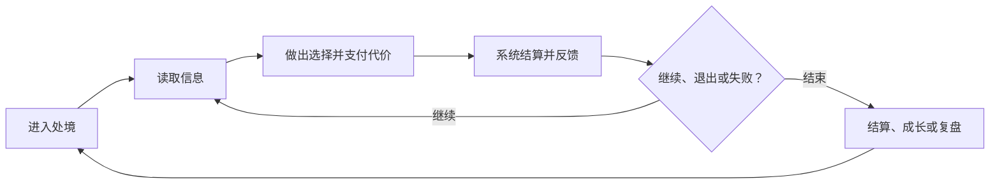
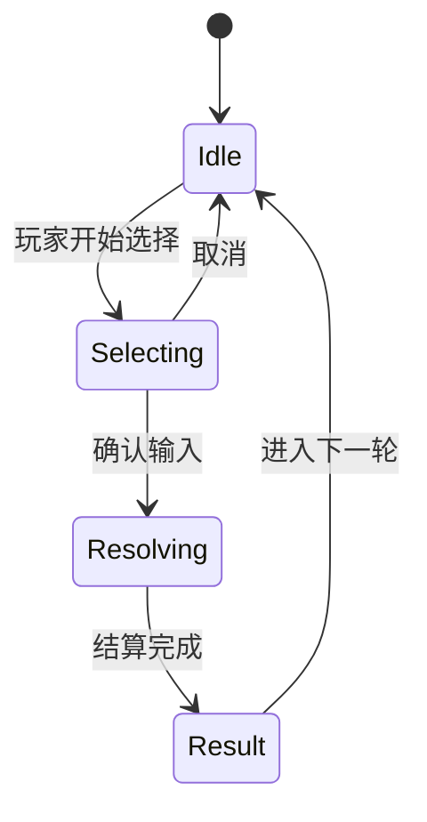

# GDD 写作要求与模板

> 文档状态：`Workflow Template`
>
> 知识来源：[GDD 写作知识 Wiki](../../research/02-theory-digests/gdd-writing-knowledge-wiki-2026-08-18.md)
>
> 用途：把已经成形的游戏构思写成一份围绕玩家体验、核心玩法规则、设计决策与验证的设计合同。
>
> 边界：本文件是写作规范和空白模板，不代表任何设计已经进入 `core-concept.md`。

## 一、怎么使用这份模板

1. 先确定当前需要的完成度：概念对齐、原型验证，还是制作交接。
2. agent 检索 `idea-materials/` 与 `idea-inbox/`，按当前 GDD 章节整理“合格素材候选”和“未确认 inbox 候选”。
3. agent 主动向用户逐项提出相关素材；合格素材可以选择纳入、排除或暂缓，inbox 候选必须先通过 `grill-with-docs` 并晋级后才能纳入。
4. 复制“六、GDD 正文模板”到 `game-design-workflow/gdd/` 的新文档，不要直接在本模板中填写项目内容。
5. 保留适用于当前完成度的 `[必填]` 章节；按触发条件保留 `[条件必填]` 章节；删除无关的 `[可选]` 章节。
6. 每个结论都标明证据状态；未知项可以保留，但必须写清负责人、验证方式或决策时点。
7. GDD 中出现正式设定变更时，仍需按本仓库的 `Proposal → Evaluation → Draft Change → Accepted` 流程处理。

这份模板不要求“一次写完”。优先让当前阶段最关键的设计能够被理解和验证，再逐步补足细节。

### GDD 与代码开发的硬边界

GDD 只回答“玩家经历什么、可以做什么、规则如何影响选择、为什么采用这项设计，以及如何判断设计是否成立”。

| 可以写入 GDD | 不得写入 GDD |
| --- | --- |
| 玩家处境、动作、信息、反馈与体验目标 | 引擎、框架、插件和具体技术选型 |
| 胜负、资源、费用、时序、叠加、随机等玩法规则 | 类名、函数名、模块名、脚本路径和目录结构 |
| 设计数值、内容关系、平衡旋钮与玩家可见字段 | 编程类型、API、数据库、序列化和加载格式 |
| 设计假设、备选方案、采用理由与复审条件 | 构建命令、CI、发布步骤和代码完成度 |
| 原型要验证的问题、玩家任务与成功/失败信号 | Bug 列表、技术债、开发排期和工程验收结果 |

代码开发状态统一记录在 [`docs/code-development-index.md`](../../docs/code-development-index.md)，详细技术说明留在对应代码仓库。GDD 可以链接开发证据，但不得复制技术实现，也不得因为代码已经存在就把玩法假设写成 `Confirmed`。

### GDD 素材硬门槛

- `idea-inbox/` 是未达标内容隔离区，不是 GDD 的有效来源库。
- `idea-materials/` 是正式素材库；被 GDD 引用的想法必须能追溯到这里。
- agent 不能静默忽略相关素材，也不能把全部库存一次性倾倒给用户；应在对应章节出现时主动提出最相关内容。
- 写入 GDD 不会把素材自动变成 `Accepted`，也不会绕过核心构思修改流程。

## 二、标记约定

### 2.1 章节要求等级

| 标记 | 含义 |
| --- | --- |
| `[必填]` | 对所有 GDD 都成立，不应删除 |
| `[条件必填]` | 触发对应系统或制作条件时必须填写 |
| `[可选]` | 只在能帮助决策、实现或测试时保留 |

### 2.2 内容证据状态

| 状态 | 含义 | 写作要求 |
| --- | --- | --- |
| `Confirmed` | 已有决策、原型或测试支持 | 链接对应决策、原型或测试记录 |
| `Hypothesis` | 有理由相信，但尚未验证 | 写出验证方式与成功/失败信号 |
| `Unknown` | 当前没有答案 | 写出影响、负责人和最晚决策时点 |
| `Out of Scope` | 当前阶段明确不做 | 写出边界以及何时可能重新讨论 |

不要用“待定”掩盖未知。推荐写法：

```text
状态：Unknown
影响：如果不确定回合上限，暂时无法验证疲劳长度和牌库循环频率。
负责人：战斗设计
验证方式：用 10/15/20 回合三组原型进行对比测试。
决策时点：战斗原型 V0.2 前。
```

### 2.3 工作流状态

GDD 本身的成熟度与仓库的决策状态是两件事。文档头部必须同时写明：

- 文档成熟度：`GDD-0 / GDD-1 / GDD-2`
- 设计状态：`Idea / Proposal / Evaluation / Draft Change / Accepted / Parked / Rejected`

只有 `Accepted` 内容才能作为正式核心设定引用；`Hypothesis` 不能因为写进 GDD 就自动变成事实。

## 三、完成度要求

### GDD-0：概念对齐版

用于判断“这是什么游戏、玩家反复做什么、为什么值得验证”。必须完成：

- 文档控制与范围
- 一句话概念
- 目标玩家与使用情境
- 核心体验承诺、设计支柱与反支柱
- 核心循环
- 胜负/结束条件
- 最大风险与最小验证问题

GDD-0 不需要完整数值、内容清单或技术实现细节。

### GDD-1：原型验证版

用于让团队做出可玩的最小原型并判断核心假设。除 GDD-0 外必须完成：

- 玩家旅程与关键决策点
- 原型范围内的系统规格
- 状态、时序与边界情况
- 交互、信息与反馈要求
- 规则验收标准和体验验收标准
- 原型计划、测试方法、成功/失败/停止信号
- 已知风险、未知项与决策记录

### GDD-2：制作交接版

用于把玩法设计扩展到完整内容、玩家界面和制作边界。除 GDD-1 外必须完成：

- 完整系统依赖与内容关系
- 内容生产规则和内容量级
- UI、可读性、无障碍与音画反馈要求
- 会改变玩家体验的平台、输入、会话与持久化设计约束
- 经济、成长、关卡、引导等已启用模块
- 玩法异常、负面用例和设计回归范围
- 版本、变更、负责人和依赖追踪

### 章节适用矩阵

| 正文章节 | GDD-0 | GDD-1 | GDD-2 |
| --- | --- | --- | --- |
| 0. 文档控制 | 必填 | 必填 | 必填 |
| 1. 产品与体验合同 | 必填 | 必填 | 必填 |
| 2. 核心循环与玩家旅程 | 填核心循环与结束条件 | 必填 | 必填 |
| 3—4. 规则总览与系统规格 | 不要求 | 必填 | 必填 |
| 5. 状态机与事件时序 | 触发时填写 | 触发时填写 | 触发时填写 |
| 6. 数据与内容规格 | 不要求 | 需要批量数据时填写 | 必填 |
| 7—9. 卡牌/经济/关卡模块 | 当前范围触发时填写 | 当前范围触发时填写 | 当前范围触发时填写 |
| 10—13. 引导/呈现/资产/设计边界 | 不要求 | 原型明确需要时填写 | 必填 |
| 14—15. 原型、测试与验收 | 在 1.7 写最小验证问题 | 必填 | 必填 |
| 16. 风险、未知项与决策 | 填风险与未知项 | 必填 | 必填 |
| 17. 附录 | 可选 | 可选 | 可选 |
| 18. 提交前自检 | 必填 | 必填 | 必填 |

## 四、GDD 硬性写作要求

### 4.1 从玩家行为开始

每个系统先写玩家看见什么、做什么、为何选择、得到什么反馈，再写后台规则。不能只列功能名或数据表。

最小表达链：

```text
玩家处境 → 可见信息 → 可选动作 → 决策代价 → 系统结果 → 感知反馈 → 下一步选择
```

### 4.2 每个系统必须闭环

每个进入当前范围的系统至少回答以下字段：

1. 设计目的
2. 玩家承诺
3. 输入与触发条件
4. 前置状态
5. 核心规则
6. 输出与状态变化
7. 成本、限制与取舍
8. 失败、取消和异常情况
9. 玩家交互
10. 信息、可读性与反馈
11. 正例与反例
12. 验收标准
13. 未知项与依赖

缺少其中任何一项时，应明确标成 `Unknown`，而不是让实现者自行猜测。

### 4.3 分开写机制、行为和体验

使用 MDA 链条检查设计推理：

| 层级 | 回答的问题 |
| --- | --- |
| Mechanics | 系统实际允许、禁止和计算什么？ |
| Dynamics | 玩家在这些规则下可能反复形成什么行为？ |
| Aesthetics | 这些行为希望产生什么感受、张力或表达空间？ |

不允许只写“增加策略性”“更爽”“更平衡”。必须补充可观察表现，例如玩家是否会比较方案、改变路线、保留资源、承担风险或形成不同构筑。

### 4.4 规则必须明确、可验证，但不下沉代码

规则句应尽量包含：

```text
在【前置状态】下，当【输入/事件】发生时，系统按照【顺序/公式/优先级】执行【状态变化】，并向玩家提供【反馈】；若【异常条件】成立，则【替代结果】。
```

涉及顺序、叠加、随机、冲突、取消、超时或并发时，必须说明优先级和边界。

规则精确不等于描述代码。只写玩家可观察状态和设计结算；不得用类、函数、脚本、API、存储结构或引擎生命周期代替玩法说明。

### 4.5 验收必须覆盖两层

| 层级 | 检查内容 | 示例 |
| --- | --- | --- |
| 规则验收 | 系统是否按规格执行 | 同名效果不重复结算 |
| 体验验收 | 玩家是否感知到预期决策和情绪 | 玩家能说明自己为何保留这张牌 |

规则验收适合写成 Given / When / Then；体验验收必须写测试方法、样本和信号，不能伪装成必然成立的功能条件。

代码、资产、构建和发布是否完成属于开发进度，不是 GDD 验收；统一转入代码开发进度索引或对应制作仓库。

### 4.6 保持范围和变更可追踪

- 文档必须列出本版“包含什么”和“明确不包含什么”。
- 新想法先进入 `idea-inbox/`；通过资格闸门并晋级 `idea-materials/` 后，才能进入 GDD 或 Proposal。
- 重大规则变化必须记录原因、影响范围、替代方案与回退条件。
- 删除旧结论时保留决策历史或链接，不覆盖失败路径。
- 数字必须带单位、适用条件和基准版本；表格字段应稳定命名。

### 4.7 保持可读性

- 一个术语只表达一个概念；首次出现时定义。
- 先写结论和玩家影响，再写推导和细节。
- 流程用图，状态用状态机，规则用表，例外用用例。
- 长篇背景只保留会改变玩家判断、规则或呈现的部分。
- 外链不能替代关键结论；读者不打开外链也应理解当前规则。

## 五、交付前质量门槛

以下检查只应用于当前成熟度和已经触发的模块；不适用项应标为 `N/A`。

### 设计门槛

- [ ] 能用一句话说明玩家身份、核心动作、目标与独特约束。
- [ ] 核心循环包含开始、行动、反馈、失败/退出和再次进入的动机。
- [ ] 每个设计支柱都能映射到具体规则；反支柱能排除不合适的方案。
- [ ] 关键机制已说明希望诱发的行为和体验，而非只描述功能。

### 规格门槛

- [ ] 当前范围内的每个系统都有输入、状态、规则、输出与异常。
- [ ] 时序、优先级、叠加、随机和取消规则不存在依赖口头解释的空白。
- [ ] 玩法字段、单位、默认值、上限与内容生产约束足以消除设计歧义。
- [ ] 正例、反例和跨系统影响足以消除主要歧义。
- [ ] 没有出现引擎、类、函数、脚本路径、API、序列化或代码完成度。

### 验证门槛

- [ ] 每个核心假设都有最小验证方式和可观察信号。
- [ ] 规则验收与体验验收没有相互混用。
- [ ] 测试记录能追溯到版本、样本、问题和对应决策。
- [ ] 已写明失败信号、停止条件和下一轮修改范围。

### 协作门槛

- [ ] 文档有负责人、版本、更新日期、状态与关联文档。
- [ ] `Confirmed / Hypothesis / Unknown / Out of Scope` 状态清楚。
- [ ] 未知项有影响、负责人、验证方式或决策时点。
- [ ] 本版范围、依赖、风险和变更历史可追踪。

---

# 六、GDD 正文模板

> 从本节开始复制。方括号中的要求标签建议保留；尖括号中的提示需要替换或删除。

# 《<游戏/功能名称>》GDD

## 0. 文档控制 `[必填]`

| 字段 | 内容 |
| --- | --- |
| 文档 ID | `<例如 GDD-BATTLE-001>` |
| 当前版本 | `<例如 0.1.0>` |
| 文档成熟度 | `GDD-0 / GDD-1 / GDD-2` |
| 设计状态 | `Idea / Proposal / Evaluation / Draft Change / Accepted / Parked / Rejected` |
| 负责人 | `<姓名/角色>` |
| 评审人 | `<策划/程序/美术/QA/其他>` |
| 创建日期 | `YYYY-MM-DD` |
| 最近更新 | `YYYY-MM-DD` |
| 目标里程碑 | `<原型/版本/发布日期>` |
| 关联提案 | `<链接或无>` |
| 关联正式素材 | `<idea-materials/ 链接或无>` |
| 待确认 inbox 候选 | `<idea-inbox/ 链接或无；不得直接进入正文>` |
| 关联评估 | `<链接或无>` |
| 关联决策 | `<链接或无>` |
| 关联原型/测试 | `<链接或无>` |
| 关联开发进度 | `<docs/code-development-index.md 对应条目或无；只链接，不复制代码状态>` |

### 0.1 本版目标

<这版 GDD 要帮助谁做出什么决定或交付什么结果？>

### 0.2 本版范围

**包含：**

- <系统、场景、平台或内容范围>

**明确不包含：**

- <当前不解决的内容及原因>

### 0.3 证据状态摘要

| 结论/模块 | 状态 | 依据或下一步 |
| --- | --- | --- |
| <结论> | `Confirmed / Hypothesis / Unknown / Out of Scope` | <链接、验证方式、负责人或时点> |

### 0.4 本次变更摘要

| 版本 | 日期 | 修改人 | 变更内容 | 原因/依据 | 影响范围 |
| --- | --- | --- | --- | --- | --- |
| 0.1.0 | YYYY-MM-DD | <角色> | <新增/修改/删除> | <测试/决策/约束> | <系统/数据/资产/测试> |

### 0.5 素材审查 `[必填]`

**正式素材候选：**

| 素材 | 与本 GDD 的关系 | 建议章节 | 用户决定 | 处理说明 |
| --- | --- | --- | --- | --- |
| <idea-materials/ 链接> |  |  | `Include / Omit / Park` |  |

**未确认 inbox 候选：**

| 原始想法 | 相关性 | 缺失的资格字段 | 处理结果 |
| --- | --- | --- | --- |
| <idea-inbox/ 链接> |  |  | `继续 grill / 不采用 / 已晋级为 <素材链接>` |

> 未确认候选不能出现在后续 GDD 正文中。若本次没有相关库存，也要明确写“已检索，无相关素材”。

## 1. 产品与体验合同 `[必填]`

### 1.1 一句话概念

> 玩家作为【身份】，在【场景】中反复【核心动作】，为了【目标】承担【关键取舍】，并获得【核心体验】；其独特约束是【差异点】。

### 1.2 目标玩家与情境

| 项目 | 内容 |
| --- | --- |
| 核心目标玩家 | <经验、偏好、动机，不只写年龄性别> |
| 次级玩家 | <如有> |
| 单局/单次时长 | <分钟及适用情境> |
| 平台与输入 | <平台、设备、操作方式> |
| 玩家已有知识 | <默认理解/需要教学的内容> |
| 非目标玩家/体验 | <本项目不优先服务什么> |

### 1.3 玩家体验承诺

<玩家完成一轮游戏后，应能用什么话描述这段体验？>

### 1.4 设计支柱

> 保留 3—5 项。每项必须能约束规则取舍。

| 设计支柱 | 玩家可观察表现 | 支持它的规则 | 反面信号 |
| --- | --- | --- | --- |
| <支柱> | <玩家会做/说什么> | <对应机制> | <出现什么说明偏离> |

### 1.5 反支柱

| 本游戏不追求什么 | 为什么 | 因此不采用什么方案 |
| --- | --- | --- |
| <反支柱> | <与核心体验冲突之处> | <被排除的设计> |

### 1.6 核心假设

> 如果玩家反复【行为】，并持续获得【反馈】，那么【目标体验】可能成立。

- 状态：`Confirmed / Hypothesis`
- 当前依据：<来源>
- 最大反证风险：<什么结果会推翻它>

### 1.7 下一验证问题 `[必填]`

- 当前最大风险：
- 下一步只验证什么问题：
- 最小验证方式：
- 成功信号：
- 失败/停止信号：

## 2. 核心循环与玩家旅程 `[必填]`

### 2.1 核心循环



<替换节点，并在正文说明一轮循环的时间尺度。>

### 2.2 多时间尺度循环

| 时间尺度 | 起点 | 玩家动作 | 反馈/奖励 | 结束条件 | 再次进入动机 |
| --- | --- | --- | --- | --- | --- |
| 瞬时/10—30 秒 |  |  |  |  |  |
| 单局/单次探索 |  |  |  |  |  |
| 一轮/一次 Run |  |  |  |  |  |
| 长期成长 |  |  |  |  |  |

### 2.3 玩家旅程 `[必填：GDD-1/GDD-2]`

| 阶段 | 玩家目标 | 可见信息 | 可选动作 | 关键决策/代价 | 系统反馈 | 失败与恢复 |
| --- | --- | --- | --- | --- | --- | --- |
| <阶段> |  |  |  |  |  |  |

### 2.4 胜利、失败、撤退与退出

- 胜利条件：
- 失败条件：
- 主动撤退/提前结算条件：
- 中断与恢复规则：
- 失败后保留/失去什么：
- 玩家如何理解结果：

## 3. 规则总览 `[必填：GDD-1/GDD-2]`

### 3.1 核心名词

| 术语 | 唯一定义 | 不等同于 | 首次教学位置 |
| --- | --- | --- | --- |
| <术语> |  |  |  |

### 3.2 全局规则与不变量

> 不变量是任何系统都不能破坏的规则，例如“同一唯一物不可同时属于两个玩家”。

| ID | 不变量/全局规则 | 适用范围 | 破坏时的处理 |
| --- | --- | --- | --- |
| INV-001 |  |  |  |

### 3.3 时间与结算单位

- 时间模型：`实时 / 回合 / Tick / 阶段制 / 混合`
- 最小结算单位：
- 暂停规则：
- 同时事件判定方式：
- 默认优先级：
- 随机种子/重放要求：

### 3.4 系统清单与依赖

| 系统 ID | 系统名称 | 玩家目的 | 上游输入 | 下游影响 | 负责人 | 当前状态 |
| --- | --- | --- | --- | --- | --- | --- |
| SYS-001 |  |  |  |  |  | `Confirmed / Hypothesis / Unknown` |

## 4. 系统规格 `[必填：GDD-1/GDD-2；每个当前范围内的系统复制一份]`

## SYS-<编号>：<系统名称>

### 4.1 设计目的与玩家承诺

- 设计目的：<该系统解决什么设计问题？>
- 玩家承诺：<玩家使用它时应得到什么可感知价值？>
- 对应设计支柱：<链接>
- 不负责解决：<边界>

### 4.2 MDA 推理

| Mechanics：规则提供什么 | Dynamics：可能诱发什么行为 | Aesthetics：希望产生什么体验 | 反面行为/体验 |
| --- | --- | --- | --- |
|  |  |  |  |

### 4.3 输入、状态与输出

| 项目 | 说明 |
| --- | --- |
| 触发条件 |  |
| 玩家输入 |  |
| 系统输入 |  |
| 前置状态 |  |
| 状态变量 |  |
| 正常输出 |  |
| 持久化变化 |  |
| 下游事件 |  |

### 4.4 核心规则

| 规则 ID | 前置状态 | 输入/事件 | 处理顺序、公式或优先级 | 状态变化 | 玩家反馈 |
| --- | --- | --- | --- | --- | --- |
| R-001 |  |  |  |  |  |

### 4.5 成本、限制与取舍

| 选择 | 获得什么 | 支付/放弃什么 | 风险 | 可逆性 | 防止的最优解 |
| --- | --- | --- | --- | --- | --- |
|  |  |  |  |  |  |

### 4.6 失败、取消与玩法异常

| 情况 | 玩法条件 | 规则结果 | 玩家反馈 | 是否可恢复 |
| --- | --- | --- | --- | --- |
| 选择不合法 |  |  |  |  |
| 资源不足 |  |  |  |  |
| 中途取消 |  |  |  |  |
| 冲突/同时发生 |  |  |  |  |

### 4.7 交互、信息与反馈

| 时点 | 玩家需要知道什么 | 玩家能做什么 | 视觉反馈 | 音频/触觉反馈 | 可读性/无障碍要求 |
| --- | --- | --- | --- | --- | --- |
| 行动前 |  |  |  |  |  |
| 行动中 |  |  |  |  |  |
| 结算时 |  |  |  |  |  |
| 结果后 |  |  |  |  |  |

### 4.8 正例与反例

**正例：**

> Given <前置状态>，When <玩家输入/事件>，Then <结算、反馈和新状态>。

**反例/边界例：**

> Given <异常或极端状态>，When <冲突输入/事件>，Then <替代结果及原因>。

### 4.9 系统验收标准

**规则验收：**

- [ ] Given <状态>，When <事件>，Then <确定结果>。
- [ ] <不变量、负面用例或极限值>

**体验验收：**

- 待验证体验：
- 测试任务：
- 可观察成功信号：
- 可观察失败信号：
- 样本与记录方式：

### 4.10 未知项与依赖

| 问题/依赖 | 状态 | 影响 | 负责人 | 验证/解决方式 | 最晚时点 |
| --- | --- | --- | --- | --- | --- |
|  | `Unknown` |  |  |  |  |

## 5. 状态机与事件时序 `[条件必填：存在阶段、响应窗口、叠加或并发时]`

### 5.1 状态机



<替换状态、进入条件、退出条件与不可逆点。>

### 5.2 事件时序

| 顺序 | 阶段/窗口 | 可执行主体 | 允许事件 | 优先级 | 超时/跳过 | 结算后状态 |
| --- | --- | --- | --- | --- | --- | --- |
| 1 |  |  |  |  |  |  |

### 5.3 冲突处理

- 同时触发：
- 相同优先级：
- 重复效果：
- 循环触发：
- 结算中状态失效：
- 玩家可见状态与规则结果冲突：

## 6. 数据与内容规格 `[条件必填：GDD-2 或需要批量生产内容时]`

### 6.1 内容模型

| 设计字段 | 玩家/规则用途 | 单位或选项 | 默认值 | 合法范围 | 缺失时的设计处理 |
| --- | --- | --- | --- | --- | --- |
| 稳定标识 | 区分内容并支持规则引用 | 唯一名称 | 无 | 不重复 | 不允许缺失 |

> 这里只定义内容在玩法中的意义，不定义编程类型、字段名、序列化或加载方式。

### 6.2 内容分类与生产规则

| 内容类型 | 玩家作用 | 必需字段 | 组合规则 | 禁止组合 | 目标数量 | 验收负责人 |
| --- | --- | --- | --- | --- | --- | --- |
|  |  |  |  |  |  |  |

### 6.3 数值基准与平衡旋钮

| 参数 | 当前基准 | 单位/条件 | 可调范围 | 影响的玩家行为 | 观察指标 | 修改风险 |
| --- | --- | --- | --- | --- | --- | --- |
|  |  |  |  |  |  |  |

### 6.4 随机与掉落

- 随机目的：
- 概率表达方式：
- 权重与保底：
- 重复保护：
- 种子/重放：
- 玩家是否可预判或干预：
- 验收样本量：

## 7. 卡牌、组合与唯一内容 `[条件必填：卡牌/构筑游戏]`

### 7.1 卡牌字段

| 字段 | 说明 |
| --- | --- |
| Card ID / 显示名 |  |
| 类型/标签 |  |
| 获取与失去方式 |  |
| 使用条件 |  |
| 成本 |  |
| 目标 |  |
| 效果与结算顺序 |  |
| 持续时间 |  |
| 叠加/覆盖规则 |  |
| 失效/反制方式 |  |
| 视觉与音频反馈 |  |
| AI/自动选择规则 |  |
| 平衡旋钮 |  |

### 7.2 组合规则

| 组合 ID | 成员/顺序 | 识别时点 | 触发条件 | 消耗 | 效果 | 冲突优先级 | 反馈 |
| --- | --- | --- | --- | --- | --- | --- | --- |
|  |  |  |  |  |  |  |  |

### 7.3 唯一性不变量

- “唯一”的作用域：`单局 / 玩家账户 / 全服 / 世界 / 赛季 / 其他`
- 创建时机与所有权：
- 重复检测：
- 替换、销毁、丢失与恢复：
- 交易/转移限制：
- 跨版本兼容：
- 争议与异常处理：

### 7.4 组合图的最小反例

必须至少覆盖：重复成员、顺序改变、条件中途失效、多个组合同时匹配、循环触发、效果被反制和版本迁移。

## 8. 经济、资源与成长 `[条件必填：存在局内/局外资源或长期成长时]`

### 8.1 资源流

| 资源 | 来源 | 消耗口 | 储存上限 | 跨局保留 | 主要决策 | 通胀/枯竭风险 |
| --- | --- | --- | --- | --- | --- | --- |
|  |  |  |  |  |  |  |

### 8.2 进度结构

| 阶段 | 解锁内容 | 玩家能力变化 | 新决策 | 预计时长 | 防止重复劳动的措施 |
| --- | --- | --- | --- | --- | --- |
|  |  |  |  |  |  |

### 8.3 软硬门槛与追赶

- 硬门槛：
- 软门槛：
- 失败补偿：
- 追赶机制：
- 重置/赛季规则：
- 付费边界（如有）：

## 9. 地图、关卡与遭遇 `[条件必填：存在空间探索或关卡序列时]`

| 阶段/节点 | 玩家目标 | 进入条件 | 资源与风险 | 关键选择 | 遭遇/谜题 | 退出条件 | 教学目的 |
| --- | --- | --- | --- | --- | --- | --- | --- |
|  |  |  |  |  |  |  |  |

- 地图生成/编排规则：
- 可达性与死路规则：
- 节奏曲线：
- 难度升级旋钮：
- 重玩差异来源：
- 卡死、丢失方向和无解状态的保护：

## 10. 引导与首次体验 `[条件必填：GDD-2]`

| 时间/阶段 | 玩家应学会什么 | 通过什么行为学习 | 系统如何反馈 | 允许犯什么错 | 何时移除提示 |
| --- | --- | --- | --- | --- | --- |
| 0—1 分钟 |  |  |  |  |  |
| 1—5 分钟 |  |  |  |  |  |
| 5—15 分钟 |  |  |  |  |  |

- 必须先体验、后解释的内容：
- 可跳过/重看规则：
- 老玩家快速通道：
- 首次失败后的恢复：

## 11. UI、呈现与无障碍 `[条件必填：GDD-2]`

### 11.1 信息层级

| 信息 | 优先级 | 出现时机 | 持续时间 | 表达通道 | 玩家可执行动作 |
| --- | --- | --- | --- | --- | --- |
|  |  |  |  | 视觉/音频/触觉/文本 |  |

### 11.2 状态与错误反馈

- 加载：
- 空状态：
- 不可用状态及原因：
- 操作成功：
- 操作失败：
- 网络/存档异常：
- 不可逆操作确认：

### 11.3 无障碍要求

- 不依赖单一颜色传达：
- 字号、对比度与缩放：
- 输入重映射：
- 动效减弱：
- 字幕与音频提示替代：
- 时间限制辅助：

## 12. 音画风格与资产要求 `[条件必填：GDD-2]`

> 只写会影响识别、反馈、资产生产或性能的设计要求；纯审美探索放入独立视觉/音频文档。

| 资产/事件 | 设计功能 | 风格关键词 | 必须可读的信息 | 规格/变体 | 依赖 | 验收标准 |
| --- | --- | --- | --- | --- | --- | --- |
|  |  |  |  |  |  |  |

## 13. 设计边界与制作依赖 `[条件必填：GDD-2]`

> 只记录会改变玩家行为、规则或体验承诺的约束。技术方案、性能预算、存储、联网架构、工具链和发布要求转入代码开发进度索引或对应制作文档。

| 设计边界/依赖 | 对玩家体验或规则的影响 | 必须保持的设计结果 | 负责人 | 外部记录 |
| --- | --- | --- | --- | --- |
| 平台与输入情境 |  |  |  |  |
| 单次会话与中断 |  |  |  |  |
| 跨局保留范围 |  |  |  |  |
| 本地化与信息表达 |  |  |  |  |
| 内容生产能力 |  |  |  |  |

## 14. 原型与测试计划 `[必填：GDD-1/GDD-2]`

### 14.1 最小可验证原型

| 项目 | 内容 |
| --- | --- |
| 核心问题 | <一次只验证最关键的不确定性> |
| 原型形式 | <纸面/表格/灰盒/可玩构建等> |
| 必须实现 |  |
| 明确不实现 |  |
| 可使用的替代物 |  |
| 预计成本/周期 |  |
| 关联开发记录 | <链接代码开发进度索引；不在此填写代码完成度> |

### 14.2 测试设计

| 假设 ID | 测试任务 | 目标样本 | 观察项 | 成功信号 | 失败信号 | 停止条件 |
| --- | --- | --- | --- | --- | --- | --- |
| H-001 |  |  |  |  |  |  |

### 14.3 记录原则

- 先记录行为，再记录玩家解释，最后记录设计者判断。
- 区分“规则没有被理解”“规则被理解但没有产生目标体验”。
- 保留原型版本、测试日期、样本特征、原始记录和结论链接。
- 单次测试不直接证明普遍结论；说明证据强度和仍未解释的反例。

## 15. 验收总表 `[必填：GDD-1/GDD-2]`

| AC ID | 类型 | 对象 | Given | When | Then / 可观察信号 | 负责人 | 证据 |
| --- | --- | --- | --- | --- | --- | --- | --- |
| AC-R-001 | 规则 |  |  |  |  | 设计/QA |  |
| AC-E-001 | 体验 |  |  |  |  | 设计/研究 |  |

### 15.1 回归范围

- 本次变更直接影响：
- 可能间接影响：
- 必须重测的不变量：
- 不在本轮回归范围：

## 16. 风险、未知项与决策 `[必填]`

### 16.1 风险清单

| 风险 | 类型 | 概率 | 影响 | 最早预警信号 | 缓解措施 | 回退方案 | 负责人 |
| --- | --- | --- | --- | --- | --- | --- | --- |
|  | 玩法/制作/表达/市场 | 高/中/低 | 高/中/低 |  |  |  |  |

纯技术风险不在 GDD 展开；如果它会迫使玩法改变，在此写清“会改变哪项设计决定”，并链接代码开发进度索引中的阻塞记录。

### 16.2 未知项

| 问题 | 影响的决定 | 当前状态 | 验证方式 | 负责人 | 最晚决策时点 |
| --- | --- | --- | --- | --- | --- |
|  |  | `Unknown` |  |  |  |

### 16.3 决策记录 `[必填：GDD-1/GDD-2]`

| 决策 ID | 日期 | 决定 | 备选方案 | 选择理由 | 依据 | 复审条件 |
| --- | --- | --- | --- | --- | --- | --- |
| DEC-001 | YYYY-MM-DD |  |  |  |  |  |

## 17. 附录 `[可选]`

- 流程图、状态图、概率推导：
- 竞品和理论来源：
- 术语表：
- 数据表/资产清单：
- 原型与测试记录：
- 被否决方案及原因：

## 18. 提交前自检 `[必填]`

> 只检查当前文档成熟度与已触发模块对应的条目；不适用项标记为 `N/A`，不要为了勾选而虚构内容。

- [ ] 文档完成度和设计状态没有混淆。
- [ ] 一句话概念能说清身份、动作、目标、取舍和差异点。
- [ ] 设计支柱映射到了具体规则，反支柱排除了错误方向。
- [ ] 核心循环写清进入、行动、反馈、退出/失败和再次进入动机。
- [ ] 每个当前范围内的系统都形成“输入—状态—规则—输出—反馈”闭环。
- [ ] MDA 推理中没有用空泛形容词替代玩家可观察行为。
- [ ] 时序、叠加、冲突、随机、取消、异常和极限值有明确规则。
- [ ] 所有关键数据带单位、条件、范围和稳定字段名。
- [ ] 每个核心假设都有验证方式、成功/失败信号和停止条件。
- [ ] 规则验收与体验验收分别成立。
- [ ] `Unknown` 项有影响、负责人和解决时点；`Out of Scope` 有明确边界。
- [ ] 重大变更能追溯到提案、评估、测试或决策。
- [ ] 已检索正式素材库和 inbox；所有引用想法均能追溯到合格素材文件。
- [ ] inbox 未确认候选没有绕过资格闸门进入正文。
- [ ] 没有把未确认内容伪装成正式核心设定。
- [ ] 没有包含引擎、类、函数、脚本路径、API、序列化、构建步骤或代码完成度。
- [ ] 所有代码实现状态只通过代码开发进度索引建立链接。
