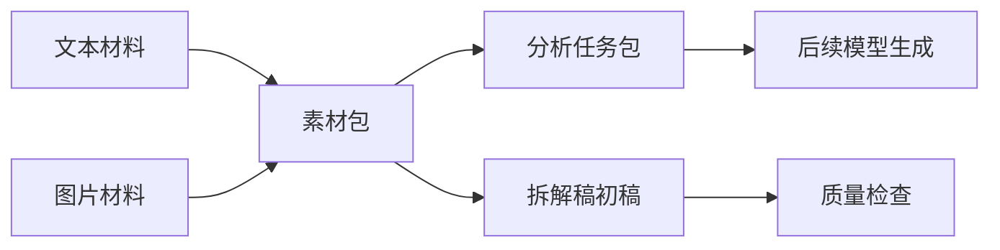

# 游戏拆解总结模式架构草案

## 核心思路

把“视频分析能力”和“游戏拆解写作系统”拆成两层：

```text
输入层：视频 / 截图 / 文本 / 转写
  -> 证据层：素材包 materialpack.json
  -> 组织层：拆解任务包 analysis-packet.md
  -> 产出层：游戏拆解稿 draft.md
  -> 质检层：quality-check.md
```

这样做的好处是：前期可以只用图片和文本材料验证拆解稿质量；后期接入 BiliSum 时，只要让 BiliSum 产出同样的素材包，不需要重写拆解逻辑。

## 与 BiliSum 的接口边界

BiliSum 当前可提供的上游能力：

- 视频导入：B 站、YouTube、本地视频。
- ASR 转写：生成章节、全文、关键句。
- VLM 图文笔记：让视觉模型阅读截图和笔记，重组图文结构。
- Markdown 导出：方便进入本仓库的研究工作流。

本实验室需要的下游输入：

| 字段 | 来源 | 用途 |
| --- | --- | --- |
| `game_name` | 用户或 BiliSum 任务标题 | 标识拆解对象 |
| `analysis_scope` | 用户选择 | 完整拆解 / 战斗专项 / 经济专项等 |
| `target_questions` | 用户输入 | 限定本次拆解要回答的问题 |
| `text_sources` | 转写、笔记、人工记录 | 还原规则、流程、体验和判断 |
| `images` | 关键帧、截图、人工截图 | 支撑 UI、战斗、循环、系统联动等证据 |
| `draft_seed` | 人工观察或模型预处理 | 生成初稿的结构化材料 |

## 第一阶段工作流



第一阶段的目标不是让脚本替代策划判断，而是把材料整理成稳定、可复用、可检查的报告结构。

## 输出稿标准

拆解稿继承仓库现有深度拆解系统的八大模块：

1. 游戏核心定位、基础信息、商业大盘复盘。
2. 全局玩家体验与底层设计目标。
3. 核心玩法循环。
4. 全链路游戏架构拆解。
5. 内容与关卡体系。
6. 数值体系与经济资源闭环。
7. 叙事体系、角色 IP 与视听包装。
8. 优劣复盘与可落地优化方案。

但本实验室额外强调“证据映射”：

- 每个关键判断尽量标注来自文本、截图、转写片段还是推断。
- 图片不是装饰，而是用于证明界面布局、战斗状态、资源流、内容入口或反馈方式。
- 无法从材料确认的信息必须进入“未确认信息”，不能伪装成事实。

## 后续迁移方案

当示例效果达标后，可以在 BiliSum 中新增一种总结模式：

```text
Game Analysis Mode
  输入：视频任务 ID
  配置：拆解范围、目标问题、截图数量、是否完整八模块
  输出：materialpack.json + game-analysis-dossier.md
```

迁移时应优先复用：

- `schemas/material-pack.schema.json`
- `prompts/game-analysis-dossier.md`
- `templates/game-analysis-dossier-template.md`

而不是把本目录里的实验脚本原样搬入 BiliSum。
