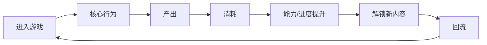
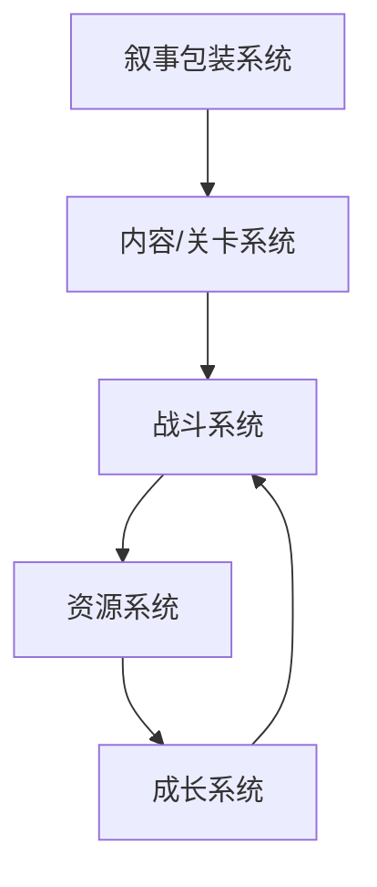

# 核心卡决斗样例游戏拆解任务包

## 任务元信息

- 生成日期：2026-06-17
- 状态：Research / Prototype Lab
- 拆解范围：图片 + 文本材料的工作流验收样例
- 素材包：`materialpack.json`
- 来源备注：虚构样例，只用于验证工作流结构，不代表真实上线游戏。

## 目标问题

- 如何从一张战斗界面图和一段玩法记录中概括核心循环？
- 如何把观察转化为本项目唯一核心卡、辅助卡、费用和组合规则的设计假设？

## 写作提示词

# 游戏拆解稿生成提示词

你是一名游戏系统策划与产品拆解分析师。你的任务不是写玩家测评，而是基于给定的图片、文本、转写或图文笔记，逆向还原一款游戏的设计逻辑，并输出可用于立项讨论、系统设计复盘和本项目玩法判断的游戏拆解稿。

## 输入

你会收到：

1. 拆解对象、范围和目标问题。
2. 图片证据表：包含截图路径、说明、观察点和证据标签。
3. 文本材料：可能来自人工游玩记录、视频转写、BiliSum 图文笔记或社区资料。
4. 输出模板。

## 写作原则

- 结论前置：每个模块先给判断，再展开证据。
- 区分事实、截图观察、文本推断和作者判断。
- 不要把截图里看不到、文本里没有说的信息写成事实。
- 商业数据、上线时间、流水、评分等如果材料中没有可靠来源，写“未确认”，不要编造。
- 不写“好玩、丰富、优秀”这类空泛评价，必须落到玩家行为、系统目的、产出、消耗、反馈和风险。
- 图片必须服务分析：说明它证明了什么界面结构、战斗状态、资源关系、内容入口或反馈方式。
- 最终必须回答：这些观察如何影响本项目“唯一核心卡驱动的 2D 系统型游戏”或新战斗 GDD 的设计判断。

## 输出要求

请按模板输出完整 Markdown，保留八大模块顺序：

1. 游戏核心定位、基础信息、商业大盘复盘。
2. 全局玩家体验与底层设计目标。
3. 核心玩法循环。
4. 全链路游戏架构拆解。
5. 内容与关卡体系。
6. 数值体系与经济资源闭环。
7. 叙事体系、角色 IP 与视听包装。
8. 优劣复盘与可落地优化方案。

必须包含：

- 3-5 条拆解结论摘要。
- 证据地图。
- 核心循环 Mermaid 图。
- 系统关系 Mermaid 图。
- 至少 3 条可复用亮点。
- 至少 3 条短板或风险；如果材料不足，写“材料不足，暂不判断”。
- 至少 1 条可转化设计假设，或明确说明为什么暂不形成假设。
- 未确认信息列表。

## 本项目转化重点

本仓库当前项目方向是：唯一核心卡驱动的 2D 系统型游戏；旧成语组合回合制战斗已归档，新战斗系统正在重新设计。

当你写“对本项目的转化”时，优先判断这些维度：

- 唯一核心卡是否需要类似的身份锚点或长期目标。
- 辅助卡是否能借鉴该游戏的通用资源、技能或道具体系。
- 费用取舍是否能从该游戏的节奏压力中获得启发。
- 组合规则是否能借鉴该游戏的系统联动方式。
- 动态平衡是否能通过环境、规则表、关卡条件或赛季限制实现，而不是直接削弱核心资产。

不要建议第一阶段引入大地图、完整交易市场、真实 AI 生成管线或复杂商业系统，除非材料明确说明这是拆解对象成立的最小条件。

## 图片证据表

### 图片 1: `images/battle-layout.svg`

- 说明：样例战斗界面：核心卡固定在左侧，手牌位于底部，费用与组合提示位于中央。
- 证据标签：核心循环, 战斗系统, 费用取舍, 组合规则
- 观察点：
- 核心卡被放在独立区域，视觉上明显区别于普通手牌。
- 底部手牌用于提供攻击、防御、调度和干扰选择。
- 中央组合提示把核心卡标签、费用和辅助卡条件连在一起，说明关键乐趣来自组合触发。
- 敌方意图位于右侧，使玩家需要在本回合爆发和防守之间取舍。

## 文本材料

## 文本材料：`materials.md`

- 角色：人工游玩记录
- 说明：用结构化文本模拟视频转写、图文笔记和策划观察。
- 行数：22
- 哈希：`cdeefeea0684`

```md
# 核心卡决斗样例素材

> 虚构样例，只用于测试“图片 + 文本材料 -> 游戏拆解稿”的工作流。

## 场景记录

玩家进入一场 1v1 回合制卡牌战斗。左侧固定显示一张核心卡，核心卡有两个标签：“连击”和“过载”。底部显示 5 张辅助卡，其中包含攻击、防御、调度和干扰类型。中央显示当前费用为 3 点。

敌方本回合意图显示为“下回合重击”。玩家可以立即打出攻击卡造成稳定伤害，也可以先打出调度卡寻找第二张连击牌，尝试触发核心卡组合。组合触发后会额外造成伤害并返还 1 点费用，但如果费用不足，只能执行普通单卡效果。

## 观察记录

- 玩家每回合第一步不是直接出牌，而是先看核心卡标签、敌方意图和费用。
- 核心卡不进入手牌，也不被丢弃，像是持续存在的战术身份。
- 辅助卡的单卡效果较弱，组合触发才是关键收益来源。
- 费用限制让玩家必须决定“现在爆发”还是“留费用防守”。
- 敌方意图让玩家有理由放弃理想组合，转而选择防御或干扰。

## 初步判断

这个结构适合验证本仓库当前游戏方向：唯一核心卡、通用辅助卡、费用取舍和组合规则。它不需要完整长线养成就能做纸面原型，但需要特别注意组合条件的可读性。
```

## 输出模板

```md
# <游戏名>游戏拆解稿

## 元信息

- 状态：Research / Prototype Lab
- 拆解范围：
- 材料来源：
- 目标问题：
- 最后更新：

## 拆解结论摘要

- 
- 
- 

## 证据地图

| 证据 | 类型 | 说明 | 支撑模块 |
| --- | --- | --- | --- |
|  | 图片 / 文本 / 转写 / 推断 |  |  |

## 模块1：游戏核心定位、基础信息、商业大盘复盘

### 核心定位

结论：

### 基础信息

| 项目 | 内容 |
| --- | --- |
| 游戏名称 |  |
| 类型标签 |  |
| 核心玩法 |  |
| 目标用户 |  |
| 变现模式 |  |

### 商业与市场表现

结论：

### 对本项目的启示

- 

## 模块2：全局玩家体验与底层设计目标

### 全链路体感

结论：

### 设计目标推断

| 目标 | 支撑设计 | 证据 | 可信度 |
| --- | --- | --- | --- |
| 留存目标 |  |  | 高 / 中 / 低 |
| 付费目标 |  |  | 高 / 中 / 低 |
| 长线活跃目标 |  |  | 高 / 中 / 低 |

### 情绪价值

- 核心情绪：
- 次级情绪：
- 主要触发方式：

### 对本项目的启示

- 

## 模块3：核心玩法循环

### 核心循环图



### 逐环节拆解

| 环节 | 玩家动作 | 系统目的 | 产出 | 消耗 | 体验反馈 | 证据 |
| --- | --- | --- | --- | --- | --- | --- |
|  |  |  |  |  |  |  |

### 对本项目的启示

- 

## 模块4：全链路游戏架构拆解

### 系统关系图



### 系统拆分

| 系统 | 核心作用 | 输入 | 输出 | 联动对象 | 证据 |
| --- | --- | --- | --- | --- | --- |
| 战斗核心 |  |  |  |  |  |
| 成长系统 |  |  |  |  |  |
| 资源系统 |  |  |  |  |  |
| 内容 / 关卡 |  |  |  |  |  |
| 叙事包装 |  |  |  |  |  |

### 对本项目的启示

- 

## 模块5：内容与关卡体系

### 内容类型盘点

| 内容类型 | 进入条件 | 单次时长 | 奖励 | 难度定位 | 留存作用 |
| --- | --- | --- | --- | --- | --- |
|  |  |  |  |  |  |

### 节奏判断

结论：

### 对本项目的启示

- 

## 模块6：数值体系与经济资源闭环

### 资源盘点

| 资源 | 类型 | 获取方式 | 消耗方式 | 风险 |
| --- | --- | --- | --- | --- |
|  | 基础 / 稀有 / 限定 / 付费 |  |  |  |

### 闭环判断

结论：

### 对本项目的启示

- 

## 模块7：叙事体系、角色 IP 与视听包装

### 世界观与剧情

结论：

### 角色与 IP 记忆点

结论：

### 美术、UI 与音频

结论：

### 对本项目的启示

- 

## 模块8：优劣复盘与可落地优化方案

### 可复用亮点

| 亮点 | 为什么有效 | 本项目可如何借鉴 |
| --- | --- | --- |
|  |  |  |

### 真实短板

| 短板 | 影响 | 证据 |
| --- | --- | --- |
|  |  |  |

### 优化方案

| 问题 | 改法 | 预期改善指标 | 风险 |
| --- | --- | --- | --- |
|  |  | 留存 / 活跃 / 付费 / 转化 / 体验 |  |

## 对本项目的转化

### 可借鉴结构

- 

### 不应照搬的部分

- 

### 可转化设计假设

- H：

### 最小验证方式

- 原型范围：
- 玩家行为：
- 成功信号：
- 失败信号：

### 当前状态

Research / Design Hypothesis / Proposal Candidate / Parked

## 未确认信息

-
```
