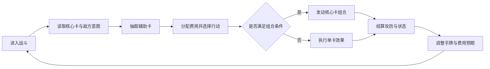
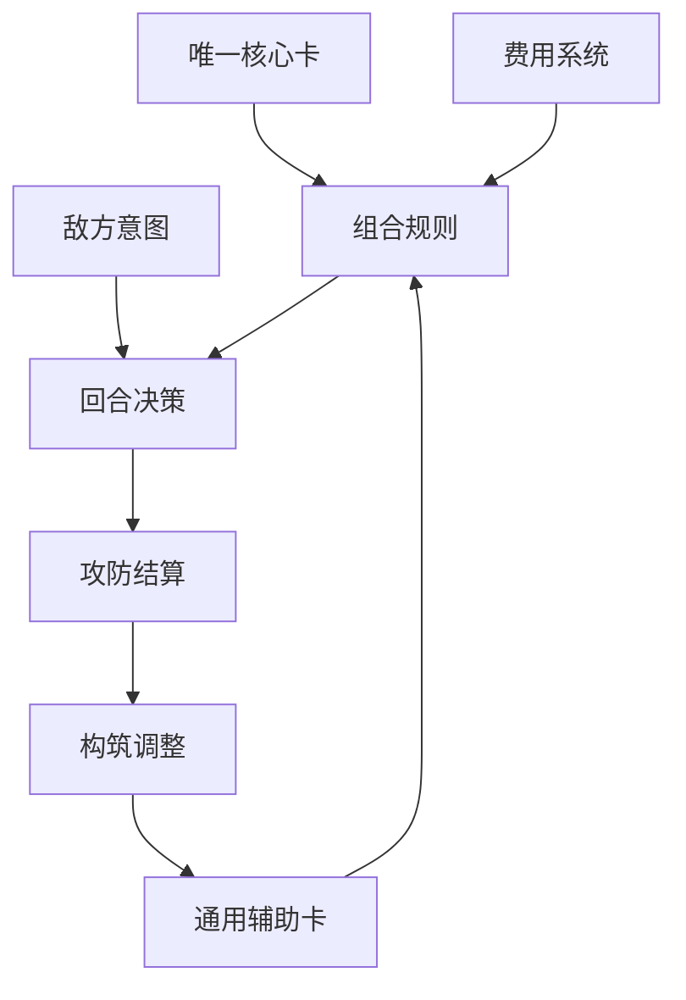

# 核心卡决斗样例游戏拆解稿

## 元信息

- 状态：Research / Prototype Lab
- 拆解范围：图片 + 文本材料的工作流验收样例
- 材料来源：文本 `materials.md`；图片 `images/battle-layout.svg`
- 最后更新：2026-06-17

## 目标问题

- 如何从一张战斗界面图和一段玩法记录中概括核心循环？
- 如何把观察转化为本项目唯一核心卡、辅助卡、费用和组合规则的设计假设？

## 拆解结论摘要

- 样例材料展示的是一种以固定核心卡为身份锚点、用通用辅助卡触发组合的回合制战斗结构。
- 玩家主要反复进行抽牌、观察敌方意图、分配费用、选择辅助卡、判断是否发动组合这几类动作。
- 图片证据表明核心卡不应被当作普通手牌消耗，而应成为战斗界面的持续判定中心。
- 当前材料可以支撑战斗循环和组合取舍分析，但无法支撑商业表现、长线内容和真实留存判断。

## 证据地图

| 证据 | 类型 | 说明 | 支撑模块 |
| --- | --- | --- | --- |
| `materials.md` | 文本 | 用结构化文本模拟视频转写、图文笔记和策划观察。 | 全局 / 核心循环 / 系统拆解 |
| `images/battle-layout.svg` | 图片 | 样例战斗界面：核心卡固定在左侧，手牌位于底部，费用与组合提示位于中央。 | 核心循环, 战斗系统, 费用取舍, 组合规则 |

## 模块1：游戏核心定位、基础信息、商业大盘复盘

### 核心定位

这是一种面向策略卡牌玩家的轻量回合制对战结构。它的差异化不在于卡池数量，而在于玩家是否愿意围绕唯一核心卡持续寻找辅助卡组合路线。

### 商业与市场表现

当前素材未提供可核验商业数据。本阶段不编写流水、留存、评分或榜单结论。

### 对本项目的启示

- 本项目可以把核心卡固定在独立区域，作为战斗判定中心，而不是放入普通手牌循环。
- 辅助卡应承担攻击、防御、调度、干扰四类基础动作，并通过标签与核心卡组合。

## 模块2：全局玩家体验与底层设计目标

### 全链路体感

玩家进入战斗后先读取核心卡能力和敌方意图，再从手牌中挑选辅助卡。每回合费用有限，玩家需要决定是使用稳定单卡收益、保留费用防守，还是投入多张卡触发组合爆发。主要体感是计划、预判和组合成立后的确定性反馈。

### 情绪价值

当前样例重点观察策略规划、组合触发、资源取舍和战斗反馈带来的掌控感。

### 对本项目的启示

- 费用系统应优先服务回合取舍，不应在第一阶段扩展成长经济。
- 敌方意图或对手公开信息可以帮助玩家判断该回合是否值得追求组合。

## 模块3：核心玩法循环

### 核心循环图

### 逐环节拆解

- 输入：核心卡能力、当前手牌、费用、敌方意图和回合状态。
- 玩家动作：选择辅助卡、保留或消耗费用、决定是否追求组合。
- 产出：伤害、防御、抽牌、干扰或组合奖励。
- 反馈：组合成立时获得更强效果；组合失败或费用不足时只能接受较低收益。
- 回流：战斗后玩家会根据核心卡表现调整辅助卡配置。

### 对本项目的启示

- 组合反馈需要足够清楚，让玩家知道强效果来自核心卡理解，而不是随机抽牌。

## 模块4：全链路游戏架构拆解

### 系统关系图

### 系统拆分

- 唯一核心卡系统：提供身份、标签和组合判定中心，不直接进入普通资源消耗循环。
- 辅助卡系统：提供战斗动作和组合材料，负责让不同核心卡形成不同路线。
- 费用系统：限制单回合爆发，让玩家在稳定收益、保留防御和组合触发之间做取舍。
- 敌方意图系统：提供短期压力，迫使玩家判断当前回合应进攻还是防守。
- 构筑调整系统：把战斗中的组合效率反馈带回战前配置。

### 对本项目的启示

- 动态平衡优先调整组合规则、费用和触发条件，而不是改写核心卡本体。

## 模块5：内容与关卡体系

### 节奏判断

- 样例只覆盖单局战斗，不覆盖完整关卡体系。
- 适合第一阶段用少量核心卡、少量辅助卡和固定敌方模板做纸面验证。
- 暂时不需要长线副本、赛季和大地图，否则会稀释核心战斗验证。

### 对本项目的启示

第一阶段应先验证单局战斗与组合学习曲线，不急于扩展完整关卡和长线内容系统。

## 模块6：数值体系与经济资源闭环

### 闭环判断

- 当前材料只有战斗内费用，不包含商业经济和长线资源。
- 费用的主要作用是约束组合爆发，而不是制造养成卡点。
- 第一阶段应观察玩家是否能理解费用不足、组合失败和延迟收益之间的关系。

### 对本项目的启示

费用和组合触发条件应作为第一阶段核心变量，先验证取舍压力是否清楚，再考虑成长和商业资源。

## 模块7：叙事体系、角色 IP 与视听包装

### 叙事与视觉判断

- 样例图只体现核心卡视觉锚点，没有提供世界观、角色故事和音频证据。
- 核心卡可以先用清晰图标、名称和效果反馈建立身份感，完整叙事可后置。

### 对本项目的启示

核心卡身份可以通过视觉锚点和战斗反馈强化，但第一阶段不应依赖完整世界观才能让玩法成立。

## 模块8：优劣复盘与可落地优化方案

### 可复用亮点

- 核心卡固定展示能强化玩家身份感，减少把核心卡当普通资源消耗品的误读。
- 费用和敌方意图共同制造回合压力，使组合不是无脑触发。
- 辅助卡共享池便于控制原型范围，同时保留不同核心卡路线的差异。

### 真实短板

- 如果组合条件过多，玩家可能无法在短回合内预测收益。
- 如果核心卡只负责被动判定，玩家可能感觉它不够有存在感。
- 如果辅助卡过于通用，不同核心卡路线可能变得同质化。

### 优化方案

- 若组合触发条件过多，优先减少响应窗口和状态层级，保证玩家能预测下一步收益。
- 若资源压力不明显，优先调整费用刷新与关键牌消耗，而不是增加更多资源类型。

## 对本项目的转化

### 可借鉴结构

- 本项目可以把核心卡固定在独立区域，作为战斗判定中心，而不是放入普通手牌循环。
- 辅助卡应承担攻击、防御、调度、干扰四类基础动作，并通过标签与核心卡组合。
- 费用系统应优先服务回合取舍，不应在第一阶段扩展成长经济。
- 敌方意图或对手公开信息可以帮助玩家判断该回合是否值得追求组合。
- 组合反馈需要足够清楚，让玩家知道强效果来自核心卡理解，而不是随机抽牌。
- 动态平衡优先调整组合规则、费用和触发条件，而不是改写核心卡本体。

### 可转化设计假设

- H：如果核心卡固定显示在独立战斗区域，并让辅助卡通过标签与其形成组合，那么玩家会更容易把核心卡理解为构筑身份，因为它始终参与判定而不是被一次性消耗。
- H：如果组合需要同时满足标签、费用和敌方意图压力，那么玩家会在稳定收益与爆发收益之间产生更清楚的回合取舍。

### 当前状态

Research / Prototype Lab。该拆解只用于验证分析工作流，不进入 Accepted。

## 未确认信息

- 真实玩家是否能在 1-2 回合内读懂组合条件，仍需纸面测试。
- 核心卡主动发动和被动判定的比例未确认。
- 商业数据、留存表现和长线内容承载能力没有材料支撑。
