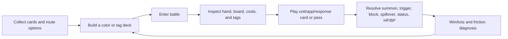
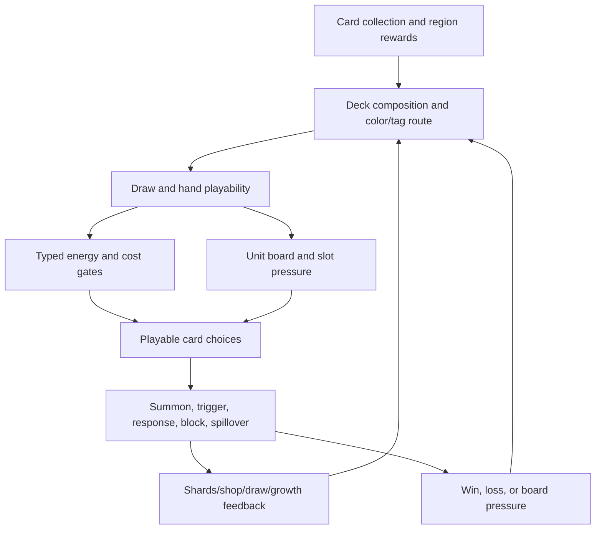

# Anode Heart: Layer Null Game Analysis Dossier

## Meta

- Status: Research / Prototype Lab
- Scope: BiliSum real-material Phase 1 validation from supplied text sources and audited screenshots.
- Date: 2026-06-18
- Visual audit: 8 frames directly read, 20 frames kept as not-audited anchors.

## Summary

The supplied pack supports a compact but real gameplay dossier. Anode Heart: Layer Null appears to be a card-collection and deckbuilding battler where the player repeatedly builds a deck around color/tag routes, tests it in board-based battles, diagnoses failure through draw, energy, board, and response friction, then rebuilds toward a more coherent route such as grass/native recovery and growth. Market, narrative, and exact long-term progression claims are not supported by this pack.

## 证据地图

| Evidence | Type | What It Supports |
| --- | --- | --- |
| T1 `../source/detailed_record.md` | text | Rules, battle flow, deck adjustment, loss diagnosis, grass rebuild. |
| T2 `../source/knowledge_note.md` | text | Attributes, card types, turn order, counters, shards, energy, evolution. |
| T3 `../source/visual_enhanced_note.md` | text/caption | Timeline anchor only; not independent visual reading. |
| T4 `../source/visual_note.md` | text/caption | Frame index only. |
| V4 | visual-audit | Battle board with hand, deployed units, pass action, HP/BP, shop/deck counters. |
| V10 | visual-audit | Card tooltip with tags, summon effect, status, and stats. |
| V13 | visual-audit | Near-full board plus combat/resource HUD. |
| V14 | visual-audit | Grass/native trigger, HP growth, bonus, and energy generation. |
| V15 | visual-audit | Level-marked upgraded unit. |
| V19 | visual-audit | Grass board pressure and HP-change feedback. |
| V23 | visual-audit | Typed native cost, block/spillover wording, and On Summon draw. |
| V25 | visual-audit | Response window: play a card or pass. |

## 图文证据

V4: Combat is not just a card-in-hand problem; the screen combines hand, board, pass timing, HP/BP, shop/resource, and deck state.

V10: Tooltip inspection exposes tags, cost, summon timing, status effect, and stat fields before play.

V14: The grass/native route visibly links tag selection, HP growth, bonus growth, and native energy.

V25: The game explicitly enters a response mode where the player can answer with a legal card or pass.

## 模块1: Game Positioning, Basic Facts, And Market Context

Conclusion: the material supports only basic genre positioning. The game can be described from this pack as a card-collection/deckbuilding battler with creature cards, attributes, typed resources, and board combat. It does not support claims about release date, sales, audience scale, retention, monetization, or live operations.

Evidence-aware note: T2 says the video discusses hundreds of cards, attributes, and card types, but those claims are text-source claims rather than independently verified market facts.

Transfer to this project: treat external games as structural references, not market proof.

## 模块2: Global Player Experience And Design Goals

Conclusion: the player experience is a loop of hypothesis and correction. The player forms a deck idea, tests it against a fight, hits constraints such as missing units, mismatched energy, or weak growth, and then rebuilds toward a clearer route.

V4 supports the feeling of tactical density: many important variables are visible at once. T1/T2 support the larger arc from a weaker colorless build toward a grass/native build with recovery and growth. The likely design goal is to make deck identity legible through battle pain: if the deck cannot draw, pay costs, occupy board slots, or answer responses, the player learns why the route is failing.

Transfer to this project: the unique-core-card project can borrow this kind of "failure diagnosis surface" without borrowing the whole regional map or collection structure.

## 模块3: Core Gameplay Loop

Conclusion: the core loop is collect/build -> battle -> inspect/play/respond -> resolve board effects -> diagnose result -> rebuild. The strongest evidence is that the combat UI itself exposes enough state for the player to understand why a deck route is working or failing.

### 核心循环图

Player input: card selection, target/tag selection, response decision, pass timing, and deck composition. V10 and V25 show the two most important micro-inputs: inspecting a card before play and deciding whether to respond or pass.

System output: board occupancy, HP/BP changes, status effects such as Dazed, resource/energy changes, draw, and visible combat feedback. V19 shows HP-change feedback in the grass route, while V23 shows a block/spillover rule that changes damage routing.

Cost and constraint: the pack points to typed energy, board capacity, draw variance, and evolution prerequisites. V13 shows board capacity pressure; V14 shows energy generation tied to route-specific effects.

Feedback and return path: the battle result feeds deck rebuilding. Text sources describe the colorless route struggling and the grass route providing better recovery/growth. This makes the loop diagnostic rather than merely repetitive.

V13: A near-full player board shows why "draw more" is not always enough; board slots and current deployment also shape the next useful action.

## 模块4: Full System Architecture Breakdown

Conclusion: the architecture is a stack of systems converging on the combat board: collection and region/card acquisition feed deckbuilding; deckbuilding determines hand quality and route identity; battle resolves through card tags, typed energy, unit slots, summon/trigger text, response windows, block/spillover, shop/shard resources, and evolution/growth.

### 系统关系图

Major systems:

- Card taxonomy: text sources describe attributes and card types; V10/V14/V23 visually confirm tags and typed rule panels.
- Board combat: V4/V13 show units deployed in rows with visible stat pairs and pass control.
- Typed energy and costs: V14 and V23 show native/typed cost language and energy generation.
- Response/counterplay: V25 confirms an explicit response mode; exact counter chain rules need text/source verification.
- Evolution/growth: V15 visually confirms level-up/growth presentation; T1/T2 should carry exact prerequisite claims.
- In-run economy: V13 shows the shop/resource readout on the battle screen; T1/T2 describe shards/shop/draw effects.

How systems reinforce the loop: the player does not only ask "which card is strongest?" The player asks whether the current hand can be paid for, whether the board has room, whether a response is available, whether a unit route can scale, and whether shop/draw tools repair the deck's current weakness.

V23: A single tooltip shows typed native cost, a block rule for spillover damage, and On Summon draw. This is the architecture in miniature: cost gate, defensive positioning rule, and resource recovery in one card.

## 模块5: Content And Level Structure

Conclusion: the pack supports route-level content analysis, not a complete world/content map. Evidence points to colorless cards, grass/native cards, regional acquisition, bosses, and a pivot from an underperforming route to a stronger growth/recovery route.

V15 and V19 support the existence of upgraded/growth states and grass board pressure. T1/T2 provide the route narrative: a failed colorless approach gives way to grass cards with recovery, draw, and scaling.

Missing: exact region list, boss order, unlock conditions, complete card list.

## 模块6: Numerical Systems And Economy Loops

Conclusion: three numerical loops are visible enough for Phase 1: combat stats, typed cost/energy, and in-run resource/shop pressure. Together they create the main deckbuilding risk: a deck can contain powerful cards but still fail if it cannot draw playable units, pay typed costs, or create enough board pressure before the opponent scales.

V10/V14/V23 show HP/BP, cost, typed energy, and rule text. V13 shows shop/resource readouts in combat. V19 shows HP feedback and a larger grass board. Exact math should remain unconfirmed, but the direction is clear: resources do not merely pace actions; they diagnose deck coherence.

Transfer to this project: activation cost and combo rules can serve the same function for a unique-core-card battler. They should reveal "why this combo failed" without requiring hidden formulas.

## 模块7: Narrative, Character/IP, And Audio-Visual Packaging

Conclusion: materials are insufficient for narrative and audio. The visual layer is a compact pixel-art card battler with creature cards, readable stat fields, and dense but inspectable tooltips.

The useful observation is UI packaging: even with many systems, the game relies on hover/selection tooltips and persistent board counters to keep tactical state readable. No claims should be made about story, character arcs, music, or IP strategy from this pack.

## 模块8: Strengths, Weaknesses, And Transferable Optimizations

Conclusion: the main strength is diagnosability. Tags, typed costs, visible board state, response prompts, and stat feedback help the player connect failure to deck construction. The main weakness is likely cognitive and variance pressure: energy mismatch, low unit ratio, full hands, or unmet evolution prerequisites can make turns feel dead.

For the current unique-core-card project, the transferable structure is not the full map or collection layer. The useful pattern is:

- show the core card's combo tags and legal support cards clearly;
- let costs expose tradeoffs rather than hide them;
- keep response windows explicit;
- make combo failure visible as a rule/cost/tag mismatch;
- rebalance through combo rules and costs, not by mutating the core card identity.

## 对本项目的转化

### Transferable Structures

- A visible inspection panel for card tags, costs, and combo/trigger conditions.
- Explicit response prompts that say whether the player can answer or must pass.
- Battle feedback that helps diagnose deckbuilding mistakes, such as too few playable units or mismatched costs.
- Growth/recovery routes whose strength comes from repeated synergy, not one isolated high-value card.

### Design Hypotheses

- H1: A unique-core-card battler will be easier to learn if every failed combo shows whether the blocker was tag mismatch, cost shortage, timing, or dynamic rule ban.
- H2: Support cards should create route identity around the core card without replacing the core card as the player's identity anchor.
- H3: Response windows should be rare and explicit in the first prototype to avoid chain complexity.

### Current Status

Research / Prototype Lab. These are references for future proposals, not accepted core design changes.

## 未确认信息

- Only 8 of 28 frames were directly audited in this validation run.
- BiliSum captions/notes were not treated as visual reading.
- Some source text displays mojibake in this console, so text claims were kept high-level and cross-checked with audited frames where possible.
- Release, sales, player reception, full card list, exact formulas, full region structure, narrative, and audio are not verified.
- The scaffolded dossier initially required `visual_evidence[].path`; adding full visual evidence records in the outline resolved that authoring friction without changing skill files.
