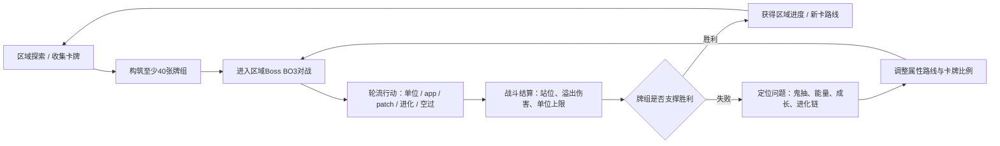
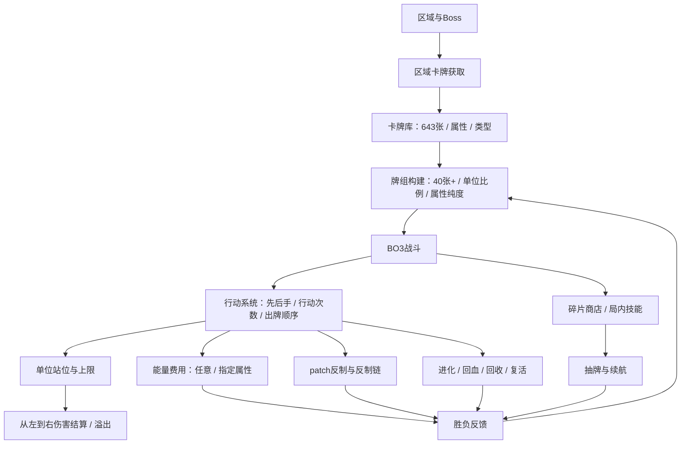
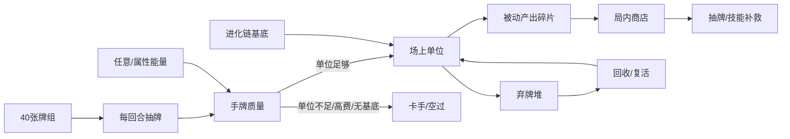

# Anode Heart: Layer Null 游戏拆解稿

## 元信息

- 状态：Research / Prototype Lab
- 拆解范围：BiliSum 真实素材 Phase 1，基于逐句实录、结构化笔记和 28 张关键帧截图。
- 材料来源：`inputs/materialpack.json`、`source/detailed_record.md`、`source/knowledge_note.md`、`source/visual_enhanced_note.md`、`source/visual_context.json`
- 最后更新：2026-06-18

## 目标问题

- 这段视频材料能否支撑一份玩法概括全面、机制判断准确的游戏拆解稿？
- `Anode Heart: Layer Null` 的核心循环、战斗结算、卡组构建、局内经济和成长路线分别是什么？
- 哪些结构可以转化为本项目唯一核心卡、辅助卡、费用取舍、组合规则和动态平衡的设计假设？

## 拆解结论摘要

- 这是一款以“收集卡牌 -> 构筑牌组 -> 区域 BO3 对战 -> 失败后重构路线”为主要循环的卡牌 RPG。素材能支撑核心玩法拆解，但不能支撑商业数据、真实留存和完整叙事判断。
- 战斗不是简单比牌面，而是由先后手行动次数、出牌顺序决定前后排、单位上限、能量费用、patch 反制、进化条件、碎片商店和从左到右的伤害结算共同构成。
- 视频最有价值的设计证据，是无色牌组失败后转向草系牌组的过程：单位比例不足、属性能量错配、进化链前置条件和抽牌节奏会造成卡手；草系则通过回血、回收、复活、进化和场地抽牌形成可持续成长路线。
- 对本项目最可借鉴的不是它的大卡池规模，而是“战斗失败暴露构筑问题、局内资源反哺战术选择、组合路线由属性/类型/前置条件共同约束”的结构。

## 证据地图

| 证据 | 类型 | 说明 | 支撑模块 |
| --- | --- | --- | --- |
| T1 `source/detailed_record.md` | 文本 | 完整逐句记录，覆盖卡牌规则、对战过程、卡组调整和结论。 | 全模块 |
| T2 `source/knowledge_note.md` | 文本 | 结构化摘要，概括属性、类型、BO3、碎片、能量、进化和草系路线。 | 模块1-8 |
| T3 `source/visual_enhanced_note.md` | 图文 | 逐句记录与截图时间锚点。 | 模块2-7 |
| I1-I28 `source/frames/*.jpg` | 图片 | 28 张关键帧，覆盖卡池、属性、类型、构筑、对战、商店、能量、进化、回收复活与最终成长。 | 模块1-8 |

## 模块1：游戏核心定位、基础信息、商业大盘复盘

### 结论

`Anode Heart: Layer Null` 在本素材中呈现为一款卡牌收集 + 牌组构筑 + 区域挑战型卡牌 RPG。玩家收集 643 种卡牌，按属性和类型构筑至少 40 张牌组，到不同区域寻找对手并挑战 boss。视频展示的是森林区域 boss 的对战与卡组调整，而不是完整市场或商业表现。

### 基础信息

| 项目 | 素材内可确认内容 |
| --- | --- |
| 游戏名称 | Anode Heart: Layer Null |
| 核心玩法 | 收集卡牌、构筑牌组、到区域内进行 BO3 卡牌对战 |
| 卡池规模 | 643 种卡牌，见 I1 |
| 属性 | 无色、草、火、土、水、机械，见 I2 |
| 类型 | 单位、app、patch、病毒，见 I3 |
| 长期目标 | 12 个区域 / boss，素材提到收集星星与最终 boss |
| 商业信息 | 素材未提供 |

### 对本项目的启示

- 大卡池本身不是第一阶段应追求的目标。真正可借鉴的是：每张卡同时拥有“属性、类型、费用、前置条件、成长/反制关系”，这些字段能让小卡池也产生构筑差异。
- 12 区域目标说明卡牌路线可以与内容进度绑定，但本项目第一阶段仍应先验证战斗核心，不急着引入完整地图或区域系统。

## 模块2：全局玩家体验与底层设计目标

### 结论

视频展示的核心体验链路是：玩家先带着既有牌组进入 boss 战，战斗中暴露出鬼抽、成长不足、能量错配和进化卡手等构筑问题；随后回到组牌界面，换成更适配区域奖励的草系路线；再通过回收、复活、回血、进化和场地抽牌取得压制优势。它的爽点来自“读懂失败原因后，重构牌组并明显变强”。

### 体验链路

| 阶段 | 玩家动作 | 系统反馈 | 情绪 |
| --- | --- | --- | --- |
| 收集与组牌 | 查看 643 张卡、按属性/类型筛选，组 40 张牌组 | 无色牌组单位不足、成长差 | 信息量大，尝试成本高 |
| BO3 对战 | 按先后手行动，选择出牌、反制、进化和空过 | 被反制、卡手、伤害溢出、输局 | 挫败和问题定位 |
| 复盘构筑 | 发现单位比例、能量、进化链和属性成长是关键 | 转向草系牌组 | 方向感增强 |
| 强路线成形 | 使用复活、回收、回血、场地抽牌和 10-10 进化单位 | 前排成长到 35/25，对手无法突破 | 压制感和构筑成就感 |

### 设计目标推断

- 留存目标：通过区域卡牌获取和 boss 挑战，让玩家持续收集新属性路线。
- 构筑目标：让玩家在单位比例、属性纯度、进化链和辅助卡比例之间做长期取舍。
- 战斗目标：让局内行动顺序、反制时机和资源不足暴露构筑优劣。

### 对本项目的启示

- 本项目的唯一核心卡也可以承担“失败复盘的解释器”：玩家输了以后应能意识到是辅助卡比例、费用曲线、组合触发条件或反制窗口出了问题。
- 让玩家从失败中看见改牌方向，比单纯给更多奖励更能支撑构筑类游戏的学习循环。

## 模块3：核心玩法循环

### 结论

核心循环不是“打一局拿奖励”这么简单，而是“区域收集和牌组构建先给出假设，BO3 战斗验证假设，失败暴露构筑问题，玩家再换属性/调整单位比例/补进化链”。视频里的无色转草系，就是一次完整循环。

### 核心循环图

### 逐环节拆解

| 环节 | 玩家动作 | 关键规则 | 风险 / 反馈 |
| --- | --- | --- | --- |
| 收集 | 获得不同属性和类型卡牌 | 卡牌有六属性、四类型 | 卡池大，阅读成本高 |
| 构筑 | 组至少 40 张牌，决定单位比例 | 单位卡少会抽不到伤害来源 | 15/40 单位过少导致鬼抽 |
| 开局 | 进入 BO3，先手/后手行动次数不同 | 先手一行动，后手两行动 | 节奏差异影响铺场 |
| 出牌 | 单位、app、patch、进化卡交替使用 | 出牌顺序决定前排/后排 | 站位和行动顺序影响结算 |
| 资源 | 消耗任意能量或指定属性能量 | 高属性费用牌易卡手 | 单属性纯度重要 |
| 互动 | patch 反制对手关键牌 | 反制可被反制 | 形成战术博弈和不确定性 |
| 结算 | 单位从左到右产生伤害方块 | 有溢出伤害，盾牌可阻挡 | 前排质量决定生存 |
| 成长 | 奖励阶段、进化、回血、回收复活 | 草系成长强，无色成长弱 | 路线差异显著 |

### 对本项目的启示

- 本项目可以保留“战前假设 -> 战中验证 -> 战后改构筑”的大循环，但应控制第一阶段卡池规模。
- 唯一核心卡可以替代这里的“属性路线”成为构筑假设中心：玩家围绕核心卡选择辅助卡比例、费用曲线、组合前置和反制窗口。

## 模块4：全链路游戏架构拆解

### 结论

系统架构的关键在于，战斗中的每个失败反馈都能回指到构筑层：抽不到单位，说明单位比例不足；高费牌打不出，说明属性能量不匹配；二级牌卡手，说明进化链基底不足；无色打不过 boss，说明成长路线不适配区域压力。

### 系统关系图

### 系统拆分

| 系统 | 核心作用 | 证据 |
| --- | --- | --- |
| 卡牌库 | 提供六属性、四类型和大量构筑材料 | I1-I3 |
| 牌组构建 | 决定单位比例、属性纯度、进化链稳定性 | I4、T1 |
| 战斗行动 | 先后手行动次数、单位/app/patch 使用顺序 | I10、I11、T1 |
| 费用系统 | 任意能量与指定属性能量限制出牌 | I14、I25、I28 |
| 反制系统 | patch 可取消关键牌，也可能被对方反制 | I11、I21、I27 |
| 成长系统 | 单位奖励、回血、进化、复活、回收 | I6-I8、I15-I19 |
| 局内经济 | 被动技能产出碎片，商店买抽牌/技能 | I12、I13 |
| 内容推进 | 区域 boss 与属性卡牌获取形成长期目标 | I9、T1 |

### 对本项目的启示

- 本项目的“核心卡 + 辅助卡 + 费用 + 组合规则”也应让战斗反馈回指到构筑错误，而不是只给输赢结果。
- 动态平衡可以优先调组合规则、费用和触发条件；这比直接削弱核心卡更能保护玩家资产认同。

## 模块5：内容与关卡体系

### 结论

视频只展示了森林区域与 boss 战，但可以确认内容结构大致由多个区域、区域卡牌获取和 boss 挑战组成。森林区域产出/强调草系牌，新手区域提供无色牌，区域压力迫使玩家从通用新手路线转向属性专精路线。

### 内容结构

| 内容层 | 素材内表现 | 设计作用 |
| --- | --- | --- |
| 新手区域 | 给无色牌，帮助玩家入门 | 降低初期理解门槛 |
| 森林区域 | 草系牌明显更适配 boss | 推动玩家学习属性路线 |
| 区域 boss | BO3 对战，强度检验构筑 | 作为阶段考试 |
| 12 区域长期目标 | 收集星星、打败 12 个 boss | 提供长期进度 |

### 风险

无色作为新手牌组如果成长明显落后，可能让玩家在进入属性区域时感到“早期资产被淘汰”。视频中作者明确认为无色牌组到 boss 阶段几乎打不了。

### 对本项目的启示

- 如果本项目未来做阶段性内容，最好让新手核心卡/初始路线可以迁移出部分价值，而不是被新区域路线完全替代。
- 第一阶段仍不建议做完整区域系统，可以用“敌人模板/规则环境”模拟区域压力。

## 模块6：数值体系与经济资源闭环

### 结论

当前材料能拆出一个相当清晰的局内资源闭环：行动次数限制每回合操作量，能量费用限制卡牌可用性，单位上限限制铺场，抽牌决定手牌质量，碎片商店提供局内补救，进化/复活/回收把弃牌堆和场面重新纳入循环。最大风险是这些约束叠加后会造成严重卡手。

### 资源与约束

| 资源 / 约束 | 作用 | 主要风险 |
| --- | --- | --- |
| 行动次数 | 控制先后手节奏，后手每回合两行动 | 先后手平衡需要更多样本 |
| 能量 | 任意能量与指定属性能量限制出牌 | 高费/混色牌开局卡手 |
| 单位比例 | 决定能否持续打出伤害来源 | 15/40 单位被视频判断过少 |
| 抽牌 | 每回合抽一张，商店技能可抽三张并洗牌 | 40 张牌组易鬼抽 |
| 碎片 | 由被动技能产出，在商店买技能 | 无色路线依赖单位出牌产碎片 |
| 单位上限 | 场上最多 6 个单位 | 影响铺场和召唤收益 |
| 进化前置 | 二级/三级牌需要特定基底 | 抽到进化牌但无基底会卡死 |
| 弃牌堆 | 回收和复活的资源池 | 草系可把弃牌堆变成优势 |

### 资源流图

### 对本项目的启示

- 费用曲线和组合前置不能叠太多层。`Anode Heart` 的卡手来自单位比例、能量、进化基底、抽牌四层同时约束。
- 本项目第一阶段可以故意保留一到两层约束，例如费用 + 标签匹配；暂时不要再叠进复杂进化链。

## 模块7：叙事体系、角色 IP 与视听包装

### 结论

素材能确认游戏有 12 区域、boss、星星和“拯救世界”式王道叙事框架，但视频体验里叙事明显让位于卡牌效果阅读。作者多次表示因为英文和像素风格抽象，主要关注卡牌效果，不太看剧情。

### 包装观察

- 像素画风带来辨识度，但卡图记忆点不足可能增加卡牌阅读负担。
- 英文文本对中文玩家形成额外门槛，尤其在 643 张卡和大量效果说明的情况下。
- 叙事目标提供长期方向，但当前材料不足以判断角色 IP、剧情节奏或音频表现。

### 对本项目的启示

- 如果本项目依赖唯一核心卡身份，卡面辨识和效果可读性必须优先于卡池数量。
- 第一阶段不应让叙事承担玩法理解任务，核心卡和辅助卡的机制反馈要自解释。

## 模块8：优劣复盘与可落地优化方案

### 可复用亮点

| 亮点 | 为什么有效 | 可迁移方式 |
| --- | --- | --- |
| 区域驱动属性路线 | 森林区域让草系牌从“新卡”变成过 boss 的答案 | 用规则环境推动玩家尝试不同核心卡组合路线 |
| 反制链 | patch 让对手行动不是无条件成立 | 给本项目设计简单响应窗口，但控制复杂度 |
| 回收/复活/进化组合 | 草系把弃牌堆、场面和成长连接起来 | 辅助卡可以围绕核心卡标签形成资源回流 |
| 战斗反馈回指构筑 | 输局能解释为单位比例、能量、成长或进化链问题 | 让玩家知道应该改哪类辅助卡 |

### 真实短板

| 短板 | 影响 | 证据 |
| --- | --- | --- |
| 卡池和文本阅读成本高 | 组牌前需要逐张理解大量效果 | T1、I1-I3 |
| 无色新手牌组成长不足 | 早期路线到 boss 处明显掉队 | I5、I17 |
| 多层卡手叠加 | 单位少、能量不对、进化无基底都会导致空过 | I4、I14、I15、I24-I26 |
| UI 阶段提示不够显眼 | 作者忘记成长阶段不能影响对面、防火墙不明显 | T1 |
| 卡图记忆点弱 | 难以用视觉快速识别卡牌功能 | T1 |

### 优化方向

- 给进化牌提供低强度替代用途，例如无基底时可作为弱 app 使用，减少完全死牌。
- 新手无色路线应保留可转化价值，例如提供跨属性通用组件，而不是被属性路线完全淘汰。
- 强化阶段 UI，尤其是成长阶段、战斗阶段和响应窗口的边界。
- 在组牌界面提供单位比例、能量曲线、进化链完整度提示，直接降低鬼抽和卡手风险。

## 对本项目的转化

### 可借鉴结构

- 用战斗失败暴露构筑问题：玩家输掉后应能定位是费用太高、辅助卡比例不对、组合前置过严，还是响应窗口没覆盖。
- 用局内资源反哺战术选择：类似碎片商店，本项目可以测试“打出某类辅助卡/核心卡组合后获得一次局内调度”的轻量资源。
- 用组合路线替代大卡池堆量：草系的强度来自回血、回收、复活、进化、抽牌之间的闭环；本项目可以围绕核心卡标签做小闭环。
- 用环境规则做动态平衡：调整组合触发、费用和可用辅助卡，比直接改核心卡本体更稳。

### 可转化设计假设

- H1：如果唯一核心卡的弱点能通过战斗反馈明确暴露为“辅助卡比例/费用曲线/组合前置”问题，那么玩家会更愿意战后调整构筑，因为失败原因可解释。
- H2：如果辅助卡不仅提供即时攻防，还能围绕核心卡标签形成“回收、再触发、费用返还或调度”小闭环，那么少量卡池也能产生明显构筑路线。
- H3：如果响应/反制窗口过多层，本项目的回合节奏会被拖慢；第一阶段应只验证一层清晰反制，不做反制套反制的复杂链。
- H4：如果组合前置同时要求标签、费用、场面和抽牌运气，玩家会把失败归因于卡手而非策略；第一阶段最好限制在两类前置以内。

### 当前状态

Research / Prototype Lab。该报告是 BiliSum 真实素材的 Phase 1 测试产物，不进入 Accepted，也不直接修改 `core-concept.md`。

## 未确认信息

- 未联网核实游戏发行时间、平台、售价、销量、评分或长期玩家评价。
- 视频只展示一个玩家样本和一个区域阶段，不能代表完整平衡状态。
- 病毒卡类型没有实际展示。
- 其他 11 个区域、最终 boss、完整卡牌获取和卡包经济没有展开。
- 视觉证据 provider 为 `none`，截图没有可靠 OCR/key facts，只作为时间锚点和界面证据使用。
