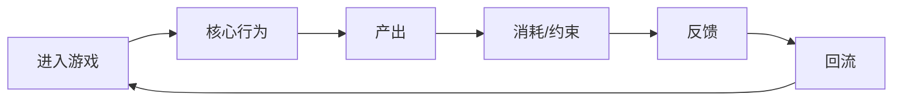
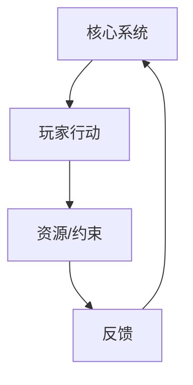

# 核心卡决斗样例 游戏拆解稿

## 元信息

- 状态：Research / Prototype Lab
- 拆解范围：图片 + 文本材料的工作流验收样例
- 最后更新：2026-06-17

## 目标问题

- 如何从一张战斗界面图和一段玩法记录中概括核心循环？
- 如何把观察转化为本项目唯一核心卡、辅助卡、费用和组合规则的设计假设？

## 拆解结论摘要

- 待根据分模块写作补写。

## 证据地图

| 证据 | 类型 | 说明 | 支撑模块 |
| --- | --- | --- | --- |
| T1: `materials.md` | text | 用结构化文本模拟视频转写、图文笔记和策划观察。 | module-2, module-3, module-4 |
| I1: `images/battle-layout.svg` | image | 样例战斗界面：核心卡固定在左侧，手牌位于底部，费用与组合提示位于中央。 | module-3, module-4, module-6 |

## 模块1：游戏核心定位、基础信息、商业大盘复盘

### 结论

待根据证据补写。

### 证据

- 材料不足。

### 对本项目的启示

- 待补写。

## 模块2：全局玩家体验与底层设计目标

### 结论

待根据证据补写。

### 证据

- T1

### 对本项目的启示

- 待补写。

## 模块3：核心玩法循环

### 结论

待根据证据补写。

### 核心循环图

### 证据

- T1
- I1

### 对本项目的启示

- 待补写。

## 模块4：全链路游戏架构拆解

### 结论

待根据证据补写。

### 系统关系图

### 证据

- T1
- I1

### 对本项目的启示

- 待补写。

## 模块5：内容与关卡体系

### 结论

待根据证据补写。

### 证据

- 材料不足。

### 对本项目的启示

- 待补写。

## 模块6：数值体系与经济资源闭环

### 结论

待根据证据补写。

### 证据

- I1

### 对本项目的启示

- 待补写。

## 模块7：叙事体系、角色 IP 与视听包装

### 结论

待根据证据补写。

### 证据

- 材料不足。

### 对本项目的启示

- 待补写。

## 模块8：优劣复盘与可落地优化方案

### 结论

待根据证据补写。

### 证据

- 材料不足。

### 对本项目的启示

- 待补写。

## 对本项目的转化

### 可借鉴结构

- 待补写。

### 可转化设计假设

- H：待补写。

### 当前状态

Research / Prototype Lab

## 未确认信息

- 待补写。
