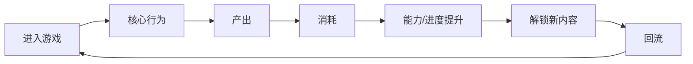
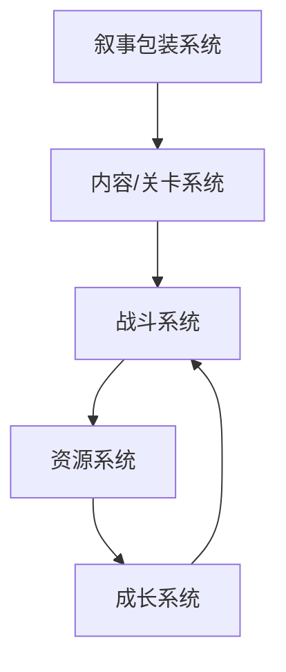

# <游戏名>游戏拆解稿

## 元信息

- 状态：Research / Prototype Lab
- 拆解范围：
- 材料来源：
- 目标问题：
- 最后更新：

## 拆解结论摘要

- 
- 
- 

## 证据地图

| 证据 | 类型 | 说明 | 支撑模块 |
| --- | --- | --- | --- |
|  | 图片 / 文本 / 转写 / 推断 |  |  |

## 模块1：游戏核心定位、基础信息、商业大盘复盘

### 核心定位

结论：

### 基础信息

| 项目 | 内容 |
| --- | --- |
| 游戏名称 |  |
| 类型标签 |  |
| 核心玩法 |  |
| 目标用户 |  |
| 变现模式 |  |

### 商业与市场表现

结论：

### 对本项目的启示

- 

## 模块2：全局玩家体验与底层设计目标

### 全链路体感

结论：

### 设计目标推断

| 目标 | 支撑设计 | 证据 | 可信度 |
| --- | --- | --- | --- |
| 留存目标 |  |  | 高 / 中 / 低 |
| 付费目标 |  |  | 高 / 中 / 低 |
| 长线活跃目标 |  |  | 高 / 中 / 低 |

### 情绪价值

- 核心情绪：
- 次级情绪：
- 主要触发方式：

### 对本项目的启示

- 

## 模块3：核心玩法循环

### 核心循环图

### 逐环节拆解

| 环节 | 玩家动作 | 系统目的 | 产出 | 消耗 | 体验反馈 | 证据 |
| --- | --- | --- | --- | --- | --- | --- |
|  |  |  |  |  |  |  |

### 对本项目的启示

- 

## 模块4：全链路游戏架构拆解

### 系统关系图

### 系统拆分

| 系统 | 核心作用 | 输入 | 输出 | 联动对象 | 证据 |
| --- | --- | --- | --- | --- | --- |
| 战斗核心 |  |  |  |  |  |
| 成长系统 |  |  |  |  |  |
| 资源系统 |  |  |  |  |  |
| 内容 / 关卡 |  |  |  |  |  |
| 叙事包装 |  |  |  |  |  |

### 对本项目的启示

- 

## 模块5：内容与关卡体系

### 内容类型盘点

| 内容类型 | 进入条件 | 单次时长 | 奖励 | 难度定位 | 留存作用 |
| --- | --- | --- | --- | --- | --- |
|  |  |  |  |  |  |

### 节奏判断

结论：

### 对本项目的启示

- 

## 模块6：数值体系与经济资源闭环

### 资源盘点

| 资源 | 类型 | 获取方式 | 消耗方式 | 风险 |
| --- | --- | --- | --- | --- |
|  | 基础 / 稀有 / 限定 / 付费 |  |  |  |

### 闭环判断

结论：

### 对本项目的启示

- 

## 模块7：叙事体系、角色 IP 与视听包装

### 世界观与剧情

结论：

### 角色与 IP 记忆点

结论：

### 美术、UI 与音频

结论：

### 对本项目的启示

- 

## 模块8：优劣复盘与可落地优化方案

### 可复用亮点

| 亮点 | 为什么有效 | 本项目可如何借鉴 |
| --- | --- | --- |
|  |  |  |

### 真实短板

| 短板 | 影响 | 证据 |
| --- | --- | --- |
|  |  |  |

### 优化方案

| 问题 | 改法 | 预期改善指标 | 风险 |
| --- | --- | --- | --- |
|  |  | 留存 / 活跃 / 付费 / 转化 / 体验 |  |

## 对本项目的转化

### 可借鉴结构

- 

### 不应照搬的部分

- 

### 可转化设计假设

- H：

### 最小验证方式

- 原型范围：
- 玩家行为：
- 成功信号：
- 失败信号：

### 当前状态

Research / Design Hypothesis / Proposal Candidate / Parked

## 未确认信息

- 
