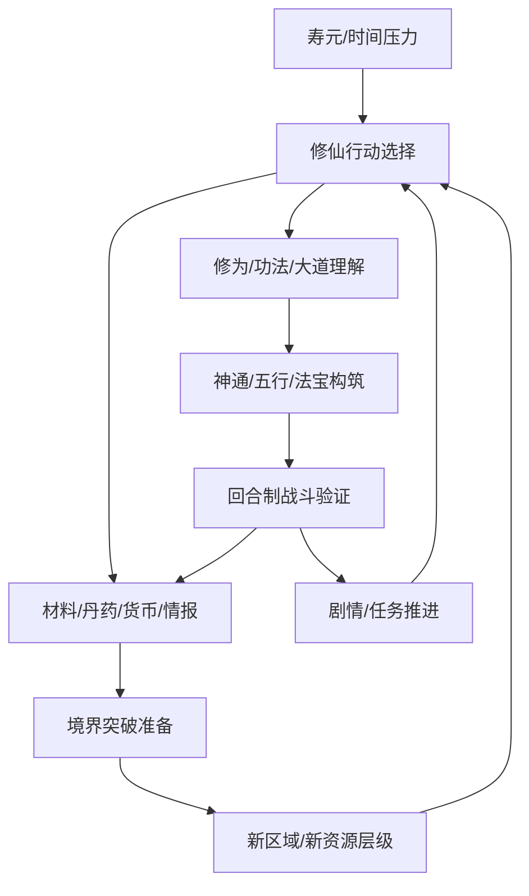

# 《觅长生》深度拆解案

## 元信息

- 状态：Research
- 拆解类型：完整深度拆解样例
- 拆解范围：核心定位、玩家体验、核心循环、系统架构、内容节奏、经济闭环、叙事包装、本项目转化
- 关联问题：修仙题材如何把“身份、构筑、资源压力、长期目标”绑定成稳定循环；哪些结构可迁移到唯一核心卡回合制卡牌对战
- 主要资料来源：
  - Steam 商店页：https://store.steampowered.com/app/1189490/
  - SteamDB 1.0 更新记录：https://steamdb.info/patchnotes/10312227/
  - SteamCharts 玩家在线数据：https://steamcharts.com/app/1189490
  - GameRevenueData 商业估算：https://gamerevenuedata.com/games/untitled-cd7b3d42/
  - 本地样例：`assets/游戏拆解--觅长生.docx`
- 质量记录：
  - 初评：`research/08-analysis-quality-system/reviews/R-2026-05-31-mi-chang-sheng-initial.md`
  - 迭代：`research/08-analysis-quality-system/iteration-logs/I-2026-05-31-mi-chang-sheng.md`
  - 复评：`research/08-analysis-quality-system/reviews/R-2026-05-31-mi-chang-sheng-final.md`
- 最后更新：2026-05-31

## 拆解结论摘要

- 《觅长生》的关键价值不是“修仙题材 + 卡牌战斗”的简单相加，而是把修仙小说中的境界、寿元、功法、丹药、奇遇、宗门、NPC 关系逐一落成可操作系统，让题材认知直接变成玩家决策。
- 它的核心循环由“时间/寿元压力 -> 行为选择 -> 资源与功法产出 -> 战力提升 -> 境界突破 -> 新区域与新事件”构成，长期目标明确，短期行为有足够自由度。
- 战斗系统的亮点在于把五行灵气、神通、功法、法宝和大道理解连接成构筑空间；玩家不是只堆数值，而是在战前路线和战中出牌之间建立身份。
- 最大风险也来自系统密度：新手认知负担高、信息展示压力大、中后期重复行为容易变成材料和时间管理，而不是持续产生新鲜策略。
- 对本项目最重要的启示是：唯一核心卡不能只是一张强卡，它必须像《觅长生》的“修仙路线”一样，成为长期身份、构筑倾向、资源取舍和战斗表达的统一中心。

## 模块1：游戏核心定位、基础信息、商业大盘复盘

### 基础信息

| 项目 | 内容 |
| --- | --- |
| 游戏名称 | 觅长生 |
| 开发 / 发行 | Chalcedony Network |
| 上线时间 | Steam 商店页显示 2019-11-26；1.0 正式版于 2023-01-13 发布 |
| 平台 | PC / Steam |
| 类型标签 | 修仙、开放世界、RPG、策略、回合制战斗、卡牌构筑、单机 |
| 核心玩法 | 修仙人生模拟 + 开放世界探索 + 境界成长 + 五行灵气卡牌战斗 |
| 目标用户 | 修仙网文读者、国产单机玩家、慢节奏 RPG 玩家、卡牌构筑和策略战斗玩家 |
| 变现模式 | 买断制本体 + 原声带 DLC；Steam 创意工坊支持 |

### 核心定位

结论：《觅长生》定位为“可玩的修仙小说”，不是用修仙包装传统 RPG，而是把修仙题材中的核心概念系统化：修为决定阶段，寿元制造长期压力，功法和神通决定战斗表达，丹药和法宝承担准备成本，NPC 和奇遇补足世界活性。

它的市场差异化来自两个方向：

- 题材还原：境界、灵根、寿元、闭关、丹药、法宝、宗门、奇遇等修仙小说概念都能被玩家操作。
- 策略结构：战斗不是动作操作，而是围绕五行灵气和神通组合形成的回合制策略。

对目标用户来说，这款游戏满足的不是短平快爽感，而是“我真的在经营一段修仙人生”的代入感。玩家愿意接受较高学习成本，是因为系统词汇和修仙文化预期高度一致。

### 商业与市场表现

结论：《觅长生》属于国产独立游戏中的长尾型成功案例，公开数据支持其在 Steam 上有稳定口碑和长期玩家留存。

| 结论 | 证据来源 | 可信度 | 说明 |
| --- | --- | --- | --- |
| 游戏为 PC / Steam 买断制产品，开发发行方为 Chalcedony Network | Steam 商店页 | 官方页面 | 可确认产品基本信息、标签、DLC 与创意工坊入口 |
| 1.0 正式版在 2023-01-13 发布 | SteamDB 1.0 更新记录 | 第三方记录 Steam 更新 | 可确认正式版发布时间和“主流程完成”的版本节点 |
| 正式发布多年后仍有长尾活跃 | SteamCharts | 第三方统计 | 可观察在线趋势，但不等同于总玩家规模 |
| 销量约 150-160 万份、评价约 93% | GameRevenueData | 第三方估算 | 只能作为商业量级参考，不能视为官方披露 |

这些数据共同支持一个判断：《觅长生》不是短期热度型产品，而是通过题材深度、系统研究空间和社区长尾形成持续生命力。对本报告来说，商业数据的作用不是证明它“绝对成功”，而是说明这类高学习成本、强系统密度的独立 RPG 确实存在稳定受众。

### 对本项目的启示

- 买断制单机与本项目可能的长线卡牌对战商业模型不同，但《觅长生》证明了“高概念密度 + 强题材绑定 + 策略构筑”可以支撑玩家长期研究。
- 本项目若强调唯一核心卡，需要让核心卡承担“身份中心”的价值，而不是只承担局内战斗强度。

## 模块2：全局玩家体验与底层设计目标

### 全链路体感

结论：《觅长生》的体验链路是从“理解修仙规则”进入“规划人生路线”，再通过战斗、探索和突破不断确认玩家选择。

| 阶段 | 玩家体感 | 系统作用 |
| --- | --- | --- |
| 首次进入 | 题材词汇密度高，玩家需要理解境界、灵根、寿元、功法 | 建立修仙世界的真实性 |
| 新手阶段 | 从低境界开始积累资源，学习基础战斗和修炼规则 | 让玩家接受“修仙不是立刻变强，而是长期规划” |
| 日常游玩 | 在修炼、探索、炼丹、交易、任务、战斗之间分配时间 | 用自由选择制造人生经营感 |
| 中期推进 | 为突破境界准备丹药、功法、法宝和战斗能力 | 把长期目标拆成多个可执行准备项 |
| 长线留存 | 追求更高境界、流派成型、剧情支线、隐藏资源 | 用构筑和探索延长研究空间 |

### 设计目标推断

| 目标 | 支撑设计 | 证据 |
| --- | --- | --- |
| 强留存目标 | 境界递进、寿元压力、NPC 关系、奇遇与区域解锁 | 玩家总有下一次突破、下一本功法、下一片区域 |
| 高完成度目标 | 大量修仙概念被系统化，而不是只作为文本包装 | 官方商店页和 1.0 更新均强调真实修仙世界与主要流程完成 |
| 长线研究目标 | 五行灵气、功法、神通、法宝、大道理解形成复杂搭配 | 玩家会围绕流派和战斗路线持续优化 |

### 情绪价值

- 核心情绪：修仙代入感、长期成长感、路线成型后的掌控感。
- 次级情绪：奇遇惊喜、突破紧张、战斗构筑成功后的策略爽感。
- 主要触发方式：境界突破、流派成型、稀有资源获取、剧情和 NPC 关系推进。

### 对本项目的启示

- “身份”要通过反复决策被确认。《觅长生》的玩家身份不是开局标签，而是在每次修炼、探索、战斗和突破中被重新确认。
- 本项目的核心卡也应不断参与玩家选择：构筑时决定路线，战斗中决定解释辅助卡的方式，赛季环境中决定适应成本。

## 模块3：核心玩法循环

### 核心循环图

### 逐环节拆解

| 环节 | 玩家动作 | 系统目的 | 产出 | 消耗 | 体验反馈 |
| --- | --- | --- | --- | --- | --- |
| 阶段进入 | 到达当前境界或新区域 | 明确阶段目标 | 新任务、新敌人、新资源 | 无或少量引导成本 | 世界变大 |
| 行动选择 | 修炼、炼丹、探索、战斗、社交 | 提供自由度与路线差异 | 行为路径 | 时间、寿元、道具 | “我在安排修仙人生” |
| 资源积累 | 获取材料、功法、丹药、法宝 | 支撑成长和突破 | 战力与准备度 | 时间、战斗风险 | 成长可见 |
| 构筑调整 | 配置神通、功法、装备和路线 | 形成战斗身份 | 流派成型 | 学习成本、资源成本 | 策略掌控 |
| 战斗验证 | 用回合制五行灵气战斗检验配置 | 证明成长有效 | 胜利、战利品、剧情推进 | 丹药、血量、失败风险 | 构筑爽感 |
| 境界突破 | 满足条件后挑战突破 | 长线目标兑现 | 新境界、新内容 | 前置准备、失败风险 | 强节点反馈 |
| 内容回流 | 新区域、新 NPC、新资源打开 | 重启下一阶段循环 | 新目标 | 新学习成本 | 继续探索动机 |

### 节奏分析

结论：循环的强点在于“大目标明确、小行为自由”。境界突破给玩家提供清晰的长期目标，而日常行动的选择空间让玩家感觉不是在重复刷清单。

节奏压力主要来自三类成本：

- 时间成本：修炼、赶路、闭关都会推进时间。
- 寿元压力：时间不是纯资源，而是死亡倒计时。
- 准备成本：突破和高难战斗需要前置丹药、功法、战斗构筑。

这种压力让玩家的每个行为都有机会成本。它避免了开放世界 RPG 常见的“想做什么都行，但做什么都不重要”的松散感。

### 具体玩家路径样例：练气期到首次突破

以一名练气期玩家为例，完整路径可以拆成：

1. 玩家先通过新手任务理解基础移动、修炼和战斗，获得初始功法、神通或基础资源。
2. 玩家发现直接挑战更强敌人风险较高，于是转向修炼、采集、购买或炼制突破所需材料。
3. 修炼会提升修为，但消耗时间；采集和探索能获得材料，但可能触发战斗或事件；炼丹能提高突破准备度，但需要前置材料和配方理解。
4. 玩家根据已获得的功法和神通调整战斗配置，尝试形成更稳定的五行灵气使用路线。
5. 当修为、丹药、战斗能力和风险承受度都达到门槛后，玩家进行突破。
6. 突破成功后，新的境界打开更高层资源、敌人和剧情，旧阶段循环结束，新阶段循环启动。

这个样例体现了《觅长生》的设计因果：新手期不是单纯教系统，而是让玩家体验“修仙行动都要花时间，而时间会压迫突破规划”。玩家第一次理解这点后，后续每个阶段都会自然复用同一套判断框架。

### 创新点

- 把“时间”做成修仙题材的核心资源，而不是普通日历装饰。
- 把战斗构筑与修仙设定绑定：神通、五行、功法、法宝不是孤立数值，而是共同解释战斗路线。
- 把境界突破做成阶段门槛，让长期成长有明确节点，而不是无限堆等级。

### 对本项目的启示

- 本项目可以借鉴“阶段目标 + 自由构筑”的节奏：核心卡给出长期身份，辅助卡和组合规则提供短期调整。
- 费用系统如果只限制出牌会偏薄；它可以进一步承担“时间/机会成本”的角色，让玩家感到每次组合发动都在牺牲另一个可能性。

## 模块4：全链路游戏架构拆解

### 系统关系图

### 系统拆分

| 系统 | 核心作用 | 输入 | 输出 | 联动对象 | 创新点 |
| --- | --- | --- | --- | --- | --- |
| 境界 / 成长 | 定义长期阶段和实力门槛 | 修为、丹药、功法、突破条件 | 新境界、新内容层级 | 战斗、探索、资源 | 用境界替代普通等级，使成长符合修仙认知 |
| 战斗核心 | 验证玩家构筑和资源准备 | 神通、灵气、功法、法宝、敌人机制 | 胜负、战利品、剧情推进 | 成长、资源、内容 | 五行灵气让出牌顺序和资源匹配成为策略 |
| 资源系统 | 支撑炼丹、炼器、交易、突破 | 探索、战斗、采集、商店 | 丹药、法宝、货币、材料 | 成长、战斗、探索 | 资源用途与修仙行为强绑定 |
| 探索 / 地图 | 提供材料、奇遇和剧情入口 | 时间、移动、战斗能力 | 新事件、稀有材料、NPC 关系 | 资源、叙事、战斗 | 开放世界服务修仙历练，而非只扩地图 |
| 剧情叙事包装 | 提供身份代入和世界可信度 | 境界、NPC、任务选择 | 情绪、动机、世界理解 | 探索、成长、社交 | 修仙小说语汇降低系统学习的陌生感 |
| NPC / 社交 | 构成活世界和角色关系 | 时间、选择、好感、事件 | 信息、任务、资源、关系变化 | 叙事、探索、成长 | 社交不是聊天功能，而是修仙世界生态的一部分 |

### 系统联动判断

结论：《觅长生》的系统不是并列堆叠，而是围绕“修仙人生”形成多层反馈。寿元限制行动，行动带来资源和修为，资源与修为共同服务突破，突破解锁新的行动空间。

这套结构能成立的关键是：绝大多数系统都能回到同一个长期问题上，即“我如何在有限寿元内突破到更高境界”。因此即使系统多，玩家仍能理解它们为什么存在。

### 资源流向细表

| 流向 | 输入 | 中间动作 | 输出 | 设计目的 |
| --- | --- | --- | --- | --- |
| 时间 -> 修为 | 寿元 / 时间 | 修炼、闭关、丹药辅助 | 修为、小境界推进 | 让成长有长期成本 |
| 时间 -> 材料 | 寿元 / 时间、移动成本 | 探索、采集、任务、战斗 | 药材、矿物、战利品 | 让开放世界服务突破准备 |
| 材料 -> 丹药 / 法宝 | 药材、矿物、配方 | 炼丹、炼器、交易 | 突破丹药、战斗道具、装备 | 把资源链转成阶段目标 |
| 功法 / 神通 -> 战斗路线 | 学习机会、门派、任务、NPC | 配置与升级 | 五行流派、战斗节奏 | 让玩家形成可辨识构筑身份 |
| 战斗 -> 资源 / 剧情 | 战斗能力、消耗品 | 回合制对抗 | 战利品、任务推进、新敌人 | 验证构筑并回补成长资源 |
| 突破 -> 新层级 | 修为、丹药、战力、风险承受 | 境界突破 | 新区域、新资源、新剧情 | 重置目标层级，延长循环 |

这张表说明，《觅长生》的“资源”并不只是货币或材料，而是一组互相转换的压力：时间会变成修为或材料，材料会变成准备度，准备度会在突破或战斗中被检验。系统联动的清晰度来自这些流向都能被玩家解释为“修仙准备”。

### 对本项目的启示

- 本项目也需要一个能吸纳多系统的中心问题。建议表述为：“我如何围绕这张唯一核心卡，在费用、辅助卡和组合规则变化中维持自己的战斗身份？”
- 如果某个新系统不能回答这个中心问题，就应先留在研究或暂缓区，而不是进入第一阶段原型。

## 模块5：内容与关卡体系

### 内容类型盘点

| 内容类型 | 进入条件 | 单次时长 | 奖励 | 难度定位 | 留存作用 |
| --- | --- | --- | --- | --- | --- |
| 新手内容 | 初始境界和基础任务 | 短 | 基础功法、材料、规则理解 | 低 | 让玩家理解修仙行动如何影响成长 |
| 日常内容 | 任意阶段可反复进行 | 中 | 修为、材料、货币、关系推进 | 低到中 | 填充阶段准备过程 |
| 秘境 / 探索 | 区域或实力门槛 | 中到长 | 稀有材料、剧情、敌人挑战 | 中到高 | 提供突破准备和惊喜 |
| 高难战斗 | 流派和资源准备成熟 | 中 | 稀有战利品、进度推进 | 高 | 检验构筑和阶段成长 |
| 境界突破 | 条件满足 | 中 | 新阶段、新内容层级 | 高 | 长期目标兑现 |

### 难度曲线

结论：难度曲线采用“阶段门槛式递进”。每个境界内，玩家从基础行动开始积累，再逐步进入更高风险内容；境界突破相当于阶段考试，突破后再进入新的资源和敌人层级。

这种结构的优点是目标清楚，缺点是中后期若准备过程重复，玩家可能感到“为了突破而刷材料”。因此高质量的阶段内容需要持续引入新敌人机制、新资源关系或新剧情变量。

### 内容架构判定

- 渐进式：境界和区域逐步解锁，是主要骨架。
- 分布式：探索、NPC、支线、宗门和交易构成多个并行目标。
- 重载式：作为单机买断制游戏，赛季和周期刷新不是主结构。

### 对本项目的启示

- 第一阶段卡牌原型可以采用轻量“阶段门槛”：先让玩家围绕核心卡打出基础组合，再逐步引入响应、反制和动态环境规则。
- 不建议一开始引入大地图式内容填充；对当前项目更重要的是验证战斗循环和组合身份是否成立。

## 模块6：数值体系与经济资源闭环

### 资源盘点

| 资源 | 类型 | 获取方式 | 消耗方式 | 回收方式 | 风险 |
| --- | --- | --- | --- | --- | --- |
| 寿元 / 时间 | 基础约束资源 | 初始设定、境界提升间接延长 | 修炼、移动、闭关、事件推进 | 无直接回收 | 压力过强会让玩家不敢探索 |
| 修为 | 成长资源 | 修炼、丹药、事件 | 小境界提升、突破准备 | 无 | 若获取重复会变成刷条 |
| 丹药 / 材料 | 消耗与准备资源 | 采集、探索、交易、战斗 | 突破、战斗、炼制 | 交易或转换 | 材料链过长会造成疲劳 |
| 功法 / 神通 | 构筑资源 | 宗门、探索、NPC、任务 | 战斗配置和路线形成 | 替换、学习成本沉没 | 信息密度高，选择焦虑 |
| 货币 | 通用交换资源 | 交易、任务、战斗 | 购买材料、功法、道具 | 交易流通 | 若可替代一切，会削弱探索价值 |

### 产出、消耗、回收

结论：《觅长生》的经济闭环不是典型服务型游戏的“日常产出 -> 商店消耗 -> 活动回收”，而是单机 RPG 的“行为产出 -> 阶段准备 -> 突破消耗 -> 新层级产出”。它的核心消耗口是突破、战斗准备和路线试错。

最有设计价值的是寿元/时间：它让玩家不能无限免费试错。即使没有复杂付费系统，时间压力也能制造经济感。

### 成长曲线判断

《觅长生》的成长曲线可以理解为三层叠加：

| 曲线 | 作用 | 健康状态 | 风险状态 |
| --- | --- | --- | --- |
| 境界曲线 | 提供长期阶段目标 | 玩家清楚下一次突破要准备什么 | 突破材料或条件过散，目标变成查表 |
| 构筑曲线 | 提供战斗研究空间 | 玩家能从功法、神通、灵气关系中形成路线 | 路线信息不透明，玩家只照攻略抄配置 |
| 资源曲线 | 控制准备节奏 | 日常、探索、战斗都能贡献准备度 | 某资源短缺导致重复刷取，或货币可替代一切 |

最健康的状态是：玩家为了突破而准备，但准备过程本身也产生选择和发现。最危险的状态是：突破目标清楚，但中间过程变成重复刷材料，战斗构筑只作为通过门槛的工具。

### 资源溢出与短缺风险

- 寿元过紧：玩家会规避探索和试错，开放世界自由度下降。
- 寿元过松：时间压力消失，修仙题材的“与天争寿”失去系统意义。
- 材料过散：玩家必须频繁查询来源，阶段目标被资料检索替代。
- 货币过强：如果购买能替代探索、炼制和战斗，多个系统会失去存在感。
- 功法/神通信息过密：构筑深度会从策略乐趣变成理解负担。

这些风险不是独立问题，而是会相互传导：材料短缺会迫使重复探索，重复探索会放大寿元压力，寿元压力又会降低流派试错意愿。

### 成长曲线与付费关系

结论：作为买断制游戏，《觅长生》没有强付费数值卡点。它的成长曲线主要靠境界、资源门槛和构筑复杂度控制。对玩家而言，核心问题不是“要不要付费过关”，而是“我是否理解这套修仙系统并做了足够准备”。

### 对本项目的启示

- 本项目的费用系统可参考“寿元/时间”的设计功能：费用不只是每回合能量，还可以表达机会成本和路线承诺。
- 核心卡交易或稀缺性不能直接转成战斗数值优势，否则会破坏“理解与组合”带来的公平策略感。

## 模块7：叙事体系、角色 IP 与视听包装

### 世界观与剧情

结论：《觅长生》的叙事优势在于系统和世界观互相解释。修仙世界不是背景板，而是所有资源和行为的意义来源。玩家理解“闭关为什么耗时”“突破为什么有风险”“丹药为什么重要”，是因为这些概念已经存在于修仙文化经验中。

这种叙事服务玩法的方式有三层：

- 词汇层：境界、灵根、功法、丹药、法宝、寿元等词本身就携带规则预期，降低系统解释成本。
- 目标层：修仙叙事天然包含“突破”“长生”“机缘”“劫难”，这些词可以直接转化为阶段目标和风险事件。
- 选择层：玩家不是在做抽象任务，而是在做“闭关、历练、炼丹、论道、交易、斗法”等题材行为，行为本身带有角色扮演意义。

### 角色与 IP 记忆点

结论：角色和 NPC 的作用不是单纯提供剧情，而是让开放世界有“同道之人”的感觉。对修仙题材而言，NPC 关系、宗门、论道、敌对和交易都能加强玩家正在世界中修行的感受。

NPC 的设计价值主要体现在：

- 信息入口：玩家通过 NPC 获得任务、功法、资源线索和世界状态。
- 关系压力：玩家不只面对怪物，也面对其他修士、宗门关系和利益选择。
- 世界活性：NPC 让修仙世界不只是资源地图，而像一个有行动主体的环境。

### 美术、UI 与音频

结论：视觉表现并非《觅长生》的主要商业卖点，但国风手绘、水墨式场景和修仙语汇共同降低了抽象系统的理解成本。UI 的挑战在于系统复杂度高，需要在信息密度和可读性之间平衡。

对这种高系统密度游戏来说，UI 的核心任务不是装饰，而是把路线、条件和风险说清楚：

- 成长界面要让玩家知道当前境界、修为、突破条件和缺口。
- 构筑界面要让玩家看懂功法、神通、五行灵气和法宝之间的关系。
- 地图和任务界面要让玩家知道某次行动会消耗什么、可能产出什么、是否值得花时间。

因此它的包装价值不只在“国风好看”，而在于让大量抽象规则有题材容器。这个经验对本项目很重要：核心卡 UI 也必须解释身份、标签、可组合方向和环境变化，而不能只展示卡面和数值。

### 对本项目的启示

- 唯一核心卡如果要成为玩家身份，应有最小叙事包装：名称、视觉、机制关键词、战斗风格、与辅助卡的关系。
- 但第一阶段不应扩展完整世界观。最小目标是让核心卡的身份被玩家看懂，并在战斗中反复被确认。

## 模块8：优劣复盘与可落地优化方案

### 可复用亮点

| 亮点 | 为什么有效 | 本项目可如何借鉴 |
| --- | --- | --- |
| 题材概念系统化 | 玩家已有修仙认知，系统学习成本被题材吸收 | 核心卡机制应有清晰身份标签，让玩家能快速理解“这张卡想怎么赢” |
| 阶段目标明确 | 境界突破提供长期方向，日常行为服务准备 | 用核心卡熟练度、组合解锁或环境适应作为阶段目标 |
| 构筑与战斗互证 | 战前选择会在战斗中得到验证 | 让辅助卡配置和组合规则在局内产生明显差异 |
| 时间/寿元压力 | 每次行动有机会成本，减少无意义重复 | 费用系统承担机会成本，而不是单纯限制爆发 |
| 多系统归一 | 探索、资源、战斗、叙事都回到修仙目标 | 新系统必须回到“唯一核心卡身份与组合表达” |

### 真实短板

| 短板 | 影响 | 证据 |
| --- | --- | --- |
| 新手认知负担高 | 玩家需要同时理解修仙词汇、成长、资源和战斗 | 本地样例和系统结构均显示概念密度较高 |
| 中后期准备可能重复 | 材料和突破准备容易转化为流程化清单 | 阶段门槛式成长天然存在重复准备风险 |
| 系统信息展示压力大 | 功法、神通、丹药、法宝、NPC 关系都需要清晰 UI | 多系统联动要求高信息可读性 |
| 战斗外系统可能稀释战斗焦点 | 探索、交易、炼制过强时，战斗构筑可能变成结果展示 | 系统联动越多，核心验证点越容易分散 |

### 优化方案

| 问题 | 改法 | 改动范围 | 预期改善指标 | 风险 / 回滚信号 |
| --- | --- | --- | --- | --- |
| 新手认知负担高 | 按境界分层释放系统，每阶段只引入一个新核心概念，并在首次突破前只保留一条主推荐路线 | 新手引导、任务顺序、功法推荐 UI | 新手留存、首次突破完成率、首次流派配置完成率 | 若玩家抱怨“被强引导”或自由探索行为下降，应减少强制推荐 |
| 中后期准备重复 | 为关键材料提供 2-3 条替代路径，如战斗掉落、交易、探索事件，并让不同路径有不同风险 | 掉落表、商店、探索事件、任务奖励 | 中期留存、重复游玩满意度、材料卡点流失率 | 若替代路径成为唯一最优解，应提高路径差异成本 |
| 信息展示压力大 | 为功法/神通/资源建立路线推荐、缺口提示和冲突提示 | 构筑界面、背包、突破准备界面 | 构筑完成率、流派尝试次数、攻略依赖度下降 | 若推荐导致流派趋同，应改为提示冲突而非给唯一答案 |
| 战斗焦点被稀释 | 把关键资源和剧情节点更多绑定到战斗验证，例如通过特定敌人机制检验某类流派 | 敌人机制、关键任务、资源奖励 | 战斗参与率、流派研究深度、战斗失败后复战率 | 若休闲玩家流失，应保留非战斗替代路径但降低效率 |

## 本项目转化

### 可借鉴结构

- 核心身份结构：把唯一核心卡设计成玩家长期身份中心，而不是一次性强力单位。
- 阶段目标结构：围绕核心卡设置可验证阶段，如基础组合成立、反制窗口理解、动态环境适应。
- 机会成本结构：费用不仅限制出牌，还表达“我选择了这次组合，就放弃了其他路线”。
- 题材/机制互译结构：核心卡的视觉和关键词要解释它的战斗方式，降低组合规则学习成本。

### 应避免雷同或风险

- 不要复制修仙的完整成长、炼丹、地图和 NPC 系统；当前项目第一阶段应聚焦卡牌战斗。
- 不要把核心卡做成境界等级式数值成长，否则会削弱对战公平和组合理解。
- 不要让系统数量超过玩家能在一局战斗中感知的范围。
- 不要把动态平衡伪装成核心卡削弱；应让玩家理解变化发生在组合环境层。

### 可验证设计假设

如果让每张唯一核心卡拥有“身份标签 + 2 条基础组合路线 + 1 条受环境规则影响的高风险组合路线”，那么玩家会更愿意围绕同一张核心卡反复调整辅助卡，因为核心卡既提供稳定身份，也提供随环境变化的研究空间。

### 最小验证方式

- 制作 4 张模拟唯一核心卡。
- 每张核心卡配置 2 个稳定标签和 1 个环境标签。
- 准备 16 张通用辅助卡和 12 条组合规则。
- 让玩家完成 3 局对战后记录：
  - 是否能说出自己的核心卡“想怎么赢”。
  - 是否在第二局或第三局主动调整辅助卡。
  - 是否认为环境标签变化是新鲜挑战，而不是资产削弱。

### 下一步

- [x] 保留为产品案例
- [ ] 转入 `research/04-cross-game-comparisons/`
- [x] 转入 `research/05-design-hypotheses/`
- [ ] 转入 `game-design-workflow/idea-proposals/`
- [ ] 暂缓

## 未确认信息

- GameRevenueData 的销量和收入为第三方估算，非官方披露。
- 本报告未进行新的实机试玩，仅基于公开资料、本地样例和系统分析。
- 具体数值曲线、完整任务表和高阶战斗流派未展开，需要后续专项拆解。
