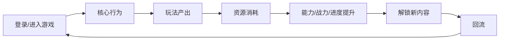
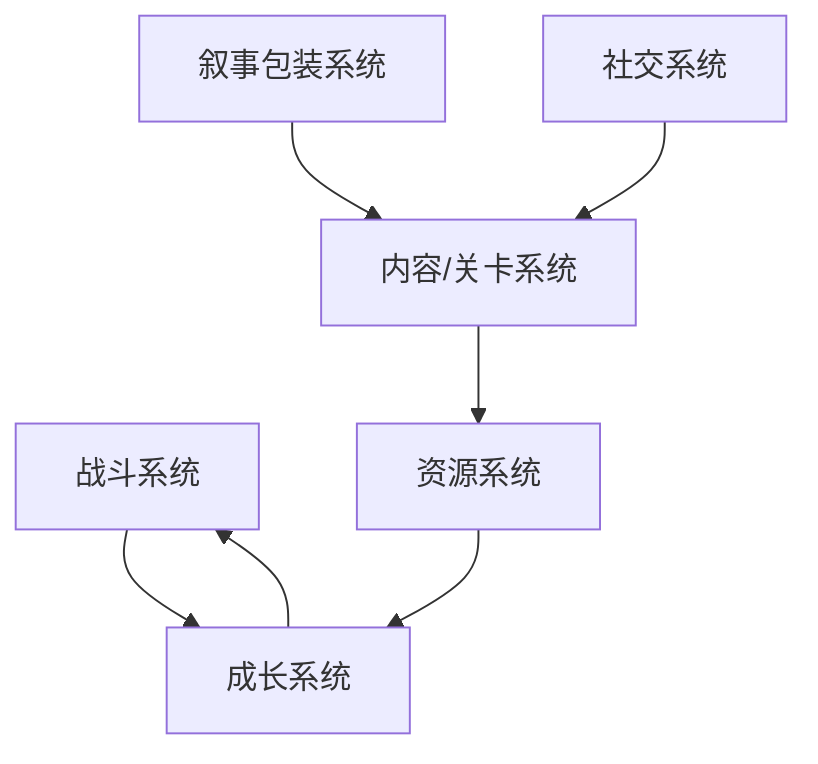

# <游戏名>深度拆解案

## 元信息

- 状态：Research
- 拆解类型：完整深度拆解 / 专项系统拆解
- 拆解范围：
- 关联问题：
- 主要资料来源：
- 最后更新：

## 拆解结论摘要

先用 3-5 条写清本次拆解最重要的结论。

- 
- 
- 

## 模块1：游戏核心定位、基础信息、商业大盘复盘

### 基础信息

| 项目 | 内容 |
| --- | --- |
| 游戏名称 |  |
| 开发 / 发行 |  |
| 上线时间 |  |
| 平台 |  |
| 类型标签 |  |
| 核心玩法 |  |
| 目标用户 |  |
| 变现模式 |  |

### 核心定位

结论：

说明这款产品主打什么玩法、满足哪类玩家需求、在同赛道中的差异化位置是什么。

### 商业与市场表现

结论：

记录可核验的销量、流水、评分、留存、社区热度或榜单表现。无法核验的数据必须标注不确定性。

### 对本项目的启示

- 

## 模块2：全局玩家体验与底层设计目标

### 全链路体感

结论：

拆解玩家从首次进入、新手引导、日常游玩、长线留存到付费转化的体验链路。

### 设计目标推断

| 目标 | 支撑设计 | 证据 |
| --- | --- | --- |
| 留存目标 |  |  |
| 付费目标 |  |  |
| 长线活跃目标 |  |  |

### 情绪价值

- 核心情绪：
- 次级情绪：
- 主要触发方式：

### 对本项目的启示

- 

## 模块3：核心玩法循环

### 核心循环图

### 逐环节拆解

| 环节 | 玩家动作 | 系统目的 | 产出 | 消耗 | 体验反馈 |
| --- | --- | --- | --- | --- | --- |
|  |  |  |  |  |  |

### 节奏分析

结论：

分析单局时长、日常负荷、阶段目标、中后期疲劳点。

### 创新点

- 

### 对本项目的启示

- 

## 模块4：全链路游戏架构拆解

### 系统关系图

### 系统拆分

| 系统 | 核心作用 | 输入 | 输出 | 联动对象 | 创新点 |
| --- | --- | --- | --- | --- | --- |
| 角色 / 战力成长 |  |  |  |  |  |
| 战斗核心 |  |  |  |  |  |
| 资源系统 |  |  |  |  |  |
| 探索 / 关卡 / 地图 |  |  |  |  |  |
| 剧情叙事包装 |  |  |  |  |  |
| 社交 / 排行 / 联动 |  |  |  |  |  |

### 对本项目的启示

- 

## 模块5：内容与关卡体系

### 内容类型盘点

| 内容类型 | 进入条件 | 单次时长 | 奖励 | 难度定位 | 留存作用 |
| --- | --- | --- | --- | --- | --- |
| 新手内容 |  |  |  |  |  |
| 日常内容 |  |  |  |  |  |
| 限时挑战 |  |  |  |  |  |
| 高难攻坚 |  |  |  |  |  |
| 赛季内容 |  |  |  |  |  |

### 难度曲线

结论：

按“入门 -> 上手 -> 熟练 -> 进阶 -> 高难”分析是否顺滑。

### 内容架构判定

- 渐进式：
- 分布式：
- 重载式：

### 对本项目的启示

- 

## 模块6：数值体系与经济资源闭环

### 资源盘点

| 资源 | 类型 | 获取方式 | 消耗方式 | 回收方式 | 风险 |
| --- | --- | --- | --- | --- | --- |
|  | 基础 / 稀有 / 限定 / 付费 |  |  |  |  |

### 产出、消耗、回收

结论：

说明资源是否形成闭环，是否存在溢出、贬值、强逼氪或免费体验断层。

### 成长曲线与付费关系

结论：

分析数值成长节奏、付费差距和商业化卡点。

### 对本项目的启示

- 

## 模块7：叙事体系、角色 IP 与视听包装

### 世界观与剧情

结论：

说明世界观完整度、剧情节奏、悬念和情绪调动方式。

### 角色与 IP 记忆点

结论：

分析角色辨识度、人设、背景故事和玩家情感连接。

### 美术、UI 与音频

结论：

分析视觉风格、界面排布、特效、音频和氛围对体验的贡献。

### 对本项目的启示

- 

## 模块8：优劣复盘与可落地优化方案

### 可复用亮点

| 亮点 | 为什么有效 | 本项目可如何借鉴 |
| --- | --- | --- |
|  |  |  |

### 真实短板

| 短板 | 影响 | 证据 |
| --- | --- | --- |
|  |  |  |

### 优化方案

| 问题 | 改法 | 预期改善指标 | 风险 |
| --- | --- | --- | --- |
|  |  | 留存 / 活跃 / 付费 / 转化 / 体验 |  |

## 本项目转化

### 可借鉴结构

- 

### 应避免雷同或风险

- 

### 可验证设计假设

如果采用 `设计选择`，那么玩家会 `可观察行为/体验变化`，因为 `机制原因`。

### 下一步

- [ ] 保留为产品案例
- [ ] 转入 `research/04-cross-game-comparisons/`
- [ ] 转入 `research/05-design-hypotheses/`
- [ ] 转入 `game-design-workflow/idea-proposals/`
- [ ] 暂缓

## 未确认信息

- 
