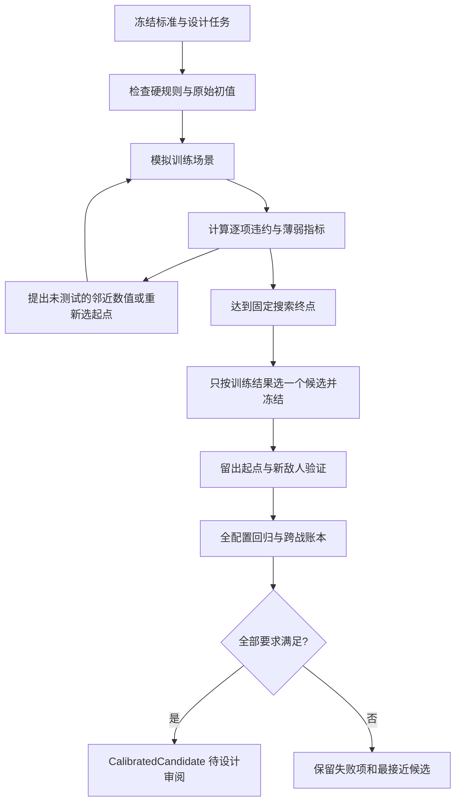

> 文档角色：HistoricalAudit / ScopedEvidence。原日期的输入、方法和结果按原版本保留；不代表现行RC1重新验证，也不自动启动实验。现行规则见[RC1](../game-design-workflow/gdd/current/README.md)，实际批次见[测试交接](test-handoff.md)。

# 自动平衡校准流程

日期：2026-09-13。状态：Workflow Candidate / Implemented / Limited Validated。CAL-2026-09-13-001/r3已产出限定任务达标候选。适用：game-002数值测试；属于测试工作流与实验合同，不是新增玩法GDD或核心采纳。

## 来源与目标

用户要求：“尝试设立自动平衡校准机制：1.先设置平衡标准，确定硬性规则；2.确定设计任务，确定临时规则；3.进行模拟实验，并根据结果自动调整最终使其符合设计任务要求”。此前已授权临时结算与初值实验，本轮继续不注册demo。

通过grill-with-docs对照[四层数值框架](../game-design-workflow/idea-materials/M-2026-09-11-numerical-evaluation-framework.md)、[数值重设计](numerical-redesign.md)及[首轮两流派报告](test-reports/TH-2026-09-13-003-r1-run-01.md)，将“平衡”收束为可测试的具体任务。自动搜索负责满足已冻结目标；不能判断真人是否觉得有趣，也不能为了交出“通过”而自行改变目标。

## 一、先固定标准与硬规则

硬规则决定候选能否进入评价。任务指标决定通过标准，评分仅帮助寻找候选，不能替代逐项验收。

| 硬规则 | 含义 | 失败处理 |
| --- | --- | --- |
| H01 参数权限 | 只调任务声明的数值与合法整数范围；其他输入保持固定 | 拒绝候选 |
| H02 机制与输入冻结 | 设计版本、临时结算、代表构筑、敌人、样本分组、目标和权重在运行前固定 | 改动须新修订，不沿用旧通过结论 |
| H03 资源约束 | 两杖、合成预算≤12、同名词≤3；不赠额外词卡或为某构筑偷偷加成 | 拒绝候选 |
| H04 账目守恒 | 生命／护甲非负，伤害、抵甲及疲劳归因独立，逐场生命守恒 | 停止并修复模拟器，不能当平衡差异 |
| H05 有限终局 | 所测所有合法配置包括风险／纯防御：普通≤80、首领≤120；截止不算正常结束 | 不放行 |
| H06 过早终局 | 正常入场代表普通12／首领18刻前不得结束 | 不放行；其他风险组仍记录警报 |
| H07 回归与统计 | 已有规则检查不能回退；失败、截止和疲劳胜利不得消失 | 不放行 |
| H08 独立验证 | 训练、留出验证、全配置硬规则回归均通过后才产出合格候选 | 失败保留，不反复更换候选试同一验证集 |

这些是本轮校准器的执行约束，其中节奏数字沿用现有候选标准，并未成为游戏最终采纳值。H05的全覆盖是本模型16种配置的有限矩阵，不代表所有未来卡组。H06本版只自动检查刻数，完整交互／真人理解仍未验收。

## 二、确定设计任务和临时规则

任务必须在第一次搜索前声明：要解决的问题、代表与反例、固定资源／敌人、可调量、禁调量、临时结算分支、训练与验证、目标区间及失败出口。空白不能默认为“通过”。

首任务为CAL-2026-09-13-001/r1：让简易连发、简易蓄势、火焰＋护甲、逆霜＋护甲四种代表，在各自节奏和损耗约束内，缩小普通场景的两流派速度差距，并承受快攻／带甲／首领预设压力。

| 设计指标 | 普通 | 快攻 | 带甲 | 首领 |
| --- | --- | --- | --- | --- |
| 获胜起点比例至少 | 75% | 65% | 75% | 60% |
| 胜利中位刻数 | 20–40 | 20–60 | 20–50 | 40–70 |
| 胜利P90刻数至多 | 60 | 70 | 65 | 90 |
| 胜利生命损耗中位至多 | 15 | 30 | 20 | 30 |
| 胜利生命损耗P90至多 | 25 | 60 | 35 | 60 |
| 疲劳致死胜局／全部胜局至多 | 5% | 10% | 10% | 10% |

玩家生命100。普通两种简易代表与两种元素代表各等权，平均胜利中位刻数的比值在0.8–1.25，平均获胜比例差≤0.15。它不等于完整EX05的无全面支配判定。零胜局的耗时／损耗分布视为未达标，不记0分。

任务阈值是本轮agent设定的实验目标。普通及首领节奏、损耗上限取自已有框架；获胜比例、疲劳依赖上限及流派差距是为校准而新增的实验要求。防御配置允许零损，不强行补穿甲来凑5%损耗下限。所有起点依事前分组保留，未剔除同刻覆盖导致的败局。

| 可自动调整 | 本轮范围 |
| --- | --- |
| 直接伤害 | 12、14、16、18、20 |
| 直接护甲 | 10、12、14、16 |
| 元素邻近施加层数 | 2、3、4 |
| 元素生成／补层 | 6、8、10、12 |
| 火焰／冰霜词卡时间 | 同时取1、2、3刻；完整冷却仍按实体词相加 |

共720个离散组合。生命、敌人强度与节奏、预算、疲劳、复诵次数、蓄势倍率等均不可调。临时规则固定沿用TH-003/base：冰冻周期增甲，逆霜替换结果；复诵一次不递归；蓄势三次后下一次×2且兑现不再计数；自然减层反向克制后取整。已知空心＋自噬储层与减层变0问题保留为诊断，不在内层搜索时改机制。

## 三、模拟、自动调整和验证

搜索顺序依实际结果调整：先原始值，再当前最好点的一维邻居；邻居已测完则以固定种子选未访问点，最终覆盖最多720点。排序先比较硬规则失败数量，再比较归一化目标违约量，其次看最弱目标余量与改动幅度。每次变化、理由和不达标项均可追溯。

训练使用已见的普通／快攻／带甲／首领，起点为{0,2,4,6,8,10}²共36对。其他85对只在选定候选后检验；另增加两个事前固定、此前未测的新敌人。过去已经看过的原场景不能冒称全新。留出验证降低对训练样本过拟合的风险，但不等于独立引擎或真人证据。

最终用16构筑×9原场景×121起点核查终局、过早警报与归因，再运行无恢复三连战账本。风险样本不强制达到正常构筑胜率，但不允许它们卡住终局或从报告消失。

## 四、自动化权限与停止条件

| 结果 | 含义 | 下一步 |
| --- | --- | --- |
| CalibratedCandidate | 训练目标、留出验证和硬规则回归均通过 | 审阅候选及玩家测试；不自动改核心或demo |
| NoFeasibleCandidateWithinBudget | 预算内未发现全部达标参数 | 输出冲突指标；全离散网格遍历完时只证明此网格无解 |
| ValidationFailed | 训练可行但验证或硬规则回归失败 | 保留差异；新修订需新验证集，不用同一集反复试候选 |
| 输入变化／模拟断言失败 | 版本或实现失效 | 中止运行，修复后新建批次 |

“不断调到满足”以任务可行为前提。不能承诺任意互相冲突的目标都有数值解。允许扩大参数域、改变临时规则、改变设计目标，但它们属于三个不同的外层决定：必须明确新版本及理由，旧失败证据保留；后两者不能悄悄混入原任务的自动调参。

## 实现与结果入口

代码与完整机器合同在[独立数值实验仓库](E:/Project/game-002-numerical-lab/CALIBRATION.md)；[首任务r1](E:/Project/game-002-numerical-lab/calibration-task.json)保留原输入，[当前r3合同](E:/Project/game-002-numerical-lab/calibration-task-r3.json)为最新实验执行权威。设计报告、当前批次状态及代码提交同步到[测试交接](test-handoff.md)和[开发索引](code-development-index.md)。本机制不跨到独立玩法探索区，也不改正式词效。

## 本轮实测与修订

[完整报告](test-reports/CAL-2026-09-13-001-r3-run-01.md)：三轮972个参数点、975659场对局；r3选定候选通过训练、1452场新敌人验证和17424场全配置硬规则回归，24项检查及三轮日志审计通过。

| 修订 | 保持不变 | 事前明确的变化 | 结果 |
| --- | --- | --- | --- |
| r1 | 上述目标与临时规则 | 首次冻结720点；36对训练起点＋85对留出，两个新敌人 | 0个训练可行点，保留失败 |
| r2 | 全部目标、机制、四原训练敌人 | 获得词时间2/3、护甲至20、脉冲至5；192点；原场景全部121起点训练，换三种新验证敌人 | 0个训练可行点；最接近仅首领蓄势71>70 |
| r3 | 全部目标、机制、四原训练敌人 | 伤害20/21/22/23/24、护甲16/18/20、脉冲4/5、补层8、元素词时间1/2、获得词时间2；60点；再换三种新验证敌人 | 18个训练可行点，选定一个后验证通过 |

每个修订内部搜索全自动。外层搜索域修订由agent读取失败项后明确设定并冻结；没有由程序自动更换目标或规则。旧验证场景不再声称未知，所有旧结果保留。r3最终参数为伤害21、护甲16、脉冲5、补层8、元素与获得词时间2；[候选包](E:/Project/game-002-numerical-lab/calibrated-candidate-r3.json)独立保存。

本次也暴露了标准的局限：普通战斗生命损耗中位降到0，说明目标只约束“不太难”，没有充分定义压力下限及防御机会成本。它符合原任务允许防御低损的条件，但下一任务应专门设计压力要求。不得因此在本轮结果后追加新门槛再声称原标准始终如此。
