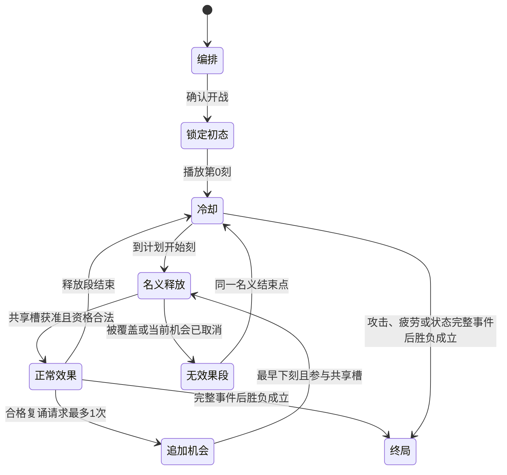

# 自动战斗、时序与状态

Project ID：game-002。文档角色：CurrentSpec。基准：RC1 / 文档整理修订 doc.1（2026-09-23）。设计选择沿CORE-001–036；体验与完整RC1验收仍Hypothesis / NotRun。

[版本与阅读入口](../baseline.md) · [GDD](../GDD.md)

## SYS-003：自动战斗与状态时序

### 4.1 设计目的与玩家承诺

- 目的：让固定配置按公开节拍可靠执行。
- 承诺：能从时间轴找到成功、覆盖、打断与无目标的不同原因。
- 支柱：支持时间／空间编排、实体成长与可推导语义；本系统的边界按下述规则及本版范围，不授予旧卡词义。

### 4.2 MDA推理

| 机制 | 预期行为 | 体验假设 | 反面信号 |
| --- | --- | --- | --- |
| 四阶段；开始槽；固定名单；完整事件胜负；一层触发；状态末处理 | 玩家根据战斗记录返回下战修正编排 | 失败有可追溯原因 | 把演出先后误当结算顺序 |

### 4.3 输入、状态与输出

| 项目 | 规格 |
| --- | --- |
| 触发与玩家输入 | 确认开战后播放、暂停、单步、倍速或查看 |
| 系统输入与前置状态 | 锁定本场配置、敌人、环境及随机输入 |
| 可观察状态 | 共同刻数、当前机会、释放段、状态身份／层数、生命／甲 |
| 正常输出与下游 | 自动结算、记录、普通胜利或失败 |
| 持久化 | 本局生命／领取库存／金币／已确认选择保留；战场状态与计数战终清理，按UX保存各决策边界 |

### 4.4 核心规则

| 规则ID | 前置与事件 | 顺序／公式／状态变化 | 玩家反馈 |
| --- | --- | --- | --- |
| SYS-003-R01 | 满足本表输入及前置条件 | 四阶段；开始槽；固定名单；完整事件胜负；一层触发；状态末处理；逐条展开见[完整规格](03-combat.md) | 自动结算、记录、普通胜利或失败；适用数量、原因与来源可查 |

### 4.5 成本、限制与取舍

受实际生命伤害损失本次冷却机会；观察不改配置。战前未提交的配置可反复编辑；进入路线、交易、领取和开战后的结果依保存边界保留，不以退出撤销。自动战斗中不能通过查看界面改变计划。

### 4.6 失败、取消与玩法异常

取消不回滚／不复活；同亡失败；无目标进入后续周期但不成功。失败原因须区分配置非法、无匹配、对象失效、材料不足、结果0、被覆盖、被打断与规则禁止。对应阶段允许修复的仅修复该输入；已完成合法结果不回滚，不自动退款或补替代目标。

### 4.7 交互、信息与反馈

| 时点 | 需知信息／可做动作 | 表达 |
| --- | --- | --- |
| 行动前 | 锁定本场配置、敌人、环境及随机输入；确认开战后播放、暂停、单步、倍速或查看 | 文字与图形展示合法性、选择范围和代价；键鼠路径等价 |
| 行动中 | 共同刻数、当前机会、释放段、状态身份／层数、生命／甲 | 焦点、当前对象、计数或过程高亮；音效可静音 |
| 结算时 | 自动结算、记录、普通胜利或失败 | 量值变化与独立原因标签；错误不能只靠颜色或音效 |
| 结果后 | 查来源／事件或按允许流程调整下一步 | 状态详情和记录保留因果；强动效可减弱，不改变规则 |

### 4.8 正例与反例

- Given满足本系统前置，When执行例中操作，Then：伤害完全由甲承担，当前冷却继续。
- 边界：完成冷却后本刻受生命伤害，改到下刻的机会仍取消。

### 4.9 系统验收标准

- 规则：按上述正例复现唯一结果，按反例拒绝越权或替代，不破坏实体、名单、时序、存续与保存不变量；结果与原因一致。
- 体验：U04／U05：区分失败原因并预测刻末状态。记录玩家操作和原话，再判断是否理解；把演出先后误当结算顺序为失败信号。
- 方法／样本：局部规则场景逐项核对；玩家研究至少5位未接触本版的新玩家，各适用U任务至少4/5独立完成。此处是未来验收，不表示已经通过。

### 4.10 未知项与依赖

| 项目 | 状态 | 影响与负责人 | 解决方式／时点 |
| --- | --- | --- | --- |
| 本页规则与内容输入 | Accepted | 主设计；依赖[详细规格](03-combat.md)及CG／PG／EG／RG／UX | RC1固定，变更按规则ID追踪 |
| 目标行为是否成立 | Hypothesis | 主设计／玩家研究；影响是否保留本机制与初值 | 按4.9任务取得证据，首轮当前版本玩家验收时复审 |
| 成品表现是否满足阅读合同 | Unknown | UI／美术／音频；不改变规则即可修正呈现 | 按UX功能信息验收，内容制作交接后、首版体验验收前关闭 |

## CG-R01：主动与消散爆炸的范围

主动爆裂的目标范围是操控杖本次允许范围，装借位镜时按其以执行元素为中心的同形范围。爆裂的所附消散爆炸采用元素死亡前位置的正交邻近，只伤其中敌人，不借用创建杖的远端范围或临时寻找新锚点。两者的固定名单、支付和一层触发各自独立；消散范围在本次CG裁决中明确，RC共同事件规则继续适用。

## CG-R02：反刺的攻击者与范围

反刺取得伤害事件已记录的实际攻击来源身份，不另选最近或首个敌人；该来源须仍存在且能承受伤害。反刺不检查创建护甲法杖的棋盘范围，只按这项明确的回击来源权限作用；不把对来源的权限扩展为所有法术无限距离。来源是已消失的对象、无伤害承受能力的环境／元素或无法追溯的伤害时，本次反刺没有合法目标，也不改打该来源的创建者。按RC06，派生伤害不会再触发反刺。此为已采用的反刺专属范围权限。

## CG-S01：元素执行与状态归属

分清三份归属：完整法术属于操控杖；真实执行者是被选元素；元素及其施加状态的持久来源沿元素创建杖。玩家直接施加的新状态属于实际施法杖；元素自动邻近、被触发邻近或显式倾注所创建的新状态，都记录源元素及其创建杖。后补层只改量，按RC04不重写首次来源。场景中立元素没有创建杖，不获得任何本杖来源特性。

据此，本句替换、借位、破甲回环、留痕、融冰等按正在施法的杖；空心等元素生成特性、指令、返甲按元素创建杖；同享、逆霜、余烬、蚀甲按新状态建立时记录的来源，之后固定。蚀甲还要求确有仍存在的源火焰，释放回退直接施加而没有本体来源时不补给其他火焰。

止界针适用于该来源杖直接释放回退的元素状态施加，以及其所创建元素的自动、触发、倾注施加；只在入量遇到异种时弃余量，旧态清空后仍不能靠别根正在覆盖的杖补生来绕过。无旧态或同种施加不受这条弃余量限制。他杖命令倾注产生的新状态同样按源元素及创建杖确定持久来源。

## CG-T01：“完成冷却”的当刻窗口

沿R23／GR02：把目标当前机会的释放开始改到下一刻，冷却区间仍为[s,u')，本刻仍可能被随后生命伤害打断；取消标记不会被完成清除。卡面说明改为“所选冷却：下刻尝试释放”，避免“立刻就绪”让玩家误解为当刻免打断。目标原本就将在下刻释放时是合法零改期，按既有合法零值规则计成功一次，不额外制造机会。

不另设免打断的就绪等待状态；“完成”只修改当前机会的释放开始刻。

## 新版卡池共同规则 RC01–12

依据：G002-CORE-019，[RC采纳素材](../../../idea-materials/M-2026-09-13-card-pool-rule-rulings.md)。2026-09-13用户“按推荐稿确认”，下列局部规则已生效；参数、未涉及的BF／IN-C／FAT-C不随之整体采纳，首版选择按后续G002-SCOPE-003。

### RC01 回响：给下一条其他简易法术

对应K01。

回响由玩家持有，只有“有／无”，不叠加。下一条不产生回响的普通简易法术成功时消耗，令该法术追加一次完整复诵；复诵本身不消费回响。“获得回响”不会自用刚得到的许可。即使已有其他复诵来源，本次仍消费并合并成一次；追加被覆盖不返还。回响保留至使用或战斗结束，不新增独立时长。

### RC02 复诵：一次追加，不改变正常节拍

对应K02。

同一次完整法术最多追加一次，回响、形容词、镶嵌等请求合并；复诵不再触发任何复诵。追加从原释放段结束时起尝试，且不得早于原开始的下一刻；追加没有冷却，但保留完整释放时长，重新建立自己的直接名单并竞争共享槽。

正常循环不顺延；同杖追加与正常机会同刻时，追加优先，正常本次落空，下一周期保持。每杖最多一份待追加机会，重复请求不存多份；被其他法杖覆盖的追加直接失去，不排队重试。可正常产生伤害、状态及蓄势成功计次。

### RC03 蓄势：强化一次完整攻防结果；跳冷却不储存多次

对应K03。

满蓄势保留到本杖下一次产生实际直接伤害或直接护甲收益的完整法术，强化该法术的这些结果；同句两种都有则都强化。先完成结果替换，再判断强化适用性。全无实际攻防收益则保留；首次兑现的整条法术不再次积累，未兑现时已满不继续堆计数。施加元素／状态层数及未来跳伤不算本次直接攻防。

耗印芯每杖只保留一次“下次正常循环跳冷却”；多目标／多次耗印不储存更多份。该正常机会排定时消费标志，若随后被覆盖也不返还。复诵不消费这份标志，复诵实际耗印仍可为后续正常循环获得标志。所有计数战后清理。

### RC04 同种合并：先来定性质，后来只加量

对应K04。

每个元素本体、状态实例保留创建时的来源与持久特性。后来同种施加只增加数量和规则允许的时长，不覆盖来源或叠加新的持久能力；完全清空后重建才重新确定。各次新增量仍各自计算源方数值修正，不追溯重算旧量，不按来源拆分并行层数。

因此，普通冰冻先存在，逆霜来源再加层仍是增甲；逆霜先存在，普通来源加层仍是伤害。反刺护甲先存在，普通护甲加入后全部沿反刺；普通护甲先存在，后来加入反刺护甲不把旧状态改造为反刺。要换性质，先清空再重建。

元素所属法杖固定为创建它的法杖；其自动邻近产生的状态继承该法杖及源元素身份。给他杖元素补层不会夺取它；同享、逆霜、余烬与蚀甲按状态首次来源判断。状态源元素已消失时蚀甲不补给同名新生元素。

操控法术本身仍属于正在释放它的法杖。本版“本杖元素”专指本杖创建的元素；指令芯按该元素的任意合法操控响应，返甲镜限该所属元素的合格直接伤害，不要求伤害指令也来自生成杖。借位镜等修改本次法术的规则则看执行法杖。使用他杖元素是合法引用问题，不自动转移持久镶嵌能力。

### RC05 结果替换：一次替换，冲突配装互斥

对应K05。

双律环与攻守转盘不可装在同一根法杖上。同一直接结果只替换一次，原结果不再发生；原法术仍检查其对象和成本，不能在原本无合法对象时凭空获得替换收益。

双律环卡面明确新增本地权限：“伤敌改护己；护己改为伤害范围内首个敌人。”护甲转伤害所需敌人由镶嵌在完整法术开始时，按本杖范围与公开单位顺序绑定一个；不要求额外敌人词卡，不在过程中补位。此项是本次采纳的局部选敌权限扩展，不扩为所有法术的默认。没有合法转换目标，本项无收益、不恢复原结果。

攻守转盘在每个原始直接伤敌结果结算前检查玩家护甲；无甲改为玩家得甲，有甲正常伤敌。因此多目标时，前一目标已给玩家甲，后续目标可能恢复伤害。多个原始敌人结果转护甲时按原有逐目标结构处理，不无故增加额外次数。

### RC06 触发效果：原事件后立即结算，只接一层

对应K06。

原完整事件先结算并检查胜负；战斗继续时，立即处理该事件产生的触发效果，不另等下一刻。触发效果的结果不再触发其他特殊效果；基础护甲抵伤、生命变化、状态清除和归零消散仍执行。每件特效对同一目标、同一原事件至多一次。

同批采用原效果顺序，修饰词从左到右，镶嵌按公开固定装配顺序；每个完整触发结果后仍检查胜负。不同主事件独立处理。由触发产生的状态在以后刻末的正常周期属于新主事件，可以正常触发；追加的完整复诵也属于新主事件，但受RC02禁止再复诵约束。

这意味着反刺不会引出另一轮反刺，蚀甲的补层不会触发应激，返甲不会再引出特殊得甲效果。普通状态本刻的效果处理后，先处理其触发批次，再按ST规则处理本状态自然衰减／到期。新状态是否本刻触发仍遵ST02，不因即时触发队列插入当前状态名单。

在本版S2／E3范围，RC06取代GR07-C01的“同阶段派生延后”候选，采用已确认的一层即时触发；范围外的新内容仍须明示事件规则。

### RC07 元素：持续释放逐刻检查，自动邻近在环境阶段

对应K07。

释放过程在其释放窗口内每刻检查一次：同种优先补层；无同种且存在CORE-021规定的首敌正交邻近合法空格时生成；否则对范围内合法目标施加状态。多个同种只选范围内公开顺序最前的一个；多个空格按公开格子顺序选首个。生成之后的后续检查改为补层，施法结束即停止过程。

每刻检查声明为一个独立过程子事件，在开始时确定自己的名单，处理途中不重选；同一次完整释放至多通知一次法术成功，以第一次子事件有合法结果时计，后续子事件不再累加成功或蓄势。持续过程不重新抢完整释放开始槽。此为本次采纳的过程与单次名单接口细化，不扩展普通法术名单。

自动元素在每刻环境阶段各进行一次邻近施加，按公开单位顺序；本刻环境阶段开始前生成的元素可以参与。自动施加有独立事件，法术触发的邻近与自动邻近可各一次。元素本体只共享层数与生命周期，不对自己造成燃烧伤害或冰冻增甲；自然衰减仍在刻末状态阶段按其状态顺位处理。施加量与衰减量采用参数表PG-Q01。

借位镜先按原法杖范围选定合法执行元素，再以它所在格作该法术目标范围中心，保持原形状；不扩大执行元素的选择资格，不改元素邻近范围。满溢阀火分支对本次过程事件范围内合法敌人逐个伤害，冰分支给玩家护甲；下一刻出现空位后恢复生成分支。

### RC08 消耗：明确全部与限量，按实付产生结果

对应K08。

印记为整数数量状态；同种数量相加，无自然衰减，清空或战斗结束时移除，任何具有合法印记引用的法杖均可使用，不设独占印记。

- 引爆消耗该目标全部所指印记或燃烧；爆裂消耗执行火焰全部层数。
- 汲取、倾注、消耗护甲、拆甲、凝结、融冰针按词条声明上限消耗；不足则消耗现有量，按实付产生结果。上限按参数表各词条，不用“固定不足失败”混代本版明确的限量模式。
- 净化／清除完整移除指定状态；S2清除白名单为护甲、印记、回响、燃烧、冰冻，仍须对应实体词与合法宿主，不解除任意规则。
- 多目标逐个支付，各自产生结果；共用执行元素的层数逐目标实际扣减，后续不足按剩余量处理，不复制一份资源给全部目标。
- 自噬每次邻近事件支付一次限量层数，不按目标数重复付费；至少有一个可合法接受施加的邻近对象才执行，先付实际量再对这次固定名单施加，施加量由实付量确定。没有合法目标不支付。
- 克制修正用于对宿主施加元素状态，以及ST03自然衰减。主动支付／清除不额外套衰减倍率，汲取移走状态再补入元素不额外乘克制；倾注施加目标状态仍按既有单次修正与异种抵消处理。

以上是支付／公式结构，不指定平衡数值。顽固引爆例外不支付，用该目标当前印记量作为计算基数；没有印记不能免费引爆。

### RC09 耗尽本体：当前动作完成，随后结算消散特效

对应K09。

允许以自身元素层数支付的动作，在支付前检查执行者、目标与资源并确定本次必要读量／范围名单；提交支付及本次结果为一个完整动作。即使支付使元素归零，也完成这一个已付费动作，然后元素不能再执行后续操控／邻近。这是对这些自耗词的明确局部执行许可，不延长死亡对象的一般资格。

爆裂＋爆裂的可以产生两份伤害：先完成主动爆裂，再按RC06处理一次消散爆炸；若主动结果已经结束战斗，后者停止。消散特效由死亡前记录的来源和位置产生，不要求消失元素继续当作活执行者，也不重新绑定任意目标。

爆裂的认可自然衰减、主动耗尽、异种抵消导致的消散；战斗结束清理不触发。其伤害采用词条固定效果量，不读取归零后的层数；主动爆裂按实际消耗层数计算。被RC06的派生结果造成的消散仍会清理对象，但不继续触发下一层特殊爆炸。

### RC10 操控与邻近：一次事件只施加一次

对应K10。

操控定义为“元素作为显式执行者的、非释放类合法法术”，包括合法的伤害、汲取、倾注、消耗、拆甲、引爆、凝结、爆裂、净化；依已有句法／词义资格，列表不开放非法组合。元素仅作为被补层对象不算操控。

指令芯明确改写为“本杖生成的元素停止自动施加，被任意法杖成功操控后施加一次”。一杖一法术不能同时要求本杖生成和本杖操控；这是本次对原卡面触发范围的已采纳修订。元素完成任意合法操控且仍存活时请求邻近施加；应激在完整法术对已有元素实际正补层时请求；同一原事件同一元素的这些邻近请求合并一次。溢流芯把一次补层子事件替换为一次邻近施加，本次没有补层，不触发应激。

空心只禁止自动邻近，不阻止明确法术／特效请求的邻近；其与自噬无事件时允许储层仍保持。合并后的邻近最多支付一次自噬费用。由触发产生的补层不再触发应激，遵RC06；自然环境脉冲是独立事件，不与法术事件强行合并。

### RC11 事件定义：直接伤害、抵消、清除各认自己的事件

对应K11。

破甲回环只认本杖完整法术的直接伤害把敌人正护甲降至零；清除护甲、直接消费护甲、状态跳伤都不算。留痕仍认可直接造成生命或护甲损耗，零伤害不触发。

余烬认可燃烧因主动清除、消耗或异种抵消归零；自然衰减和终局清理不触发。原宿主失效不补打其他对象；多次改变合并在一次真实归零事件中。

返甲镜认可元素执行者的主动直接伤害，包括主动爆裂；不认燃烧／逆霜状态伤害，也不认爆裂的等消散派生伤害。蚀甲只认燃烧实际损耗敌甲，补给仍存活的原源火焰。

融冰针先检查该次直接伤害的对象资格，再支付冰冻、确定增强后的本次伤害；已合法支付不因最终伤害被护甲抵挡或减至零退还。若伤害被双律环／攻守转盘改为护甲，则不发动融冰、也不消耗冰冻；因此统一先判结果替换，再付这一附加伤害成本。

### RC12 修饰词：本句改变与生成物特性分开

对应K12。

裸露的、专注的和回响的只改变包含它们的本句；顽固的只令本次引爆免耗，不给场上印记永久的“不能消耗”能力。

反刺的随“获得护甲”建立的状态附带反击能力；元素的护生／避亲／空心／应激／爆裂／自噬随释放所生成的元素附带能力。本版这些生成类形容词只允许挂在对应生成／获得动作的名词位置，不用操控引用临时改造已有对象；这是本次采纳的适配范围限制。后续同种加量沿RC04，不覆盖特性。

创建时记录来源与所用持久特性，保持至该对象／状态消失；既有量不因源方后来的数值变化重算。实际在本杖法术上生效的镶嵌读取战前固定配置，跨战按既有规则重新配置。

### BR01 自身、宿主和元素范围

棋盘范围约束战场对象的选取；法术按明确词义给予玩家自己的效果不受棋盘法杖范围限制，仍检查词义、支付和其他合法条件。对象附属的护甲、印记、燃烧、冰冻等引用随宿主判定范围与距离，不另占格。操控元素时，选取执行者仍受本次法杖的原范围约束；元素明示的邻近作用以元素自身为中心，可以越出创建法杖的范围。借位只按RC07改目标范围，不改变执行者选择范围。具体法杖的范围形状和锚点见法杖系统WG01。

### BR02 阵营与能力资格

友方、敌方、中立分别判断，中立不视为友方或敌方；护生只保留友方对象，避亲只保留敌方对象，筛选本身不扩大邻近、法杖范围或宿主资格。固有属性与阵营、当前元素状态分开；火焰和冰霜本体分别以火、冰为固有属性，继续沿G002-CORE-025。普通环境不因获得元素状态而新增生命或护甲能力；地面和各类环境能接受哪些状态及产生什么有效结果，必须逐类明示。

### BR03 正释放时长与并存过程

首版所有完整法术的释放时长L为正整数。共享释放槽只在开始释放时仲裁，不增加法杖忙碌锁；复诵尚处于释放段时，正常循环到达的合法开始机会仍可竞争共享槽，已经开始的有限过程可以并存，彼此不顺延。正常与复诵同刻开始仍沿RC02追加优先及覆盖丢失规则。冷却为0只由明确许可的法术或效果产生，不能以取整或减冷却默认制造新许可；各来源及下限须在时间表列明，改期仍最早下一刻。

### BR04 公式结构、实付与零量

元素自动邻近的基础施加量按作用时源元素当前层数乘对应系数求值；燃烧伤害、冰冻增甲的基础量按结算时宿主当前对应状态层数乘各自系数求值。没有元素本体可读的初次释放与法术补层量，仍由该法术参数声明。自然衰减采用基础定额，再受克制和明示特性修正；小数衰减进度沿ST03保留。消耗换收益按实际支付量及其明示换算公式求值，不把符号箭头默认解释成1:1。普通新增量完成全部修正后按GR01取整截断；最终新增量为0不创建新的数量状态身份，合法零值是否计成功仍沿原规则分别判断。蓄势先确定本次完整法术的增强版本，实际直接伤害或护甲收益仍为0则保留蓄势，兑现与成功计次沿RC03。

### BR05 原动作、后置触发与自耗

逐卡事件表把原动作、结果替换、必要支付和直接施加归入原完整事件；事件发生后独立追加的效果归入RC06的一层触发。资源在多个目标间逐项按实际支付消耗，后续目标读取剩余量，不能复制同一份资源。元素自耗归零只允许已经支付并提交的当前动作按RC09完成，不能以失效执行者继续发起后续目标动作；爆裂明示的整次范围结果按整次支付处理。原事件后先检查胜负，再处理获准触发，不递归扩展。

### BR08 疲劳的执行类别与同刻处理

疲劳扣血是独立的生命损耗，不消耗护甲，不受普通伤害增减、抵挡、反弹或转移抵消，不计生命支付，也不触发生命伤害打断。到扣血刻时，在环境阶段开始处理一次完整疲劳事件，对玩家和全部存活敌人分别求实际扣血量并统一交付，再检查生命和胜负；法术和敌人攻击在此前，其他环境事件及状态阶段在后，双方同时耗尽仍玩家失败优先。疲劳时钟绑定共同战斗时间，不能由法术冷却改期、覆盖、打断、清除或转移重置或延迟。疲劳期间在实际结算时禁止法术来源的生命恢复，包括此前留下的恢复；复合效果只跳过恢复部分，禁疗未产生的恢复不计收益或合法零值成功，其余合法结果沿既有规则计成功。开始刻、扣血间隔和递增曲线按G002-CORE-035整包执行；终局上界沿同组前提计算，不继承旧参数证明。

## 状态刻末结算与元素衰减

依据：[G002-CORE-018采纳文本](../../../draft-changes/D-2026-09-13-end-tick-status-rulings.md)。

### ST01 每刻末状态结算

每刻仍按法术效果→敌人攻击→环境变化→状态效果处理。燃烧每刻末对合法宿主造成伤害，冰冻每刻末为合法宿主增加护甲；施加状态本身不立即兑现这两种周期结果。状态阶段开始前已生效且仍有效的燃烧／冰冻，可在本刻末首次生效，不再等待实验中的完整三刻周期。护甲本身不因此获得自动周期。

### ST02 固定先后与阶段边界

状态类型采用预先登记的固定顺序，当前先燃烧、后冰冻；同类按宿主的场上公开固定顺序处理，同宿主的其他并列事项沿其明示固定顺序。其他状态类型登记自己的顺位，不由临时施加先后改变类型优先级。

阶段开始确定本轮待处理状态，轮到时复查有效性与当前层数；本阶段新建立的状态从下一刻处理，不插队或递归追加。每份状态先处理本次效果，再处理其到时自然衰减／到期；各完整事件后检查胜负，战斗结束立即停止后续处理。先前被清除的状态不补发；先前已产生的护甲与伤害不撤销。冰冻本刻末所得护甲不追溯抵挡本刻已结算的敌人攻击。此处的固定排序及燃烧／冰冻首次时点替代旧首次生效排序与完整周期等待；其他状态的周期声明保持。

### ST03 自然衰减保留小数进度

元素状态及元素共享层数的自然衰减先按已定义克制关系修正，保留不足整层的衰减进度；累计足一层才扣一层，剩余进度继续保留。例：每刻应减0.5层，则第一刻积累0.5，第二刻扣1层；例子说明机制，不是基础衰减参数。

进度属于当前状态实例；同种补层和未归零的部分消耗不重置进度，完全清除后新建状态从零开始。实际扣层不超过剩余层数，归零按现有规则消散。此条只修订自然衰减的取整，不改伤害／增甲等普通数量取整，也不对异种抵消再次计算克制。环境转化继承对应小数衰减进度按G002-CORE-025；异种抵消后补生的新状态进度从零按G002-CORE-027。

### ST04 允许空心＋自噬长期储层

空心关闭自动邻近施加；自噬将时间自然衰减替换为邻近施加时耗层。二者并用且未发生邻近施加时，允许元素长期保留层数，不额外增加保底衰减或寿命。主动消耗、异种抵消、归零消散、战斗终止仍生效；长期储层不自动带来跨战保留或无期限战斗。其他卡如何重新触发邻近施加仍按其明确适配规则处理。

## 通用求值与费用边界

### GR01：参数归属与数值合法域

每个词条声明参数归属、单位及适用语义角色；具体操作声明整句效果与释放时长r的计算方法。同词跨句保持核心含义，不以整句名称、词数或类型标签暗设加成。词卡时间按实际实体分配计入冷却。

非负普通数量完成固定及百分比修正后，统一向下取整并截断至0：q最终＝max(0，floor((q基础＋固定增减合计)×m))，m为该参数已明确的非负百分比乘数；中间不逐项截断。τ、c、r及状态周期须分别填写整数取值域与零值许可，不能只写P为正。没有自动周期的状态不补造周期参数；具体数值和时间域按PG RC1表。

### GR02：冷却区间与取消后的续排

对当前机会，以s为冷却开始、u为当时计划的释放开始、r为释放时长：冷却区间为[s,u)，释放段为[u,u+r)。冷却包含开始刻，排除释放开始刻；释放段内直接效果只在u结算一次。释放结束刻开始下一次基础冷却，是否受当刻伤害打断按该刻的当前冷却资格判断。

被打断或覆盖的机会保留当时已确定的名义释放段；到u＋r继续基础冷却，不因取消立即开启新周期。当前机会先改期后取消，则按新的u＋r续排；没有改期时保持原周期。取消标记不因重复取消或再次改期复活；所有改期仍须满足过程窗口，同一过程多次合法改期按公开事件顺序处理。沿用R23：只修改当前剩余冷却，最早下一刻调度，不在当前结算内追加释放。

### GR03：角色数量、配对与筛选成本

首版普通动作单执行者，范围例外按CG。每种操作声明各角色允许数量、同宿主／一对一／其他配对方式、作用次数及去重单位；未声明时不自动将多个执行者与目标做全组合。单次名单固定与角色配对分别定义，同一角色、同一步骤仍对同一身份去重。多执行者的源方强度分别读取、归属，不隐式共用一份增幅。

筛选配置只填写已获得词义允许的参数，新增语义仍须实体词卡承担；条件字段、限量与选择优先级明确列出。2个执行者与3个目标本身不默认产生6次作用，未定义配对的组合不进入可评测候选。

### GR04：状态归零与合法零值

每个状态声明零数量含义。数量型状态默认耗尽即清除，取消其未来周期与到期；之后重施按新状态计时和排序。有无型状态独立声明，不用数值0推定其存在与否；具体数量型状态若需不同规则，须在词条中明确并走相应设计采纳。

合法性先于实际量：生成或读取可以允许合法零值，操作是否允许及零量是否创建状态须按该状态／词义声明，不能由成功事件反推存在。对象不存在、固定消耗不足、规则禁止分别处理，不等同于合法零值；“没有实际收益”不能统一否决法术成功。护甲等数量状态耗尽后的原身份与排序不靠零量空壳延续。

### GR05：联合支付与生命代价

首次提交费用前，联合检查一次性费用与首个可执行对象的全部固定费用，以及该操作所需资格；满足后一起提交，后续对象逐个检查自己的费用。不允许两项分别足额、合计不足仍先扣一项，也不允许先收一次费却没有任何可结算对象。一次性费用不足使本次无合法结果；某对象固定费用不足只跳过该对象且不部分扣除。已完成的合法效果不回滚或自动退款。

联合检查须计入支付对必需执行者与非消耗性作用资格的影响；明确以消耗状态量为输入的操作仍按声明的实付量结算，不把支付过程误当额外免费作用。生命支付默认须在支付后存活，恰好耗尽生命不满足默认支付资格；自毁效果须专门设计并声明。生命支付不自动算伤害，费用不足不能当作合法零值成功。

### GR06：归零与完整事件结算

生命归零后，该对象立即失去作为存活单位继续操作的资格；完整事件后的离场、状态清理与胜负检查仍按既定检查点处理。后续步骤复查必需执行者和受术对象的生命资格，源方强度快照不保留已经失去的执行资格；原事件中已合法完成的结果保留。

涉及死亡产物、法术成功通知或死亡收益的卡牌，必须在进入评测前明示相对顺序、是否属于当前完整事件及其结果检查边界。此项采纳的是明示要求，不虚构尚未设计的死亡触发能力。最后敌人死亡导致胜利后，不能依赖下一次释放、后续阶段或未声明的追加事件继续收集；当前事件已经合法产生的卡仍按整体收益处理。同检查点双方死亡继续玩家失败优先。

### GR07：派生事件与有限响应

事件型内容须声明观察事件、扣费／计次、进入处理的时点、所属阶段、同刻顺序和有限响应规则。未声明这些内容时，不由条件筛选自动增加额外施法。属于当前完整效果的有限子步骤在当前事件内完成；状态已有周期／到期顺序保持。

S2／E3范围现按[RC06](../../../idea-materials/M-2026-09-13-card-pool-rule-rulings.md)：原完整事件及胜负检查后，战斗继续则即时处理一层触发；触发结果不再引起其他特殊触发，基础伤害和清理照常。每件特效对同目标同原事件至多一次。独立后续完整复诵与正常状态周期按新主事件处理，复诵不递归复诵。旧GR07-C01同阶段派生延至下一刻保留历史候选，在本范围不再使用。范围外新内容仍须逐条声明，不自动开放复杂传播。

## 四阶段与状态机

| 次序 | 本刻允许处理 | 名单／读值 | 结束与冲突 |
| --- | --- | --- | --- |
| 1 法术 | 到刻开始机会仲裁、已获准持续释放本刻分支、完整主动作及一层响应 | 后置杖胜；同杖追加优先正常；本次名单固定，逐对象复查 | 主事件后判胜负；失败／胜利立即停，未结束才处理响应 |
| 2 敌人 | 公开计划到刻攻击 | 表内敌人公开顺序，已死不行动 | 实际生命伤害取消玩家当前冷却；护甲完全吸收时不打断；溢出造成实际生命损伤则按当前冷却规则打断 |
| 3 环境 | 先联合疲劳（若到扣血刻），再固定名单的元素自动邻近，末尾环境阈值检查 | 本阶段开始固定自动元素名单；逐次读当前层数与合法性 | 环境中生成的新元素不追加自动名单；最后释放刻覆盖仍有效 |
| 4 状态 | 燃烧→冰冻，同类按公开宿主顺序及来源顺序 | 阶段开始固定合格状态；轮到读取当前层数 | 主周期→一层响应→自然衰减；阶段中新建状态下刻起，衰减小数累计 |

图中追加是与正常计划并存的独立机会；它不暂停正常循环。所有阶段均可在完整事件检查点结束战斗，不等待整刻结尾。

## 状态身份与寿命补充

护甲、印记为数量状态，无自然衰减或计时到期；护甲同宿主合为一份，已得护甲不因冰冻净化而撤回。回响是玩家身上的有无资格，只有一份；不自然衰减。三者战终清理。元素状态按共享层数与自然衰减结束，无另加固定寿命。

同种现存状态补量保留首次来源、持久特性、排序与衰减进度；新增部分用本次合法新增量计算，原量不追溯重算。状态归零后身份结束，后来重建是新来源、新排序。普通量值0不留下空壳。不同宿主分别处理；类型标签、显示动画及护甲名词卡都不是一份独立状态。

## RG06：完整疲劳基准

执行类别沿BR08，以下补齐新参数及其适用条件；不沿用旧2%／10次候选的结论。

| 项目 | 本版基准 |
| --- | --- |
| 普通进入疲劳刻F | 56 |
| 首领进入疲劳刻F | 96 |
| 生效时点 | 第F刻开始先进入疲劳并禁疗，再按法术→敌攻→环境→状态顺序；F刻不扣疲劳生命 |
| 首次扣血 | F＋4，即普通60、首领100刻 |
| 后续间隔 | 每4刻；第k次在F＋4k，k从1起 |
| 生命上限基准Hf | 对每个玩家／存活敌人，在进入疲劳时取其自身正且有限的生命上限，之后不因任何冷却或形态事件重置 |
| 第k次名义扣血 | ceil(Hf×k÷20)；这是疲劳专用向上取整，不套普通伤害的向下取整 |
| 实际扣血 | min(该对象当前生命，名义扣血)，不得记入溢出量 |
| 交付与胜负 | 每次环境阶段开始，作为一次完整疲劳事件统一交付玩家与所有存活敌人的损耗后检查一次；同刻双亡玩家失败 |
| 作用对象 | 仅玩家和活着的敌人；树木、草地、石地、元素无生命，不扣“疲劳层数” |
| 护甲／伤害联动 | 不消耗甲，不受伤害增减、抵挡、反弹、转移；不计支付或普通生命伤害，不触发冷却打断／反刺／返甲 |
| 禁疗 | F刻起在实际结算处禁止一切法术生命恢复；已有持续恢复也拦截，复合效果其余部分按原规则 |
| 时间与退出 | 共同战斗时钟；无法被清除／改期／重置。同场开头重播沿锁定输入重现，不借退出延迟该场结果 |

若第F刻的法术或敌攻已先结束战斗，不再处理其后的环境／状态；此前结束的战斗不会为了显示疲劳提示而重新继续。自然衰减、自噬、长期储层、无目标或只生成护甲都不暂停疲劳钟。

### 有限终局的明确前提及数学上界

此推导只覆盖同时满足以下条件的首版输入：玩家与所有活敌人的Hf均有限且大于0；进入疲劳时当前生命≤Hf；疲劳期间没有任何恢复生命、增加生命上限附带回血、复活、换身份恢复、替身代扣或新敌人加入；损耗按本表交付且不被免疫。首版实际内容没有这些能力；后续加入时必须重审。

前6次名义扣血之和至少为Hf×0.05×(1＋2＋3＋4＋5＋6)＝1.05Hf，向上取整不会减小它。因此任何届时仍存活的对象最迟第6次耗尽生命：**普通最晚80刻、首领最晚120刻**；更早的法术、敌攻或状态可以先成立胜负。

这是对完整基准规则的数学推导，不是已经运行的对局证据，也不证明纯防御等待与主动进攻已平衡。它覆盖不造成伤害、长期储层等允许配置的结束上界；只有进入疲劳而不验证实际损耗交付仍不足以证明实现符合。

| 首领疲劳次数k／时刻 | 玩家Hf＝100的名义扣血／扣后生命 | 首领Hf＝180的名义扣血／扣后生命 |
| --- | --- | --- |
| 1／100 | 5／95 | 9／171 |
| 2／104 | 10／85 | 18／153 |
| 3／108 | 15／70 | 27／126 |
| 4／112 | 20／50 | 36／90 |
| 5／116 | 25／25 | 45／45 |
| 6／120 | 30／0（实际扣25） | 54／0（实际扣45） |

这个算例假设双方进入疲劳时满生命、期间无其他生命变化，只校对疲劳算术；第6次为同次双亡，按规则玩家失败，不能记成胜利。不能把该前提当成真实战斗会发生的状态。

## 当前仍需消歧的事件边界

AUD-010：新开始动作与既有持续过程子事件同刻并存时，现有条款未充分列出两者之间的总顺序。开始槽优先级不自动等于全部过程执行顺序。此项保持Open，见[冲突登记](../../../../docs/governance/conflict-register.md)；本次文档整理不新增玩法裁决。

## 基础合同与完整闭环

以下按既有核心闭环分配到本系统，细则以本页具名规则及明确例外展开；不另设第二套执行顺序。

所有循环法术的释放尝试投影到同一条纵向时间轴，共享槽在每刻仲裁释放开始，直接效果在开始时完整结算一次，释放时长计入周期；持续或分段作用由明确过程或状态承载。同刻冲突时，法杖顺序靠后的法术覆盖靠前法术；被覆盖的本次释放无效果、无释放特效。当前机会的冷却为包含开始、排除释放开始的区间；被取消的机会保留当时确定的名义释放段，到该段结束时续基础冷却。先改期后取消按新名义释放结束点续排，取消标记不因再次改期复活；未改期时后续周期保持。

敌方当前已知攻击安排与明确变化原因公开；基础安排预设；首版敌人无改期能力，未来有明确能力时才另行声明可改期过程。普通循环法术只有在玩家实际受到生命伤害时才会被打断，且只影响当时正在冷却的法术；已完成结算不被追溯取消，护甲完全抵伤不打断。打断只损失本次释放机会，后续周期保持。特殊生命变化逐条声明为伤害或生命支付，生命支付不自动计为伤害。打断使用独立反馈，取消的本次释放不播放正常释放特效。

每条法术逐个检查对象当前合法性及明示状态数量与成本。实例绑定中战前已列明的对象按公开且本场固定的顺序处理；条件绑定的本次直接名单在完整法术开始处理时确定，沿公开顺序处理。对象失效或该对象固定消耗不足只跳过该对象，不部分扣除该项固定成本；明确按状态实际消耗量产生效果的词义按实付量结算，不作为环境材料转化规则。每种操作明示按次、按对象或按实际量计费，一次性成本与首个可执行对象的全部固定费用及操作资格联合检查，满足后一起提交，后续对象再逐个处理自己的费用；无合法对象不支付一次性成本，一次性成本不足则本次无合法结果，不部分扣除未满足的固定费用。生命支付默认支付后须存活，自毁须专门声明；当前不开放环境材料供给、转移或配方加工链。继续处理其余对象，已合法结果不回滚。生命归零即失去作为存活单位继续操作的资格，后续步骤复查必需执行者和受术对象，已合法结果保留；离场、状态清理和胜负仍在完整事件后的检查点处理，不逐词或逐对象判胜。涉及死亡产物或法术成功通知的内容须先声明相对顺序和完整事件边界，不能依赖胜利后的释放或阶段继续收集。至少一个对象合法结算才产生一次法术成功事件，合法零值亦可满足。实际进入释放的无效对象尝试没有效果，但仍播放释放特效；空名单完成本轮无效果释放并进入后续周期，不计成功、不扣对象状态数量或成本；覆盖或打断取消的释放不构成成功事件。同刻依次处理法术效果、敌人攻击、环境变化、状态效果。胜利成立后立即中断其余所有处理，包括尚未处理的法术。

战斗超时后进入疲劳，双方随战斗时间持续扣减生命；疲劳期间，双方的法术均不能恢复生命，包括此前法术留下、此时才结算的恢复。进入疲劳本身不直接判胜或判负，仍按生命结果检查战斗胜负；同一检查点双方生命耗尽时沿用玩家失败优先。疲劳属于本场世界基础规则，不新增词卡或法术可操作状态；战外休整按原规则处理。疲劳为不耗甲、不受普通伤害修正且不打断冷却的独立生命损耗，扣血刻在环境阶段开始统一双方交付后判胜负；具体分类和禁疗衔接见BR08。触发、首扣、间隔与曲线按G002-CORE-035；本版有限终局算式只证明规定前提内的上界；[疲劳素材](../../../idea-materials/M-2026-09-11-overtime-fatigue.md)保留旧版本。
