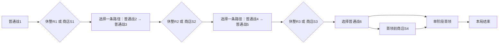

# 路线、遭遇与有限终局

Project ID：game-002。文档角色：CurrentSpec。基准：RC1 / 文档整理修订 doc.1（2026-09-23）。设计选择沿CORE-001–036；体验与完整RC1验收仍Hypothesis / NotRun。

[版本与阅读入口](../baseline.md) · [GDD](../GDD.md)

## SYS-005：路线、敌人与有限终局

### 4.1 设计目的与玩家承诺

- 目的：让同一构筑面对不同压力并完成一局。
- 承诺：选择风险路线，提前看机制，知道长期等待会付出生命。
- 支柱：支持时间／空间编排、实体成长与可推导语义；本系统的边界按下述规则及本版范围，不授予旧卡词义。

### 4.2 MDA推理

| 机制 | 预期行为 | 体验假设 | 反面信号 |
| --- | --- | --- | --- |
| 6普通＋首领；两组直／交叉；敌人定计划；F56／96，F+4k联合损耗 | 玩家按构筑和剩余生命比较两侧 | 选择造成后续代价 | 所有路线和遭遇在体验上无区别 |

### 4.3 输入、状态与输出

| 项目 | 规格 |
| --- | --- |
| 触发与玩家输入 | 进入下一可达节点、战前阅读、本场时间推进 |
| 系统输入与前置状态 | 固定4种路线配对之一，既定19节点与12遭遇 |
| 可观察状态 | 路径、遭遇、敌人计划、当前生命、疲劳时钟及Hf |
| 正常输出与下游 | 胜负及下一节点；首领胜直接终局 |
| 持久化 | 本局生命／领取库存／金币／已确认选择保留；战场状态与计数战终清理，按UX保存各决策边界 |

### 4.4 核心规则

| 规则ID | 前置与事件 | 顺序／公式／状态变化 | 玩家反馈 |
| --- | --- | --- | --- |
| SYS-005-R01 | 满足本表输入及前置条件 | 6普通＋首领；两组直／交叉；敌人定计划；F56／96，F+4k联合损耗；逐条展开见[完整规格](05-route-encounters.md) | 胜负及下一节点；首领胜直接终局；适用数量、原因与来源可查 |

### 4.5 成本、限制与取舍

分支不可回退；普通≤80／首领≤120刻理论界限。战前未提交的配置可反复编辑；进入路线、交易、领取和开战后的结果依保存边界保留，不以退出撤销。自动战斗中不能通过查看界面改变计划。

### 4.6 失败、取消与玩法异常

全甲不免疲劳；清空敌人后不额外领奖或执行后续阶段。失败原因须区分配置非法、无匹配、对象失效、材料不足、结果0、被覆盖、被打断与规则禁止。对应阶段允许修复的仅修复该输入；已完成合法结果不回滚，不自动退款或补替代目标。

### 4.7 交互、信息与反馈

| 时点 | 需知信息／可做动作 | 表达 |
| --- | --- | --- |
| 行动前 | 固定4种路线配对之一，既定19节点与12遭遇；进入下一可达节点、战前阅读、本场时间推进 | 文字与图形展示合法性、选择范围和代价；键鼠路径等价 |
| 行动中 | 路径、遭遇、敌人计划、当前生命、疲劳时钟及Hf | 焦点、当前对象、计数或过程高亮；音效可静音 |
| 结算时 | 胜负及下一节点；首领胜直接终局 | 量值变化与独立原因标签；错误不能只靠颜色或音效 |
| 结果后 | 查来源／事件或按允许流程调整下一步 | 状态详情和记录保留因果；强动效可减弱，不改变规则 |

### 4.8 正例与反例

- Given满足本系统前置，When执行例中操作，Then：C4L敌旁全占，释放采用回退／满溢。
- 边界：范围内远处空格不能越过敌旁生成限制。

### 4.9 系统验收标准

- 规则：按上述正例复现唯一结果，按反例拒绝越权或替代，不破坏实体、名单、时序、存续与保存不变量；结果与原因一致。
- 体验：RG07、U07：解释路径风险并用当前资源完成选择。记录玩家操作和原话，再判断是否理解；所有路线和遭遇在体验上无区别为失败信号。
- 方法／样本：局部规则场景逐项核对；玩家研究至少5位未接触本版的新玩家，各适用U任务至少4/5独立完成。此处是未来验收，不表示已经通过。

### 4.10 未知项与依赖

| 项目 | 状态 | 影响与负责人 | 解决方式／时点 |
| --- | --- | --- | --- |
| 本页规则与内容输入 | Accepted | 主设计；依赖[详细规格](05-route-encounters.md)及CG／PG／EG／RG／UX | RC1固定，变更按规则ID追踪 |
| 目标行为是否成立 | Hypothesis | 主设计／玩家研究；影响是否保留本机制与初值 | 按4.9任务取得证据，首轮当前版本玩家验收时复审 |
| 成品表现是否满足阅读合同 | Unknown | UI／美术／音频；不改变规则即可修正呈现 | 按UX功能信息验收，内容制作交接后、首版体验验收前关闭 |

## RG01：一局的实际规模与起点

- 单次通关路径包含**6场普通战斗＋1场单阶段首领战**。
- 第1、3、5场普通战斗后各有一次“休整或商店”的路线二选一，共3次；选择商店不会同时得到休整。
- 第6场普通战斗后另有一次**可跳过的首领前商店S4**，让该场已领取金币可用于首领前购买；不附带恢复或免费词卡。
- 开局玩家生命上限100、当前生命100、护甲0、其他战斗状态为空、金币0；起始词卡／法杖采用SG01的12张词卡与4根原木杖，所有可换槽为空。
- 本局生命上限固定100，不因推进、购买法杖、词包或首领前准备而自动增长。普通胜利保留实际剩余生命；只有明确休整恢复补回生命。
- 普通金币沿PG基准每战8＋时间奖金0–4；首领胜利直接结局，**不再生成可领取／可花费的战后奖励包**，只记录本局结果与剩余资源。没有额外通关货币、永久收藏、下局解锁或局外成长。
- 敌人、地面、树木、元素和战斗状态每战按本场表重新建立；当前生命和已持有资源跨战保留。战斗退出沿BR09同场开头锁定重播，不重新抽图、重配或重复取得收益。

## RG02：实际路线连接、随机与可见信息

下图为路径结构摘要；“二选一”表示选择具体节点，不是多领取一次收益：

| 当前节点 | 可进入的后继 | 连接说明 |
| --- | --- | --- |
| C1 | R1或S1 | 第一场普通金币已整体领取／放弃后再选路 |
| R1／S1 | C2L或C2R | 第二战二选一 |
| C2L／C2R | C3L／C3R之一 | 开局随机确定直连或交叉的成对连接，每个第二战节点只有一个第三战后继 |
| C3L／C3R | R2或S2 | 不会因为选中哪条战斗路径而缺失这次休整／购物选择 |
| R2／S2 | C4L或C4R | 第四战二选一 |
| C4L／C4R | C5L／C5R之一 | 另一个独立随机的直连／交叉成对连接 |
| C5L／C5R | R3或S3 | 第三次休整／购物选择 |
| R3／S3 | C6L或C6R | 第六战二选一 |
| C6L／C6R | S4或CB | 可看地图后跳过商店直达首领；未进入时不看具体货架 |
| S4 | CB | 离店不返回第六战或其他节点 |
| CB胜利／任意战败／认输 | 本局结束 | 终局不再继续图上其他节点 |

开局对2→3与4→5两组成对连接各作一次等概率直连／交叉选择；每个双节点层的两份遭遇还可等概率交换显示左右位置。内容仍只来自本页固定遭遇，连接和分布不读取玩家后来构筑、生命或金币。随机左右只是展示分布，不额外计作策略或内容量；两组连接产生4种实际配对方式。

一个固定图中有128条通向首领的路线选择序列：3次休整／购物选择、3次战斗路径选择、1次是否进入S4。每条正常通关路径走10或11个节点，包含同样的6场普通战斗和1场首领；进入S4多走一个非战斗节点。路线结构可达不等于玩家必胜。

**可见信息**：从开局可查看整张图的节点、连接、环境主题、敌人种类／主要机制与下一次休整／商店；数值、完整十格布场及明确攻击时刻在进入该战前配置后展开。路线在本局固定，查看不会重抽。具体货架只在进店时生成并公开；休整仍先选分支后才生成词包。

第二战选路时已能看见其唯一第三战后继，不能走完第二战再偷偷改配对；查看路径不承诺后续胜利、目标始终存活或状态永远不变。

## RG07：整局压力与成长验收目标

目标在运行前登记；当前均没有新输入下的达成证据。

| 观察项 | 验收目标／处理 |
| --- | --- |
| 普通正常战斗节奏 | 验收目标：A组胜利T中位20–40刻、P90≤60；全部允许配置按含疲劳最晚80刻检查 |
| 首领节奏 | A组胜利T中位40–70刻、P90≤90；全部允许配置按含疲劳最晚120刻检查 |
| 每场普通胜利生命损耗 | A组中位5–15点；另外列零损耗比例与高损耗尾部，不要求每一局强制掉血 |
| 首领胜利生命损耗 | A组中位10–30点；入场生命与普通战后累计损耗同时报告 |
| 普通前缀压力 | 初始100，三段休整机会前分别经历1／2／2场普通战；R3／S3后为1场普通＋首领，另有S4购物但无恢复 |
| 回复机会成本 | 每次24恢复与一次词选择互斥；选择商店还会放弃整次休整，不能把所有路径当作72免费恢复 |
| 首次基础购买 | 首战基础8金币足以购买已展示合法基础词；拒收收入或主动消费分别记录 |
| 早结束／秒杀 | 沿NF警报：普通12刻／首领18刻前结束、最早合法作用前死亡、仅一次有用法术且敌人未完整作用，都逐例审查；不因划入B组自动放行 |
| 单次压力 | 满足正常入场条件时，普通单次生命损伤不得超过入场生命50%；仍检查受伤后冷却连锁取消 |
| 成长 | 同一初始遭遇回测时，实际成长资源至少改善速度、生命损耗或合法策略宽度之一；敌人不随玩家临时涨数值 |
| 策略宽度 | 在实际可得同预算资源中，至少3类有不同操作／成本取舍的可行策略；改起点或换同义名不凑数 |
| 等待收益 | 不允许无界产金／产词；金币按整局有限6次胜利容器与固定商店记录；疲劳伤害不归功于某张护甲卡 |
| 整局生命账本 | 每节点记录入场、实际损耗、恢复、离场；前缀生命必须实际为正，不能只看全程累计有足够治疗 |
| 渠道可达性 | 按实际掉入的商店／词包、启用期、同名上限、金币和分支核对；名义池里有卡不等于该样本取得卡 |

A组正常输入在冻结时预先列明：同阶段真实可获取资源、入场生命至少50、包含合法主动输出途径的基准方案，覆盖偏攻、攻防、印记／连发和元素操控等当期可达方案；相位与范围不能只保留事后获胜值。具体名单现已在[VB验收输入](../../../../docs/pre-gdd-validation-inputs-2026-09-14.md)列为I0–I3及K01–09，给出实际采购、相位、范围与跨战计划；全部NotRun，不在看结果后挑选。纯零输出、极端相位、残血与其他允许配置进入B组并保留同样的终局／早败警报；真实玩家选择归C组，不能拿枚举胜率冒充玩家胜率。

整局生命量级例：六场各损10点、首领损20点、一次实际恢复24点，则理论离场剩44点；但仍须检查恢复前有没有先死亡、恢复时是否确实缺24点以及实际路线是否经过该休整。此例只解释账本，不是实测损耗，也不承诺任何路线通关。

一刻对应秒数、观看倍速、决策用时和整局现实分钟数已由[UX04／06](../../../idea-materials/M-2026-09-14-interface-platform-and-experience.md)明确；不能仅凭80／120逻辑刻声称等待体验达标。[VB](../../../../docs/pre-gdd-validation-inputs-2026-09-14.md)已列真实资源基准和预期检查，不在结果出来后挑样本。本版首领生命损耗目标为10–30，旧NF30的15–30作为历史候选；不得在验证后择优切换标准。
