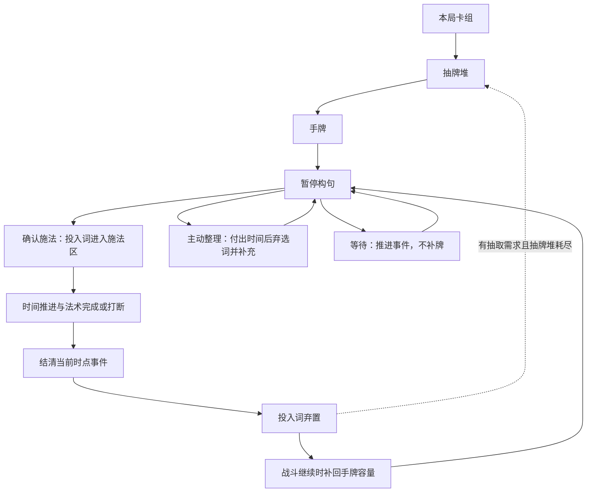

# 方案 A：时间轴下的词汇卡组循环

日期：2026-09-05
Project ID：game-002
状态：整页 Raw Idea / Unqualified；基础供给与牌序循环、新词直接加入本局卡组已局部进入合格素材；其余构筑与干预规则待确认

本文以共享 idea-template 保存来源与资格记录，再组织完整的机制草案。用户已授权细化 A，尚未逐项采纳本页新增规则；本页不是正式 GDD、Proposal 或实现任务。具体卡牌数值、手牌容量、卡组规模、时间费用和转化比例继续后置。

当前版本入口：见“当前修订：多张预览与牌序干预”。用户已选择显示多张牌序，并要求预留联想、回忆、改序和删牌魔法。此前的单张预览建议未采纳；时间补牌衔接分析继续作为候选依据。下方 A-01 至 A-12 及旧循环图保留为历史候选，不能与新修订叠加执行。

## 原始想法

> 目前先按方案A继续细化，结合当前游戏设计和常见的卡组构筑游戏确定词汇循环机制

后续原话（2026-09-05）：

> 补牌思路：深度的时间轴机制，卡牌随时间轴流逝按固定速度补牌，玩家需要选择即时施法还是等待更多卡牌补充
> 需评估问题：玩家是否能看见即将补入的卡牌；卡牌补牌是否需要遵循特定顺序

本轮原话（2026-09-05）：

> 我推荐显示多张牌序，增加玩家决策时的信息；同时此处即可预留联想、回忆等机制来改变牌序，也可以预留牌序修改魔法、删牌魔法等增强构筑深度

删牌范围确认原话（2026-09-05）：

> 基础战斗版本先采用本场移除

满手处理原话（2026-09-05）：

> 满手时可以新增，但必须马上弃牌到满手上限，防止垃圾牌占据手上位置

卡组下限方向原话（2026-09-05）：

> 设置卡组下限，不允许抽牌堆与弃牌堆都空

## 触发来源

- 用户在 2026-09-05 选择 [双路线评议中的 A](2026-09-05-vocabulary-cycle-alternatives.md)，要求结合当前设计与常见卡组构筑细化。
- 已有设计依据：[时间预算与施法打断](../idea-materials/M-2026-09-05-casting-time-and-interruption.md)，来源于初稿 Q2-Q8。
- 先前边界仍生效：具体数值后续讨论，先确定整体机制；设计细化不自动授权代码实现。
- B 整套替代循环暂不推进；用户本轮明确允许在 A 中预留联想、回忆的牌序干预用途，不据此导入 B 的整套规则或语义继承。

## 可能带来的玩家体验

玩家通过卡组组成决定可能掌握的表达，通过多张未来牌的信息比较即时施法、等待和干预牌序。预留机制希望让玩家能为未来组合做准备，同时承担操作占用的施法机会；具体成本规则尚待确定，体验仍为 Hypothesis。

## 暂定标签

- 类型：卡组构筑、组合施法、时间轴战斗。
- 情绪：规划、应变、构筑成长。
- 玩法关键词：统一牌库、时间补牌、等待、预览、抽取顺序、弃牌洗回。
- 风险关键词：语法卡手、语义不兼容、留牌锁死、小牌库循环、长句过牌收益、打断双重惩罚。

## 资格确认记录

已使用 grill-with-docs 核对原稿、时间素材及 A/B 比较。供给、预览、基础牌序、本场移除范围、超限弃牌暂停、投入词流转、起手合法句保障及空抽牌堆的洗回触发已有用户依据。安全下限、移除量截断及提前展示、跨洗回预览、同一时点法术与敌方行动先于固定补牌也已确认。普通事件顺序已同步时间与供给素材；主动等待操作与停点建议按用户最新要求后置，其他扩展仍待确认。

| 资格问题 | 当前答案 | 状态 |
| --- | --- | --- |
| 设计对象及 GDD 章节 | 词汇生命周期、战斗资源循环与局内构筑；对应系统规格、组合、经济与成长章节 | Clear |
| 玩家处境及功能 | 在时间窗口内从手牌组织合法法术，调度以后可用的词 | Clear |
| 玩家行为及可见影响 | 用户选择按时间供牌，显示多张未来牌序以辅助即时施法或等待；预留主动改变牌序，具体职责见候选表 | Clear（供给与多张预览）；Unknown（干预规则） |
| 预期反馈与价值 | 卡组选择影响表达范围和出现机会，留牌与换词影响连句计划 | Clear（设计假设） |
| 与当前构思关系 | 受既有时间与打断规则约束；A 中按用户要求预留联想、回忆，B 整套循环不恢复；具体数值不展开 | Clear |
| 未知项与验证方式 | 比较预览范围、顺序策略及等待是否被即时施法支配；下方记录推演与后续体验验证方法 | Clear（方法），未执行玩家测试 |

### 当前缺口

- 当前转入[原稿的构句机制评议](2026-09-05-yanzhou-core-combat.md#当前构句机制评议词卡与句法职责)：用户已明确三类不能混用、两层兼容及以已有状态为宾语仍需投入对应词卡，制造状态本身不自动获得词卡。词卡耗时相加已确认并同步时间素材，基础版独立字数上限已确认暂不启用。新词直接入本局卡组已确认并单独晋级；普通词卡奖励允许全部跳过、同名独立副本与三张上限均已确认并扩充入组素材；临时复制、删除仅限本场已确认，临时副本可使本场同名数量超过三张也已确认，副本正常弃置与洗回也已确认，具体复制设计已按用户要求后置至相关卡牌出现，当前转回整体战斗时间轴；等待操作与停点后置；循环的缺类、不兼容和状态可用时机错开的风险须结合构句与时间规则复核。

### 资格结论

- [x] Unqualified：完整循环与干预扩展继续留在 inbox，不作为正式 Evaluation。
- [x] Ready for Material Review：已按独立模块复审基础供给与信息机制。
- [x] Promoted（仅局部）：[时间补牌与多张牌序预览](../idea-materials/M-2026-09-05-timeline-draw-preview.md)及[新词直接加入本局卡组](../idea-materials/M-2026-09-05-new-word-deck-inclusion.md)，均为 Qualified GDD Material / Hypothesis；不代表整页晋级、核心采纳或实现。

## 当前修订：多张预览与牌序干预

### 已明确的方向与当前边界

用户选择显示多张即将补入的牌序，以增加决策信息；具体张数后置，不将“多张”自动解释为“整副牌库完全公开”。用户同时要求预留联想、回忆、改序魔法和删牌魔法，已明确基础删牌只作用于本场；这些能力的其余具体规则尚未确定，也没有授权实现。

当前框架：时间补牌负责供给节奏，多张预览提供未来信息，卡组构成决定可抽取的组件。开战及弃牌洗回时随机洗牌、随后按序抽取已由用户确认；牌序干预作为需要获得的能力改变组件先后的分工仍为候选。

### 基础牌序确认

前一轮问题：是否采用“开战和弃牌洗回时随机洗牌，之后按序抽取，只有明确的效果才能改变顺序”？

用户回答（2026-09-05）：“确认”。

已确认规则：开战建立牌库及弃牌洗回时随机洗牌，随后按序抽取；除正常抽取推进外，只有明确的效果才改变顺序。查看预览、思考与调整尚未确认的句子不会重新随机牌序。已同步[时间补牌与多张牌序预览素材](../idea-materials/M-2026-09-05-timeline-draw-preview.md)。

确认边界：不同时决定起手合法句保障、具体改序权限、补牌速度、满手处理、弃牌去向、洗回触发细节或同一时点事件顺序。本场移除牌仍按此前确认退出本场循环，不因普通洗回而恢复。

### 满手补牌确认

前一轮 agent 建议满手时跳过补牌，顶牌保留且不累计额度。用户于 2026-09-05 改为：“满手时可以新增，但必须马上弃牌到满手上限，防止垃圾牌占据手上位置”。原跳过补牌建议未采纳。

当前规则：到补牌时点，新词照常进入手牌；若超限，立即由玩家从补入后的手牌中选择弃牌至上限，可以放弃旧词，也可以不保留新词。选出的普通弃牌进入弃牌堆，不作为本场移除或永久删牌。满手不阻挡牌序正常前移。已同步合格素材，具体容量数值继续后置。

该规则使手牌上限限制保留规模，不能再将留牌代价表述为停止补牌；保留旧词会要求放弃其他候选词。玩家仍要推进战斗时间才能获得新词，暂停思考不会产生无限新牌；但持续等牌和保留固定套组的收益需要验证。选择弃牌不会自动附送额外一次补牌。

超限选择的时间衔接已由后续确认明确：暂停战斗时间，玩家只完成弃牌，随后继续原行动；若当时正在施法，不可利用此窗口改句、取消或另起施法。投入词在独立施法区，不属于可弃手牌，见后续临时施法区确认。同一时点敌方行动先于固定补牌及其超限弃牌，见后续同一时点顺序确认。

前轮只确定满手仍补、超限弃至上限。随后用户于 2026-09-05 对“超限弃牌时暂停战斗时间、仅允许选择弃牌，完成后继续原行动；正在施法不能改句、取消或另起施法”回复“确认”。本次仅确认暂停及操作权限，不决定同一时点事件先后和投入词去向，已同步素材及术语。

暂停期间各项战斗计时保持原进度，继续后不重置；弃牌暂停不是命中打断，不使当前法术无效。验证重点包括玩家能否区分暂停与打断，以及长施法中是否频繁出现机械弃牌；本轮未做试玩或实现。

### 施法投入词去向确认

前一轮问题：是否让普通词卡在本次施法结束后，无论成功还是被打断，都进入弃牌堆？推荐统一弃牌、按既定时间继续补牌，并说明打断会同时损失时间和当前组件的使用机会。

用户回答（2026-09-05）：“确认”。

已确认规则：普通投入词在成功或被打断后均于本次施法结束时进入弃牌堆，等待后续洗回。结束本身不额外补牌，不直接返还手牌，也不作为本场移除；成功的整句效果和打断无效果仍遵守已有规则。已同步合格素材及术语。

本次不决定投入词的离手时点、施法期间是否占手牌上限、具体同一时点先后或特殊词卡去向。打断的双重代价已说明并确认采用，惩罚强度仍需验证，不标记为已通过试玩。

### 临时施法区确认

前一轮问题：是否在确认施法时，将投入词立即移至临时施法区，不占手牌上限，也不能用于超限弃牌？

用户回答（2026-09-05）：“确认”。

已确认规则：确认施法后，投入词立即离开手牌进入临时施法区，不占手牌上限，不可用于超限弃牌。普通投入词成功或被打断后进入弃牌堆。新牌按战斗时间进入手牌，腾位不立即补满。已同步供给素材与术语。

确认边界：不决定起手保障、具体牌数、特殊词卡对施法区的干预、洗回及其他同一时点事件顺序。现有超限弃牌窗口仍只允许整理手牌，不能改变已确认的法术。

### 起手保障确认

前一轮问题：是否保障起手至少能用自己的词卡组成一条合法基础句？推荐提供起手保障，不保证最优组合或后续每次补牌都能成句，具体保障方式和牌数后置。

用户回答（2026-09-05）：“确认”。

已确认规则：开局手牌至少能用本局自有词卡组成一条合法基础句。保障限于起手可构句，不保证该句是最优解，也不保证正常补牌每次都能形成合法句。它是随机起手的明确保障，具体方式与牌数仍未定；已同步合格素材及术语。

确认边界：不确定定向发牌、重抽、换牌或其他具体办法，不自动允许玩家挑选整手，不从卡组外生成词卡。合法基础句须满足最终语法与语义规则，不能仅检查主语、谓语和宾语类别齐全。若整副卡组无法组成合法句，需另行明确构筑约束来使保障可兑现，不能用临时发放外部词卡代替；构筑约束具体方案仍待评议。

验证目标是开局有可表达的句子，同时保留起手差异与构筑取舍；合法性、保障方法与相关参数未齐备前，不宣称已经验证。此处不改变后续常规按序抽取和按时间供牌。

### 空抽牌堆洗回确认

前一轮问题：补牌时若抽牌堆已空，就将当时的弃牌堆洗回，并在该补牌时点继续抽取，不额外耗时；手牌、施法区和本场移除牌不参与洗回。是否采用？两堆都空另行讨论。

用户回答（2026-09-05）：“确认”。

已确认规则：到达补牌时点，抽牌堆为空且弃牌堆有牌时，将当时的弃牌堆随机洗回抽牌堆，在本次补牌时点继续抽取，不额外消耗战斗时间，也不改变既定补牌节拍。手牌、临时施法区和本场移除牌不参与洗回。已同步合格素材与术语。

确认边界：不决定抽弃两堆都空时是否保留补牌次数、弃牌与补牌同一时点的先后、跨洗回的预览方式及额外抽牌效果。抽走最后一张本身不触发提前洗回；当前确认的触发是补牌需求遇到空抽牌堆。

评议：无需为普通循环另收洗牌时间，保持固定供给节奏；小循环池可能导致反复抽到相同词，仍需结合留牌和本场移除验证，不能据此宣称构筑已平衡。

### 卡组下限方向与资格追问

用户对“两堆均空时跳过补牌、不积攒欠牌”的建议改为：“设置卡组下限，不允许抽牌堆与弃牌堆都空”。已明确用户选择防止双空堆的方向；不能把前一轮跳过补牌建议记为已确认。

状态更新：本场移除受安全下限约束及数量截断、提前展示已由用户确认，下列资格字段已复审，约束同步至[供给素材](../idea-materials/M-2026-09-05-timeline-draw-preview.md)，为 Qualified GDD Material / Hypothesis；具体目标与关联收益仍留待魔法设计。

| 资格问题 | 当前答案 | 状态 |
| --- | --- | --- |
| 来源与设计对象 | 本轮用户原话；卡组构筑下限与战斗词汇供给 | Clear |
| 玩家处境及目标 | 持续施法、补牌与移除词卡时，避免抽牌堆和弃牌堆同时无牌 | Clear |
| 玩家行为与约束 | 设置卡组下限，本场移除最多执行到安全下限，超出部分不执行，提前展示实际可移除量；具体数值后置 | Clear |
| 预期价值 | 避免无牌可补造成供给中断，维持时间补牌循环 | Clear（目标，未验证） |
| 与现有系统关系 | 下限覆盖本场移除造成的循环池缩小；需要考虑手牌、施法区与超限占用，以限制极端压缩换取持续供给 | Clear（依赖与取舍） |
| 主要未知与验证 | 用最大留牌、施法占用、连续补牌及超限窗口复核安全余量，后续检查关联收益与实际移除量的关系 | Clear（方法，未执行） |

机制评议：不增加、复制词卡的普通流程中，仍参与本场循环的总牌数等于手牌、施法区、抽牌堆和弃牌堆的牌数之和。本场移除牌不计入此总数。要让两个牌堆合计始终有牌，参与循环的总牌数就必须大于当时手牌与施法区的合计占用。开战下限如果没有战斗内保护，仍可能被后续移除破坏。

前轮推荐：卡组构筑设置下限，本场移除也不得把参与循环的牌数降到安全下限以下；安全下限根据允许的最大手牌与施法区占用留出牌堆余量，具体数字后置。该约束会限制极端压缩卡组，是维持持续供给的代价；不自动恢复已移除牌，不擅自禁用普通补牌或强制弃掉玩家保留的词。

边界待查：满手补入后、玩家完成超限弃牌前，手牌会短暂超过通常上限。若“不允许两堆都空”覆盖这个暂停窗口，安全余量也必须覆盖这部分临时占用，不能只用常态手牌上限来证明。批量补牌、扩容和特殊施法区效果应在设计时复核；当前不新增这些能力。卡组下限只保障牌数，不能同时保证每次都有合法句或多张预览始终填满。

前一轮问题：是否让本场移除也受安全下限约束，不能把仍参与本场循环的词卡数量降到下限以下？

用户回答（2026-09-05）：“确认”。

已确认规则：本场移除也必须遵守安全下限，不能使仍参与当前战斗循环的词卡数量低于该下限。此处统计手牌、施法区、抽牌堆和弃牌堆中的牌，不统计已本场移除的牌。下限服务于“不允许抽牌堆与弃牌堆同时为空”的目标，具体张数后置。

确认边界：只确认约束范围，不自动采用数量截断、禁止施法、整句失败或返还时间等触限处理。下限须结合各牌区最大占用设计，尚未得到已验证的具体安全值；不保证合法句持续可用，也不恢复已移除牌。

前一轮问题：移除效果最多执行到安全下限，超出的移除量不执行，并提前显示实际可移除量。是否采用？关联收益如何计算留到具体魔法设计时确定。

用户回答（2026-09-05）：“确认”。

已确认规则：移除量最多执行到安全下限，超出可移除余量的部分不执行；施法前提前显示实际可移除量。安全余量用尽时，该移除效果不会再移除词卡。已同步供给素材和术语。

确认边界：不据此定义整句失败、返还时间、额外收益或其他效果的结算。具体目标选择、与实际移除量关联的收益、施法期间状态变化造成的预览变化仍待具体魔法设计；预览不保证未来战场状态不变。未进行玩家测试。

### 跨洗回预览确认

前一轮问题：抽牌堆剩余牌不足预览范围时，只显示当前确定的牌序，其后标为“待洗回”；实际洗回后再显示新牌序。是否采用？代价是临近洗回时可见信息暂时减少。

用户回答（2026-09-05）：“确认”。

已确认规则：抽牌堆剩余牌不足预览范围时，仅展示当前确定牌序，其后标为“待洗回”；不为填满预览提前洗牌。实际洗回仍按已确认触发发生，并完成当次抽取，随后显示新抽牌堆顶部的未来牌序，不将已到手的牌继续列为未来牌。已同步供给素材与术语。

依据与取舍：洗回前弃牌成员仍可能改变，下一轮顺序尚未形成；因此临近洗回时信息范围暂时缩小。确认不改变补牌节拍、具体预览张数或改序能力，也不保证跨洗回的全部未来牌可见。未进行玩家测试。

### 同一时点顺序确认

前一轮问题：同一时点按“已完成法术结算并弃置投入词 → 敌方行动及可能的打断弃置 → 固定节拍补牌、必要的洗回及超限弃牌”处理，中间不开放新施法机会，战斗结束则停止后续流程。是否采用？

用户回答（2026-09-05）：“确认”。

已确认顺序：先结算已完成法术并弃置普通投入词，再处理该时点敌方行动及由命中打断产生的弃牌，最后处理固定节拍补牌及其超限弃牌。若战斗已经结束，停止后续战斗流程；若仍有未完成施法，事件处理后继续原施法；否则在同一时点事件处理完毕后恢复构句。中间不开放新的施法机会，超限窗口仍只允许弃牌。已同步时间与供给两份合格素材。

该顺序保留已确认的“法术完成与敌方攻击同时发生时玩家法术先结算”，将固定供给放在战场事件之后。设计影响：同一时点成功或打断后进入弃牌堆的词，能参与随后因补牌触发的洗回；刚补入的新词不能用来抢在该时点敌方行动前施放。只有固定节拍补牌采用这里的最后顺序，法术自身附带的抽牌等特殊效果不据此自动定义。

确认边界：多敌人之间的先后、持续效果及连锁触发规则另行明确，不把此顺序称为完整事件规则。仅核对普通规则之间的关系，未进行原型或玩家测试。

### 主动等待的推进候选

状态：Parked / Deferred。用户于 2026-09-05 表示“交互界面后续设计，先设计机制”，本段操作与停点建议未获确认，不再作为当前追问；保留候选供后续交互设计评议。既有构句暂停、时间供给及同刻结算顺序不因此撤销。

前轮问题：玩家未施法时选择等待，是否一次推进到最近的补牌或敌方行动时点，结清该时点事件后自动暂停，重新选择施法或继续等待？当时推荐采用。相同时间的事件按已确认顺序处理，不能在其中插入新的施法；若战斗结束则停止流程。

这个候选使等待成为保留手中组件、等新信息再决定的动作。若敌方行动比补牌更早，先到敌方行动；若两者同刻，先处理敌方再补牌。它不暂停敌方计时、不额外补牌、不重置施法预算，也不允许正在施法时借等待取消或改句。代价是连续等待可能增加点击次数，需后续试玩检查；暂不新增连续等待、指定时长或快捷跳过多节点的能力。具体主动等待终点未随前轮事件先后确认，不写入合格素材。

### 当前循环汇总

下表串联已有确认，不把未定环节自动补为规则。

| 环节 | 已明确内容 | 仍待明确 |
| --- | --- | --- |
| 形成抽取顺序 | 开战及弃牌洗回随机洗牌，之后按序抽取，明确效果才改序；起手保障自有词可构成一条合法基础句 | 起手保障方法、具体牌数 |
| 洗回弃牌 | 补牌遇空抽牌堆时洗回当时弃牌，继续本次抽取，不额外耗时；跨洗回部分标为待洗回；同刻法术或打断产生的弃牌可参与洗回 | 下限参数；特殊触发顺序 |
| 获得词卡 | 按战斗时间固定速度补牌，多张未来牌序可见 | 速度、可见张数及其他同一时点事件顺序 |
| 整理手牌 | 超限后立即暂停，只能选择弃至上限，再继续原行动 | 不同事件同时发生时先后 |
| 构句并投入 | 构句暂停；确认后投入词离手进入不占容量、不可超限弃牌的施法区，开始推进时间 | 特殊词卡对施法区的干预 |
| 施法结束 | 成功或被打断的普通投入词都弃置；结束不额外补牌 | 特殊词卡去向与具体事件先后 |
| 临时副本循环 | 默认正常弃置并参与洗回；明确本场移除可提前退出，战后清除；见[循环确认](#临时副本正常循环确认记录) | 复制目标、初始进入位置、数量与费用 |
| 本场移除 | 被移除词退出本场循环；原有词下场恢复参与，临时副本战后清除；最多移除到安全下限，提前展示实际可移除量 | 具体魔法目标、关联收益及预览随状态变化的规则 |
| 同刻结算 | 法术完成及弃牌 → 敌方行动及打断弃牌 → 固定补牌与超限弃牌；中间不开新施法 | 多敌人、持续效果与连锁触发 |

文档层面的普通流程核对：投入词离手腾出空间，但不立即补牌；施法期间到牌仅计入手牌，超限时也只能弃手牌；暂停不触发结束弃置。完成或打断产生的弃牌先于同刻固定补牌，补牌窗口不能插入新施法。普通牌区流转与事件顺序已有衔接，主动等待终点及特殊触发仍待定；未进行试玩或完整机制验证。

### 预览区的职责建议

- 显示抽牌堆顶部连续若干张词卡及先后，建议同时显示依当前节拍推算的到达时点。具体张数与洗回后的未知信息后续定；满手仍正常补牌，不再显示因容量停止供给。
- 预览是对未来抽取的展示，不额外把这些卡从抽牌堆搬到一份独立库存；看见不等于已经能用于当前句子。
- 普通查看、思考不改变顺序；只有规则明确的操作才改变牌序。改序后及时展示新的先后及预计到达关系。
- 普通改序改变“哪个词占据未来补牌位置”，不默认改变补牌速度、不直接入手、不重置计时。加速和立即抽取属于另一类效果，当前只留作边界。
- 预览可编辑不代表玩家可免费拖动排序；建议通过获得的词卡或完整法术表达干预，不默认为另开一套独立技能栏。

### 扩展职责候选

以下是 agent 为避免职责重叠提出的分工；其中删牌的本场作用范围已获用户确认，其余分工仍是候选，不能将表格整体视作已采纳的卡牌规则。

| 扩展 | 建议来源与变化 | 构筑价值与边界 |
| --- | --- | --- |
| 联想 | 从抽牌堆寻找满足明确语义关系的现有词卡，将其提前到后续补牌位置 | 帮助同主题组件衔接；语义关系须可解释，不凭空生成词；检索范围及条件未定 |
| 回忆 | 把弃牌堆中的现有词卡移回未来抽取队列 | 为已用关键组件安排再次出现；默认仍等正常补牌，不自动复制或立即入手 |
| 牌序修改魔法 | 调整未来队列中词卡的相对位置，如提前、延后或交换 | 直接安排到达顺序；与联想的条件检索、回忆的跨区域回收区分 |
| 删牌魔法 | 基础版本将词卡移出本场战斗循环 | 作用持续范围已确认；可作用的区域、对象与具体效果尚未定，不等同普通弃牌或本局永久删除 |

删牌范围比较：普通弃牌仍可洗回；本场移除影响当前战斗的循环池，下场恢复；本局永久删除改变后续每一场的卡组。用户已选择基础战斗版本采用本场移除，永久删牌继续留作独立待评议方向。跨局收藏删除没有用户依据，不在讨论范围内。

### 删牌范围确认

用户于 2026-09-05 明确：“基础战斗版本先采用本场移除”。对应前一轮已解释的范围：受该效果移除的词卡本场不再参与正常抽取和弃牌洗回，下场按本局卡组重新参与战斗；本局卡组中的拥有关系不变，不保证下一场起手必抽到它。

本次只确认基础删牌的作用持续范围。目标可以来自手牌、预览、抽牌堆还是弃牌堆，能否作用于敌方词卡、涉及多少词卡、施法时间和特殊回收规则均未决定；不将这些选择夹带为确认结果。回忆的现有候选只从弃牌堆取词，不据此赋予其取回被移除词卡的能力。

通过 grill-with-docs 复核：范围已清楚，但删牌魔法的可选目标区域和具体操作仍未确定，完整能力继续留在 inbox，不将其作为已完成的合格卡牌素材或核心采纳决定。后续需检查本场缩小循环池的收益与损失组件的代价；本轮无试玩结论。

### 与施法时间的关系

建议当干预通过魔法触发时，遵守已经确认的完整施法与打断规则：完成时才改变牌序或移除卡牌，提前命中打断则不产生该句效果，时间不退。不在暂停构句阶段实际执行免费改序，也不新增独立法力成本。

施法期间补牌继续推进的候选规则意味着：计划干预的词可能在法术完成前已被抽走。后续必须明确目标是具体词卡还是某个队列位置，以及目标失效如何处理；本轮先记录依赖，不替用户补完所有边界。涉及隐藏牌的检索不应通过反复取消预览免费揭示整个牌库，完整信息展示规则后续设计。

### 价值与主要风险

多张预览搭配主动干预，能够让玩家为跨句组合安排组件，而不仅是等待一张新牌。没有干预能力时，仍应通过现有手牌、留牌与等待形成正常循环；不能让每副卡组都必须带同一种检索或改序能力才可造句。

关键取舍是：立即产生战场效果，还是花时间与词卡投入改善未来供给。若干预太慢，它会占用本可完成输出或防御的窗口；若过于自由且能反复使用，公开队列可能变成固定最优连招。

重点风险包括多张预览增加推演负担；联想与回忆形成自我回收循环；删除弱词让卡组过度收缩；改序、检索和立即抽牌边界混淆；系统自动重排破坏已知信息的可靠性。这些是设计风险，尚非测试结论。

### 后续验证与下一问

先用同一抽取序列比较“多张可见但不能干预”和“多张可见且拥有一种干预能力”。观察玩家是否能解释为什么值得花时间改序、是否仍有立即施法或等待的合理场景，以及每次都复现同一套操作的程度。基础循环须另外检查无干预能力时能否正常进行。

洗回触发、安全下限、移除量截断与提前展示、跨洗回预览及普通同刻结算顺序均已确认。双空堆跳过补牌建议未采纳。按用户最新要求，等待操作与停点、交互界面后置，当前转入构句职责与词卡可用位置；不因卡组有足够张数就宣称语义卡手已解决。

## 前轮评议：按时间补牌与单张预览建议

阅读边界：时间补牌衔接与风险分析继续作为候选依据；其中推荐仅预览下一张的结论已被用户的多张预览方向取代，保留历史比较，不再作为待确认问题。

### 方向判断与时间含义

建议继续深化用户提出的时间补牌方向。时间同时推进敌方威胁、玩家施法和词卡供给，使“等到新词再说”成为可判断的决策。深度是否成立仍是 Hypothesis，固定速度本身不保证有趣。

沿用已确认的构句暂停：这里的时间是战斗时间，不是玩家现实中阅读、思考的时间。建议固定速度落实为每隔固定战斗时长发生一次单张补牌事件；间隔数值后置。这是 agent 对用户方向的具体化建议。

### 与既有时间机制衔接的建议

| 情境 | 本轮建议 | 与旧候选的关系 |
| --- | --- | --- |
| 暂停构句 | 补牌计时也暂停，查看预览不重排卡牌 | 不能靠现实中停留免费等牌 |
| 施法进行中 | 按同一速度计时，到点新词进入可用手牌，但不能改写已经确认的句子，也不自动开启第二次施法 | 补牌不以法术完成为前提 |
| 主动等待 | 推进到下一补牌或敌方行动等事件；结清同一时点事件后，未在施法且战斗继续时恢复决策 | 等待现在能够获得新词，同时承受敌方行动与窗口缩短 |
| 施法成功或打断 | 本身不额外补满，不重置补牌时钟；实际已经到手的新词不因打断而回退 | 取代旧 A-06 的完成/打断补满；投入词最终去向仍待确认 |
| 主动弃词 | 可作为腾出容量的候选，但不附送立即补牌 | 旧 A-08 的耗时整理后补齐不能原样沿用，其必要性及弃词代价后续审阅 |
| 开局与洗回 | 开局仍需起手词；常规补牌来自抽牌堆，用过词等待弃牌循环 | 原有起手保障、留牌、弃置方案都不是本次自动采纳的细节 |

法术完成与敌方攻击同时发生时仍按已确认规则处理。补牌与其他事件恰好同一时点的完整顺序尚未确认；建议不在这些事件之间开放新一轮施法。正在施法时到达补牌节点也不提供改句或取消权。

### 评议一：玩家看见多远

| 信息范围 | 决策特点 | 风险与适用判断 |
| --- | --- | --- |
| 仅看补牌倒计时，不知内容 | 依据卡组分布承担等待风险 | 已有多词配合与时间压力，可能反复出现等来无用词的挫败；不推荐作为首个基线 |
| 看下一张的词类或标签 | 能判断补某类组件的机会，保留部分未知 | 词类相符不保证语义相容，未必足以判断等待收益；可作后续对照 |
| 看下一张完整内容及预计到达时点 | 能比较现有句与下一张带来的新句，并核算剩余时间 | 推荐基线；下一张未必值得等，远期牌仍未知 |
| 看多张或整个顺序 | 可以规划更长的施法链 | 增加推演负担，可能趋向固定解题；适合以后评议预知类能力，不默认加入 |

推荐预览真实即将抽到的牌，而不是概率候选。普通查看、等待和改句不能让它刷新；若后续存在洗牌或改序效果，应明确说明预览变化来源。抽牌堆已空、下一张依赖尚未发生的弃牌洗回时，不伪装确定牌面，先显示“待洗回”；跨洗回预览方式后续明确。

### 评议二：是否遵循特定顺序

“有一个稳定的抽取顺序”“玩家看见多少顺序”和“按规则安排词类顺序”是三个不同问题。固定补牌速度不要求主语、谓语、宾语固定轮流出现。

| 排序方式 | 构筑与战斗影响 | 判断 |
| --- | --- | --- |
| 每次建立或洗回牌库时随机排序，之后依次抽顶牌 | 选牌和删牌改变组件出现机会；预览能提供局部确定性 | 推荐基础方案；普通操作不重新掷下一张 |
| 主语、谓语、宾语等按固定类别轮替 | 降低连续缺少某类词的概率 | 限制多样句式；类别齐全仍可能语义不通；也会改变增加某类词的构筑收益 |
| 玩家预先编排完整牌序 | 构筑同时安排整场输出顺序 | 容易形成固定起手和连招，重心转向编排；目前不作为基础 |
| 动态按当前缺失组件补牌 | 降低卡手，改善可表达性 | 隐藏纠正会削弱预览可信度，并可能被弃牌操纵；先仅评议透明、范围有限的起手保障 |

推荐组合：洗牌形成顺序、依次抽取、仅预览下一张完整词卡。不额外强制词类轮换，不默认开放整副卡组排序。如果测试发现严重语法卡手，再比较起手保障、卡组兼容性约束等办法；不以公开下一张替代可表达性检查。

### 核心取舍是否成立

用 t 表示下一张到达所需时间，c 表示拿到后拟施法所需时间，a 表示下次会命中打断的攻击到达时间。在敌方行动没有被改变的简化场景里，等待后的句子需要满足 t + c <= a 才能完成；这里不是具体数值设定。

纸面推演（条件性推理，不是试玩结果）：

- 当前已有可用的短句，下一张能组成更适合战况的句子，且等待后仍来得及完成：两条路线都有理由，需要比较实际效果与组件消耗。
- 下一张很有用，但等到后剩余窗口不够：预览提供的信息是“这次不能等”，可考虑当前句或承受本次攻击后再安排，后者仍依赖后续战斗规则。
- 当前无合法句，下一张能补齐：等待是可理解的恢复路径；若下一张仍无用，则还要看手牌容量与弃词规则能否避免长期卡死。
- 施法和等待同样会补牌：不能宣称只有等待才能拿到新词。立即施法会占用一段不可改句的时间并投入现有组件；等待保留这些组件和新词到达后的选择权。这些差异才可能支撑取舍。
- 若每次都有无代价、足够快、无风险的句子可用，而且不会妨碍新牌到手后行动，则即时施法可能总比空等好。需要在完整词卡投入规则和句子耗时设计中验证，不能为制造等待价值而暗中把施法期间的补牌停掉。

### 容量与供给约束

时间补牌让词卡成为持续供给。长句消耗组件更多，未必总能靠更高补牌量补偿；补充速度与消耗速度决定可持续施法节奏，具体参数后置。短句是否独占优势、较长吟唱是否提供合理的补充时间，都需结合效果验证。

历史比较：曾建议满手跳过补牌、不消耗顶牌且不累计额度。该建议已被用户的“正常补入后立即弃至上限”取代，详见当前修订；下文关于先腾位才能等到新牌的推演也不再作为当前规则。

手牌满且无合法句时还需要腾位途径。建议后续审阅主动弃词，但不继承旧版立即补齐；弃词是否耗时仍为 Unknown。本轮不使用这一未定规则宣称已解决所有卡手。

### 下一步验证与当前问题

先确认下一张预览范围，再确认顺序规则、容量与弃词，之后复审词汇循环的素材资格。验证时用同一副测试卡组、相同敌方事件和抽取序列比较“隐藏下一张 / 公开下一张”，另行比较“随机牌序 / 类别轮替”，避免同时改变多个因素。

观察玩家能否解释等待理由、准确判断新词到手后是否来得及施法，以及是否总立即施法、总等待或因无合法句被迫空等。没有具体词卡和时间参数时只能推演逻辑，不能断言深度或平衡已验证。当前未运行原型或玩家测试。

当前问题：是否公开下一张词卡的完整内容及其预计到达时点？推荐公开下一张。顺序推荐与容量方案属于本次评议，不随这个问题的确认一并采纳。

## 历史候选：常见结构与本作适配

以下为常见卡组构筑规则的结构性参照，基于通用设计知识；并非针对特定游戏最新版本的联网调查或完整产品案例。

参照《杀戮尖塔》的牌区、洗回及选牌/删牌结构，以及《领土》中增加新卡影响未来循环的构筑关系；来源、借鉴边界与待验证假设见[产品参照](../market-reference.md)。两者的回合流程均不直接移植。

| 常见结构 | 本作的机制建议 | 原因 |
| --- | --- | --- |
| 抽牌堆、手牌、弃牌堆分工 | 保留，并增加临时施法区 | 三类词需要一起组成一个完整动作，必须清楚哪些词已投入 |
| 用过的牌进入弃牌区，缺牌时洗回 | 保留普通词卡循环 | 增加、移除和重复词卡可以改变可用表达的出现机会 |
| 轮到玩家时补牌，回合结束清手 | 改为本次施法结束后补充，未用词保留 | 当前采用时间轴，没有已确定的整回合清手节点；保留跨句准备空间 |
| 抽牌、换牌与检索有机会成本 | 常规施法后补充与施法一起发生；主动换词单独耗时 | 保持正常循环，同时阻止暂停阶段免费无限挑牌 |
| 一张牌通常可以独立形成动作 | 本作仍由多张词卡共同形成法术 | 需要额外关注类别齐全和语义兼容，不能把普通手牌可用性照搬过来 |
| 获得、移除、升级改变卡组表现 | 保留这些构筑选择的方向，具体升级内容后续定义 | 局间选择要能改变局内表达，不能只有词卡数量增长 |

## 历史候选：施法结束补牌基线

以下 A-01 至 A-12 保留提出时的候选文本，数字只是条目编号，不是卡牌参数。后续局部确认以相应确认记录与合格素材为准，不将整组候选叠加为现行规则。

### A-01：词典、卡组与手牌的关系

- 词典记录本局获得的词卡；当前基础版建议普通获得的词卡进入本局卡组，不额外设计一个战前可随意换入换出的备用词库。
- 一副统一的战斗牌库混合主语、谓语、宾语等词卡；不默认按语法类别拆成多副独立牌库。
- 手牌是当前可用词。语法槽用于排列本次句子，不是永久安装该类词的装备位。
- 同名词卡可以有多个独立副本；一张具体词卡只占一个位置，不能同时填多个槽位。是否允许重复词出现在同一句由语法规则另定。

这样新增词、拒绝新词和移除词都会改变卡组的分布；若未来需要可编辑的出战子集，应单独评议其是否削弱局内选牌代价。

### A-02：牌的位置

| 位置 | 含义 | 是否可用于新句子 |
| --- | --- | --- |
| 抽牌堆 | 尚未抽到的战斗词卡，顺序对玩家隐藏 | 否 |
| 手牌 | 已抽到且当前持有的词卡 | 是，仍需满足语法与时间条件 |
| 施法区 | 已确认投入正在施放法术的词卡 | 否，不能重复占用 |
| 弃牌堆 | 普通使用、整理或规则要求弃置的词卡 | 否，等待牌库循环 |

当前普通循环不加入消耗区、永久遗忘区或定向回忆；未来特例另行评议。战斗弃置不等于从本局卡组永久删除。

### A-03：进入战斗

将本局卡组组成洗混的抽牌堆，按手牌容量获得起手词。卡组仍须有至少一条符合基础语法与语义兼容的有效句子，不能只检查是否存在三种词类。

建议构筑时检查基础可表达性，并在开场保障至少一条合法基础句，所有词仍来自自己的卡组。该保障只针对无法构句，不替玩家检索最强效果；具体起手保障方式待后续细化。正常补牌不承诺每次必有合法句，更不承诺始终有适合当前战况的强句。

### A-04：选择与确认

构句阶段保持时间暂停。玩家从手牌选词填入语法槽，确认前可撤回和改选，不改变牌库内容，也不抽新牌。

仅合法句子可确认施法；确认后投入词从手牌移至施法区，开始按已确认规则推进战斗时间。剩余预算不足时的预警或是否允许冒险施法，作为后续完整交互边界处理，不据此改变已有命中打断规则。

### A-05：成功与打断后的词卡去向

建议成功与被打断都把本次投入的普通词卡移至弃牌堆。成功产生整句效果，打断不产生整句效果，时间均保持已推进的结果，遵守既有规则。

该建议会让打断同时损失时间和本次关键词的即时使用权，但不永久删除词卡；后续补牌提供继续组织句子的机会。这个惩罚强度尚无测试证据，若压制过重需复审去向，不能以它已写入本草案就视为用户确认。

### A-06：补牌与留牌

本次施法结束、投入词归入弃牌后，自动从抽牌堆补充到手牌容量；未投入的词继续留在手牌。自动补充不额外收取一次准备时间，它是本次行动结束整理的一部分。

成功与打断都触发这次补充；敌人单独行动、玩家仅在构句、玩家等待，都不自动触发补牌。特殊效果导致的额外抽牌或手牌变化不在本版规定。

留牌的代价是占用容量，减少自动补充时能进入的新词；玩家可以持续留住有用的组件，但也可能需要放弃它们来改善整体手牌。

### A-07：与时间轴事件衔接

词汇循环必须遵守已有时间轴，不提供“敌人行动前免费插入新句子”的额外窗口。建议按以下阶段组织：

1. 本次法术完成或遭命中打断，处理对应效果；相等时点按已确认的玩家法术优先规则。
2. 结清当前时点尚需发生的敌方行动及其状态变化，不在其间开放新一轮构句。
3. 若战斗未结束，完成投入词的去向与自动补充，显示新的可用词及时间关系，进入暂停构句。

这是一份待确认的完整衔接建议；不规定多个敌方行动之间的顺序。后续新增会影响手牌的敌人能力时，必须补齐其与本次整理的先后。

### A-08：主动整理手牌

玩家可在决策时选定不需要的词，确认一次“整理”行动，付出正的战斗时间后弃置所选词并补回相应空位。允许整理整手，范围与耗时的具体关系后续定。

在确认与实际付出时间之前，不揭示新词；不能查看新牌后撤销整理。时间推进中的敌方行动正常发生，玩家承担受击风险。整理是准备动作，本版没有把它定义为可被施法打断规则取消的咒语。

整理结束只执行一次对应补充，不再叠加一轮“施法结束补牌”。整理过程中若战斗已经结束，则停止本次战斗的后续词卡调度。

### A-09：等待与无法构句

没有合适句子时，玩家可以耗时整理，也可以保留手牌并等待下一项会推进战斗的事件。等待推进时间并处理事件，不换牌、不自动补牌、不重置敌方计时。

明确区分三种情况：

- 无合法句：由整理与基础卡组可表达性检查处理，仍需验证卡手频率。
- 有合法句但不适合战况：这是留牌、换词和承担风险的正常取舍，不能自动免费发解题牌。
- 整副卡组本就没有合法基础句：应在卡组形成或修改时阻止该状态，不能指望战斗中反复洗牌解决。

整理提供可执行的恢复路径，不保证玩家每次整理必抽到想要的词。若仍频繁因语法组合无法行动，优先复审抽取保障和卡组组成约束，不靠调整伤害掩盖这个问题。

### A-10：牌库耗尽

有抽取需求但抽牌堆不足时，先抽完现有抽牌堆，再将弃牌堆洗回继续抽；不足的部分能抽多少抽多少。仍在手牌或施法区的词不参与洗回，不复制、不从卡组外补词。

若所有词已在手牌或施法区，允许手牌未满，不凭空产生卡牌。留牌会改变弃牌循环内的组成，这是构筑和调度的一部分；小牌库是否过强需后续验证。

### A-11：战斗之间与本局结束

普通抽取、使用、弃置都只是战斗内位置变化。下一场战斗重新用当时的本局卡组建立抽牌堆，不继承上一场的手牌与抽取顺序。

局间获得、拒绝、移除和升级词卡是构筑决策：它们改变以后能形成的句子以及组件出现机会。普通词卡弃置不会永久缩小本局卡组；局外解锁与持久成长继续保持未定，不混入词汇循环基线。

### A-12：基础循环的可见信息

建议玩家能查看本局卡组构成、自己的手牌、施法投入词、弃牌内容及各区数量；抽牌堆当前顺序保持未知。选词时需要可见合法性与无法组合的原因，准备动作需要显示时间代价。

这些是理解构筑和时间取舍所需的信息要求，不在本轮制作界面或规定具体视觉布局。

## 历史候选：施法结束补牌循环概览

图示为草案的普通循环。战斗结束会退出循环，具体胜负规则未在此新增；“投入词弃置”与“弃牌洗回”不会撤销已经发生的时间或法术结果。

## 历史候选：核心取舍与风险复核

| 选择 | 获得什么 | 放弃什么或风险 |
| --- | --- | --- |
| 留住关键词 | 保留后续组合的确定组件 | 占用手牌容量，减少新词进入 |
| 立即施法 | 改变世界并让投入词进入循环 | 消耗时间和当前组件，可能被打断 |
| 整理手牌 | 改善当前词语组合 | 花费时间，可能让敌人先行动 |
| 拿新词 | 扩展表达或强化某类句子 | 稀释其他组件的出现机会 |
| 移除词 | 提高某些组件的出现频率 | 缩小解法范围，可能破坏基础可表达性 |
| 构筑更长句 | 候选表达能力更强，且可能带来更多词的轮换 | 同时影响施法耗时与过牌收益；必须检查是否出现为刷牌而造句 |

重点风险：卡手与打断惩罚叠加；长期留牌形成高度稳定套组；起手保障抹平构筑差异；短小卡组过快循环；长句仅因补牌量而占优。它们目前是待验证风险，不能写成已发生的测试结论。

## 历史候选：未知项与最小验证

当前最关键的设计选择是补牌节奏：本版建议施法结束补充、未用词保留。它决定本作如何在没有传统回合清手的情况下形成牌库循环，优先交给用户确认。

随后用不依赖具体伤害数值的纸面状态推演检查以下场景：

| 场景 | 草案预期 | 验证目的 |
| --- | --- | --- |
| 合法施法成功，手里仍有未用词 | 投入词弃置，未用词留下，补充空位 | 解释留牌与常规循环 |
| 法术完成前命中打断 | 整句无效果、时间不退；按候选处理投入词弃置并补充 | 检查是否可理解、惩罚是否过重 |
| 法术与敌方攻击相等时点 | 法术先处理，结清该时点攻击后才开放新决策 | 排除补牌造成的免费抢行动 |
| 手牌无法形成合法句 | 可选择耗时整理或等待，没有免费筛牌 | 检查可恢复性与节奏 |
| 留牌导致牌库循环池很小 | 只洗回弃牌，不复制手牌 | 检查牌的位置守恒与构筑效果 |
| 抽弃两堆均空 | 停止抽取，保留实际能获得的牌 | 检查不足处理，不生成新词 |
| 连续点击查看或改选句子 | 不推进时间、不更改牌库 | 检查暂停构句边界 |
| 战斗结束后进入下一场 | 用当前本局卡组重新建牌库 | 区分战斗调度与局内构筑 |

本轮未运行原型或玩家测试。用户确认主要循环后，复审素材资格；试玩时应分别记录无法造句、选择换词、主动留牌、固定套组、为抽牌而施法的行为。数量、成本和成功阈值后续定义，不虚构参数来通过验证。

## 当前构筑评议：新词与本局卡组

状态：本节已通过 grill-with-docs 资格复审，单独晋级为[新词直接加入本局卡组](../idea-materials/M-2026-09-05-new-word-deck-inclusion.md)，Qualified GDD Material / Hypothesis；整页仍为 Raw Idea / Unqualified，不代表完整构筑系统或正式核心已采纳。

### 新词入组确认记录

前一轮问题：是否采用“收下的新词直接入本局卡组，不设每战免费换牌的备用词库”这一规则？前轮已说明范围为战斗之间、玩家选择收下的普通新词。

用户回答（2026-09-05）：“确认”。

已确认规则：战斗之间，玩家选择收下的普通新词直接加入本局卡组，参与后续战斗的正常抽取与循环；基础版不另设可在每场战前免费换入换出的备用词库。玩家暂时不想使用某张词卡，不会使它自动退出之后战斗的卡组。

确认边界：只确认已收下词卡的归属，不决定奖励的选项数量、可收下数量、是否可以全部跳过、跳过补偿、永久删牌、升级、初始卡组、同名副本、强制加入牌或战斗中生成词卡。本场移除及下场恢复、安全下限和起手合法句保障继续按已有确认处理；不将 A-01 中统一抽牌堆、同名副本等其他候选一并采纳。

### 素材资格复审

| 资格问题 | 当前答案 | 状态 |
| --- | --- | --- |
| 原始表达与来源 | A-01 历史候选、本节前轮评议及用户对直接入组规则的明确确认 | Clear |
| 设计对象 | 局内词卡归属与卡组构筑；对应 GDD 系统规格、核心循环及经济与成长 | Clear |
| 玩家处境 | 战斗之间决定收下一个普通新词，需要承担后续战斗中的使用与抽取影响 | Clear |
| 行为与约束 | 收下即加入本局卡组，参与后续循环；没有每战免费换入换出的备用库 | Clear |
| 预期价值 | 让收词同时改变表达范围和组件出现机会，形成扩展组合与保留现有组合稳定性的取舍 | Clear（设计假设） |
| 已有关系 | 延续 A 的卡组构筑、固定词类和时间供给；不改变本场移除的临时性质 | Clear |
| 未知与验证 | 后续明确普通奖励能否跳过；用现有组合与尚未配套的新词比较获取价值，检查是否长期拒绝新词 | Clear（方法，未执行） |

资格结论：独立的词卡归属规则已满足素材门槛；新增合格素材并与本节建立双向来源链接。体验、平衡和构筑多样性仍未验证，不新增正式 GDD、Proposal、Evaluation 或代码任务。

### 前轮评议（保留为确认来源）

来源：[原稿](2026-09-05-yanzhou-source.txt)第 3-5 节把词典描述为本局掌握的语言，并提出获得新词后修改词库；没有明确词典是否是可每战自由挑选出战词的收藏库。本页 A-01 曾建议普通获得的词卡直接入本局卡组，该项尚未获得独立确认。

推荐答案：战斗之间，玩家选择收下的普通新词直接加入本局卡组，参与后续战斗的正常抽取与循环；基础版不额外设置可在每场战前免费换入换出的备用词库。这里的“收下”不定义具体奖励选项、数量或是否可跳过整份奖励，获取流程需后续明确；本次先决定已收下词卡的归属。

玩家影响：选择新词时需考虑它能与现有词形成哪些句子，以及进入卡组后如何改变各类词和兼容组件的出现机会。新词扩展表达能力，也可能降低已有关键组件在较早补牌中出现的机会；不能先无代价收藏，再于每战前随意排除所有暂时用不上的词。

讨论情境：玩家已有一套兼容词，遇到能提供另一种操作的新谓语。收下后，它进入以后战斗的词卡循环，玩家需要准备能与它衔接的主语和宾语；本场暂时不用并不使它自动转入备用区。具体词条、奖励方式与牌数均未确定。

评议：直接入卡组使获取决定同时影响表达范围与补牌分布，符合用户选择的卡组构筑方向，也延续多张预览下的组件规划。代价是冷门词或尚未凑齐搭配的词可能难以被选择；后续需用现有组合与潜在新组合比较玩家是否有合理收词动机，不能只凭加入卡组就声称构筑已成立。

对照另一方向：若词典包含大量备用词、允许战前自由配置出战子集，玩家能按遭遇准备专用组合；但这会减弱收词对后续抽取的约束，并需要明确出战容量、换装时机和代价。当前不新增该系统。

边界：不改动已确认的本场移除及下一场恢复关系；不定义永久删牌、升级、初始卡组、词卡副本、奖励选项、强制加入牌或战斗中生成词卡。卡组安全下限和起手合法句保障仍须在最终构筑规则下兑现，本建议不替代这些约束。

前轮关键问题：是否让战斗之间选择收下的普通新词直接加入本局卡组，不另设可每战免费换牌的备用词库？当时推荐采用，现已由上方确认记录解决。

## 当前构筑评议：普通词卡奖励能否跳过

状态：本节已通过 grill-with-docs 资格复审，普通词卡奖励全部跳过的权限已扩充至[新词入组素材](../idea-materials/M-2026-09-05-new-word-deck-inclusion.md)，Qualified GDD Material / Hypothesis；完整奖励系统仍未确定。

### 普通词卡奖励跳过确认记录

前一轮问题：普通战斗后的词卡奖励，是否允许玩家一张都不拿、直接跳过？推荐允许，已说明控制卡组增长的价值，以及长期拒绝新词可能削弱成长与探索的风险。

用户回答（2026-09-05）：“允许”。

已确认规则：普通战斗后的词卡奖励可以全部跳过；跳过时不把该次候选词加入本局卡组，也不移除已有词卡。玩家选择收下的普通词卡仍按此前规则直接入组。

确认边界：只确认普通词卡奖励的拒绝权，不决定选项数量、最多收下数量、奖励频率、跳过补偿、重抽、同名副本或特殊奖励规则。安全下限和起手保障继续有效；不将此确认推广为所有强制加入牌或事件代价都可拒绝。

| 资格问题 | 当前答案 | 状态 |
| --- | --- | --- |
| 来源 | 前轮普通词卡奖励跳过建议与用户明确“允许” | Clear |
| 设计对象 | 普通战斗后词卡奖励的拒绝权，属于局内构筑与词卡获取 | Clear |
| 玩家处境与行为 | 候选词可能不适配已有组合，玩家可一张不拿；候选不会加入本局卡组 | Clear |
| 预期价值 | 主动控制卡组增长，权衡扩展表达和维持组合稳定性 | Clear（设计假设） |
| 现有关系 | 衔接收下即入组、固定词类与时间供给；不改变已有卡牌或本场移除 | Clear |
| 未知与验证 | 后续比较即时可用、需配套及不适配词的收取与跳过理由，检查长期跳过是否成为默认 | Clear（方法，未执行） |

资格结论：补齐同一词卡获取机制的拒绝权，扩充既有合格素材，不新增素材条目。未进行玩家测试，不把确认视为玩法已平衡。

### 前轮评议（保留为确认来源）

触发来源：用户已确认收下的新词直接进入本局卡组。前轮的“选择收下”仅描述已收下卡牌的归属，未确认玩家是否能一张都不拿；原稿及现有确认也未规定普通词卡奖励的跳过权限。

推荐答案：战斗后的普通词卡奖励允许全部跳过；跳过时不把该次候选词加入本局卡组。若选择收下，仍按已确认的直接入组规则处理。选项数量、最多收下几张及奖励出现频率暂不展开。

玩家情境：已有一套能稳定组合的词卡，而本次候选都缺少兼容搭配。允许跳过后，玩家可选择维持现有构成，也可为以后形成新组合而收下暂时难用的词。

预期价值与取舍：让控制卡组膨胀成为玩家自己的构筑选择，避免普通胜利奖励不断加入不适配词而降低可表达性。代价是跳过可能成为保守默认，尤其在固定三类、需要兼容组件的条件下；若长期拒绝新词更优，成长体验与新组合探索可能减弱。

后续验证建议：在具体词义与基础奖励规则明确后，比较“立即能融入现有组合的新词”“需后续配套的新词”和“当前不适配词”三类情境。成功信号是收下与跳过均有可说明的情境理由；失败信号是连续多次奖励都被跳过，或玩家只凭卡组张数就能作出固定选择。未进行玩家测试。

边界：本次只讨论普通战斗后词卡奖励的拒绝权，不新增跳过补偿、重抽候选、备用库、永久删牌或按词类保底；强制加入牌、特殊事件与其他奖励种类另行定义。跳过不移除已有词卡，也不把不合法卡组修复为合法卡组，安全下限和起手保障仍需满足。

前轮关键问题：普通战斗后的词卡奖励，是否允许玩家一张都不拿、直接跳过？当时推荐允许，现已由上方确认记录解决。

## 当前构筑评议：同名词卡副本

状态：独立副本与同名三张上限已通过 grill-with-docs 资格复审，扩充至[新词入组素材](../idea-materials/M-2026-09-05-new-word-deck-inclusion.md)，Qualified GDD Material / Hypothesis；临时变化仅限本场已在下一节确认并局部扩充素材，完整复制能力仍为 Raw Idea / Unqualified。

### 同名副本与三张上限确认记录

前一轮问题：是否允许同名普通词卡保留多个独立副本，再次获得并收下时增加一张卡？

用户原话（2026-09-05）：

> 确认，长期卡组中同名卡有三张限制，但允许局内出现临时复制删除

已确认规则：允许同名普通词卡的多个独立副本，本局卡组中同名卡最多三张。未达上限时，再次获得并选择收下该词会增加一张独立卡；各张沿用该词的固定词类与规则，分别按既有流程抽取、使用与弃置，不因同名自动合并或升级。已有三张时，第四张不能作为额外的同名卡加入本局卡组；奖励隐藏、拒收、替换或转化收益的具体处理未定。

术语对齐：上一问的对象是“本局卡组”，用户以“确认”承接并称其为“长期卡组”，本记录据此沿用为一局 Roguelike 中跨战斗保留的卡组。它不是新增的跨局收藏系统，三张上限也不是手牌上限或每个牌堆分别计算的上限。临时操作的持续范围仍需明确，不把“局内”自动改写为“本场”。

| 资格问题 | 当前答案 | 状态 |
| --- | --- | --- |
| 来源与对象 | 用户回应本局卡组副本问题并主动指定同名最多三张；对象为词卡获取与构筑约束 | Clear |
| 玩家处境 | 再次遇到已有词卡，需决定增加熟悉词的份额，还是保留其他组件和新词的空间 | Clear |
| 行为与反馈 | 未达上限可收下独立副本，同名成员最多三张；不会自动升级或变成无限调用 | Clear |
| 预期价值 | 允许通过副本调整已有词的出现机会，同时限制极端堆叠 | Clear（目标，未验证） |
| 现有关系 | 与固定词类、时间供给、收下即入组和普通奖励跳过衔接；不把三张上限当作合法句保障 | Clear |
| 未知与验证 | 临时变化范围及超出三张的权限待问；后续比较增加副本与兼容新词的构句、等牌和重复组合行为 | Clear（方法，未执行） |

资格结论：独立副本与三张上限可扩充既有合格素材。三张为用户主动指定的结构约束，不代表已经通过平衡测试；其余具体数值仍后置。临时复制的持续范围、是否突破三张、目标与去向未清楚，完整能力不随本次局部晋级。

### 前轮评议（保留为确认来源）

来源：用户已确认普通词卡收下即入本局卡组、普通战斗后词卡奖励可以全部跳过。A-01 曾建议同名词卡可有多个独立副本，但选择方案 A 与后续两次获取确认均不等于采纳此条。

推荐答案：允许本局卡组持有同一普通词卡的多个独立副本；再次获得并选择收下时，增加一张独立词卡，沿用该词的固定词类与规则。各张分别按既有规则抽取、投入、弃置或本场移除；不因同名自动合并或升级，也不让某一张卡变成无限可调用。

玩家情境：某个已有谓语经常能与自己的主语、宾语衔接，玩家再次遇到它时，可收下一份副本，增加该词在卡组中的份额；也可跳过普通词卡奖励，或在有相应候选时收下不同词以拓展组合。奖励如何提供这些候选、出现频率与具体牌数尚未确定。

预期价值：构筑既能通过新词扩展表达，也能通过副本调整已有词的出现机会。它改变正常抽取中的卡牌构成，不直接提前已确定的牌序，不改变补牌速度；增加某词份额也不保证下一场起手或下一次补牌抽到它。

主要代价：重复词会占用供给机会，集中增加某类词可能让其他必需词类或兼容组件更难到手；多张副本也不会突破固定主谓宾的位置限制。副本可能鼓励重复使用少量强组合，需要检查它是否挤压了探索新句子的价值，不能把“某词更常出现”等同于“整句一定更稳定”。

另一方向：若每种词只允许拥有一张，就需要单独决定再次获得时是拒收、替换、升级还是转为其他收益；当前未引入这些处理。独立副本方案的优点是延续现有卡组和牌区流转规则，但同名数量上限及稀有词例外仍需后续决定。

后续验证：明确基础词义后，对比同一组初始组件中增加相同词或增加兼容新词的情境，观察可构句机会、缺类等待、超限弃牌与重复使用固定组合的行为。成功信号是副本和新词各有适用理由；失败信号是重复获取总是最优，或副本只造成同类堆积、没有实用价值。本轮未进行玩家测试。

边界：只讨论普通词卡的重复持有与再次收下的结果，不确定同名数量上限、稀有/唯一词例外、初始牌数、奖励分布、升级与合成、同名不同词类卡、战斗造牌或复制法术。新增副本仍须通过实际获取，不凭空生成；不采纳 A-01 的其他未确认条款。

前轮关键问题：是否允许本局卡组保留同名普通词卡的多个独立副本，再次获得并收下时增加一张卡？用户已确认并新增同名三张上限，见上方确认记录。

## 当前构筑评议：临时复制与删除的持续范围

状态：持续范围已通过 grill-with-docs 资格复审，作为归属约束扩充至[新词入组素材](../idea-materials/M-2026-09-05-new-word-deck-inclusion.md)，Qualified GDD Material / Hypothesis；超限权限的后续确认见下节，完整复制能力仍为 Raw Idea / Unqualified。

### 临时变化持续范围确认记录

前一轮问题：这里的“局内临时”是否限定为当前战斗，复制出的卡战后消失、被临时移除的原有卡下一场恢复？推荐采用。

用户回答（2026-09-05）：

> 确认

已确认规则：临时复制、删除只影响当前战斗；复制出的临时词卡战后消失，被本场移除的原有词卡下一场按本局卡组恢复参与。临时变化不写回本局卡组，原有词的拥有关系没有被删除，本场移除不能腾出本局卡组的同名名额。

确认边界：本次只明确持续范围及跨战斗归属，不决定临时副本能否使本场同名数量超过三张。复制对象、进入哪个牌区、是否能继续复制临时副本、使用后去向、洗回及时间费用仍待设计；战后消失不等于使用一次即消失，也不保证每张临时牌在战斗中都不会提前被移除。已有本场移除的安全下限继续有效，不由新增方向撤销。

| 资格问题 | 当前答案 | 状态 |
| --- | --- | --- |
| 来源与对象 | 用户允许临时复制、删除，并确认上一轮的仅限本场建议；对象为战斗变化与本局卡组归属边界 | Clear |
| 玩家处境 | 玩家在本场调整词卡后，需要知道这些变化会否影响下一场的卡组 | Clear |
| 行为与反馈 | 临时副本战后消失，原有卡本场移除后下一场恢复；临时变化不写回本局卡组 | Clear |
| 预期价值 | 为本场应变保留空间，使跨战斗持有关系与临时调节的后果清楚 | Clear（目标，未验证） |
| 现有关系 | 延续已有本场移除和本局卡组定义；保留同名三张与安全下限，超限权限另议 | Clear |
| 未知与验证 | 下一问明确本场是否可超过三张，再设计复制流转；后续核对玩家能否准确预测下一场有哪些原有卡和临时卡 | Clear（方法，未执行） |

资格结论：仅将持续范围及归属约束扩充既有合格素材。成功信号是玩家能预测临时副本不会带入下一场、原有卡并未永久丢失；失败信号是把临时复制理解为永久获取，或把本场移除理解为永久删牌。本轮只核对文档，未进行原型或玩家测试。

### 前轮持续范围评议（保留为确认来源）

阅读边界：下文保留当时的歧义、候选与资格判断；其中持续范围已由上方确认记录解决，复制超限及流转规则仍待确认。

来源：用户在确认同名副本时补充“长期卡组中同名卡有三张限制，但允许局内出现临时复制删除”，完整原话见上方确认记录。已有词汇表中，“本局卡组”指一局 Roguelike 内跨战斗的卡组；“本场移除”只影响当前战斗，下一场恢复。用户此前已确认基础删除采用本场移除。

当前歧义：新表达的“局内临时”没有说明复制词在本场结束还是整局结束时消失，也未直接规定复制词是否受同名三张约束。本局卡组的三张上限与允许临时变化可以并存，但不能由“允许复制”推出可无限突破上限。

推荐答案（待确认）：临时复制和临时删除都只影响当前战斗；复制出的临时词在战后消失，被临时移除的原有词按本局卡组在下一场恢复参与。临时变化不写回本局卡组。该建议先确定持续范围；临时复制能否使本场同名数量超过三张，仍是独立待定规则。

玩家情境：本局卡组已有某词的三张原有卡，在战斗中可能希望复制其中一张，或暂时移除用不上的原有卡。是否允许制造第四张尚未确认；若规则允许，推荐该临时副本不会带入下一场，也不会永久填入本局卡组。原有卡被本场移除后仍保留本局归属，不能因此腾出永久的同名卡名额。

评议：只作用本场能让构筑上限约束跨战斗积累，同时为单场调节组件留出空间，与既有本场移除较一致。代价是玩家不能把一次临时复制的成果带到后续战斗，也需要清楚区分原有卡与临时卡的归属；具体界面后置。若改为持续整局，复制就会改变后续每场供给，需要另行定义三张上限、恢复时机与获取规则的关系。

删除边界：既有本场移除仍须遵守安全下限，不能破坏防止抽弃双空的要求；不把新表达当作撤销该约束。复制是否计入安全余量、临时牌洗回与消失时机、复制对象和进入位置均未定，应在持续范围与复制权限明确后一起复核，不在此新增数值。

| 资格问题 | 当前状态 |
| --- | --- |
| 来源与设计对象 | Clear：用户原话，战斗词卡数量变化及与本局构筑的关系 |
| 玩家行为与反馈 | Partial：允许临时复制、删除；复制对象、进入位置、持续范围和超限权限未定 |
| 预期价值 | Partial：可提供临时调整组件的空间；具体取舍需结合能力规则确认 |
| 现有关系 | Partial：须与本局三张上限、本场移除及安全下限对齐 |
| 下一步 | 先明确临时变化的持续范围，再讨论三张上限豁免与卡牌流转；未进行玩家测试 |

前轮关键问题：这里的“局内临时”是否限定为当前战斗，复制出的卡战后消失、被临时移除的原有卡下一场恢复？用户已确认，见上方记录。

## 当前构筑评议：临时副本能否超过三张

状态：临时副本的超限权限已通过 grill-with-docs 资格复审，扩充至[新词入组素材](../idea-materials/M-2026-09-05-new-word-deck-inclusion.md)，Qualified GDD Material / Hypothesis；副本循环的后续确认见下节，完整复制能力仍待设计。

### 临时副本超过三张确认记录

前一轮问题：是否允许临时副本不占本局卡组的同名三张名额，使本场同名数量可以超过三张？前轮推荐允许，并说明三张原有卡加一张临时副本的情境及强词复制风险。

用户回答（2026-09-05）：

> 确认

已确认规则：临时副本不占本局卡组的同名三张名额，允许使本场同名数量超过三张。已有三张某词的原有卡时，只要复制效果本身的条件成立，仍可生成额外临时副本。临时副本战后消失，本局卡组的原有同名卡仍最多三张。

确认边界：本次只确定数量权限，不确定每次生成几张、临时副本数量上限、复制次数、能否继续复制临时副本、复制对象、进入位置、使用后去向、洗回或费用。“三加一”是权限示例，不代表固定生成一张或同时把四张加入手牌。本场移除、安全下限与固定词类等已有约束继续有效。

| 资格问题 | 当前答案 | 状态 |
| --- | --- | --- |
| 来源与对象 | 用户确认前轮超限建议；对象为本局持有上限与本场副本数量权限 | Clear |
| 玩家处境 | 本局已持有三张某词，仍可能希望在本场通过复制增加该词 | Clear |
| 行为与反馈 | 复制条件成立时可产生额外临时副本，使本场同名数量超过三张；战后不带回本局卡组 | Clear |
| 预期价值 | 收满三张原有卡不会直接封死临时复制用途，保留本场调节空间 | Clear（目标，未验证） |
| 现有关系 | 与本局三张上限、本场持续范围兼容，不改变主谓宾分工或既有移除保障 | Clear |
| 未知与验证 | 下一步决定副本是否正常弃置、洗回，再明确具体能力；之后比较两张与三张原有卡时的复制选择、缺类与重复组合 | Clear（方法，未执行） |

资格结论：仅将超限权限扩充既有合格素材。体验证据仍为 Hypothesis；满三张时复制有用途为预期价值，是否导致强词集中与重复组合尚未验证。完整复制能力不随本次确认晋级。

### 前轮超限评议（保留为确认来源）

阅读边界：下文保留当时的候选与资格判断；超限权限已由上方确认解决，具体复制能力和循环仍待确认。

来源：用户指定本局卡组同名最多三张，同时允许临时复制、删除；最新确认又明确临时变化仅影响当前战斗。上述确认没有直接回答本场同名总数可否超过三张，需单独决定。

推荐答案（待确认）：临时副本不占本局卡组的同名三张名额，允许本场同名数量超过三张；原有卡的本局持有上限仍为三张，临时副本战后按已确认规则消失。

玩家情境：本局卡组中已有三张某词。在复制效果本身的条件成立时，若允许超限，可以额外产生一张临时副本，使本场存在四张同名卡；战后该临时副本消失，下一场原有卡仍为三张。这里的“三加一”只说明权限边界，不设定复制数量、进入位置或保证这些卡同时在手。

预期价值：即使某词已达到构筑上限，临时复制仍可作为本场调节工具，玩家不必为了保留复制权限而刻意少收一张原有卡。它允许按当前遭遇强化某类组件，但是否改善整句可用性，还取决于固定三类之间的搭配、牌序与到手时机。

主要取舍：若复制强词或连续复制的收益过高，可能让少量组合主导战斗，削弱其他词的价值；更多某类词也可能挤占其他必需组件的供给。后续应结合复制条件、流转与施法时间评估，不能把“允许超过三张”解释为免费或无限复制。

对照方向：若本场也严格限制三张，数量规则更统一，但原有卡已满三张时，复制该词可能无法产生新卡，需要另定失败、替换等处理；这也可能使获取第三张原有卡与保留复制用途发生冲突。当前推荐本局持有上限与临时副本权限分开确定。

边界：本建议不决定任何临时副本数量上限、是否可复制临时副本、复制对象、初始牌区、是否正常洗回、使用后消失或具体费用；不新增战后保留、自动升级或超限获取奖励。删除仍受安全下限限制，复制是否参与安全余量计数继续后置。

| 资格问题 | 当前状态 |
| --- | --- |
| 来源与设计对象 | Clear：承接用户的本局三张上限、允许临时复制及本场持续范围；对象为副本的数量权限 |
| 玩家处境 | Clear：已持有三张同名原有卡，仍希望通过复制调节本场组件 |
| 行为与可见影响 | Partial：四张同名卡的边界情境已写明，但用户尚未确认超限权限，复制能力未定义 |
| 预期价值与现有关系 | Partial：保留满三张后的复制用途为 agent 的推荐目标；与固定词类、供给与本局持有规则的取舍待确认 |
| 未知与下一步 | 先由用户决定超限权限；具体复制规则明确后比较原有同名卡为两张与三张时的选择，检查复制是否仍有用途、是否压倒其他组合；未进行测试 |

前轮关键问题：是否允许临时复制不占本局卡组的同名三张名额，使本场同名数量可以超过三张？用户已确认，见上方记录。

## 当前构筑评议：临时副本是否参与正常循环

状态：默认弃置与洗回已通过 grill-with-docs 资格复审，扩充至[时间供给与循环素材](../idea-materials/M-2026-09-05-timeline-draw-preview.md)，Qualified GDD Material / Hypothesis；完整复制能力和初始进入位置仍待设计。

### 临时副本正常循环确认记录

前一轮问题：是否采用临时副本正常弃置、参与洗回的默认规则？前轮已说明成功或被打断后弃置、本场可再次抽到、明确移除效果可提前退出，以及强词累积与组件稀释的风险。

用户回答（2026-09-05）：

> 确认

已确认规则：临时副本默认像普通词卡一样弃置并参与洗回。投入施法后，无论成功还是被打断，都进入弃牌堆；在手牌中被普通弃置时也进入弃牌堆。之后随既有洗回和时间补牌流程再次参与抽取，不因一次使用自动消失。明确的本场移除效果仍可使其提前退出循环，战后按此前范围清除。

确认边界：本次确定使用、弃置后的默认循环，不决定复制目标、生成时进入哪个牌区、复制链、数量或费用；参与循环不赋予即时抽取、保证再次到手时点或任意操作牌区的权限。同名三张豁免、固定词类、现有时间供给、本场移除及安全下限继续有效，安全余量计数与牌区占用上界仍须复核。

| 资格问题 | 当前答案 | 状态 |
| --- | --- | --- |
| 来源与对象 | 用户确认前轮默认循环建议；对象为临时副本的本场生命周期 | Clear |
| 玩家处境 | 已拥有可用的临时副本，需预测用过或弃置后是否还有机会再次抽到 | Clear |
| 行为与反馈 | 默认进入弃牌堆并参与洗回；本场移除可提前退出，战后清除 | Clear |
| 预期价值 | 复制能持续影响本场组件分布，与既有抽弃循环衔接 | Clear（目标，未验证） |
| 现有关系 | 复用普通弃置、洗回和时间补牌；不改变本局持有关系或固定词类 | Clear |
| 未知与验证 | 下一问明确生成位置，再设计具体能力；后续观察再次到手的用途、缺类等待与重复复制倾向 | Clear（方法，未执行） |

资格结论：默认循环已扩充供给素材，并与入组素材双向关联。成功信号是副本能在后续组合中产生情境价值，玩家能区分弃置、本场移除与战后清除；失败信号是反复复制少量强词压过其他选择，或副本只造成卡组膨胀。本轮未进行原型或玩家测试。

### 前轮循环评议（保留为确认来源）

阅读边界：下文保留当时的候选和资格判断；默认正常循环已由上方确认解决，生成位置与具体复制能力仍待确认。

来源：临时变化仅限本场、临时副本可使本场同名数量超过三张均已确认；普通投入词成功或被打断后弃置、弃牌洗回与时间补牌已有规则。当前尚未确定临时副本在本场内是否沿用该循环，战后消失不能自动解释为使用一次就消失。

推荐答案（待确认）：临时副本默认沿用普通词卡的弃置与洗回规则。投入施法并成功结算或被打断后，进入弃牌堆；在手中被普通弃置时也进入弃牌堆。此后随既有洗回与时间补牌流程再次参与抽取，不因使用一次自动消失；战后按已确认规则清除，明确的本场移除效果仍可让其提前退出循环。

玩家情境：玩家拥有一张可用的临时谓语卡，把它投入一句法术。若采用正常循环，用过后它会进入弃牌堆，将来可能洗回并再次抽到；玩家是在调整本场后续能抽到的组件，无法保证下一次补牌就是它。副本最初如何获得、进入哪个牌区仍待设计。

预期价值：复制可持续调整本场组件分布，与 A 的抽牌、弃牌、洗回形成统一关系，也让一场战斗中的组合规划更有延续性。新增的同类词仍需其他兼容词配合，不能替代固定主谓宾组件。

主要取舍：反复复制有用词可能使强词累积，但增加词卡也可能稀释其他组件、拖慢整副牌的循环。与使用后消失相比，正常循环的影响更持久；具体效果是否合适，要结合复制成本和战斗长度评估，不能仅凭允许洗回就断言更好玩。

对照方向：使用或被打断后立即移除的临时副本，更接近一次性的额外施法机会；它较少改变后续洗回，但需要另定消失时点并复核安全下限。此处仅保留为对照，推荐普通副本默认正常循环。

边界：本候选只决定临时副本的默认弃置和循环身份，不决定复制目标、初始进入位置、复制链、数量、费用或牌区操作权限。战后清除和本场移除的已有规则保留；临时副本如何计入安全余量，仍须在流转规则明确后复核。

| 资格问题 | 当前状态 |
| --- | --- |
| 来源与对象 | Clear：接续用户已确认的临时副本范围和超限权限；对象为本场词卡循环 |
| 玩家处境与影响 | Partial：用过后进入弃牌并可能再次到手的情境已明确，是否采用这一默认规则仍待用户确认 |
| 预期价值与现有关系 | Partial：让复制持续调整本场组件为 agent 推荐目标；须与时间补牌、固定词类和移除保障对齐 |
| 未知与验证 | 先决定是否正常循环；具体能力明确后比较副本再次到手的价值、缺类等待与重复复制倾向，判断是否增加情境选择；未进行测试 |

前轮关键问题：是否让临时副本默认像普通词卡一样弃置、参与洗回，而不因使用一次就消失？用户已确认，见上方记录。

## 当前构筑评议：临时副本的初始进入位置

状态：Parked / Deferred；本节仍为 Raw Idea / Unqualified，用户要求相关复制卡牌出现后再讨论。以下位置建议未采纳，不是基础复制的默认规则。

### 复制效果设计后置记录

用户原话（2026-09-05）：

> 基础复制相关设计留待复制效果相关卡牌出现再讨论

处理结果：暂停基础复制的后续细化，包括生成位置、复制对象、数量、复制链、费用及对安全余量的新增影响；当开始设计具有复制效果的卡牌时，再结合该卡的用途统一评议。此前提出的默认置顶、直接入手和进入弃牌堆均保留为候选，不从中选出默认值。

保留范围：用户未要求撤销已有通用确认；临时副本仅限本场、可使本场同名数量超过三张、默认正常弃置与洗回，以及明确本场移除与战后清除的关系继续保留。完整复制能力仍未晋级，后置不会创建复制卡牌或授权实现。

当前工作：转回[敌方行动后的时间轴延续](2026-09-05-yanzhou-core-combat.md#当前整体机制评议敌方行动后的时间轴延续)，继续讨论整体战斗机制。

### 前轮位置评议（保留为未采纳候选）

阅读边界：下文保留先前推荐、比较与资格判断，均随本节后置；不再作为当前待确认问题。

来源：副本正常弃置和洗回已有确认，但只回答用过后如何循环，没有确定生成时进入手牌、抽牌堆还是弃牌堆。当前战斗采用固定时间补牌和多张未来牌预览，明确效果可以改变牌序；复制的首次到手方式需要与其衔接。

推荐答案（待确认）：基础复制生成的副本默认放到抽牌堆顶部，排在原有待抽牌之前，按原有补牌节拍进入手牌；牌序预览随之反映新的顺序。不额外立刻抽取，也不重置补牌计时或强制等待完整的新间隔。恰逢已有补牌时点时仍按已确认的普通事件顺序处理，战斗结束则停止后续流程。

玩家情境：原本下一张是宾语卡，复制生成了一个谓语副本并放到顶部。下一次补牌将先获得谓语副本，原本的宾语卡顺延；若当前缺谓语，这可能改善下一句，若当前更缺宾语，这个延后就可能得不偿失。此例仅评议副本生成后的供给，不预设复制对象来自哪个牌区。

| 生成位置候选 | 对首次到手的影响 | 主要价值与代价 |
| --- | --- | --- |
| 抽牌堆顶部（推荐） | 在后续既定补牌中优先到手，原待抽牌顺延 | 保留时间供给与预览规划；复制与原定组件可能争用近期补牌机会 |
| 直接进入手牌 | 下一次允许构句时即可使用，仍受手牌上限与事件顺序约束 | 即时应变更强，可形成额外供给途径；收益需连同复制代价评估，不与固定时间补牌必然冲突 |
| 进入弃牌堆 | 等待洗回后才有机会抽到 | 更偏向长期调整本场组成；首次收益较远，短战斗中可能难以兑现 |

预期价值与风险：置顶让复制同时改变“将来有哪些词”和“近期先拿到哪个词”，延续用户强调的时间规划。复制若通过法术实现，会占用施法机会，置顶又可能延后原定组件；若等待过长，复制也可能缺乏吸引力。直接入手作为对照保留，不能仅凭强调时间轴就判定置顶一定更优。

边界：只评议基础复制的默认生成位置，不确定复制目标、数量、多个副本的内部顺序、费用、复制链、其他造牌效果或特殊位置权限。正常弃置、洗回、本场移除与战后清除继续按已确认规则处理；新增副本不赋予在同一时点敌方行动前插入新施法的机会。

| 资格问题 | 当前状态 |
| --- | --- |
| 来源与对象 | Clear：接续临时副本循环确认；对象为生成牌的首次到手时机与牌序 |
| 玩家处境与影响 | Partial：副本置顶会优先到手并延后原待抽牌的情境清楚，但生成位置尚待用户确认 |
| 预期价值与现有关系 | Partial：延续时间供给与预览规划为 agent 推荐目标，与即时入手的取舍待确认 |
| 未知与验证 | 先确认基础生成位置；具体复制能力明确后比较近期缺不同词类、下一补牌远近及战斗剩余时间的情境，观察置顶是否有可解释的收益和代价；未进行测试 |

历史追问（已后置，未采纳）：是否让基础复制生成的副本默认置于抽牌堆顶部，按原补牌节拍进入手牌？不在当前阶段继续追问，待相关复制卡牌出现后统一评议。

## 下一步

- [x] 根据用户选择，独立细化方案 A；B 保留为暂不推进候选。
- [x] 把常见卡组结构与既有时间轴、组合施法逐项对齐。
- [x] 写明所有新增基线待确认，具体数值和代码实现均未启动。
- [x] 用户提出按时间固定速度补牌，旧版施法结束补满未采纳；本轮完成预览与排序的比较评议。
- [x] 记录用户选择多张预览及预留牌序干预，供给与多张预览单独晋级为合格素材。
- [x] 用户确认基础删牌采用本场移除，下一场恢复参与；其他能力细节仍待定。
- [x] 用户确认基础洗牌与顺序抽取，已同步合格素材和词汇。
- [x] 用户确定满手仍补、超限立即弃至上限，已同步素材与术语；跳过补牌建议未采纳。
- [x] 用户确认超限弃牌时暂停且只开放弃牌，之后继续原行动；已同步素材。
- [x] 用户确认普通投入词成功或被打断后均弃置，结束不额外补牌；已同步素材并汇总当前循环。
- [x] 用户确认投入词立即离手进入临时施法区、不占容量且不可超限弃牌；已同步素材与普通流程核对。
- [x] 用户确认起手至少能用自有词组成合法基础句，具体方法与牌数后置；已同步素材与术语。
- [x] 用户确认补牌遇空抽牌堆时洗回当时弃牌并继续抽取，不额外耗时；已同步素材与术语。
- [x] 记录用户以卡组下限防止双空堆的新方向；跳过当次补牌建议未采纳，新约束尚未晋级。
- [x] 用户确认本场移除同受安全下限约束；资格复审通过，已同步供给素材与术语。
- [x] 用户确认移除量最多执行到安全下限，并提前展示实际可移除量；已同步素材。
- [x] 用户确认仅展示当前确定牌序，跨洗回部分标为待洗回，实际洗回后更新；已同步素材。
- [x] 用户确认普通同刻结算顺序及中间不开放新施法；已同步时间与供给素材。
- [x] 按用户要求后置交互界面及逐事件等待操作与停点建议，保持未采纳。
- [x] 用户确认战斗之间收下的普通新词直接加入本局卡组，不另设每战免费换牌的备用词库；单独晋级为合格素材。
- [x] 用户允许普通战斗后的词卡奖励全部跳过，已扩充新词入组合格素材；具体数量、补偿及特殊奖励规则仍待定。
- [x] 用户确认同名普通词卡独立副本，并指定本局卡组同名最多三张；已扩充入组素材。
- [x] 原样保存用户允许临时复制、删除的方向，尚未将新增复制能力晋级。
- [x] 用户确认临时复制、删除仅限本场；临时副本战后消失，原有卡下一场恢复参与，持续范围已扩充入组素材。
- [x] 用户确认临时副本不占本局同名三张名额，允许使本场同名数量超过三张；已扩充入组素材。
- [x] 用户确认临时副本默认正常弃置与洗回；本场移除可提前退出、战后清除，已扩充供给素材。
- [x] 按用户要求将基础复制相关具体设计标为 Parked / Deferred；默认置顶建议未采纳，已有通用规则保留。
- [ ] 相关复制卡牌出现时，再讨论生成位置、目标、数量、复制链、费用与安全余量影响。
- [ ] 当前回到整体战斗时间轴，澄清敌方行动后下一次准备如何开始。
- [ ] 结合构句职责与词卡可用位置继续复核循环；牌区最大占用和具体数值后续复核。
- [ ] 审阅其余会改变整体循环的规则，复审合格素材资格。
- [ ] 用户后续明确授权且具备设计来源后，才进入实现流程。
