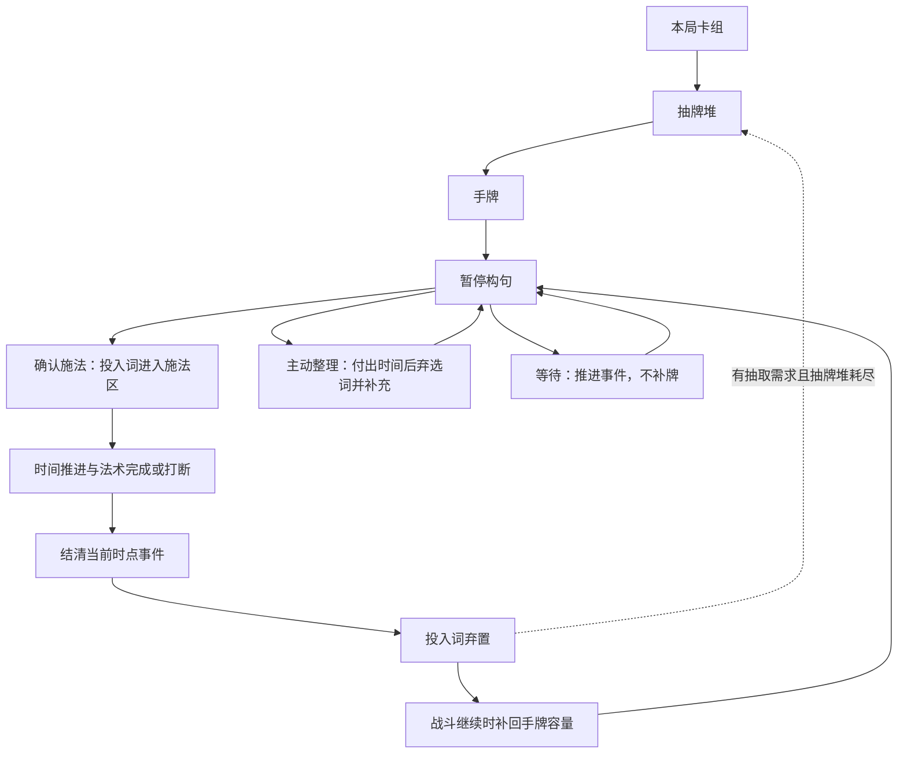

# 方案 A：时间轴下的词汇卡组循环

日期：2026-09-05
Project ID：game-002
状态：Raw Idea / Unqualified；方案 A 已选为细化方向，本页新增机制为待确认基线

本文以共享 idea-template 保存来源与资格记录，再组织完整的机制草案。用户已授权细化 A，尚未逐项采纳本页新增规则；本页不是正式 GDD、Proposal 或实现任务。具体卡牌数值、手牌容量、卡组规模、时间费用和转化比例继续后置。

## 原始想法

> 目前先按方案A继续细化，结合当前游戏设计和常见的卡组构筑游戏确定词汇循环机制

## 触发来源

- 用户在 2026-09-05 选择 [双路线评议中的 A](2026-09-05-vocabulary-cycle-alternatives.md)，要求结合当前设计与常见卡组构筑细化。
- 已有设计依据：[时间预算与施法打断](../idea-materials/M-2026-09-05-casting-time-and-interruption.md)，来源于初稿 Q2-Q8。
- 先前边界仍生效：具体数值后续讨论，先确定整体机制；设计细化不自动授权代码实现。
- 方案 B 暂不推进，保留其历史评议，不混入 A。

## 可能带来的玩家体验

玩家通过卡组组成决定可能掌握的表达，通过留牌准备后续句子，通过抽牌适应不确定性，通过耗时换词改善手牌。每次施法既改变世界，也让一部分词进入下一轮循环，从而形成“当前如何表达”和“为下一句保留什么”的取舍。是否形成此体验仍为 Hypothesis。

## 暂定标签

- 类型：卡组构筑、组合施法、时间轴战斗。
- 情绪：规划、应变、构筑成长。
- 玩法关键词：统一牌库、留牌、施法后补充、弃牌洗回、耗时整理。
- 风险关键词：语法卡手、语义不兼容、留牌锁死、小牌库循环、长句过牌收益、打断双重惩罚。

## 资格确认记录

已使用 grill-with-docs 核对原稿、时间素材及 A/B 比较。路线选择有用户依据，下文补牌节点、打断弃牌、起手保障等具体规则是 agent 提议，不能用路线选择代替全部规则确认。

| 资格问题 | 当前答案 | 状态 |
| --- | --- | --- |
| 设计对象及 GDD 章节 | 词汇生命周期、战斗资源循环与局内构筑；对应系统规格、组合、经济与成长章节 | Clear |
| 玩家处境及功能 | 在时间窗口内从手牌组织合法法术，调度以后可用的词 | Clear |
| 玩家行为及可见影响 | 抽牌/弃牌方向已由用户选定；补充时点、留牌与换词的完整基线见下文，尚待确认 | Unknown（新增基线待确认） |
| 预期反馈与价值 | 卡组选择影响表达范围和出现机会，留牌与换词影响连句计划 | Clear（设计假设） |
| 与当前构思关系 | 受既有时间与打断规则约束；B 不推进，具体数值不展开 | Clear |
| 未知项与验证方式 | 先确认补牌节奏，随后对留牌、卡手恢复及完整循环做纸面复核 | Clear（方法），未执行测试 |

### 当前缺口

- 是否采用“施法结束后补牌，未投入的词保留在手牌”作为基础节奏？这是本版最重要的新选择。

### 资格结论

- [x] Unqualified：A 的深化方向已选，新基线仍待用户审阅确认。
- [ ] Ready for Material Review：核心新增循环被确认后，按模块复审。
- [ ] Promoted：本页尚无对应正式素材；既有时间素材保持原状态。

## 常见结构与本作适配

以下为常见卡组构筑规则的结构性参照，基于通用设计知识；并非针对特定游戏最新版本的联网调查或完整产品案例。

参照《杀戮尖塔》的牌区、洗回及选牌/删牌结构，以及《领土》中增加新卡影响未来循环的构筑关系；来源、借鉴边界与待验证假设见[产品参照](../market-reference.md)。两者的回合流程均不直接移植。

| 常见结构 | 本作的机制建议 | 原因 |
| --- | --- | --- |
| 抽牌堆、手牌、弃牌堆分工 | 保留，并增加临时施法区 | 三类词需要一起组成一个完整动作，必须清楚哪些词已投入 |
| 用过的牌进入弃牌区，缺牌时洗回 | 保留普通词卡循环 | 增加、移除和重复词卡可以改变可用表达的出现机会 |
| 轮到玩家时补牌，回合结束清手 | 改为本次施法结束后补充，未用词保留 | 当前采用时间轴，没有已确定的整回合清手节点；保留跨句准备空间 |
| 抽牌、换牌与检索有机会成本 | 常规施法后补充与施法一起发生；主动换词单独耗时 | 保持正常循环，同时阻止暂停阶段免费无限挑牌 |
| 一张牌通常可以独立形成动作 | 本作仍由多张词卡共同形成法术 | 需要额外关注类别齐全和语义兼容，不能把普通手牌可用性照搬过来 |
| 获得、移除、升级改变卡组表现 | 保留这些构筑选择的方向，具体升级内容后续定义 | 局间选择要能改变局内表达，不能只有词卡数量增长 |

## 建议基线

以下 A-01 至 A-12 全部为待确认规则，数字只是条目编号，不是卡牌参数。

### A-01：词典、卡组与手牌的关系

- 词典记录本局获得的词卡；当前基础版建议普通获得的词卡进入本局卡组，不额外设计一个战前可随意换入换出的备用词库。
- 一副统一的战斗牌库混合主语、谓语、宾语等词卡；不默认按语法类别拆成多副独立牌库。
- 手牌是当前可用词。语法槽用于排列本次句子，不是永久安装该类词的装备位。
- 同名词卡可以有多个独立副本；一张具体词卡只占一个位置，不能同时填多个槽位。是否允许重复词出现在同一句由语法规则另定。

这样新增词、拒绝新词和移除词都会改变卡组的分布；若未来需要可编辑的出战子集，应单独评议其是否削弱局内选牌代价。

### A-02：牌的位置

| 位置 | 含义 | 是否可用于新句子 |
| --- | --- | --- |
| 抽牌堆 | 尚未抽到的战斗词卡，顺序对玩家隐藏 | 否 |
| 手牌 | 已抽到且当前持有的词卡 | 是，仍需满足语法与时间条件 |
| 施法区 | 已确认投入正在施放法术的词卡 | 否，不能重复占用 |
| 弃牌堆 | 普通使用、整理或规则要求弃置的词卡 | 否，等待牌库循环 |

当前普通循环不加入消耗区、永久遗忘区或定向回忆；未来特例另行评议。战斗弃置不等于从本局卡组永久删除。

### A-03：进入战斗

将本局卡组组成洗混的抽牌堆，按手牌容量获得起手词。卡组仍须有至少一条符合基础语法与语义兼容的有效句子，不能只检查是否存在三种词类。

建议构筑时检查基础可表达性，并在开场保障至少一条合法基础句，所有词仍来自自己的卡组。该保障只针对无法构句，不替玩家检索最强效果；具体起手保障方式待后续细化。正常补牌不承诺每次必有合法句，更不承诺始终有适合当前战况的强句。

### A-04：选择与确认

构句阶段保持时间暂停。玩家从手牌选词填入语法槽，确认前可撤回和改选，不改变牌库内容，也不抽新牌。

仅合法句子可确认施法；确认后投入词从手牌移至施法区，开始按已确认规则推进战斗时间。剩余预算不足时的预警或是否允许冒险施法，作为后续完整交互边界处理，不据此改变已有命中打断规则。

### A-05：成功与打断后的词卡去向

建议成功与被打断都把本次投入的普通词卡移至弃牌堆。成功产生整句效果，打断不产生整句效果，时间均保持已推进的结果，遵守既有规则。

该建议会让打断同时损失时间和本次关键词的即时使用权，但不永久删除词卡；后续补牌提供继续组织句子的机会。这个惩罚强度尚无测试证据，若压制过重需复审去向，不能以它已写入本草案就视为用户确认。

### A-06：补牌与留牌

本次施法结束、投入词归入弃牌后，自动从抽牌堆补充到手牌容量；未投入的词继续留在手牌。自动补充不额外收取一次准备时间，它是本次行动结束整理的一部分。

成功与打断都触发这次补充；敌人单独行动、玩家仅在构句、玩家等待，都不自动触发补牌。特殊效果导致的额外抽牌或手牌变化不在本版规定。

留牌的代价是占用容量，减少自动补充时能进入的新词；玩家可以持续留住有用的组件，但也可能需要放弃它们来改善整体手牌。

### A-07：与时间轴事件衔接

词汇循环必须遵守已有时间轴，不提供“敌人行动前免费插入新句子”的额外窗口。建议按以下阶段组织：

1. 本次法术完成或遭命中打断，处理对应效果；相等时点按已确认的玩家法术优先规则。
2. 结清当前时点尚需发生的敌方行动及其状态变化，不在其间开放新一轮构句。
3. 若战斗未结束，完成投入词的去向与自动补充，显示新的可用词及时间关系，进入暂停构句。

这是一份待确认的完整衔接建议；不规定多个敌方行动之间的顺序。后续新增会影响手牌的敌人能力时，必须补齐其与本次整理的先后。

### A-08：主动整理手牌

玩家可在决策时选定不需要的词，确认一次“整理”行动，付出正的战斗时间后弃置所选词并补回相应空位。允许整理整手，范围与耗时的具体关系后续定。

在确认与实际付出时间之前，不揭示新词；不能查看新牌后撤销整理。时间推进中的敌方行动正常发生，玩家承担受击风险。整理是准备动作，本版没有把它定义为可被施法打断规则取消的咒语。

整理结束只执行一次对应补充，不再叠加一轮“施法结束补牌”。整理过程中若战斗已经结束，则停止本次战斗的后续词卡调度。

### A-09：等待与无法构句

没有合适句子时，玩家可以耗时整理，也可以保留手牌并等待下一项会推进战斗的事件。等待推进时间并处理事件，不换牌、不自动补牌、不重置敌方计时。

明确区分三种情况：

- 无合法句：由整理与基础卡组可表达性检查处理，仍需验证卡手频率。
- 有合法句但不适合战况：这是留牌、换词和承担风险的正常取舍，不能自动免费发解题牌。
- 整副卡组本就没有合法基础句：应在卡组形成或修改时阻止该状态，不能指望战斗中反复洗牌解决。

整理提供可执行的恢复路径，不保证玩家每次整理必抽到想要的词。若仍频繁因语法组合无法行动，优先复审抽取保障和卡组组成约束，不靠调整伤害掩盖这个问题。

### A-10：牌库耗尽

有抽取需求但抽牌堆不足时，先抽完现有抽牌堆，再将弃牌堆洗回继续抽；不足的部分能抽多少抽多少。仍在手牌或施法区的词不参与洗回，不复制、不从卡组外补词。

若所有词已在手牌或施法区，允许手牌未满，不凭空产生卡牌。留牌会改变弃牌循环内的组成，这是构筑和调度的一部分；小牌库是否过强需后续验证。

### A-11：战斗之间与本局结束

普通抽取、使用、弃置都只是战斗内位置变化。下一场战斗重新用当时的本局卡组建立抽牌堆，不继承上一场的手牌与抽取顺序。

局间获得、拒绝、移除和升级词卡是构筑决策：它们改变以后能形成的句子以及组件出现机会。普通词卡弃置不会永久缩小本局卡组；局外解锁与持久成长继续保持未定，不混入词汇循环基线。

### A-12：基础循环的可见信息

建议玩家能查看本局卡组构成、自己的手牌、施法投入词、弃牌内容及各区数量；抽牌堆当前顺序保持未知。选词时需要可见合法性与无法组合的原因，准备动作需要显示时间代价。

这些是理解构筑和时间取舍所需的信息要求，不在本轮制作界面或规定具体视觉布局。

## 完整循环概览

图示为草案的普通循环。战斗结束会退出循环，具体胜负规则未在此新增；“投入词弃置”与“弃牌洗回”不会撤销已经发生的时间或法术结果。

## 核心取舍与风险复核

| 选择 | 获得什么 | 放弃什么或风险 |
| --- | --- | --- |
| 留住关键词 | 保留后续组合的确定组件 | 占用手牌容量，减少新词进入 |
| 立即施法 | 改变世界并让投入词进入循环 | 消耗时间和当前组件，可能被打断 |
| 整理手牌 | 改善当前词语组合 | 花费时间，可能让敌人先行动 |
| 拿新词 | 扩展表达或强化某类句子 | 稀释其他组件的出现机会 |
| 移除词 | 提高某些组件的出现频率 | 缩小解法范围，可能破坏基础可表达性 |
| 构筑更长句 | 候选表达能力更强，且可能带来更多词的轮换 | 同时影响施法耗时与过牌收益；必须检查是否出现为刷牌而造句 |

重点风险：卡手与打断惩罚叠加；长期留牌形成高度稳定套组；起手保障抹平构筑差异；短小卡组过快循环；长句仅因补牌量而占优。它们目前是待验证风险，不能写成已发生的测试结论。

## 未知项与最小验证

当前最关键的设计选择是补牌节奏：本版建议施法结束补充、未用词保留。它决定本作如何在没有传统回合清手的情况下形成牌库循环，优先交给用户确认。

随后用不依赖具体伤害数值的纸面状态推演检查以下场景：

| 场景 | 草案预期 | 验证目的 |
| --- | --- | --- |
| 合法施法成功，手里仍有未用词 | 投入词弃置，未用词留下，补充空位 | 解释留牌与常规循环 |
| 法术完成前命中打断 | 整句无效果、时间不退；按候选处理投入词弃置并补充 | 检查是否可理解、惩罚是否过重 |
| 法术与敌方攻击相等时点 | 法术先处理，结清该时点攻击后才开放新决策 | 排除补牌造成的免费抢行动 |
| 手牌无法形成合法句 | 可选择耗时整理或等待，没有免费筛牌 | 检查可恢复性与节奏 |
| 留牌导致牌库循环池很小 | 只洗回弃牌，不复制手牌 | 检查牌的位置守恒与构筑效果 |
| 抽弃两堆均空 | 停止抽取，保留实际能获得的牌 | 检查不足处理，不生成新词 |
| 连续点击查看或改选句子 | 不推进时间、不更改牌库 | 检查暂停构句边界 |
| 战斗结束后进入下一场 | 用当前本局卡组重新建牌库 | 区分战斗调度与局内构筑 |

本轮未运行原型或玩家测试。用户确认主要循环后，复审素材资格；试玩时应分别记录无法造句、选择换词、主动留牌、固定套组、为抽牌而施法的行为。数量、成本和成功阈值后续定义，不虚构参数来通过验证。

## 下一步

- [x] 根据用户选择，独立细化方案 A；B 保留为暂不推进候选。
- [x] 把常见卡组结构与既有时间轴、组合施法逐项对齐。
- [x] 写明所有新增基线待确认，具体数值和代码实现均未启动。
- [ ] 先确认“施法结束补牌、未用词留手”的核心节奏。
- [ ] 审阅其余会改变整体循环的规则，复审合格素材资格。
- [ ] 用户后续明确授权且具备设计来源后，才进入实现流程。
