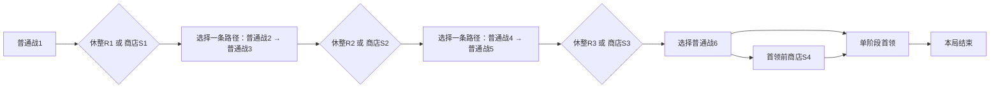

# 首版完整路线、遭遇与疲劳推荐

日期：2026-09-14。版本RG v0.1。状态：**Raw Idea / Unqualified／整局内容与参数候选，尚未采纳**。本页补DG20–22及PV02／09／11，并对PG渠道提出一项实际修订；仍待HG／WG／SG／CG／PG／EG相关选择。不是GDD、正式平衡或玩法测试报告。

## 原始想法

用户要求逐步补齐全部缺口，再写全游戏GDD。当前已给单卡参数与渠道，但完整路线、敌人、生命、休整和疲劳输入尚空缺。本页将它们写成可从开局走到首领的实际表，不以“以后配置”代替内容。

## 触发来源

- 已采纳：[首版S2／空间与转化](../idea-materials/M-2026-09-13-first-release-content-scope.md)、[BR](../idea-materials/M-2026-09-13-pre-gdd-recommendation-batch.md)、[HG01](../idea-materials/M-2026-09-14-element-status-host-eligibility.md)。
- 现有素材：[单向路线](../idea-materials/M-2026-09-06-branching-run-routes.md)、[购物机会](../idea-materials/M-2026-09-07-shop-nodes-and-spending-opportunities.md)、[胜负](../idea-materials/M-2026-09-05-normal-combat-outcomes.md)、[疲劳](../idea-materials/M-2026-09-11-overtime-fatigue.md)、[四层数值框架](../idea-materials/M-2026-09-11-numerical-evaluation-framework.md)。
- 待审依赖：[WG／SG范围与起点](2026-09-14-host-range-starting-content.md)、[CG接口](2026-09-14-card-interface-completion.md)、[PG单卡参数／渠道](2026-09-14-first-release-parameters-and-channels.md)、[EG环境形态／阈值](2026-09-14-environment-forms-and-thresholds.md)。
- 整局新初值与规则细化由agent提出供审阅；不从旧TH／CAL抽取获胜案例或把旧疲劳证明当本版证据。

## RG01：一局的实际规模与起点

- 单次通关路径包含**6场普通战斗＋1场单阶段首领战**。
- 第1、3、5场普通战斗后各有一次“休整或商店”的路线二选一，共3次；选择商店不会同时得到休整。
- 第6场普通战斗后另有一次**可跳过的首领前商店S4**，让该场已领取金币可用于首领前购买；不附带恢复或免费词卡。
- 开局玩家生命上限100、当前生命100、护甲0、其他战斗状态为空、金币0；起始词卡／法杖采用待审SG01的12张词卡与4根原木杖，所有可换槽为空。
- 本局生命上限固定100，不因推进、购买法杖、词包或首领前准备而自动增长。普通胜利保留实际剩余生命；只有明确休整恢复补回生命。
- 普通金币沿PG候选每战8＋时间奖金0–4；首领胜利直接结局，**不再生成可领取／可花费的战后奖励包**，只记录本局结果与剩余资源。没有额外通关货币、永久收藏、下局解锁或局外成长。
- 敌人、地面、树木、元素和战斗状态每战按本场表重新建立；当前生命和已持有资源跨战保留。战斗退出沿BR09同场开头锁定重播，不重新抽图、重配或重复取得收益。

## RG02：实际路线连接、随机与可见信息

下图为路径结构摘要；“二选一”表示选择具体节点，不是多领取一次收益：

| 当前节点 | 可进入的后继 | 连接说明 |
| --- | --- | --- |
| C1 | R1或S1 | 第一场普通金币已整体领取／放弃后再选路 |
| R1／S1 | C2L或C2R | 第二战二选一 |
| C2L／C2R | C3L／C3R之一 | 开局随机确定直连或交叉的成对连接，每个第二战节点只有一个第三战后继 |
| C3L／C3R | R2或S2 | 不会因为选中哪条战斗路径而缺失这次休整／购物选择 |
| R2／S2 | C4L或C4R | 第四战二选一 |
| C4L／C4R | C5L／C5R之一 | 另一个独立随机的直连／交叉成对连接 |
| C5L／C5R | R3或S3 | 第三次休整／购物选择 |
| R3／S3 | C6L或C6R | 第六战二选一 |
| C6L／C6R | S4或CB | 可看地图后跳过商店直达首领；未进入时不看具体货架 |
| S4 | CB | 离店不返回第六战或其他节点 |
| CB胜利／任意战败／认输 | 本局结束 | 终局不再继续图上其他节点 |

开局对2→3与4→5两组成对连接各作一次等概率直连／交叉选择；每个双节点层的两份遭遇还可等概率交换显示左右位置。内容仍只来自本页固定遭遇，连接和分布不读取玩家后来构筑、生命或金币。随机左右只是展示分布，不额外计作策略或内容量；两组连接产生4种实际配对方式。

一个固定图中有128条通向首领的路线选择序列：3次休整／购物选择、3次战斗路径选择、1次是否进入S4。每条正常通关路径走10或11个节点，包含同样的6场普通战斗和1场首领；进入S4多走一个非战斗节点。路线结构可达不等于玩家必胜。

**可见信息推荐**：从开局可查看整张图的节点、连接、环境主题、敌人种类／主要机制与下一次休整／商店；数值、完整十格布场及明确攻击时刻在进入该战前配置后展开。路线在本局固定，查看不会重抽。具体货架只在进店时生成并公开；休整仍先选分支后才生成词包。

第二战选路时已能看见其唯一第三战后继，不能走完第二战再偷偷改配对；查看路径不承诺后续胜利、目标始终存活或状态永远不变。

## RG03：敌人模板与公开攻击计划

所有敌人为敌方；固有属性独立于当前元素状态及脚下地面。表内生命为入场当前生命及固定上限，均是正整数。初始护甲是普通护甲状态，无反刺或其他特性；未列的状态、被动、属性修正均无。

| ID／敌人 | 固有属性 | 初始生命／上限 | 初始护甲 | 攻击时刻（k从0起） | 每次伤害 | 主要机制 |
| --- | --- | --- | --- | --- | --- | --- |
| EN01 巡卫 | 无 | 48 | 0 | 12＋12k | 4 | 单个等间隔普通攻击 |
| EN02 藤卫 | 草 | 44 | 20 | 14＋12k | 6 | 初始护甲；被火法术克制、克制冰法术 |
| EN03 霜卫 | 冰 | 52 | 12 | 12＋12k | 6 | 初始护甲；被草属性关系克制、克制火法术；本期不因此加入草法术 |
| EN04 焰卫 | 火 | 72 | 8 | 14＋10k | 7 | 较密攻击；被冰法术克制、克制草属性关系 |
| EN05 快卫 | 无 | 32 | 0 | 10＋8k | 3 | 低单次伤害、短攻击间隔 |
| EN06 锤卫 | 无 | 72 | 24 | 18＋14k | 10 | 高单次伤害、较长间隔 |
| EN07 甲卫 | 无 | 40 | 16 | 12＋10k | 4 | 适合观察真实护甲损耗与拆甲 |
| B01 刻印守门者 | 无 | 180 | 24 | 16＋20k；24＋20k | 前式12；后式16 | 单阶段交替攻击；无召唤、复活、变身、阈值增伤或额外状态 |

k取0、1、2……；例如巡卫在12、24、36……刻攻击。普通敌人每个列出的时刻执行一次对玩家的普通直接伤害，先护甲后生命；不攻击地面、树木或元素，不因出现元素改变目标，不附带燃烧／冰冻。首领两列是交替计划的两个时点序列，每个时点只有一次攻击，不是同一攻击的两段伤害。

首版敌人不持有玩家的循环法术、可换镶嵌或自动蓄势机制；其当前完整攻击安排不会因脚下地面变化、自己护甲清空或承受元素状态而自行改期。法术系统没有对应敌攻改期权限时，不把“完成冷却”用于敌方计划。此处是实际首版敌人能力白名单，不扩成未来敌人都只能普通攻击的永久约束。

击败敌人即清理其尚未发生的攻击和状态，已生效结果保持；生命耗尽而还有护甲也离场。胜负沿完整事件检查；同刻多个敌人攻击按公开次序逐个完整结算，先前已结束战斗则后面的攻击不发生。

## RG04：12个实际遭遇与十格布场

格子为前排F1–F5、后排B1–B5。表中每个“模板＠格子”创建一个独立敌人，重复模板仍是不同身份。所有未列草地的格子为普通石地，所有未列敌人／树木／元素的占位位置为空；不另藏障碍物。

| 遭遇ID／节点 | 敌人模板＠格子（公开先后） | 草地格 | 树木格（公开先后） | 预置元素 | 初始总耐久 | 设计用途 |
| --- | --- | --- | --- | --- | --- | --- |
| C1 第一战：入口 | EN01@F3 | F2、F3 | 无 | 无 | 48 | 首个敌旁F2／F4／B3都有空位；支持初始火焰生成＋操控 |
| C2L 第二战：藤径 | EN02@F3 | F2、F3、F4、B2 | F2 | 无 | 64 | 树占一个敌旁位，另有空位；火可利用草属性，冰要承担被克制 |
| C2R 第二战：霜阶 | EN03@F3 | B2 | 无 | 无 | 64 | 火受霜卫克制；护甲操作和基础伤害仍可用 |
| C3L 第三战：余焰 | EN04@F3 | F2、F3、B2 | F2 | 无 | 80 | 面对火属性敌人，选择冰状态操作或直接攻防；不暗送逆霜 |
| C3R 第三战：双哨 | EN01@F2；EN05@F4 | F2、F3、F4、B3 | B3 | 无 | 80 | 两个目标在中央原木范围内；攻击时刻分别12＋12k、10＋8k |
| C4L 第四战：锤门 | EN06@F3 | F2、F4、B3 | F2、F4、B3 | 无 | 96 | 首敌被树包围，无合法敌旁出生格；范围内仍有空格但走回退 |
| C4R 第四战：分岗 | EN02@F2；EN05@B4 | F1、F2、F3、B3、B4 | F3 | 无 | 96 | 前后排目标分开，树不阻挡后排；单一范围未必覆盖全部 |
| C5L 第五战：焰哨 | EN04@F3；EN05@B5 | F2、F3、F4、B3、B4 | F2、B3 | 无 | 112 | 优先敌人仍F3，F4保留一个出生格；后排快卫要求范围取舍 |
| C5R 第五战：霜甲廊 | EN07@F2；EN07@F4 | F2、F3、F4、B2、B4 | 无 | 冰霜＠F3，16层 | 112 | 两个甲卫可同时受中央中立冰霜作用；可用一张冰霜卡引用既有执行者 |
| C6L 第六战：双属门 | EN02@F2；EN03@F4 | F2、F3、F4、B3 | B3 | 无 | 128 | 同范围不同固有属性，叠层速度及自然衰减不同 |
| C6R 第六战：重轻门 | EN06@F2；EN05@B4 | F1、F2、F3、B3、B4 | F3、B3 | 无 | 128 | 两种攻击节奏与前后排目标，预览不临时重排 |
| CB 首领：刻印门 | B01@F3 | F2、F3、F4、B2、B3、B4 | F2、B3 | 无 | 204 | F4保留合法出生格；树可转化形成其他元素，首领单阶段 |

公开初始对象顺序推荐：玩家在先；随后是该表敌人的列出先后、树木的列出先后、预置元素的列出先后；最后是地面F1至F5、B1至B5。新生身份沿既有规则按确定生成先后追加。敌人同刻攻击取表内顺序；这个实际首版初始顺序不改变元素空格选择的前排从左到右、再后排从左到右规则。

预置冰霜为**中立、冰固有属性、16层共享冰冻、衰减进度0、无创建法杖、无生成修饰或镶嵌特性**。它在第0刻环境阶段可正常自动邻近，状态阶段可自然衰减；玩家可以按CG合法角色引用它，但不会因为命令它而把所有权改成本杖。它的存在与归属依待审HG02；16层为本次实际初态推荐，不是所有场景元素的默认量。单看默认衰减且不发生其他层数变化时，它在第15刻状态阶段归零，能供最早第6刻的“冰霜／伤害／敌人”或第7刻的“冰霜／拆甲／护甲”引用；原拟6层会在第5刻消失，不能支撑该操控例。实际抵消、补层与共享槽仍可改变是否成功。

各敌人的固定属性由模板给出，即使站在草地也不会变草属性；灼痕／烧焦／霜蚀／冻裂沿EG，不使树木和草地变成玩家单位。所有树木与草地以无痕迹、无状态入场。环境没有生命、护甲、掉卡或自主攻击。

表内“总耐久”仅是该场敌人初始生命＋护甲之和，用来检查静态预算；它不是额外护盾条，也不代表穿甲、拆甲或状态下的真实战斗时长。普通阶梯为48、64、80、96、112、128；首领204，不给每个敌人再乘一次整体预算。固定属性和攻击时序是独立难度轴，不能只凭总耐久宣布两条分支等难。

### 两个空间边界

- C1原木杖锚点F3时，F2是合法首选空格，可生成火焰并让另一根同范围杖后续操控；实体来源沿SG，不额外赠词。
- C4L首个敌人在F3，F2、F4、B3均为树木，其余格即使空着也没有合法敌旁出生点。普通释放走回退；树木在对应持续释放覆盖下按EG可转化。满溢可改变这次回退结果，但不会把树木直接挤走。

这两项是规则／地图可表达性检查，不是对局胜利或释放时间已经验证。

## RG-C01：原木杖商品的冗余修订（新增推荐）

SG01初始已经给4根原木杖，出战上限也是4，固定芯／范围相同且没有损坏、消耗或转卖。继续出售额外同款原木杖不会增加可用配置，因此建议：

- 原木杖仅通过每局初始资源取得，**不进入商店池**，无购买价格；换下来的原木杖继续保存在库存，可重新选用。
- 节律杖与余火杖仍按PG从期2入店，单根各16金币；每店法杖名额仍1。
- 期1尚无可售法杖时，这一名额为空，商店实际为4词卡＋2镶嵌，不用原木杖或未设计物品补满。
- 期2及以后从节律杖／余火杖两个合格款式等概率选一根；本局可买同款不同实体，仍最多出战4根。固定芯同组按BR去重，不把同款多持有变成无条件叠加。

这是对WG／PG早先“原木杖可购、价格12”的**当前推荐修订，尚未采纳**；旧候选保留追溯。若用户改变起始法杖规模或出战上限，需要重审冗余结论，不能先把该修订写成永久商品规则。

## RG05：休整、金币与可达成长

每次休整可选择恢复**24点生命**（不超过100），或按PG当前启用期取得一次既定三选一词包；二者互斥，也可跳过。选择词包后拒收不返还恢复。商店不恢复生命，休整不发金币；本局最多3次休整、最多恢复72点名义生命，实际量取决于当时缺失量，不能把72点自动加到上限。

| 时点 | 已完成普通战斗数 | 若此前胜利全领取、从未消费的金币区间 | 可见成长机会／启用期 |
| --- | --- | --- | --- |
| R1／S1 | 1 | 8–12 | 期1：18种词、6镶嵌；按RG-C01暂无法杖商品 |
| R2／S2 | 3 | 24–36 | 期2：累计30种词、14镶嵌，2款可售法杖 |
| R3／S3 | 5 | 40–60 | 期3：全部34词、19镶嵌均有渠道资格 |
| S4／首领前 | 6 | 48–72 | 保持期3；S4可用最后一场普通金币，或主动跳过 |
| 首领胜利 | 6 | 实际剩余 | 不新发奖励、不开放战后商店，本局结束 |

以上区间是**无消费、全领取的算术范围**；实际余额＝累计已领金币−已成功购买支出，不能在每个节点重置成表内数值。价格与商品资格沿PG＋RG-C01修订，随机池不根据余额／构筑调整。

首次购物购买力可静态核对：正常SG起点下期1词卡均未到同名上限，第一场仅基础收入8金币也能买任一已展示的期1词卡（4或6金币），不需要时间奖金；不保证能买10–12金币镶嵌或凑成指定组合。拒收收入的玩家不在这项保证内。

全部34词和19镶嵌从期3有至少一个实际获取时点：R3／S3及可选S4。进入池不保证本局货架一定出现某件物品，也不保证每种词都能在一局取得3张。每个休整最多取得1词；四店最多展示16个词、8个镶嵌名额和3根实际可售法杖，跨店重复、余额与额度仍会降低实际获得量，不把名额当免费发放。

可达构筑检查需要记录实际路线、货架、领词／恢复选择和支出。期1可直接使用初始伤害、防护、火焰生成与操控；印记、复诵、蓄势与更多元素支付组合只能在实际获得对应词／镶嵌后形成。不能为了达到成长指数在后台增加副本或改商品。

## RG06：完整疲劳候选

执行类别沿BR08，以下补齐新参数及其适用条件；不沿用旧2%／10次候选的结论。

| 项目 | 本版候选 |
| --- | --- |
| 普通进入疲劳刻F | 56 |
| 首领进入疲劳刻F | 96 |
| 生效时点 | 第F刻开始先进入疲劳并禁疗，再按法术→敌攻→环境→状态顺序；F刻不扣疲劳生命 |
| 首次扣血 | F＋4，即普通60、首领100刻 |
| 后续间隔 | 每4刻；第k次在F＋4k，k从1起 |
| 生命上限基准Hf | 对每个玩家／存活敌人，在进入疲劳时取其自身正且有限的生命上限，之后不因任何冷却或形态事件重置 |
| 第k次名义扣血 | ceil(Hf×k÷20)；这是疲劳专用向上取整，不套普通伤害的向下取整 |
| 实际扣血 | min(该对象当前生命，名义扣血)，不得记入溢出量 |
| 交付与胜负 | 每次环境阶段开始，作为一次完整疲劳事件统一交付玩家与所有存活敌人的损耗后检查一次；同刻双亡玩家失败 |
| 作用对象 | 仅玩家和活着的敌人；树木、草地、石地、元素无生命，不扣“疲劳层数” |
| 护甲／伤害联动 | 不消耗甲，不受伤害增减、抵挡、反弹、转移；不计支付或普通生命伤害，不触发冷却打断／反刺／返甲 |
| 禁疗 | F刻起在实际结算处禁止一切法术生命恢复；已有持续恢复也拦截，复合效果其余部分按原规则 |
| 时间与退出 | 共同战斗时钟；无法被清除／改期／重置。同场开头重播沿锁定输入重现，不借退出延迟该场结果 |

若第F刻的法术或敌攻已先结束战斗，不再处理其后的环境／状态；此前结束的战斗不会为了显示疲劳提示而重新继续。自然衰减、自噬、长期储层、无目标或只生成护甲都不暂停疲劳钟。

### 有限终局的明确前提及数学上界

此推导只覆盖同时满足以下条件的候选输入：玩家与所有活敌人的Hf均有限且大于0；进入疲劳时当前生命≤Hf；疲劳期间没有任何恢复生命、增加生命上限附带回血、复活、换身份恢复、替身代扣或新敌人加入；损耗按本表交付且不被免疫。首版实际内容没有这些能力；后续加入时必须重审。

前6次名义扣血之和至少为Hf×0.05×(1＋2＋3＋4＋5＋6)＝1.05Hf，向上取整不会减小它。因此任何届时仍存活的对象最迟第6次耗尽生命：**普通最晚80刻、首领最晚120刻**；更早的法术、敌攻或状态可以先成立胜负。

这是对完整候选规则的数学推导，不是已经运行的对局证据，也不证明纯防御等待与主动进攻已平衡。它覆盖不造成伤害、长期储层等允许配置的结束上界；只有进入疲劳而不验证实际损耗交付仍不足以证明实现符合。

| 首领疲劳次数k／时刻 | 玩家Hf＝100的名义扣血／扣后生命 | 首领Hf＝180的名义扣血／扣后生命 |
| --- | --- | --- |
| 1／100 | 5／95 | 9／171 |
| 2／104 | 10／85 | 18／153 |
| 3／108 | 15／70 | 27／126 |
| 4／112 | 20／50 | 36／90 |
| 5／116 | 25／25 | 45／45 |
| 6／120 | 30／0（实际扣25） | 54／0（实际扣45） |

这个算例假设双方进入疲劳时满生命、期间无其他生命变化，只校对疲劳算术；第6次为同次双亡，按规则玩家失败，不能记成胜利。不能把该前提当成真实战斗会发生的状态。

## RG07：整局压力与成长验收候选

目标在运行前登记；当前均没有新输入下的达成证据。

| 观察项 | 候选目标／处理 |
| --- | --- |
| 普通正常战斗节奏 | 沿NF候选：A组胜利T中位20–40刻、P90≤60；全部允许配置按含疲劳最晚80刻检查 |
| 首领节奏 | A组胜利T中位40–70刻、P90≤90；全部允许配置按含疲劳最晚120刻检查 |
| 每场普通胜利生命损耗 | A组中位5–15点；另外列零损耗比例与高损耗尾部，不要求每一局强制掉血 |
| 首领胜利生命损耗 | A组中位10–30点；入场生命与普通战后累计损耗同时报告 |
| 普通前缀压力 | 初始100，三段休整机会前分别经历1／2／2场普通战；R3／S3后为1场普通＋首领，另有S4购物但无恢复 |
| 回复机会成本 | 每次24恢复与一次词选择互斥；选择商店还会放弃整次休整，不能把所有路径当作72免费恢复 |
| 首次基础购买 | 首战基础8金币足以购买已展示合法基础词；拒收收入或主动消费分别记录 |
| 早结束／秒杀 | 沿NF警报：普通12刻／首领18刻前结束、最早合法作用前死亡、仅一次有用法术且敌人未完整作用，都逐例审查；不因划入B组自动放行 |
| 单次压力 | 满足正常入场条件时，普通单次生命损伤不得超过入场生命50%；仍检查受伤后冷却连锁取消 |
| 成长 | 同一初始遭遇回测时，实际成长资源至少改善速度、生命损耗或合法策略宽度之一；敌人不随玩家临时涨数值 |
| 策略宽度 | 在实际可得同预算资源中，至少3类有不同操作／成本取舍的可行策略；改起点或换同义名不凑数 |
| 等待收益 | 不允许无界产金／产词；金币按整局有限6次胜利容器与固定商店记录；疲劳伤害不归功于某张护甲卡 |
| 整局生命账本 | 每节点记录入场、实际损耗、恢复、离场；前缀生命必须实际为正，不能只看全程累计有足够治疗 |
| 渠道可达性 | 按实际掉入的商店／词包、启用期、同名上限、金币和分支核对；名义池里有卡不等于该样本取得卡 |

A组正常输入建议在冻结时预先列明：同阶段真实可获取资源、入场生命至少50、包含合法主动输出途径的基准方案，覆盖偏攻、攻防、印记／连发和元素操控等当期可达方案；相位与范围不能只保留事后获胜值。具体基准名单须在执行前登记，不在看结果后挑选。纯零输出、极端相位、残血与其他允许配置进入B组并保留同样的终局／早败警报；真实玩家选择归C组，不能拿枚举胜率冒充玩家胜率。

整局生命量级例：六场各损10点、首领损20点、一次实际恢复24点，则理论离场剩44点；但仍须检查恢复前有没有先死亡、恢复时是否确实缺24点以及实际路线是否经过该休整。此例只解释账本，不是实测损耗，也不承诺任何路线通关。

一刻对应秒数、观看倍速、决策用时和整局现实分钟数已由[UX04／06候选](2026-09-14-interface-platform-and-experience.md)补齐，仍待选择；不能仅凭80／120逻辑刻声称等待体验达标。RG的A组还需逐个列出真实资源基准和预期检查，不在结果出来后挑样本。

## 可能带来的玩家体验

玩家看到真实分叉、敌人属性、攻击节奏及恢复／购物位置，再决定怎样编排和发展。最后一场金币有消费机会；环境回退和转化各有具体场景。疲劳的进入、首扣与终点压力能提前读懂，而不改变已排法术的自动运行。

## 暂定标签

- 类型：Run／Encounter／Economy／Fatigue／Constraint。
- 关键词：6普通＋首领、三次休整购物取舍、最终商店、12遭遇、逐敌攻击、完整疲劳。
- 风险：空货架／冗余商品、静态预算冒充平衡、候选证明被当运行结果、前缀残血被平均值隐藏。

## 资格确认记录

| 资格问题 | 当前答案 | 状态 |
| --- | --- | --- |
| 设计对象／章节 | DG20–22，PV02／09／11；整局路线、战斗内容、经济压力、全局疲劳 | Clear |
| 玩家处境 | 在固定本局路线中选分支、成长、承受跨战生命风险并挑战首领 | Clear |
| 行为与反馈 | 19个图上节点、每条10–11节点、12遭遇、实际生命／攻击、恢复与购买机会 | Clear |
| 设计价值 | 把卡池放进真实整局输入，暴露获取、空间与终局问题 | Clear |
| 与已有关系 | 保留单向路线、无构筑自适应、整体收益、四阶段及BR疲劳分类；依赖未选WG／SG／CG／PG／EG | 候选依赖明确 |
| 最大未知／下一步 | 整局规模／可见信息／内容／初始次序／RG-C01商品修订／疲劳初值与压力目标需审阅 | 待选择 |

### 当前缺口

此页是完整整局推荐，不是用户已采纳的事实。尤其原木杖不售、首领前S4、首领不再发奖励包、实际初始对象顺序与整图信息公开，须随本组明确选择；不能从旧“均按推荐”推断未展示的新内容已通过。

### 资格结论

- [x] Raw Idea / Unqualified，完整内容与来源先保留。
- [ ] 依赖与选择明确后晋级正式素材。
- [ ] 通过新玩法／整局／玩家验证。

## 下一步

[UX实际界面／体验／功能资产](2026-09-14-interface-platform-and-experience.md)已给；按[26组总审](../../docs/pre-gdd-content-review-2026-09-14.md)处理待选依赖，并补规范化未来验收输入与真实资源基准。已确认部分及时晋级，全部写作前缺口收束后再写GDD Wiki，不把候选文档或数学推导当作GDD已完成。
