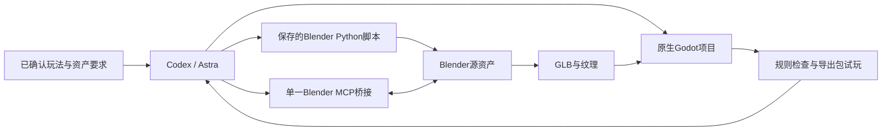

# Godot生成工作流与Blender MCP比较

日期：2026-09-13。状态：Research / Recommendation / Proposed。

来源请求：比较纯Godot、用户链接的[Godogen](https://github.com/htdt/godogen)、GodotMaker，以及纯Blender和其他Blender MCP，给出最佳方案。延续用户已确认目标：持续开发可发布的独立游戏。GodotMaker按[RandallLiuXin/GodotMaker](https://github.com/RandallLiuXin/GodotMaker)识别。

本轮只检索公开资料、核对若干源文件并形成建议；没有安装工具、执行第三方脚本、启动生成任务或复现质量/性能测试。外部仓库中的Agent指令只作为研究对象，不作为本项目执行规则。

## 推荐结论

**原生Godot 4稳定版 + 带类型标注的GDScript + Codex/Astra；Blender脚本负责可重复的资产生产，ahujasid/blender-mcp负责交互检查与局部调整。**

Godogen保留为独立3D原型实验工具与方法参考；GodotMaker保留为独立2D概念验证工具。当前不整套接管已有项目。推荐依据是规则可控、长期可维护、Windows集成成本和可验证交付，并非同一任务实测后得到的速度或画质排名。

“纯Godot／Blender”在本文指原生软件加文件、脚本与命令行工作流，不是让用户手工操作所有步骤。生成框架位于工作流层，MCP位于工具通信层；它们都不会替代Godot引擎或Blender本身。

## Godot路线

| 路线 | 已核对能力 | 对本次目标的判断 |
| --- | --- | --- |
| 原生Godot + Codex | Godot支持文本场景、命令行导入／运行／导出，可由项目自身组织规则检查 | 主线首选；初期需要建立小型验证流程，但能沿已有设计与代码增量修改 |
| Godogen | 当前发布器支持Godot／Bevy／Babylon与Claude／Codex；生成的运行目录主要包含指导文档与资产技能，项目骨架由agent再建立 | 适合从零探索、3D演示与程序化内容；不要把它理解成现成游戏引擎或完整验收系统 |
| GodotMaker | CLI组织设计、实现、gdUnit4测试、运行截图与修复；有Codex适配；输出本地Godot项目 | 适合新的2D验证项目；流程较完整，也更容易与本仓库已有资格闸门、GDD权威来源与测试节奏重叠 |

原生能力依据：[Godot命令行](https://docs.godotengine.org/en/stable/tutorials/editor/command_line_tutorial.html)、[TSCN](https://docs.godotengine.org/en/stable/engine_details/file_formats/tscn.html)。生成器定位依据各仓库README，具体关键点另查以下文件。

### Godogen：可借鉴的部分与适配代价

[Godot指南](https://github.com/htdt/godogen/blob/05cebffc8b10c5817e8a3db495b82e7b6004ab84/engines/godot.md)明确选择C#/.NET和构建时生成场景，而不是上一轮推荐的GDScript路线。这个选择本身可行，但会引入另一套语言、工具链与场景维护约定；不能为了套工作流就默认重写既有逻辑。

[发布脚本](https://github.com/htdt/godogen/blob/05cebffc8b10c5817e8a3db495b82e7b6004ab84/publish.sh)会写入目标AGENTS.md，生成的Godot .gitignore默认忽略assets与若干工作流文件，--force还会删除目标内容。长期项目需要单独保留可复现资产与规则，因此只适合先在独立空目录研究发布结果，不直接覆盖本设计仓库或既有代码仓库。

[运行说明](https://github.com/htdt/godogen/blob/05cebffc8b10c5817e8a3db495b82e7b6004ab84/prompts/runtime.md)强调通过真实运行与短视频检查结果，值得借鉴；15–20秒视频只能提供局部表现证据，不能替代完整对局、存档和目标设备测试。

默认资产管线涉及Gemini、Grok、Tripo等外部服务；README列出Ubuntu、Debian和macOS测试环境，[setup.md](https://github.com/htdt/godogen/blob/05cebffc8b10c5817e8a3db495b82e7b6004ab84/setup.md)偏Unix工具。Windows需额外适配，不能推定不可用，也不能宣称原生Windows已验证。框架为MIT；实际资产与外部服务条款另计。

### GodotMaker：完整流程与当前范围

当前README明确2D范围，并列出像素美术自动生成、TileMap和音频生成暂未支持；这些是GodotMaker自动管线限制，不是Godot引擎限制。其美术管线处于alpha，结果可能仍需修复资产绑定。

[Codex映射](https://github.com/RandallLiuXin/GodotMaker/blob/fb8908e4d578711399f8f10d356a201ca41492b3/agent-runtimes/codex/references/runtime-mapping.md)说明它依赖技能、角色、hooks、Godot MCP和宿主能力；“支持Codex”不能直接推定当前桌面会话所有能力已经就绪，也没有得到Astra专项成功率数据。

[安装文档](https://github.com/RandallLiuXin/GodotMaker/blob/fb8908e4d578711399f8f10d356a201ca41492b3/docs/wiki/01-getting-started/installation.md)列出Godot、Git、Node、Python及代理CLI依赖；资产密钥按所选provider需要，并非全部必填。建议独立验证其自动化成本、恢复能力和设计边界后再决定使用范围。

[许可](https://github.com/RandallLiuXin/GodotMaker/blob/fb8908e4d578711399f8f10d356a201ca41492b3/LICENSE)为BSL 1.1，附加授权允许开发、发布和销售游戏；限制的是提供与GodotMaker竞争的商业工作流或服务。不能把它说成MIT，也不能说不能用于商业游戏。

## Blender路线

| 路线 | 适合任务 | 主要代价 | 本次选择 |
| --- | --- | --- | --- |
| 原生Blender + Python/bpy | 参数化道具、批量变体、模型检查、规范导出 | 交互场景与视口状态要额外读取；脚本需要处理版本和上下文差异 | 资产生产主力，保留脚本和.blend源文件 |
| ahujasid/blender-mcp | 查看当前场景／对象与视口，通过Python做局部调整，按需连接资产服务 | 有插件、服务与版本匹配成本；遥测默认开启，需要明确关闭 | 唯一推荐的交互桥接，锁定已验证版本 |
| HoldMyBeer-gg/blend-ai | 大量结构化建模工具、网格质量检查、材质和视口操作 | 节点图常需逐步调用；细粒度网格选择和MCP级撤销有边界；较多工具并不证明Astra效率更高 | 候选替代，不与上一桥接同时控制同一会话 |

原生API依据：[Blender Python API](https://docs.blender.org/api/4.5/)。本轮官方latest手册与current overview直接抓取返回402，因此未据此断言最新版本具体参数；这里使用原生bpy能力与已读MCP源代码中的调用路径作为工作方式依据。

[ahujasid README](https://github.com/ahujasid/blender-mcp)包含Codex接入说明。其[pyproject](https://github.com/ahujasid/blender-mcp/blob/5f8ddaf6e987c4aa0c3467fcc548838b28f64477/pyproject.toml)版本为1.9.1、MIT；包版本号不代表任意服务器包与任意addon组合都匹配，安装时应配套固定版本。

推荐设置：在MCP进程环境中设DISABLE_TELEMETRY=true，并关闭addon里的遥测同意；仅连接本机。其[telemetry.py](https://github.com/ahujasid/blender-mcp/blob/5f8ddaf6e987c4aa0c3467fcc548838b28f64477/src/blender_mcp/telemetry.py)与[trajectory.py](https://github.com/ahujasid/blender-mcp/blob/5f8ddaf6e987c4aa0c3467fcc548838b28f64477/src/blender_mcp/trajectory.py)核对到关闭判断；仅取消同意仍可能发送最小匿名使用记录。[条款](https://github.com/ahujasid/blender-mcp/blob/5f8ddaf6e987c4aa0c3467fcc548838b28f64477/TERMS_AND_CONDITIONS.md)列有提示、代码、场景、轨迹与手动编辑信息的收集范围，因此不能把默认配置描述为没有额外数据采集。

可开启BLENDER_MCP_SAFE_MODE=1过滤MCP路径上的Python。其[safe_mode.py](https://github.com/ahujasid/blender-mcp/blob/5f8ddaf6e987c4aa0c3467fcc548838b28f64477/src/blender_mcp/safe_mode.py)明确它不是Blender进程沙箱；保存、导入导出等bpy文件操作仍有实际副作用。复杂批处理用已审阅、已保存的项目脚本执行，不靠临时放开所有限制来完成。

[blend-ai](https://github.com/HoldMyBeer-gg/blend-ai)提供结构化工具与网格检查，README声称零遥测和标准stdio MCP，但尚未在本机验证；“插件无遥测”不代表调用远程模型时场景信息也不离开机器。其[pyproject](https://github.com/HoldMyBeer-gg/blend-ai/blob/34a11491580d7bb2f5193a9380aca31c9e7b7340/pyproject.toml)为1.3.0、AGPL-3.0-or-later。工具数量和作者测试数量不作为质量得分，代码过滤也不当作完整安全边界。

## 最佳方案：具体分工

1. 游戏长期保存在普通Godot代码仓库；从最小可运行切片开始，GDScript保持类型标注。已有效运行的C#项目不为了此建议反向重写。
2. 源资产、生成参数、导出结果和版本关系可追踪；统一尺寸、原点、材质槽与动画命名，在Godot内检查最终效果。
3. Blender脚本负责批量动作，MCP用于读取、截图、检查与局部修改；确认过的程序化修改沉淀到脚本，人工修改保存在.blend，不依赖聊天记忆恢复成果。
4. 借鉴Godogen的运行证据与GodotMaker的验收分工，用项目自身的小型流程实现；不导入它们整套提示、角色、hooks与设计生成约定。当前没有创建或安装新技能。
5. 脚本检查、实际画面检查和真人体验分别记录。MCP断连可重连，批量导出可通过保存的脚本恢复；导出成功不能替代Windows本机试玩。
6. 没有在线玩法需求时，不因工具可接API就增加游戏运行时模型依赖或服务器。付费资产服务按明确需求接入，成本不含在引擎能力中。

## 核对时间与剩余未知

2026-09-13读取GitHub元数据：Godogen最后推送2026-09-04，GodotMaker为2026-09-11，ahujasid/blender-mcp为2026-09-07，blend-ai为2026-07-22；均未标记Archived。推送日期只是维护信号，不证明质量；树引用分别为05cebffc、fb8908e4、5f8ddaf6，blend-ai最新提交34a11491。

待实际部署时验证：固定版本在本机的导入、截图、Python执行、断线恢复、GLB导出和Godot最终显示。当前不宣称这些工具已装好或已通过兼容验收，也不据此启动暂缓的玩法测试。

与[上一轮技术栈研究](2026-09-13-astra-game-development-stack.md)一致：原生Godot仍为推荐底座，本次明确生成框架与MCP的位置。对《言咒》的第一人称候选仅作适配考量，不升级其设计状态。落实前先审查目标代码仓库，再以独立小资产和小场景验证工具组合。
