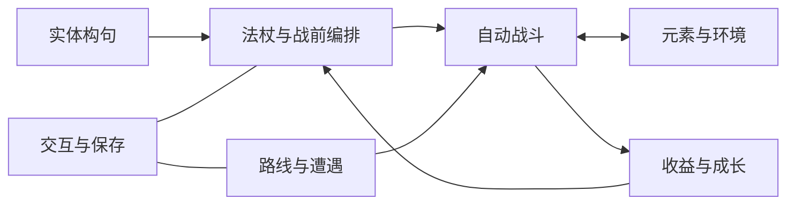

# 言咒现行设计导航

基准：GDD-G002-FULL-001 / 1.0 RC1 / doc.1。doc.1只整理文档，不代表RC2或玩法验证。

[核心设计浓缩](core-design.md) · [完整GDD（0–18章）](GDD.md) · [版本清单](baseline.md) · [待决问题](../governance/questions.md)

| 系统 | 内容 | 唯一规则正文 |
| --- | --- | --- |
| SYS-001 | 实体构句、绑定与类型 | [阅读](systems/01-grammar.md) |
| SYS-002 | 法杖、镶嵌与编排 | [阅读](systems/02-wands.md) |
| SYS-003 | 战斗、状态与事件 | [阅读](systems/03-combat.md) |
| SYS-004 | 元素、战场与环境 | [阅读](systems/04-elements-environment.md) |
| SYS-005 | 路线与终局 | [阅读](systems/05-route-encounters.md) |
| SYS-006 | 收益与成长 | [阅读](systems/06-rewards-growth.md) |
| SYS-007 | 交互与保存 | [阅读](systems/07-interaction-save.md) |

## 内容、参数与验收

- [53种实体](content/cards.md)：34种词卡、19种可换件；55个流派ID。
- [三种法杖](content/wands.md)：起始四根原木，最多四根出战。
- [敌人和12份遭遇](content/enemies-encounters.md)：七种普通敌人与一个首领。
- [参数表](parameters.md)：时间、量值、价格；机制正文引用此表。
- [验证规格](validation.md)：预期与计划；实际执行见测试交接。
- [素材审查](source-review.md)：68份合格素材与47份inbox的原RC1处理范围。

## 当前状态

原26组选择Closed / Accepted；AUD-010为本次发现的待消歧边界。完整RC1玩法／平衡／真人理解未完成验收。新探索保持独立：[方向索引](../exploration/README.md)。

## 系统之间怎样衔接

[规则ID定位](../governance/rule-index.md)提供细节入口。交互展示由已确定规则产生，不能自行改变时序、资源和胜负。
