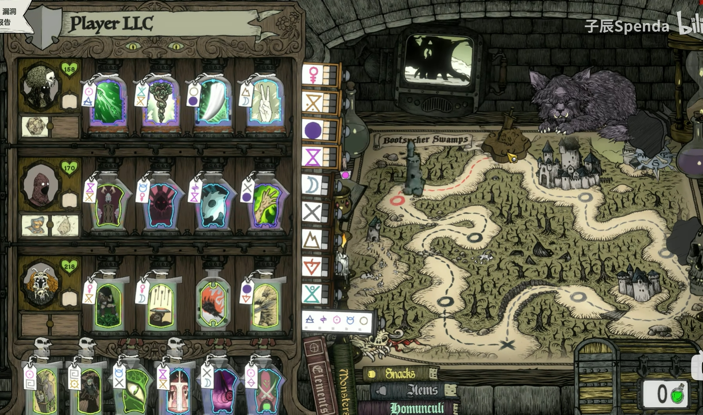
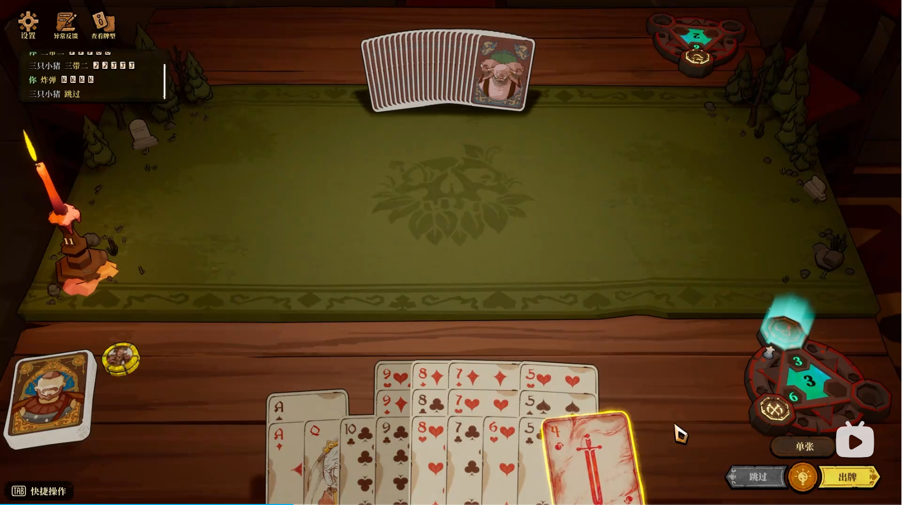
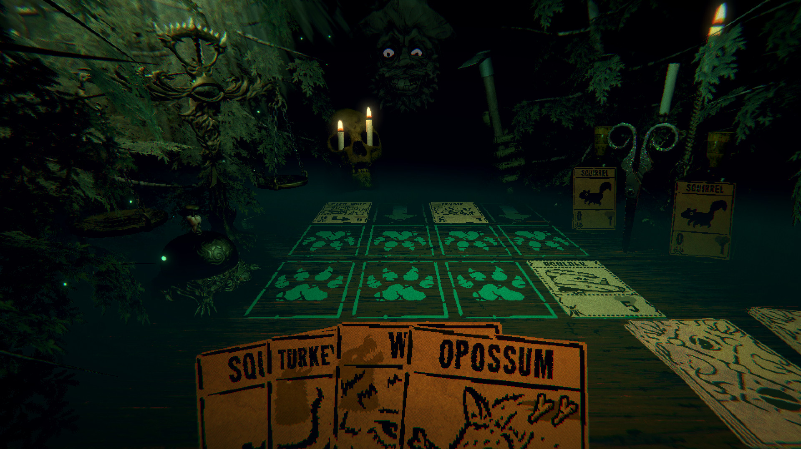
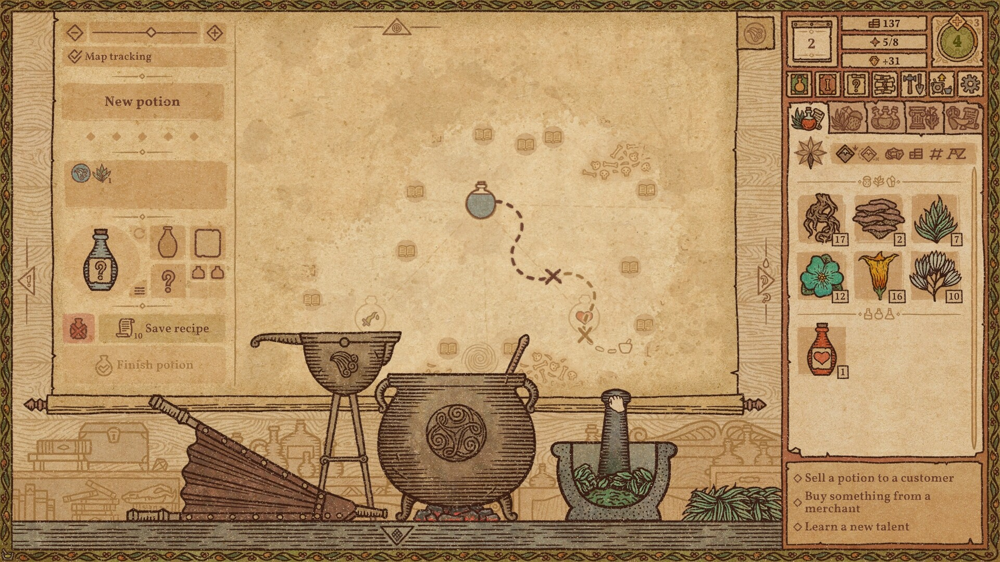
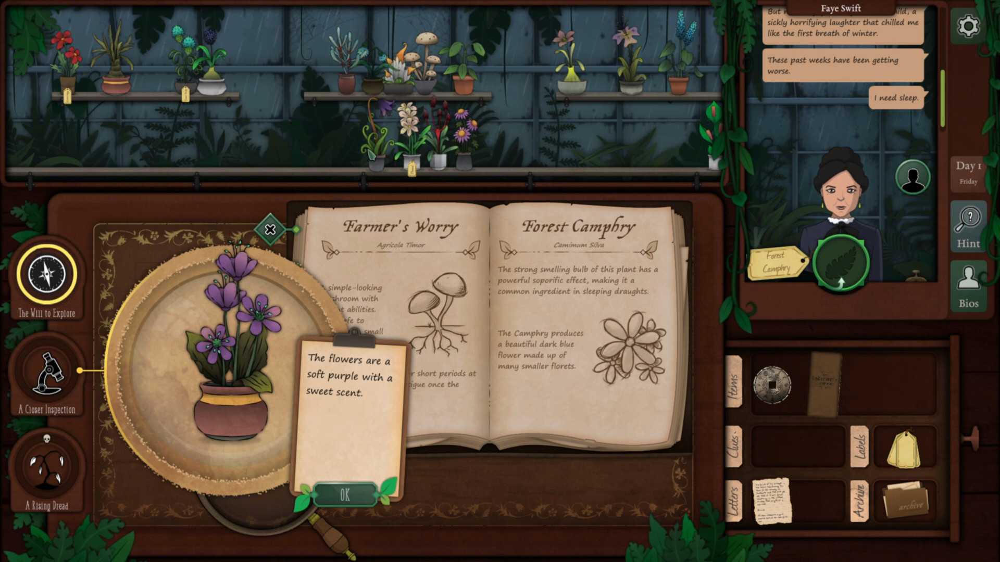
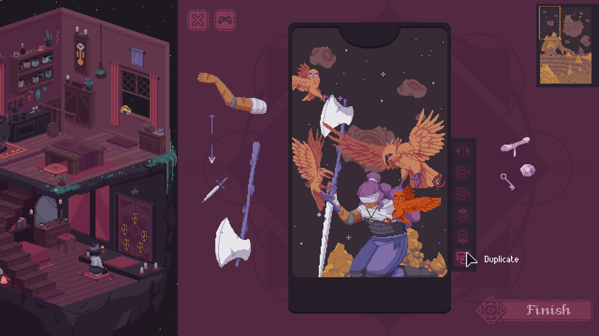
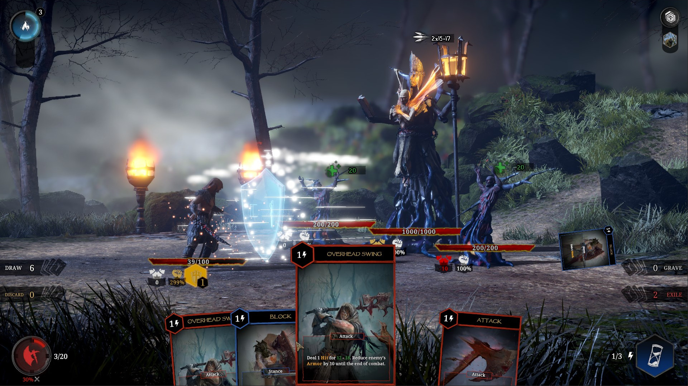

# DIR-031 视觉形态设计与美术风格确认

Project ID：game-002-optimization。创建：2026-10-02。状态：**Raw Idea / Unqualified；Visual Direction Candidate；Hypothesis / NotRun**。

本方向只探索《言咒》TL-1时间产线的视觉形态与美术风格如何帮助玩家读懂自动运行、行动队列、敌方倒计时和关键干涉。本页不是正式视觉规范、UI采纳、资产清单或主系统变更；未回写`design/`、`visual/`或任何现行规则。

## 本轮阅读范围

- 日期／轮次：2026-10-02，第1轮。
- 用户目标与原话：使用`$gameplay-mechanism-designer`，启动言咒新探索：视觉形态设计和美术风格确认；阅读模式CORE，不自动扩读；用Spark给三个结构不同的候选，比较玩家选择、反馈、代价和未知，推荐一个；保存到同一个方向README，保持Raw，不回写主系统。
- 模式：CORE。
- 来源版本：当前工作树；项目挂载目录未暴露Git仓库元数据，故不虚构提交号。允许游戏正文的SHA-256为`767b1c64e98977da8e3a7a877195e03d6e681df7f29af69433c60a67d6a75c8b`。
- 增补／排除：增补为用户指定的`gameplay-mechanism-designer` Spark发散方法；未发现本会话可访问的该技能文件，故只使用其“先形成结构差异显著的多个候选，再比较选择、反馈、代价和未知”的方法边界，不引入未读取的方法库内容。排除完整GDD、系统分册、主系统来源、历史、其他探索方向正文、视觉档案、图片、外部案例、联网资料、代码和实际原型。
- 扩读规则：禁止自动扩读。
- 历史／其他方向／外部材料：None。
- 操作规则：`exploration/AGENTS.md`、`exploration/start.md`、`exploration/README.md`，仅用于阅读合同、保存路径和资格隔离；不作为玩法或美术依据。
- 已有范围外背景：新方向；未主动读取额外游戏正文。目录索引用于分配DIR-031，未以其他方向摘要或正文作为本轮证据。

| 允许材料（仓库相对路径＋章节） | 实际版本／SHA-256 | 阅读状态 | 用途与边界 |
| --- | --- | --- | --- |
| `design/core-design.md`，全文 | 工作树；`767b1c64e98977da8e3a7a877195e03d6e681df7f29af69433c60a67d6a75c8b` | 已读 | 只用于概念层视觉关系判断：自动生产网络、资源／行动卡、有限战斗行、敌牌揭示倒计时、暂停与干涉；不证明GDD细节兼容或体验成立 |

- 未读与缺失：目标平台、输入方式、视角、分辨率、角色表现、具体敌人、美术产能、现有资产和无障碍目标均为Unknown。未读取任何现行视觉说明，因此不主张继承既有风格。
- 范围变更：None。
- 本轮结论覆盖：只对应CORE中的结构与状态；具体卡面、颜色、动画、信息密度和美术生产成本均待后续验证。

## Spark：三个结构不同的候选

Spark在本轮只用于快速拉开“玩家从哪里读状态、在哪一步做选择、画面如何给出确认”的结构差异。三个候选共享CORE事实：玩家不是逐张手动出牌，而是观察法杖自动生产、敌牌逐步揭示，并在关键威胁出现时决定干涉、改后续路由或承受结果。它们不共享任何已采纳的页面布局或美术风格。

### A. 仪器化炼金作业台

**形态。** 横向工作台。上方是一条敌方倒计时带，中央是可见材料流与资源卡堆，底部并列数根法杖装置；玩家行动卡从法杖的产出端进入有限战斗行。视觉语言是精密但可触摸的炼金仪器：金属轨道、玻璃容器、刻度标签、纸质行动卡和低饱和材料色。关键事件以清楚的流向、阻塞标记和倒计时指针表达，而非用大面积特效覆盖信息。

**玩家选择。** 玩家先从下方杖与中央材料流定位“哪一批卡会来得及进入战斗行”，再看上方敌方倒计时判断是否改后续路由、付费干涉或留出队列位置。点选一个威胁时，相关法杖、托管材料、预计行动卡和截止时刻形成一条局部追踪路径。玩家的主要选择是生产优先级和响应窗口，而非手动摆放视觉对象。

**反馈。** 成功的计划呈现为材料进入装置、进度推进、产物进入行动行、行动卡在正确时点结算的连续因果。失败不只闪红：缺料停在输入端，行满堵在输出端，打断让本批材料退回并标出后续延误。敌牌翻开时，画面从模糊卡背变成带目标、截止和打断条件的清晰告警。

**代价。** 中央资源区、法杖装置和两条战斗行同时常驻，界面层级较多。若用过多真实物理材质、玻璃反射或小型仪表，容易让状态读数退化为装饰。法杖或资源种类增多时，需要额外定义折叠、筛选与窄屏布局。

**未知。** 是否能让“自动运行”显得有生命力而不误导玩家必须频繁搬运材料；材料视觉流动是否会掩盖真正的逻辑时序；目标平台是否承受细粒度状态与动画；玩家会不会将卡牌、资源和加工批次混为同一对象。

### B. 战术卷轴与事件舞台

**形态。** 整屏是一张横向展开的战术卷轴，中央是一条连续的未来事件带，敌我事件从上下两侧向中轴汇聚。法杖被压缩成卷轴下沿的印章／铭牌，资源以少量图章和配方标记进入行动卡详情。美术采用水墨、木刻、朱砂印记和泛黄纸张，但只把它们作为可读的状态编码：敌方威胁用断裂墨线与印封，玩家行动用成形咒印与纸签。

**玩家选择。** 玩家把注意力集中在“下一次值得介入的事件”。按下暂停或点选将到期的敌牌时，卷轴局部展开：显示应对行动的预计抵达拍、相关杖的未来批次及可替换的后续路由。选择更像审阅一份即将执行的咒式档案，核心是取舍哪一个未来节点，而不是管理整个工坊布局。

**反馈。** 敌牌揭示如封条被揭开，倒计时在卷轴上留下迫近中轴的笔触；玩家行动完成时形成稳定咒印，错过窗口则留下可复盘的断笔与延迟批注。全局暂停将卷轴冻结为可检视的“批注状态”，让玩家看见预期、实际、阻塞原因和结果的对应关系。

**代价。** 事件带优先，会压缩材料、杖和队列的空间。若资源转化和行满阻塞是主要策略来源，卷轴可能把深层生产关系隐藏在详情层，削弱“搭建生产网络”的第一印象。高度风格化的书写语言也有小字可读性、语言本地化和动画清晰度风险。

**未知。** 一条主时间带是否足够区分敌方翻开、敌方触发、己方交付和己方生效；玩家是否会误以为能直接拖动事件改时；卷轴的抽象感能否承载资源卡的实体性；水墨和印章在高密度战斗时能否维持紧迫感。

### C. 召唤剧场与活体棋盘

**形态。** 以敌我对峙的桌上小剧场为主：敌人、玩家与关键战场对象是可读的实体棋子；战斗行表现为环绕舞台边缘的行动卡轨道；法杖生产区退到舞台下方，像驱动布景的幕后机关。美术采用纸偶、漆木、布景幕帘、发光符纸和局部定格动画，强调“自动运行的咒术表演”。

**玩家选择。** 玩家优先从舞台中心感知威胁会落到谁身上，再从边缘行动轨道检查有没有赶得上的应对牌。暂停后可展开幕后机关，定位需要调整的法杖或材料。选择的心理模型是“保护舞台上的关键对象并让准备好的法术准时登场”。

**反馈。** 敌牌翻开如幕帘揭示下一幕；行动卡抵达时从边轨滑入舞台并以短促的纸偶／符纸动作结算。中断、护甲和生命变化能直接落到对象身上，成功干涉让敌方即将发生的一幕被封住或撤场。生产端的阻塞以幕后齿轮停摆、布景待机表达。

**代价。** 舞台中心容易让玩家只关注演出结果，忽略生产、排队和时间约束；实体角色、特效、镜头和动画的制作成本最高。把资源、行动卡、加工批次和倒计时同时清晰嵌入戏剧化画面，信息架构风险明显高于A、B。

**未知。** 核心体验是否需要强角色／战场存在感；纸偶和戏台是否符合尚未确认的世界观；舞台是否会让玩家误判为即时操作战斗；高频自动结算时，演出是否变成干扰或造成视觉疲劳。

## 对比

| 维度 | A. 仪器化炼金作业台 | B. 战术卷轴与事件舞台 | C. 召唤剧场与活体棋盘 |
| --- | --- | --- | --- |
| 玩家首先读到什么 | 材料如何加工、阻塞并进入有限行 | 哪个未来事件值得现在干涉 | 敌我对象与下一幕战斗结果 |
| 主要选择落点 | 调整产线、预留行位、响应截止 | 选择关键未来节点并审阅可达性 | 保护对象、挑选要让其登场的应对 |
| 主要反馈 | 可追溯的因果链与失败位置 | 预期／实际时机的对照与批注 | 有表演感的揭示、抵挡和命中 |
| 最强支持的CORE体验 | 编排自动运行的法术生产网络 | 在关键威胁前暂停思考、改变后续路由 | 准备已久的法术兑现明显收益 |
| 最大代价 | 信息层多，需严控装饰和密度 | 生产关系可能被压入详情 | 生产关系被表演吞没，制作成本高 |
| 目前关键Unknown | 状态流是否易懂而不显得手忙 | 单轴能否承载全部时序 | 舞台感是否偏离产线策略核心 |

## 推荐：A. 仪器化炼金作业台

推荐A作为下一轮的**Raw视觉基底**。CORE首先定义的是“自行运作的法术生产网络”：材料被收取、加工、交付为行动卡，有限战斗行造成阻塞，敌方倒计时迫使玩家在正确窗口干涉。A把这条因果链留在常驻视野中，能让玩家解释“为什么这一张牌没赶上”或“为什么这根杖停住了”，而不是只看到结果。

推荐不等于采纳具体炼金、金属、玻璃或纸牌的美术。下一轮可在不扩读游戏正文的前提下，先做一张低保真结构图，验证敌方倒计时带、资源区、行动行和法杖区能否在同屏建立清楚的选择链。若希望先确认气质，再只比较A的三种表层美术：精密炼金仪器、民俗纸作工坊、抽象符号操作台；此处仍不应把它们写成世界观结论。

B保留为“事件阅读优先”的互斥备选，适合在试玩显示玩家难以发现干涉窗口时再比较。C保留为“演出结果优先”的互斥备选，适合在后续明确需要强角色与战场存在感时再重新评估。

## 与《言咒》核心设计的关系

仅依据`core-design.md`，不读取GDD细则。

| CORE结构 | 本方向的概念关系 |
| --- | --- |
| 法杖按周期收料、加工、交付；玩家不持续手动搬运或逐张点牌 | 三个候选都应把自动生产作为常态，交互只在暂停、检查或干涉点出现；不设计成高频拖拽工坊 |
| 资源卡、行动卡、完整法术和程序词卡有不同身份 | 视觉需将材料、加工批次、成品行动和固定法术程序区分；尚未确定最终卡框、图标或颜色编码 |
| 有限玩家战斗行造成阻塞，缺料／返工使后续节拍顺延 | A最直接表达该因果；B、C均需避免把未来预测画成已保证发生的事件 |
| 敌牌暗示类型线索，翻开后有触发时刻与打断条件 | 三个候选都保留“未知→揭示→倒计时→结果／取消”的视觉状态变化；具体线索样式和信息量Unknown |
| 关键威胁出现时暂停思考，决定改路由、付费干涉或承受损失 | 视觉必须在暂停态呈现可到达性、截止和后果；具体干涉能力与费用尚未设计 |
| 准备已久的法术兑现明显收益 | C最强于瞬时兑现，A最强于展示前置准备；后续需要验证二者是否能结合，当前不合并为新方案 |

本方向仅提出视觉表达假设，不替代CORE中行动格容量、敌方揭示、结算或支付规则。任何“卡牌移动”“工坊装置”“卷轴标记”“舞台角色”均是候选表现，不授予新交互或规则权限。

## 未知与下一步

- 哪种玩家身份更重要：产线规划者、咒式审阅者，还是舞台操演者？本轮推荐A但尚未获得用户确认。
- 桌面横屏、鼠标、触控或手柄的目标平台未定；不同设备会显著改变A的常驻信息可行性。
- 世界观、角色、敌人、场景比例、色彩禁忌、资产来源、动画预算和可访问性均未读、未定。
- 未实际测试信息密度、暂停态理解、无障碍对比度、小屏折叠、自动运行的可解释性或美术生产成本。
- Planned / NotRun：下一轮只选A制作低保真同屏布局，使用占位文字和状态，不增加规则；观察玩家能否在一个“敌牌已揭示、某杖缺料、另一杖成品被行满阻塞”的静态例子中指出威胁、原因和可行动窗口。

## 第2轮：炼金／法术工作台＋对峙牌桌（文字版完善）

状态：**Raw Idea / Unqualified；UI Candidate；Hypothesis / NotRun**。本轮将第1轮推荐的“仪器化炼金作业台”与用户提出的“对峙牌桌”合并为一个页面形态：牌桌负责读懂当前冲突与未来威胁，工作台负责解释行动为什么能或不能赶上。它不是对现行主系统UI、世界观或美术资产的采纳。

### 本轮增补范围

- 日期／轮次：2026-10-02，第2轮。
- 用户目标与原话：炼金／法术工作台+对峙牌桌；阅读028内关于UI的已有设计，参考html中的最小构件要求，先进行文字版完善。其中，吸取你的设计思路，法杖设计可修改为炼金工具或炼金法阵。
- 基础模式：沿第1轮CORE；本轮显式增补为`exploration/DIR-028-timeline-depth/README.md`第7轮“UI布局与基础展示形态”全文，以及用户上传HTML的嵌入展示正文中可读的组件、状态和交互要求。
- 来源版本：当前工作树。`DIR-028`实际读取文件SHA-256为`1256f281039aa035e2367cc46bd0d3560f1f0cd76b7c84fed14c9215171b2f58`；用户HTML SHA-256为`5964fa0b9291d93fb642ea564571688f36d95c926479ed730a438a24ca3eb0fe`。
- 增补／排除：增补只限上述两个输入。排除DIR-028其他轮次、其链接的来源与图片、其他探索方向、完整GDD、视觉档案、外部资料、代码和实际原型。
- 扩读规则：禁止自动扩读。
- 历史／其他方向／外部材料：None；用户HTML是本轮唯一外部输入，不执行其脚本，不使用其内嵌外链内容作为设计依据。
- 本轮结论覆盖：可讨论页面区块、对象身份、状态与选择反馈；不可据此确定数值、战斗细则、资产风格、目标平台或实际可用性。

| 增补材料（精确范围） | 实际版本／SHA-256 | 阅读状态 | 用途与边界 |
| --- | --- | --- | --- |
| `exploration/DIR-028-timeline-depth/README.md`，第7轮UI布局与基础展示形态 | 工作树；`1256f281039aa035e2367cc46bd0d3560f1f0cd76b7c84fed14c9215171b2f58` | 已读 | 借用分层作战台、状态分层、规则到展示的映射；不继承其余轮次规则或任何采纳状态 |
| 用户HTML：`b67209de-300c-43e7-8836-24b6f68a6c7b-1790932107994_yanzhou-battle-layouts.html`，嵌入展示的组件、三种状态和点选详情 | `5964fa0b9291d93fb642ea564571688f36d95c926479ed730a438a24ca3eb0fe` | 已读 | 提取最小构件需求；不执行脚本、不采纳其示例名称、数值、样式或全部三种旧布局 |

### 统一概念：上桌对峙，下桌炼制

页面不再把“战斗行、资源区、法杖区”理解为三块并列的抽象后台面板，而是分成两个视觉层次、一个连接层：

```text
战斗顶栏：生命｜当前拍｜暂停／运行｜本场可用干涉额度

上桌：对峙牌桌
敌方当前对象／敌方翻开带／已揭示的倒计时威胁
──────────────── 当前结算边界与共同时间方向 ────────────────
玩家当前对象／玩家待翻行动带／队列已占 Q

中间：交换托盘
可用资源卡叠｜本批托管材料｜待交付成品｜下一次环境补给

下桌：炼金／法术工作台
[炼金工具或法阵：输入位 → 固定法术程序 → 加工状态 → 输出位] × 若干

底部详情：选中对象的原因、实际预计时刻、目标规则、输入输出关系
```

“上桌”不是把战斗改成即时点击的牌桌游戏。它只让玩家优先读取谁在对峙、哪张敌牌何时翻开、哪一个已揭示威胁将要触发，以及己方已有行动卡能否在截止前结算。“下桌”也不是手动搬料小游戏；它显示自动吸料、加工、交付和阻塞，以说明上桌牌带的来源。中间交换托盘保留资源卡的独立身份：左右位置不表示时间，不赋予空间或邻接效果。

### 最小构件及职责

| 构件 | 常驻内容 | 玩家能做的选择 | 必须给出的反馈 | 不应暗示的行为 |
| --- | --- | --- | --- | --- |
| 战斗顶栏 | 双方生命、当前拍、暂停状态、本场干涉额度 | 暂停查看；进入既有干涉入口 | 暂停时对峙牌桌与工作台的计时共同冻结 | 不把费用画成材料资源，或假定存在尚未设计的即时技能 |
| 敌方翻开带 | 近端暗牌、类型线索、翻开时刻；已揭示牌转为倒计时牌签 | 点选威胁检查目标、触发与取消条件 | 已揭示牌与其触发标记保持同一身份；关键威胁只突出相关对象 | 卡背不泄露完整效果；翻开时刻不等于触发时刻 |
| 对峙中心／当前结算边界 | 敌我当前对象、当前拍、必要的护甲／生命变化 | 点选对象查看锁定／预计目标与本拍结果 | 当前结算用短促、明确的翻牌与结果落点；完成后牌带推进 | 不将视觉上下或牌面前后层级解释为同拍优先顺序 |
| 玩家待翻带 | 有限真实行动卡位、已占/Q、来源工具／法阵、预计生效拍 | 检查牌的完整效果与来源；查看它是否赶上威胁 | 盖放牌仍向玩家露出名称、来源与时刻；到期后结算并离队 | 不提供拖到队首、免费换序或让预测卡冒充真实入行牌 |
| 交换托盘 | 可用资源叠、托管材料、等待交付成品、下次补给 | 点选看资源来源、数量、归属和可用时间 | 托管后从可用叠移到工具／法阵；退回料标示“下一拍可用” | 不把每次自动吸料变成跨屏飞行或强制点击 |
| 炼金工具／法术法阵 | 固定法术程序、输入位、加工进度、输出位、等待原因 | 点选查看本批状态、关联资源、产物和后续预测 | 缺料、加工、待交付、返工、休歇分别可辨；阻塞留在输出位 | 不把工具／法阵本体当消耗资源，或让点选暗中改变已承诺批次 |
| 统一详情区 | 当前选中对象的规则、因果、实际／预计时刻 | 在不离开主画面的情况下检查关系 | 仅高亮相关牌、资源与工具／法阵，其他仍可见 | 不默认常驻满屏连线，或用详情替代主画面的关键告警 |

HTML中“关键威胁、平稳运转、队列已满”的三态在本方案中保留为最小状态覆盖：常态优先安静显示自动运转；关键威胁临时强调敌方倒计时、目标工具／法阵和可能赶上的行动牌；队列已满只在受影响工具／法阵输出位和玩家行动带计数上显示阻塞原因，不把全局变成警报墙。

### 炼金工具／法术法阵：替代法杖的视觉身份

本轮建议将“法杖”从默认的手持武器外观，改写为**法术程序的承载与加工单元**。规则职责不随视觉名称而改变：一个单元绑定一个完整法术，自动处理一批材料，产出资源卡或行动卡；程序词卡持续占用，材料是本批耗材。

| 形态候选 | 适合承担的视觉语义 | 可见结构 | 反馈强项 | 代价与未知 |
| --- | --- | --- | --- | --- |
| **炼金工具（推荐为常态外观）** | 把“加工、托管、阻塞、输出”读成可触摸的生产过程 | 工具本体、嵌入式法术铭牌、输入碟、加工槽、输出夹 | 进度、缺料、退料和成品等待交付最容易解释 | 工具种类过多会产生职业／世界观承诺；必须避免伪装成需要玩家手动操作的设备 |
| 法术法阵 | 把“程序持续占用、条件触发、循环运行”读成稳定的魔法结构 | 环形符文、材料锚点、核心公式、输出节点、状态环 | 更容易显示规则、目标绑定和运行条件 | 输入／输出、成品阻塞与资源实体感较弱；高密度符文可能降低小屏可读性 |
| 工具＋法阵混合 | 工具表达物理加工，法阵表达被固定的法术程序 | 工具底座中的法阵盘，材料入盘、产物出槽 | 同时保留生产感和咒术身份，适合核心单元 | 组件最复杂，需限制层数，避免每个单元像一个微型控制台 |

推荐以**工具＋法阵混合**作为文字方案中的概念模型，并以**炼金工具**作为常态可读形态：工具底座解决输入、加工和输出的因果，嵌入式法阵解决“这不是普通机器，而是绑定完整法术的持续程序”。当玩家只需扫读时，优先看工具状态；点选后才展开法阵的词卡／配方细节。这个推荐仍是Raw，不把特定器具、法阵图样或材料类别写成美术资产需求。

### 三种关键状态的阅读路径

**平稳运转。** 玩家第一眼看上桌近端牌带与生命，确认下一拍没有关键威胁；中间托盘只显示库存变化与下次补给，工作台只显示短状态，如“加工中”“等材料”“休歇”。此时画面应传达“计划自行运作”，而非要求持续巡检每个工具。

**关键威胁。** 敌牌翻开后，牌从敌方带转为带剩余拍数的倒计时牌签；牌签、被锁定的敌我对象、可能应对的玩家行动和相关炼金工具／法阵形成一条临时高亮链。高亮链必须显示事实：应对行动的实际预计生效拍与敌牌触发拍的差值。若本批还未完成、行已满或同拍来不及，应直接显示原因，不只用颜色表示失败风险。

**队列已满／返工。** 玩家行动带显示已占/Q，受影响工具／法阵的输出位停留成品并标“待交付：行满”；它不继续生产下一批。若被打断，当前批次的进度归零、材料退回托盘并带“下一拍可用”标识，后续预计行动整体顺延。牌桌仍保持可读，不把工作台问题误画成敌我即时撞击。

### 玩家选择与反馈闭环

1. 玩家先从对峙牌桌看到“何时、对谁、什么威胁”。
2. 点选威胁后，界面只补亮相关的己方行动卡、其来源工具／法阵和本批材料，回答“是否赶得上、卡在哪里”。
3. 玩家在暂停检查中决定只影响尚未承诺批次的路由、使用既有干涉入口，或承受结果；方案不新增拖牌、即时改序或手动加工。
4. 运行后，上桌结算结果和下桌状态变化共同留下原因：成功显示应对牌在截止前进入并生效；失败说明是缺料、加工未完、行满、返工、同拍过晚或没有合法目标。
5. 结算完成后高亮退场，工作台继续自动运行，避免把一次威胁的关系线永久占据画面。

这个闭环吸收了DIR-028“敌情→材料→己方时机→生产原因”的阅读顺序，并让牌桌承担第一眼的战斗关注点。工作台不是另一个独立页面，而是解释牌桌事件的持续因果层。

### 表层美术方向（待选，不视为世界观确认）

- **冷静的炼金牌桌：** 深色木／石桌、哑光金属工具、低反射玻璃、泛黄行动卡、少量清晰的元素色。优点是状态层级稳定，风险是容易变成常见的“复古奇幻工坊”。
- **纸作咒术工坊：** 对峙牌桌像纸上战局，工具与法阵采用压印、剪纸、折纸和套色符文。优点是卡牌与法术同材质，风险是加工与资源的物理差异不够显著。
- **精密符号台：** 工具退为抽象支架，法阵与资源用清晰几何节点和光学刻度表达。优点是高密度可读性和较低资产负担，风险是削弱“准备已久的法术兑现”的触感。

当前倾向是“冷静的炼金牌桌”作为空间与材质基调，但吸收纸作咒术的卡面与法阵局部质感。美术选择须在先验证信息层级后再确认，避免用风格掩盖工作台与牌桌之间的因果断层。

### 与已读输入的关系和边界

DIR-028第7轮的“分层作战台”提供了敌方行→资源→玩家行→加工单元的因果顺序；本轮不照搬其直线堆叠，而是把敌我两行合为上桌对峙面，把资源区收为中间交换托盘，把加工单元重写为下桌工作台。HTML提供了顶栏、两条战斗行、资源、加工单元、详情区、状态切换与点选反馈这些最小构件；其示例中的具体牌名、数值、工具样式、桌面尺寸、三种布局和脚本实现均未采纳。

本轮没有读取现行视觉档案、DIR-029或任何图片，故不声称兼容既有卡牌桌面、美术参考或动效方案。炼金工具／法术法阵是当前方向的替代表现候选，不改写CORE“法杖绑定完整法术”的规则职责，也不等于主系统术语已经改名。

### 下一步与Unknown

- 是否优先把“工具＋法阵混合”作为唯一候选出低保真布局，或先将纯工具与纯法阵分别做一张结构草图比较，尚未确认。
- 对峙牌桌需要显示敌我角色、棋子、战场对象，还是只显示卡牌与状态条，尚未确认；本轮不借DIR-029补入棋子方案。
- 工作台与牌桌的视觉比例、屏幕宽度、近端时间窗口、工具数量上限、资源折叠阈值、窄屏模式和输入方式均Unknown。
- 未进行页面原型、可用性测试、动效测试或美术成本估算。Planned / NotRun：下一轮用“关键威胁”单一场景制作低保真文字线框，检查玩家是否能在十秒内指出威胁、对应工具／法阵、行动是否赶得上以及失败时会先查看哪里。

## 第3轮：Flask式三维炼金物件＋恶魔牌式对峙牌桌

状态：**Raw Idea / Unqualified；Style Study；UI Candidate；Hypothesis / NotRun**。本轮依据用户提供的两张游戏截图，深化第2轮“上桌对峙、下桌炼制”的表层风格与空间语言。用户指定的参考名为`Flask`与`恶魔牌`；本页将其记为**用户命名的视觉参考**，只分析截图实际可见内容，不推断二者的玩法、版权归属、完整美术规范或未出现在画面中的系统。

### 本轮增补范围与来源记录

- 用户目标：继续深化文字版思路，细化风格；借鉴Flask的3D物体效果、炼金工具的桌上摆放和交互；借鉴恶魔牌的牌桌效果和色调风格；将参考游戏记入文档，深度提取艺术风格，补充游戏截图并尝试调研类似美术风格的游戏案例。
- 增补材料：两张本轮用户截图。其余游戏正文、主系统视觉档案、其他探索方向、外部图片、视频和代码仍未读取。
- 外部调研：本轮三次关键词检索请求均返回服务错误，未得到可核验网页或官方素材。以下“相邻案例”是基于已知产品的**定向待核对清单**，不标注为本轮已联网确认，也不复制或保存外部截图。
- 扩读规则：禁止自动扩读仍有效；本轮保存用户已提供截图到本方向，不将它们回写资产库或主系统视觉目录。

| 参考 | 项目内保存副本 | SHA-256 | 本轮可用范围 |
| --- | --- | --- | --- |
| 用户截图1，Flask式炼金柜与瓶装卡牌界面 | [reference-flask-3d-workbench.png](reference-flask-3d-workbench.png) | `72183539a239774684ed4b29123da6afddf35d1d23055e6eb82a306b4d2afee7` | 三维玻璃容器、木制货架、卡牌作为被收纳的实体、地图桌与物件摆放 |
| 用户截图2，恶魔牌式三维对峙牌桌 | [reference-devil-cards-tabletop.png](reference-devil-cards-tabletop.png) | `903d2dfee95a53cfde1cda4766fa2c2d17df47016087532961e5503210727dc8` | 俯视木桌、暗橄榄台面、暖烛光、边缘器具、手牌扇形与中心留白 |





### 参考一：Flask式三维炼金柜与瓶装卡牌

截图中最有价值的不是“瓶子”这一单一图标，而是**将可管理对象做成可被看见、被摆放、被取用的桌面实体**。左侧柜体以分层木架组织多个瓶装卡，每瓶有玻璃轮廓、塞子或金属封口、内部漂浮的图像、独立标签和微光边缘；中部窄列把符号做成垂直索引；右侧则用一张地图桌承接路线、地点和大件摆设。物件的体积、遮挡、投影和轻微倾斜使它们像在同一张真实工作桌上，而不是贴在二维HUD上的矩形窗口。

可以抽取五条艺术语言：

1. **柜体是信息架，不是背景。** 深木格架直接给出拥有关系和类别关系。对《言咒》而言，工作台下半部可以是一个开放的炼金柜，而非平铺的卡片列表：每个工具／法阵占一个稳定槽位，槽位的木框、工具轮廓和输出口先表达身份，再由文字补状态。
2. **玻璃负责显示“被封存但仍在运行”的对象。** 玻璃瓶特别适合表现托管材料、持续产物、待交付成品或被临时封住的法术结果。瓶内的粒子、液面或悬浮符片只应承担状态变化，不承担精确数值；精确剩余拍数仍由相邻标签显示。
3. **卡牌可以作为物体的内容，而非唯一容器。** 卡面被装进瓶、夹进木槽、压在桌面或置于抽屉中，能区分“行动卡”“资源卡”“已绑定的法术程序”三种身份。建议保留卡牌的可读标题，但允许其在不同物理容器中呈现不同生命周期。
4. **可用暖边光表示被选中或可操作，而非全局高饱和。** 绿色、青蓝和紫色仅在瓶内液体、卡边和符号标签处成小面积发光；这为言咒的关键状态留出对比度预算。危急敌情可使用单独的朱红／琥珀色，避免与日常魔法光混淆。
5. **物件有“拿得起来”的交互暗示。** 瓶、卡、抽屉和地图图钉均具备明确的边缘、投影和接触面。言咒的点选目标应由轻微抬起、玻璃反光移动、法阵亮起或工具槽边缘加深来反馈，不能依赖漂浮按钮和满屏描边。

把这种语言带入下桌工作台时，优先做成“**一台工具＋一枚嵌入式法阵＋两个可见接口**”：左侧是本批托管材料的容器或输入碟，中部是固定法术程序的法阵芯，右侧是资源瓶或待交付行动牌的输出夹。工具可随着状态改变物理姿态，但只用有限、语义固定的变化：输入容器缺失表示缺料，法阵缓慢旋转表示加工，输出夹卡住成品表示行满，封口破裂／材料回落表示返工。避免让每一拍都产生夸张的飞行、喷射或摇晃，以免自动运行看起来像需要玩家手动接管。

### 参考二：恶魔牌式三维对峙牌桌与暗暖色调

截图强调的是**留白足够大的真正牌桌**。中央暗橄榄色台呢几乎没有被面板覆盖，木桌边沿、远处卡背、近处手牌和左右器具共同指向中心；烛光从边缘投进暖黄高光，桌角和背景沉入深棕黑。画面用少量青绿色发光和金色交互牌作为局部视觉峰值，使“可行动物件”从整体低饱和中浮出。

可抽取的结构和色调原则如下：

| 视觉维度 | 截图可见特征 | 用于言咒的转化 | 需要避免的误读 |
| --- | --- | --- | --- |
| 桌面视角 | 略带透视的俯视角，桌沿占据前景，中心台面完整暴露 | 上桌对峙牌桌保持一个大、连续、可呼吸的冲突区；敌我行动带从远近两端围绕中心排列 | 不把中心变成装满参数框的控制台，也不让透视改变时间轴的真实相对顺序 |
| 色调 | 深木、暗绿／橄榄、阴影，局部暖烛光与青色魔法光 | 以炭黑、深胡桃木、褪色苔绿构成基底；琥珀用于可行动／警示，青绿用于己方稳定法术反馈 | 不让红、青、金、绿同时大面积发光；颜色不能成为唯一状态编码 |
| 牌的层级 | 远处敌牌一小叠，近处玩家手牌成扇形，中心留给当前对峙 | 敌方暗牌可在远端排队，玩家行动带在近端或下沿；当前要结算的一组进入中央结算边界 | 不把玩家行动卡画成传统“随手出牌”，因为CORE是自动入行并按时结算 |
| 边缘器具 | 烛台、计数器、机械式轮盘置于桌缘，不打断中心阅读 | 暂停、干涉额度、当前拍、工具快捷查看可作为桌缘实体，不抢夺牌桌中心 | 器具不应被误认作可自由改变已承诺批次的即时控制器 |
| 灯光 | 暖光塑造深度，桌面中心保持较平的阅读光 | 关键威胁时只收紧局部光圈，相关敌牌、行动牌、工具／法阵在同一条因果链上被照亮 | 用暗角表达气氛时，不降低卡牌文字、倒计时和色弱玩家所需的对比度 |

对峙牌桌应取其“**桌面是舞台，不是HUD底板**”的优点：大面积台面留给敌方倒计时牌、玩家待翻行动带和当前结算边界。生命、暂停和费用降到桌沿；下桌工作台不与牌桌争夺正中央，而像桌前方抽出的炼金抽屉或半露的工具架。运行时玩家主要看中央；暂停并点选威胁后，才向下打开关联工具／法阵的局部细节。

### 推荐的统一空间与材质方案

**名称：暗木炼金对峙台。** 这不是最终美术名，而是当前文字方案的定位。它将Flask式“可被收纳、封存、加工的三维物件”与恶魔牌式“中心留白、暖暗对峙的实体牌桌”组合，但不复制任何参考图的具体图标、角色、布局、标志、文字或资产。

```text
远端木桌沿：敌方身份、暗牌队列、已揭示倒计时牌签
                     ↓ 向中央推进
中央苔绿台呢：当前结算边界／敌我当前对象／短促结果表现
                     ↑ 向中央推进
近端木桌沿：玩家待翻行动带、已占/Q、当前批的来源标签
────────────────────────────────────────────
前方半抽出的炼金柜：
  工具槽A   工具槽B   工具槽C
 [输入瓶→法阵芯→输出夹] × 若干
中间抽屉：可用资源叠｜托管材料｜维护产物｜下次补给
```

材质层级应遵循“远背景最暗、桌面最平、卡牌最清、魔法只在局部发光”。建议基础材质是粗木、磨损金属、半透明玻璃、褪色纸张和织物台呢；法阵使用低频脉冲的压印／刻蚀，不用屏幕常驻旋转特效。每种材质各自承担明确功能：木材定义分区和容纳关系，台呢托住对峙牌，玻璃显示封存／库存状态，纸张承载可读规则，金属表达工具的输入输出边界，微光表达选中、运行或风险。

### 工具与法阵的桌面摆放、点选和状态语言

| 对象状态 | 桌面摆放 | 静态辨识 | 点选／悬停反馈 | 运行反馈 |
| --- | --- | --- | --- | --- |
| 基础资源可用 | 中间抽屉或工作台前沿的玻璃瓶／卡叠 | 可见数量与类别签；与托管区分开 | 轻微抬起，显示来源、可用时间和相关工具 | 只有数量或液面的小幅变化，不跨屏飞行 |
| 材料已托管 | 对应工具的输入碟／锁扣瓶 | 与可用库存分离，带本批印记 | 高亮本批的法阵芯与预计产物 | 瓶内符片缓慢向内汇聚；材料本身不重复出现在库存 |
| 加工中 | 工作台下桌的固定工具槽 | 法阵芯、进度环、当前批短标签 | 展开输入、输出、实际剩余拍数和延误原因 | 弱脉冲、齿轮／阀门或液面缓慢移动；不能把动画当精确计时器 |
| 待交付成品 | 工具右侧输出夹或封口瓶 | 成品实体可见，标“待交付：行满” | 关联玩家行动带计数与阻塞原因 | 工具维持静止，明确不继续下一批 |
| 已入行行动 | 近端牌带内的盖放行动卡 | 名称、来源工具／法阵、预计时刻可读 | 显示完整效果与能否赶上选中威胁 | 到期时平移至中央，不能被拖到队首 |
| 已揭示敌方威胁 | 远端牌带下沿的倒计时牌签 | 目标、触发拍、打断条件可见 | 同时照亮目标对象、可响应行动及来源工具 | 从暗牌翻开后维持倒计时；触发或取消才退场 |
| 返工／中断 | 受影响工具槽和交换托盘 | 法阵芯熄灭、输入位置空、延误标签 | 展开退料、进度损失和后续时刻变化 | 材料回到托盘但标示下一拍才可用；不用爆炸或全屏震动代替因果说明 |

### 相邻案例：第3轮待核验清单

下列案例是第3轮留下的待核验清单，保留当时的判断与缺口。2026-10-02已按用户本轮要求补充[第4轮官方截图与图注](#第4轮五个相邻案例的真实游戏截图)；下表不追溯改写为第3轮已完成研究，也不构成《言咒》必须模仿的风格选择。

| 案例 | 可研究的艺术语言 | 与本方向的关系 | 待核验项 |
| --- | --- | --- | --- |
| **Inscryption** | 暗木牌桌、局部烛光、实体卡牌、物件化界面与压迫性中心舞台 | 可比较“牌桌作为沉浸式场景”如何兼顾牌面清晰度和黑暗氛围 | 本轮未读取官方页面、截图或规则；后续只取视觉层，不导入其叙事和机制 |
| **Potion Craft** | 炼金工作台、玻璃瓶、配料实体、纸面与木材的触感 | 可比较“工作台物件能否显示加工因果”与资源可读性 | 其交互强调手动调配，不能外推为言咒的自动加工 |
| **Strange Horticulture** | 暗调桌面、纸质标签、植物／容器档案化陈列 | 可比较低饱和桌面中如何让文本和物件同时可读 | 其店铺调查语境不等于对峙战斗；需只借档案感与材质层级 |
| **The Cosmic Wheel Sisterhood** | 神秘学卡牌、仪式桌面、符号化构成与高对比局部色 | 可比较法阵、卡面与仪式物的共同视觉语法 | 需核验卡牌信息密度与动态效果，不能照搬其人物叙事语境 |
| **Tainted Grail: Conquest** | 阴暗奇幻、桌面感组件、物件与卡牌并置的战斗阅读 | 可比较三维物件、卡牌和环境层如何不互相遮挡 | 需核验具体界面版本与实际可读性，不能假定其等同于言咒产线结构 |

### 风格边界、风险与下一步

- 本轮只确认“应继续探索暗木炼金对峙台”这一Raw方向；没有确认深绿台呢、玻璃瓶、烛台、压印符文或任何具体角色／怪物形象为最终资产。
- 三维摆件必须为信息服务：可交互、可选中或能解释状态的物件才获得体积、投影和动画。纯装饰物应留在桌沿，且在暂停检查时不能遮挡牌、时刻、数量或目标。
- 参考中的强暗角和低照度适合情绪，但不能降低倒计时、敌牌线索、行动来源和文本的可读性；每个关键状态要同时有文字、形状／位置和颜色反馈。
- 工具＋法阵混合仍是当前推荐，但“工具种类”和“法阵外观”会牵动世界观与美术产能，需先以统一底座、可替换法阵芯和少量容器验证，不应为每种法术立即制作独立大型模型。
- Planned / NotRun：下一轮制作一张“关键威胁”风格线框。它应同时出现远端已揭示敌牌、中央当前结算区、近端一张可能应对的行动卡、下方一个正在加工的工具＋法阵和一个行满输出夹；验证玩家是否能顺着同一条高亮链解释截止、产物来源、卡住位置和可行动窗口。

## 第4轮：五个相邻案例的真实游戏截图

2026-10-02。状态：**Visual Reference / Raw；截图来源已核对；Hypothesis / NotRun**。

五张新增图片均取自对应游戏的 **Steam官方商店截图栏目**，已逐张目视核对，并将所选原图原样保存在本目录。它们是发行方公开展示的游戏内画面，不是本机实玩取证；具体游戏构建版本与拍摄日期为Unknown。本轮没有裁切、调色、拼图或AI生成。

### 本轮阅读与增补范围

- 用户原话：“阅读E:\Project\game\yanzhou\exploration\DIR-031-visual-form-style，补一下这几个案例的真实截图”。
- 模式：沿本方向既有阅读合同，本轮仅执行截图增补；游戏正文实际只读本目录README，不重读CORE、DIR-028、HTML或其他方向。
- 来源版本：基准HEAD为`c5c340d704823186232270673e99a48bf8e94cc6`；方向目录原为未跟踪工作树。本轮编辑前README SHA-256为`cd7140f9cb5b9f7ca9d2df474e4093db8f5a093c694ee5701d2b89a3b2c1691b`，全文已读。
- 显式增补：下列五款游戏的官方商店页、Steam公开产品元数据及图库候选；最终选用截图、精确URL、规格与SHA-256见[来源清单](reference-screenshots-v01-sources.json)。未选候选不纳入交付包。
- 操作规则：根README、workspace-map、github-collaboration、yanzhou/AGENTS、exploration/start与AGENTS，以及Demo与素材规范、目录、登记模板；只作路由和登记规则。
- 检查范围：五张新增截图均已打开审看；两张既有用户参考图只复核文件规格与哈希，字节未变。无额外游戏背景、代码或玩法测试。
- 结论覆盖：仅限所选截图可见的构图、材质、色调和信息层级；动态图像、操作手感及本方向可用性仍未验证。第1至3轮来源与Raw状态保持原义。

### 1. Inscryption：暗木牌桌与实体器具



来源：[Steam官方商店](https://store.steampowered.com/app/1092790/Inscryption/) · [官方截图原图](https://shared.akamai.steamstatic.com/store_item_assets/steam/apps/1092790/ss_0191a69b0e94a9a7784f5b81e27f06379910645a.1920x1080.jpg?t=1777572925)。开发：Daniel Mullins Games；发行：Devolver Digital。1920×1079，JPEG。

**图中可见：** 近景扇形手牌、桌面卡位、两侧天平／剪刀等器具和远处烛火共同构成有纵深的对峙空间。背景压暗，橙褐手牌与青绿卡位成为主要色彩焦点。**本方向的视觉参照：** 上桌对峙面的远近关系、桌缘器具与局部照明；该图暗部很重，不能据此认定小字与倒计时可读性已经解决。

### 2. Potion Craft：手绘炼金工具与材料分区



来源：[Steam官方商店](https://store.steampowered.com/app/1210320/Potion_Craft_Alchemist_Simulator/) · [官方截图原图](https://shared.akamai.steamstatic.com/store_item_assets/steam/apps/1210320/ss_a5197ad5bb35e9899c9e751820cdb9dbc0ceb308.1920x1080.jpg?t=1786023837)。开发：niceplay games；发行：tinyBuild。1920×1080，JPEG。

**图中可见：** 坩埚、研钵、风箱在下沿，配料与数量在右栏，中央纸面地图显示瓶子位置和路径；轮廓线与排线统一了器具、纸张和边框。**核验修正：** 此图是二维手绘／版画感表现，可参考工具轮廓与材料分区，不作为三维玻璃、真实反射或暗暖牌桌的证据。官方产品说明强调手动使用工具和配料，其操作不能直接移植为本方向的自动加工。

### 3. Strange Horticulture：深色柜架与亮纸面档案



来源：[Steam官方商店](https://store.steampowered.com/app/1574580/Strange_Horticulture/) · [官方截图原图](https://shared.akamai.steamstatic.com/store_item_assets/steam/apps/1574580/ss_bdf4e7e6ab970f19c95ae96896e9457a95dbdf65.1920x1080.jpg?t=1772459223)。开发：Bad Viking；发行：Iceberg Interactive。1920×1080，JPEG。

**图中可见：** 上方植物陈列、中央摊开的书、左侧放大检视和右下分类抽屉各有稳定位置；亮纸张承载正文，深棕柜体与冷绿背景分隔层次。**本方向的视觉参照：** 资源收纳、类别标签和点选后的详情阅读。画面也显示书本与检视框会遮挡大块桌面，因此只支持档案式查看的参考，不能证明战斗运行时适合常驻同等密度的信息。

### 4. The Cosmic Wheel Sisterhood：像素卡面与神秘学符号



来源：[Steam官方商店](https://store.steampowered.com/app/1340480/The_Cosmic_Wheel_Sisterhood/) · [官方截图原图](https://shared.akamai.steamstatic.com/store_item_assets/steam/apps/1340480/ss_9d78ddab299ee449654880769aab04e20104d15e.1920x1080.jpg?t=1765878706)。开发：Deconstructeam；发行：Devolver Digital。1920×1080，JPEG。

**图中可见：** 左侧保留室内像素场景，右侧放大卡面及可组合图像；紫色底、圆环／几何线条和橙金色主体形成统一的符号语言。**核验修正：** 选图展示的是卡面构图编辑，可参考卡面、符号与局部色彩的组织；它不支持“三维对峙牌桌”的判断，也不能从静帧确认动态效果或战斗信息密度。

### 5. Tainted Grail: Conquest：三维战场与前景卡牌



来源：[Steam官方商店](https://store.steampowered.com/app/1199030/Tainted_Grail_Conquest/) · [官方截图原图](https://shared.akamai.steamstatic.com/store_item_assets/steam/apps/1199030/ss_338a18da2f82060ab2e22adf11cfd0395209fb2a.1920x1080.jpg?t=1748103885)。开发：Questline；发行：Awaken Realms。1920×1080，JPEG。

**图中可见：** 敌我角色置于冷灰雾气与地形中，暖火光强调局部；生命与状态贴近角色，手牌及放大的选中牌覆盖前景。**核验修正：** 第3轮“桌面感组件”的表述应收窄为“三维战场＋前景卡牌UI”。该图可用于比较卡牌、角色和状态的遮挡关系，不作为实体牌桌案例；放大的卡牌与亮特效会占用视野，这一点也应保留为风险。

### AS-G002-004 DIR-031视觉案例参考包

| 字段 | 内容 |
| --- | --- |
| 归属 / 维护位置 | game-002-optimization / DIR-031；本README；[统一目录](../../../docs/registry/demo-assets.md#as-g002-004) |
| 用途 / 类型 | 视觉研究参考；五张官方游戏截图＋两张既有用户参考图；用于比较牌桌、工作台、物件收纳与卡牌层级 |
| 主入口 / 文件范围 | [来源与文件清单](reference-screenshots-v01-sources.json)，共7张；原件与本页预览使用同一文件，没有另存衍生图 |
| 固定版本 | v0.1 / 2026-10-02；清单逐项记录SHA-256，后续复用须匹配该版本；Git固定提交见统一目录 |
| 设计身份 | 本方向第3至4轮，Raw / Unqualified；截图不是已采纳的言咒资产或Qualified设计素材 |
| 生命周期 / 访问检查 | Catalogued / PresentLocal；五张官方原图及其公开元数据于2026-10-02可访问、已目视检查，7张本地文件可解码；未运行任何游戏 |
| 来源 / 复用条件 | 五张为各游戏官方商店公开素材，作者／发行方及精确来源见各图注与清单；两张原图为用户提供，产品身份沿用户命名，未额外核验。仅作为本方向研究引用，不授予游戏内导入、复制改作或独立商业分发权；具体许可Unknown |
| 关联 / 派生 | DIR-031 uses AS-G002-004@v0.1，方式为视觉参照；无裁切、重绘、生成或代码导入，不继承参考游戏的玩法 |

规格：五张新增图为无透明通道的JPEG，Inscryption为1920×1079，其余为1920×1080；两张既有PNG的规格与哈希见清单。采集日期不冒充截图拍摄日期或游戏版本。后续若研究动效／真实操作，需另取相应证据，本轮保持NotRun。

[返回方向索引](../README.md) · [第1轮唯一游戏背景](../../design/core-design.md)
