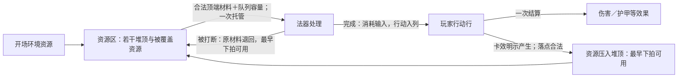

# DIR-038 资源机制设计

Project ID：game-002-optimization（目标主系统game-002）。创建：2026-10-07。设计状态：**Raw Idea / Unqualified**；体验证据：**Hypothesis / NotRun**。本页为探索记录，不是正式GDD、Proposal、Evaluation或Draft Change。

目标：在用户所述第三阶段期间，补足资源区交互与行动卡／资源卡边界，为第四阶段减少需要同时处理的规则分支。使用`gameplay-mechanism-designer`的System Network＋Loop Builder；资格确认使用`grill-with-docs`，按项目约定批量提问。尚未收到本页R1–R8答复；模型推荐不等于用户确认。

## 本轮阅读范围

- 日期／轮次：2026-10-07／R0启动。
- 模式：**CUSTOM**。将用户“阅读更新后的主系统设计文档”解析为下表17份现行设计文件；开读前已报告确切范围，不因包内链接扩读。
- 来源版本：启动时已提交HEAD **`087136b2be11653d2c6f80378e06a563edbf5fc0`**，正文通过该提交读取；不是未提交工作树快照。
- 设计基准：GDD 2.1／TL-1＋INS-1／processing.2＋timing.1＋enemy.1；GDD-0。所读正式文档已记录阶段一、二完成，第三阶段进行中来自本轮用户说明，不据此宣称第三阶段内容已采纳。
- 增补：本轮用户原话；下述通用方法材料。排除：`design/core-concept.md`、`design/legacy-index.md`、主系统来源正文、CONTEXT、历史、其他方向正文、开发、视觉、外部仓库与联网材料。
- 扩读规则：禁止自动扩读。未提交的阶段三inbox文件仅从Git状态获知存在，未读、不作为证据，也不代用户提交。
- 操作规则：根AGENTS（会话提供）、根README、`docs/workspace-map.md`、`docs/github-collaboration.md`、`docs/design-workflow.md`、`yanzhou/AGENTS.md`、探索start／AGENTS／方向入口，以及技能项目适配层。仅用于路由与资格，不作为额外玩法来源。
- 已有范围外背景：本聊天未主动读取额外游戏正文。分配编号时仅使用方向入口的编号／名称；入口中不可避免看到的DIR-037摘要不用于构思，未打开其正文或展示册。

下表路径相对仓库根，均为**全文已读**；最初工具输出截断的GDD和source-review已单独补读。

| 允许材料 | Git blob ID | 用途与边界 |
| --- | --- | --- |
| `yanzhou/design/README.md` | `32221ba626d54045cb48c84ae24d45db078b0e44` | 现行导航与阶段状态 |
| `yanzhou/design/core-design.md` | `99c1c11a705f11b907a02d68438c9691a808cab2` | 自动运行与关键干预的体验目标 |
| `yanzhou/design/GDD.md` | `647f5826145af3f5ca7abf6db64870b6f506f4bc` | 系统与状态边界 |
| `yanzhou/design/baseline.md` | `845b2c0a50010e30952ae491a2448b3762c09548` | 已采纳范围与Unknown |
| `yanzhou/design/systems/01-grammar.md` | `f62db290a730143d10acd420170d6df8b18d0149` | 三类卡、配置与批次承诺 |
| `yanzhou/design/systems/02-wands.md` | `52fcf0939cdb7b5ad45c9a2b116c7aae3dcfcb74` | 自动取料、托管、队列与打断 |
| `yanzhou/design/systems/03-combat.md` | `561ae97a15f97c942ab8ac441fbff061652c4571` | 行动结算、拍序与支付 |
| `yanzhou/design/systems/04-elements-environment.md` | `d79a83cc1d7fbc60e7099ec7f5414dff2f3044a2` | 本方向主要补全对象 |
| `yanzhou/design/systems/05-route-encounters.md` | `bee47832cd39127fa7e0d2cd8ab89aebe10f5a06` | 遭遇环境与初始资源合同 |
| `yanzhou/design/systems/06-rewards-growth.md` | `27d47d99ed000be809c42901e746f32bcfbd7832` | 战外货币、携带与重置 |
| `yanzhou/design/systems/07-interaction-save.md` | `2ea3b023d6b0ace4d1f46b598acbec041c407b8c` | 输入窗口、暂停、信息与保存 |
| `yanzhou/design/content/cards.md` | `b9cfb9886734a32f802a1c9699cf68b54dc3de06` | 各类卡的声明职责 |
| `yanzhou/design/content/wands.md` | `683077849107ca80b2cdf4caddb91c6cbb735d04` | 行动输出与具体内容缺口 |
| `yanzhou/design/content/enemies-encounters.md` | `f2f3d3bfbbf24df8eaa00d4edbde7797c36728a8` | 倒计时压力与环境初态；候选不是发行池 |
| `yanzhou/design/parameters.md` | `12e34b1e892b9d1e715d0f7e81849e6de0c7810e` | 已定结构与未定参数 |
| `yanzhou/design/validation.md` | `06d5fce634aaff47bac486563f8fd905eb251733` | 自动运行、守恒与可解释性预期；均NotRun |
| `yanzhou/design/source-review.md` | `c52bb4b5dba2dcdc5201d98d40bf9999a392883c` | 只读现行审查记录，未穿透来源链接 |

- 未读与缺失：第三阶段的具体法器、卡效、配方工作包及第四阶段详细计划不在本轮清单；不能声称已对它们逐卡兼容复核。初始资源、N／H、实际配方和循环可达性仍Unknown。
- 范围变更：无。结论只覆盖上述设计版本与用户本轮种子；不等于对所有素材、inbox或第三阶段成果完成资格审查。

## 用户原话与已明确的种子

> 使用 [$gameplay-mechanism-designer](../../../.codex/skills/gameplay-mechanism-designer/SKILL.md)，启动言咒新探索：资源机制设计。\
> 阅读模式 CUSTOM，阅读更新后的主系统设计文档，目前进行到第三阶段，为了使第四阶段设计时更加清晰，减轻设计负担，你负责补足资源区的交互机制和行动卡、资源卡的区分
> 我的思路：1.卡牌种类区分：行动卡可以理解为玩家通过法器将要执行的动作，例如攻击、增甲、法术等，它们自动入列、不可复用、结算后消失；而资源卡则可以理解为游戏中可操作的实体资源，包括环境资源（例如树木、矿石等）、法器产物（例如汞、黄金等）等。他们是法器的输入材料、多法器之间的交换媒介或最终的法器产物。后续如果设置召唤流、阵法流等新流派，其种类仍然会是资源卡。2.资源区定义：我的设计是在战场中央放置一个若干格的资源区卡牌行，是所有资源卡的储存放置的地方，理论上资源卡只会存在于法器和资源区中。资源区的每一格都是一个牌堆，资源会按进入顺序堆叠，新的加入或消耗会作用于牌堆顶；这样玩家还要进行资源调控避免所需资源卡被其他资源卡覆盖导致法器无法消耗，增加玩家博弈。其中，战斗开始时资源区会自带当时的环境资源，后续则由玩家行为决定。

上面技能链接仅按本文件位置改写，表达内容保留。由用户直接给出的种子包括：一次性行动；实体资源；环境／加工产物／未来召唤与阵法的资源身份；中央多格牌堆；后进先取；覆盖阻止法器消耗；开场环境资源。是否取消既有周期供给、是否允许免费移动牌顶、资源产物是否仍经行动结算，不能从种子自行扩大确认为主系统变更。

## 推荐方向与目标

**让玩家安排哪些实体保持可用、哪些可以暂时压住，再由法器自动消耗它们，将计划兑现为一次性行动。**覆盖的价值来自生产、缓冲与即时应对争用有限表面，不以玩家反复整理为成功标准。

| 层 | 本方向表述 | 来源／状态 |
| --- | --- | --- |
| 玩家目标 | 在敌牌到期前提供所需材料，形成赶得上的攻防或资源行动 | 现行设计与本轮种子的综合 |
| 体验目标 | 看懂产物流转，对“占一个空格保住材料”或“暂时压住以后再用”承担可解释的取舍 | 模型假设，未验证 |
| 设计目标 | 用同一实体规则容纳材料和未来持续产物，给第四阶段留下少量明确接口 | 用户目标＋模型整理 |
| 手段 | 有限格数、后进先取、预设输入与落点、完整配方一次托管、有限整理 | 前两项来自用户，细则为推荐 |
| 工具 | 堆顶、堆内顺序、来源／可用拍、缺口与覆盖提示、供料方案及整理额度 | 候选交互 |

主坐标为 **WHAT：空间＋权限＋量值资源；HOW：放置／锁定可取资格／分配／消耗；WHERE：资源容器**。辅助坐标为时间域的延迟生效与流程中的行动队列。牌被覆盖改变可取资格，卡本身没有销毁；牌堆数量不是资源总量，资源总量也不等于当前可用量。

## 卡牌身份：行动、资源与铭文分别承担什么

| 判断点 | 行动卡 | 资源卡 | 铭文（保留既有第三类） |
| --- | --- | --- | --- |
| 表示什么 | 即将执行的一次动作 | 能被持有、转移、支付或维持的实体 | 法器持续使用的配置词义 |
| 典型表达 | 攻击、增甲、炼成黄金、召唤、布阵 | 木材／矿石／汞／黄金；未来召唤物／阵法实体 | 填入核心或辅槽的词卡 |
| 存在位置 | 加工完成后进入玩家行动行；不是资源堆库存 | 战中未承诺者在资源区，已托管输入在对应法器处理区 | 对应铭刻槽／战外库存 |
| 谁驱动使用 | 正常队列按拍自动结算 | 合法配方自动取顶；玩家修改供料与落点，整理权限另见R3 | 由合法配置持续读取 |
| 使用后 | 结算或空放后离队消失；同一张不再复用 | 按具体角色消耗、转化或继续存在；不会自动逐拍离队 | 每批生产不销毁 |
| 是否产生后续对象 | 只有卡效明示时生成资源或状态 | 只有资源内容明示时有维护、持续作用或产出 | 不凭词义自行产生额外事件 |

以上示例用于区分类别，不建立发行卡、配方或新流派。行动的“一次性”不意味着其结果也瞬时消失：增甲行动消失后护甲仍按宿主状态规则存在；召唤行动与召唤物是不同对象。后续再次生产的是新行动卡，不是复用上一张。

“环境资源／法器产物”是**来源标签**，“输入材料／交换媒介／终端产物”是**用途标签**，可以重合，不另拆互斥卡类。黄金资源也不自动等于战外金币；增甲结果不自动生成“护甲资源卡”。只有具有独立身份、位置和生命周期的产物才适合做资源实体。

“攻击／防御／打断／其他”仍是现行**行动卡内部的四类卡面种类**，不是行动／资源身份的替代。“炼成黄金”可属其他类行动；“黄金”属于资源。复合行动的种类归第四阶段另定。

推荐把“资源只在法器和资源区存在”限定为**战斗中的实体位置**：法器内只有实际托管的输入，不增加可自由塞牌的第二个仓库；行动卡上尚未兑现的产物承诺不是已存在资源。战后携带仍按既有资格另结算。

图中资源生成路径为R1推荐；R2若选择保留周期补给，则另有环境补给进入S的来源边，不改变行动生产路径。

## 资源区交互候选

以下R1–R8全部待确认。原则只在本方向描述，不写回design。

### 1. 多格牌堆与可用信息（R4／R6）

- 资源区有有限的N格，每格是独立牌堆，允许异类混堆；每堆高度上限H，N／H具体值Unknown。不引入邻近、距离或旧2×5空间规则。
- 同名卡可在显示上折叠数量，但保留实际数量、顺序和实例差异；不得把中间夹着异类牌的同名卡合成可穿透库存。
- 新卡压顶，法器从顶取。可查看整堆的名称、数量、顺序和状态；**看见底牌不赋予取用权限**。
- 每堆常显牌顶、总高度／上限、被覆盖数量、待可用标记及退料容量；详情可通过点击／键盘展开，不仅靠悬停。
- 资源区容量与行动队列Q分别计算。资源格堆多张不会让行动格也能堆牌。

### 2. 输入与落点预设（R1／R4）

每个法器有允许输入格及其优先序；多个法器可以读取同一格，但仍按既有有效供料优先级依次争料。不能把全资源区计数相加当成随时可用材料。

资源产出方声明目标格及有序备选格，按设置自动落顶，不逐张弹窗问去向。可给常用材料与高阶产物分格，但系统不自动跨格找同类牌、重排或将被压资源抽出。输出设置具体承诺点属于新增推荐：随批次开工固定，后改只影响未来批次，遵守既有“已承诺不改写”边界；尚未由R4的简短答复单独确认。

沿R1，“法器产物”是间接来源：法器加工产生行动，行动结算成功才建立资源实体。即使是纯资源生产，也要承担D、行动队列占用和每拍兑现上限；不能从法器直接递给另一法器。

### 3. 可取顶端与完整配方（R5）

允许跨格凑齐配方，也允许从同一堆连续取若干张，前提是从堆顶到所取最深处的**每张牌都实际用于本批完整配方**。不能为拿下面的材料顺手把不需要的上层牌挪走、托管或假装支付。

| 从上到下的牌堆／配方 | 候选结果 |
| --- | --- |
| `[黄金，木材]`；需要木材 | 不能取，木材被黄金覆盖 |
| `[矿石，木材]`；需要矿石＋木材 | 可连续取出这两张 |
| `[木材，木材]`；需要2份木材 | 可取两张，不强迫占两个格子 |
| 格A顶矿石、格B顶木材；需要矿石＋木材 | 两格都在合法输入范围则可凑齐 |
| 格A有可用木材，但其余配方不足或Q不足 | 一张也不取，不留下半配方托管 |

检查应先找到完整合法的顶端组合，再整体托管并预留行动容量；条件不足则按原规则跳过该法器。候选细化：若存在多个完整组合，再按输入格优先序择一，不能因试取顺序失误把本可满足的配方报成缺料。具体同优先级选取规则仍Unknown，进入第四阶段时需闭合。

需要分别显示“总量不足”“有料但被盖住”“资源尚未到可用拍”“输入格未连接”“行动容量不足”。这些原因要求不同操作，不合并成一个缺料提示。

### 4. 自动运行与主动整理（R3）

| 交互方案 | 玩家做什么 | 主要取舍 | 本轮推荐 |
| --- | --- | --- | --- |
| A 只改路由 | 选择输入／输出落点，靠法器消耗顶牌解堵 | 最接近现行自动运行；错误覆盖可能缺少救济 | 保留备选 |
| B 限次整理 | 在A之外，每拍至多移动或弃置一张堆顶牌 | 可救急，需防止每拍操作成为最优 | **推荐候选** |
| C 自由重排 | 暂停时可无限搬顶、抽底、换层 | 整理容易，但覆盖约束可能只剩操作负担 | 不推荐 |

B的候选口径：在既有观察／提交窗口，每拍共享一次**移顶或弃顶**机会，不累计，不因暂停或读档刷新。只处理当前可用、未托管的牌顶；移动需合法目标格有容量，不交换两堆顶、不抽底、不整堆翻转。移动后原堆下层立即露出；移入牌保留身份／状态并压到目标堆顶，最早下一拍可取用。它在此期间仍占位置并盖住下层。

弃顶永久失去该资源、不给补偿，占用同一次机会；因此满堆仍可用损失换出口。非法移动不改变牌堆。免费未来路由设置仍可修改，但不会搬动现有实体。此额度是**新增候选权限**，不是现行免费改线已经包含的能力，也不擅自使用尚未设计的干涉费用。

这套救济仍有风险：玩家可能每拍都搬一次、反复用“移入待用”使持续产物躲避成本，或让弃牌成为无意义的必做劳动。前者需以后观察操作收益，后两者需要生命周期不因移动重置。若普通区间确实依赖连续整理，应优先调整落点、配方或回到A，不能以“增加博弈”解释所有操作。

### 5. 初始环境、生成与满位（R2／R6）

R2推荐按用户种子采用“开场预置，后续由玩家行动产生／转化”，作为对现行周期补给的**替代候选**。这是供给规则变更，不是文字润色。初始格位、数量、层序由遭遇内容声明且公开；是否允许战前重排另为Unknown，不默认免费排成最优。

取消周期补给之后，每个实际套组都要有明确的启动料、可执行首批以及资源来源／消耗。若循环只消耗有限初始资源，必须承认它可能耗尽；若循环净生成资源，必须声明行动、材料、时间与容量成本。不能靠“资源自动恢复”或免费新法器修补无源配方。

新产资源在效果结算时检查声明落点及备选；所有可选落点都满时，该资源产出失败，行动正常离队、制造成本不退，不挤掉旧牌、不积压在队首、不建立隐藏仓库。生成成功的资源当拍占位，最早下一拍可用，盖住的底牌也不能被隔空取走。界面必须提示可能的满位、实际失败与损失。

R6目前只足以确定单份资源产出的失败行为。一次生成多份／多种资源时是整组失败还是部分落下、同拍多来源到货顺序，以及复合行动其他部分是否继续，仍Unknown；不能把R6自动扩展成上述决定。

### 6. 托管与退料容量（R7）

输入从资源区进入法器托管后，原格保留对应数量的**退料容量**。资源实体只在法器内，原格只显示容量标记，不复制卡、不保留原层位，也不遮挡当前牌顶。对每格约束：

`现有资源张数（含待可用）＋本格退料容量 ≤ H`

成功加工完成，制造输入消费并释放相应退料容量；行动仍经队列兑现。被打断则用这些保留容量把输入放回**原格当前牌顶**，退料最早下一拍可用。退回是新到货，不恢复被打断前整副堆序；已发生的新产出和其他消费不回滚。

该候选使承诺的退料有地方放，也防止用慢加工把资源区临时变成额外仓库；代价是处理中材料仍计入资源容量。它与行动预留Q约束两件事：前者保障退款，后者保障完工入行。两种预留都要可见，不能只显示一种“满位”。

来自多格的配方分别保留各原格容量。同拍多次退款或同批多张牌退回的压顶次序仍Unknown；本轮单张／非碰撞示例不代替此总序。战终未完成托管料仍沿主系统Unknown处理，本页不借战中退料规则裁定携带。

### 7. 持续实体：只先固定身份边界（R8）

召唤物／阵法若在未来加入，仍是资源实体；召唤／布阵是生成它们的行动。建议堆顶才可发挥明确的持续作用，被覆盖失去作用资格，但不因覆盖免维护、暂停寿命或重置冷却／状态；本页不新增冷却机制，只禁止移动／覆盖改写内容自身声明的计时。

“处于堆顶”“到可用拍”“维护充分”“未休眠”是不同条件。覆盖不等于现行TL-22的维护不足休眠；揭露一张缺维护的资源也不使它自动满状态。维护料同样受顶端取用限制，维护仍先于新开工；不能因为资源卡身份允许它绕过队列执行未声明攻击。

R8只确定扩展方向。持续实体是否可作为材料、被托管期间如何维护、埋在下层的寿命结束如何移除、多个维护对象争料以及行动类效果的节拍预算，都须在该内容进入设计时声明。不得由“召唤物是资源”推导召唤流或阵法流已经可用。

## 一个能解释选择的局面

纯说明例：格A自上而下为`[黄金，木材]`，格B有一个剩余容量；防御法器的假设配方只需要木材。这里的卡名、配方与容量都不是发行参数。

- 保留堆序：防御端有库存但取不到木材；玩家保住黄金和本拍整理机会，承担防御推迟。
- 按R3将黄金移到B：A的木材立即暴露，可在本拍末联合检查时被防御端托管；B的新顶黄金下拍才可取用，并可能压住B原来的材料。
- B也满时弃置黄金：失去高阶产物换取防御端恢复供料。没有无成本保证所有错误都能挽回。
- 事前改变未来黄金产出的落点：可以避免后续覆盖，不改写这张已在A中的黄金；这是规划回报。

即使木材已暴露，仍需Q有位、D处理与入列等待。假设t拍取料、D=1且无排队，t+1拍完成入行、最早t+2拍生效；不能把整理资源等同于立即获得护甲。若截止更早，这次整理依然来不及。

## 机制链、循环与系统关系

方法来源固定为技能上游提交`29e8c759ca26c6bd4f337744b647dc728bf322b6`，项目适配`game-project-2`。实际读取SKILL、project-integration、input-output-contract、mechanism-elements、mechanism-families、loop-patterns、system-relations及TSV相关命中；未读取整张图谱、design-output-spec或其他游戏案例。检索中其余命中只用于筛选，实际采用下列五条。所有改编均为本轮原创综合，不是图谱原文或玩法证据。

| GMD图谱来源 | 原公式 | 本方向的改编与传递状态 |
| --- | --- | --- |
| H044 物理堆叠 | 行动者选择→位移→侦测→放置 | 扩展：选目标格→检查容量→压顶→改写新旧牌的可取资格；载体是格位、层序及可用拍 |
| H123 基础生产 | 消耗→转化→生成→放置 | 跨流程组合：完整材料托管→处理D→消费并生成行动→排队兑现→明示生成资源→压顶；载体依次为承诺批次、行动、资源实体 |
| H126 物流分流 | 连接→侦测→行动者选择→分配→耦合位移 | 重排并替换：预先选落点与备选→效果时检测→分配并放置；删除实体传送带，不凭图谱加运输动画耗时 |
| H128 资源配给 | 侦测→行动者选择→分配→锁定→解锁 | 扩展：读取顶端可用组合与Q→按有效优先级整体托管→承诺锁定→成功消费或中断返还；失败检查不支付 |
| H129 维护消耗 | 连接→延迟执行→消耗→侦测→锁定 | 条件保留：仅对未来明示维护的资源，按周期足额支付或休眠；覆盖与维护分别判断，不新增免费维护 |

循环候选比较：工具箱模式强调战前配置，充电宝模式强调储备与救急，**本方向优先采用“试菜模式”**，因为玩家要观察实际暴露与拥堵，修改未来计划，再观察是否改善；不需要另造一个成长循环。

`配置输入／落点（保留设置） → 自动加工（托管与时间成本） → 行动兑现（资源、效果与新层序） → 识别覆盖／缺料（可解释信息） → 调整未来设置或有限整理（新层序与机会成本） → 下一轮自动加工`

回到下一轮的是剩余资源、各堆层序、现有承诺和有效路由，不能每轮重置成同一状态。战内暂停冻结计时；打断只退本批输入并损失进度；战终退出该循环，资源携带只按已有资格保留种类／数量，层序与运行状态不自动跨战。压力来自敌方截止、有限容量及实际耗料，不新增随轮数自动加难度。

| 来源→接收方 | 状态载体／关系类型 | 接收规则与后果 | 限制／风险 |
| --- | --- | --- | --- |
| 资源区→多个法器 | 可取实体／争夺 | 维护先付，再按有效供料优先级检查完整配方和Q；先托管者占用真实材料 | 后序法器可能饥饿，不暗加公平轮转 |
| 法器→行动队列 | 承诺批次与容量／阻滞 | D后完成入行，每拍至多兑现一张；制造资源同样排队 | 快速产资源也可能延迟防护 |
| 资源行动→资源区 | 新生实体与层序／转化、反作用 | 压顶改变下一轮可取材料；生产更多也可能堵住所需输入 | N／H约束；资源循环净收益仍须审配方 |
| 资源区→玩家→未来批次 | 堵塞原因、路由与整理结果／反馈 | 玩家看见来源与覆盖，再修改未承诺计划 | 预览必须区分承诺与预测；反复操作风险 |
| 敌方打断→法器→资源区 | 退料、进度损失与新层序／传导 | 指定批次被打断，退料返原格顶、下拍可用 | 不返已入行行动；退料顺序待闭合 |

资源生产闭环仅在实际卡效建立来源后成立，不能仅凭箭头宣称已有可循环配方。N／H和Q可限制吞吐／持有量，但不证明强循环已经平衡；还须检查零耗循环、净增资源、维护吞料与所有堆顶都不可消耗的死锁。

## 与现行规则的关系及第四阶段接口

| 事项 | 本轮处理 | 对后续设计的意义 |
| --- | --- | --- |
| 三类卡牌、行动一次兑现、法器统一产行动 | 延续并解释；资源生成走R1 | 资源名和动作名不会混成同一可复用对象 |
| 资源容量、堆叠、溢出原为Unknown | R3–R7提供候选 | 新卡无需各自发明仓库和返还规则 |
| 环境周期补给 | R2建议替代，待用户明确 | 改变整个配方经济，不能当成已保留的既有条件 |
| 免费未来路由 | 保留；落点承诺细节为新候选 | 不借资源操作改写已托管批次或既有行动 |
| 正常区间自动运行 | 保留目标，R3有操作密度风险 | 需要观察，不以“每拍有事做”代替验证 |
| 召唤／阵法 | 仅分类与接口候选 | 不在本轮增加具体流派、卡池或自主行动权限 |
| 护甲、来源死亡、终局 | 沿所读权威系统 | `content/cards.md`及validation较早段落尚有来源死亡未定的历史残句；以同包SYS-003的enemy.1当前条款解释，不在本方向顺手修改 |

第四阶段可使用下表作为**待确认接口**，不能把它作为已冻结合同：

| 每个内容需要补充 | 解决的问题 |
| --- | --- |
| 资源：来源、数量单位、可用时点、允许落点、是否消耗／持存 | 何时是真实可操作实体 |
| 资源：覆盖对功能的影响、维护／寿命、托管期间行为、携带资格 | 持续对象不会因换层获得隐藏权限 |
| 法器：完整配方、输入格、允许的顶端组合、D、行动张数与Q需求 | 何时开工、为什么等待 |
| 资源行动：生成对象与数量、落点／备选及承诺时点、满位处理 | 不产生隐形库存或事后改线 |
| 遭遇：开局资源的数量／层序、是否存在后续环境来源、可启动程序 | 取消补给后仍有真实可执行起点 |

下一批依赖本轮选择：同拍多来源压顶总序；批内多资源落点与部分失败；输出设置的批次承诺；维护／休眠／覆盖的先后；退料批内顺序；战前重排与战终托管。若R2保留周期供给或R3选择纯路由，上述供给与整理细则需要相应改写。

## 第一批资格澄清

已在聊天中成组提出，**全部尚待答复**。可按编号回答或明确“本批全部按推荐”；只覆盖表中列出的推荐，不自动确认正文中另标Unknown的细化、数值、实验或主系统采纳。

| 编号 | 待确认的问题与推荐 | 理由／影响 | 依赖／状态 |
| --- | --- | --- | --- |
| R1 | 保留“法器→行动入列→行动结算生成资源”，而非直接输出资源 | 保留时间与行动机会成本，明确动作和实体分界 | 独立；Unknown |
| R2 | 开局预置资源；后续新增来自玩家行动，取消无条件周期补给 | 更贴近用户种子，但须重查配方启动、耗尽和净增长 | 独立；与当前TL-14有差异；Unknown |
| R3 | 每拍至多一次移顶或弃顶、不累计；移动即露下层，移入者下拍可用 | 提供救急与满堆出口，代价是一次整理机会／被弃资源／目标格占用 | 可改选仅路由；Unknown |
| R4 | 混堆、堆内顺序公开；预设产出落点及备选，法器仅取指定输入格 | 可预判覆盖，不让自动整理消除布局决策 | 独立；Unknown |
| R5 | 跨格凑料及连续顶端取料均可，但所取每张必须用于完整配方；料与Q齐备才一次托管 | 避免抽底、假消费和半配方占用 | 以R4的输入格范围为边界；Unknown |
| R6 | N／H有限、数值后定；落点及备选皆满则资源产出失败，行动离队且不退制造料、不覆盖旧牌 | 容量有真实后果；单份资源口径，多份／复合另定 | 若选R3可弃顶解堵；Unknown |
| R7 | 托管保留原格退料容量；中断返原格顶部、下拍可用，成功加工释放容量 | 满位也能兑现退款；不保旧层序，增加容量负担 | 以R6有限容量为前提；Unknown |
| R8 | 召唤物／阵法归资源，召唤／布阵归行动；未来持续实体仅堆顶发挥作用，被盖不免维护／停寿命 | 统一身份，同时防止压牌逃避成本；具体内容另定 | 在实际引入持续实体时适用；Unknown |

## 资格与下一步验证

| 资格项 | 当前记录 |
| --- | --- |
| 来源 | 本轮用户原话＋固定17份现行设计＋明确标注的方法改编 |
| 设计对象 | 资源区、资源／行动身份；潜在影响SYS-001／002／003／004／006／007与内容合同 |
| 玩家情境 | 开场布置后的自动运行、敌牌倒计时应对、被覆盖与满位救济 |
| 行为／可见影响 | 用户确认堆顶增减与覆盖限制；具体调控方式仍待R3–R7 |
| 价值 | 用户希望增加资源博弈并减轻第四阶段设计负担；可解释性与操作密度为待验证假设 |
| 与既有设计关系 | 上节逐项列出延续、Unknown补全与周期供给替代；未宣称对第三阶段实际卡表兼容 |
| 主要未知与方法 | 先答R1–R8，再闭合依赖边界；以真实配方做文档情境复核，执行实验另行授权 |

整体继续Raw / Unqualified，不因模型已填满表格而晋级。用户种子与模型细则分别保留，尚无Qualified素材、正式提案或主系统采纳。

最小验证建议（**计划，未执行**）：只用少量格、基础料、一个中间产物、攻防与生产用途及一个明确倒计时，比较“无覆盖的共享库存”和“本候选堆顶库存”。使用同一实际预算和卡效，不增加召唤／阵法或完整元素反应。

观察玩家能否区分库存与可用量，是否主动为关键材料留格、是否在多个有代价方案中选择，以及普通区间的搬牌是否成为固定动作。规则情境应包含：完整配方失败不动牌、覆盖解堵但仍赶不上截止、移入新顶暂不可用、满位产出失败、打断退料不复制、同拍争料不双占、暂停／恢复不刷新整理机会。多来源排序未定时不执行碰撞案例。

若玩家只是每拍重复移顶、总是按类型分堆且无取舍、靠无限等待刷循环，或必须牺牲同一种无用资源才能运行，应修改容量、来源和配方，必要时退回只改路由方案；不能据文档推演宣称玩法成立。真实样本与量化门槛在实验获授权、输入冻结后预先登记。

[返回探索入口](../README.md) · [现行资源系统](../../design/systems/04-elements-environment.md) · [阅读合同](../start.md)
