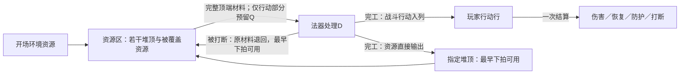

# DIR-038 资源机制设计

Project ID：game-002-optimization（目标主系统game-002）。创建／更新：2026-10-07。设计状态：**局部Qualified，未决补全仍Raw / Unqualified**；体验证据：**Hypothesis / NotRun**。本页为探索记录；已确认部分见[合格素材](M-2026-10-07-resource-entities-and-stacks.md)，尚未采纳到主系统。

目标：在用户所述第三阶段期间，补足资源区交互与行动卡／资源卡边界，为第四阶段减少需要同时处理的规则分支。使用`gameplay-mechanism-designer`的System Network＋Loop Builder；资格确认使用`grill-with-docs`，按项目约定批量提问。已收到两轮答复，R2／R9–R12第二批全部按推荐；当前阅读基线不变。下文分别标注用户决定、推导与尚未确认的细化。

## 本轮阅读范围

- 日期／轮次：2026-10-07／R0启动。
- 模式：**CUSTOM**。将用户“阅读更新后的主系统设计文档”解析为下表17份现行设计文件；开读前已报告确切范围，不因包内链接扩读。
- 来源版本：启动时已提交HEAD **`087136b2be11653d2c6f80378e06a563edbf5fc0`**，正文通过该提交读取；不是未提交工作树快照。
- 设计基准：GDD 2.1／TL-1＋INS-1／processing.2＋timing.1＋enemy.1；GDD-0。所读正式文档已记录阶段一、二完成，第三阶段进行中来自本轮用户说明，不据此宣称第三阶段内容已采纳。
- 增补：本轮用户原话；下述通用方法材料。排除：`design/core-concept.md`、`design/legacy-index.md`、主系统来源正文、CONTEXT、历史、其他方向正文、开发、视觉、外部仓库与联网材料。
- 扩读规则：禁止自动扩读。未提交的阶段三inbox文件仅从Git状态获知存在，未读、不作为证据，也不代用户提交。
- 操作规则：根AGENTS（会话提供）、根README、`docs/workspace-map.md`、`docs/github-collaboration.md`、`docs/design-workflow.md`、`yanzhou/AGENTS.md`、探索start／AGENTS／方向入口，以及技能项目适配层。仅用于路由与资格，不作为额外玩法来源。
- 已有范围外背景：本聊天未主动读取额外游戏正文。分配编号时仅使用方向入口的编号／名称；入口中不可避免看到的DIR-037摘要不用于构思，未打开其正文或展示册。

下表路径相对仓库根，均为**全文已读**；最初工具输出截断的GDD和source-review已单独补读。

| 允许材料 | Git blob ID | 用途与边界 |
| --- | --- | --- |
| `yanzhou/design/README.md` | `32221ba626d54045cb48c84ae24d45db078b0e44` | 现行导航与阶段状态 |
| `yanzhou/design/core-design.md` | `99c1c11a705f11b907a02d68438c9691a808cab2` | 自动运行与关键干预的体验目标 |
| `yanzhou/design/GDD.md` | `647f5826145af3f5ca7abf6db64870b6f506f4bc` | 系统与状态边界 |
| `yanzhou/design/baseline.md` | `845b2c0a50010e30952ae491a2448b3762c09548` | 已采纳范围与Unknown |
| `yanzhou/design/systems/01-grammar.md` | `f62db290a730143d10acd420170d6df8b18d0149` | 三类卡、配置与批次承诺 |
| `yanzhou/design/systems/02-wands.md` | `52fcf0939cdb7b5ad45c9a2b116c7aae3dcfcb74` | 自动取料、托管、队列与打断 |
| `yanzhou/design/systems/03-combat.md` | `561ae97a15f97c942ab8ac441fbff061652c4571` | 行动结算、拍序与支付 |
| `yanzhou/design/systems/04-elements-environment.md` | `d79a83cc1d7fbc60e7099ec7f5414dff2f3044a2` | 本方向主要补全对象 |
| `yanzhou/design/systems/05-route-encounters.md` | `bee47832cd39127fa7e0d2cd8ab89aebe10f5a06` | 遭遇环境与初始资源合同 |
| `yanzhou/design/systems/06-rewards-growth.md` | `27d47d99ed000be809c42901e746f32bcfbd7832` | 战外货币、携带与重置 |
| `yanzhou/design/systems/07-interaction-save.md` | `2ea3b023d6b0ace4d1f46b598acbec041c407b8c` | 输入窗口、暂停、信息与保存 |
| `yanzhou/design/content/cards.md` | `b9cfb9886734a32f802a1c9699cf68b54dc3de06` | 各类卡的声明职责 |
| `yanzhou/design/content/wands.md` | `683077849107ca80b2cdf4caddb91c6cbb735d04` | 行动输出与具体内容缺口 |
| `yanzhou/design/content/enemies-encounters.md` | `f2f3d3bfbbf24df8eaa00d4edbde7797c36728a8` | 倒计时压力与环境初态；候选不是发行池 |
| `yanzhou/design/parameters.md` | `12e34b1e892b9d1e715d0f7e81849e6de0c7810e` | 已定结构与未定参数 |
| `yanzhou/design/validation.md` | `06d5fce634aaff47bac486563f8fd905eb251733` | 自动运行、守恒与可解释性预期；均NotRun |
| `yanzhou/design/source-review.md` | `c52bb4b5dba2dcdc5201d98d40bf9999a392883c` | 只读现行审查记录，未穿透来源链接 |

- 未读与缺失：第三阶段的具体法器、卡效、配方工作包及第四阶段详细计划不在本轮清单；不能声称已对它们逐卡兼容复核。初始资源、格数N、实际配方和循环可达性仍Unknown；R1轮用户已明确堆高暂不设上限。
- 范围变更：游戏材料无增补。后续两轮仅增加本方向自身记录、用户答复及根登记的合格素材模板；不刷新主系统来源提交，不等于对所有素材、inbox或第三阶段成果完成资格审查。

## 用户原话与已明确的种子

> 使用 [$gameplay-mechanism-designer](../../../.codex/skills/gameplay-mechanism-designer/SKILL.md)，启动言咒新探索：资源机制设计。\
> 阅读模式 CUSTOM，阅读更新后的主系统设计文档，目前进行到第三阶段，为了使第四阶段设计时更加清晰，减轻设计负担，你负责补足资源区的交互机制和行动卡、资源卡的区分
> 我的思路：1.卡牌种类区分：行动卡可以理解为玩家通过法器将要执行的动作，例如攻击、增甲、法术等，它们自动入列、不可复用、结算后消失；而资源卡则可以理解为游戏中可操作的实体资源，包括环境资源（例如树木、矿石等）、法器产物（例如汞、黄金等）等。他们是法器的输入材料、多法器之间的交换媒介或最终的法器产物。后续如果设置召唤流、阵法流等新流派，其种类仍然会是资源卡。2.资源区定义：我的设计是在战场中央放置一个若干格的资源区卡牌行，是所有资源卡的储存放置的地方，理论上资源卡只会存在于法器和资源区中。资源区的每一格都是一个牌堆，资源会按进入顺序堆叠，新的加入或消耗会作用于牌堆顶；这样玩家还要进行资源调控避免所需资源卡被其他资源卡覆盖导致法器无法消耗，增加玩家博弈。其中，战斗开始时资源区会自带当时的环境资源，后续则由玩家行为决定。

上面技能链接仅按本文件位置改写，表达内容保留。由用户直接给出的种子包括：一次性行动；实体资源；环境／加工产物／未来召唤与阵法的资源身份；中央多格牌堆；后进先取；覆盖阻止法器消耗；开场环境资源。是否取消既有周期供给、是否允许免费移动牌顶、资源产物是否仍经行动结算，不能从种子自行扩大确认为主系统变更。

## R1轮用户答复与确认边界（2026-10-07）

> 1.法器同时产行动和资源，行动卡的重点是处理战斗相关事项，例如造成伤害、恢复血量、打断敌人行动，不涉及资源系统 2.资源整理可以加入玩家能力中，消耗费用进行 4.按推荐 5.确认 6.堆高暂时不设上限 7.按推荐 8.按推荐

按答复内容映射，不机械按用户序号挪移：第2条回答原R3的整理方式，**未回答原R2的环境供给**。

| 原问题 | 本轮状态 | 确认范围与未决部分 |
| --- | --- | --- |
| R1 | 用户改写 | 法器支持行动与资源两类产出；行动用于伤害、恢复、打断等战斗事项，不承担资源系统功能。每批是否必有两类、两类如何共用D／Q另问R9–R10 |
| R2 | 未回答 | 不能因用户第2条写了整理费用而认定取消或保留周期补给 |
| R3 | 用户改写 | 整理纳入消耗费用的玩家能力方向；不确认旧的免费每拍一次、弃置、移动范围或生效时点 |
| R4 | 已确认 | 可混堆、顺序公开、预设产出落点及备选、法器只取指定输入格；具体输出承诺时点仍未确认 |
| R5 | 已确认，有新增类型依赖 | 可跨格凑料、连续取顶；每张都用于完整配方，满足条件才整体托管。行动容量约束继续约束行动生产，是否约束纯资源生产另问R10 |
| R6 | 用户改写 | 堆高暂不设上限；保留若干独立格子的结构。旧满堆失败与H上限退为历史，不将“暂不设”写成永不允许上限 |
| R7 | 已确认，容量前提变化 | 保留输入来源与退料归属、打断返原格顶部、下拍可用、成功加工结束退料承诺。不恢复旧层序；在不限堆高下容量保留不构成可用空间限制 |
| R8 | 局部确认，存在交叉冲突 | 召唤物／阵法是资源；未来持续实体只有堆顶发挥作用，被盖不免维护／停寿命。旧“召唤／布阵作为生成资源的行动”与本轮R1冲突，生成路径另问R11 |

已确认部分形成[局部Qualified素材](M-2026-10-07-resource-entities-and-stacks.md)。这不是整体设计合格、主系统Accepted或允许执行实验。原R0完整草案与候选失败路径保留在[固定提交7c305dc](https://github.com/dsaj4/game_design/blob/7c305dcfc7b4ffe425e4b7b43d8b7f5614fbccf6/yanzhou/exploration/DIR-038-resource-mechanisms/README.md)；本页呈现两轮答复后的当前范围，末尾保留原题和处置。

## 第二轮答复与当前口径（2026-10-07）

用户对完整展示的R9、R10、R2、R11、R12回答：

> 全部按推荐

本批逐项确认如下；上节第一轮记录保留当时状态，当前以本节为准。

| 编号 | 已确认推荐 | 生效范围 |
| --- | --- | --- |
| R9 | 每份配方分别声明行动张数和资源产量；允许纯行动、纯资源及一批双产，不要求每个法器每批必出两类 | 输出类型与批次内容合同 |
| R10 | 一批共用一次处理D；完工时行动入列、资源直接压入指定堆顶且最早下拍可用；只按行动张数预留Q，纯资源不占Q；双产若Q不足则整批不开工 | 双输出生产、时点和容量接口 |
| R2 | 开局预置环境资源，后续由法器生产／转化；取消无条件周期补给；真实配方须检查启动与耗尽 | 替代本方向中的旧TL-14供给前提，尚未回写主系统 |
| R11 | 法器直接产出召唤物／阵法资源；若以后需要命令其攻击／保护，再用战斗行动表达；堆顶才发挥作用，被盖不免维护／停寿命 | 解决第一轮R1与旧R8的生成路径冲突，不建立具体流派或自主攻击规则 |
| R12 | 整理只登记为玩家能力接口，消耗既有玩家能力费用；能力范围、价格、次数与生效时点由玩家能力设计决定 | 旧免费每拍一次、弃置、抽底与整堆重排均不自动保留 |

两轮已确认结构构成局部Qualified素材。需要第四阶段补齐的同拍压顶顺序、输出落点承诺时点、持续实体完整生命周期等仍为Unknown，不从“全部按推荐”推导额外采纳。

## 推荐方向与目标

**让玩家安排哪些实体保持可用、哪些可以暂时压住，再由法器把材料加工成战斗行动、资源实体或两者；必要时花费玩家能力费用整理。**堆高不限，稀缺的是可同时暴露并取用的堆顶，不是总储量。两类产量由每份配方声明。

| 层 | 本方向表述 | 来源／状态 |
| --- | --- | --- |
| 玩家目标 | 在敌牌到期前提供所需材料，形成赶得上的战斗行动，并维持资源生产 | 现行设计与用户R1综合 |
| 体验目标 | 看懂产物流转，对“占一个空格保住材料”或“暂时压住以后再用”承担可解释的取舍 | 模型假设，未验证 |
| 设计目标 | 用同一实体规则容纳材料和未来持续产物，给第四阶段留下少量明确接口 | 用户目标＋模型整理 |
| 手段 | 若干格、后进先取、预设输入与落点、完整配方一次托管、付费整理方向 | 已确认结构；玩家能力细则另定 |
| 工具 | 堆顶、堆内顺序、来源／可用拍、缺口与覆盖提示、供料方案及玩家能力费用 | 展示细化仍为候选 |

主坐标为 **WHAT：空间＋权限＋量值资源；HOW：放置／锁定可取资格／分配／消耗；WHERE：资源容器**。辅助坐标为时间域的延迟生效与流程中的行动队列。牌被覆盖改变可取资格，卡本身没有销毁；牌堆数量不是资源总量，资源总量也不等于当前可用量。

## 卡牌身份：行动、资源与铭文分别承担什么

| 判断点 | 行动卡 | 资源卡 | 铭文（保留既有第三类） |
| --- | --- | --- | --- |
| 表示什么 | 即将执行的一次战斗动作 | 能被持有、转移、支付或维持的实体 | 法器持续使用的配置词义 |
| 典型表达 | 造成伤害、增甲、恢复血量、打断敌人行动 | 木材／矿石／汞／黄金；未来召唤物／阵法实体 | 填入核心或辅槽的词卡 |
| 存在位置 | 加工完成后进入玩家行动行；不是资源堆库存 | 战中未承诺者在资源区，已托管输入在对应法器处理区 | 对应铭刻槽／战外库存 |
| 谁驱动使用 | 正常队列按拍自动结算 | 合法配方自动取顶；玩家修改供料与落点，付费整理能力细则另定 | 由合法配置持续读取 |
| 使用后 | 结算或空放后离队消失；同一张不再复用 | 按具体角色消耗、转化或继续存在；不会自动逐拍离队 | 每批生产不销毁 |
| 功能边界 | 不生成、搬运或转化资源；战斗结果可形成护甲等宿主状态 | 来源与持续作用须明示，法器可以直接生产资源 | 不凭词义自行产生额外事件 |

以上示例用于区分类别，不建立发行卡、配方或新流派。行动的“一次性”不意味着其结果也瞬时消失：增甲行动消失后护甲仍按宿主状态规则存在。后续再次生产的是新行动卡，不是复用上一张。R11已明确召唤物／阵法由法器直接产出；未来命令它们战斗可以由战斗行动表达，不再把资源生成做成行动牌。

“环境资源／法器产物”是**来源标签**，“输入材料／交换媒介／终端产物”是**用途标签**，可以重合，不另拆互斥卡类。黄金资源也不自动等于战外金币；增甲结果不自动生成“护甲资源卡”。只有具有独立身份、位置和生命周期的产物才适合做资源实体。

“攻击／防御／打断／其他”是所读基线的**行动卡内部四类卡面种类**，不是行动／资源身份的替代。当前探索不再把“炼成黄金”列为其他类行动；资源生产是法器加工职责。恢复血量、复合战斗效果的种类如何标注仍由后续卡面合同明确，本轮不暗增或删除一种符号。

“资源只在法器和资源区存在”按本方向的战斗交互讨论；战后携带仍按既有资格另结算。R10已明确资源完工即放资源区，处理中尚未完成的产出不是已存在资源。法器内仅存实际托管输入、不额外开放自由仓储，是本轮推荐限制，尚未单独确认；无论是否另设仓储，已托管输入不能免费挪走。

图中两类输出按配方选择其一或同时存在；纯资源不占Q，双产所需Q不足则整批不开工。资源经行动生成与无条件周期补给两条旧边已退出本方向。原料在开工托管，成功完工消费；新资源最早下拍投入下一批，不能同拍无限串联。

## 资源区交互候选

下述确认只在本方向有效；已确认结构与模型补全分别标注，不写回design。

### 1. 多格牌堆与可用信息（R4／R6）

- 用户确认：资源区有若干独立格N，允许异类混堆，**堆高暂不设上限**。N具体值Unknown，不引入邻近、距离或旧2×5空间规则。
- 同名卡可在显示上折叠数量，但保留实际数量、顺序和实例差异；不得把中间夹着异类牌的同名卡合成可穿透库存。
- 新卡压顶，法器从顶取。可查看整堆的名称、数量、顺序和状态；**看见底牌不赋予取用权限**。
- 候选展示：每堆常显牌顶、当前张数、被覆盖数量、待可用标记；详情可通过点击／键盘展开，不仅靠悬停。不显示不存在的堆高上限或资源“已满”。
- 推导：N限制可同时暴露的牌顶数量，不限制总持有张数。行动队列Q仍有限；资源堆多张不使行动格也能堆牌。

### 2. 输入与落点预设（R1／R4）

每个法器有允许输入格及其优先序；多个法器可以读取同一格，但仍按既有有效供料优先级依次争料。不能把全资源区计数相加当成随时可用材料。

资源产出方声明目标格及有序备选格，按设置自动落顶，不逐张弹窗问去向。可给常用材料与高阶产物分格，但系统不自动跨格找同类牌、重排或将被压资源抽出。输出设置具体承诺点属于新增推荐：随批次开工固定，后改只影响未来批次，遵守既有“已承诺不改写”边界；尚未由R4的简短答复单独确认。

沿R1／R9／R10，法器可以直接生产资源，不经战斗行动兑现。资源完工压入指定资源格，最早下拍再供其他法器自动取顶；两法器不因称为“交换媒介”就获得越过资源区与可用拍的直传权限。

| 批次配方类型 | 开工与容量 | 完工输出 |
| --- | --- | --- |
| 纯行动 | 完整配方＋本批行动张数对应的Q | 全部行动立即入列，按既有队列与最早下拍资格兑现 |
| 纯资源 | 完整配方，不占Q | 资源直接落指定堆顶，最早下拍可用 |
| 行动＋资源 | 完整配方＋行动部分所需Q；Q不足整批等待 | 共用一次D，完工时行动入列、资源落顶；不先产一半再等另一半 |

D仍为至少1拍的整数，a拍开工、a+D拍完成；缺料等待、明确打断、一次整体托管和拍末检查框架继续适用。双产共享一批，不把同份制造输入重复付给两个输出；各配方真实材料量仍待设计。

### 3. 可取顶端与完整配方（R5）

允许跨格凑齐配方，也允许从同一堆连续取若干张，前提是从堆顶到所取最深处的**每张牌都实际用于本批完整配方**。不能为拿下面的材料顺手把不需要的上层牌挪走、托管或假装支付。

| 从上到下的牌堆／配方 | 候选结果 |
| --- | --- |
| `[黄金，木材]`；需要木材 | 不能取，木材被黄金覆盖 |
| `[矿石，木材]`；需要矿石＋木材 | 可连续取出这两张 |
| `[木材，木材]`；需要2份木材 | 可取两张，不强迫占两个格子 |
| 格A顶矿石、格B顶木材；需要矿石＋木材 | 两格都在合法输入范围则可凑齐 |
| 格A有可用木材，但其余配方不足；或含行动批次所需Q不足 | 一张也不取，不留下半配方托管；纯资源批次不占Q |

已确认：先满足完整配方再整体托管，不能部分取料；含行动批次同时满足对应Q，纯资源不占Q。候选细化：若存在多个完整组合，再按输入格优先序择一，不能因试取顺序失误把本可满足的配方报成缺料。具体同优先级选取规则仍Unknown，进入第四阶段时需闭合。

需要分别显示“总量不足”“有料但被盖住”“资源尚未到可用拍”“输入格未连接”“行动容量不足”。这些原因要求不同操作，不合并成一个缺料提示。

### 4. 自动运行与主动整理（R3）

**已确认R3／R12：整理属于付费玩家能力接口，消耗既有玩家能力费用。**本方向先确定职责，不提前设计能力清单、价格、次数、目标范围或执行时点。战斗行动卡不承担资源整理；免费未来供料改线也不因此可以移动现有实体。

普通运行仍靠预设输入／输出、自动取顶与完整配方开工；改变未来计划是日常控制，付费能力是可能的修正手段。玩家比较维持当前生产、改变未来落点，或为处理当前覆盖支付费用。只有具体能力已被设计并合法支付，才执行该能力明示的整理结果。

原R0方案处置：免费每拍一次移顶／弃顶已由付费方向替代；不继承“一拍一次”“不累计”“即时露底”“移入下拍可用”等未确认能力细则。抽底、弃置、交换与整堆重排都没有随接口自动开放。原先满堆时弃置作为出口的失败路径保留在固定R0记录，当前无堆高上限，不再用满堆解释强制弃牌。

仍需保留的风险：整理太便宜会让每次覆盖都被无代价消除，太贵则可能让一次错误层序长期锁死；反复付费才能维持普通生产也会偏离自动运行目标。不能仅凭增加费用就宣称操作负担已解决。实际能力设计须说明是否改变资源身份、寿命或状态，并按已提交支付保存，不能借暂停／恢复返费。

### 5. 初始环境、直接产出与无堆高上限（R2／R6／R10）

**已确认R2：开场预置环境资源，之后由法器生产／转化，取消无条件周期补给。**这是对所读TL-14的供给规则变更，当前只在探索范围成立。初始格位、数量、层序应由遭遇内容声明；是否允许战前重排另为Unknown，不默认免费排成最优。

每个实际套组都要有明确启动料、可执行首批以及资源来源／消耗。只消耗有限初始资源的循环可能耗尽；净生成资源的循环须声明实际材料、D和产量。纯资源已不占Q，不能把行动队列瓶颈继续算作它的平衡成本，也不能靠未声明的自动恢复修补无源配方。

**已确认R10：资源完工直接落顶、最早下拍可用。**落顶会立即形成新的层序；本拍新顶尚不可用时，也不能越过它拿下面的牌。后一句是对“新牌已落顶＋只取顶”的推导，非额外收费或新卡效。

**不限堆高的推导：**只要指定资源格合法，就不会因为牌太多而满位；旧“落点全满、产出失败且不退材料”不适用，不建立总容量或隐藏的同类上限。备选落点设置保留，但不再以堆高满作为切换理由；格子失效等异常是否存在及如何处理仍Unknown，不为了使用备选机制凭空增加封格规则。

同拍多法器产出与退款、同批多资源的压顶次序会影响下一拍可用顶牌，仍需第四阶段明确。当前只确认完工与可用拍，不把行动同拍入列顺序直接扩充为全部资源事件总序。总量可增长不代表覆盖无影响：新牌越多，目标材料可能埋得越深。

### 6. 托管、来源与退料（R7）

用户确认原R7，同时取消堆高上限。保留其退料承诺：托管输入记录各自来源格；成功加工消费输入并结束退料承诺；被明确打断时输入返还**原格当前牌顶**，最早下一拍可用。不恢复原层位、加工进度或被打断前整副堆序；已发生的其他消费不回滚。

容量前提的推导：不限堆高时，每张退料都可放回合法原格，因此原R7“保留容量、不让新产物占满”的约束不再产生阻塞。保留来源／退料承诺即可表达其用途，不显示有限H或额外资源预留槽，不以退料记账阻止新产物压顶。这不改变有限行动Q的预留与打断后下拍复用规则。

来自多格的配方分别退回各原格。同拍多次退款或同批多张牌退回的压顶次序仍Unknown。战终未完成加工的托管料仍沿主系统Unknown处理，本页不借战中退款规则裁定携带。若以后重新引入有限堆高，需要重新审查真实退料容量，不能悄悄丢弃已承诺退款。

### 7. 持续实体：只先固定身份边界（R8）

已确认R8／R11：召唤物／阵法若在未来加入，仍是资源实体，**由法器直接产出**；若另需命令它攻击／保护，可用战斗行动表达。只有堆顶实体发挥其明确的持续作用，被覆盖失去作用资格，但不因覆盖免维护或暂停寿命。其是否本来具有寿命／维护须由具体资源声明，不给所有原料自动加维护费。

“处于堆顶”“到可用拍”“维护充分”“未休眠”是不同条件。覆盖不等于现行TL-22的维护不足休眠；揭露一张缺维护的资源也不使它自动满状态。维护仍先于新开工；维护支付怎样应用顶端规则、多个维护对象怎样争料尚须结合内容明确。资源身份不会自动赋予自主攻击、独立行动队列或免费战斗触发。

本轮只确定扩展身份、生成路径和覆盖边界。持续实体是否可作为材料、被托管期间如何维护、埋在下层的寿命结束如何移除、多个维护对象争料及持续效果的节拍预算，都须在该内容进入设计时声明。不得由“召唤物是资源”推导完整召唤流或阵法流已经可用。

## 一个能解释选择的局面

纯说明例：格A自上而下为`[黄金，木材]`，格B为另一合法资源格；防御法器的假设配方只需要木材。卡名、配方与D示例都不是发行参数。

- 保留堆序：防御端有库存但取不到木材；玩家保留费用，承担防御推迟。
- 用其他合法配方消耗黄金：可以自动露出木材，但该配方必须真实需要黄金，不能为取木材而假消费。
- 改变未来黄金产出的落点到B：可防止后续覆盖，不移动这张已在A的黄金。B不会因堆高满而拒收，但其原顶资源可能被新黄金盖住。
- 花费整理：若后续玩家能力实际提供合法的移顶能力，可比较支付费用与等待其他生产的代价；当前未确认该能力的范围和生效时点，不能在逐拍例中假定它立即露底。

假设木材已经合法可取，t拍末防御批次开工、D=1且无排队，则t+1完工入列、最早t+2生效。若同样D=1的是纯资源批次，t+1资源直接落顶、t+2可用于其他法器开工；它不需要行动行有空位。双产批次则在t+1同时交付两类，但开工必须先取得行动部分所需Q。两个出口不要画成同一条等待队列。

## 机制链、循环与系统关系

方法来源固定为技能上游提交`29e8c759ca26c6bd4f337744b647dc728bf322b6`，项目适配`game-project-2`。实际读取SKILL、project-integration、input-output-contract、mechanism-elements、mechanism-families、loop-patterns、system-relations及TSV相关命中；未读取整张图谱、design-output-spec或其他游戏案例。检索中其余命中只用于筛选，实际采用下列五条。所有改编均为本轮原创综合，不是图谱原文或玩法证据。

| GMD图谱来源 | 原公式 | 本方向的改编与传递状态 |
| --- | --- | --- |
| H044 物理堆叠 | 行动者选择→位移→侦测→放置 | 扩展：选合法目标格→压顶→改写新旧牌的可取资格；载体是格位、层序及可用拍。堆高不限，删除容量满检查 |
| H123 基础生产 | 消耗→转化→生成→放置 | 跨流程分支：完整材料托管→处理D→消费输入→行动入列及／或资源直接压顶；分别携带待兑现战斗效果和下一拍资源 |
| H126 物流分流 | 连接→侦测→行动者选择→分配→耦合位移 | 重排并替换：预先选落点与备选→完工时放置；删除实体传送带，不凭图谱加运输耗时或满堆回退 |
| H128 资源配给 | 侦测→行动者选择→分配→锁定→解锁 | 扩展：读取顶端完整配方与行动部分所需Q→整体托管→承诺锁定→成功消费或中断返还；纯资源不占Q |
| H129 维护消耗 | 连接→延迟执行→消耗→侦测→锁定 | 条件保留：仅对未来明示维护的资源，按周期足额支付或休眠；覆盖与维护分别判断，不新增免费维护 |

循环候选比较：工具箱模式强调战前配置，充电宝模式强调储备与救急，**本方向优先采用“试菜模式”**，因为玩家要观察实际暴露与拥堵，修改未来计划，再观察是否改善；不需要另造一个成长循环。

`配置输入／落点（保留设置） → 自动加工（托管与时间成本） → 分别输出战斗行动／资源（待兑现效果与新层序） → 识别覆盖／缺料（可解释信息） → 调整未来设置或使用合法付费整理能力（新计划／费用成本） → 下一轮自动加工`

回到下一轮的是剩余资源、各堆层序、现有承诺、有效路由及剩余玩家能力费用，不能每轮重置成同一状态。战内暂停冻结计时；打断只退本批输入并损失进度；战终退出该循环，资源携带只按已有资格保留种类／数量，层序与运行状态不自动跨战。压力来自敌方截止、有限堆顶、含行动批次的Q及实际耗料，不新增资源总量上限或随轮数自动加难度。

| 来源→接收方 | 状态载体／关系类型 | 接收规则与后果 | 限制／风险 |
| --- | --- | --- | --- |
| 资源区→多个法器 | 可取实体／争夺 | 维护先付，再按有效供料优先级检查完整配方；含行动批次还查Q | 后序法器可能饥饿，不暗加公平轮转 |
| 法器→行动队列 | 行动部分与容量／阻滞 | D后行动入列，每拍至多兑现一张；纯资源不走此边 | 双产批次仍受Q限制，纯资源不能虚计排队成本 |
| 法器→资源区 | 新生实体与层序／转化、反作用 | D后资源落顶，下拍可用；更多产物可能盖住所需输入 | N限制暴露面；没有H或总持有量上限，须审净增长 |
| 资源区→玩家→未来批次 | 堵塞原因、路由与整理结果／反馈 | 玩家看见来源与覆盖，再修改未承诺计划 | 预览必须区分承诺与预测；反复操作风险 |
| 敌方打断→法器→资源区 | 退料、进度损失与新层序／传导 | 指定批次被打断，退料返原格顶、下拍可用 | 不返已入行行动；退料顺序待闭合 |

资源生产闭环仅在实际法器配方建立来源后成立，不能仅凭箭头宣称已有可循环配方。D与下拍可用阻止同拍无限串联，但不限制长时间总积累；堆高不限、纯资源不占Q时尤其要检查净增资源是否压倒其他选择。还须检查开场无启动料、维护吞料、后序法器饥饿及所有堆顶都不可消耗的死锁；付费能力接口并不保证每个坏局面都有可用救济。

## 与现行规则的关系及第四阶段接口

| 事项 | 本轮处理 | 对后续设计的意义 |
| --- | --- | --- |
| 三类卡牌与行动一次兑现 | 保留身份分工；行动专职战斗，法器新增直接资源输出 | 替代所读TL-38“统一行动输出”及资源行动路径 |
| 生产D与有限Q | D适用两类；Q只按行动张数计算，双产整批检查 | 纯资源不再受玩家每拍一行动的吞吐约束 |
| 资源堆叠与容量 | 混堆公开、顶端完整取料、堆高暂不限 | 有限暴露面仍产生覆盖；满堆失败分支不适用 |
| 环境周期补给 | R2已确认取消，改开场预置＋法器后续生产 | 须审启动料、耗尽与净增长，尚未回写TL-14 |
| 免费未来路由 | 保留；落点承诺细节为新候选 | 不借资源操作改写已托管批次或既有行动 |
| 正常区间自动运行 | 保留目标，整理只进入付费玩家能力接口 | 不设计免费每拍整理；实际操作密度仍未验证 |
| 召唤／阵法 | 分类、法器直接生成及覆盖边界已确认 | 不在本轮增加具体流派、卡池或自主行动权限 |
| 护甲、来源死亡、终局 | 沿所读权威系统 | `content/cards.md`及validation较早段落尚有来源死亡未定的历史残句；以同包SYS-003的enemy.1当前条款解释，不在本方向顺手修改 |

第四阶段可引用局部Qualified素材中的已确认结构；下表是还需各内容填入的字段，尚未冻结完整制作规格：

| 每个内容需要补充 | 解决的问题 |
| --- | --- |
| 资源：来源、数量单位、可用时点、允许落点、是否消耗／持存 | 何时是真实可操作实体 |
| 资源：覆盖对功能的影响、维护／寿命、托管期间行为、携带资格 | 持续对象不会因换层获得隐藏权限 |
| 法器：完整配方、输入格、允许顶端组合、D、分别声明的行动张数／资源产量 | Q只按行动张数预留；纯资源及双产使用同一开工框架 |
| 资源输出：实体与数量、落点／备选及承诺时点、批内和同拍压顶顺序 | 不因多个来源同时完成而让层序不可解释 |
| 遭遇：开局资源的数量／层序、实际法器生产来源、可启动程序 | 取消周期补给后仍有真实可执行起点 |
| 玩家能力：整理范围、费用、次数、生效时点、合法目标与失败支付 | 只由已定义能力处理当前资源层序，不由免费改线扩权 |

第四阶段剩余边界：同拍多来源与批内多资源压顶次序；输出设置的批次承诺；维护／休眠／覆盖的先后；退料批内顺序；战前重排、法器是否有独立仓储与战终托管。玩家能力细则按R12移交相应设计；堆高上限和满堆处理不再作为当前必填参数。以上不阻止已明确结构局部晋级，但未决条款不能被实现或UI默认顺序补齐。

## 第一批资格澄清

以下保留R0提问原意与两轮后的处置，不能把已被替代的推荐读成当前规则。第二批的原推荐及答复见本页“第二轮答复与当前口径”。

| 编号 | R0原问题／推荐 | 原理由／影响 | 当前处置 |
| --- | --- | --- | --- |
| R1 | 法器先产行动，再由行动生成资源 | 原为保留队列成本 | 用户替代：法器直接双类输出；R9／R10闭合批次接口 |
| R2 | 开局预置，取消无条件周期补给 | 须重查启动、耗尽和净增长 | 第二批确认，后续来源明确为法器生产／转化 |
| R3 | 免费每拍一次移顶或弃顶，移入下拍可用 | 原为解堵候选 | 用户替代：付费玩家能力；R12只确认接口，旧细则不继承 |
| R4 | 混堆公开、预设落点及备选、指定输入格 | 预判覆盖与自动执行 | 已确认；承诺时点仍另定 |
| R5 | 跨格／连续取顶，完整配方一次托管 | 不抽底、不假消费、不半支付 | 已确认；R10补充只有行动部分需要Q |
| R6 | N／H有限，满位产出失败 | 原为容量取舍 | H上限由用户取消，满堆分支当前不适用 |
| R7 | 原格留退料容量，退回原格顶、下拍可用 | 保证退料归属与不回滚层序 | 已确认；不限H后容量约束退为无阻塞的来源／退款承诺 |
| R8 | 召唤物／阵法是资源，生成它们为行动；堆顶作用、被盖不免维护／停寿命 | 原为统一分类 | 实体与覆盖规则确认；生成路径由R11改为法器直接产资源 |

## 资格与下一步验证

| 资格项 | 当前记录 |
| --- | --- |
| 来源 | 启动原话、两轮确认＋固定17份现行设计＋明确标注的方法改编 |
| 设计对象 | 资源区、资源／行动身份；潜在影响SYS-001／002／003／004／006／007与内容合同 |
| 玩家情境 | 开场布置后的自动运行、敌牌倒计时应对、被覆盖时的生产调控与付费整理方向 |
| 行为／可见影响 | 双类输出、公开混堆、顶端完整取料、不限堆高、退料回原格与付费能力接口均已有用户确认 |
| 价值 | 用户希望增加资源博弈并减轻第四阶段设计负担；可解释性与操作密度为待验证假设 |
| 与既有设计关系 | 上节逐项列出延续、Unknown补全与周期供给替代；未宣称对第三阶段实际卡表兼容 |
| 主要未知与方法 | 第四阶段闭合同拍次序、承诺时点、实际配方和生命周期；玩家能力另定范围与费用；执行实验另行授权 |

两轮已确认范围通过七项资格闸门，见[局部Qualified素材](M-2026-10-07-resource-entities-and-stacks.md)。尚无正式Proposal／Evaluation／Draft Change或主系统采纳；模型新增细化仍Raw，资格不覆盖整个第四阶段或未读的第三阶段内容。

最小验证建议（**计划，未执行**）：只用少量格、基础料、一个中间产物、攻防与生产用途及一个明确倒计时，比较“无覆盖的共享库存”和“本候选堆顶库存”。使用同一实际预算和卡效，不增加召唤／阵法或完整元素反应。

观察玩家能否区分库存与可用量，是否主动为关键材料保留暴露位置、是否在多个有代价方案中选择，以及普通区间是否依赖反复付费整理。规则情境应包含：完整配方失败不动牌、纯资源在Q满时仍可按其他条件开工、双产Q不足整批等待、资源完工即压顶但下拍才可用、深堆不溢出、打断退料不复制、同拍争料不双占、付费后恢复不返费。多来源排序或具体能力时点未定时不执行依赖它们的碰撞／能力案例。

若玩家只是反复付费移顶、总是按类型分堆且无取舍，或靠长时间纯资源生产囤积取得支配优势，应复审来源、配方、D和实际能力设计。未来如建议恢复堆高上限，必须作为新的变更提出，不能用调参名义覆盖用户本轮决定。真实样本与量化门槛在实验获授权、输入冻结后预先登记；本文没有玩法执行或真人证据。

[返回探索入口](../README.md) · [现行资源系统](../../design/systems/resource-system/rules.md) · [阅读合同](../start.md)
