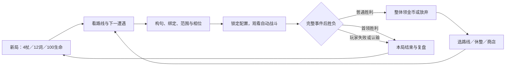

> 历史快照：2026-09-23整理前正文；只用于来源追溯，不构成当前规则或新的审批要求。原文中的“当前”均按原日期理解。
> 原路径：`workspaces/game-002/game-design-workflow/gdd/GDD-2026-09-14-yanzhou-full-game.md`。本副本仅调整相对链接，原字节SHA见整理清单。

# 《言咒》全游戏GDD

## 0. 文档控制

| 字段 | 内容 |
| --- | --- |
| 文档ID／Project ID | GDD-G002-FULL-001 / game-002 |
| 当前版本 | 1.0 / RC1，首版设计与参数基准 |
| 文档成熟度 | GDD-2：制作交接版 |
| 设计状态 | Accepted；用户授权范围内完成现有推荐的采纳与整理 |
| 证据状态 | 规则选择有决策依据；平衡、完整体验与成品可读性Hypothesis／NotRun |
| 负责人 | 用户为设计负责人；Codex负责本次规格整理与授权内裁决 |
| 评审责任 | 主设计审规则与范围；UI／美术／音频审功能表达；QA与玩家研究分别验收规则和体验 |
| 创建／更新日期 | 2026-09-14 |
| 目标里程碑 | 首版完整内容与玩家流程的设计交接；不表示成品或玩法测试完成 |
| 关联提案／评估 | [首版补齐提案](../../../../sources/proposals/P-2026-09-14-complete-first-release-design.md)／[评估](../../../../sources/evaluations/E-2026-09-14-complete-first-release-design.md) |
| 关联决策 | [CORE-032–036采纳文本](../../../../sources/draft-changes/D-2026-09-14-complete-first-release-design.md)／[决策记录](../../../../governance/decision-log.md) |
| 关联正式素材／inbox审查 | [68份正式素材、47份原始记录逐项审查](../../../../design/source-review.md)；没有未晋级候选直接充当规则 |
| 关联验证 | [本Wiki验收输入与风险](../../../../design/validation.md)；新规格NotRun |
| 关联开发进度 | [开发进度索引](../../../../development/README.md)，只建立设计关联，不在GDD记录实现状态 |

### 0.1 目标与阅读方式

本GDD回答首版玩家从新局到单阶段首领结束的全部设计问题，是后续开发的第一材料。此主页保留统一模板0–18章，各Wiki页承载对应完整规格；**Wiki页都是本GDD正文**。逐卡、参数、敌人、路线和操作细节均在包内，不要求开发者从聊天拼规则。

第一次阅读按“产品合同→玩家旅程→系统规格→构句→战斗→元素→逐卡→经济→遭遇→交互→验收”的顺序。遇到矛盾先依本版具体条款与适用对象判断，再回到构思系统核对来源；不自动启用旧候选。

### 0.2 本版范围

包含单人离线Windows简体中文完整一局：真实实体词卡的战前编排、2×5战场自动战斗、简易S2的25项与元素E3的30项、三种法杖、路线、休整、商店、七种普通敌人和一个单阶段首领。

55个设计ID合并为53个实体：9名词、14动词、11形容词、19可换镶嵌。护甲与引爆跨两流派共用。实际范围为6普通战斗＋1首领，19图上节点与12遭遇配置。

明确不含草法术或草状态、雷电新内容、旧未选卡、完整召唤／指挥、位移与空间塑形、复杂传播／燃料／导电／坍塌、材料加工、法术掉卡／产金、战中治疗／吸血／涨上限／复活、敌方增援、永久卡牌升级／局外成长／多起点、联网与移动端。草固有属性仍参与克制。首版没有可获得副词卡；语法框架保留其类别，不要求制造额外词卡。

### 0.3 证据状态

| 对象 | 当前判断 | 含义 |
| --- | --- | --- |
| 26组设计缺口与PV01–12 | Closed / Accepted | 实际规则、内容、参数与验收方式已有答案 |
| S2／E3构筑、敌人压力、经济节奏 | Hypothesis | 首版基准已定，尚不能宣称已平衡或多构筑必然可行 |
| 用户阅读与U01–08 | Hypothesis / NotRun | 目标与样本方法已定，没有新玩家完成证据 |
| 最终功能音画／兼容表现 | Unknown结果 | 按明确UX规格制作与验收，责任与时点见第16章 |
| 历史TH／CAL | 限定输入证据 | 不自动升级到RC1真实战场、全卡池、经济与UI |
| 首版外扩展 | Out of Scope | 保存构思，不要求本版制作或补测试 |

### 0.4 变更与素材审查

本版在保留现有库的基础上，将CG／PG／EG／RG／UX正式晋级、采纳并整理。CG由用户直接确认，其余按“后续无需确认直接补齐”授权沿现有推荐裁决；没有增加第二套待选参数。重大变化包括原木杖不售、两类环境痕迹各保留、完整疲劳执行、具体路线与保存交互，均有正式来源。

### 0.5 素材审查

[完整审查表](../../../../design/source-review.md)逐一列出68份合格素材的Include／Park、对应章节、替代边界与47份inbox的晋级／隔离结果。所有旧创意和原话保留；源码实验、原始视觉参考和管理决定不被当成新增玩法。

## 1. 产品与体验合同

### 1.1 一句话概念

玩家作为编排言咒的施法者，在有限格子战场前用已有词卡组成循环法术，安排法杖范围、顺序和第一次冷却，以承受损伤与放弃其他构句机会为代价，穿过分叉路线击败首领；独特约束是所有法杖竞争同一个释放开始槽，战斗开始后只能观察自动执行。

### 1.2 目标玩家与使用情境

| 项目 | 首版合同 |
| --- | --- |
| 核心玩家 | 喜欢卡牌构筑、读规则、安排顺序并从自动战斗记录修正方案的单人玩家 |
| 次级玩家 | 愿意用短卡面与逐步示例学习构筑的玩家；不要求编程知识 |
| 会话 | 有效完整局目标15–25分钟，初次含引导20–35分钟；暂停、查资料和中断单列 |
| 平台／输入 | Windows、离线、简体中文、鼠标键盘；关键动作不强制拖动 |
| 需要学会 | 实体副本、完整法术、多标签、范围、共享槽、当前冷却打断、状态与固有属性的区别 |
| 非目标体验 | 战中即时反应操作、无限物理自由组合、复杂叙事探索、长线数值养成 |

### 1.3 玩家承诺、支柱与反支柱

目标是玩家能说：“我知道这次法术为什么没放出来，也知道下一场该改哪张词、哪个范围或哪一刻。”这是一项待验证体验承诺。

| 支柱 | 可观察行为 | 具体规则 | 偏离信号 |
| --- | --- | --- | --- |
| 时间与空间编排 | 比较起点、范围和顺序，预测冲突 | 0–10起点、C＋L、后杖优先、三种范围、借位 | 只把每杖当独立自动伤害数 |
| 实体配置与有限成长 | 放弃一种句子腾出副本；选择治疗或拿词；保存金币 | 一实体一位置、同名3张、4杖、固定商店与休整择一 | 免费复制词、无限刷新、同一选择无代价 |
| 可推导的词义 | 用同一个动词解释不同合法句的结果 | CG角色、首次来源、有限触发、符号配文字 | 必须背隐藏特例，结果与卡面无关 |

不追求战中出牌或手速救场，因此不开即时重配；不追求现实物理万能模拟，因此只执行已声明邻近与转化；不追求无上限挂机收益，因此首版没有法术产金／产卡并有疲劳终局。

### 1.4 核心假设与下一验证

如果玩家能从短卡面与时间轴预测自己的方案，并从损伤与成长机会中形成不同策略，构句与自动战斗可能带来持续规划体验。当前最大风险是少数短句统治、元素储层等待过强或玩家无法读懂来源。下一验证先检查确定规则，再用同资源方案与真实玩家任务观察；没有至少3类可行策略或U任务低于4/5独立完成即触发复审，不靠新增赠卡掩盖问题。

## 2. 核心循环与玩家旅程

### 2.1 循环

### 2.2 时间尺度与关键选择

| 尺度 | 玩家动作 | 反馈与结束 | 再次行动的动机 |
| --- | --- | --- | --- |
| 一逻辑刻 | 观看、暂停、逐刻查看 | 法术→敌人→环境→状态；胜负可提前终止本刻 | 理解计划与实际差异 |
| 一场战斗 | 开战前完整编排，战中观察 | 生命损耗、敌人击败、金币及原因记录 | 用当前库存修正下一场 |
| 一局 | 6普通＋首领，选择分支和成长节点 | 普通生命保留，首领胜或玩家失败结束 | 尝试不同词汇、范围和采购路线 |
| 长期 | 重新开始相同资源基础的新局 | 不继承词卡、金币、甲或升级；设置保留 | 学习与策略表达，无局外数值成长 |

### 2.3 玩家旅程

[UX02完整流程表](../../../../design/systems/07-interaction-save.md)覆盖菜单、全图、法杖袋管理、三步编排、战斗观看、普通结算、休整、商店、首领胜利、失败、设置与规则册，逐项给出动作、确认结果与返回边界。

### 2.4 胜负、撤退与恢复

玩家生命归零判负；敌人全灭且玩家仍存活判战斗胜利；同一检查点双方耗尽则玩家失败优先。完整原事件后先判胜负，成立立即停止其余触发和阶段。普通胜利保留剩余生命并整体领／弃金币；首领胜利直接本局结束。认输结束本局，无提前撤退领奖。

战中退出从同场开头锁定重播，不回战前换配置；已确认路线、随机内容、货架和领取保持。胜利未领奖恢复同一结算页；失败后不能续打。保存失败保留当前结果并重试，不能重抽或虚报已保存。

## 3. 规则总览

### 3.1 术语

| 术语 | 定义 | 不等同于 |
| --- | --- | --- |
| 词卡实体 | 库存中一张可分配卡，每个实际词位置占一张 | 词名、免费文字、一次性法术 |
| 完整法术 | 一句合法组合共同定义的一条循环作用 | 每个词分别释放 |
| τ／C／L | 词卡时间贡献／冷却／释放段时长，单位刻 | 看动画所花现实时间 |
| 共享槽 | 每刻释放开始的唯一仲裁机会 | 整个L段锁住其他持续过程 |
| 简易／元素流派 | 围绕已选内容与组合方向组织的卡池 | 互斥职业或自动加成标签 |
| 法术类型 | 由省略主语及名词语义命中的全部特征 | 本次是否成功或实际结果类型 |
| 火焰／冰霜 | 占位、有身份、可操控的元素本体 | 宿主身上的燃烧／冰冻 |
| 固有属性 | 由对象模板定义，用于火草冰克制 | 当前携带状态或来源阵营 |
| 环境形态 | 已达火／冰痕迹最高阶段 | 当前元素状态层数 |
| 完整事件／派生 | 一次根动作及其内部步骤／根事件后有限响应 | 无界连锁或回溯取消 |
| 一局／一场 | 从统一起点到终局／一次遭遇战斗 | 永久账号成长 |

### 3.2 不变量

| ID | 必须保持 | 越界处理 |
| --- | --- | --- |
| INV-01 | 一实体一位置一法术，一完整法术一根杖 | 拒绝非法分配并说明 |
| INV-02 | 最多4合法出战杖，词同名3，可换件同ID每局1 | 获取与装配先检查，不能用改名或同源复制绕过 |
| INV-03 | 每格地面独立，最多一占位；玩家棋盘外 | 不叠占；生成失败按规定分支 |
| INV-04 | 每单位同时最多一种元素状态 | 一次修正新入量再等量抵消，不能双态并存 |
| INV-05 | 本次名单固定不补位，身份失效不转绑 | 跳过失效对象并记录原因 |
| INV-06 | 后杖赢开始槽，取消不复活，正常周期保持 | 沿名义结束续排，非排队 |
| INV-07 | 根事件后胜负，继续才一层触发 | 胜负后停止；派生不递归触发 |
| INV-08 | 基础伤害先耗甲；实际生命伤害才打断冷却 | 独立支付／疲劳不冒充伤害 |
| INV-09 | 来源首次创建固定，补量不改性质 | 新身份才重新确定，继承不额外再加量 |
| INV-10 | 查看／暂停／退出不能改变锁定选择和结果 | 重播同场；保存失败保留同结果重试 |

### 3.3 时间、优先级与随机

最小单位为逻辑刻，1×观看时每刻0.5秒；四档0.5／1／2／4倍不改结果。开始前停在第0刻前，单步处理完整刻，胜负可在刻内立即结束；暂停在当前刻结清后生效。同刻法术开始后杖优先，同杖追加胜正常；对象按公开初始顺序，新身份按出生次序追加。随机路线与获取结果从同局输入固定，已确认后退出不刷新。

### 3.4 系统依赖

| 系统 | 目的 | 主要输入 | 下游 |
| --- | --- | --- | --- |
| [SYS-001 实体构句与类型](../../../../design/README.md) | 把库存词义组合成可解释的完整法术 | 本局库存与本场公开对象 | 合法完整法术与不合法原因；未使用卡留库存 |
| [SYS-002 法杖、镶嵌与时间编排](../../../../design/README.md) | 把空间与首次相位变成明确取舍 | 已持有法杖与可换物，战外可编辑 | 保存配置与名义时间轴，空杖被动不激活 |
| [SYS-003 自动战斗与状态时序](../../../../design/README.md) | 让固定配置按公开节拍可靠执行 | 锁定本场配置、敌人、环境及随机输入 | 自动结算、记录、普通胜利或失败 |
| [SYS-004 元素与环境](../../../../design/README.md) | 提供释放、储层、支付、抵消和转化的共同空间 | 2×5地面＋占位；HG能力；单元素状态 | 火冰新态、元素、增甲／损伤、永久本场痕迹 |
| [SYS-005 路线、敌人与有限终局](../../../../design/README.md) | 让同一构筑面对不同压力并完成一局 | 固定4种路线配对之一，既定19节点与12遭遇 | 胜负及下一节点；首领胜直接终局 |
| [SYS-006 收益、商店与休整成长](../../../../design/README.md) | 用有限收入与恢复机会驱动构筑调整 | 当前金币、词卡副本、物品唯一额、开放期别 | 本局持久库存、金币与生命；新局重置 |
| [SYS-007 旅程、阅读与保存](../../../../design/README.md) | 让所有规则有可完成的操作与可理解反馈 | Windows离线简中；1进行中存档；独立设置 | 完整可操作流程、可查来源／原因与锁定重播 |

## 4. 系统规格

[七个系统的4.1–4.10完整规格](../../../../design/README.md)逐一覆盖目的／承诺、MDA、输入／状态／输出、核心规则、代价、失败／取消、交互、正反例、规则／体验验收及未知依赖。各章节的参数与规则表属于其4.4延伸，不能只按系统简介制作。

## 5. 状态机与事件时序

完整状态机、四阶段、RC01–12、BR01–11、ST01–04及GR费用规则见[战斗与状态](../../../../design/systems/03-combat.md)。元素持续释放、覆盖、邻近和环境末转化见[元素章节](../../../../design/systems/04-elements-environment.md)。

关键次序是：合法对象与输入→一次结果类型替换→合法支付与普通修正→原完整动作→胜负检查→至多一层响应。状态阶段先燃烧、后冰冻；每份状态先周期结果和有限响应，再自然衰减。全额自耗本体不打断已经提交的动作，但不允许归零本体再接新动作。

## 6. 内容规格与数值基准

### 6.1 内容模型与生产约束

| 内容 | 必需设计字段 | 本版数量／范围 | 缺字段处理 |
| --- | --- | --- | --- |
| 词卡 | ID、名称、词性、角色、合法对象、τ、结果／费用、失败、事件、获取 | 34种：9／14／11 | 不发行未定义词义，不让开发者猜 |
| 可换件 | ID、名称、观察事件、适配、组、次数／费用、来源、量值与期别价格 | 19种 | 不从名字推断效果，不复制同组收益 |
| 法杖 | ID、固定芯、锚点、形状、裁边、特殊规则、获取 | W01–03 | 不自动扩大范围或出战数 |
| 敌人 | ID、固有属性、生命、甲、攻击量与公开时刻 | EN01–07与B01 | 不补额外AI能力 |
| 遭遇 | 节点、敌序、十格占位／地面、预置层与机制主题 | 12份完整布场 | 未写地面按RG明确规则，不自行生成对象 |
| 环境 | 身份、资格、固有属性、形态阈值、转换能力 | 树、草地、石地 | 无资格对象拒绝状态，不产生虚构生命／甲 |
| 表现资产 | 可识别身份／量／范围／原因、文字替代、变体与用途 | UX完整功能清单 | 缺成品时用可读替代物，不改变规则 |

### 6.2 参数与调节原则

[PG完整表](../../../../design/parameters.md)逐词列τ、动词L、量与支付、所有物品价格／阶段。普通量最终max(0，floor((基础＋固定增减)×已声明乘数))；自然衰减小数累计，新元素入量先修正后抵消，继承／正余量不重新加成。

主要初值：直接伤害／甲6，释放每刻4层且L3；普通邻近／燃烧伤害／冰冻增甲为当前层÷4；基础衰减1层／刻；生命100、休整24。具体操作限量与收益不由此概括代替逐卡表。调量只能在新版本中修改明确参数，不能借调参改变合法角色、触发层级或取得权限。

### 6.3 随机与掉落

路线两组直连／交叉各等概率，共4图。休整与货架均先按开放期别和持有额度过滤，再按合格名称等概率抽取；同一包／货架无放回，钱不足不改变候选资格。无额外权重、保底或刷新。休整拿词为名词、动词、其余合格词各一候选；不足组成3候选时不能拿词。商品不足按实际摆出，不补其他类别。所有词卡来自规定起点、休整或购买，战斗奖励只给固定公式金币。

概率验收检查小池的全部允许结果、非法结果为零及锁定恢复一致性；本版不以某次随机运行频率作为平衡证明。实际随机分布与玩家取得概率须在未来整局研究记录。

## 7. 卡牌、组合与流派

[53实体逐卡目录](../../../../design/content/cards.md)每张给短卡面、全部流派ID、实际参数／时间／获取、合法角色、正反例、有限事件与效果追踪。[CG](../../../../design/systems/01-grammar.md)给全部效果组和多来源合并。

简易流派属于起始基础牌组，强调直接小量、短时间；通过完整复诵、节律与耗印缩冷却、蓄势兑现形成方向。元素流派以放置、补层、邻近、消耗和抵消来改变战场，再用动词与镶嵌把层数转为即时攻防或改变规则。二者共享词与类型，不设互斥选职业；“释放火焰”同时是简易和元素类型。

共同唯一性仅限本局库存／配置：词同名3件，可换ID1件；起始创建或合法取得时拥有，战外可重配，法术释放不销毁卡。新局清空旧局资源，不交易、出售、退款或永久升级。组合反例必须检查重复成员、改顺序、条件失效、同时匹配、一层触发、抵消和恢复；本包逐卡与组合表均有对应限制。

## 8. 经济、资源与成长

| 资源 | 来源 | 消耗／限制 | 上限与跨局 |
| --- | --- | --- | --- |
| 生命 | 新局100；休整恢复24至上限 | 伤害溢甲及独立疲劳损耗 | 上限100，本局跨战保留；新局重置 |
| 护甲 | 合法法术、冰冻及物品结果；敌人初甲 | 等量抵伤或明确消耗 | 无统一数值上限；本场结束清理 |
| 词卡 | 起始12张、休整、购买 | 占实体与τ，不随施法消失 | 34种各3张，本局保留 |
| 可换镶嵌 | 商店 | 占槽、金币及明示触发费用 | 19种各1，最多同时8件；本局保留 |
| 法杖 | 起始4W01；期2后店中W02／W03 | 购买金币；出战最多4 | 库存无另设总量，有限货架限制可购数 |
| 金币 | 普通胜8＋时间奖金4／3／2／1／0 | 固定价购买 | 无额外数值上限，六胜全领总48–72，支出后更少；新局重置 |
| 元素／印记／回响／蓄势 | 明确法术与事件 | 自然衰减、支付或兑现 | 按各状态规则；不跨战 |

期1／2／3在普通胜1／3／5后开放，累计18／30／34词与6／14／19件。阶段进度不是免费赠卡，必须实际拿到；不设失败补偿、追赶奖励或付费成长。首版商业售价不在本GDD决定。

## 9. 地图、关卡与遭遇

[RG完整章节](../../../../design/systems/05-route-encounters.md)给19节点的全部连接、12遭遇的敌人与十格环境、7普通敌人＋1首领的生命／甲／攻击时刻，及每条路线的公开信息和成长机会。无需另查聊天补站位。

每固定图有128条选择序列，正常通关访问10或11节点。胜1／3／5后三次休整或商店，胜6后可选S4商店或直达首领；已进入分支不能回退。敌人只有表内攻击，不自行移动、附状态或改期。没有未知问号事件节点。

疲劳普通F56、首领F96；F刻禁疗不扣血，F＋4k联合损耗ceil(Hf×k÷20)。当前无回满、上限成长、新敌或重置，所以完成第6次扣血时累计至少1.05Hf，普通最晚80／首领120刻终局。这是规则上界，不能代替胜率、损耗或可玩性实测。

## 10. 引导与首次体验

初始真实12卡中默认使用9张：伤害敌人、获得护甲、释放火焰、火焰伤害敌人。4根W01锚点均F3，首次冷却起点0／1／2／2。玩家可拆改，不是额外教学奖励。

[UX03／06](../../../../design/systems/07-interaction-save.md)规定可跳过提示与U01–08任务：先看到实体和整句，再看冲突与当前冷却，随后理解元素身份／状态与路线资源。提示不改变敌人、卡池或奖励，跳过仍可查规则册；失败后复盘并从统一资源新开局，不继承局外增强。

## 11. UI、呈现与无障碍

[UX02–05](../../../../design/systems/07-interaction-save.md)是全部交互合同。每个格子区分地面与占位，属性／状态／来源分别显示；时间轴能说明名义计划、覆盖、打断、无目标、非法输入与实际0结果。玩家可以暂停、单步和查原因，战斗中不打开编辑权限。

1280×720至1920×1080横屏检查，字号100／125／150%；文字与图形并用，不只靠颜色。拖动有点击放置和键盘替代；Tab／方向键／Enter／Esc可完成必需动作。静音及降低强动效后保留所有关键反馈；设置关闭后保持暂停。键位功能与明确按钮足以完成首版操作，不额外承诺本版外专用控制器流程。

空存档禁用继续并给原因；空货架、失效实例、额度满、余额不足与存档失败分别说明。认输和放弃旧局有明确确认，合法普通购买按操作提交不添加多层弹窗。

## 12. 音画风格与资产要求

[UX07–08功能清单](../../../../design/systems/07-interaction-save.md)覆盖34词卡、19可换件、3法杖、8敌人、2元素、3环境；树和草地各9种火冰痕迹组合，16类效果变化、12种声音用途和3种音乐情境。

地图采用已确认桌面与后沿横置长皮法杖袋作为管理入口，保留杂物、移除猫；装饰物不新增语义能力、奖励或节点。战场使用第一人称两排五格，后排与地面变化必须可辨。概念图与现有模型只是来源，实际阅读和操作仍按本GDD验收。

## 13. 设计边界与制作依赖

| 边界／依赖 | 必须保留的玩家结果 | 负责人／外部记录 |
| --- | --- | --- |
| Windows离线与键鼠 | 不登录也能开始、继续、查看规则，必需操作可完成 | 项目负责人／开发进度 |
| 会话与中断 | 已确认结果保持；战中锁定开头重播；设置独立 | 体验／QA；UX05 |
| 显示与本地化 | 简中长卡名、词义、来源、状态在规定分辨率／缩放可读 | UI／美术；UX07–08 |
| 内容生产 | 实际53实体与12遭遇齐全；素材表现不改规则 | 主设计／内容制作 |
| 商业发行／其他平台 | 本期Out of Scope，扩展前重审输入与会话合同 | 项目负责人 |
| 具体设备兼容、性能与版本兼容 | 制作方案不能偷偷删除规则或破坏重播合同 | [外部开发进度](../../../../development/README.md)；发行前验证 |

## 14. 原型与测试计划

[验收计划与固定输入](../../../../design/validation.md)完整保留I0–I3库存、九套配置、720单场计划、36边界输入、20整局计划及V01–20局部结果，另列U01–08真实玩家任务。全部NotRun；本轮不执行新玩法测试。

先验证规则唯一性，再比较同资源构筑与跨战生命账本，最后观察至少5位新玩家。数值实验不能替代真实玩家理解，也不能把后段组件免费塞到开局。记录原始行为／完整输入、结果和未到达原因，最后才下判断。计划成本和制作日期由开发任务安排，本GDD不虚构排期。

## 15. 验收总表

[AC-R-001–007、AC-E-001–002与具体输入](../../../../design/validation.md)区分规则与体验。正常胜利时刻目标：普通中位20–40、P90≤60；首领中位40–70、P90≤90。生命损耗中位普通5–15、首领10–30；至少3类同预算可行策略。早结束及一次过高伤害另按RG警报列出，不能靠统计排除残血极端。

本版回归包括全部实体／类型、共享槽／取消、正负结果与费用、火冰来源／环境／形态、镶嵌有限触发、商店／休整／路线、疲劳终局与保存。当前有限测试计划不等于全合法组合穷举，更没有已通过结论。

## 16. 风险、未知项与决策

[风险与责任表](../../../../design/validation.md)逐项列读卡、策略支配、护甲等待、来源混淆、资源可达、保存和最终表现。首版规则缺口已关闭；仍须验证的是设计是否达成目标，负责人为相应主设计／UI／QA／玩家研究，首版体验验收前复审。

| 决策 | 备选与选择理由 | 依据与复审条件 |
| --- | --- | --- |
| 完整复诵重新竞争共享槽 | 相比不占槽的复制伤害，保留时序与覆盖取舍 | RC02；若玩家无法读懂，先改反馈，不暗改免费重复 |
| 同杖积累，下一整句兑现 | 可将连发积累转为一次实际攻防；全0保留 | RC03／PG；按同预算与节奏结果复审 |
| 单元素状态，一次修正后抵消 | 避免多次克制和双份层数；本体与状态同量 | EL／CG／PG；发现确定反例时修对应规则 |
| 原地转换，当前量判阈值 | 让物体身份与地图变化可查，阈值不是费用 | CORE-022–028／EG；环境任务失败则改表达或特定机制 |
| 原木不售、三期固定价有限获取 | 旧杖库存无损、起始4根，售同款没有首版用途 | RG-C01／PG；新增真实用途后再议 |
| 联合独立疲劳 | 使等待有有限终局，护甲不免除代价 | BR08／RG06；新增恢复或新身份机制必须重审证明 |
| 锁定重播、逐次选择保存 | 允许中断但不重抽或换配置撤销决定 | BR09／UX05；保存一致性验收失败时先修此合同 |

## 17. 附录与Wiki目录

- [七个系统规格](../../../../design/README.md)
- [构句、法杖、起点、全部角色与效果组](../../../../design/systems/01-grammar.md)
- [战斗、时间轴、状态、支付与有限触发](../../../../design/systems/03-combat.md)
- [元素、空间、宿主、形态与转化](../../../../design/systems/04-elements-environment.md)
- [53实体逐卡目录](../../../../design/content/cards.md)
- [全参数、获取渠道与经济](../../../../design/parameters.md)
- [全路线、敌人、12遭遇与疲劳](../../../../design/systems/05-route-encounters.md)
- [完整旅程、UI、保存、引导和功能资产](../../../../design/systems/07-interaction-save.md)
- [具体验收输入、风险与证据限制](../../../../design/validation.md)
- [68正式素材与47inbox的处理记录](../../../../design/source-review.md)

## 18. 提交前自检

以下检查针对设计文档，不表示游戏验收通过。

- [x] GDD-2成熟度、Accepted设计与Hypothesis体验分开标记。
- [x] 产品合同、支柱、循环、胜负和恢复明确。
- [x] 七系统均含4.1–4.10与十三项闭环字段。
- [x] 卡池55ID／53实体、范围、起点、参数、经济、路线、敌人、保存与表现均有正文规格。
- [x] 时序、来源、支付、零量、冲突、随机、取消和有限触发有正反例。
- [x] 规则与体验验收分开，未知结果有责任、方式与时点。
- [x] 检查68份正式素材、47份原始记录，未晋级候选不作为规则。
- [x] 原始库和历史失败路径保留，重大采纳可追溯P／E／D与CORE。
- [x] 实现、工程架构、脚本、构建和开发完成度不写入GDD。
- [ ] RC1规则执行、平衡与真实玩家体验验收：NotRun，留待后续独立任务。
