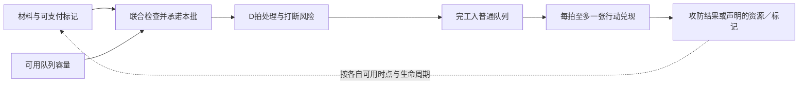

# 辅槽系统通用框架：诊断与优化候选

日期：2026-10-08。Project ID：game-002。文档角色：SourceRecord / 设计分析笔记。修订：0.2（按本轮生产权限决定收敛）。

来源原始状态：**Raw Idea / Unqualified**；本轮五项结构答复已完成局部资格确认，晋级范围见[通用框架素材](../materials/M-2026-10-08-augment-framework.md)。其余分析建议不随之晋级。证据：**Sourced + Derived + Hypothesis / NotRun**。本文件不是正式 Proposal、Evaluation、Draft Change 或 CurrentSpec。沿用用户“阶段1—4设计完成”的进度前提；不重启阶段、不以文档完成推定测试或平衡通过。

**本轮已确认：取舍为主、成长并存；跨法器以标记协同；生产侧只修改生成时间；量值修改落在生产出的行动卡上；标记检查成功才扣除；强弱以稀有度表达，其余直接说明效果。** 据此推荐定位为“在生成节奏与行动效果之间进行局部专门化的装配系统”。辅槽不修改制造材料消耗或每批成品张数。材料和队列仍是选择的后果与约束，不再是辅槽可直接改写的参数。当前最薄弱的环节是：原文承诺了差异化构筑，但多数例子没有交代高阶之外的选择理由；所写倍率也不能证明整场收益。

## 原始想法与触发来源

派发记录转述用户原话：

> 目前已经完成了1-4阶段设计，需要你新建一个对话处理新的系统框架设计 E:\Project\game\yanzhou\design\systems\augment-system，主要需要让其参考已有调研资料使用更清晰成体系的理论优化这个框架

本轮用户补充：

> E:\Project\game\yanzhou\inbox里，都可以阅读，注意本次仅是做系统通用框架

本轮结构答复：

- AUG-Q1：“取舍为主、成长并存（推荐）”。
- AUG-Q2：“以标记协同，不做法器直接加成协同”。排除直接加成，比原推荐“列扩展”更收敛。
- AUG-Q3：“为简化生产系统带来的负担，和生产效率相关的权限仅给生成时间，不给材料消耗和成品产出修改；量值修改落在生产出的行动卡数值上，其他的按推荐”。此项替代原推荐中的减料／额外批次张数权限，开放生成时间方向；全局Q与新事件链仍不列常规能力。
- AUG-Q4：“检查成功才扣，失败不部分支付（推荐）”。此项确认支付共同原则；增强失败后的基础分支、强制等待等具体落地仍需内容明示，不能由短选项扩大解释。
- AUG-Q5：“强弱用稀有度衡量，其他不设明显的分级上下关系，剩下的说明效果即可”。不再另设统一基础／中等／高级标签或获取阶段等级；稀有度名称、数量、倍率与获取分布未在本轮确定。

五项均已答复，这些确认不自动采纳本文件的全部具体规则建议。v0.1已在提交`26f8bf2`保留，包含最初候选和当时Q1／Q2答复；本版按新增决定收敛，不抹去先前分析。

输入为三份工作树文件：[定位](../../design/systems/augment-system/positioning.md)、[规则](../../design/systems/augment-system/rules.md)、[示例](../../design/systems/augment-system/examples.md)，以及[既有研究来源记录](2026-10-04-feishu-design-stage-research.md)。三份目标文件为未跟踪输入，原文保留；标签分别为 Archive / Qualified、Archive / Qualified、Archive / Reference。未找到这三个路径的已提交历史，标签不能独自证明采纳，也不取消其可能已有的资格。

新增允许的阶段材料见文末阅读清单。其中“用户确认”小节作为既有确认记录承接；Raw、Illustrative 段落与其区分。阶段交付页中较早的“待确认／下一步”等字样不覆盖本轮进度前提。未把整个 inbox 或设计完成声明升级成所有细节都已正式采纳。

## 一、当前框架诊断

以下按影响排序。确定矛盾包括原文内部矛盾与已读接口差异；后者注明依据层次。这里只判断文档与逻辑，不宣布玩家已经体验到问题。

| 优先项 | 类别与证据 | 对框架的影响 | 本轮处理建议 |
| --- | --- | --- | --- |
| A1 成长目标和构筑目标混用 | **设计取舍**：positioning §2、§4、§5 同时承诺数值晋阶、不同打法；examples 多为基础→中等→高级替换 | 同成本、同可用性、同条件下较高效果可能支配较低效果；但未核对获取成本前，不能宣布所有高阶都严格占优 | 区分“同方向变强”与“换方向适应”；横向方案必须写一个值得选择和一个不值得选择的情境 |
| A2 与标记的关系前后相反 | **确定矛盾**：rules §5.3 禁消耗；examples AUG-C02 消耗祝福；新增阶段材料记录法器消耗标记为用户确认方向 | 把辅槽彻底改成被动百分比，会撤掉阶段成果中的反向联系 | 承接标记读取／支付接口；不以“简化”自动撤销已有方向。各个消费效果仍需独立合同 |
| A3 局部作用与跨法器叠加混淆 | **确定矛盾**：rules §1.3 单法器；examples AUG-D03、AUG-S02 为跨法器，套组A把另一法器的暴击算给剑击 | “共享状态形成组合”与“加成直接跨法器”没有分开，收益归属不清 | 记录来源法器；共享标记可以连接各法器，但不继承别人的辅槽倍率。用户Q2已排除本版法器直接加成协同 |
| A4 成长层级在取整后失效 | **确定矛盾／推导**：rules §4.3 全上取整；examples 提纯下取整又声称累计5次多1；TL-37普通效果量为最终下取整 | 按原文上取整，3点的+10%和+30%都为4，1资源的+50%和翻倍都为2；无余数规则时，5次floor(1.2)仍为5 | 保留旧算例用于诊断；通用框架沿参数域处理取整。升级是否有效以实际离散结果检查，不擅加余数账户 |
| A5 槽位、实体、选项混为一谈 | **确定矛盾／接口差异**：统一1→2槽、同时1枚、超过4槽不做；TL-41按法器声明且原则≤核心槽，TL-26一实体一位置 | 3—4个推荐不是3—4个槽；可用效果不是无限实体副本；打造空位不赠铭文 | 分开“已开放槽数、可装配实体、兼容候选、推荐展示数”。保留按法器声明，不新增统一槽数 |
| A6 额外张数晚于容量承诺 | **确定矛盾／接口差异**：rules 在完工时算张数，却在开工预留2格；“Q≥2”没有扣实际占用 | 可能超额承诺，且更多牌会延后攻防／取消时刻 | 原示例问题保留；Q3已移除辅槽增产张数权限。既有批次仍按开工前声明张数预留可用余量，完工兑现原承诺 |
| A7 效果域与叠加域未定义 | **确定矛盾／设计缺项**：rules同类相加，套组相乘；精准从伤害增加变成降费；“效果+20%”套到取消 | 无法判断改变的是量值、次数、资格还是费用；同名效果在不同法器上换义 | 每项修饰声明具体参数／步骤、专属适配及替代范围；取消权限不自动百分比增强；不同量纲不相加 |
| A8 D禁止理由不成立 | **推理问题**：“D是唯一处理耗时”不推出“D不能被修饰” | 把参数模型与内容权限混成同一不变量 | Q3已开放生成时间方向。建议只在开工前确定本批D，保持D≥1；这与给当前批次动态改速不同。详细快照与叠加仍为落地建议 |
| A9 标记扣费可能早于成功开工 | **新增阶段接口差异**：详细规则§5先扣标记，指定层数不足也扣完失败；TL-30足额检查后支付，不部分支付换效果 | 可能缺位时白扣标记，或把制造费、状态消费、卡效费混账 | Q4已选择检查成功才扣、失败不部分支付。候选据此组织；旧“不足扣完失败”语义不再作为本版默认，权威正文未静默改写 |
| A10 入行与产出标记边界不齐 | **新增阶段接口待核实**：标记定义由行动结算产生，详细拍序又在完工阶段写延迟标记具现化；辅槽旧表在完工附加效果 | 若是写入将来效果，与实际生成状态不同；后者可能提前绕过队列 | 辅槽完工阶段只交付已承诺行动；额外标记经行动生效或已声明定时事件产生。完整定时事件语义留阶段成果接口核对 |

### 量化承诺分级

原文中的数字保留为来源记录，候选正文不将它们当实测或统一预算。

| 数字／说法 | 现有证据身份 | 可合理使用的方式 |
| --- | --- | --- |
| 注意力40/35/25；“当前”浏览10秒、理解15秒、总30秒以上 | 未附观察记录，来源及用户确认状态Unknown | 移出事实陈述；若后续提供研究记录，再按实际范围使用 |
| 15秒、90%理解、80%成长感、70%升级等 | 文中写为目标，未见目标制定依据 | 可保留“原输入目标、依据待核”，不能作为已证实阈值或理论推论 |
| 战1—5／6—15／16以后、50—150金币、累计伤害解锁 | 三文件为设计建议；新增阶段打造表明确Illustrative | 属内容与经济参数，通用框架只声明由谁制定和检查机会成本 |
| 单卡3→4、11→18与战斗力+130%、+150%—200% | 前者可按其假设算术核对；后者缺统一衡量对象、时间窗口和反事实基准 | 展示单张效果、批次张数、开工成本、兑现时刻；不汇总成无依据的整局战斗力百分比 |
| 产标记卡3张、耗标记卡2张，所以“可持续／平衡” | 阶段交付中的设计推测 | 条目数量没有包含实际获取、开工频率、标记消耗量与队列；不能证明收支或平衡 |

研究可指出证据不足；不能据此声称用户从未确认这些数字。

## 二、少数方法如何串成设计逻辑

本轮使用顺序是：**目标与分工 → 选择及反馈 → 资源和兑现链 → 组合形成与失败 → 规则表达**。这是本轮设计者整合，未发现任何来源提供一套完整“辅槽理论”。

下表明确区分：课程原有操作流程、视频讲述／转述的分析框架、有情境与反例的局部方法／建议、研究者及本轮设计者的跨源整合。GMT技能只用于区分目标—手段—工具与证据，不等同视频中的目标—障碍—工具，也不构成额外玩法依据。

| 方法与来源性质 | 解决的问题 → 分析与具体改动 | 适用条件／反例 | 将来如何观察（未执行） |
| --- | --- | --- | --- |
| **功能目标到规格**：课程原有流程，[GDD P31 01:59、03:00、05:48](https://www.bilibili.com/video/BV1pgNZ6JERH/?p=31&t=119)。**MDA**：视频讲述，[规则P14 00:36、01:16、02:55](https://www.bilibili.com/video/BV1B1KY6GEte/?p=14&t=36)；**目标／障碍／工具**：[核心系统P13 03:43—05:16](https://www.bilibili.com/video/BV1uP8t6uExH/?p=13&t=223) | 原文以“战斗力成长”代替系统分工 → 先写玩家想解决的瓶颈、可选配置及可观察结果；把“法器越强越满足”降为假设；建立下节职责表 | 适合检查规则到行为的中间环节；不证明专门化更有趣，也不要求每个升级都引入新决策。MDA原论文未核查 | 能否说出本次配置解决什么问题；是否因瓶颈变化调整；成长感是否来自实际变化而非等级图标 |
| **决策五环节＋短中长循环**：视频转述框架，[核心P17 00:52—02:41](https://www.bilibili.com/video/BV1pLbk6PE1g/?p=17&t=52)、[P19 00:02—02:49](https://www.bilibili.com/video/BV1pLbk6PE1g/?p=19&t=2)，原书未核查。补充获取选择反例：[Snap 39:00—41:10](https://www.bilibili.com/video/BV13dMp6kEsD/?t=2340) | 把推荐数和15秒当选择质量 → 分别写玩家已知信息、可用实体、装配动作、状态后果和反馈；推荐仅筛选视图，不隐藏其他合法候选；区分一次装配、一次战斗、本局成长 | 快速熟练选择不必是假选择，长思考也不必有深度；获取候选太少时“完整展示”仍不创造有效选项 | 比较理由是否对应真实成本；后果能否被正确归因；玩家是否因缺实体而看见大量不可用假选项 |
| **资源流及强化／平衡反馈**：视频框架，[核心P42 00:37、06:15](https://www.bilibili.com/video/BV1pLbk6PE1g/?p=42&t=37)、[P43 00:40、03:36以后](https://www.bilibili.com/video/BV1pLbk6PE1g/?p=43&t=40) | 把旧多产牌、减料和单卡倍率直接折算战力 → 放进材料→预留→加工→排队→行动→标记／资源的链。本轮Q3收敛后，只考察生成时间及行动量值如何改变这条链，分辨完工与兑现速度 | 图只能提出问题；缩短D可能使单位时间材料需求提高，也可能被缺料／缺位抵消；标记上限只限制存量，不证明持续周转有平衡点 | 缺料、缺位、过期、空放各发生在哪里；更快完工是否真的更早生效；付出的标记是否挤掉更有价值的用途 |
| **组合形成检查**：研究者跨源整合，依据[协同04:30—07:20](https://www.bilibili.com/video/BV1ojT16CESu/?t=270)、[入门P29 02:08](https://www.bilibili.com/video/BV1uiNc6KEqq/?p=29&t=128)和资源框架 | 原文只展示成型套组 → 分条件提供、积累／保持、兑现、放大、补弱点；每个候选写未成型、获得／放弃成本、失败与转向。把纵向升级和横向适配分开 | 分类为分析角色，不是新卡类或作者原有体系；一个部件可承担多角色。案例的抽牌、删牌和遗物不迁入言咒 | 缺一环时还是否可运行；转向是否保留可用库存；为何有人选择基础可靠方案；强组合是否仍有明确失效情境 |
| **共用规则／卡面例外＋重读与直觉预测**：规则课局部指导，[P25 00:32、02:41](https://www.bilibili.com/video/BV1B1KY6GEte/?p=25&t=32)；产品局部方法，[Snap14:26—15:15](https://www.bilibili.com/video/BV13dMp6kEsD/?t=866)、[49:20—49:55](https://www.bilibili.com/video/BV13dMp6kEsD/?t=2960) | “一句话”压掉支付、来源和时机 → 玩家短说明、规则详情、边界示例一一对应；共享合同放共用规则，改变直觉的例外放卡面；不给“暴击”命名无概率常驻增伤 | 短文案可能靠大量前置知识；过多例外可能抵消共用规则收益。该方法不提供叠加或完整事件总序 | 先让读者预测，再解释；分别记重读、猜错和找不到规则，不能用“读完了”替代理解 |

关键卡牌论点本轮回查了上述Snap、规则P25、协同的本地字幕片段；其余方法据冻结研究目录转引，没有宣称重读全课或原书。覆盖限制见文末。

## 三、可审阅的优化框架 v0.2

本节为**设计候选**。继承规则、既有确认方向、本轮推荐均标出；下面的职责分类是工作语言，不新增系统ID、铭文身份或内容卡池。

### 1. 定位与系统分工

辅槽让玩家在**保持法器核心用途可辨认**的前提下，选择它的生成节奏、行动效果强度和简单标记互动。预期行为是：玩家能够解释选择的收益与放弃项，看到对应后果，并在后续战前重配或投资。成长的可见性服务这一循环，不预设辅槽必占多少注意力或战斗力。

| 对象 | 所回答的问题 | 与辅槽的接口 |
| --- | --- | --- |
| 法器与核心铭文 | 能合法制造什么、以什么能力与配方运行 | 沿TL-39／40／44确定核心；辅槽不补缺核心、不新造自由目标槽。铭文不是只负责“微调类型” |
| 辅槽位置 | 哪个词义／步骤允许被修饰，装得下几枚 | 沿TL-41／28预设挂接、按法器声明；空槽合法；槽位数不等于候选数 |
| 修饰铭文 | 已有运行方式的哪一部分被改变 | 一个实体占一个位置；同名多装需真实副本。专属适配须明确，不能给同名词偷偷换义 |
| 核心契合 | 特定法器与核心组合有什么额外优势 | 与辅槽分别标注来源，形式及叠加沿其采纳接口；不默认再造一个重复倍率层 |
| 生产与战斗行 | 何时能开工、占多少容量、何时产生实际结果 | 辅槽只可修饰生成时间；配方材料消耗和成品张数仍由基础内容决定。普通排队、容量预留和完工不等于生效继续沿用 |
| 标记 | 状态属于谁、如何形成／保持／支付／失效 | 承接阶段记录的行动产生、法器可消耗；辅槽声明读谁、在哪一步读／支付、改变谁。条件以简单标记关系为主，不自行新增队列／资源状态判断树 |
| 获取与打造 | 哪些实体可得到、何时可投资、牺牲什么机会 | 获取提供实体；打造提供槽位容量；装配分配已有实体。三个动作分别支付、分别反馈，不凭解锁槽位赠送效果 |

**权限边界**：Q3将生产侧集中到生成时间，Q2将跨法器联系集中到标记。材料消耗、成品张数及法器直接加成协同不进入本版，也不换名为“效率”重新纳入。量值修饰作用于既有行动卡的明确数值；简单标记条件／支付可服务时间或行动效果。全局Q与新事件链只保留非通用扩展接口，未因此获得内容授权。

**“生成时间”的工作解释**：对应现行唯一处理耗时D；没有增设冷却、独立周期、完工交付等待，也不把排队耗时算作可直接扣减的D。下文“开工确定本批D”是为实现这项方向提出的落地建议，用户本轮没有单独裁定动态改速细节。

### 2. 玩家选择与成长循环

一次装配的完整链应包含五个环节：

1. **掌握情境**：法器核心用途、真实铭文库存、材料要求、队列承诺、标记条件和已知威胁。没有敌情或触发保证时只显示条件结果，不伪装成确定预测。
2. **看见选择**：先展示当前兼容且持有的候选与推荐理由；允许查看其他合法选项、获取状态和占用位置。“未持有”“已占用”“不兼容”分别显示。
3. **比较并装配**：说明改了什么、获得什么、放弃什么。先沿允许的战前编辑；战中重铭仍不由本框架开放。替换释放旧实体回库存，不默认为销毁、卖出或合成。
4. **承担结果**：配置决定后续批次的差异；材料、容量、时间、标记机会成本真实存在；既有批次保持承诺。
5. **收到反馈**：显示本批D、实际完工与生效时刻、行动量值及条件成功／失败；区分提前完工与因排队未提前兑现。玩家能把结果归因到本次装配，再决定继续、换向或投资。

下面三条是设计分析维度，不是玩家要学习的等级树。按Q5，玩家侧用稀有度表达强弱，其余只说明效果和条件，不再并列基础／中等／高级、用途等级或获取阶段等级：

| 线 | 本轮推荐 | 取舍及边界 |
| --- | --- | --- |
| 横向适配 | 获得不同修饰实体，在较早完工、提高单张效果及保留／支付标记之间选择 | 材料与队列是这些选择的限制；选项价值随情境改变，不要求每种都等强，不靠隐藏合法选项制造选择 |
| 纵向成长 | 以稀有度标识强弱，用效果文本和实际变化说明收益 | 稀有度是强度标识，不替代不同用途的情境比较，也不自动给定倍率、价格或掉率；实体合成／升级操作当前未采纳，本轮不新增 |
| 修饰容量成长 | 沿TL-42打造新增／解锁辅槽，让已有实体能共同装配 | 投资与其他本局资源用途竞争；槽位不是直接增伤，不预设每法器1→2，也不引入槽位等级 |

一次选择的反馈在装配预览出现，行动后果在战斗中兑现，投入与转向在本局跨战延续。新局沿SYS-006不继承局外数值成长；打造结果的详细持久范围仍应沿正式接口落实。可以有线性阶段，但不能把“战外”写成跨局永久强化的默认授权。

### 3. 效果分类与权限

分类按**修改的位置**组织，仅用于设计核对；玩家看稀有度与效果说明。阶段材料中“专注＝减料、蓄言＝额外行动”的确认记录保留，但其作为本版辅槽权限已被用户Q3新决定替代。未来内容整理时退出对应效能，不把同名效果偷偷改成加速，也不重发旧ID。

| 类别 | 改变什么 | 必须声明 | 不能靠类别名推导的能力 |
| --- | --- | --- | --- |
| 行动量值修饰 | 本法器行动中明确的伤害、护甲、资源量或标记量 | 量纲、固定增量／倍率、来源、读取和取整阶段 | “效果增强”不自动增加取消资格、目标数量、持续时间或事件次数 |
| 生成时间修饰 | 本法器生成这一批行动所需的D | 时间单位、适用条件、何时确定本批D、正整数且至少1拍、叠加与失效 | 不减制造材料、不增成品张数；不减少普通排队，不将D改成0，不获得插队或同拍多张生效 |
| 条件化修饰 | 上述变化何时有资格 | 简单条件、读取／支付区别、检查时点、失败分支 | “实时条件”不是持续重算已承诺批次；共享标记不让他器倍率自动继承 |
| 非通用扩展接口 | 全局Q改变、新事件链等；不含Q2／Q3排除项 | 覆盖的规则、对象与范围、持续和结束、递归边界、与原职责关系 | 未作为本版常规辅槽；不得借例外恢复减料、增产或法器直接加成协同 |

简单标记条件可叠在行动量值或生成时间修饰上；它不是与其他类别互斥的新卡种。行动生成资源的数值与法器每批成品张数不同：前者若属于既有行动的明确量值，可在行动侧讨论，不能因此让法器直接交付资源或多产行动。条件数量也不作为统一复杂度分数。复杂度优先放在**少量可复用的共同概念**和明确关系中，避免每张卡分别发明一种支付时序或计数器。

### 4. 通用结算合同

本框架不新写一套总拍序；沿SYS-002／003以及阶段成果中有明确确认的接口。每个辅槽只需把以下字段填清楚，不能由示例或UI补规则：

> 来源法器与挂接位置 → 修改的参数／步骤 → 条件和宿主 → 检查与承诺时点 → 支付及结果 → 失败／零值 → 叠加与失效 → 反馈。

**开工侧。** 基础内容决定本批材料与成品张数，辅槽不修改它们。沿TL-05检查材料与全部预留；可用容量为Q扣除已入行牌、有效预留及本拍中断后待下拍复用的容量。生成时间修饰推荐在开工前算定本批D，满足正整数且至少1拍；沿a+D完成。本批成立后不因标记变化反复改写完成时刻，不重设已有进度。这个快照建议待接口复审，不冒充用户已确认的动态改速细则。完工将原预留转为行动，不新增张数。

**标记支付。** Q4确认先完整检查、成功才扣，指定数量不足不部分支付。制造侧的联合检查包含该批原有材料与容量，不能缺位仍先扣标记。标记支付可用于已声明的生成时间／行动量值增强，不能绕回Q3排除的减料／增产。具体推荐：可选增强不成立时走已声明的基础分支，该分支也要满足自身条件；强制条件型不满足则等待。两类不能混写；分支语义仍待内容声明。按实际消耗量产生比例结果须单独定义。旧“数量不足扣完并失败”保留在来源，已不作为本版共同默认。

多个法器竞争同一标记时，推荐在既有逐法器开工检查中检查并提交，后者看到剩余量；不额外引入另一套同时支付优先级。行动结算侧的标记支付沿阶段成果；是否同拍可被开工使用、打断后标记如何返还，必须由状态生命周期与批次接口明确，不能从“资源下拍可用”自动套到所有标记。本轮仅标接口，不改全局标记时序。

**行动侧。** 来源法器、批次、修饰规则随批次承诺保留；若声明“生效时读取目标标记”，规则已承诺，但层数届时读取，不把开工快照冒充生效状态。先确定合法目标和名单，再在声明时点读／付标记；失败保留已完成的合法结果，未执行支付不冒充已付制造费。入行、翻开、伤害命中、生成资源／标记分别是不同事情。

**数值与叠加。** 普通效果量沿TL-37合并固定增量、应用已声明倍率，最终下取整且非负；费用、D、容量、次数分别按其参数域。候选推荐同来源同量值的加成归入一个明确叠加域；互斥改写禁止同装或声明顺序，契合／标记／辅槽多来源没有合同就不暗设乘区。不同法器共享标记时也各算本法器结果。取消等权限式结果用合法范围和次数表达，不套伤害百分比。

**事件与结束。** 修改“行动产出标记量”不让法器完工即生成标记；只有已声明的行动／定时事件可真正产生状态。新增触发要声明最多次数、能否触发自身及结束条件。标记达到上限不等于闭环安全，D≥1与每拍一张也只限制部分速率，不能替代收益与持续触发审查。

### 5. 资源链与失败路径

这张图用于追踪接口，不是完整结算顺序。只有内容明确的产出与消费才存在回边。

检查一条组合时分别填写：谁提供条件、谁积累／保持、谁兑现、谁放大、谁补弱点。并说明缺部件时怎样运行，哪个真实获取机会被放弃，何时可能转向。一个配置若由同一部件无条件包办所有环节，应解释还剩什么投入和限制；但不把“自洽”本身判作错误。

本版最需保留的失败路径：缩短D后仍缺料／缺位；提前入行的攻牌排在后续防护前，反而错过应对窗口；D已经为1时加速没有有效空间；消费标记导致后续爆发失去条件；条件组件先来、产出组件未到；量值提高却只增加溢出结果。生成更快可能增加单位时间耗材总量，但不改变每批配方，这正是应显示的间接代价。v0.1的“减料至零导致供料失去控制”“加张数拥堵”保留为原方向失败路径，本版排除对应权限后不再作为待实施机制。

### 6. 三个用于检验分工的配套例子

以下均为结构示意、Derived／Hypothesis，不是发行数值、不占用新卡ID、不声称验证。变量由正式内容填写。

| 情境 | 可比较的方向 | 为什么有取舍 | 反例／失败与反馈 |
| --- | --- | --- | --- |
| 同一法器选择较早完成或单张更强 | **生成时间方向**与**行动量值方向** | 材料与可用容量充足且存在截止窗口时，较早完成可能有价值；排队饱和时，单次行动机会的量值可能更重要 | 加速被等待抵消、D已到下限，或增伤全是溢出，均是失效情境。相同配方、张数下比较D与行动结果，不制造减料／增产条目 |
| 防护法器需要赶上已知威胁 | **较早生成防护行动**与**提高该行动的防护量** | 前者争取生效窗口，后者承担仍按原节奏兑现的风险；收益依普通队列和可见威胁而变 | 赶到完工但尚未翻开，仍无保护；能按时生效但量不足也可能失败。预览分开开工、完工与实际可生效时刻，不显示抽象战力排名 |
| 两台法器通过既有标记联系 | **保持／增加标记供后续行动兑现**与**支付标记换本法器生成时间或行动量值收益** | 来源法器只改自己，共享宿主状态形成间接协同；同一层标记不能同时留给后续爆发又支付当前增强 | 自动把标记吃光可能毁掉下张行动，标记上限也不消除此机会成本。显示消费宿主和数量；不新增法器直接给他器加成 |

第三例保留跨法器构筑，但没有让A的辅槽直接给B乘倍率。原“循环”“沉星专精”的直接联动仍保留在原始输入供追溯，依本轮Q2不进入本版框架，也不继续列为默认后续扩展任务。

### 7. 信息表达三层

| 层 | 应回答什么 | 内容示意 |
| --- | --- | --- |
| 玩家短说明 | 装在哪里、改什么、关键条件／代价 | 时间型：“缩短本法器生成时间，最少1拍；成品仍进入普通队列。”量值型：“提高本法器行动中指定的效果量。”实际修饰幅度与标记支付必须明写，不能藏入详情 |
| 完整规则 | 归属、检查、支付、承诺、叠加、失败、结束 | 列出明确参数域与所覆盖规则；普通队列、实体占用等通则统一引用 |
| 对照示例 | 在边界情境会发生什么、为什么 | 容量不足不开始；完工不立即生效；标记不足按声明分支；其他法器的加成不串入 |

装配比较优先突出变化项“生成时间D、行动卡量值、标记条件与支付”，并提供原配方、成品张数、预留及排队作为上下文。确定值与条件值分开，不给虚假的综合战斗力。稀有度表达强弱；具体选择仍可查看“争取生效窗口”“提高单次行动效果”等作用，不再给用途或获取阶段另设等级。

## 四、本批结构选择

已经有答案的部分直接继承：核心必填／辅槽可空、预设挂接、一实体一位置、按法器声明槽数、打造新增／解锁、普通队列与批次承诺；新增阶段记录的标记宿主、标记消费方向不重问。专注／蓄言原方向已按Q3新决定替代，不再作为本版权限。

本批五项均已回答，下表保存选择与影响，不继续重复追问。答复确认本批结构，不扩展到未列出的具体内容、数值、实验或正式规则回写。

| 编号 | 需决定的结构 | 推荐与理由 | 替代项与影响 | 依赖／状态 |
| --- | --- | --- | --- | --- |
| AUG-Q1 | 辅槽以何种价值为主？ | **局部专门化与构筑取舍为主，可见数值成长并存**。符合材料、队列、标记已存在的不同成本 | 成长替换为主：可以保留清楚的强弱梯度，但降低“不同打法”为主要承诺，不再把替换数量算多样性 | **已确认推荐项；用户本轮答复** |
| AUG-Q2 | 跨法器关系在哪一层发生？ | **用户选择：以标记协同，不做法器直接加成协同**。已移除原推荐中“直接增益列扩展”的部分，来源与支付仍可追踪 | 原“直接联动常规化”选项未选；旧例保留为来源，不加入本版或默认后续任务 | **已确认用户修订项**；不撤销已确认标记互动 |
| AUG-Q3 | 生产与量值权限 | **用户修订：生产效率只给生成时间；不给材料消耗和成品产出修改；量值落在行动卡上，其他按推荐** | 原减料／额外张数推荐退出；全局Q与新事件链仍非通用。生成时间对应D的详细快照待接口复审 | **已确认用户修订项**；无具体数值 |
| AUG-Q4 | 标记支付与失败语义 | **检查成功才扣，失败不部分支付** | 旧不足扣完失败退出共同默认；是否回退基础分支、退款等不由短答复推定 | **已确认推荐原则**；分支与生命周期保留待明示 |
| AUG-Q5 | 强弱与效果表达 | **强弱用稀有度衡量，其他不设明显上下分级，说明效果即可** | 原统一三阶与多套等级标签退出；稀有度不直接给出通用倍率／获取公式 | **已确认用户修订项** |

## 五、可能带来的玩家体验与验证问题

暂定标签：系统框架／装配成长；预期体验为可预测的专门化、构筑掌控与可见成长；风险为固定最优、自动消费违背意图、收益无法归因、规则例外膨胀。均为假设。

| 假设 | 最低限度的后续观察计划 | 支持信号／反例与对应决定 |
| --- | --- | --- |
| 情境变化能让不同辅槽值得选 | 获得另行实验授权后，用同一法器的时间／行动量值候选对照截止窗口、缺料、拥堵、标记稀缺情境；控制稀有度差异，观察理由和实际后果 | 理由与瓶颈相符且后果兑现，支持继续；若总选同一项，先区分稀有度强差、数值支配、信息缺失和实际候选不足，不直接加更多卡 |
| 标记自动支付符合战前意图 | 观察有另一项标记用途时的配置与预期，检查是否频繁发生“原本想留给下一张”的误用 | 能预料机会成本，才支持保留；若错误来自隐藏扣费，改表达；若知道仍无法控制关键策略，改自动消费结构 |
| 数值成长可见且不冒充选择深度 | 比较装配前后实际离散结果及玩家归因，记录无变化、过量、错过时机 | 有实际收益且能解释来源才支持；若只有等级变化，调整增量粒度／投放，不凭主观兴奋认定平衡 |
| 三层表达支持正确预测 | 给正常与边界情境，先预测再执行，记录重读、猜错和回查 | 误读发生在短说明则修文案；规则本身缺项则补合同。仅快读不支持理解，慢读不直接否定深度 |

本轮只做静态规则、来源、算术与链接核对。未运行Demo、模拟或真人测试；没有任意通过率、时限或样本量指标。未来是否执行和在哪个实现仓库执行另行授权。

## 六、资格确认记录与下一步

| 资格问题 | 当前答案 | 状态 |
| --- | --- | --- |
| 来源／设计对象 | 用户指定的辅槽三文档、授权阶段成果、冻结研究；对象为SYS-001／002／003／004／006相关通用接口 | Clear |
| 玩家情境／设计功能 | 战前配置与本局跨战投资；战中按批次承诺自动运行，观察瓶颈与兑现 | Clear；Q1已确认取舍为主、成长并存 |
| 行为／可见影响 | 在生成时间／行动量值及简单标记关系中比较并分配实体；以稀有度看强弱，以效果理解用途 | 设计约束Clear；实际玩家行为仍Hypothesis |
| 价值 | 将成长、组合选择和规则表达拆开，使每项可检查 | Hypothesis；NotRun |
| 与已有设计关系 | 继承核心／辅槽、生产与队列；承接标记方向；Q2—5明确限定权限、支付和表达；与旧方向差异已列 | Clear；没有静默回写旧正文 |
| 主要未知与下一步 | 本批D确定方式、批次标记退款／可用时点、多来源叠加、稀有度档位与强度映射；后续接口与内容合同处理 | 未知范围及方法Clear；具体答案Unknown |

资格结论：**本轮五项通用结构已通过局部资格确认**，生成[MAT-2026-10-08-augment-framework](../materials/M-2026-10-08-augment-framework.md)，与本来源双向追踪。本文中的逐项结算建议和示意内容不随之整体晋级，研究Raw也未原封不动变为正式设计。未生成P／E／D或回写CurrentSpec，本轮通用框架交付完成。

后续三文档整理建议：positioning集中维护定位、职责与选择成长；rules集中维护兼容、权限、承诺和接口；examples只保留覆盖不同取舍与失败的少量例子。正式回写前明确三文件与SYS权威页的职责，避免再形成竞争规则源。本轮原件未改、未删除独有失败路径、未提交未跟踪输入。

本轮检查：28项输入文件哈希与阅读表一致；6份精选研究文件与冻结清单一致；本地Markdown链接存在；代码围栏配对；取整反例算术复核一致。三份用户指定框架的SHA与开工时相同。以上均为静态文档检查，不是玩法验证。

## 附：本轮阅读范围与版本

模式：**CUSTOM／HEAD＋用户指定工作树**。基准HEAD：`ccde0c238ace73135133052b0ee52f3c2b6e6de7`。起始分支：`codex/2026-10-07-resource-mechanisms`；本轮任务分支：`codex/2026-10-08-augment-framework`。

范围变更：本轮用户明确授权`yanzhou/inbox/`全部可读；实际只读取下表必要章节。操作规则读取根AGENTS／README、workspace-map、github-collaboration、yanzhou/AGENTS、探索start／AGENTS、design-workflow、document-contract及登记模板README／idea-template／qualified-gdd-material-template；这些不是额外玩法证据。应用grill-with-docs与game-design-reality-check及其project-integration／reality-check-framework／gmt-framework，未启动子代理。

排除：augment-system-archive、archive旧项目、其他探索（含阶段资料链接的DIR-038正文）、new-roguelike、外部实现、未另授权的sources/inbox阶段三文件；未读取卡池35张和辅槽20条的完整清单。没有联网新增理论或重跑BiliSum。

研究根R：`E:/Project/hotspot-collector-data/video-notes/2026-10-04/feishu-design-stage-research`。delivery、methods、guidance、dossier、fragment、supplementary六份文件哈希均与frozen-delivery.json一致。319输入章节不是319章完整语义复核；覆盖为65单视频＋13选章课程，3源／27章无字幕，73卡牌候选中44重点回查、29仍弱线索。精确结算、通用定价、卡池与平衡校准缺成体系依据。本轮回查字幕只覆盖下列局部范围，未看画面、未读原书。

版本表中的SHA-256固定整个实际文件；“读取范围”限定本轮证据使用。未跟踪文件的保存与发布仍由其原责任方处理，不因本表记录而成为本次提交内容。

| 实际材料 | 读取范围／状态 | SHA-256 |
| --- | --- | --- |
| yanzhou/design/systems/augment-system/positioning.md | 全文；未跟踪；用户指定 | `67f9b9e6ee21c99093db883aa6a98ff076d4ff4fba39b576b31fc5b0738c4c15` |
| yanzhou/design/systems/augment-system/rules.md | 全文；未跟踪；用户指定 | `ba52f008a7a590a42094de029604fadbb2ad6b8711d841cb0a86c534585bb96c` |
| yanzhou/design/systems/augment-system/examples.md | 全文；未跟踪；用户指定 | `58cc32735dc2c1b8099ed5847d3faa2d799868d6d4e85fa02a3b6d84799b3cb5` |
| yanzhou/design/systems/01-grammar.md | 全文；TL-01/02/26–28/39–45；HEAD同版 | `e1d22284908067d99987e370d1d75dbf264e4a65f77484ece8b49c5442313a33` |
| yanzhou/design/systems/02-wands.md | 全文；开工/预留/完工/中断/路由；HEAD同版 | `0cf6446287433e915e560de3cb711f8431e92848a189214085066274677bd662` |
| yanzhou/design/systems/03-combat.md | 全文；普通行/拍序/支付；HEAD同版 | `2cce84a110e23a9c8372b1d05b38afb4154ee7c7a1a711a21ee3b6847b89a56e` |
| yanzhou/design/systems/04-elements-environment.md | 全文；材料/数量/来源/有限事件；HEAD同版 | `77d9d05c7b2e90b7d51e40dd48f8cdd111455be7a90d033655732e8bd6bbe6fe` |
| yanzhou/design/systems/06-rewards-growth.md | 全文；本局库存/获取/打造；HEAD同版 | `65945bbad2243f667dda9cc37a8a8f684097e5d8c601fb07cdc8fa6608792299` |
| yanzhou/design/content/cards.md | 全文；内容合同，不展开退役链接；HEAD同版 | `867dcde19976cf581e15818df9e3c41e69e8f41e951755155e079b56ca419a21` |
| yanzhou/design/content/wands.md | 全文；法器内容合同；HEAD同版 | `0c8b0352978eb720653c498835f6e555258a0b6604b890677159d3f5b2ec82ae` |
| yanzhou/design/parameters.md | 全文；参数域与未定量；HEAD同版 | `b283bc00b9dab7cfc5d6feed03438f17fb84270c10090a2c7b574345e604ea4d` |
| yanzhou/governance/decision-log.md | 标题定位；CORE-049—054对应小节；HEAD同版；其余决定未读 | `425e62554a77a1655b3baa35caed1bcce03560df3247e322ad5de094fb6ab68d` |
| yanzhou/sources/inbox/2026-10-04-feishu-design-stage-research.md | 1–87行来源/索引/边界；170–190行材料使用约定；HEAD同版；阶段旧进度不覆盖本轮用户前提 | `2471852b200ebf14f02c2bdb6fc0d48c4ff17ccffe269271f30b5b2db13ac8c3` |
| yanzhou/inbox/2026-10-08-action-cards-stage-delivery.md | 全文；未跟踪；用户本轮增补 | `08cfc166512a620cd444d4ab9ad244df34cb162f12bfd758be5192d413c6ba2b` |
| yanzhou/inbox/2026-10-08-action-cards-mark-system.md | 1–90行核心方向；418–429行边界确认；其余只限定检索定位；未跟踪；不展开卡表 | `5ed1cc5dbe621963447294cb8fec32b2bc5d1bfe4c2d58d9f2d2f1fe52c9a566` |
| yanzhou/inbox/2026-10-08-mark-system-rules-detailed.md | 1–35行定义；147–286行堆叠/消耗/拍序；其余只限定检索定位；未跟踪；不展开表现与标记表 | `b1dcfbfbb7432df8e64c664cbd82d8fc795c38605f234227a4eedd40ef5c4c9d` |
| yanzhou/inbox/2026-10-08-artifact-augment-effects.md | 1–92行框架和首条接口例；344–370行已有确认；558–625行打造/闭环；其余只限定检索定位；未跟踪；未通读20项效果 | `a6ad801015c976969a23f8d1eba653770597d77f0e7da08268f33d1e36468374` |
| yanzhou/inbox/2026-10-08-action-cards-pool-design.md | 1–45行原则和Illustrative说明；其余只限定检索定位；未跟踪；未通读35张卡 | `4fe43871392a4ec219942881aeead19abfc7dd58912f6141fd9f4f3d1fedaff9` |
| R/delivery-coverage.md | 全文 | `62b4dfa00fb6fd3f541a8b7611dad1a2e96534b670d455dd08e1f2c8402e1d23` |
| R/methods-catalog.md | 全文 | `dedb658b18d1aebac6039f8520f561549e06fafc1f1408980276acf2f0786cb3` |
| R/card-design-dossier.md | 全文 | `497e219cd5b36666c57f6aebd52ec266be39693da24ec1fa9369d40b17f9adcf` |
| R/guidance-catalog.md | 入门/规则/交互；组合/获取/平衡；信息/节奏/激励；选择质量/反馈 | `387c5d6f2c10bf069fba50b97a154a92262d6439bdc86e8d793044c2d7e964d7` |
| R/card-fragment-screening.md | 全文；定位而非全源审阅 | `f0fb0fac41ed77185469ada9a5c909c10fec8603d734afbcad6e02773665ef25` |
| R/course-supplementary-notes.md | 1–14行：规则P25 | `7ec6b239bd37a22688f4791ef37077725fabfe1d006beb9896e37c640dcacdbc` |
| R/frozen-delivery.json | 解析全清单；核对六份研究文件SHA | `d9fa57a908bf6f1c7fb87053ed7db27177287413aa69a31be60528e2a53b3f6e` |
| R/BV13dMp6kEsD-subtitle.json | 仅P1 14:26–15:15、49:20–49:55 | `b42310f982c2ba5f014c54f6a4db87580a5c05149cfd4c42f023ce3c71d84304` |
| R/chapters/BV1B1KY6GEte-p25-subtitle.json | 仅P25 00:25–01:02、02:30–03:10 | `2a08039e82464a0fa2382ee4469d9d47e30059e8a12b42cf05bf62bd673ecc29` |
| R/coordinator-checks/BV1ojT16CESu-subtitle.json | 仅P1 04:30–07:20 | `fb3d73c56e209a8f5456ec9c3640d902b4b5eaf4ca21ba9590429fe1a5680a9e` |
